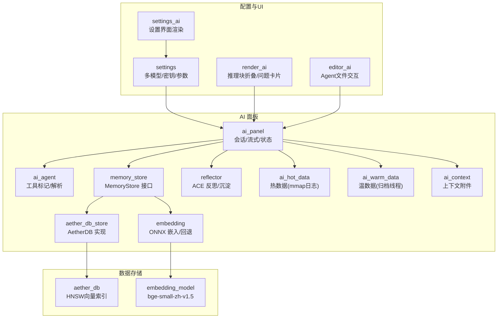
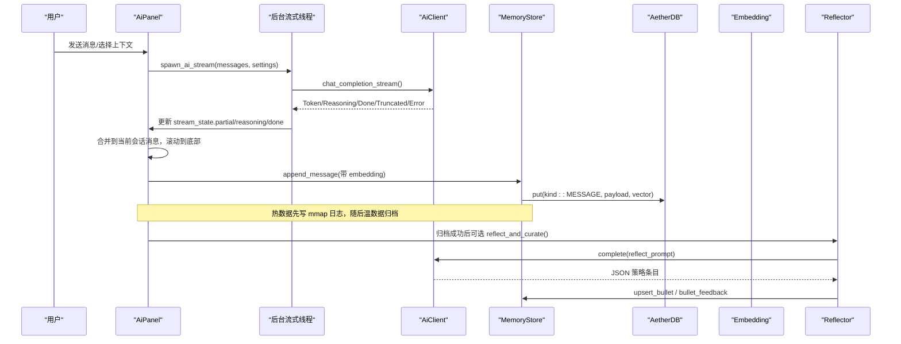
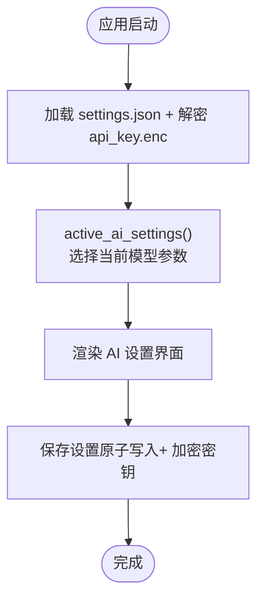
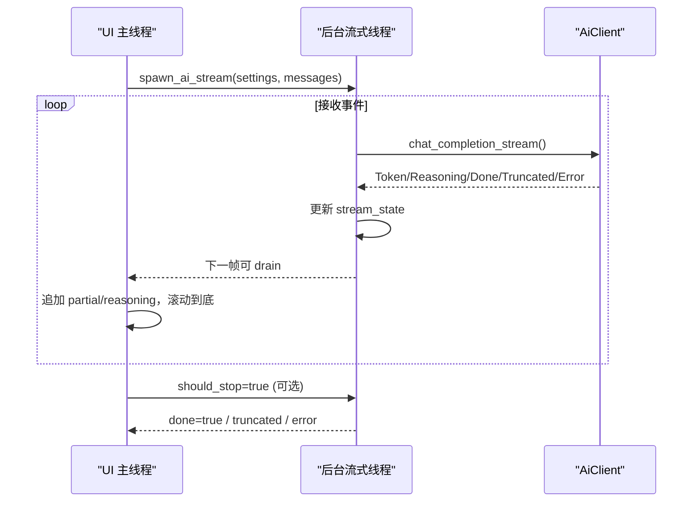
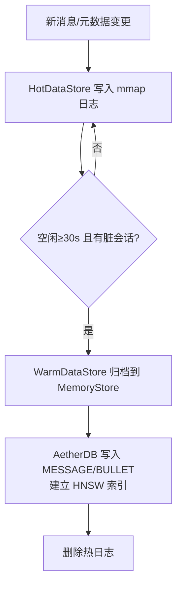
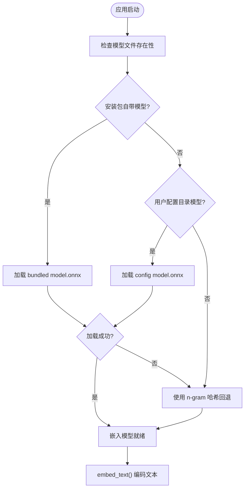
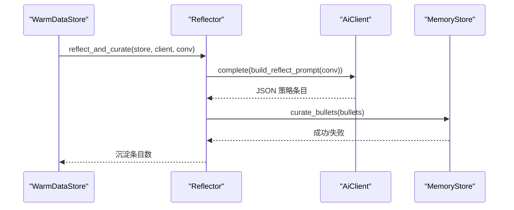
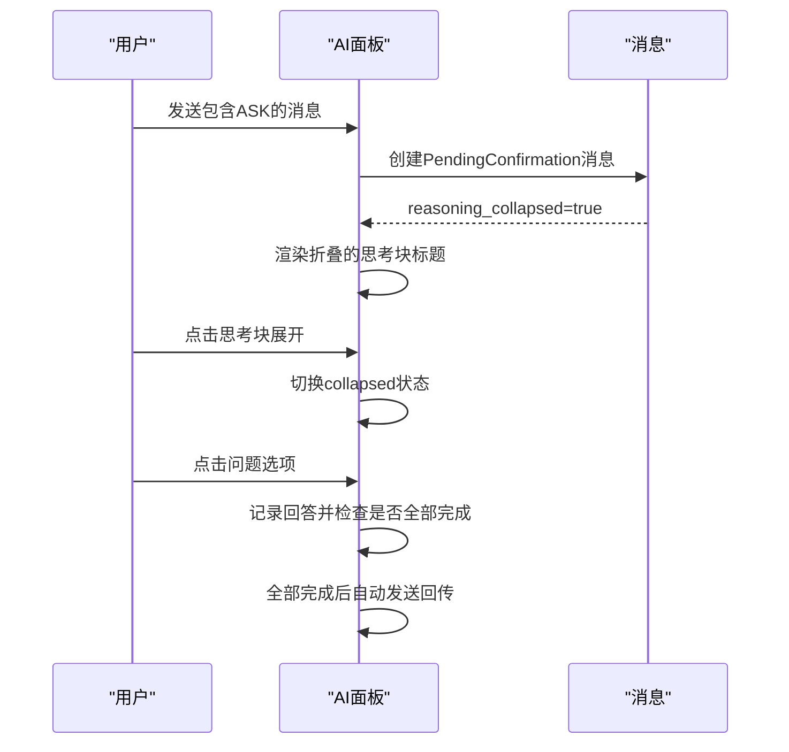
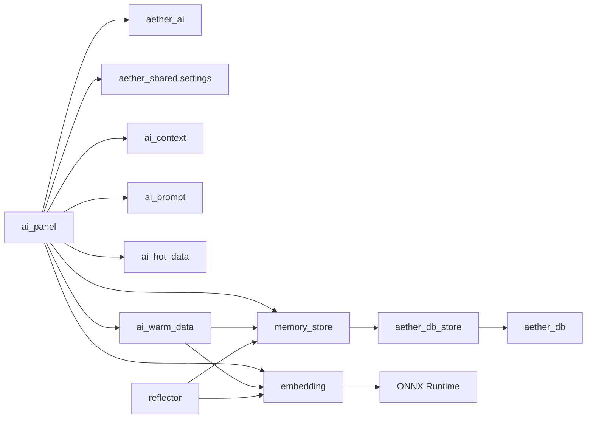

# AI 助手系统

<cite>
**本文引用的文件**
- [aether-ai-panel/lib.rs](file://crates/aether-ai-panel/src/lib.rs)
- [aether-ai-panel/ai_agent.rs](file://crates/aether-ai-panel/src/ai_agent.rs)
- [aether-ai-panel/memory_store.rs](file://crates/aether-ai-panel/src/memory_store.rs)
- [aether-ai-panel/aether_db_store.rs](file://crates/aether-ai-panel/src/aether_db_store.rs)
- [aether-ai-panel/embedding.rs](file://crates/aether-ai-panel/src/embedding.rs)
- [aether-ai-panel/ai_context.rs](file://crates/aether-ai-panel/src/ai_context.rs)
- [aether-ai-panel/ai_panel.rs](file://crates/aether-ai-panel/src/ai_panel.rs)
- [aether-ai-panel/ai_hot_data.rs](file://crates/aether-ai-panel/src/ai_hot_data.rs)
- [aether-ai-panel/ai_warm_data.rs](file://crates/aether-ai-panel/src/ai_warm_data.rs)
- [aether-ai-panel/reflector.rs](file://crates/aether-ai-panel/src/reflector.rs)
- [aether-shared/settings.rs](file://crates/aether-shared/src/settings.rs)
- [aether-win32/render/settings_ai.rs](file://crates/aether-win32/src/render/settings_ai.rs)
- [aether-db/db.rs](file://crates/aether-db/src/db.rs)
- [aether-win32/editor/ai.rs](file://crates/aether-win32/src/editor/ai.rs)
- [aether-win32/render/ai.rs](file://crates/aether-win32/src/render/ai.rs)
</cite>

## 更新摘要
**所做更改**
- 新增本地嵌入模型支持章节，详细说明bge-small-zh-v1.5模型的集成与回退机制
- 更新记忆存储系统章节，增强AetherDB向量检索能力的描述
- 扩展Agent模式章节，详细说明增强的文件交互功能
- 改进AI面板章节，更新推理块折叠行为和问题卡片支持的说明
- 更新架构图和流程图以反映新的组件关系

## 目录
1. [简介](#简介)
2. [项目结构](#项目结构)
3. [核心组件](#核心组件)
4. [架构总览](#架构总览)
5. [详细组件分析](#详细组件分析)
6. [依赖关系分析](#依赖关系分析)
7. [性能考虑](#性能考虑)
8. [故障排查指南](#故障排查指南)
9. [结论](#结论)
10. [附录](#附录)

## 简介
本系统为编辑器内置的 AI 助手，提供多 AI 提供商统一接入（DeepSeek、Kimi、OpenAI 等）、Agent 模式（对话管理、工具调用、上下文维护）、流式响应与 UI 同步、记忆存储（对话历史、嵌入向量、语义搜索）以及安全与权限控制。通过"热/温/冷"三阶段持久化与 ACE 反思沉淀策略，实现高可用、可演进、可检索的智能体验。**最新更新**：新增本地嵌入模型支持（bge-small-zh-v1.5），集成AetherDB向量检索能力，增强Agent文件交互功能，并改进AI面板的推理块折叠行为和问题卡片支持。

## 项目结构
- aether-ai-panel：AI 面板核心逻辑（对话、Agent、流式、记忆、嵌入、反射）
- aether-shared：配置与设置（多模型档案、API Key 加密、默认值）
- aether-win32：Windows 渲染层（AI 设置界面、交互）
- aether-db：自研嵌入式数据库（HNSW 向量索引）



**图表来源**
- [aether-ai-panel/ai_panel.rs:554-729](file://crates/aether-ai-panel/src/ai_panel.rs#L554-L729)
- [aether-ai-panel/ai_agent.rs:1-800](file://crates/aether-ai-panel/src/ai_agent.rs#L1-L800)
- [aether-ai-panel/memory_store.rs:77-201](file://crates/aether-ai-panel/src/memory_store.rs#L77-L201)
- [aether-ai-panel/aether_db_store.rs:25-66](file://crates/aether-ai-panel/src/aether_db_store.rs#L25-L66)
- [aether-ai-panel/embedding.rs:18-121](file://crates/aether-ai-panel/src/embedding.rs#L18-L121)
- [aether-db/db.rs:29-45](file://crates/aether-db/src/db.rs#L29-L45)
- [aether-win32/render/ai.rs:530-729](file://crates/aether-win32/src/render/ai.rs#L530-L729)
- [aether-win32/editor/ai.rs:69-111](file://crates/aether-win32/src/editor/ai.rs#L69-L111)

章节来源
- [aether-ai-panel/lib.rs:1-14](file://crates/aether-ai-panel/src/lib.rs#L1-L14)
- [aether-shared/settings.rs:73-115](file://crates/aether-shared/src/settings.rs#L73-L115)

## 核心组件
- 统一 AI 客户端与流式事件：在 ai_panel 中通过后台线程发起请求，将 Token/Reasoning/Done/Truncated/Error 写入共享状态，UI 轮询更新。
- Agent 工具协议：以行锚定哨兵标记（FILE/RUN/READ/LIST/LOCATE/EDIT/PLAN），支持精准编辑、命令执行、只读探查与规划器任务清单。
- 记忆存储抽象：MemoryStore 定义会话、消息、Playbook 条目、向量检索、混合检索与剪枝审计；AetherDbMemoryStore 提供纯 Rust 实现（HNSW）。
- **新增** 本地嵌入模型：bge-small-zh-v1.5 ONNX Runtime 推理，未就绪时回退 n-gram 哈希向量，保证维度一致与链路可用。
- **增强** AetherDB向量检索：自研嵌入式向量数据库，支持HNSW索引、标签过滤、混合检索（关键词+向量RRF融合）。
- 三阶段持久化：热数据（内存+mmap 增量日志）→ 温数据（异步归档到 AetherDB，建立向量索引）→ 冷数据（长期压缩归档，由上层管理）。
- ACE 反思与沉淀：归档后对会话进行 LLM 反思，提取可复用策略条目，向量去重并计数，注入系统提示增强后续回答。
- **改进** AI面板交互：推理块折叠行为优化（默认折叠显示耗时），问题卡片支持（交互式问答流程）。
- 配置与安全：多模型档案、DPAPI 加密 API Key、设置项原子写入、错误脱敏。

章节来源
- [aether-ai-panel/ai_panel.rs:731-800](file://crates/aether-ai-panel/src/ai_panel.rs#L731-L800)
- [aether-ai-panel/ai_agent.rs:15-50](file://crates/aether-ai-panel/src/ai_agent.rs#L15-L50)
- [aether-ai-panel/memory_store.rs:77-201](file://crates/aether-ai-panel/src/memory_store.rs#L77-L201)
- [aether-ai-panel/aether_db_store.rs:77-151](file://crates/aether-ai-panel/src/aether_db_store.rs#L77-L151)
- [aether-ai-panel/embedding.rs:18-121](file://crates/aether-ai-panel/src/embedding.rs#L18-L121)
- [aether-ai-panel/ai_hot_data.rs:17-71](file://crates/aether-ai-panel/src/ai_hot_data.rs#L17-L71)
- [aether-ai-panel/ai_warm_data.rs:218-348](file://crates/aether-ai-panel/src/ai_warm_data.rs#L218-L348)
- [aether-ai-panel/reflector.rs:1-140](file://crates/aether-ai-panel/src/reflector.rs#L1-L140)
- [aether-shared/settings.rs:73-115](file://crates/aether-shared/src/settings.rs#L73-L115)

## 架构总览


**图表来源**
- [aether-ai-panel/ai_panel.rs:731-800](file://crates/aether-ai-panel/src/ai_panel.rs#L731-L800)
- [aether-ai-panel/ai_warm_data.rs:218-348](file://crates/aether-ai-panel/src/ai_warm_data.rs#L218-L348)
- [aether-ai-panel/aether_db_store.rs:132-151](file://crates/aether-ai-panel/src/aether_db_store.rs#L132-L151)
- [aether-ai-panel/reflector.rs:122-139](file://crates/aether-ai-panel/src/reflector.rs#L122-L139)

## 详细组件分析

### 多 AI 提供商统一接口与配置
- 多模型档案：AppSettings.ai_models 保存多个 provider/model/base_url/temperature/top_p/max_tokens/system_prompt/thinking/reasoning_efficiency/frequency_penalty/presence_penalty/stop/response_format/user_id 等参数；active_model_id 指定当前激活模型。
- 密钥安全：api_key 不序列化到 settings.json，采用 DPAPI 加密存储在 api_key.enc；加载时解密并注入各模型。
- 运行时选择：active_ai_settings() 按优先级返回当前运行参数；UI 显示 active_model_display_name()。
- 设置界面：提供厂商下拉、API 密钥输入（显示/隐藏）、Base URL（自定义模式）、模型下拉（实时获取或预置）、深度思考开关（DeepSeek 专属）、思考强度分段等。



**图表来源**
- [aether-shared/settings.rs:329-366](file://crates/aether-shared/src/settings.rs#L329-L366)
- [aether-shared/settings.rs:385-559](file://crates/aether-shared/src/settings.rs#L385-L559)
- [aether-win32/render/settings_ai.rs:254-800](file://crates/aether-win32/src/render/settings_ai.rs#L254-L800)

章节来源
- [aether-shared/settings.rs:73-115](file://crates/aether-shared/src/settings.rs#L73-L115)
- [aether-shared/settings.rs:329-366](file://crates/aether-shared/src/settings.rs#L329-L366)
- [aether-shared/settings.rs:385-559](file://crates/aether-shared/src/settings.rs#L385-L559)
- [aether-win32/render/settings_ai.rs:254-800](file://crates/aether-win32/src/render/settings_ai.rs#L254-L800)

### Agent 模式：对话管理、工具调用与上下文维护
- 工具标记协议：使用独占行的 AETHER_ 前缀哨兵，避免误触发；支持 FILE/RUN/READ/LIST/LOCATE/EDIT/PLAN。
- 解析能力：parse_edits、parse_run_commands、parse_tool_requests、parse_precise_location、parse_edit_operation、parse_plan 等函数从回复中提取结构化操作。
- 展示与执行：parse_display_blocks 将标记转换为文本/文件/命令/读取/列出/不完整块等卡片；AgentPipeline 管理多任务编排（规划器 → 逐任务 worker）。
- **增强** 文件交互功能：process_ai_agent_actions_for 支持后台并发会话的文件创建、修改、删除操作，自动建目录并打开新文件。
- 上下文附件：AiContextAttachment 声明当前文件、选区、打开文件、诊断、文件树、自定义文本等，作为 EditorState 读取标记。

```mermaid
classDiagram
class AiEdit {
+path : PathBuf
+search : String
+replace : String
+is_create_new() bool
+is_delete() bool
}
class PreciseLocation {
<<enum>>
Keyword{keyword, context_lines}
LineRange{start_line, end_line}
CodeSnippet{snippet, similarity_threshold}
}
class EditOperation {
<<enum>>
Replace{new_content}
Insert{content, position}
Delete
}
class PreciseEdit {
+path : PathBuf
+location : PreciseLocation
+operation : EditOperation
+context_lines : usize
}
class ToolRequest {
<<enum>>
Read(String)
List(String)
}
class PlannedTask {
+kind : PlannedTaskKind
+target : String
+description : String
}
AiEdit --> PreciseEdit : "配合使用"
PlannedTask --> ToolRequest : "RUN 任务执行"
```

**图表来源**
- [aether-ai-panel/ai_agent.rs:84-172](file://crates/aether-ai-panel/src/ai_agent.rs#L84-L172)
- [aether-ai-panel/ai_agent.rs:544-617](file://crates/aether-ai-panel/src/ai_agent.rs#L544-L617)

章节来源
- [aether-ai-panel/ai_agent.rs:15-50](file://crates/aether-ai-panel/src/ai_agent.rs#L15-L50)
- [aether-ai-panel/ai_agent.rs:184-236](file://crates/aether-ai-panel/src/ai_agent.rs#L184-L236)
- [aether-ai-panel/ai_agent.rs:475-541](file://crates/aether-ai-panel/src/ai_agent.rs#L475-L541)
- [aether-ai-panel/ai_agent.rs:564-617](file://crates/aether-ai-panel/src/ai_agent.rs#L564-L617)
- [aether-ai-panel/ai_context.rs:1-19](file://crates/aether-ai-panel/src/ai_context.rs#L1-L19)
- [aether-win32/editor/ai.rs:69-111](file://crates/aether-win32/src/editor/ai.rs#L69-L111)

### 流式响应处理机制：网络请求、数据流与 UI 同步
- 后台线程：spawn_ai_stream 创建 AiClient，循环接收 AiStreamEvent，更新共享 AiStreamState（partial/reasoning/done/error/truncated/start_time/received_first_response）。
- UI 轮询：AiConversation.drain_background 取走增量，追加到消息列表，处理思考计时、折叠、截断提示与中断边沿。
- 超时与停止：start_time 用于超时检测；should_stop 原子标志允许用户中断生成。



**图表来源**
- [aether-ai-panel/ai_panel.rs:731-800](file://crates/aether-ai-panel/src/ai_panel.rs#L731-L800)
- [aether-ai-panel/ai_panel.rs:364-459](file://crates/aether-ai-panel/src/ai_panel.rs#L364-L459)

章节来源
- [aether-ai-panel/ai_panel.rs:170-225](file://crates/aether-ai-panel/src/ai_panel.rs#L170-L225)
- [aether-ai-panel/ai_panel.rs:731-800](file://crates/aether-ai-panel/src/ai_panel.rs#L731-L800)
- [aether-ai-panel/ai_panel.rs:364-459](file://crates/aether-ai-panel/src/ai_panel.rs#L364-L459)

### 记忆存储系统：对话历史、嵌入向量与语义搜索
- MemoryStore 接口：会话增删改查、消息追加与检索、Playbook 条目 CRUD、向量检索、混合检索（关键词+向量 RRF 融合）、剪枝审计。
- **增强** AetherDbMemoryStore 实现：基于自研 AetherDB，消息 tag=conv_id，条目 tag=section；HNSW 向量索引；flush/shrink_memory 支持 WAL 与 compaction。
- **新增** 本地嵌入模型：bge-small-zh-v1.5 ONNX 推理，未就绪时回退 n-gram 哈希向量，确保维度一致与检索链路可用。
- **改进** 向量检索优化：小集合（≤4096条）走暴力精确搜索，大集合走 HNSW 过量取 k*4 后过滤；支持标签过滤和混合检索。
- 三阶段持久化：
  - 热数据：HotDataStore 维护内存会话与 mmap 增量日志，记录 NewMessage/MetaChanged/ConversationCreated/Closed。
  - 温数据：WarmDataStore 后台线程批量归档到 MemoryStore，建立向量索引，删除热日志；可选 ACE 反思。
  - 冷数据：由上层管理超长期压缩归档（不在本模块内）。



**图表来源**
- [aether-ai-panel/ai_hot_data.rs:17-71](file://crates/aether-ai-panel/src/ai_hot_data.rs#L17-L71)
- [aether-ai-panel/ai_hot_data.rs:167-193](file://crates/aether-ai-panel/src/ai_hot_data.rs#L167-L193)
- [aether-ai-panel/ai_warm_data.rs:218-348](file://crates/aether-ai-panel/src/ai_warm_data.rs#L218-L348)
- [aether-ai-panel/aether_db_store.rs:132-151](file://crates/aether-ai-panel/src/aether_db_store.rs#L132-L151)
- [aether-ai-panel/embedding.rs:18-121](file://crates/aether-ai-panel/src/embedding.rs#L18-L121)

章节来源
- [aether-ai-panel/memory_store.rs:77-201](file://crates/aether-ai-panel/src/memory_store.rs#L77-L201)
- [aether-ai-panel/aether_db_store.rs:77-151](file://crates/aether-ai-panel/src/aether_db_store.rs#L77-L151)
- [aether-ai-panel/embedding.rs:18-121](file://crates/aether-ai-panel/src/embedding.rs#L18-L121)
- [aether-ai-panel/ai_hot_data.rs:17-71](file://crates/aether-ai-panel/src/ai_hot_data.rs#L17-L71)
- [aether-ai-panel/ai_warm_data.rs:218-348](file://crates/aether-ai-panel/src/ai_warm_data.rs#L218-L348)
- [aether-db/db.rs:241-300](file://crates/aether-db/src/db.rs#L241-L300)

### 本地嵌入模型支持：bge-small-zh-v1.5
- **新增** 模型加载：EmbeddingModel 使用 ONNX Runtime 加载 bge-small-zh-v1.5 模型，支持 pooler_output 优先输出和 last_hidden_state 均值池化回退。
- **智能回退机制**：try_init_default_model 依次查找安装包自带目录与用户配置目录，未找到时打印下载指引并使用 n-gram 哈希向量回退。
- **维度一致性**：EmbeddingModel::DIM = 512，确保所有向量维度一致，支持混合检索和相似度计算。
- **懒加载优化**：全局单例 EMBEDDING_MODEL 使用 Mutex 包装，按需初始化，不影响启动速度。



**图表来源**
- [aether-ai-panel/embedding.rs:208-241](file://crates/aether-ai-panel/src/embedding.rs#L208-L241)
- [aether-ai-panel/embedding.rs:243-274](file://crates/aether-ai-panel/src/embedding.rs#L243-L274)

章节来源
- [aether-ai-panel/embedding.rs:18-121](file://crates/aether-ai-panel/src/embedding.rs#L18-L121)
- [aether-ai-panel/embedding.rs:159-241](file://crates/aether-ai-panel/src/embedding.rs#L159-L241)
- [aether-ai-panel/embedding.rs:243-274](file://crates/aether-ai-panel/src/embedding.rs#L243-L274)

### ACE 反思与 Playbook 沉淀
- 反思 Prompt：截取最近若干轮对话，要求 LLM 输出 JSON 数组形式的策略条目（tool_use/coding_style/pitfalls/project_facts/workflow）。
- 确定性合并：curate_bullets 向量去重（距离阈值），命中则 helpful_count+1，否则插入新条目；保留 ID 与计数器。
- 注入上下文：playbook_context 按查询语义检索条目，格式化注入系统提示，提升后续回答质量。



**图表来源**
- [aether-ai-panel/reflector.rs:32-78](file://crates/aether-ai-panel/src/reflector.rs#L32-L78)
- [aether-ai-panel/reflector.rs:84-139](file://crates/aether-ai-panel/src/reflector.rs#L84-L139)
- [aether-ai-panel/ai_warm_data.rs:284-309](file://crates/aether-ai-panel/src/ai_warm_data.rs#L284-L309)

章节来源
- [aether-ai-panel/reflector.rs:1-140](file://crates/aether-ai-panel/src/reflector.rs#L1-L140)
- [aether-ai-panel/ai_warm_data.rs:284-309](file://crates/aether-ai-panel/src/ai_warm_data.rs#L284-L309)

### AI面板交互改进：推理块折叠与问题卡片
- **改进** 推理块折叠：默认折叠显示，仅显示标题"深度思考 · 17s"，点击展开完整内容；支持思考进行中实时累计时间显示。
- **新增** 问题卡片支持：AETHER_ASK 标记支持交互式问答流程，选项卡片点击记录回答，全部回答完毕后自动汇总回传继续生成。
- **视觉优化**：思考过程独立分类展示，紫灰色调、缩进、左强调条，与回答和操作卡片视觉分离。
- **交互增强**：询问卡片支持选项选择和自定义回答，引导顺序确保问题按序回答。



**图表来源**
- [aether-win32/render/ai.rs:530-729](file://crates/aether-win32/src/render/ai.rs#L530-L729)
- [aether-win32/window/mouse_handler/l_button_down/content_area.rs:394-453](file://crates/aether-win32/src/window/mouse_handler/l_button_down/content_area.rs#L394-L453)

章节来源
- [aether-win32/render/ai.rs:530-729](file://crates/aether-win32/src/render/ai.rs#L530-L729)
- [aether-win32/window/mouse_handler/l_button_down/content_area.rs:394-453](file://crates/aether-win32/src/window/mouse_handler/l_button_down/content_area.rs#L394-L453)
- [aether-ai-panel/ai_panel.rs:102-150](file://crates/aether-ai-panel/src/ai_panel.rs#L102-L150)

## 依赖关系分析
- ai_panel 依赖 aether_ai（流式客户端）、aether_shared.settings（配置）、ai_context（上下文附件）、ai_prompt（提示构建）。
- memory_store 被 aether_db_store 实现，并被 ai_warm_data 与 reflector 使用。
- **新增** embedding 模块依赖 ort（ONNX Runtime）和 tokenizers，为 memory_store 与 warm_data 提供向量能力。
- **新增** aether_db 模块提供底层向量数据库实现，支持 HNSW 索引和 KNN 检索。
- hot/warm data 解耦 UI 与持久化，通过通道与后台线程协作。



**图表来源**
- [aether-ai-panel/ai_panel.rs:1-9](file://crates/aether-ai-panel/src/ai_panel.rs#L1-L9)
- [aether-ai-panel/memory_store.rs:77-201](file://crates/aether-ai-panel/src/memory_store.rs#L77-L201)
- [aether-ai-panel/aether_db_store.rs:25-66](file://crates/aether-ai-panel/src/aether_db_store.rs#L25-L66)
- [aether-ai-panel/embedding.rs:18-121](file://crates/aether-ai-panel/src/embedding.rs#L18-L121)
- [aether-ai-panel/ai_hot_data.rs:17-71](file://crates/aether-ai-panel/src/ai_hot_data.rs#L17-L71)
- [aether-ai-panel/ai_warm_data.rs:52-70](file://crates/aether-ai-panel/src/ai_warm_data.rs#L52-L70)
- [aether-ai-panel/reflector.rs:1-140](file://crates/aether-ai-panel/src/reflector.rs#L1-L140)

章节来源
- [aether-ai-panel/ai_panel.rs:1-9](file://crates/aether-ai-panel/src/ai_panel.rs#L1-L9)
- [aether-ai-panel/memory_store.rs:77-201](file://crates/aether-ai-panel/src/memory_store.rs#L77-L201)

## 性能考虑
- 流式 UI 同步：后台线程仅更新共享状态，UI 每帧 drain 增量，减少锁竞争与阻塞。
- **新增** 向量检索优化：HNSW 索引 + 小规模退化暴力搜索；混合检索使用子串关键词与向量 RRF 融合，平衡召回与精度。
- **新增** 模型加载优化：ONNX 模型懒加载，未就绪回退 n-gram 哈希，保证检索链路可用且不影响启动速度。
- 持久化效率：热数据 mmap 增量日志零拷贝追加；温数据批量归档并 flush；shrink_memory 触发 compaction 回收垃圾段。
- 配置写入：settings.json 原子写入（临时文件+fsync+rename），避免崩溃损坏。

[本节为通用性能建议，不直接分析具体文件]

## 故障排查指南
- 流式错误分类：本地调用失败（网络/连接/DNS/SSL）与 API 返回错误区分，错误信息经 sanitize_error 脱敏（移除 Bearer/x-api-key/authorization 等敏感头）。
- 输出截断：当达到 max_tokens 时，UI 提示"输出已被截断"，支持继续生成。
- **新增** 向量维度不匹配：AetherDbMemoryStore.check_dim 校验 embedding 维度，防止索引异常。
- **新增** 模型加载失败：try_init_default_model 依次尝试多个目录，失败时打印详细错误信息和下载指引。
- 反思失败：warm_data 归档后若 reflect 失败，记录日志但不阻断主流程。
- 配置损坏：settings.json 解析失败时备份原文件并回退默认设置。

章节来源
- [aether-ai-panel/ai_panel.rs:24-100](file://crates/aether-ai-panel/src/ai_panel.rs#L24-L100)
- [aether-ai-panel/ai_panel.rs:781-800](file://crates/aether-ai-panel/src/ai_panel.rs#L781-L800)
- [aether-ai-panel/aether_db_store.rs:56-65](file://crates/aether-ai-panel/src/aether_db_store.rs#L56-L65)
- [aether-ai-panel/embedding.rs:208-241](file://crates/aether-ai-panel/src/embedding.rs#L208-L241)
- [aether-ai-panel/ai_warm_data.rs:284-309](file://crates/aether-ai-panel/src/ai_warm_data.rs#L284-L309)
- [aether-shared/settings.rs:442-453](file://crates/aether-shared/src/settings.rs#L442-L453)

## 结论
本系统通过统一的 AI 客户端、Agent 工具协议、流式响应与三阶段持久化，结合 ACE 反思沉淀策略，实现了高效、可靠、可演进的 AI 助手能力。**最新更新**：新增本地嵌入模型支持（bge-small-zh-v1.5）提供高质量语义检索，集成AetherDB向量数据库实现高性能KNN搜索，增强Agent文件交互功能支持后台并发操作，改进AI面板交互体验包括推理块折叠和问题卡片支持。多模型配置与安全机制保障了灵活性与安全性；HNSW 向量检索与混合检索提升了语义理解与历史回溯能力。开发者可基于 MemoryStore 接口扩展存储实现，基于 Agent 协议扩展工具与编辑操作，基于 Reflector 扩展策略沉淀规则。

[本节为总结性内容，不直接分析具体文件]

## 附录
- 使用示例（配置与调用）
  - 配置多模型：在 settings.json 中添加 AiModelProfile，设置 provider/model/base_url/temperature/top_p/max_tokens/system_prompt/thinking/reasoning_effort/frequency_penalty/presence_penalty/stop/response_format/user_id。
  - 启用反思：WarmDataStore.enable_reflector(settings) 后，归档成功自动执行 reflect_and_curate。
  - **新增** 语义搜索：WarmDataStore.semantic_search(query_text, k) 返回相关会话元数据，支持混合检索。
  - **新增** 本地模型：放置 bge-small-zh-v1.5 的 model.onnx 和 tokenizer.json 到 %CONFIG%/Aether/models/bge-small-zh-v1.5/ 目录。
  - 工具调用：Agent 回复中包含 AETHER_* 标记，解析后执行 READ/LIST/FILE/RUN/LOCATE/EDIT/PLAN。

[本节为概念性说明，不直接分析具体文件]