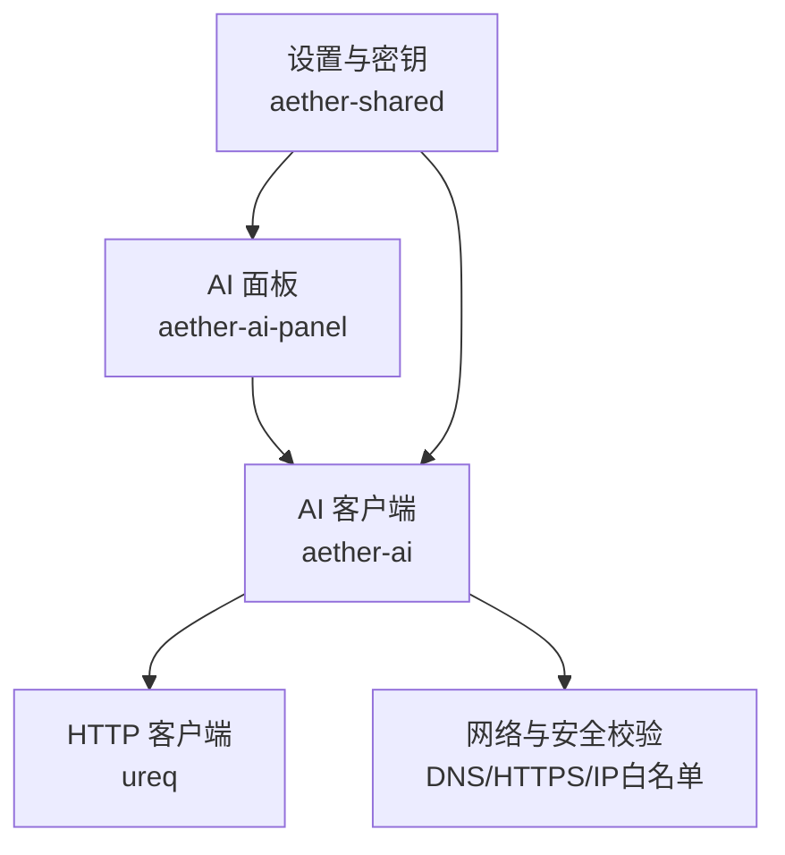
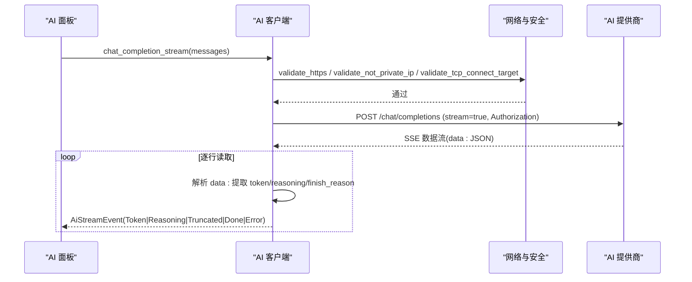
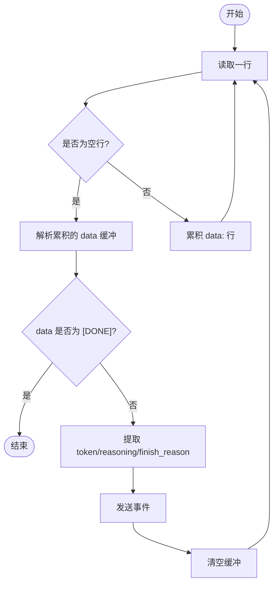
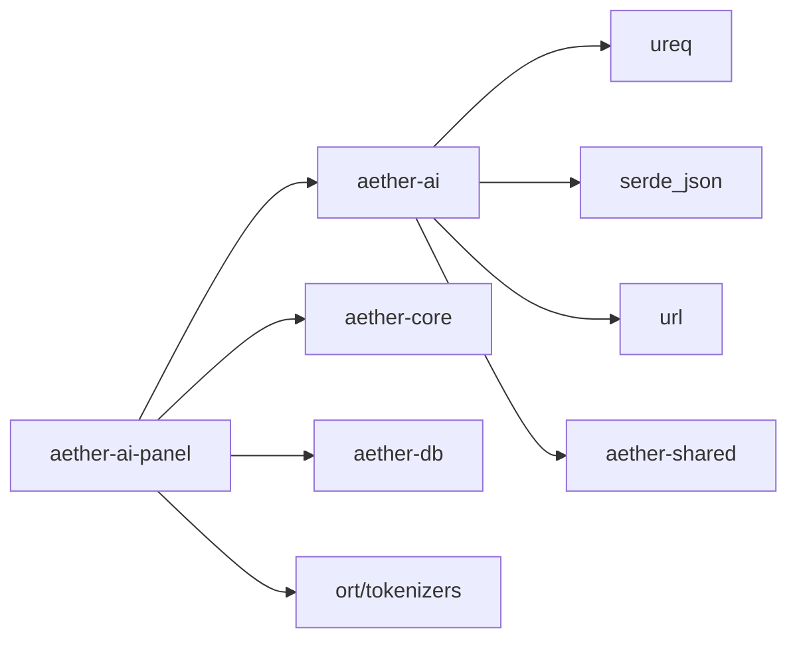

# AI 服务集成

<cite>
**本文引用的文件**
- [aether-ai/src/lib.rs](file://crates/aether-ai/src/lib.rs)
- [aether-shared/src/settings.rs](file://crates/aether-shared/src/settings.rs)
- [aether-ai-panel/src/ai_panel.rs](file://crates/aether-ai-panel/src/ai_panel.rs)
- [aether-ai-panel/src/ai_context.rs](file://crates/aether-ai-panel/src/ai_context.rs)
- [aether-ai/Cargo.toml](file://crates/aether-ai/Cargo.toml)
- [aether-ai-panel/Cargo.toml](file://crates/aether-ai-panel/Cargo.toml)
</cite>

## 目录
1. [简介](#简介)
2. [项目结构](#项目结构)
3. [核心组件](#核心组件)
4. [架构总览](#架构总览)
5. [详细组件分析](#详细组件分析)
6. [依赖关系分析](#依赖关系分析)
7. [性能考量](#性能考量)
8. [故障排除指南](#故障排除指南)
9. [结论](#结论)
10. [附录：新增 AI 提供商接入示例](#附录新增-ai-提供商接入示例)

## 简介
本模块为 AI 服务提供统一抽象层，支持 DeepSeek、Kimi 以及自定义 OpenAI 兼容接口。通过统一的客户端与流式响应处理，屏蔽底层差异；同时提供安全校验、配置管理、错误脱敏与可重试策略，确保在多提供商环境下稳定、安全地工作。

## 项目结构
- aether-ai：AI 客户端核心库，封装多提供商的统一接口、请求构建、SSE 流解析与安全校验。
- aether-shared：应用设置与模型档案（含 API Key 加密存储）。
- aether-ai-panel：UI 面板与对话状态管理，负责发起流式请求、消费事件并渲染结果。

图表来源
- [aether-ai/src/lib.rs:259-320](file://crates/aether-ai/src/lib.rs#L259-L320)
- [aether-shared/src/settings.rs:329-383](file://crates/aether-shared/src/settings.rs#L329-L383)
- [aether-ai-panel/src/ai_panel.rs:731-800](file://crates/aether-ai-panel/src/ai_panel.rs#L731-L800)

章节来源
- [aether-ai/src/lib.rs:17-82](file://crates/aether-ai/src/lib.rs#L17-L82)
- [aether-shared/src/settings.rs:73-115](file://crates/aether-shared/src/settings.rs#L73-L115)
- [aether-ai-panel/src/ai_panel.rs:170-225](file://crates/aether-ai-panel/src/ai_panel.rs#L170-L225)

## 核心组件
- 提供商枚举与默认值：AiProvider 提供 DeepSeek/Kimi/Custom 的基地址、默认模型与预置模型清单。
- 配置对象：AiConfig 聚合 provider、API Key、base_url、模型及各类采样参数、停止序列、JSON 输出模式等。
- 客户端：AiClient 封装 HTTP Agent、请求构建、SSE 流读取与事件分发。
- 流事件：AiStreamEvent 表示 Token、Reasoning、Done、Truncated、Error。
- 设置与密钥：AiSettings/AiModelProfile 提供多模型档案与 DPAPI 加密的 API Key 存储。
- 面板状态：AiPanel/AiConversation/AiStreamState 负责会话、流式状态与 UI 轮询。

章节来源
- [aether-ai/src/lib.rs:17-82](file://crates/aether-ai/src/lib.rs#L17-L82)
- [aether-ai/src/lib.rs:165-257](file://crates/aether-ai/src/lib.rs#L165-L257)
- [aether-ai/src/lib.rs:259-320](file://crates/aether-ai/src/lib.rs#L259-L320)
- [aether-ai/src/lib.rs:286-299](file://crates/aether-ai/src/lib.rs#L286-L299)
- [aether-shared/src/settings.rs:73-115](file://crates/aether-shared/src/settings.rs#L73-L115)
- [aether-ai-panel/src/ai_panel.rs:170-225](file://crates/aether-ai-panel/src/ai_panel.rs#L170-L225)

## 架构总览
整体采用“面板调用客户端 -> 客户端构造请求 -> 安全校验 -> 发送 HTTP -> SSE 流解析 -> 事件回传面板”的分层设计。安全校验贯穿 URL、DNS、IP 范围与元数据黑名单；流式处理将 token 与 reasoning 分流，并在结束时标记完成或截断。

图表来源
- [aether-ai/src/lib.rs:738-830](file://crates/aether-ai/src/lib.rs#L738-L830)
- [aether-ai/src/lib.rs:832-921](file://crates/aether-ai/src/lib.rs#L832-L921)
- [aether-ai/src/lib.rs:923-960](file://crates/aether-ai/src/lib.rs#L923-L960)
- [aether-ai-panel/src/ai_panel.rs:731-800](file://crates/aether-ai-panel/src/ai_panel.rs#L731-L800)

## 详细组件分析

### 统一接口与提供商抽象
- 提供商枚举 AiProvider：
  - 支持 deepseek/kimi/custom，提供 default_base_url、default_model、preset_models。
  - from_str 兼容大小写与别名（如 kimi/moonshot）。
- 配置 AiConfig：
  - 从 AiSettings 构建，包含 provider、api_key、base_url、model、temperature/top_p/max_tokens/system_prompt/thinking/reasoning_effort/frequency_penalty/presence_penalty/stop/response_format/user_id。
  - 对 DeepSeek 思考模式进行特殊处理：当 thinking_active 时不下发采样参数，仅下发 reasoning_effort（high/max）。
- 消息 ChatMessage：role/content 标准结构，便于构建 messages 列表。

章节来源
- [aether-ai/src/lib.rs:17-82](file://crates/aether-ai/src/lib.rs#L17-L82)
- [aether-ai/src/lib.rs:165-257](file://crates/aether-ai/src/lib.rs#L165-L257)
- [aether-ai/src/lib.rs:264-284](file://crates/aether-ai/src/lib.rs#L264-L284)

### 流式响应处理（SSE）
- 流入口：chat_completion_stream -> stream_openai_compatible -> stream_response。
- 流解析：
  - 按行读取，累积 data: 行到缓冲区，遇到空行触发一次解析。
  - 识别 "[DONE]" 结束流。
  - 解析 JSON 提取：
    - token：choices[0].delta.content 或 delta.text。
    - reasoning：choices[0].delta.reasoning_content 或 delta.type == "thinking_delta" 时的 delta.thinking。
    - finish_reason：length/max_tokens 时发送 Truncated。
- 事件通道：mpsc::Receiver<AiStreamEvent>，后台线程持续推送 Token/Reasoning/Done/Truncated/Error。
- 超时与空闲：连接超时 15s，读空闲 300s，避免长生成被中断。

图表来源
- [aether-ai/src/lib.rs:832-921](file://crates/aether-ai/src/lib.rs#L832-L921)
- [aether-ai/src/lib.rs:923-960](file://crates/aether-ai/src/lib.rs#L923-L960)

章节来源
- [aether-ai/src/lib.rs:738-830](file://crates/aether-ai/src/lib.rs#L738-L830)
- [aether-ai/src/lib.rs:832-921](file://crates/aether-ai/src/lib.rs#L832-L921)
- [aether-ai/src/lib.rs:923-960](file://crates/aether-ai/src/lib.rs#L923-L960)

### 安全机制
- HTTPS 强制：validate_https 拒绝非 https。
- SSRF 防护：
  - validate_not_private_ip：URL 解析 + DNS 解析 + IP 私有/保留/环回/组播/广播检查。
  - 云元数据黑名单：AWS/GCP/Azure/阿里云/腾讯云常见端点。
  - resolve_and_lock：在请求前二次 DNS 校验（TOCTOU 防护），但保持域名直连以保留 TLS 主机名校验。
- 重定向禁用：redirects(0) 防止 302 跳转至内网。
- 敏感信息脱敏：
  - AiError.safe_display：对用户展示的安全描述，不含原始响应体。
  - sanitize_error：移除 Bearer/x-api-key/authorization 等头中的密钥片段。
  - Debug 实现中 api_key 显示为 [REDACTED]。
- 响应体限制：read_limited_response 限制最大 10MB，防止内存滥用。

章节来源
- [aether-ai/src/lib.rs:394-456](file://crates/aether-ai/src/lib.rs#L394-L456)
- [aether-ai/src/lib.rs:491-534](file://crates/aether-ai/src/lib.rs#L491-L534)
- [aether-ai/src/lib.rs:536-570](file://crates/aether-ai/src/lib.rs#L536-L570)
- [aether-ai/src/lib.rs:110-163](file://crates/aether-ai/src/lib.rs#L110-L163)
- [aether-ai-panel/src/ai_panel.rs:17-100](file://crates/aether-ai-panel/src/ai_panel.rs#L17-L100)

### 配置系统与密钥管理
- 多模型档案：AppSettings.ai_models 保存多个 AiModelProfile，active_model_id 指定当前激活模型。
- 密钥存储：settings.json 不写入明文 api_key；使用 DPAPI 加密存储在 api_key.enc，加载时解密并注入到对应模型。
- 运行时选择：active_ai_settings() 优先 active_model_id，其次首个启用模型，最后回退旧 ai。
- 配置项映射：AiConfig::from_settings 将 AiSettings 转换为运行时配置，包括 provider、base_url、model、采样参数、thinking、reasoning_effort、stop、response_format、user_id 等。

章节来源
- [aether-shared/src/settings.rs:73-115](file://crates/aether-shared/src/settings.rs#L73-L115)
- [aether-shared/src/settings.rs:329-383](file://crates/aether-shared/src/settings.rs#L329-L383)
- [aether-shared/src/settings.rs:385-559](file://crates/aether-shared/src/settings.rs#L385-L559)
- [aether-ai/src/lib.rs:217-257](file://crates/aether-ai/src/lib.rs#L217-L257)

### 错误处理与重试策略
- 错误分类：Http/Parse/Config/Api(code,message)。
- 可重试判断：is_retryable 针对 429/500/503；is_permanent 针对 400/401/402/403/404/422。
- 用户友好提示：safe_display 返回通用描述，不包含敏感信息。
- 流式错误：SSE 解析失败或 API 错误通过 Error 事件上报，面板侧可区分本地网络错误与 API 错误。

章节来源
- [aether-ai/src/lib.rs:84-163](file://crates/aether-ai/src/lib.rs#L84-L163)
- [aether-ai/src/lib.rs:832-921](file://crates/aether-ai/src/lib.rs#L832-L921)
- [aether-ai-panel/src/ai_panel.rs:787-800](file://crates/aether-ai-panel/src/ai_panel.rs#L787-L800)

### 面板与流式状态管理
- AiStreamState：partial（回答增量）、reasoning（思考增量）、done、error、truncated、start_time、received_first_response。
- 后台线程：spawn_ai_stream 调用 AiClient.chat_completion_stream，接收事件并更新共享状态。
- UI 轮询：AiConversation.drain_background 将增量追加到消息，处理完成/截断/错误边沿。
- 思考计时：首次收到 reasoning 启动计时，回答开始或流结束时结算耗时。

章节来源
- [aether-ai-panel/src/ai_panel.rs:170-225](file://crates/aether-ai-panel/src/ai_panel.rs#L170-L225)
- [aether-ai-panel/src/ai_panel.rs:731-800](file://crates/aether-ai-panel/src/ai_panel.rs#L731-L800)
- [aether-ai-panel/src/ai_panel.rs:364-460](file://crates/aether-ai-panel/src/ai_panel.rs#L364-L460)

## 依赖关系分析
- aether-ai 依赖 ureq（HTTP）、serde_json（JSON）、url（URL 解析）、aether-shared（设置）。
- aether-ai-panel 依赖 aether-ai（客户端）、aether-shared（设置）、aether-core（编辑器上下文）、aether-db（持久化）、ort/tokenizers（嵌入/分词）、sha2（哈希）、dirs（配置路径）。

图表来源
- [aether-ai/Cargo.toml:6-11](file://crates/aether-ai/Cargo.toml#L6-L11)
- [aether-ai-panel/Cargo.toml:6-20](file://crates/aether-ai-panel/Cargo.toml#L6-L20)

章节来源
- [aether-ai/Cargo.toml:6-11](file://crates/aether-ai/Cargo.toml#L6-L11)
- [aether-ai-panel/Cargo.toml:6-20](file://crates/aether-ai-panel/Cargo.toml#L6-L20)

## 性能考量
- 连接池与 Agent：ureq::AgentBuilder 复用连接，设置连接超时与读空闲超时，避免频繁握手。
- 流式传输：SSE 逐 token 推送，减少首包延迟，提升交互体验。
- 响应体限制：read_limited_response 限制 10MB，防止大响应占用内存。
- 思考模式优化：DeepSeek 思考模式下跳过采样参数下发，减少无效请求负载。
- 缓存机制：当前未实现服务端响应缓存；可在上层基于 user_id 与 prompt 指纹添加 LRU 缓存（需结合业务需求）。
- 限流策略：当前未内置全局限流；可通过调用方控制并发与重试间隔（指数退避建议用于 429/503）。

[本节为通用指导，无需特定文件引用]

## 故障排除指南
- 网络问题：
  - 检查 base_url 是否 HTTPS，DNS 是否解析到公网 IP。
  - 查看 safe_display 返回的通用描述，避免泄露敏感信息。
- 认证失败：
  - 确认 API Key 已正确设置且未过期。
  - 检查 settings.json 与 api_key.enc 是否匹配。
- 速率限制：
  - 429 错误：降低请求频率，增加重试间隔。
- 服务器繁忙：
  - 500/503 错误：稍后重试，考虑指数退避。
- 流式异常：
  - SSE 解析失败：检查提供商响应格式是否符合 OpenAI 兼容。
  - 长时间无响应：检查 received_first_response 标志与 start_time，必要时取消请求。

章节来源
- [aether-ai/src/lib.rs:110-163](file://crates/aether-ai/src/lib.rs#L110-L163)
- [aether-ai/src/lib.rs:394-456](file://crates/aether-ai/src/lib.rs#L394-L456)
- [aether-ai-panel/src/ai_panel.rs:787-800](file://crates/aether-ai-panel/src/ai_panel.rs#L787-L800)

## 结论
本模块通过统一抽象层屏蔽多 AI 提供商差异，提供安全的请求构建、流式响应处理与完善的错误处理机制。结合多模型配置与 DPAPI 密钥管理，满足生产环境对安全性与可维护性的要求。后续可扩展更多提供商与缓存/限流策略以提升性能。

[本节为总结性内容，无需特定文件引用]

## 附录：新增 AI 提供商接入示例
以下示例说明如何在现有架构中添加一个新的 AI 提供商（例如 “NewProvider”），并保持与 DeepSeek/Kimi 一致的接口行为。

步骤概览
1. 扩展 AiProvider 枚举：
   - 在枚举中添加 NewProvider 变体。
   - 实现 from_str 以识别字符串标识。
   - 提供 default_base_url、default_model、preset_models。
2. 调整请求构建逻辑：
   - 若新提供商支持 OpenAI 兼容接口，可直接复用 stream_openai_compatible。
   - 若存在厂商差异（如 thinking 参数），在 apply_thinking_param 或请求构建处按需注入。
3. 安全校验：
   - 确保 base_url 为 HTTPS，且不在私有 IP/元数据黑名单中。
4. 测试与验证：
   - 使用 list_models_safe/test_connection_safe 验证连通性与模型列表。
   - 使用 chat_completion_stream 验证流式响应。

代码位置参考
- 提供商枚举与默认值：[aether-ai/src/lib.rs:17-82](file://crates/aether-ai/src/lib.rs#L17-L82)
- 请求构建与流式处理：[aether-ai/src/lib.rs:581-830](file://crates/aether-ai/src/lib.rs#L581-L830)
- 安全校验：[aether-ai/src/lib.rs:394-534](file://crates/aether-ai/src/lib.rs#L394-L534)
- 设置与密钥：[aether-shared/src/settings.rs:73-115](file://crates/aether-shared/src/settings.rs#L73-L115)

注意
- 保持 API Key 不序列化到 settings.json，使用 DPAPI 加密存储。
- 对用户展示的错误信息使用 safe_display，避免泄露敏感数据。
- 若新提供商不支持 SSE，需在客户端增加非流式响应处理分支。

[本节为概念性指导，无需特定文件引用]