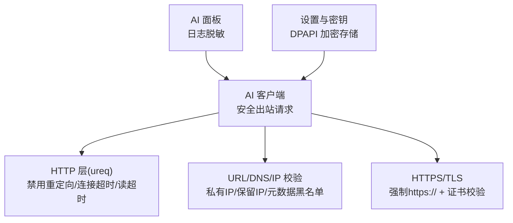
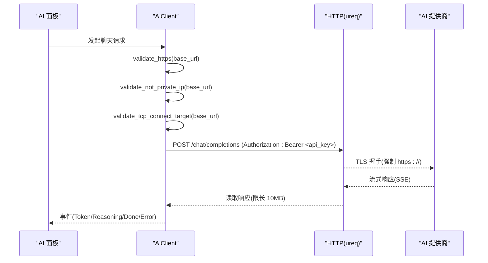
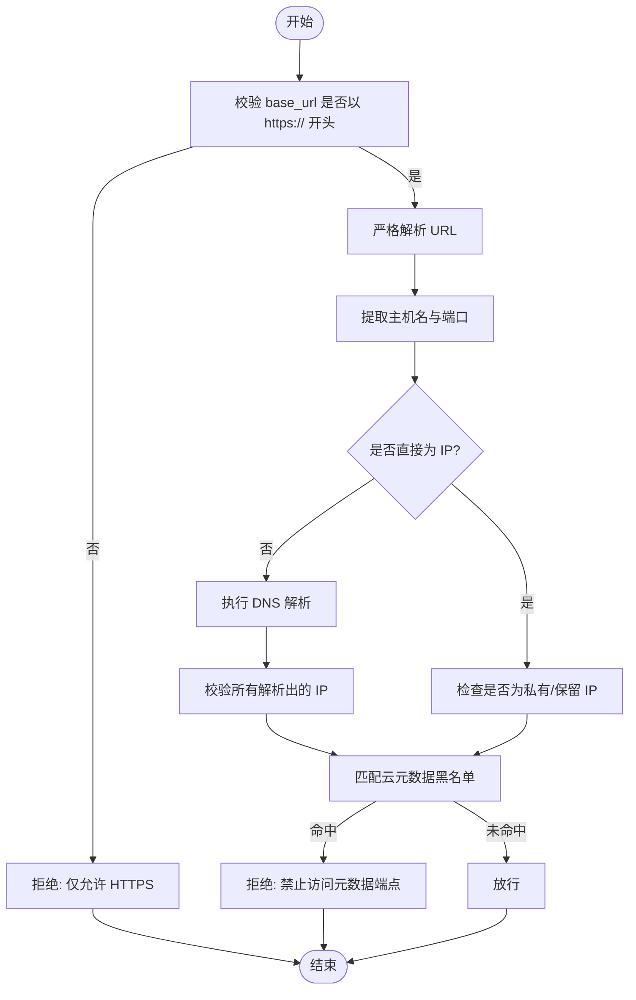
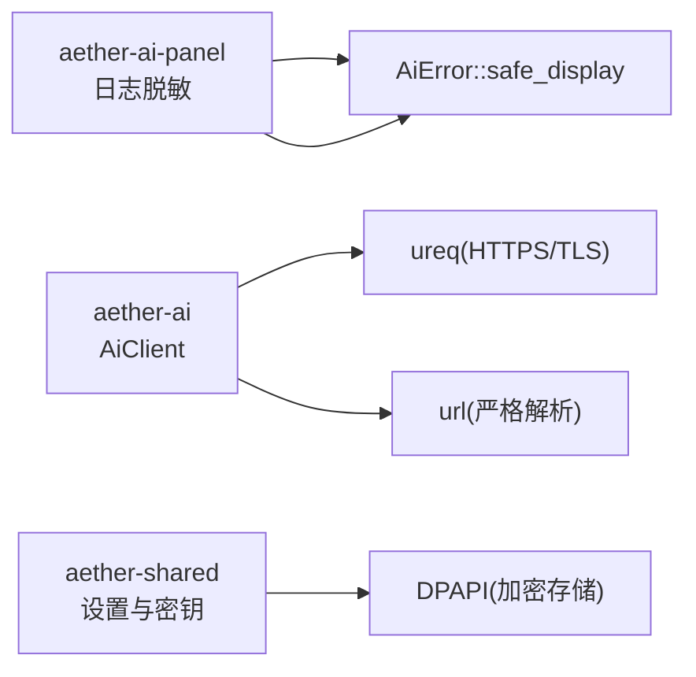

# 安全机制

<cite>
**本文引用的文件**
- [aether-ai/src/lib.rs](file://crates/aether-ai/src/lib.rs)
- [aether-shared/src/settings.rs](file://crates/aether-shared/src/settings.rs)
- [aether-ai-panel/src/ai_panel.rs](file://crates/aether-ai-panel/src/ai_panel.rs)
</cite>

## 目录
1. [简介](#简介)
2. [项目结构](#项目结构)
3. [核心组件](#核心组件)
4. [架构总览](#架构总览)
5. [详细组件分析](#详细组件分析)
6. [依赖关系分析](#依赖关系分析)
7. [性能与安全权衡](#性能与安全权衡)
8. [故障排查指南](#故障排查指南)
9. [结论](#结论)
10. [附录：安全配置最佳实践与审计清单](#附录安全配置最佳实践与审计清单)

## 简介
本文件聚焦 AI 服务集成的安全机制，覆盖 SSRF（服务端请求伪造）防护、HTTPS/TLS 强制与证书校验、API Key 全生命周期安全管理、错误信息的安全处理、以及请求限制与超时控制等。文档基于仓库中 aether-ai、aether-shared、aether-ai-panel 三个模块的实现进行梳理，提供可操作的防御策略与审计清单。

## 项目结构
- aether-ai：AI 客户端实现，负责 HTTPS 强制、SSRF 防护、DNS 校验、云元数据端点黑名单、响应体大小限制、错误脱敏与重试判定。
- aether-shared：设置与密钥管理，包含 API Key 的加密存储、序列化跳过明文、多模型档案与加载流程。
- aether-ai-panel：日志与 UI 侧敏感头脱敏（Bearer、Authorization、x-api-key），并限制日志长度避免泄露。

图表来源
- [aether-ai/src/lib.rs:308-320](file://crates/aether-ai/src/lib.rs#L308-L320)
- [aether-ai/src/lib.rs:394-456](file://crates/aether-ai/src/lib.rs#L394-L456)
- [aether-shared/src/settings.rs:377-383](file://crates/aether-shared/src/settings.rs#L377-L383)
- [aether-ai-panel/src/ai_panel.rs:29-95](file://crates/aether-ai-panel/src/ai_panel.rs#L29-L95)

章节来源
- [aether-ai/src/lib.rs:308-320](file://crates/aether-ai/src/lib.rs#L308-L320)
- [aether-shared/src/settings.rs:377-383](file://crates/aether-shared/src/settings.rs#L377-L383)
- [aether-ai-panel/src/ai_panel.rs:29-95](file://crates/aether-ai-panel/src/ai_panel.rs#L29-L95)

## 核心组件
- AiClient：封装对 AI 提供商的 HTTP 调用，内置 HTTPS 强制、SSRF 防护、DNS TOCTOU 二次校验、云元数据端点黑名单、响应体大小限制、错误消息截断与用户友好提示。
- AiConfig/AiSettings：承载模型参数与 API Key；Api Key 在 Debug/日志中脱敏，持久化时不写入明文。
- 设置与密钥：使用 DPAPI 将 API Key 单独加密保存，settings.json 通过 skip_serializing 避免明文落盘。
- 日志脱敏：UI 面板在记录日志前对常见敏感头进行替换，防止 Token/Key 泄漏到日志或控制台。

章节来源
- [aether-ai/src/lib.rs:84-163](file://crates/aether-ai/src/lib.rs#L84-L163)
- [aether-ai/src/lib.rs:165-257](file://crates/aether-ai/src/lib.rs#L165-L257)
- [aether-shared/src/settings.rs:73-141](file://crates/aether-shared/src/settings.rs#L73-L141)
- [aether-shared/src/settings.rs:377-383](file://crates/aether-shared/src/settings.rs#L377-L383)
- [aether-ai-panel/src/ai_panel.rs:29-95](file://crates/aether-ai-panel/src/ai_panel.rs#L29-L95)

## 架构总览
下图展示一次聊天补全请求从构建到发送的安全路径：

图表来源
- [aether-ai/src/lib.rs:581-644](file://crates/aether-ai/src/lib.rs#L581-L644)
- [aether-ai/src/lib.rs:738-830](file://crates/aether-ai/src/lib.rs#L738-L830)
- [aether-ai/src/lib.rs:394-456](file://crates/aether-ai/src/lib.rs#L394-L456)
- [aether-ai/src/lib.rs:536-558](file://crates/aether-ai/src/lib.rs#L536-L558)

## 详细组件分析

### SSRF 防护（DNS 重绑定、私有 IP、云元数据黑名单）
- HTTPS 强制：所有 base_url 必须为 https://，否则直接拒绝。
- URL 严格解析：使用标准 URL 解析器，避免 userinfo/IPv6 绕过。
- DNS 预校验：对域名进行一次 DNS 解析，检查所有返回 IP 是否为私有/保留地址。
- TOCTOU 二次校验：在发起 HTTP 请求前再次校验目标，降低“验证后 DNS 被篡改”的风险。
- 云元数据端点黑名单：显式阻止 AWS/GCP/Azure/阿里云/腾讯云等元数据地址。
- 私有/保留 IP 检测：涵盖 IPv4/IPv6 的私有、回环、链路本地、组播、广播、文档地址等。

图表来源
- [aether-ai/src/lib.rs:394-456](file://crates/aether-ai/src/lib.rs#L394-L456)
- [aether-ai/src/lib.rs:458-534](file://crates/aether-ai/src/lib.rs#L458-L534)

章节来源
- [aether-ai/src/lib.rs:394-456](file://crates/aether-ai/src/lib.rs#L394-L456)
- [aether-ai/src/lib.rs:458-534](file://crates/aether-ai/src/lib.rs#L458-L534)

### HTTPS 强制与 TLS 证书校验
- 强制 HTTPS：base_url 必须以 https:// 开头，否则报错。
- 使用原生 TLS 栈：通过 ureq 默认启用 TLS，保持域名与证书的主机名校验，因此不在代码层面固定 IP，而是保留域名以便证书校验生效。
- 连接与读取超时：连接阶段 15 秒，读空闲 300 秒，避免长生成被整体超时打断。

章节来源
- [aether-ai/src/lib.rs:308-320](file://crates/aether-ai/src/lib.rs#L308-L320)
- [aether-ai/src/lib.rs:394-402](file://crates/aether-ai/src/lib.rs#L394-L402)
- [aether-ai/src/lib.rs:581-644](file://crates/aether-ai/src/lib.rs#L581-L644)

### API Key 安全管理（敏感信息脱敏、内存保护、传输加密）
- 运行时脱敏：
  - Config/Settings 的 Debug 输出将 api_key 显示为占位符，避免日志泄露。
  - 日志记录前对常见敏感头（Bearer、Authorization、x-api-key）进行替换，并限制日志长度。
- 存储安全：
  - settings.json 中通过 skip_serializing 不写入明文 api_key。
  - API Key 单独以 DPAPI 加密保存在独立文件中，支持多模型键映射。
- 传输安全：
  - 所有请求均通过 HTTPS 发送 Authorization: Bearer <api_key>。
- 内存保护建议：
  - 当前实现将 key 作为字符串持有；建议在后续版本引入零初始化清理、最小化持有范围与及时释放的策略。

章节来源
- [aether-ai/src/lib.rs:165-257](file://crates/aether-ai/src/lib.rs#L165-L257)
- [aether-shared/src/settings.rs:73-141](file://crates/aether-shared/src/settings.rs#L73-L141)
- [aether-shared/src/settings.rs:377-383](file://crates/aether-shared/src/settings.rs#L377-L383)
- [aether-shared/src/settings.rs:487-559](file://crates/aether-shared/src/settings.rs#L487-L559)
- [aether-ai-panel/src/ai_panel.rs:29-95](file://crates/aether-ai-panel/src/ai_panel.rs#L29-L95)

### 请求限制与速率控制
- 响应体大小限制：统一限制响应体最大 10MB，防止恶意大响应导致内存耗尽。
- 停止序列限制：stop 列表最多下发 16 个，避免过大请求体。
- 超时控制：连接 15 秒、读空闲 300 秒，兼顾流式长任务与资源保护。
- 速率限制（服务端）：当收到 429 时，错误类型标记为可重试，便于上层实施指数退避重试。

章节来源
- [aether-ai/src/lib.rs:536-558](file://crates/aether-ai/src/lib.rs#L536-L558)
- [aether-ai/src/lib.rs:800-808](file://crates/aether-ai/src/lib.rs#L800-L808)
- [aether-ai/src/lib.rs:308-320](file://crates/aether-ai/src/lib.rs#L308-L320)
- [aether-ai/src/lib.rs:147-163](file://crates/aether-ai/src/lib.rs#L147-L163)

### 错误信息的安全处理
- 用户可见错误：safe_display 将 API 响应体中的敏感信息剥离，仅返回状态码与通用描述，并提供按状态码的建议文案。
- 日志内部错误：Display 实现保留完整（已截断）响应体，用于调试日志，但不应直接暴露给 UI。
- 错误消息截断：统一截断至 200 字符并在 UTF-8 边界处截断，避免大量响应体进入 UI。

章节来源
- [aether-ai/src/lib.rs:84-163](file://crates/aether-ai/src/lib.rs#L84-L163)
- [aether-ai/src/lib.rs:560-570](file://crates/aether-ai/src/lib.rs#L560-L570)
- [aether-ai/src/lib.rs:624-632](file://crates/aether-ai/src/lib.rs#L624-L632)
- [aether-ai/src/lib.rs:690-698](file://crates/aether-ai/src/lib.rs#L690-L698)

## 依赖关系分析
- AiClient 依赖 ureq 进行网络通信，并通过 url crate 进行严格 URL 解析。
- 设置模块依赖系统 DPAPI（Windows）进行 API Key 加密存储。
- AI 面板依赖 AiError::safe_display 与日志脱敏逻辑，确保 UI 层不泄露敏感信息。

图表来源
- [aether-ai/src/lib.rs:308-320](file://crates/aether-ai/src/lib.rs#L308-L320)
- [aether-shared/src/settings.rs:562-642](file://crates/aether-shared/src/settings.rs#L562-L642)
- [aether-ai-panel/src/ai_panel.rs:29-95](file://crates/aether-ai-panel/src/ai_panel.rs#L29-L95)

章节来源
- [aether-ai/src/lib.rs:308-320](file://crates/aether-ai/src/lib.rs#L308-L320)
- [aether-shared/src/settings.rs:562-642](file://crates/aether-shared/src/settings.rs#L562-L642)
- [aether-ai-panel/src/ai_panel.rs:29-95](file://crates/aether-ai-panel/src/ai_panel.rs#L29-L95)

## 性能与安全权衡
- 禁用自动重定向：防止 SSRF 通过 302 跳转到内网地址，代价是需显式处理重定向场景（当前选择更安全）。
- 分离超时：连接与读超时分离，避免长生成被整体超时中断，同时保障资源不被长期占用。
- 响应体限制：10MB 上限平衡了功能与内存安全，避免异常大响应导致 OOM。
- DNS 校验：两次校验提升安全性，增加少量延迟，但在安全关键路径上值得。

[本节为通用指导，无需具体文件引用]

## 故障排查指南
- 无法连接或频繁失败：
  - 检查 base_url 是否为 https://。
  - 确认未配置私有 IP 或云元数据端点。
  - 查看错误信息 safe_display 的通用提示，必要时切换网络或稍后重试。
- 429/503 错误：
  - 属于可重试错误，建议采用指数退避重试。
- 日志中出现敏感信息：
  - 确认已启用日志脱敏逻辑，避免记录 Authorization/x-api-key 等头部。
- 配置损坏：
  - 若 settings.json 解析失败，会备份为 .corrupt 并回退默认设置，检查备份文件定位问题。

章节来源
- [aether-ai/src/lib.rs:147-163](file://crates/aether-ai/src/lib.rs#L147-L163)
- [aether-shared/src/settings.rs:442-453](file://crates/aether-shared/src/settings.rs#L442-L453)
- [aether-ai-panel/src/ai_panel.rs:29-95](file://crates/aether-ai-panel/src/ai_panel.rs#L29-L95)

## 结论
该 AI 服务集成实现了较为完善的安全基线：强制 HTTPS、严格的 URL/DNS/IP 校验、云元数据端点黑名单、响应体大小限制、错误信息脱敏与用户友好提示、以及 API Key 的加密存储与日志脱敏。对于 DNS 重绑定的彻底防护，当前采用“纵深防御”策略（多次校验+黑名单），未来如需更强保障，可考虑自定义 TLS connector 与 IP pinning。

[本节为总结性内容，无需具体文件引用]

## 附录：安全配置最佳实践与审计清单
- HTTPS 与 TLS
  - 强制 base_url 使用 https://。
  - 保持域名与证书校验，不要绕过证书验证。
  - 合理设置连接与读超时，避免资源长时间占用。
- SSRF 防护
  - 严格 URL 解析，拒绝 http、ftp 等非 https 协议。
  - 对域名进行 DNS 解析并校验所有 IP，阻断私有/保留地址。
  - 维护并定期更新云元数据端点黑名单。
- API Key 管理
  - 使用 DPAPI 或其他平台安全存储方案加密保存 API Key。
  - 在 Debug/日志中始终脱敏敏感字段。
  - 传输层仅通过 HTTPS 发送 Authorization 头。
  - 建议后续引入内存级清理策略，减少敏感数据驻留时间。
- 请求限制
  - 限制响应体大小（如 10MB）。
  - 限制 stop 列表长度（如 16）。
  - 对 429/503 等可重试错误实施指数退避重试。
- 错误处理
  - 对外展示使用 safe_display，避免泄露原始响应体。
  - 日志内部可使用完整（已截断）错误信息用于排障。
- 审计清单
  - 是否强制 HTTPS？
  - 是否禁用自动重定向？
  - 是否对 DNS 结果进行私有/保留 IP 校验？
  - 是否维护云元数据端点黑名单？
  - 是否限制响应体大小？
  - 是否对日志中的敏感头进行脱敏？
  - 是否使用加密存储 API Key？
  - 是否在 settings.json 中跳过明文 api_key？
  - 是否对用户可见错误进行脱敏与截断？
  - 是否对可重试错误实施退避重试？

[本节为通用指导，无需具体文件引用]