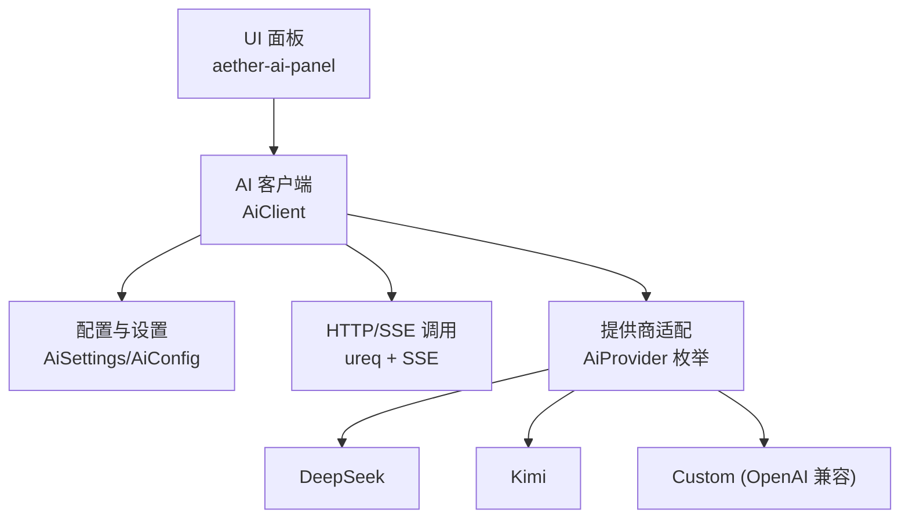
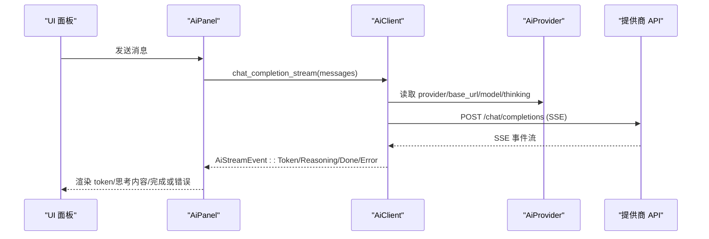
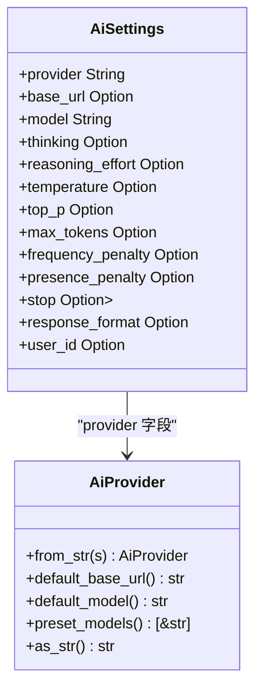
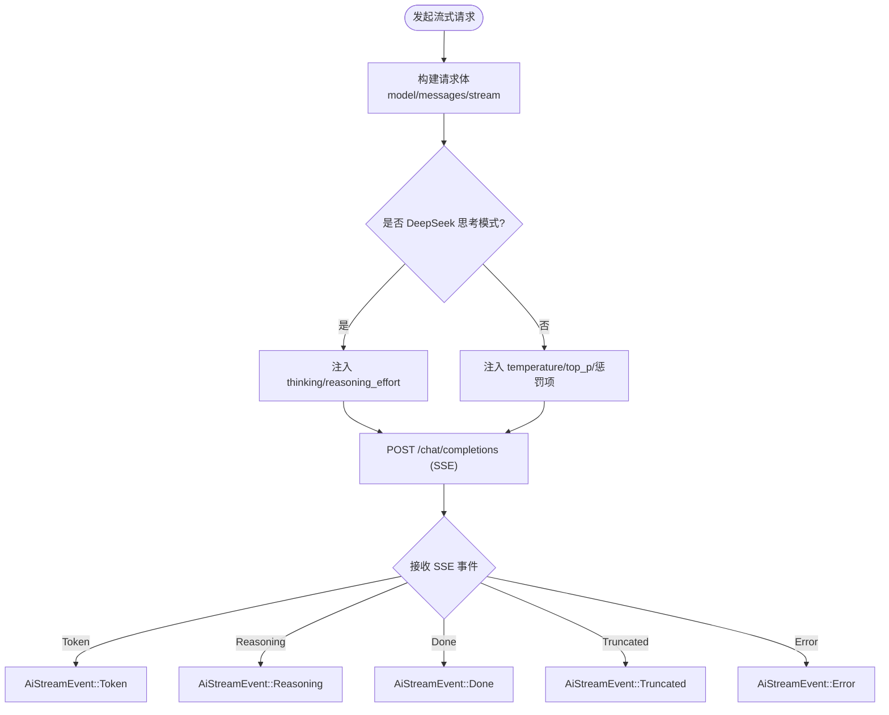
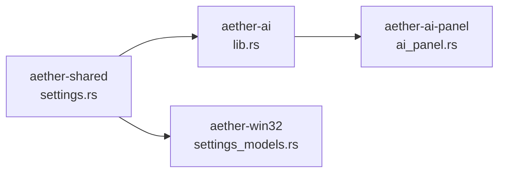

# 提供商适配层

<cite>
**本文引用的文件**
- [aether-ai/src/lib.rs](file://crates/aether-ai/src/lib.rs)
- [aether-shared/src/settings.rs](file://crates/aether-shared/src/settings.rs)
- [aether-ai-panel/src/ai_panel.rs](file://crates/aether-ai-panel/src/ai_panel.rs)
- [aether-win32/src/render/settings_models.rs](file://crates/aether-win32/src/render/settings_models.rs)
</cite>

## 目录
1. [简介](#简介)
2. [项目结构](#项目结构)
3. [核心组件](#核心组件)
4. [架构总览](#架构总览)
5. [详细组件分析](#详细组件分析)
6. [依赖关系分析](#依赖关系分析)
7. [性能考量](#性能考量)
8. [故障排查指南](#故障排查指南)
9. [结论](#结论)
10. [附录：扩展新提供商步骤](#附录：扩展新提供商步骤)

## 简介
本文件面向“AI 提供商适配层”，系统性说明如何以统一接口对接多个 AI 提供商（DeepSeek、Kimi、Custom/OpenAI 兼容），并给出 AiProvider 枚举的设计模式、默认配置与预置模型管理、提供商特定参数处理（如 DeepSeek 思考模式开关）、错误处理策略与兼容性检查机制。同时提供添加新提供商的实操步骤与代码级参考路径，帮助读者在不侵入上层业务的前提下扩展新的 AI 后端。

## 项目结构
适配层由三个层次组成：
- 配置与设置层：集中管理提供商识别、默认 Base URL、默认模型、预置模型清单等。
- 客户端抽象层：统一的请求构造、安全校验、流式事件封装，屏蔽各提供商差异。
- 面板与 UI 层：消费统一接口，负责对话状态、流式渲染、错误展示与用户交互。

图表来源
- [aether-ai/src/lib.rs:17-82](file://crates/aether-ai/src/lib.rs#L17-L82)
- [aether-ai/src/lib.rs:259-320](file://crates/aether-ai/src/lib.rs#L259-L320)
- [aether-shared/src/settings.rs:73-115](file://crates/aether-shared/src/settings.rs#L73-L115)
- [aether-ai-panel/src/ai_panel.rs:731-838](file://crates/aether-ai-panel/src/ai_panel.rs#L731-L838)

章节来源
- [aether-ai/src/lib.rs:17-82](file://crates/aether-ai/src/lib.rs#L17-L82)
- [aether-shared/src/settings.rs:73-115](file://crates/aether-shared/src/settings.rs#L73-L115)
- [aether-ai-panel/src/ai_panel.rs:731-838](file://crates/aether-ai-panel/src/ai_panel.rs#L731-L838)

## 核心组件
- AiProvider 枚举：标识提供商类型，提供字符串解析、默认 Base URL、默认模型、预置模型列表等能力。
- AiSettings/AiModelProfile：持久化与运行时配置，支持多模型档案与激活模型切换。
- AiConfig：运行时配置对象，承载 provider、api_key、base_url、model、temperature/top_p/max_tokens、thinking/reasoning_effort、惩罚项、stop、response_format、user_id 等。
- AiClient：统一 HTTP/SSE 客户端，封装 OpenAI 兼容接口的非流式与流式调用，内置安全校验与错误分类。
- AiStreamEvent：流式事件抽象，包含 Token、Reasoning、Done、Truncated、Error。

章节来源
- [aether-ai/src/lib.rs:17-82](file://crates/aether-ai/src/lib.rs#L17-L82)
- [aether-ai/src/lib.rs:165-257](file://crates/aether-ai/src/lib.rs#L165-L257)
- [aether-ai/src/lib.rs:259-320](file://crates/aether-ai/src/lib.rs#L259-L320)
- [aether-shared/src/settings.rs:73-115](file://crates/aether-shared/src/settings.rs#L73-L115)
- [aether-shared/src/settings.rs:143-166](file://crates/aether-shared/src/settings.rs#L143-L166)

## 架构总览
适配层采用“统一接口 + 提供商枚举”的模式：
- 所有提供商均通过 OpenAI 兼容的 /chat/completions 接口进行通信。
- 提供商差异通过 AiProvider 枚举在请求体注入时进行差异化处理（例如 DeepSeek 的思考模式）。
- 安全校验贯穿始终：HTTPS 强制、私有 IP 拦截、DNS TOCTOU 二次校验、SSRF 防护、响应体大小限制。
- 错误分类与可重试判断：按 HTTP 状态码区分暂时性错误与永久错误，便于 UI 提示与自动重试。

图表来源
- [aether-ai-panel/src/ai_panel.rs:731-838](file://crates/aether-ai-panel/src/ai_panel.rs#L731-L838)
- [aether-ai/src/lib.rs:716-800](file://crates/aether-ai/src/lib.rs#L716-L800)
- [aether-ai/src/lib.rs:581-644](file://crates/aether-ai/src/lib.rs#L581-L644)

## 详细组件分析

### AiProvider 枚举与提供商识别
- 提供商识别：from_str 将字符串映射到枚举值；"kimi" 与 "moonshot" 均识别为 Kimi。
- 默认 Base URL：DeepSeek 与 Kimi 提供默认地址，Custom 为空（需用户配置）。
- 默认模型：DeepSeek 默认 deepseek-v4-pro，Kimi 默认 moonshot-v1-8k，Custom 为空。
- 预置模型：DeepSeek 提供 v4-pro/v4-flash；Kimi 提供 moonshot-v1-8k/32k/128k/kimi-latest；Custom 无预置。

图表来源
- [aether-ai/src/lib.rs:17-82](file://crates/aether-ai/src/lib.rs#L17-L82)
- [aether-shared/src/settings.rs:73-115](file://crates/aether-shared/src/settings.rs#L73-L115)

章节来源
- [aether-ai/src/lib.rs:17-82](file://crates/aether-ai/src/lib.rs#L17-L82)
- [aether-shared/src/settings.rs:73-115](file://crates/aether-shared/src/settings.rs#L73-L115)

### 配置与默认值管理
- AiConfig::from_settings：从 AiSettings 构建运行时配置，若 base_url 未设置则回退到提供商默认；若 model 为空则使用提供商默认模型。
- 思考模式控制：deepseek_thinking_active 用于判断是否处于 DeepSeek 思考模式；思考模式下 temperature/top_p/惩罚项不生效且不下发。
- 多模型档案：AppSettings.active_ai_settings 优先使用激活模型，其次首个启用模型，最后回退旧单一 ai。

章节来源
- [aether-ai/src/lib.rs:217-257](file://crates/aether-ai/src/lib.rs#L217-L257)
- [aether-shared/src/settings.rs:329-366](file://crates/aether-shared/src/settings.rs#L329-L366)

### 统一请求与流式响应
- 非流式补全：complete_openai_compatible 构造请求体，支持探活时关闭 DeepSeek 思考模式。
- 聊天补全：chat_openai_compatible 支持多轮消息。
- 流式补全：stream_openai_compatible 构造 SSE 请求，按提供商差异注入 thinking/reasoning_effort，并在非思考模式下下发采样参数。
- 事件抽象：AiStreamEvent 统一 Token/Reasoning/Done/Truncated/Error。

图表来源
- [aether-ai/src/lib.rs:716-800](file://crates/aether-ai/src/lib.rs#L716-L800)
- [aether-ai/src/lib.rs:581-644](file://crates/aether-ai/src/lib.rs#L581-L644)

章节来源
- [aether-ai/src/lib.rs:581-644](file://crates/aether-ai/src/lib.rs#L581-L644)
- [aether-ai/src/lib.rs:716-800](file://crates/aether-ai/src/lib.rs#L716-L800)

### 提供商特定参数处理
- DeepSeek 思考模式：
  - apply_thinking_param 仅在 DeepSeek 时注入 thinking 参数，值为 enabled/disabled。
  - 思考强度 reasoning_effort 仅在思考模式下允许 high/max。
  - 思考模式下不下发 temperature/top_p/frequency_penalty/presence_penalty。
- Kimi：
  - 使用默认 Base URL 与模型列表；无需额外思考模式参数。
- Custom（OpenAI 兼容）：
  - 无预置模型；需用户提供 base_url 与 model；其余参数按 OpenAI 规范下发。

章节来源
- [aether-ai/src/lib.rs:724-800](file://crates/aether-ai/src/lib.rs#L724-L800)
- [aether-ai/src/lib.rs:581-644](file://crates/aether-ai/src/lib.rs#L581-L644)

### 安全与兼容性检查
- HTTPS 强制：validate_https 拒绝非 HTTPS。
- 私有/保留 IP 拦截：validate_not_private_ip 与 check_ip_private 阻止内网、本地、组播、广播、文档地址。
- DNS TOCTOU 防护：resolve_and_lock 与 validate_tcp_connect_target 在请求前二次校验 DNS 结果。
- SSRF 黑名单：禁止访问云元数据端点（AWS/GCP/Azure/阿里云/腾讯云）。
- 响应体限制：read_limited_response 限制最大 10MB，防止内存溢出。
- 错误脱敏：safe_display 与 truncate_error_message 避免泄露敏感信息。

章节来源
- [aether-ai/src/lib.rs:394-570](file://crates/aether-ai/src/lib.rs#L394-L570)

### 错误处理策略
- 错误分类：
  - Http/Parse/Config：网络、解析、配置错误。
  - Api：HTTP 状态码与消息（已截断）。
- 可重试与永久错误：
  - is_retryable：429/500/503 视为暂时性错误，支持指数退避重试。
  - is_permanent：400/401/402/403/404/422 视为永久错误，提示用户检查配置。
- UI 展示：safe_display 返回对用户友好的描述，不包含原始响应体。

章节来源
- [aether-ai/src/lib.rs:84-163](file://crates/aether-ai/src/lib.rs#L84-L163)
- [aether-ai-panel/src/ai_panel.rs:731-838](file://crates/aether-ai-panel/src/ai_panel.rs#L731-L838)

### 面板集成与流式渲染
- 后台线程发起流式请求，通过 mpsc 通道接收事件并写入共享状态。
- UI 侧轮询 stream_state，增量渲染 Token 与 Reasoning，处理 Done/Truncated/Error。
- 超时检测：根据是否思考模式调整首包超时阈值（思考模式放宽至 180s）。

章节来源
- [aether-ai-panel/src/ai_panel.rs:731-838](file://crates/aether-ai-panel/src/ai_panel.rs#L731-L838)
- [aether-ai-panel/src/ai_panel.rs:1376-1427](file://crates/aether-ai-panel/src/ai_panel.rs#L1376-L1427)

## 依赖关系分析
- aether-ai 依赖 aether-shared 的配置结构，提供统一客户端实现。
- aether-ai-panel 消费 aether-ai 的统一接口，负责 UI 与状态管理。
- aether-win32 的 UI 渲染层基于 aether-shared 的多模型配置进行展示与管理。

图表来源
- [aether-shared/src/settings.rs:73-115](file://crates/aether-shared/src/settings.rs#L73-L115)
- [aether-ai/src/lib.rs:17-82](file://crates/aether-ai/src/lib.rs#L17-L82)
- [aether-ai-panel/src/ai_panel.rs:731-838](file://crates/aether-ai-panel/src/ai_panel.rs#L731-L838)
- [aether-win32/src/render/settings_models.rs:257-281](file://crates/aether-win32/src/render/settings_models.rs#L257-L281)

章节来源
- [aether-shared/src/settings.rs:73-115](file://crates/aether-shared/src/settings.rs#L73-L115)
- [aether-ai/src/lib.rs:17-82](file://crates/aether-ai/src/lib.rs#L17-L82)
- [aether-ai-panel/src/ai_panel.rs:731-838](file://crates/aether-ai-panel/src/ai_panel.rs#L731-L838)
- [aether-win32/src/render/settings_models.rs:257-281](file://crates/aether-win32/src/render/settings_models.rs#L257-L281)

## 性能考量
- 流式响应：SSE 逐 token 推送，降低首包延迟感知。
- 超时策略：连接超时 15s，读空闲 300s，避免长生成被整体超时中断。
- 响应体限制：10MB 上限，防止大响应导致内存压力。
- 思考模式优化：探活请求显式关闭思考模式，避免思维链拖慢验证。
- 多会话并发：后台线程独立处理流式请求，UI 侧轮询状态，避免阻塞主循环。

[本节为通用指导，不直接分析具体文件]

## 故障排查指南
- 网络连接失败：检查 HTTPS、Base URL、防火墙与代理设置。
- 认证失败：确认 API Key 有效且权限足够。
- 余额不足：前往提供商官网充值。
- 参数错误：检查 temperature/top_p/max_tokens 等范围是否符合要求。
- 速率限制：稍后重试或降低请求频率。
- 服务器繁忙：等待后重试。
- 输出被截断：增加 max_tokens 或分步生成。

章节来源
- [aether-ai/src/lib.rs:110-163](file://crates/aether-ai/src/lib.rs#L110-L163)
- [aether-ai-panel/src/ai_panel.rs:731-838](file://crates/aether-ai-panel/src/ai_panel.rs#L731-L838)

## 结论
适配层通过 AiProvider 枚举与统一客户端实现，将 DeepSeek、Kimi、Custom（OpenAI 兼容）等提供商的差异收敛到最小集合，提供安全的 HTTP/SSE 调用、清晰的错误分类与友好的 UI 展示。该设计易于扩展新提供商，只需在枚举中添加分支并在请求体注入处处理差异参数即可。

[本节为总结，不直接分析具体文件]

## 附录：扩展新提供商步骤
- 步骤一：在 AiProvider 枚举中添加新分支（例如 NewProvider）。
- 步骤二：实现 from_str 映射、default_base_url、default_model、preset_models。
- 步骤三：在 stream_openai_compatible 中按需注入提供商特定参数（如 thinking/reasoning_effort）。
- 步骤四：在 UI 渲染层（settings_models.rs）添加显示名称映射。
- 步骤五：测试连接与模型列表拉取，确保安全校验与错误处理正常。

参考路径
- 枚举定义与默认值：[aether-ai/src/lib.rs:17-82](file://crates/aether-ai/src/lib.rs#L17-L82)
- 流式请求与参数注入：[aether-ai/src/lib.rs:716-800](file://crates/aether-ai/src/lib.rs#L716-L800)
- UI 提供商显示映射：[aether-win32/src/render/settings_models.rs:257-281](file://crates/aether-win32/src/render/settings_models.rs#L257-L281)

章节来源
- [aether-ai/src/lib.rs:17-82](file://crates/aether-ai/src/lib.rs#L17-L82)
- [aether-ai/src/lib.rs:716-800](file://crates/aether-ai/src/lib.rs#L716-L800)
- [aether-win32/src/render/settings_models.rs:257-281](file://crates/aether-win32/src/render/settings_models.rs#L257-L281)