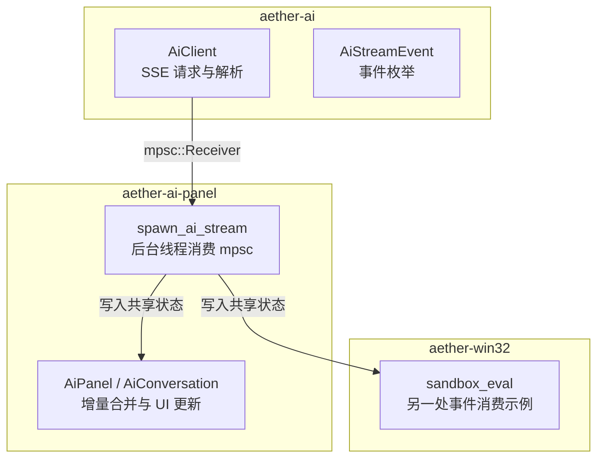
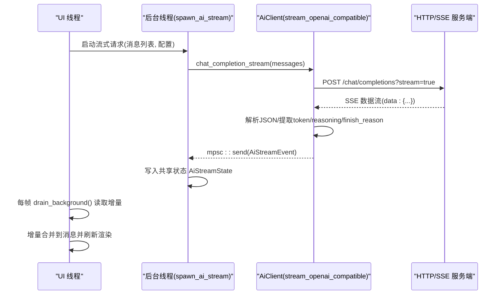
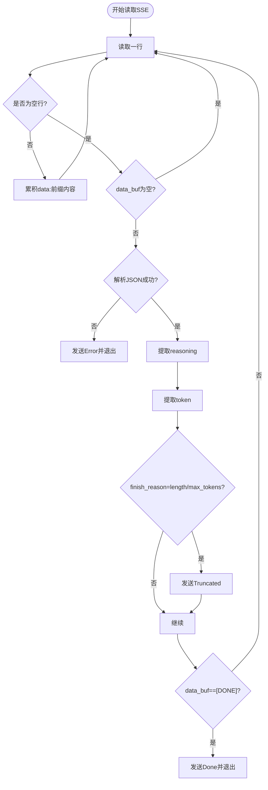
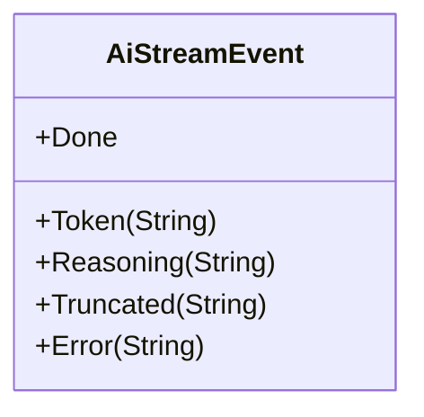
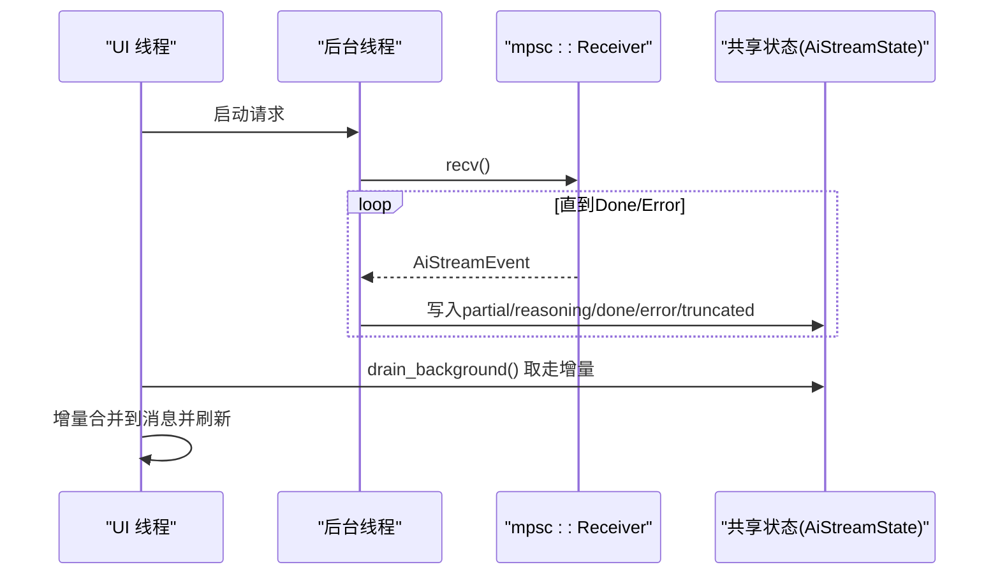
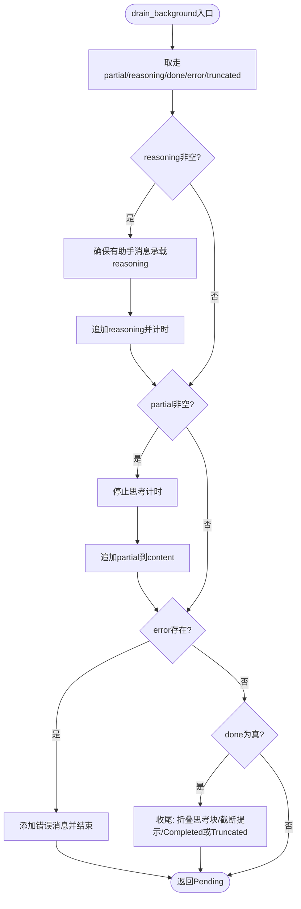
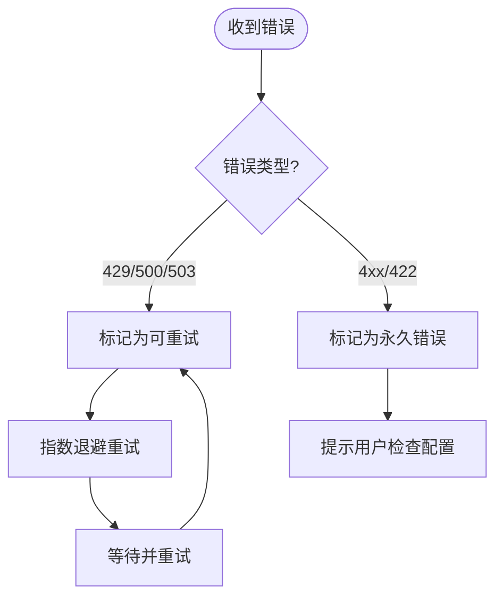
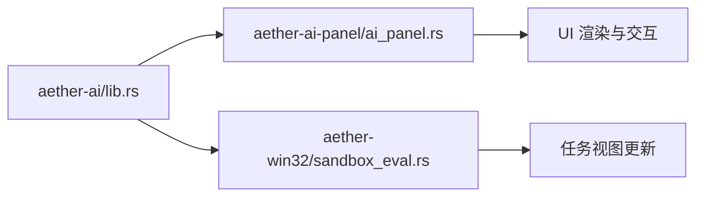

# 流式通信协议

<cite>
**本文引用的文件**
- [lib.rs](file://crates/aether-ai/src/lib.rs)
- [ai_panel.rs](file://crates/aether-ai-panel/src/ai_panel.rs)
- [sandbox_eval.rs](file://crates/aether-win32/src/sandbox_eval.rs)
</cite>

## 目录
1. [简介](#简介)
2. [项目结构](#项目结构)
3. [核心组件](#核心组件)
4. [架构总览](#架构总览)
5. [详细组件分析](#详细组件分析)
6. [依赖关系分析](#依赖关系分析)
7. [性能与内存管理](#性能与内存管理)
8. [故障排查指南](#故障排查指南)
9. [结论](#结论)
10. [附录：自定义流式处理器示例](#附录自定义流式处理器示例)

## 简介
本文件面向 AI 流式通信协议，重点说明基于 SSE（Server-Sent Events）的连接建立、数据流解析与连接维护；AiStreamEvent 事件类型系统（Token、Reasoning、Done、Truncated、Error）的处理逻辑；流式响应的异步处理架构（mpsc 通道、后台线程、资源清理）；增量数据处理与 UI 实时更新机制；错误重试策略（网络异常、API 限流、服务器错误）；并提供实现自定义流式处理器的参考路径。

## 项目结构
本项目将“AI 客户端与流式协议”放在 aether-ai crate，UI 层消费流式事件并更新界面，位于 aether-ai-panel crate；在 Windows 侧的 sandbox_eval 中也有对 AiStreamEvent 的消费示例。

图表来源
- [lib.rs:712-920](file://crates/aether-ai/src/lib.rs#L712-L920)
- [ai_panel.rs:731-834](file://crates/aether-ai-panel/src/ai_panel.rs#L731-L834)
- [sandbox_eval.rs:1454-1488](file://crates/aether-win32/src/sandbox_eval.rs#L1454-L1488)

章节来源
- [lib.rs:712-920](file://crates/aether-ai/src/lib.rs#L712-L920)
- [ai_panel.rs:731-834](file://crates/aether-ai-panel/src/ai_panel.rs#L731-L834)
- [sandbox_eval.rs:1454-1488](file://crates/aether-win32/src/sandbox_eval.rs#L1454-L1488)

## 核心组件
- AiClient：负责构建 OpenAI 兼容请求、发起 SSE 流式请求、逐行读取并解析 JSON 片段，按事件类型通过 mpsc 发送。
- AiStreamEvent：定义 Token、Reasoning、Done、Truncated、Error 五种事件，承载流式增量与结束/错误语义。
- spawn_ai_stream：在后台线程中消费 AiClient 返回的 Receiver，将事件写入共享状态 AiStreamState。
- AiPanel/AiConversation：每帧轮询共享状态，增量合并到消息体，驱动 UI 实时渲染。
- sandbox_eval：另一个消费端示例，演示如何从共享状态拉取增量并更新任务视图。

章节来源
- [lib.rs:286-300](file://crates/aether-ai/src/lib.rs#L286-L300)
- [lib.rs:712-920](file://crates/aether-ai/src/lib.rs#L712-L920)
- [ai_panel.rs:170-201](file://crates/aether-ai-panel/src/ai_panel.rs#L170-L201)
- [ai_panel.rs:731-834](file://crates/aether-ai-panel/src/ai_panel.rs#L731-L834)
- [sandbox_eval.rs:1454-1488](file://crates/aether-win32/src/sandbox_eval.rs#L1454-L1488)

## 架构总览
整体流程：UI 触发请求 → 后台线程创建 AiClient → 发起 SSE 请求 → 解析为 AiStreamEvent → 通过 mpsc 发送到 UI 线程 → UI 线程轮询共享状态并增量更新。

图表来源
- [lib.rs:738-920](file://crates/aether-ai/src/lib.rs#L738-L920)
- [ai_panel.rs:731-834](file://crates/aether-ai-panel/src/ai_panel.rs#L731-L834)

## 详细组件分析

### SSE 连接管理与数据流解析
- 连接建立：使用 ureq Agent，设置连接超时与读空闲超时，禁用自动重定向，避免 SSRF 风险。
- 流式读取：后台线程以 BufReader 逐行读取，累积 data: 行，遇到空行时尝试解析 JSON。
- 事件分发：
  - 若 data 为 "[DONE]"，发送 Done 并退出循环。
  - 若 JSON 包含 error 字段，发送 Error 并退出。
  - 提取 reasoning_content 或 thinking_delta.thinking 作为 Reasoning。
  - 提取 delta.content 作为 Token。
  - 检查 finish_reason 为 length/max_tokens 时发送 Truncated。
- 错误处理：读取失败或解析失败均发送 Error 并终止。

图表来源
- [lib.rs:832-920](file://crates/aether-ai/src/lib.rs#L832-L920)

章节来源
- [lib.rs:832-920](file://crates/aether-ai/src/lib.rs#L832-L920)

### AiStreamEvent 事件类型系统
- Token：最终回答的增量文本，追加到 partial。
- Reasoning：深度思考内容（如 reasoning_content 或 thinking_delta），追加到 reasoning。
- Done：正常完成，标记 done=true，停止接收。
- Truncated：达到 max_tokens 限制，记录 truncated 原因，不立即结束，等待后续 Done。
- Error：本地调用失败或 API 返回错误，区分网络类错误与 API 错误，设置 error 并结束。

图表来源
- [lib.rs:286-300](file://crates/aether-ai/src/lib.rs#L286-L300)

章节来源
- [lib.rs:286-300](file://crates/aether-ai/src/lib.rs#L286-L300)
- [ai_panel.rs:764-834](file://crates/aether-ai-panel/src/ai_panel.rs#L764-L834)
- [sandbox_eval.rs:1454-1488](file://crates/aether-win32/src/sandbox_eval.rs#L1454-L1488)

### 流式响应的异步处理架构
- 后台线程：spawn_ai_stream 在新线程中消费 mpsc::Receiver，避免阻塞 UI。
- 共享状态：AiStreamState 用 Arc<Mutex<...>> 保护，后台线程写入，UI 线程读取。
- 边沿检测：drain_background 每次取走增量并重置标志位，返回 DrainEdge 表示 Pending/Completed/Interrupted/Truncated。
- 资源清理：后台线程在收到 Done/Error 后退出；UI 线程在生成结束后释放 is_generating 等状态。

图表来源
- [ai_panel.rs:731-834](file://crates/aether-ai-panel/src/ai_panel.rs#L731-L834)
- [ai_panel.rs:364-459](file://crates/aether-ai-panel/src/ai_panel.rs#L364-L459)

章节来源
- [ai_panel.rs:364-459](file://crates/aether-ai-panel/src/ai_panel.rs#L364-L459)
- [ai_panel.rs:731-834](file://crates/aether-ai-panel/src/ai_panel.rs#L731-L834)

### 增量处理与 UI 实时更新
- 首次响应标记：received_first_response 用于区分“无响应超时”和“生成中”。
- 增量合并：
  - reasoning 先到达时确保存在助手消息承载思考内容。
  - token 到达时结算思考耗时，并将增量追加到 content。
  - 自动滚动到底部 stick_to_bottom。
- 结束处理：
  - Done：恢复思考块折叠，必要时将 reasoning 转为正式回答。
  - Truncated：提示用户可“继续生成”。
  - Error：添加错误消息，is_generating=false。

图表来源
- [ai_panel.rs:364-459](file://crates/aether-ai-panel/src/ai_panel.rs#L364-L459)

章节来源
- [ai_panel.rs:364-459](file://crates/aether-ai-panel/src/ai_panel.rs#L364-L459)

### 错误重试策略
- 错误分类：
  - 暂时性错误：429 速率限制、500/503 服务器错误，支持自动重试（指数退避）。
  - 永久错误：400/401/402/403/404/422 参数或认证问题，提示用户检查配置。
- 安全展示：safe_display 对用户可见的错误信息不包含敏感内容，仅显示通用描述与 HTTP 状态码。
- 超时保护：check_timeout 根据是否处于思考模式调整阈值，未收到首个响应则中断并提示。

图表来源
- [lib.rs:124-162](file://crates/aether-ai/src/lib.rs#L124-L162)
- [ai_panel.rs:813-834](file://crates/aether-ai-panel/src/ai_panel.rs#L813-L834)

章节来源
- [lib.rs:124-162](file://crates/aether-ai/src/lib.rs#L124-L162)
- [ai_panel.rs:813-834](file://crates/aether-ai-panel/src/ai_panel.rs#L813-L834)

## 依赖关系分析
- aether-ai 提供 AiClient 与 AiStreamEvent，被 aether-ai-panel 与 aether-win32 消费。
- aether-ai-panel 通过 spawn_ai_stream 管理后台线程与共享状态，驱动 UI 增量更新。
- aether-win32 的 sandbox_eval 展示了另一种消费模式：直接轮询共享状态并更新任务视图。

图表来源
- [lib.rs:712-920](file://crates/aether-ai/src/lib.rs#L712-L920)
- [ai_panel.rs:731-834](file://crates/aether-ai-panel/src/ai_panel.rs#L731-L834)
- [sandbox_eval.rs:1454-1488](file://crates/aether-win32/src/sandbox_eval.rs#L1454-L1488)

章节来源
- [lib.rs:712-920](file://crates/aether-ai/src/lib.rs#L712-L920)
- [ai_panel.rs:731-834](file://crates/aether-ai-panel/src/ai_panel.rs#L731-L834)
- [sandbox_eval.rs:1454-1488](file://crates/aether-win32/src/sandbox_eval.rs#L1454-L1488)

## 性能与内存管理
- 流式增量：Token/Reasoning 以字符串增量追加，减少大对象拷贝，降低内存峰值。
- 缓冲控制：SSE 解析使用 BufReader 逐行读取，避免一次性加载整个响应。
- 错误响应限制：read_limited_response 限制最大 10MB，防止恶意或异常大响应导致 OOM。
- 超时与看门狗：check_timeout 区分思考模式与非思考模式，避免长时间无首包导致的 UI 卡死。
- 资源清理：后台线程在 Done/Error 后退出；UI 线程在结束时重置 is_generating 与相关标志。

章节来源
- [lib.rs:536-558](file://crates/aether-ai/src/lib.rs#L536-L558)
- [lib.rs:832-920](file://crates/aether-ai/src/lib.rs#L832-L920)
- [ai_panel.rs:1384-1422](file://crates/aether-ai-panel/src/ai_panel.rs#L1384-L1422)

## 故障排查指南
- 网络异常：错误信息中包含 network/connection/dns/ssl 关键字，归类为本地调用失败，提示检查网络。
- API 限流：429 错误属于暂时性错误，建议指数退避重试。
- 服务器错误：500/503 属于暂时性错误，建议稍后重试。
- 参数错误：400/402/403/404/422 属于永久错误，提示检查模型名、Base URL、API Key 等配置。
- 超时：check_timeout 检测到超时时，停止生成并给出提示，建议检查网络与服务端状态。

章节来源
- [ai_panel.rs:787-834](file://crates/aether-ai-panel/src/ai_panel.rs#L787-L834)
- [lib.rs:124-162](file://crates/aether-ai/src/lib.rs#L124-L162)
- [ai_panel.rs:1384-1422](file://crates/aether-ai-panel/src/ai_panel.rs#L1384-L1422)

## 结论
该实现通过 SSE 流式协议与 mpsc 通道实现了高吞吐、低延迟的 AI 响应推送；AiStreamEvent 清晰划分了 Token、Reasoning、Done、Truncated、Error 的语义；Ui 层通过共享状态增量合并实现流畅的实时渲染；错误分类与超时保护提升了鲁棒性与用户体验。建议在扩展新厂商或新事件类型时遵循现有模式，保持事件语义一致与资源清理完备。

## 附录：自定义流式处理器示例
以下示例展示如何在不同位置消费 AiStreamEvent 并实现自定义处理逻辑。请根据实际需求替换具体行为。

- 在 aether-ai-panel 中消费事件并更新共享状态：
  - 参考路径：[ai_panel.rs:764-834](file://crates/aether-ai-panel/src/ai_panel.rs#L764-L834)
  - 关键点：Token 追加 partial，Reasoning 追加 reasoning，Done 标记结束，Truncated 记录原因，Error 分类并结束。

- 在 aether-win32 的 sandbox_eval 中消费事件并更新任务视图：
  - 参考路径：[sandbox_eval.rs:1454-1488](file://crates/aether-win32/src/sandbox_eval.rs#L1454-L1488)
  - 关键点：增量追加到 current_response/live_tail，错误时设置 done 并上报。

- 在 aether-ai 中解析 SSE 并发送事件：
  - 参考路径：[lib.rs:832-920](file://crates/aether-ai/src/lib.rs#L832-L920)
  - 关键点：逐行读取、累积 data、解析 JSON、提取 reasoning/token/finish_reason、发送对应事件。

章节来源
- [ai_panel.rs:764-834](file://crates/aether-ai-panel/src/ai_panel.rs#L764-L834)
- [sandbox_eval.rs:1454-1488](file://crates/aether-win32/src/sandbox_eval.rs#L1454-L1488)
- [lib.rs:832-920](file://crates/aether-ai/src/lib.rs#L832-L920)