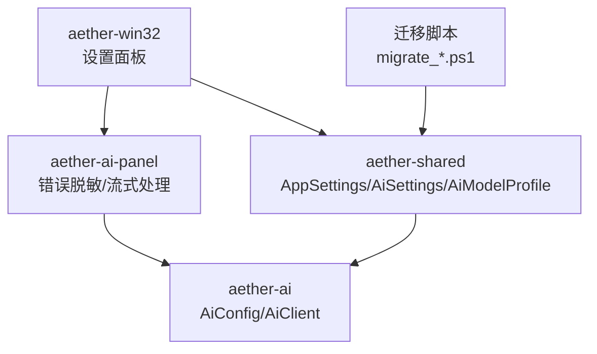
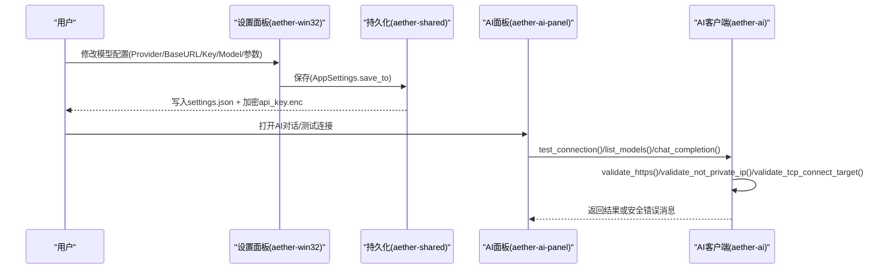
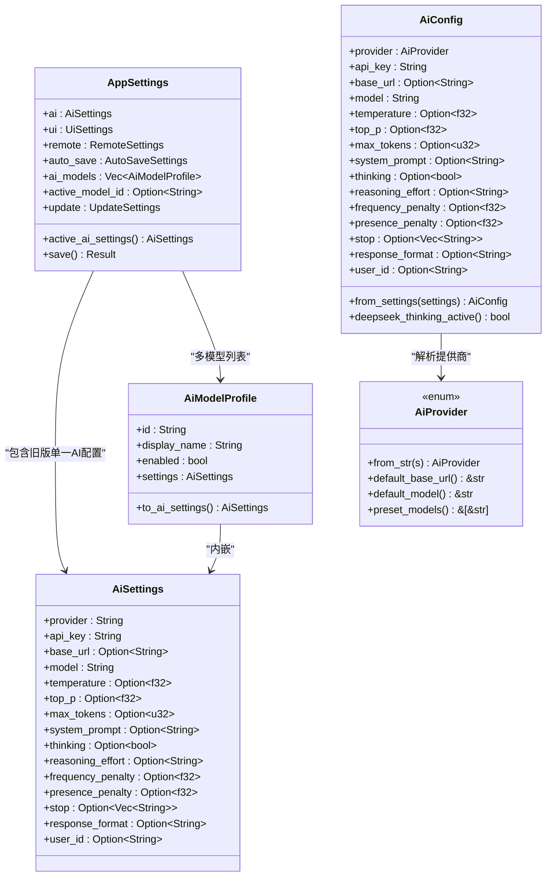
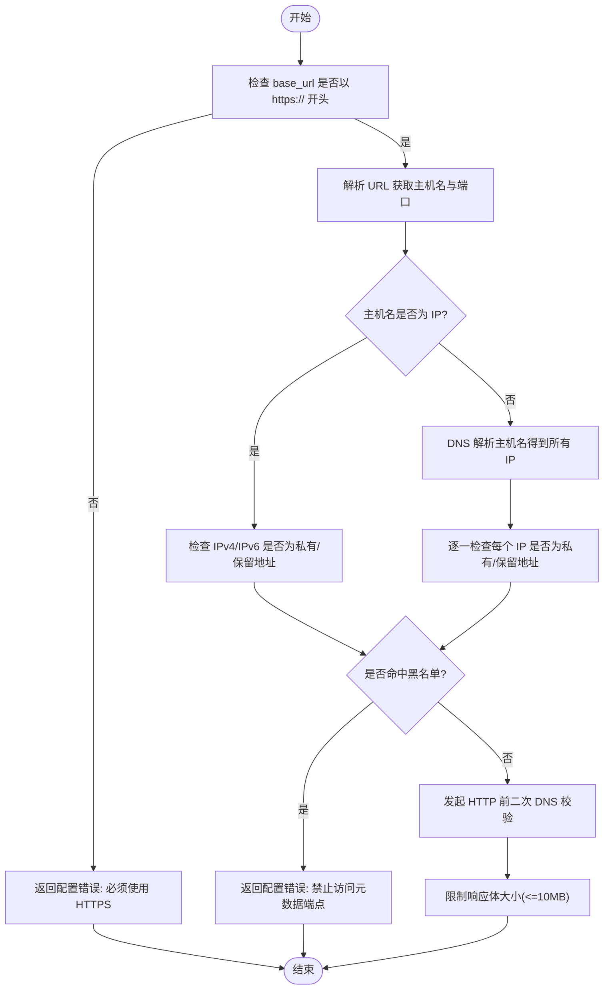
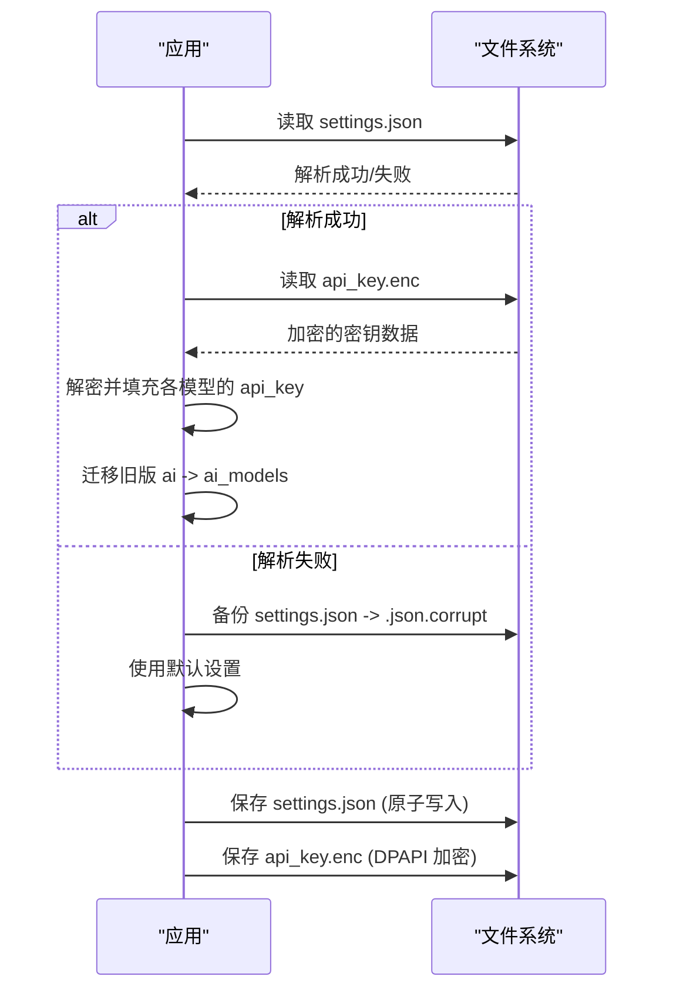
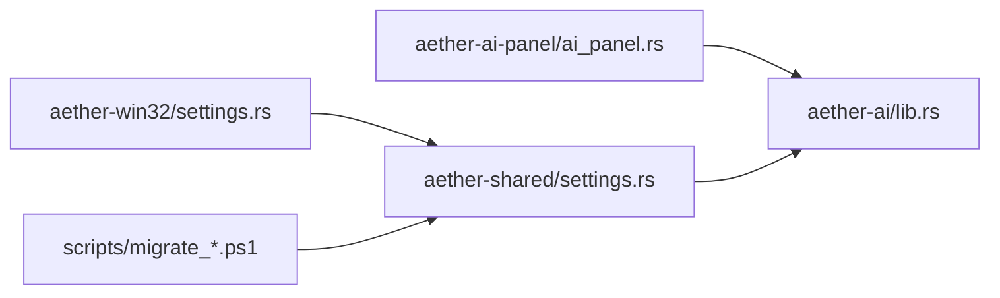

# 配置管理系统

<cite>
**本文引用的文件**
- [aether-shared/src/settings.rs](file://crates/aether-shared/src/settings.rs)
- [aether-ai/src/lib.rs](file://crates/aether-ai/src/lib.rs)
- [aether-win32/src/settings.rs](file://crates/aether-win32/src/settings.rs)
- [aether-ai-panel/src/ai_panel.rs](file://crates/aether-ai-panel/src/ai_panel.rs)
- [migrate_editor_state.ps1](file://scripts/migrate_editor_state.ps1)
- [migrate_editor_state_v7.ps1](file://scripts/migrate_editor_state_v7.ps1)
</cite>

## 目录
1. [简介](#简介)
2. [项目结构](#项目结构)
3. [核心组件](#核心组件)
4. [架构总览](#架构总览)
5. [详细组件分析](#详细组件分析)
6. [依赖关系分析](#依赖关系分析)
7. [性能考虑](#性能考虑)
8. [故障排除指南](#故障排除指南)
9. [结论](#结论)
10. [附录](#附录)

## 简介
本文件系统性地文档化 AI 配置管理子系统，覆盖以下主题：
- AiConfig/AiSettings/AiModelProfile 等结构体的设计、字段含义与默认值策略
- 提供商配置、API Key 管理、模型选择与请求参数配置
- 配置验证机制（HTTPS 强制、私有 IP 检测、SSRF 防护）
- 配置持久化方案（settings.json 格式、版本迁移、数据备份）
- 动态配置更新机制（运行时变更、热重载支持）
- 敏感信息的安全处理（API Key 加密存储、日志脱敏、内存保护）
- 配置示例与最佳实践
- 配置故障排除与调试技巧

## 项目结构
AI 配置管理涉及多个 crate：
- aether-shared：定义 AppSettings、AiSettings、AiModelProfile 等配置结构与持久化逻辑
- aether-ai：定义 AiProvider、AiConfig、AiClient，实现网络请求与安全校验
- aether-win32：UI 设置面板与模型编辑界面，负责将用户输入转换为配置对象
- aether-ai-panel：AI 面板与错误脱敏、流式响应处理
- scripts：编辑器状态迁移脚本（用于历史配置兼容）

图表来源
- [aether-win32/src/settings.rs:1-120](file://crates/aether-win32/src/settings.rs#L1-L120)
- [aether-shared/src/settings.rs:1-120](file://crates/aether-shared/src/settings.rs#L1-L120)
- [aether-ai/src/lib.rs:165-257](file://crates/aether-ai/src/lib.rs#L165-L257)
- [aether-ai-panel/src/ai_panel.rs:17-100](file://crates/aether-ai-panel/src/ai_panel.rs#L17-L100)
- [migrate_editor_state.ps1:91-136](file://scripts/migrate_editor_state.ps1#L91-L136)

章节来源
- [aether-shared/src/settings.rs:1-120](file://crates/aether-shared/src/settings.rs#L1-L120)
- [aether-ai/src/lib.rs:165-257](file://crates/aether-ai/src/lib.rs#L165-L257)
- [aether-win32/src/settings.rs:1-120](file://crates/aether-win32/src/settings.rs#L1-L120)
- [aether-ai-panel/src/ai_panel.rs:17-100](file://crates/aether-ai-panel/src/ai_panel.rs#L17-L100)
- [migrate_editor_state.ps1:91-136](file://scripts/migrate_editor_state.ps1#L91-L136)

## 核心组件
- AppSettings：应用级配置容器，包含 UI、远程、自动保存、AI 多模型列表、激活模型 ID 等
- AiSettings：单个模型的运行参数（provider、api_key、base_url、model、temperature、top_p、max_tokens、system_prompt、thinking、reasoning_effort、penalties、stop、response_format、user_id）
- AiModelProfile：持久化的模型档案（id、display_name、enabled、settings），其中 api_key 不序列化到 settings.json，单独加密存储
- AiProvider：提供商枚举（DeepSeek、Kimi、Custom），提供默认 base_url、默认模型、预置模型清单
- AiConfig：运行时配置对象，由 AiSettings 转换而来，供 AiClient 使用
- AiClient：HTTP 客户端封装，实现连接测试、模型列表拉取、聊天补全、流式补全，并内置安全校验

章节来源
- [aether-shared/src/settings.rs:4-115](file://crates/aether-shared/src/settings.rs#L4-L115)
- [aether-shared/src/settings.rs:143-177](file://crates/aether-shared/src/settings.rs#L143-L177)
- [aether-ai/src/lib.rs:17-82](file://crates/aether-ai/src/lib.rs#L17-L82)
- [aether-ai/src/lib.rs:165-257](file://crates/aether-ai/src/lib.rs#L165-L257)

## 架构总览

图表来源
- [aether-win32/src/settings.rs:151-251](file://crates/aether-win32/src/settings.rs#L151-L251)
- [aether-shared/src/settings.rs:487-559](file://crates/aether-shared/src/settings.rs#L487-L559)
- [aether-ai/src/lib.rs:322-392](file://crates/aether-ai/src/lib.rs#L322-L392)
- [aether-ai/src/lib.rs:572-710](file://crates/aether-ai/src/lib.rs#L572-L710)
- [aether-ai-panel/src/ai_panel.rs:17-100](file://crates/aether-ai-panel/src/ai_panel.rs#L17-L100)

## 详细组件分析

### AiConfig 与 AiSettings 设计
- AiSettings 是持久化与传输的统一参数载体，所有可选参数以 Option 表示，None 表示“不下发该参数”，由服务端决定默认值
- AiModelProfile 将 settings 扁平化到 JSON 中，但 api_key 通过 skip_serializing 避免明文落盘；实际密钥集中为 JSON map 后整体 DPAPI 加密存储于 api_key.enc
- AiConfig 在运行时从 AiSettings 构造，补齐默认 base_url 与 model，并提供 deepseek_thinking_active 判断是否处于 DeepSeek 思考模式
- Debug 输出对 api_key 进行脱敏显示，避免日志泄露

图表来源
- [aether-shared/src/settings.rs:4-115](file://crates/aether-shared/src/settings.rs#L4-L115)
- [aether-shared/src/settings.rs:143-177](file://crates/aether-shared/src/settings.rs#L143-L177)
- [aether-ai/src/lib.rs:17-82](file://crates/aether-ai/src/lib.rs#L17-L82)
- [aether-ai/src/lib.rs:165-257](file://crates/aether-ai/src/lib.rs#L165-L257)

章节来源
- [aether-shared/src/settings.rs:4-115](file://crates/aether-shared/src/settings.rs#L4-L115)
- [aether-shared/src/settings.rs:143-177](file://crates/aether-shared/src/settings.rs#L143-L177)
- [aether-ai/src/lib.rs:165-257](file://crates/aether-ai/src/lib.rs#L165-L257)

### 配置验证机制（HTTPS、私有IP、SSRF）
- HTTPS 强制：所有对外请求前检查 base_url 必须以 https:// 开头
- 私有 IP 检测：解析 URL 主机名，若为 IPv4/IPv6 则检查是否为私有/保留地址；同时 DNS 解析所有返回 IP 并逐一校验
- SSRF 防护：
  - 禁用自动重定向，防止通过 302 跳转到内网
  - 在发起 HTTP 请求前进行二次 DNS 校验（TOCTOU 防护）
  - 黑名单阻止常见云元数据端点（AWS/GCP/Azure/阿里云/腾讯云）
- 响应体限制：读取响应体时限制最大 10MB，防止大响应导致资源耗尽

图表来源
- [aether-ai/src/lib.rs:394-456](file://crates/aether-ai/src/lib.rs#L394-L456)
- [aether-ai/src/lib.rs:458-534](file://crates/aether-ai/src/lib.rs#L458-L534)
- [aether-ai/src/lib.rs:536-558](file://crates/aether-ai/src/lib.rs#L536-L558)

章节来源
- [aether-ai/src/lib.rs:394-558](file://crates/aether-ai/src/lib.rs#L394-L558)

### 配置持久化方案
- settings.json 存储位置：系统配置目录下的 Aether/settings.json
- 原子写入：临时文件 + fsync + rename，确保崩溃不会损坏配置文件
- API Key 加密存储：
  - Windows 平台使用 DPAPI 加密，非 Windows 平台回退为 UTF-8 字节（仅保证编译）
  - 多模型场景下，将所有非空 api_key 收集为 JSON map，整体加密写入 api_key.enc
  - settings.json 中 api_key 字段 skip_serializing，避免明文落盘
- 加载与迁移：
  - 启动时尝试解密 api_key.enc，支持新格式（JSON map）与旧格式（单密钥字符串或裸文本）
  - 若磁盘 JSON 携带旧版 ai 字段且无 ai_models，则迁移为默认模型档案，并设置 active_model_id
  - 若 settings.json 解析失败，记录警告并将原文件备份为 .json.corrupt，然后回退到默认设置

图表来源
- [aether-shared/src/settings.rs:385-453](file://crates/aether-shared/src/settings.rs#L385-L453)
- [aether-shared/src/settings.rs:487-559](file://crates/aether-shared/src/settings.rs#L487-L559)
- [aether-shared/src/settings.rs:562-642](file://crates/aether-shared/src/settings.rs#L562-L642)

章节来源
- [aether-shared/src/settings.rs:385-453](file://crates/aether-shared/src/settings.rs#L385-L453)
- [aether-shared/src/settings.rs:487-559](file://crates/aether-shared/src/settings.rs#L487-L559)
- [aether-shared/src/settings.rs:562-642](file://crates/aether-shared/src/settings.rs#L562-L642)

### 动态配置更新机制
- 运行时配置变更：
  - 设置面板（aether-win32）将用户输入转换为 ModelConfig，再转为 AiModelProfile 并保存到 AppSettings
  - 通过 apply_settings/load_active_model_fields 将当前激活模型的配置加载到 UI 字段，支持未保存更改检测（baseline_ai 快照）
- 热重载支持：
  - 当前实现通过保存 settings.json 与 api_key.enc 实现持久化，AI 客户端在每次调用时从最新配置构造 AiConfig
  - 流式请求与测试连接均会重新校验 HTTPS、私有 IP、DNS 目标，确保运行时配置生效
- 模型列表动态拉取：
  - 支持后台异步拉取 /models 接口，缓存 fetched_models 与 fetched_models_key，当 provider/base/key 变化时重新拉取

章节来源
- [aether-win32/src/settings.rs:151-251](file://crates/aether-win32/src/settings.rs#L151-L251)
- [aether-win32/src/settings.rs:622-715](file://crates/aether-win32/src/settings.rs#L622-L715)
- [aether-ai/src/lib.rs:322-392](file://crates/aether-ai/src/lib.rs#L322-L392)

### 敏感信息安全处理
- API Key 加密存储：
  - Windows 使用 DPAPI 加密，非 Windows 平台回退为 UTF-8 字节
  - settings.json 中 api_key 字段 skip_serializing，避免明文落盘
  - 多模型场景下集中为 JSON map 后整体加密存储
- 日志脱敏：
  - AiConfig 的 Debug 实现将 api_key 显示为 "[REDACTED]"
  - ai_panel 中的 sanitize_error 函数循环移除 Bearer、x-api-key、authorization 头中的敏感值，并限制长度
  - AiError::safe_display 提供对用户安全的错误描述，不包含原始 API 响应体
- 内存保护：
  - 解密后的密钥仅在内存中短暂存在，随作用域结束释放
  - 响应体读取限制 10MB，防止恶意大响应占用内存

章节来源
- [aether-shared/src/settings.rs:562-642](file://crates/aether-shared/src/settings.rs#L562-L642)
- [aether-ai/src/lib.rs:192-214](file://crates/aether-ai/src/lib.rs#L192-L214)
- [aether-ai-panel/src/ai_panel.rs:17-100](file://crates/aether-ai-panel/src/ai_panel.rs#L17-L100)
- [aether-ai/src/lib.rs:110-163](file://crates/aether-ai/src/lib.rs#L110-L163)

### 配置示例与最佳实践
- 基础配置：
  - provider: "deepseek" 或 "kimi" 或 "custom"
  - base_url: 必须为 HTTPS 开头的有效 URL
  - model: 使用提供商默认模型或自定义模型 ID
  - temperature/top_p/max_tokens/system_prompt/thinking/reasoning_effort/frequency_penalty/presence_penalty/stop/response_format/user_id: 按需设置，None 表示不下发
- 最佳实践：
  - 始终使用 HTTPS base_url，避免明文传输
  - 避免将 API Key 写入 settings.json，依赖系统加密存储
  - 合理设置 max_input_tokens 控制上下文窗口预算
  - 使用 response_format="json_object" 强制 JSON 输出，便于程序解析
  - 定期轮换 API Key，避免长期暴露
  - 在公共环境中启用 thinking=false 以减少响应延迟

章节来源
- [aether-shared/src/settings.rs:73-115](file://crates/aether-shared/src/settings.rs#L73-L115)
- [aether-ai/src/lib.rs:44-73](file://crates/aether-ai/src/lib.rs#L44-L73)

### 配置故障排除与调试技巧
- 常见问题：
  - HTTPS 错误：检查 base_url 是否以 https:// 开头
  - 私有 IP 错误：确认域名解析到公网 IP，避免指向内网地址
  - 元数据端点被阻止：检查是否误配云平台元数据地址
  - API Key 未设置：确保已正确填写并保存
  - 响应体过大：检查服务器是否返回异常大响应
- 调试技巧：
  - 使用 test_connection_safe/list_models_safe 获取脱敏的错误消息
  - 查看 settings.json 与 api_key.enc 是否存在且格式正确
  - 检查迁移脚本是否正确处理旧版配置
  - 启用日志并过滤敏感信息，关注 "[本地调用失败]" 与 "[API 返回错误]" 区分

章节来源
- [aether-ai/src/lib.rs:322-392](file://crates/aether-ai/src/lib.rs#L322-L392)
- [aether-ai-panel/src/ai_panel.rs:802-834](file://crates/aether-ai-panel/src/ai_panel.rs#L802-L834)
- [aether-shared/src/settings.rs:442-453](file://crates/aether-shared/src/settings.rs#L442-L453)

## 依赖关系分析

图表来源
- [aether-win32/src/settings.rs:1-120](file://crates/aether-win32/src/settings.rs#L1-L120)
- [aether-shared/src/settings.rs:1-120](file://crates/aether-shared/src/settings.rs#L1-L120)
- [aether-ai/src/lib.rs:165-257](file://crates/aether-ai/src/lib.rs#L165-L257)
- [migrate_editor_state.ps1:91-136](file://scripts/migrate_editor_state.ps1#L91-L136)

章节来源
- [aether-win32/src/settings.rs:1-120](file://crates/aether-win32/src/settings.rs#L1-L120)
- [aether-shared/src/settings.rs:1-120](file://crates/aether-shared/src/settings.rs#L1-L120)
- [aether-ai/src/lib.rs:165-257](file://crates/aether-ai/src/lib.rs#L165-L257)
- [migrate_editor_state.ps1:91-136](file://scripts/migrate_editor_state.ps1#L91-L136)

## 性能考虑
- 流式请求超时：连接超时 15 秒，读空闲超时 300 秒，避免长生成被中断
- 响应体限制：最大 10MB，防止内存溢出
- 原子写入：减少配置损坏风险，提升可靠性
- 模型列表缓存：避免重复拉取，降低网络开销

[本节为通用性能讨论，无需特定文件引用]

## 故障排除指南
- 配置加载失败：检查 settings.json 是否损坏，查看 .json.corrupt 备份
- API Key 解密失败：确认 api_key.enc 格式正确，Windows 平台需相同机器解密
- 网络连接问题：检查防火墙、代理设置，确认 base_url 可达
- 模型列表为空：检查 /models 接口权限，确认 API Key 有效

章节来源
- [aether-shared/src/settings.rs:442-453](file://crates/aether-shared/src/settings.rs#L442-L453)
- [aether-ai/src/lib.rs:322-392](file://crates/aether-ai/src/lib.rs#L322-L392)

## 结论
本配置管理系统通过结构化设计、严格的安全校验、可靠的持久化机制与完善的敏感信息保护，提供了稳定、安全、易用的 AI 配置管理能力。建议在生产环境中遵循最佳实践，定期审计配置与密钥，并结合监控与日志系统进行持续优化。

[本节为总结性内容，无需特定文件引用]

## 附录
- 迁移脚本说明：
  - migrate_editor_state.ps1：字段重命名与结构重组
  - migrate_editor_state_v7.ps1：进一步的结构调整与兼容性处理

章节来源
- [migrate_editor_state.ps1:91-136](file://scripts/migrate_editor_state.ps1#L91-L136)
- [migrate_editor_state_v7.ps1:35-77](file://scripts/migrate_editor_state_v7.ps1#L35-L77)