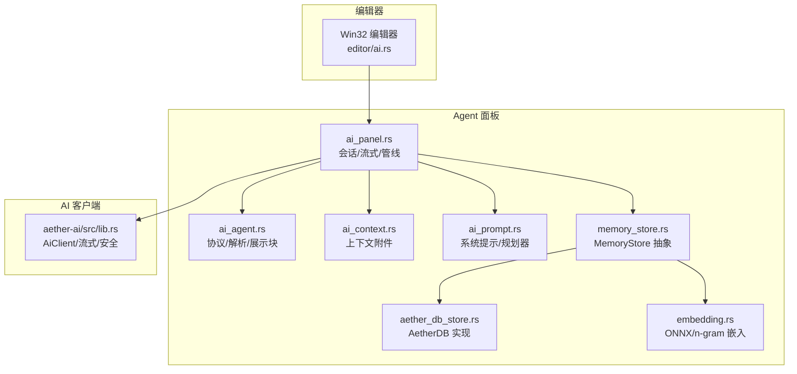
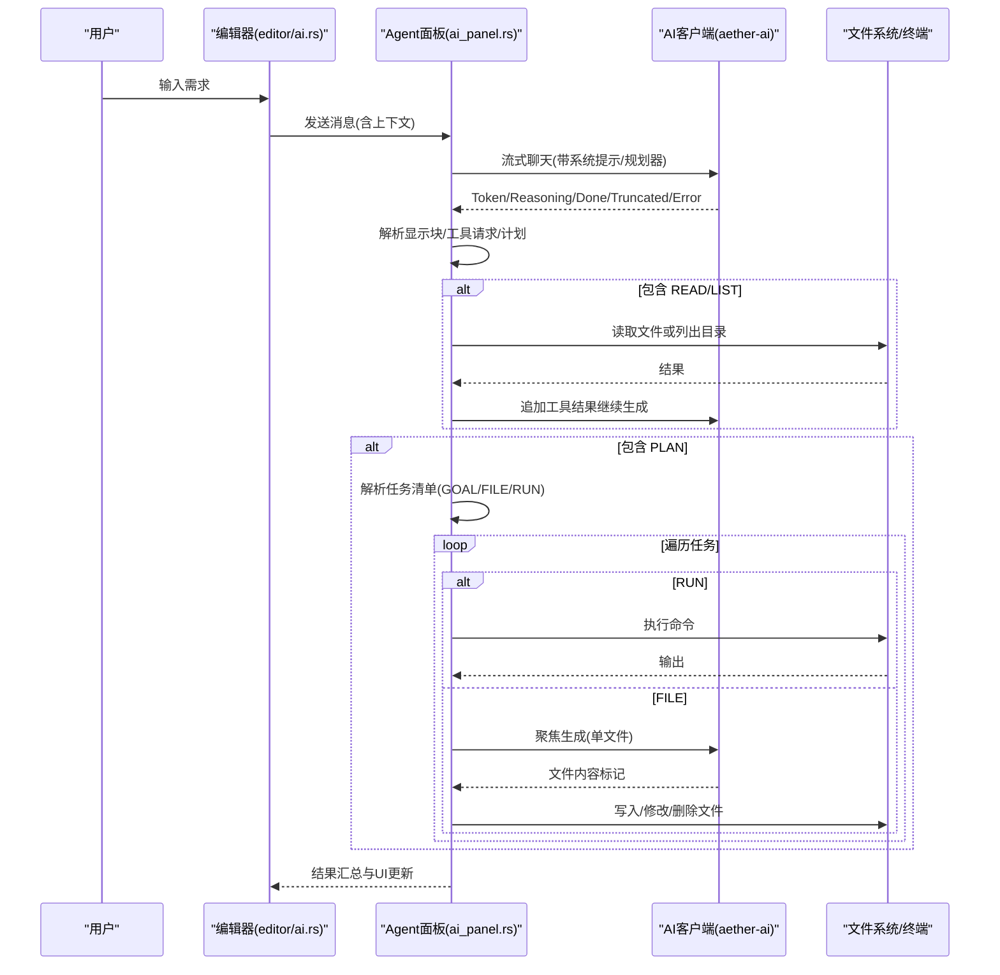
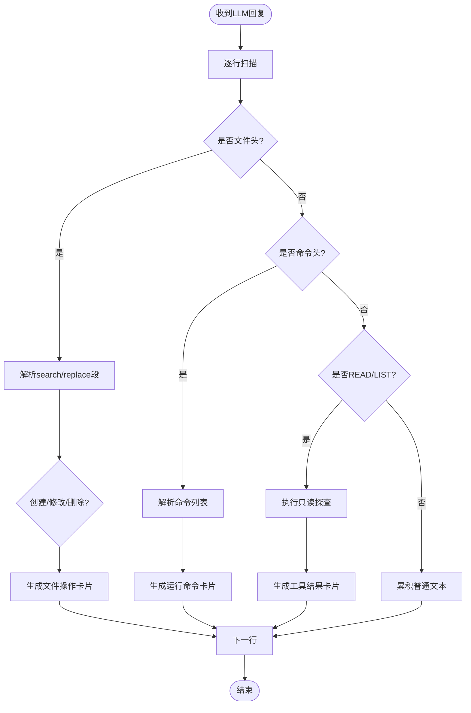
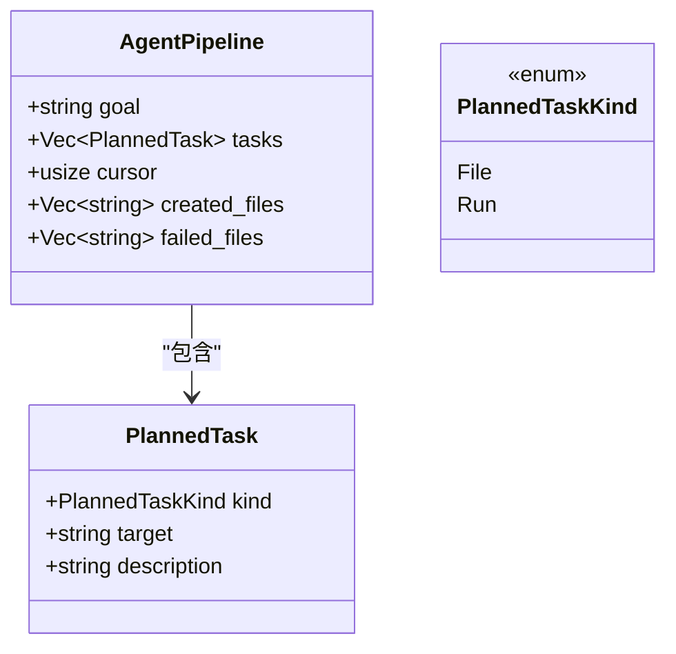
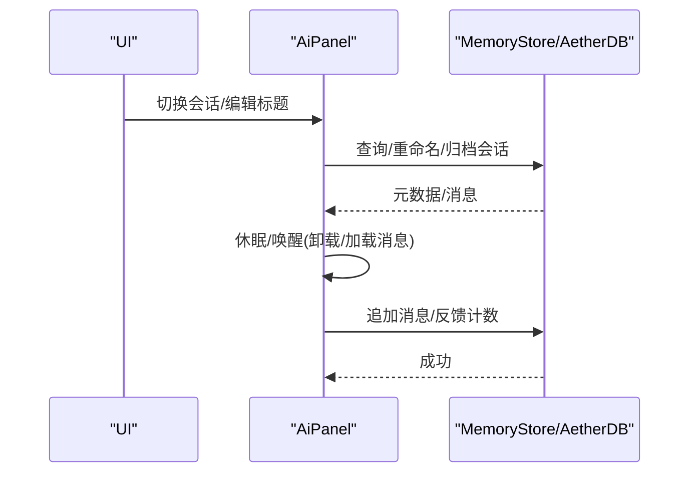
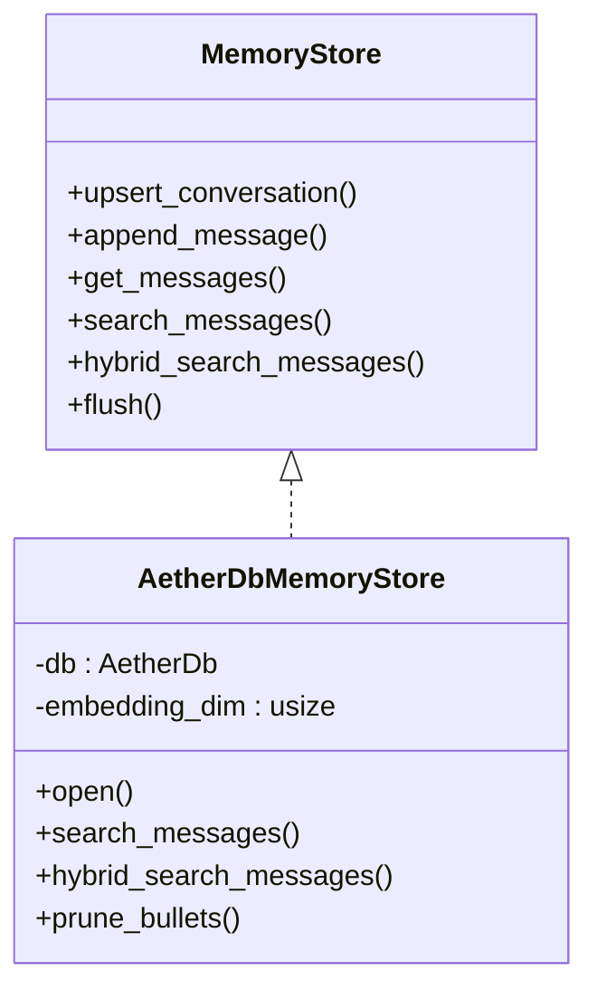
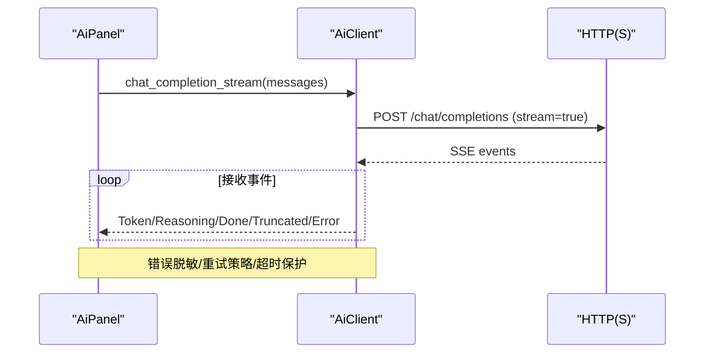
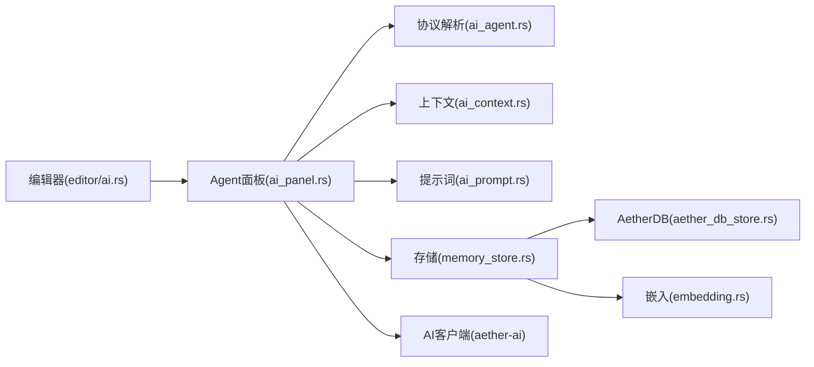

# Agent 模式

<cite>
**本文引用的文件列表**
- [AGENT_SPEC.md](file://AGENT_SPEC.md)
- [aether-ai-panel/src/lib.rs](file://crates/aether-ai-panel/src/lib.rs)
- [aether-ai-panel/src/ai_agent.rs](file://crates/aether-ai-panel/src/ai_agent.rs)
- [aether-ai-panel/src/ai_context.rs](file://crates/aether-ai-panel/src/ai_context.rs)
- [aether-ai-panel/src/ai_panel.rs](file://crates/aether-ai-panel/src/ai_panel.rs)
- [aether-ai-panel/src/ai_prompt.rs](file://crates/aether-ai-panel/src/ai_prompt.rs)
- [aether-ai-panel/src/memory_store.rs](file://crates/aether-ai-panel/src/memory_store.rs)
- [aether-ai-panel/src/aether_db_store.rs](file://crates/aether-ai-panel/src/aether_db_store.rs)
- [aether-ai-panel/src/embedding.rs](file://crates/aether-ai-panel/src/embedding.rs)
- [aether-ai/src/lib.rs](file://crates/aether-ai/src/lib.rs)
- [aether-win32/src/editor/ai.rs](file://crates/aether-win32/src/editor/ai.rs)
</cite>

## 目录
1. [简介](#简介)
2. [项目结构](#项目结构)
3. [核心组件](#核心组件)
4. [架构总览](#架构总览)
5. [详细组件分析](#详细组件分析)
6. [依赖关系分析](#依赖关系分析)
7. [性能考量](#性能考量)
8. [故障排查指南](#故障排查指南)
9. [结论](#结论)
10. [附录：开发指南与最佳实践](#附录开发指南与最佳实践)

## 简介
本仓库实现了面向编辑器的“智能体（Agent）”能力，围绕任务分解、工具调用与工作流编排展开。Agent 通过一套行锚定协议标记与 LLM 交互，自动完成文件读写、命令执行、代码分析与多步工作流编排；同时提供对话上下文管理（上下文收集、状态维护、会话持久化）、记忆存储（向量检索、混合检索）、以及安全可控的 AI 客户端封装。整体目标是让编辑器具备生产级自动化能力：从简单问答到复杂的多文件生成与构建测试流水线。

## 项目结构
Agent 相关能力主要分布在以下 crate 与模块中：
- aether-ai-panel：Agent 面板、工作流编排、工具解析、上下文与持久化
- aether-ai：AI 客户端与安全配置（OpenAI 兼容接口、流式响应、错误处理）
- aether-win32/editor/ai：编辑器侧集成，驱动 Agent 流程、执行工具与结果聚合
- 其他：嵌入模型、数据库存储、提示词构建等

图表来源
- [aether-win32/src/editor/ai.rs:198-230](file://crates/aether-win32/src/editor/ai.rs#L198-L230)
- [aether-ai-panel/src/ai_panel.rs:540-730](file://crates/aether-ai-panel/src/ai_panel.rs#L540-L730)
- [aether-ai-panel/src/ai_agent.rs:1-120](file://crates/aether-ai-panel/src/ai_agent.rs#L1-L120)
- [aether-ai-panel/src/ai_prompt.rs:25-144](file://crates/aether-ai-panel/src/ai_prompt.rs#L25-L144)
- [aether-ai-panel/src/memory_store.rs:77-141](file://crates/aether-ai-panel/src/memory_store.rs#L77-L141)
- [aether-ai-panel/src/aether_db_store.rs:77-162](file://crates/aether-ai-panel/src/aether_db_store.rs#L77-L162)
- [aether-ai-panel/src/embedding.rs:18-121](file://crates/aether-ai-panel/src/embedding.rs#L18-L121)
- [aether-ai/src/lib.rs:259-320](file://crates/aether-ai/src/lib.rs#L259-L320)

章节来源
- [AGENT_SPEC.md:38-97](file://AGENT_SPEC.md#L38-L97)
- [aether-ai-panel/src/lib.rs:1-14](file://crates/aether-ai-panel/src/lib.rs#L1-L14)

## 核心组件
- 协议与工具解析：定义并解析 Agent 与 LLM 之间的行锚定协议标记，支持文件创建/修改/删除、终端命令执行、只读探查（读取文件/列出目录）、精准定位与编辑、规划任务清单等。
- 工作流编排：将 LLM 输出的任务清单转化为可执行的流水线，顺序推进 RUN 任务，并发或聚焦地生成 FILE 任务，并在完成后进行结果聚合与汇报。
- 对话上下文管理：收集当前文件、选区、打开文件、诊断、文件树等上下文，构造系统提示，维护会话状态与历史，支持休眠/唤醒与持久化。
- 记忆与检索：基于 MemoryStore 抽象，使用 AetherDB 实现会话/消息/条目存储，支持向量检索与关键词+向量的混合检索（RRF）。
- AI 客户端：封装 OpenAI 兼容接口，支持流式响应、思考模式参数注入、安全校验（HTTPS、私有 IP 阻断、DNS TOCTOU 防护）、错误分类与重试策略。

章节来源
- [aether-ai-panel/src/ai_agent.rs:1-120](file://crates/aether-ai-panel/src/ai_agent.rs#L1-L120)
- [aether-ai-panel/src/ai_panel.rs:540-730](file://crates/aether-ai-panel/src/ai_panel.rs#L540-L730)
- [aether-ai-panel/src/ai_context.rs:1-117](file://crates/aether-ai-panel/src/ai_context.rs#L1-L117)
- [aether-ai-panel/src/memory_store.rs:77-141](file://crates/aether-ai-panel/src/memory_store.rs#L77-L141)
- [aether-ai-panel/src/aether_db_store.rs:77-162](file://crates/aether-ai-panel/src/aether_db_store.rs#L77-L162)
- [aether-ai/src/lib.rs:259-320](file://crates/aether-ai/src/lib.rs#L259-L320)

## 架构总览
Agent 的工作流由“规划器 → 工作线程 → 结果聚合”构成。LLM 在 Agent 模式下被要求先输出任务清单（PLAN），随后系统为每个 FILE 任务发起聚焦生成调用，RUN 任务直接执行。工具请求（READ/LIST）在执行过程中同步回传结果，支撑后续步骤。

图表来源
- [aether-ai-panel/src/ai_panel.rs:731-800](file://crates/aether-ai-panel/src/ai_panel.rs#L731-L800)
- [aether-ai-panel/src/ai_agent.rs:500-541](file://crates/aether-ai-panel/src/ai_agent.rs#L500-L541)
- [aether-ai-panel/src/ai_agent.rs:560-617](file://crates/aether-ai-panel/src/ai_agent.rs#L560-L617)
- [aether-win32/src/editor/ai.rs:1160-1224](file://crates/aether-win32/src/editor/ai.rs#L1160-L1224)

## 详细组件分析

### 协议与工具系统
- 协议标记：文件块（创建/修改/删除）、命令块（终端执行）、只读探查（READ/LIST）、精准定位与编辑、规划任务清单。所有标记独占一行，避免误触发。
- 解析器：按行扫描识别标记，提取路径、搜索/替换段、命令、定位方式与操作类型；支持流式中断抢救新建文件块。
- 展示块：将原始标记转换为清晰的操作卡片（文本、文件操作、运行命令、读取/列出、不完整通知），隐藏内部协议泄漏。

图表来源
- [aether-ai-panel/src/ai_agent.rs:174-236](file://crates/aether-ai-panel/src/ai_agent.rs#L174-L236)
- [aether-ai-panel/src/ai_agent.rs:466-498](file://crates/aether-ai-panel/src/ai_agent.rs#L466-L498)
- [aether-ai-panel/src/ai_agent.rs:500-541](file://crates/aether-ai-panel/src/ai_agent.rs#L500-L541)
- [aether-ai-panel/src/ai_agent.rs:619-800](file://crates/aether-ai-panel/src/ai_agent.rs#L619-L800)

章节来源
- [aether-ai-panel/src/ai_agent.rs:1-120](file://crates/aether-ai-panel/src/ai_agent.rs#L1-L120)
- [aether-ai-panel/src/ai_agent.rs:174-236](file://crates/aether-ai-panel/src/ai_agent.rs#L174-L236)
- [aether-ai-panel/src/ai_agent.rs:466-498](file://crates/aether-ai-panel/src/ai_agent.rs#L466-L498)
- [aether-ai-panel/src/ai_agent.rs:500-541](file://crates/aether-ai-panel/src/ai_agent.rs#L500-L541)
- [aether-ai-panel/src/ai_agent.rs:619-800](file://crates/aether-ai-panel/src/ai_agent.rs#L619-L800)

### 工作流编排（规划器、工作线程、结果聚合）
- 规划器：当需求涉及多文件或多步骤时，要求 LLM 输出 PLAN 块（GOAL/FILE/RUN），限制最多任务数，避免上下文过载。
- 流水线：顺序推进 RUN 任务直接执行；对 FILE 任务发起聚焦 worker 调用，携带整体目标、已生成文件内容与目标文件现有内容，确保跨文件一致性。
- 结果聚合：统计文件/命令/工具操作数量，生成总结信息；失败文件记录并汇报；支持流式截断后的“继续生成”。

图表来源
- [aether-ai-panel/src/ai_panel.rs:540-552](file://crates/aether-ai-panel/src/ai_panel.rs#L540-L552)
- [aether-ai-panel/src/ai_agent.rs:543-558](file://crates/aether-ai-panel/src/ai_agent.rs#L543-L558)

章节来源
- [aether-ai-panel/src/ai_panel.rs:540-730](file://crates/aether-ai-panel/src/ai_panel.rs#L540-L730)
- [aether-ai-panel/src/ai_agent.rs:543-617](file://crates/aether-ai-panel/src/ai_agent.rs#L543-L617)
- [aether-win32/src/editor/ai.rs:1160-1224](file://crates/aether-win32/src/editor/ai.rs#L1160-L1224)

### 对话上下文管理（收集、维护、持久化）
- 上下文收集：支持当前文件、选区、打开文件、诊断、文件树、自定义文本等附件，构造系统提示，防止指令注入。
- 状态维护：会话对象包含消息、输入、滚动、模式、附件、流式状态、标签页、历史等；支持后台会话并发流式生成与休眠/唤醒。
- 持久化：热数据 JSONL 追加日志，温数据 AetherDB 存储会话/消息/条目；支持语义检索与混合检索（RRF）。

图表来源
- [aether-ai-panel/src/ai_context.rs:1-117](file://crates/aether-ai-panel/src/ai_context.rs#L1-L117)
- [aether-ai-panel/src/ai_panel.rs:258-460](file://crates/aether-ai-panel/src/ai_panel.rs#L258-L460)
- [aether-ai-panel/src/memory_store.rs:77-141](file://crates/aether-ai-panel/src/memory_store.rs#L77-L141)
- [aether-ai-panel/src/aether_db_store.rs:77-162](file://crates/aether-ai-panel/src/aether_db_store.rs#L77-L162)

章节来源
- [aether-ai-panel/src/ai_context.rs:1-117](file://crates/aether-ai-panel/src/ai_context.rs#L1-L117)
- [aether-ai-panel/src/ai_panel.rs:258-460](file://crates/aether-ai-panel/src/ai_panel.rs#L258-L460)
- [aether-ai-panel/src/memory_store.rs:249-306](file://crates/aether-ai-panel/src/memory_store.rs#L249-L306)
- [aether-ai-panel/src/aether_db_store.rs:77-162](file://crates/aether-ai-panel/src/aether_db_store.rs#L77-L162)

### 记忆与检索（向量与混合检索）
- 嵌入模型：ONNX Runtime 加载 bge-small-zh-v1.5，未初始化时回退 n-gram 哈希向量，保证维度一致。
- 存储抽象：MemoryStore 统一接口，AetherDbMemoryStore 实现会话/消息/条目 CRUD、向量检索、混合检索（关键词子串 + 向量 RRF）。
- 权重沉淀：Playbook 条目带 helpful/harmful 计数，支持剪枝审计与 grow-and-refine 策略。

图表来源
- [aether-ai-panel/src/memory_store.rs:77-141](file://crates/aether-ai-panel/src/memory_store.rs#L77-L141)
- [aether-ai-panel/src/aether_db_store.rs:77-162](file://crates/aether-ai-panel/src/aether_db_store.rs#L77-L162)
- [aether-ai-panel/src/aether_db_store.rs:302-381](file://crates/aether-ai-panel/src/aether_db_store.rs#L302-L381)

章节来源
- [aether-ai-panel/src/embedding.rs:18-121](file://crates/aether-ai-panel/src/embedding.rs#L18-L121)
- [aether-ai-panel/src/memory_store.rs:77-141](file://crates/aether-ai-panel/src/memory_store.rs#L77-L141)
- [aether-ai-panel/src/aether_db_store.rs:302-381](file://crates/aether-ai-panel/src/aether_db_store.rs#L302-L381)

### AI 客户端与安全
- 提供商适配：DeepSeek/Kimi/Custom，默认 Base URL 与模型名，支持模型列表拉取。
- 流式响应：SSE 流式事件（Token/Reasoning/Done/Truncated/Error），后台线程轮询写入共享状态。
- 安全控制：HTTPS 强制、私有 IP/保留地址阻断、DNS TOCTOU 二次校验、禁止云元数据端点、响应体大小限制、错误消息脱敏。
- 错误分类：可重试（429/500/503）与永久错误（400/401/402/403/404/422），提供安全展示文案。

图表来源
- [aether-ai/src/lib.rs:259-320](file://crates/aether-ai/src/lib.rs#L259-L320)
- [aether-ai/src/lib.rs:572-710](file://crates/aether-ai/src/lib.rs#L572-L710)
- [aether-ai/src/lib.rs:712-800](file://crates/aether-ai/src/lib.rs#L712-L800)

章节来源
- [aether-ai/src/lib.rs:84-163](file://crates/aether-ai/src/lib.rs#L84-L163)
- [aether-ai/src/lib.rs:394-534](file://crates/aether-ai/src/lib.rs#L394-L534)
- [aether-ai/src/lib.rs:572-800](file://crates/aether-ai/src/lib.rs#L572-L800)

## 依赖关系分析
- 编辑器侧（aether-win32/editor/ai.rs）驱动 Agent 流程，解析工具请求并执行，聚合结果。
- Agent 面板（aether-ai-panel）负责协议解析、工作流编排、上下文与持久化。
- AI 客户端（aether-ai）提供安全可靠的 LLM 通信。
- 存储层（memory_store/aether_db_store）提供会话/消息/条目存储与检索。
- 嵌入模型（embedding）提供向量检索能力。

图表来源
- [aether-win32/src/editor/ai.rs:198-230](file://crates/aether-win32/src/editor/ai.rs#L198-L230)
- [aether-ai-panel/src/ai_panel.rs:540-730](file://crates/aether-ai-panel/src/ai_panel.rs#L540-L730)
- [aether-ai-panel/src/ai_agent.rs:1-120](file://crates/aether-ai-panel/src/ai_agent.rs#L1-L120)
- [aether-ai-panel/src/ai_context.rs:1-117](file://crates/aether-ai-panel/src/ai_context.rs#L1-L117)
- [aether-ai-panel/src/ai_prompt.rs:25-144](file://crates/aether-ai-panel/src/ai_prompt.rs#L25-L144)
- [aether-ai-panel/src/memory_store.rs:77-141](file://crates/aether-ai-panel/src/memory_store.rs#L77-L141)
- [aether-ai-panel/src/aether_db_store.rs:77-162](file://crates/aether-ai-panel/src/aether_db_store.rs#L77-L162)
- [aether-ai-panel/src/embedding.rs:18-121](file://crates/aether-ai-panel/src/embedding.rs#L18-L121)
- [aether-ai/src/lib.rs:259-320](file://crates/aether-ai/src/lib.rs#L259-L320)

章节来源
- [aether-ai-panel/src/lib.rs:1-14](file://crates/aether-ai-panel/src/lib.rs#L1-L14)

## 性能考量
- 流式生成：后台线程接收 SSE 事件，UI 轮询共享状态，避免阻塞渲染循环。
- 上下文裁剪：长文本中间省略，减少提示词长度与成本。
- 向量检索：小数据集自动退化暴力搜索，避免 HNSW 索引开销；混合检索使用 RRF 融合提升召回质量。
- 存储优化：JSONL 追加写 + 立即 flush，崩溃不丢历史；AetherDB 压缩回收墓碑垃圾。
- 网络超时：连接 15s、读空闲 300s，避免长生成被掐断；响应体限制 10MB。

[本节为通用性能讨论，无需特定文件引用]

## 故障排查指南
- 工具请求失败：检查文件路径与权限，查看工具结果卡片中的错误信息。
- 流式中断：若出现 Error，已接收的部分内容（含完整文件块）仍可抢救；支持“继续生成”应对截断。
- 网络错误：确认 HTTPS、API Key、Base URL；查看安全错误脱敏文案。
- 存储异常：检查 AetherDB 文件路径与维度匹配；必要时执行 shrink_memory 回收空间。
- 嵌入模型：未找到 ONNX 模型时回退 n-gram，语义质量有限；按指引下载模型。

章节来源
- [aether-ai-panel/src/ai_panel.rs:731-800](file://crates/aether-ai-panel/src/ai_panel.rs#L731-L800)
- [aether-ai/src/lib.rs:110-163](file://crates/aether-ai/src/lib.rs#L110-L163)
- [aether-ai-panel/src/aether_db_store.rs:285-300](file://crates/aether-ai-panel/src/aether_db_store.rs#L285-L300)
- [aether-ai-panel/src/embedding.rs:154-185](file://crates/aether-ai-panel/src/embedding.rs#L154-L185)

## 结论
该 Agent 模式通过严谨的协议设计、可靠的工作流编排、安全的 AI 客户端与强大的记忆检索能力，为编辑器提供了生产级的自动化能力。它既能处理简单问答，也能胜任复杂的多文件生成与构建测试流水线，同时保障用户体验与数据安全。

[本节为总结性内容，无需特定文件引用]

## 附录：开发指南与最佳实践

### 自定义工具开发
- 扩展协议：在 ai_agent.rs 中添加新的行锚定标记与解析逻辑，确保独占一行且前缀唯一。
- 工具执行：在编辑器侧实现 execute_tool_requests，返回显示与反馈，供 LLM 继续推理。
- 展示块：在 parse_display_blocks 中新增对应卡片类型，提升用户可见性。

章节来源
- [aether-ai-panel/src/ai_agent.rs:1-120](file://crates/aether-ai-panel/src/ai_agent.rs#L1-L120)
- [aether-win32/src/editor/ai.rs:1106-1130](file://crates/aether-win32/src/editor/ai.rs#L1106-L1130)

### 插件扩展
- 通过 MemoryStore 抽象扩展存储后端（如远程数据库），保持上层不变。
- 嵌入模型可替换为其他 ONNX 模型，注意维度一致性与归一化。

章节来源
- [aether-ai-panel/src/memory_store.rs:77-141](file://crates/aether-ai-panel/src/memory_store.rs#L77-L141)
- [aether-ai-panel/src/embedding.rs:18-121](file://crates/aether-ai-panel/src/embedding.rs#L18-L121)

### 错误处理与恢复机制
- 任务失败重试：对 429/500/503 等临时错误采用指数退避重试。
- 状态回滚：文件操作失败时记录 failed_files，最终汇报；支持流式截断后的继续生成。
- 安全脱敏：所有用户可见错误使用 safe_display，避免泄露敏感信息。

章节来源
- [aether-ai/src/lib.rs:110-163](file://crates/aether-ai/src/lib.rs#L110-L163)
- [aether-ai-panel/src/ai_panel.rs:540-730](file://crates/aether-ai-panel/src/ai_panel.rs#L540-L730)

### 实际使用场景与最佳实践
- 多文件生成：优先输出 PLAN 清单，系统为每个 FILE 任务聚焦生成，确保上下文充足。
- 只读探查先行：不确定项目结构时，先用 READ/LIST 探查，再决定修改策略。
- 命令执行谨慎：仅执行必要命令，避免高危操作；观察终端输出并据此调整。
- 会话管理：合理使用附件（当前文件、选区、打开文件、诊断、文件树），提升回答质量。

章节来源
- [aether-ai-panel/src/ai_prompt.rs:25-144](file://crates/aether-ai-panel/src/ai_prompt.rs#L25-L144)
- [aether-ai-panel/src/ai_context.rs:1-117](file://crates/aether-ai-panel/src/ai_context.rs#L1-L117)