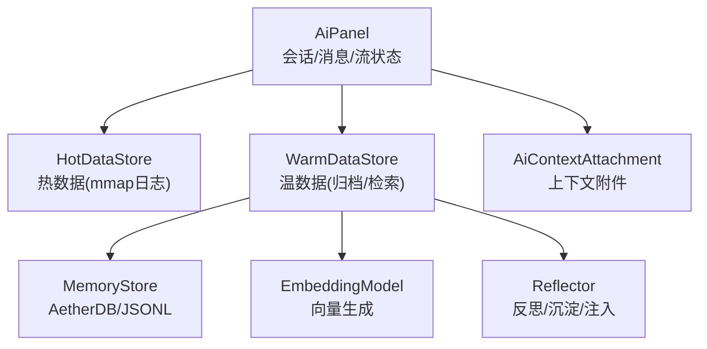
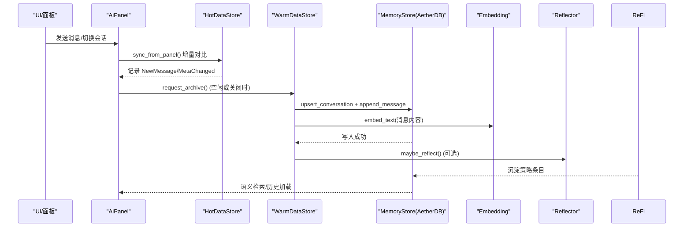
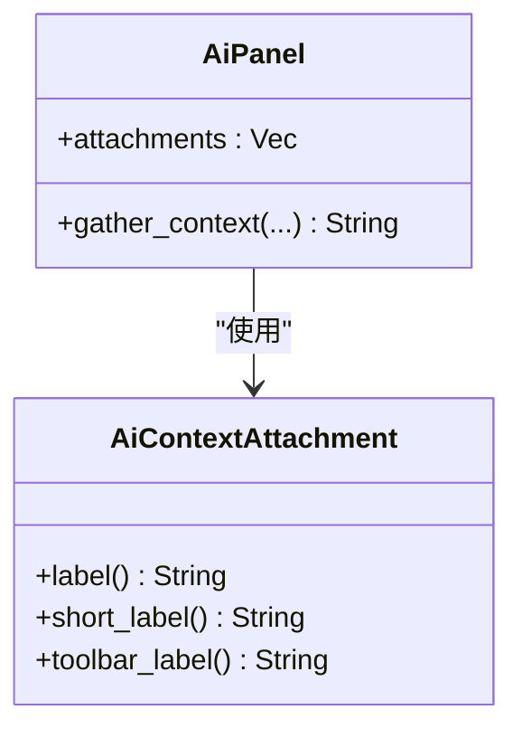
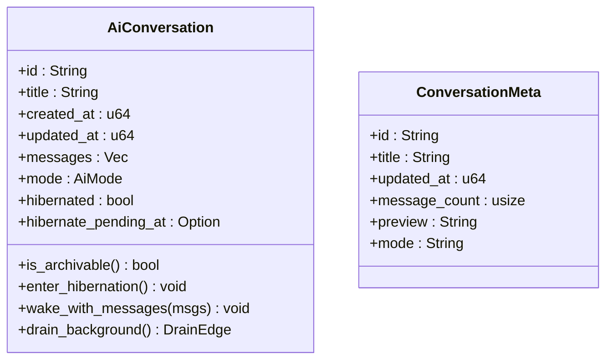
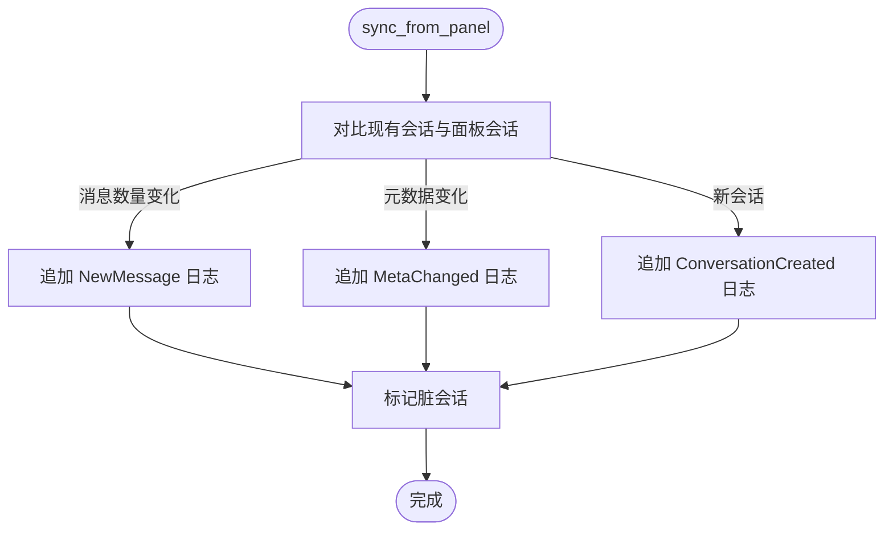
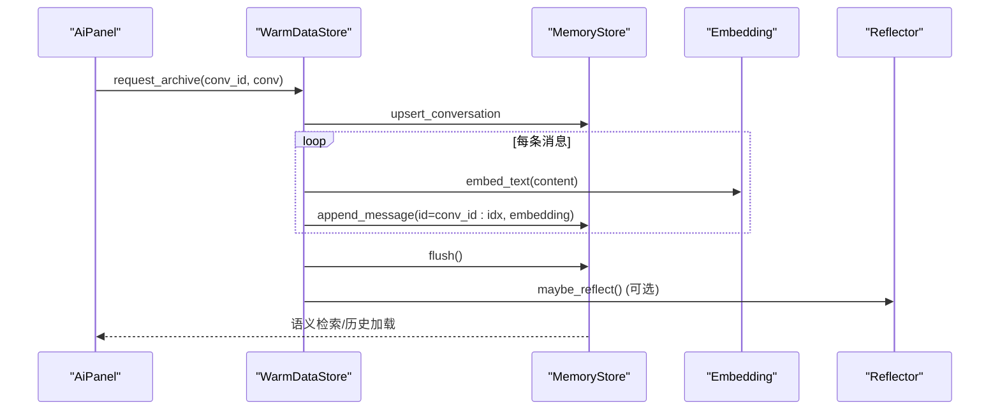
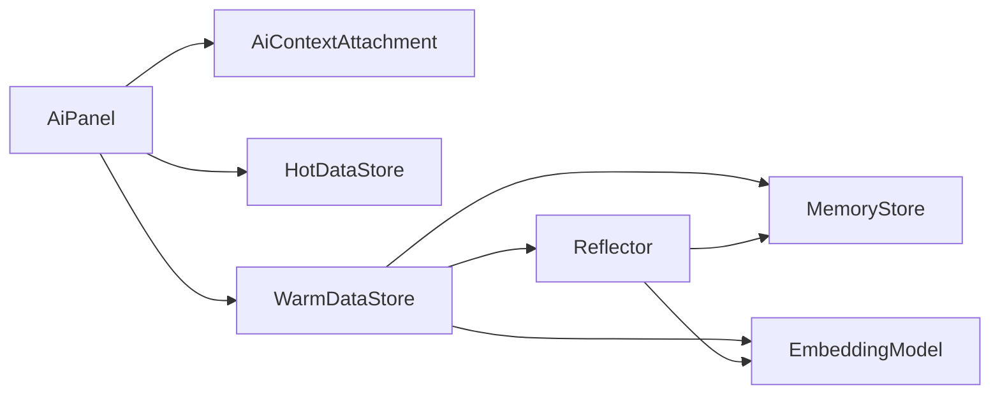

# 上下文管理

<cite>
**本文引用的文件**
- [ai_context.rs](file://crates/aether-ai-panel/src/ai_context.rs)
- [ai_panel.rs](file://crates/aether-ai-panel/src/ai_panel.rs)
- [ai_hot_data.rs](file://crates/aether-ai-panel/src/ai_hot_data.rs)
- [ai_warm_data.rs](file://crates/aether-ai-panel/src/ai_warm_data.rs)
- [memory_store.rs](file://crates/aether-ai-panel/src/memory_store.rs)
- [embedding.rs](file://crates/aether-ai-panel/src/embedding.rs)
- [reflector.rs](file://crates/aether-ai-panel/src/reflector.rs)
- [settings.rs](file://crates/aether-shared/src/settings.rs)
</cite>

## 目录
1. [简介](#简介)
2. [项目结构](#项目结构)
3. [核心组件](#核心组件)
4. [架构总览](#架构总览)
5. [详细组件分析](#详细组件分析)
6. [依赖关系分析](#依赖关系分析)
7. [性能考量](#性能考量)
8. [故障排除指南](#故障排除指南)
9. [结论](#结论)
10. [附录：配置与最佳实践](#附录：配置与最佳实践)

## 简介
本文件面向“上下文管理系统”，系统性说明对话上下文的收集与维护机制，包括工作区信息、文件内容与用户历史的整合；详解 AiContext（AiConversation）的数据组织与访问接口；文档化热数据管理机制（缓存策略、内存管理与数据同步）；解释上下文感知能力（代码分析、依赖识别、项目结构理解）的实现思路；并提供上下文优化最佳实践（数据压缩、增量更新、性能调优）、配置选项与故障排除指南。

## 项目结构
上下文管理主要位于 aether-ai-panel 子模块中，围绕“面板状态—热/温数据持久化—向量检索—反思沉淀”形成闭环：
- ai_panel.rs：定义会话、消息、流式状态、面板主状态等核心数据结构与交互流程。
- ai_context.rs：定义上下文附件类型与文本处理工具。
- ai_hot_data.rs：热数据层，内存 + mmap 追加日志，增量变更追踪。
- ai_warm_data.rs：温数据层，后台归档到 MemoryStore（AetherDB），语义检索与反思沉淀。
- memory_store.rs：存储抽象与 JSONL 日志工具。
- embedding.rs：文本嵌入模型（ONNX）与回退方案。
- reflector.rs：ACE 反思与策略条目沉淀、注入。
- settings.rs：AI 运行参数与工作区相关设置。

图表来源
- [ai_panel.rs:258-729](file://crates/aether-ai-panel/src/ai_panel.rs#L258-L729)
- [ai_hot_data.rs:17-201](file://crates/aether-ai-panel/src/ai_hot_data.rs#L17-L201)
- [ai_warm_data.rs:52-117](file://crates/aether-ai-panel/src/ai_warm_data.rs#L52-L117)
- [memory_store.rs:28-201](file://crates/aether-ai-panel/src/memory_store.rs#L28-L201)
- [embedding.rs:18-121](file://crates/aether-ai-panel/src/embedding.rs#L18-L121)
- [reflector.rs:84-139](file://crates/aether-ai-panel/src/reflector.rs#L84-L139)

章节来源
- [ai_panel.rs:258-729](file://crates/aether-ai-panel/src/ai_panel.rs#L258-L729)
- [ai_context.rs:1-81](file://crates/aether-ai-panel/src/ai_context.rs#L1-L81)
- [ai_hot_data.rs:17-201](file://crates/aether-ai-panel/src/ai_hot_data.rs#L17-L201)
- [ai_warm_data.rs:52-117](file://crates/aether-ai-panel/src/ai_warm_data.rs#L52-L117)
- [memory_store.rs:28-201](file://crates/aether-ai-panel/src/memory_store.rs#L28-L201)
- [embedding.rs:18-121](file://crates/aether-ai-panel/src/embedding.rs#L18-L121)
- [reflector.rs:84-139](file://crates/aether-ai-panel/src/reflector.rs#L84-L139)

## 核心组件
- 上下文附件（AiContextAttachment）：声明需要收集的上下文项（当前文件、选区、打开文件、诊断、文件树、自定义文本），作为从 EditorState 读取数据的标记。
- 会话与会话元数据（AiConversation / ConversationMeta）：会话的完整消息体、输入、滚动位置、模式、附件、休眠态等；历史列表使用轻量元数据。
- 热数据（HotDataStore）：内存会话快照 + mmap 增量日志，记录新增消息、元数据变更、会话创建/关闭，支持脏集合与空闲触发归档。
- 温数据（WarmDataStore）：后台线程异步归档到 MemoryStore，建立向量索引，支持语义搜索、Playbook 检索、反思沉淀。
- 存储抽象（MemoryStore）：会话/消息/Playbook 条目的增删改查、语义检索、混合检索、剪枝审计等统一接口。
- 嵌入模型（EmbeddingModel）：ONNX 推理生成向量，未初始化时回退 n-gram 哈希向量，保证检索链路可用。
- 反思器（Reflector）：将对话轨迹提炼为可复用策略条目，去重合并并注入系统提示。

章节来源
- [ai_context.rs:1-81](file://crates/aether-ai-panel/src/ai_context.rs#L1-L81)
- [ai_panel.rs:258-460](file://crates/aether-ai-panel/src/ai_panel.rs#L258-L460)
- [ai_hot_data.rs:17-201](file://crates/aether-ai-panel/src/ai_hot_data.rs#L17-L201)
- [ai_warm_data.rs:52-117](file://crates/aether-ai-panel/src/ai_warm_data.rs#L52-L117)
- [memory_store.rs:28-201](file://crates/aether-ai-panel/src/memory_store.rs#L28-L201)
- [embedding.rs:18-121](file://crates/aether-ai-panel/src/embedding.rs#L18-L121)
- [reflector.rs:84-139](file://crates/aether-ai-panel/src/reflector.rs#L84-L139)

## 架构总览
上下文管理采用“三阶段”数据生命周期：热→温→冷（冷由上层策略决定）。热数据以内存为主，mmap 追加日志保障崩溃恢复；温数据通过后台线程批量写入 AetherDB，构建向量索引；反射沉淀将经验固化为 Playbook 条目，供后续注入。

图表来源
- [ai_panel.rs:258-729](file://crates/aether-ai-panel/src/ai_panel.rs#L258-L729)
- [ai_hot_data.rs:89-187](file://crates/aether-ai-panel/src/ai_hot_data.rs#L89-L187)
- [ai_warm_data.rs:218-348](file://crates/aether-ai-panel/src/ai_warm_data.rs#L218-L348)
- [memory_store.rs:77-201](file://crates/aether-ai-panel/src/memory_store.rs#L77-L201)
- [embedding.rs:187-218](file://crates/aether-ai-panel/src/embedding.rs#L187-L218)
- [reflector.rs:122-139](file://crates/aether-ai-panel/src/reflector.rs#L122-L139)

## 详细组件分析

### 上下文附件与数据组织（AiContextAttachment）
- 设计要点：附件不直接持有数据，仅作为“需要从 EditorState 读取什么”的标记，解耦 AI 面板对编辑器状态的强依赖。
- 支持的附件类型：当前文件、选区、打开文件、诊断、文件树、自定义文本。
- 文本处理：提供代码块包装与中间截断工具，便于控制上下文长度与可读性。

图表来源
- [ai_context.rs:1-81](file://crates/aether-ai-panel/src/ai_context.rs#L1-L81)
- [ai_panel.rs:10-15](file://crates/aether-ai-panel/src/ai_panel.rs#L10-L15)

章节来源
- [ai_context.rs:1-81](file://crates/aether-ai-panel/src/ai_context.rs#L1-L81)
- [ai_panel.rs:10-15](file://crates/aether-ai-panel/src/ai_panel.rs#L10-L15)

### 会话与会话元数据（AiConversation / ConversationMeta）
- AiConversation：包含会话 ID、标题、时间戳、消息列表、输入、光标、模式、附件、流状态、休眠标志等；支持后台并发流式生成与休眠/唤醒。
- ConversationMeta：历史列表轻量元数据，懒加载完整会话，减少内存占用。
- 关键行为：添加助手消息、思考计时、后台流式轮询、休眠两阶段握手（防快照后新增消息丢失）。

图表来源
- [ai_panel.rs:258-460](file://crates/aether-ai-panel/src/ai_panel.rs#L258-L460)

章节来源
- [ai_panel.rs:258-460](file://crates/aether-ai-panel/src/ai_panel.rs#L258-L460)

### 热数据管理（HotDataStore）
- 目标：活跃会话的内存状态 + mmap 增量日志，零磁盘 IO 读写优先。
- 增量同步：每次消息变更后调用 sync_from_panel，仅对比差异，追加新消息与元数据变更，维护脏会话集合。
- 日志格式：LogEntry 枚举（NewMessage、MetaChanged、ConversationCreated、ConversationClosed），JSON Lines 追加写入。
- 归档触发：空闲 30 秒且存在脏会话时触发温数据归档。
- 资源管理：shutdown 时 flush 日志；MmapLogWriter 自动扩容与刷新。

图表来源
- [ai_hot_data.rs:89-187](file://crates/aether-ai-panel/src/ai_hot_data.rs#L89-L187)

章节来源
- [ai_hot_data.rs:89-187](file://crates/aether-ai-panel/src/ai_hot_data.rs#L89-L187)

### 温数据管理（WarmDataStore）
- 目标：后台线程异步归档会话到 MemoryStore，建立向量索引，支持语义检索与反思沉淀。
- 工作区绑定：归档会话元数据时附带 workspace_hash，用于会话隔离与过滤。
- 归档流程：upsert_conversation → 遍历消息生成 embedding → append_message → flush。
- 反思沉淀：归档成功后可选调用 reflect_and_curate，沉淀策略条目。
- 检索能力：语义搜索历史对话（HNSW 向量检索，按会话去重），Playbook 检索与反馈。

图表来源
- [ai_warm_data.rs:218-348](file://crates/aether-ai-panel/src/ai_warm_data.rs#L218-L348)
- [embedding.rs:187-218](file://crates/aether-ai-panel/src/embedding.rs#L187-L218)
- [reflector.rs:122-139](file://crates/aether-ai-panel/src/reflector.rs#L122-L139)

章节来源
- [ai_warm_data.rs:218-348](file://crates/aether-ai-panel/src/ai_warm_data.rs#L218-L348)

### 存储抽象与 JSONL 日志（MemoryStore）
- 抽象接口：会话 CRUD、消息追加/查询、Playbook 条目管理、语义检索、混合检索、剪枝审计、内存回收。
- JSONL 会话日志：VS Code 同款追加式日志，支持重建全部消息，崩溃容错（跳过损坏行）。
- 默认实现：AetherDbMemoryStore（纯 Rust 单文件 + HNSW 向量索引）。

章节来源
- [memory_store.rs:28-201](file://crates/aether-ai-panel/src/memory_store.rs#L28-L201)
- [memory_store.rs:249-306](file://crates/aether-ai-panel/src/memory_store.rs#L249-L306)

### 嵌入模型与回退（EmbeddingModel）
- ONNX 推理：Tokenize → 构建张量 → 运行推理 → 提取输出（pooler_output 或 last_hidden_state 均值池化）→ L2 归一化。
- 全局单例：懒加载，未初始化时回退 n-gram 哈希向量，保证维度一致与检索链路可用。
- 默认模型路径：%CONFIG%/Aether/models/bge-small-zh-v1.5/。

章节来源
- [embedding.rs:18-121](file://crates/aether-ai-panel/src/embedding.rs#L18-L121)
- [embedding.rs:127-218](file://crates/aether-ai-panel/src/embedding.rs#L127-L218)

### 反思与策略沉淀（Reflector）
- 反思 Prompt：截取最近若干轮对话，要求 LLM 输出可复用策略（JSON 数组）。
- 解析与合并：容错解析 JSON，向量去重（距离阈值），已有条目 helpful_count+1，否则插入新条目。
- 注入上下文：playbook_context 按语义相关性检索条目，格式化系统提示注入。

章节来源
- [reflector.rs:32-78](file://crates/aether-ai-panel/src/reflector.rs#L32-L78)
- [reflector.rs:84-139](file://crates/aether-ai-panel/src/reflector.rs#L84-L139)
- [reflector.rs:145-167](file://crates/aether-ai-panel/src/reflector.rs#L145-L167)

## 依赖关系分析
- 耦合度：AiPanel 通过 EditorContextProvider 解耦编辑器状态；Hot/Warm 层通过 MemoryStore 抽象屏蔽底层实现；Reflector 依赖 Embedding 与 MemoryStore。
- 外部依赖：ONNX Runtime（ort）、tokenizers、memmap2、serde_json、dirs 等。
- 循环依赖：无直接循环；通过 trait 与 Arc/Mutex 安全共享状态。

图表来源
- [ai_panel.rs:258-729](file://crates/aether-ai-panel/src/ai_panel.rs#L258-L729)
- [ai_hot_data.rs:17-201](file://crates/aether-ai-panel/src/ai_hot_data.rs#L17-L201)
- [ai_warm_data.rs:52-117](file://crates/aether-ai-panel/src/ai_warm_data.rs#L52-L117)
- [memory_store.rs:77-201](file://crates/aether-ai-panel/src/memory_store.rs#L77-L201)
- [embedding.rs:18-121](file://crates/aether-ai-panel/src/embedding.rs#L18-L121)
- [reflector.rs:84-139](file://crates/aether-ai-panel/src/reflector.rs#L84-L139)

章节来源
- [ai_panel.rs:258-729](file://crates/aether-ai-panel/src/ai_panel.rs#L258-L729)
- [ai_hot_data.rs:17-201](file://crates/aether-ai-panel/src/ai_hot_data.rs#L17-L201)
- [ai_warm_data.rs:52-117](file://crates/aether-ai-panel/src/ai_warm_data.rs#L52-L117)
- [memory_store.rs:77-201](file://crates/aether-ai-panel/src/memory_store.rs#L77-L201)
- [embedding.rs:18-121](file://crates/aether-ai-panel/src/embedding.rs#L18-L121)
- [reflector.rs:84-139](file://crates/aether-ai-panel/src/reflector.rs#L84-L139)

## 性能考量
- 增量更新：HotDataStore 仅对比差异并追加日志，避免全量拷贝；WarmDataStore 批量归档并一次性 flush。
- 内存管理：会话休眠卸载消息体，保留轻量现场；WarmDataStore 提供 shrink_memory 释放底层存储空间。
- 向量检索：HNSW 索引加速语义搜索；嵌入模型未初始化时回退 n-gram 哈希，保证链路可用。
- I/O 优化：mmap 追加日志预分配与按需扩容；JSONL 日志每行立即 flush，崩溃最多丢最后一行。
- 超时与截断：流式响应检测超时与截断，避免长时间阻塞；后台任务非阻塞。

[本节为通用性能讨论，无需特定文件引用]

## 故障排除指南
- 热数据归档失败：检查 should_warm_archive 条件（空闲 30 秒且有脏会话）；确认 MmapLogWriter 扩容与 flush 正常。
- 温数据写入失败：确认 MemoryStore 初始化成功；检查 embedding 模型是否可用；查看后台线程结果队列。
- 语义检索为空：确认已生成 embedding；若模型未加载，回退 n-gram 向量仍可使用但质量有限。
- 反思沉淀失败：检查 API Key 与网络；确认对话含用户消息且长度满足条件；查看错误日志。
- 会话加载异常：确认温数据层存在消息；检查 ConversationMeta 预览与完整会话加载逻辑。

章节来源
- [ai_hot_data.rs:189-201](file://crates/aether-ai-panel/src/ai_hot_data.rs#L189-L201)
- [ai_warm_data.rs:218-348](file://crates/aether-ai-panel/src/ai_warm_data.rs#L218-L348)
- [embedding.rs:154-218](file://crates/aether-ai-panel/src/embedding.rs#L154-L218)
- [reflector.rs:122-139](file://crates/aether-ai-panel/src/reflector.rs#L122-L139)

## 结论
上下文管理系统通过“附件标记—增量热数据—异步温数据—向量检索—反思沉淀”的闭环，实现了高效、可扩展的对话上下文维护。其设计强调增量更新、内存友好、崩溃恢复与语义检索，同时提供灵活的配置与故障排除手段，适用于复杂项目的代码分析与协作场景。

[本节为总结性内容，无需特定文件引用]

## 附录：配置与最佳实践

### 配置选项
- AI 设置（AiSettings）：provider、model、max_tokens、max_input_tokens、thinking、reasoning_effort 等，影响上下文窗口与生成行为。
- 工作区绑定：WarmDataStore 通过 workspace_hash 隔离会话，支持按工作区过滤历史。
- 嵌入模型：默认路径 %CONFIG%/Aether/models/bge-small-zh-v1.5/，需放置 model.onnx 与 tokenizer.json。

章节来源
- [settings.rs:73-115](file://crates/aether-shared/src/settings.rs#L73-L115)
- [ai_warm_data.rs:110-117](file://crates/aether-ai-panel/src/ai_warm_data.rs#L110-L117)
- [embedding.rs:144-185](file://crates/aether-ai-panel/src/embedding.rs#L144-L185)

### 最佳实践
- 数据压缩：合理使用附件类型，避免注入过大文件内容；使用 truncate_middle 控制上下文长度。
- 增量更新：频繁调用 sync_from_panel，利用脏集合减少归档开销。
- 性能调优：启用 shrink_memory 定期回收；合理设置 max_input_tokens 控制上下文预算；确保嵌入模型就绪以提升检索质量。
- 反思沉淀：在归档后启用 reflector，沉淀高价值策略；结合 feedback 机制优化条目权重。

章节来源
- [ai_context.rs:58-81](file://crates/aether-ai-panel/src/ai_context.rs#L58-L81)
- [ai_hot_data.rs:89-187](file://crates/aether-ai-panel/src/ai_hot_data.rs#L89-L187)
- [ai_warm_data.rs:118-133](file://crates/aether-ai-panel/src/ai_warm_data.rs#L118-L133)
- [reflector.rs:84-139](file://crates/aether-ai-panel/src/reflector.rs#L84-L139)