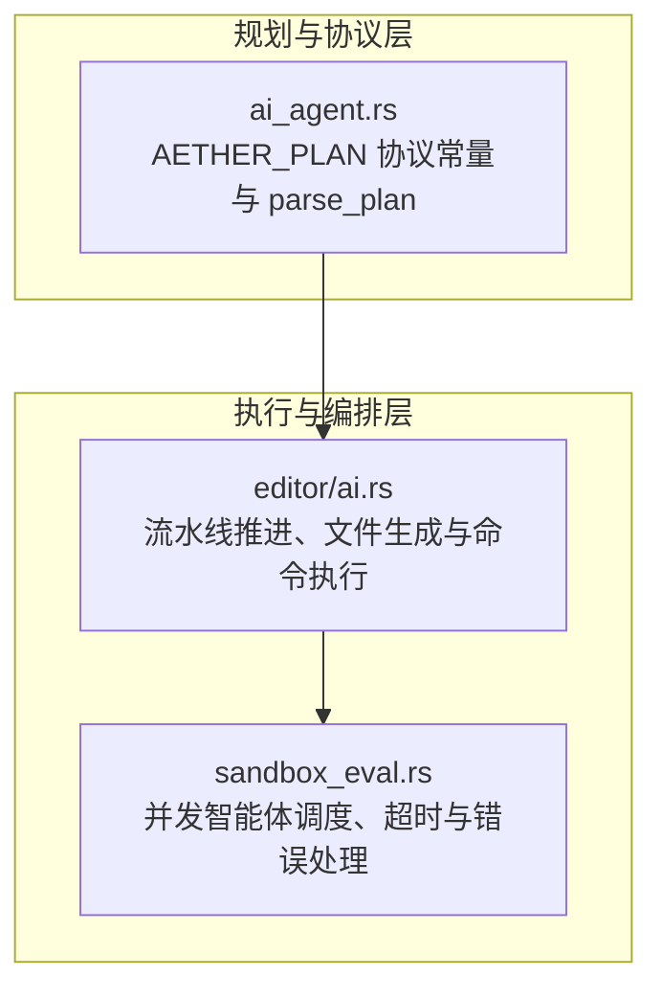
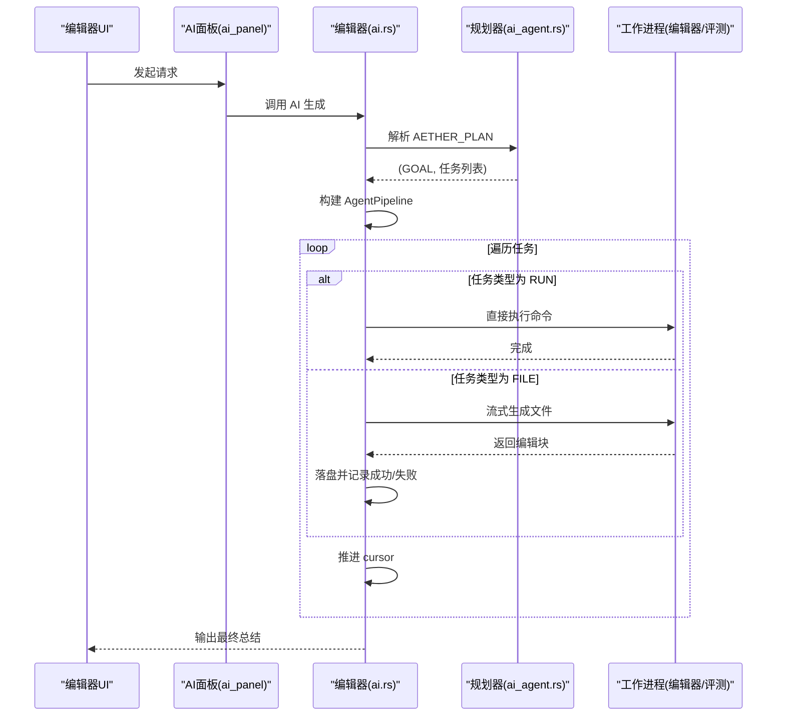
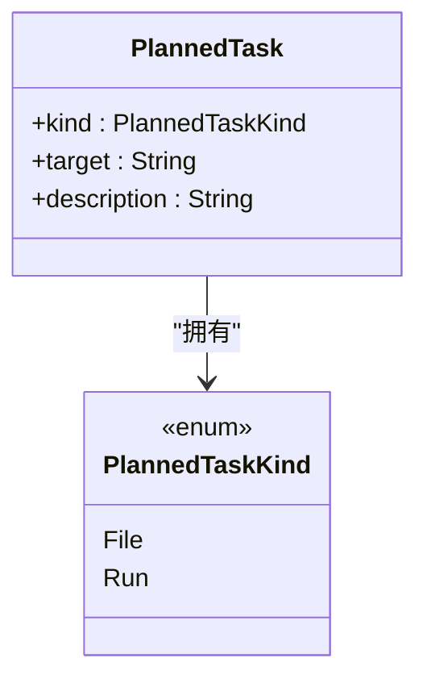
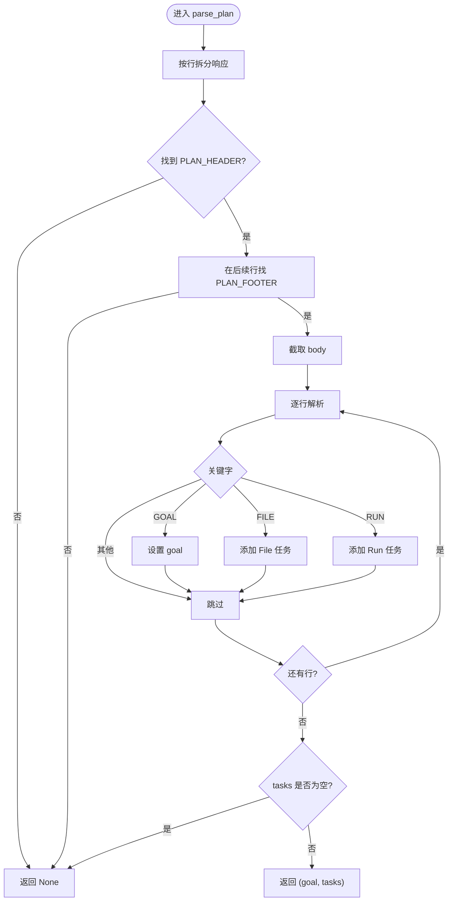
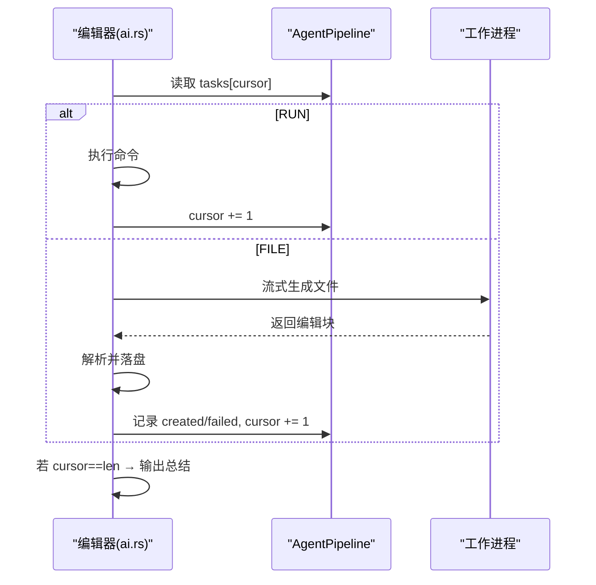
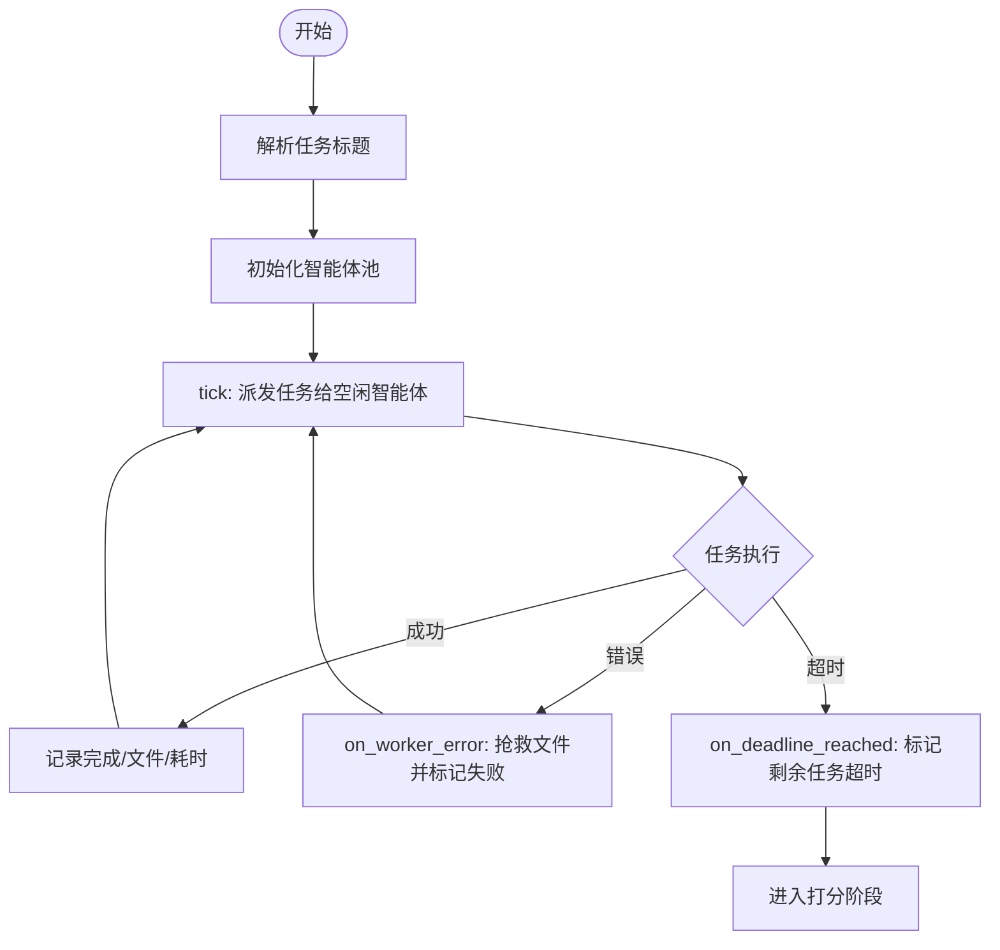
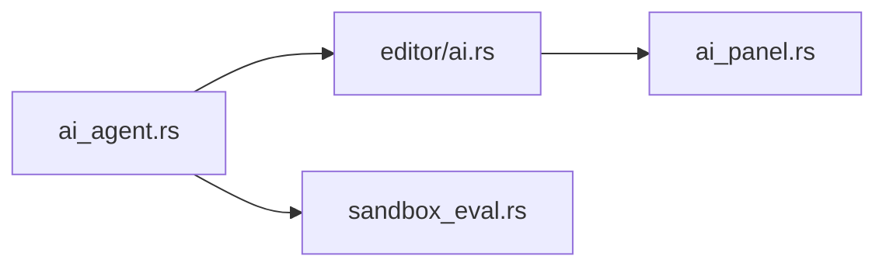

# 任务编排

<cite>
**本文引用的文件**
- [ai_agent.rs](file://crates/aether-ai-panel/src/ai_agent.rs)
- [ai.rs](file://crates/aether-win32/src/editor/ai.rs)
- [sandbox_eval.rs](file://crates/aether-win32/src/sandbox_eval.rs)
- [ai_panel.rs](file://crates/aether-ai-panel/src/ai_panel.rs)
</cite>

## 目录
1. [简介](#简介)
2. [项目结构](#项目结构)
3. [核心组件](#核心组件)
4. [架构总览](#架构总览)
5. [详细组件分析](#详细组件分析)
6. [依赖关系分析](#依赖关系分析)
7. [性能考量](#性能考量)
8. [故障排查指南](#故障排查指南)
9. [结论](#结论)
10. [附录：最佳实践与调试技巧](#附录最佳实践与调试技巧)

## 简介
本文件面向“任务编排子系统”，聚焦 Agent 模式下的任务分解与规划机制，重点解释 AETHER_PLAN 标记协议、PlannedTask 结构设计、parse_plan 解析逻辑、以及任务执行流程（串行推进、并行处理、结果聚合）。同时提供任务编排的最佳实践（依赖管理、错误处理、性能优化）和实际使用示例与调试技巧。

## 项目结构
该子系统由两部分组成：
- 规划与协议层（aether-ai-panel）：定义并解析 AETHER_PLAN 清单块，产出 PlannedTask 列表。
- 执行与编排层（aether-win32）：消费计划，按类型串行或并发执行任务，记录状态并汇总结果。

图表来源
- [ai_agent.rs:29-32](file://crates/aether-ai-panel/src/ai_agent.rs#L29-L32)
- [ai.rs:1168-1177](file://crates/aether-win32/src/editor/ai.rs#L1168-L1177)
- [sandbox_eval.rs:783-810](file://crates/aether-win32/src/sandbox_eval.rs#L783-L810)

章节来源
- [ai_agent.rs:29-32](file://crates/aether-ai-panel/src/ai_agent.rs#L29-L32)
- [ai.rs:1168-1177](file://crates/aether-win32/src/editor/ai.rs#L1168-L1177)
- [sandbox_eval.rs:783-810](file://crates/aether-win32/src/sandbox_eval.rs#L783-L810)

## 核心组件
- AETHER_PLAN 标记协议：以独占行锚定的哨兵标记包裹计划块，避免与代码内容冲突。
- PlannedTask 结构：区分“文件生成”与“命令执行”两类任务，包含目标与描述。
- parse_plan：从响应中定位计划块，提取 GOAL 与任务清单，限制最大任务数。
- 流水线执行器：顺序推进 RUN 与 FILE 任务；FILE 任务通过 worker 流式生成并落盘。
- 并发调度器（评测场景）：将任务分发给多个智能体并行执行，支持超时与错误回收。

章节来源
- [ai_agent.rs:543-617](file://crates/aether-ai-panel/src/ai_agent.rs#L543-L617)
- [ai.rs:1180-1257](file://crates/aether-win32/src/editor/ai.rs#L1180-L1257)
- [sandbox_eval.rs:708-810](file://crates/aether-win32/src/sandbox_eval.rs#L708-L810)

## 架构总览
下图展示了从规划到执行的端到端流程，包括串行推进与并发调度的分支。

图表来源
- [ai_agent.rs:564-617](file://crates/aether-ai-panel/src/ai_agent.rs#L564-L617)
- [ai.rs:1168-1257](file://crates/aether-win32/src/editor/ai.rs#L1168-L1257)
- [sandbox_eval.rs:783-810](file://crates/aether-win32/src/sandbox_eval.rs#L783-L810)

## 详细组件分析

### AETHER_PLAN 标记协议
- 设计原则：
  - 每个标记独占一行，精确匹配，避免误触发。
  - 使用带 AETHER_ 前缀的哨兵，与 Git 冲突标记区分。
  - 不使用长度前缀，降低模型计数错误风险。
- 关键常量：
  - 计划块起始与结束：PLAN_HEADER、PLAN_FOOTER。
  - 其他工具标记：文件块、命令块、只读探查等。

章节来源
- [ai_agent.rs:4-13](file://crates/aether-ai-panel/src/ai_agent.rs#L4-L13)
- [ai_agent.rs:29-32](file://crates/aether-ai-panel/src/ai_agent.rs#L29-L32)

### PlannedTask 结构与任务类型识别
- PlannedTaskKind：File（文件生成）、Run（命令执行）。
- PlannedTask：
  - kind：任务类型。
  - target：FILE 为相对路径；RUN 为要执行的命令。
  - description：任务职责描述（FILE 常用）。
- 解析规则：
  - 仅识别 PLAN_HEADER 与 PLAN_FOOTER 之间的内容。
  - 支持 GOAL、FILE、RUN 关键字；忽略空行与其他未知关键字。
  - 限制最大任务数（默认 20），超出部分丢弃。

图表来源
- [ai_agent.rs:543-558](file://crates/aether-ai-panel/src/ai_agent.rs#L543-L558)

章节来源
- [ai_agent.rs:543-617](file://crates/aether-ai-panel/src/ai_agent.rs#L543-L617)

### parse_plan 实现逻辑
- 步骤：
  1) 将响应按行拆分。
  2) 查找 PLAN_HEADER 与 PLAN_FOOTER，截取 body。
  3) 逐行解析：
     - GOAL：提取整体目标字符串。
     - FILE：解析路径与可选描述，构造 File 任务。
     - RUN：解析命令，构造 Run 任务。
  4) 若 tasks 为空则返回 None（回退普通流程）。
  5) 否则返回 (goal, tasks)。

图表来源
- [ai_agent.rs:564-617](file://crates/aether-ai-panel/src/ai_agent.rs#L564-L617)

章节来源
- [ai_agent.rs:564-617](file://crates/aether-ai-panel/src/ai_agent.rs#L564-L617)

### 任务执行流程（串行推进与结果聚合）
- 流水线状态：
  - agent_pipeline：包含 goal、tasks、cursor、created_files、failed_files。
- 推进逻辑：
  - 读取当前任务（cursor 指向）。
  - 若为 RUN：直接执行命令，cursor+1，继续循环。
  - 若为 FILE：
    - 读取目标文件现有内容（若存在）。
    - 收集已创建文件的内容（作为上下文传递给后续 worker）。
    - 构建系统提示与用户提示，启动流式生成。
    - 完成后回调：解析编辑块、落盘、记录成败、cursor+1，继续推进。
- 收尾：
  - 当 cursor 到达末尾时，汇总成功/失败数量，输出总结消息。

图表来源
- [ai.rs:1180-1257](file://crates/aether-win32/src/editor/ai.rs#L1180-L1257)
- [ai.rs:1260-1317](file://crates/aether-win32/src/editor/ai.rs#L1260-L1317)
- [ai.rs:1320-1365](file://crates/aether-win32/src/editor/ai.rs#L1320-L1365)

章节来源
- [ai.rs:1180-1257](file://crates/aether-win32/src/editor/ai.rs#L1180-L1257)
- [ai.rs:1260-1317](file://crates/aether-win32/src/editor/ai.rs#L1260-L1317)
- [ai.rs:1320-1365](file://crates/aether-win32/src/editor/ai.rs#L1320-L1365)

### 并发处理与结果聚合（评测场景）
- 阶段：
  - Planning：解析任务标题，创建任务队列。
  - Running：根据空闲智能体派发任务，支持搜索续写。
  - Scoring：全部结束后进入打分阶段。
- 并发调度：
  - dispatch_tasks：每次 tick 扫描空闲 worker，分配 Pending 任务。
  - assign_task：将任务指派给 worker 并发起请求。
- 错误与超时：
  - on_worker_error：记录错误、抢救已接收文件块、标记任务失败。
  - on_deadline_reached：停止生成，未完成任务标记超时，进入打分。
- 结果聚合：
  - 统计每个任务的搜索、文件产出、耗时等信息，用于打分与日志。

图表来源
- [sandbox_eval.rs:708-810](file://crates/aether-win32/src/sandbox_eval.rs#L708-L810)
- [sandbox_eval.rs:731-781](file://crates/aether-win32/src/sandbox_eval.rs#L731-L781)

章节来源
- [sandbox_eval.rs:708-810](file://crates/aether-win32/src/sandbox_eval.rs#L708-L810)
- [sandbox_eval.rs:731-781](file://crates/aether-win32/src/sandbox_eval.rs#L731-L781)

## 依赖关系分析
- ai_agent.rs 提供协议与解析能力，被 ai.rs 与 sandbox_eval.rs 复用。
- ai.rs 负责单线程流水线推进，依赖 ai_panel 进行流式交互与状态管理。
- sandbox_eval.rs 负责多线程并发调度，独立于编辑器流水线但共享任务规划思想。

图表来源
- [ai_agent.rs:564-617](file://crates/aether-ai-panel/src/ai_agent.rs#L564-L617)
- [ai.rs:1168-1257](file://crates/aether-win32/src/editor/ai.rs#L1168-L1257)
- [sandbox_eval.rs:783-810](file://crates/aether-win32/src/sandbox_eval.rs#L783-L810)
- [ai_panel.rs:1-200](file://crates/aether-ai-panel/src/ai_panel.rs#L1-L200)

章节来源
- [ai_agent.rs:564-617](file://crates/aether-ai-panel/src/ai_agent.rs#L564-L617)
- [ai.rs:1168-1257](file://crates/aether-win32/src/editor/ai.rs#L1168-L1257)
- [sandbox_eval.rs:783-810](file://crates/aether-win32/src/sandbox_eval.rs#L783-L810)
- [ai_panel.rs:1-200](file://crates/aether-ai-panel/src/ai_panel.rs#L1-L200)

## 性能考量
- 任务上限控制：parse_plan 限制最多解析 20 个任务，防止过长计划导致资源耗尽。
- 并发度控制：评测场景限制最大智能体数量（如 8），避免过度并发影响稳定性。
- 流式生成优化：
  - 关闭深度思考以降低 token 占用，确保长文件生成不被截断。
  - 固定低温采样（如 0.0）提升代码生成的稳定性。
- 上下文裁剪：仅传递目标文件现有内容与已创建文件内容，控制输入窗口大小。
- 超时与止损：定时模式下达到阈值后终止生成，标记未完成并进入打分。

章节来源
- [ai_agent.rs:564-617](file://crates/aether-ai-panel/src/ai_agent.rs#L564-L617)
- [sandbox_eval.rs:25-34](file://crates/aether-win32/src/sandbox_eval.rs#L25-L34)
- [ai.rs:1242-1252](file://crates/aether-win32/src/editor/ai.rs#L1242-L1252)
- [sandbox_eval.rs:731-752](file://crates/aether-win32/src/sandbox_eval.rs#L731-L752)

## 故障排查指南
- 无计划块或无效任务：
  - 现象：parse_plan 返回 None，回退到普通流程。
  - 排查：确认响应中包含完整的 AETHER_PLAN 块且至少有一个有效任务。
- 任务执行失败：
  - 编辑器流水线：检查文件写入是否成功，查看 failed_files 列表与错误消息。
  - 评测场景：查看 on_worker_error 日志，确认是否抢救到部分文件。
- 超时问题：
  - 现象：任务被标记为 TimedOut。
  - 排查：调整定时模式时长或减少并发度，检查任务复杂度。
- 流式截断：
  - 现象：文件生成不完整。
  - 排查：确认关闭了深度思考，温度设置为较低值，适当增加 max_tokens。

章节来源
- [ai_agent.rs:564-617](file://crates/aether-ai-panel/src/ai_agent.rs#L564-L617)
- [ai.rs:1260-1317](file://crates/aether-win32/src/editor/ai.rs#L1260-L1317)
- [sandbox_eval.rs:754-781](file://crates/aether-win32/src/sandbox_eval.rs#L754-L781)
- [sandbox_eval.rs:731-752](file://crates/aether-win32/src/sandbox_eval.rs#L731-L752)

## 结论
任务编排子系统通过 AETHER_PLAN 协议实现了可解析的任务规划，结合 PlannedTask 的结构化表示，使编辑器能够以串行方式稳健推进文件生成与命令执行；在评测场景中，通过并发调度与完善的错误/超时处理，提升了吞吐与鲁棒性。遵循本文的最佳实践与调试技巧，可有效提升任务编排的效率与可靠性。

## 附录：最佳实践与调试技巧
- 任务依赖管理：
  - 将相互依赖的文件生成任务按顺序排列，确保前置文件先创建。
  - 利用已创建文件内容作为后续 worker 的上下文，提高一致性。
- 错误处理策略：
  - 对 RUN 任务进行权限与环境校验，避免执行失败。
  - 对 FILE 任务捕获写入异常，记录失败原因并继续后续任务。
- 性能优化：
  - 合理设置并发度与任务上限，避免资源争用。
  - 使用流式生成与低温度参数，减少截断与乱码。
- 实际使用示例：
  - 在响应中使用 AETHER_PLAN 块，包含 GOAL、FILE、RUN 指令。
  - 观察编辑器输出的可读计划与最终总结，验证任务执行情况。
- 调试技巧：
  - 启用详细日志，关注任务派发、执行与完成事件。
  - 逐步缩小任务规模，定位复杂任务的问题点。
  - 使用测试用例验证 parse_plan 的行为边界（空块、超限任务等）。

章节来源
- [ai_agent.rs:564-617](file://crates/aether-ai-panel/src/ai_agent.rs#L564-L617)
- [ai.rs:1180-1257](file://crates/aether-win32/src/editor/ai.rs#L1180-L1257)
- [sandbox_eval.rs:708-810](file://crates/aether-win32/src/sandbox_eval.rs#L708-L810)