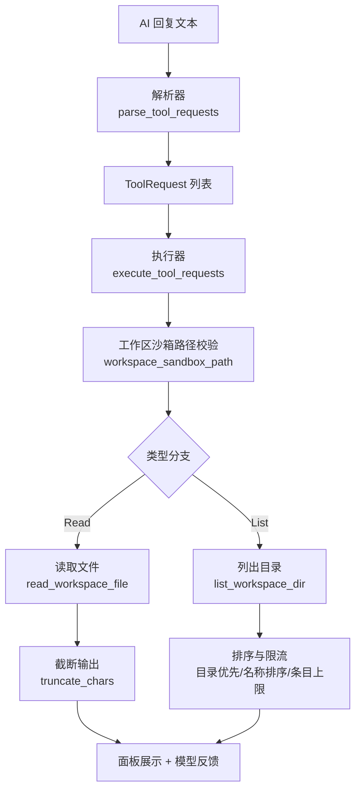
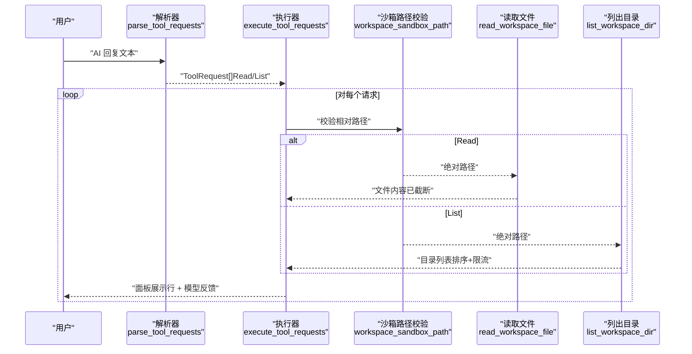
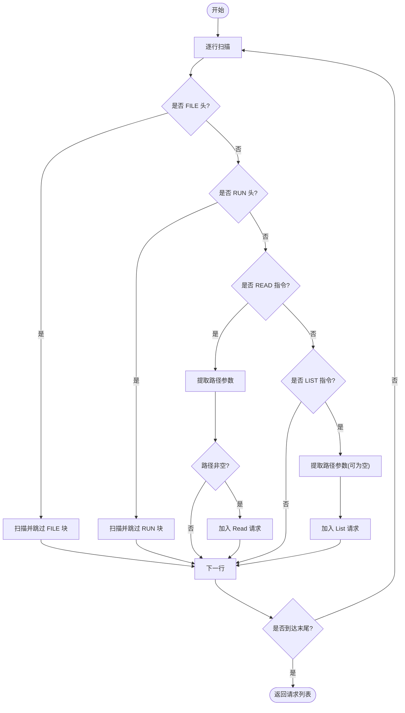
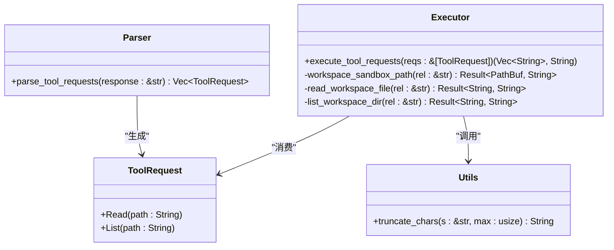

# 只读工具

<cite>
**本文引用的文件**
- [ai_agent.rs](file://crates/aether-ai-panel/src/ai_agent.rs)
- [ai.rs](file://crates/aether-win32/src/editor/ai.rs)
</cite>

## 目录
1. [简介](#简介)
2. [项目结构](#项目结构)
3. [核心组件](#核心组件)
4. [架构总览](#架构总览)
5. [详细组件分析](#详细组件分析)
6. [依赖关系分析](#依赖关系分析)
7. [性能考量](#性能考量)
8. [故障排查指南](#故障排查指南)
9. [结论](#结论)
10. [附录：使用示例与最佳实践](#附录使用示例与最佳实践)

## 简介
本文件面向“只读工具”的完整文档，聚焦于从 AI 回复中解析并执行 READ 与 LIST 两类只读探查请求。内容涵盖：
- ToolRequest 枚举的实现与语义（Read、List）
- READ 工具的参数格式与工作区相对路径处理（含空路径含义与验证规则）
- LIST 工具的目录遍历行为（根目录表示与是否递归）
- parse_tool_requests 的工作流程（FILE/RUN 块跳过逻辑与指令识别算法）
- 在 AI 回复中正确使用只读工具标记的示例
- 错误处理与安全考虑（路径遍历防护、权限控制、大小限制等）

## 项目结构
只读工具涉及两个主要模块：
- aether-ai-panel：负责从 AI 回复文本中解析出只读工具请求（ToolRequest），定义协议常量与解析函数。
- aether-win32：负责在工作区沙箱内执行这些请求（读取文件或列出目录），并进行安全校验与结果格式化。

图表来源
- [ai_agent.rs:500-541](file://crates/aether-ai-panel/src/ai_agent.rs#L500-L541)
- [ai.rs:1021-1097](file://crates/aether-win32/src/editor/ai.rs#L1021-L1097)
- [ai.rs:1100-1136](file://crates/aether-win32/src/editor/ai.rs#L1100-L1136)
- [ai.rs:1419-1427](file://crates/aether-win32/src/editor/ai.rs#L1419-L1427)

章节来源
- [ai_agent.rs:1-60](file://crates/aether-ai-panel/src/ai_agent.rs#L1-L60)
- [ai.rs:1021-1136](file://crates/aether-win32/src/editor/ai.rs#L1021-L1136)

## 核心组件
- ToolRequest 枚举：表示两种只读操作
  - Read(String)：读取工作区内文件内容（参数为工作区相对路径）
  - List(String)：列出工作区内目录条目（参数为空串或"."时表示工作区根）
- 协议常量：READ_PREFIX、LIST_PREFIX、RUN_HEADER、FILE_* 等用于行锚定解析
- 解析函数：parse_tool_requests 负责扫描 AI 回复，跳过 FILE/RUN 块，提取 READ/LIST 指令
- 执行函数：execute_tool_requests 将 ToolRequest 转换为实际的文件系统访问，并生成面板展示与回喂模型的反馈文本
- 安全与限制：workspace_sandbox_path 进行路径沙箱校验；read_workspace_file 限制文件大小与返回长度；list_workspace_dir 限制条目数量并排序

章节来源
- [ai_agent.rs:22-59](file://crates/aether-ai-panel/src/ai_agent.rs#L22-L59)
- [ai_agent.rs:500-541](file://crates/aether-ai-panel/src/ai_agent.rs#L500-L541)
- [ai.rs:1021-1097](file://crates/aether-win32/src/editor/ai.rs#L1021-L1097)
- [ai.rs:1100-1136](file://crates/aether-win32/src/editor/ai.rs#L1100-L1136)

## 架构总览
下图展示了从 AI 回复到最终结果的端到端流程，包括解析、执行、安全校验与输出限制。

图表来源
- [ai_agent.rs:500-541](file://crates/aether-ai-panel/src/ai_agent.rs#L500-L541)
- [ai.rs:1021-1097](file://crates/aether-win32/src/editor/ai.rs#L1021-L1097)
- [ai.rs:1100-1136](file://crates/aether-win32/src/editor/ai.rs#L1100-L1136)

## 详细组件分析

### ToolRequest 枚举与协议常量
- 枚举定义：
  - Read(String)：读取文件，参数为工作区相对路径
  - List(String)：列出目录，参数为空串或"."时代表工作区根
- 协议常量：
  - READ_PREFIX：单行指令前缀，用于识别 READ 命令
  - LIST_PREFIX：单行指令前缀，用于识别 LIST 命令
  - RUN_HEADER：命令块起始行，用于跳过 RUN 块体
  - FILE_*：文件块头/分隔/尾，用于跳过 FILE 块体

章节来源
- [ai_agent.rs:22-59](file://crates/aether-ai-panel/src/ai_agent.rs#L22-L59)

### parse_tool_requests 工作流程
该函数逐行扫描 AI 回复，遵循以下规则：
- 跳过完整的 FILE 块体：若当前行匹配文件头，则扫描至结束行，避免块内内容被误解析为工具请求
- 跳过完整的 RUN 块体：若当前行等于 RUN_HEADER，则扫描至结束行，忽略块内命令
- 识别 READ 指令：若行以 READ_PREFIX 开头且其后紧跟空白或行尾，则提取参数；仅当参数非空时才创建 Read 请求
- 识别 LIST 指令：若行以 LIST_PREFIX 开头且其后紧跟空白或行尾，则提取参数；允许空串或"."表示工作区根
- 其他行：忽略并继续扫描

图表来源
- [ai_agent.rs:500-541](file://crates/aether-ai-panel/src/ai_agent.rs#L500-L541)

章节来源
- [ai_agent.rs:500-541](file://crates/aether-ai-panel/src/ai_agent.rs#L500-L541)

### READ 工具：参数格式与路径处理
- 参数格式：单行指令，前缀后紧跟空白或行尾，随后为工作区相对路径
- 空路径：READ 要求路径非空，空路径不会生成请求
- 路径验证：
  - 拒绝绝对路径，防止逃逸工作区
  - 拼接工作区根后进行规范化，确保目标位于工作区内
  - 若目标不存在或无法访问，返回错误
- 读取限制：
  - 仅允许文件，若目标是目录则报错
  - 文件大小限制：超过 1MB 直接拒绝
  - 返回内容限制：按字符数截断，避免占满上下文预算

章节来源
- [ai.rs:1021-1063](file://crates/aether-win32/src/editor/ai.rs#L1021-L1063)
- [ai.rs:1419-1427](file://crates/aether-win32/src/editor/ai.rs#L1419-L1427)

### LIST 工具：目录遍历功能
- 根目录表示：空串或"."均表示工作区根
- 遍历范围：仅列出指定目录的一层子项，不递归进入子目录
- 排序规则：目录优先，其次按名称排序
- 条目限制：最多显示 300 项；超出时附加提示说明省略数量
- 空目录：返回“（空目录）”提示

章节来源
- [ai.rs:1065-1097](file://crates/aether-win32/src/editor/ai.rs#L1065-L1097)

### execute_tool_requests：执行与反馈
- 对每个 ToolRequest 执行相应操作：
  - Read：读取文件内容，统计行数，生成面板展示行与模型反馈
  - List：列出目录，生成面板展示行与模型反馈
- 错误处理：捕获文件系统错误，生成友好的失败消息
- 输出格式：
  - 面板展示行：简洁的用户可见信息
  - 模型反馈：结构化文本，便于模型理解与后续处理

章节来源
- [ai.rs:1100-1136](file://crates/aether-win32/src/editor/ai.rs#L1100-L1136)

## 依赖关系分析
- 解析器依赖协议常量与辅助函数（parse_directive、parse_file_header、scan_file_block、scan_run_block）
- 执行器依赖工作区根路径、文件系统 API、字符串截断函数
- 安全边界由 workspace_sandbox_path 统一提供，确保所有路径访问均在沙箱内

图表来源
- [ai_agent.rs:500-541](file://crates/aether-ai-panel/src/ai_agent.rs#L500-L541)
- [ai.rs:1021-1136](file://crates/aether-win32/src/editor/ai.rs#L1021-L1136)
- [ai.rs:1419-1427](file://crates/aether-win32/src/editor/ai.rs#L1419-L1427)

章节来源
- [ai_agent.rs:500-541](file://crates/aether-ai-panel/src/ai_agent.rs#L500-L541)
- [ai.rs:1021-1136](file://crates/aether-win32/src/editor/ai.rs#L1021-L1136)

## 性能考量
- 解析阶段：逐行扫描，时间复杂度 O(N)，N 为回复行数；通过块跳过减少误解析开销
- 读取阶段：
  - 文件大小限制 1MB，避免大文件导致内存压力
  - 返回内容按字符数截断，控制上下文占用
- 列出阶段：
  - 单层遍历，不递归，降低 IO 成本
  - 条目上限 300，避免超大目录导致 UI 卡顿
- 排序与过滤：目录优先、名称排序，提升可读性

[本节为通用性能讨论，无需特定文件引用]

## 故障排查指南
常见错误与处理：
- 未打开工作区文件夹：无法获取根路径，返回错误
- 路径必须相对于工作区根目录：拒绝绝对路径
- 路径不存在或无法访问：规范化失败或权限不足
- 禁止访问工作区之外的路径：规范路径不在工作区根下
- 这是一个目录，请改用列目录工具：READ 目标为目录
- 这不是目录，请改用读取文件工具：LIST 目标为文件
- 文件过大：超过 1MB 限制
- 目录为空：返回“（空目录）”提示

建议排查步骤：
- 检查工作区是否正确打开
- 确认路径是否为相对路径且存在
- 检查文件/目录权限
- 查看面板展示行中的错误信息，定位具体失败原因

章节来源
- [ai.rs:1021-1097](file://crates/aether-win32/src/editor/ai.rs#L1021-L1097)

## 结论
只读工具通过严格的协议解析与安全沙箱机制，实现了从 AI 回复中提取并执行 READ/LIST 请求的能力。其设计重点在于：
- 行锚定与独特哨兵避免误解析
- 路径沙箱校验防止越权访问
- 大小与数量限制保障性能与稳定性
- 清晰的错误信息与用户反馈

该实现为 AI 助手提供了安全、可控的只读探查能力，适用于代码阅读、项目探索与调试场景。

[本节为总结性内容，无需特定文件引用]

## 附录：使用示例与最佳实践

### 在 AI 回复中使用只读工具标记
- READ 示例：
  - 语法：<<<<<<< AETHER_READ <path>
  - 说明：path 为工作区相对路径，不能为空
  - 示例：<<<<<<< AETHER_READ src/main.rs
- LIST 示例：
  - 语法：<<<<<<< AETHER_LIST <path>
  - 说明：path 可为空串或"."表示工作区根
  - 示例：<<<<<<< AETHER_LIST
  - 示例：<<<<<<< AETHER_LIST .
  - 示例：<<<<<<< AETHER_LIST src

注意：
- 标记必须独占整行，前后不应有额外空格影响解析
- FILE 与 RUN 块体内的内容不会被解析为工具请求
- 路径必须相对于工作区根，且目标必须存在

章节来源
- [ai_agent.rs:22-59](file://crates/aether-ai-panel/src/ai_agent.rs#L22-L59)
- [ai_agent.rs:500-541](file://crates/aether-ai-panel/src/ai_agent.rs#L500-L541)
- [ai.rs:1021-1097](file://crates/aether-win32/src/editor/ai.rs#L1021-L1097)

### 安全与权限控制最佳实践
- 始终使用相对路径，避免绝对路径
- 不要尝试通过 ".." 等方式逃逸工作区
- 尊重文件大小与目录条目限制，必要时分段查看或使用命令
- 如遇权限错误，检查文件系统权限与工作区配置

[本节为通用安全建议，无需特定文件引用]