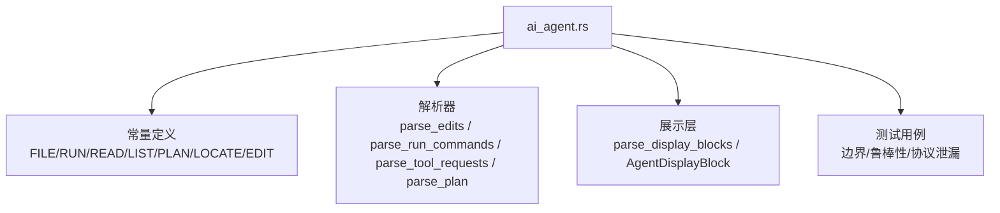
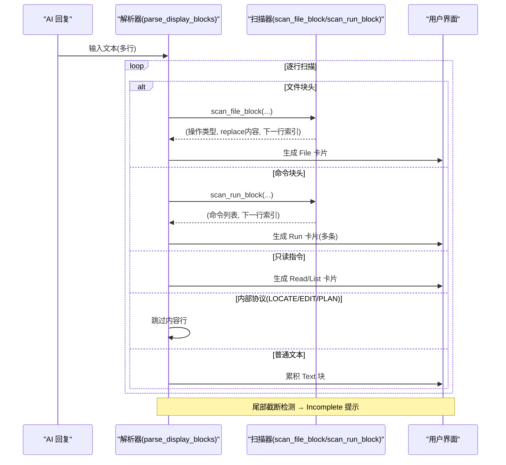
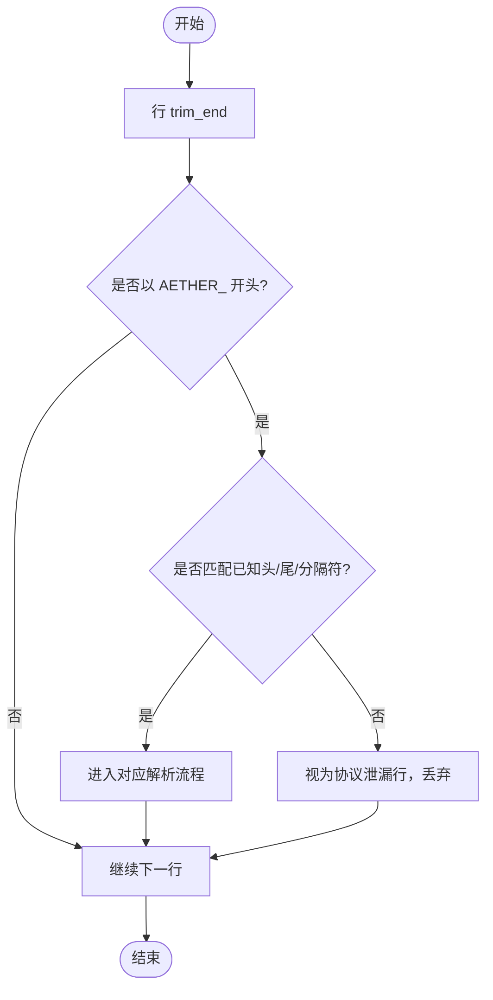
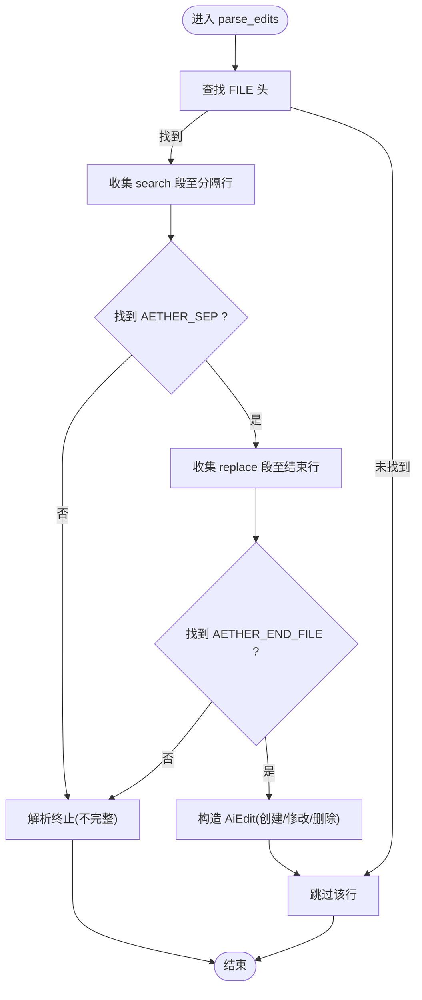
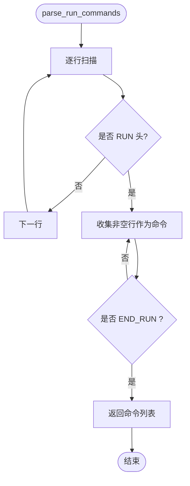
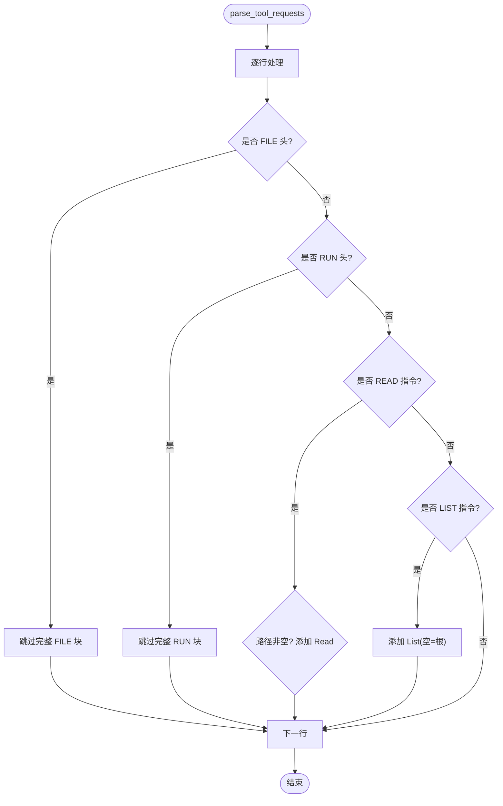
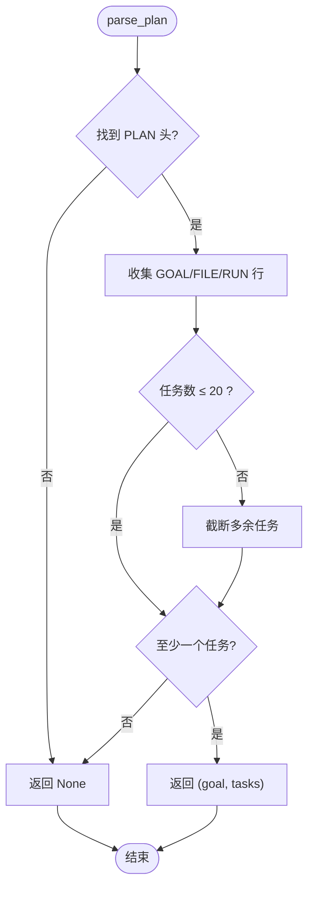
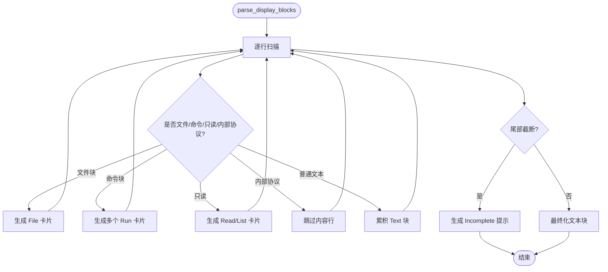
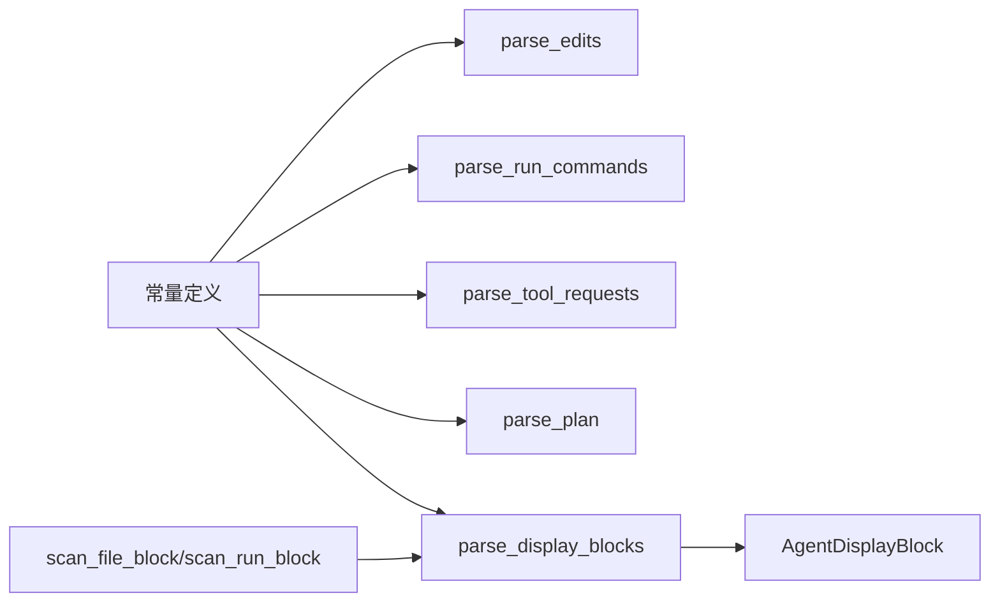

# 工具标记协议

<cite>
**本文引用的文件**
- [ai_agent.rs](file://crates/aether-ai-panel/src/ai_agent.rs)
</cite>

## 目录
1. [简介](#简介)
2. [项目结构](#项目结构)
3. [核心组件](#核心组件)
4. [架构总览](#架构总览)
5. [详细组件分析](#详细组件分析)
6. [依赖关系分析](#依赖关系分析)
7. [性能考虑](#性能考虑)
8. [故障排查指南](#故障排查指南)
9. [结论](#结论)
10. [附录：扩展指南与兼容性](#附录：扩展指南与兼容性)

## 简介
本文件为“工具标记协议”的权威说明，聚焦行锚定解析与独特哨兵机制的设计原理与实践。该协议通过“独占整行的 AETHER_ 前缀哨兵”来区分 AI 回复中的结构化指令与正文内容，避免与 Git 冲突标记等常见文本混淆。协议支持文件编辑块、终端命令块、只读探查（读取/列目录）、规划任务清单以及精准定位/编辑等能力，并提供流式中断时的抢救策略与协议泄漏检测。

## 项目结构
协议实现集中在 aether-ai-panel 的 ai_agent.rs 中，包含常量定义、解析函数、显示块构建、测试用例等。整体组织以“功能域”划分：
- 常量区：定义所有标记头/尾/分隔符的前缀与结束符
- 解析器：按行扫描并识别各类块或单行指令
- 展示层：将原始标记转换为面板友好的操作卡片
- 测试：覆盖正常、边界与异常场景



**图表来源**
- [ai_agent.rs:15-39](file://crates/aether-ai-panel/src/ai_agent.rs#L15-L39)
- [ai_agent.rs:174-617](file://crates/aether-ai-panel/src/ai_agent.rs#L174-L617)
- [ai_agent.rs:627-858](file://crates/aether-ai-panel/src/ai_agent.rs#L627-L858)
- [ai_agent.rs:860-1282](file://crates/aether-ai-panel/src/ai_agent.rs#L860-L1282)

**章节来源**
- [ai_agent.rs:15-39](file://crates/aether-ai-panel/src/ai_agent.rs#L15-L39)
- [ai_agent.rs:174-617](file://crates/aether-ai-panel/src/ai_agent.rs#L174-L617)
- [ai_agent.rs:627-858](file://crates/aether-ai-panel/src/ai_agent.rs#L627-L858)
- [ai_agent.rs:860-1282](file://crates/aether-ai-panel/src/ai_agent.rs#L860-L1282)

## 核心组件
- 行锚定与哨兵：所有标记必须独占整行（对行进行 trim_end 后精确匹配或前缀匹配），并通过 AETHER_ 前缀与 Git 冲突标记（<<<<<<< / ======= / >>>>>>>）彻底区分，防止误触发。
- 标记常量：
  - 文件块：FILE_HEADER_PREFIX、FILE_SEP、FILE_FOOTER
  - 命令块：RUN_HEADER、RUN_FOOTER
  - 只读探查：READ_PREFIX、LIST_PREFIX
  - 规划块：PLAN_HEADER、PLAN_FOOTER
  - 精准定位/编辑：LOCATE_HEADER、EDIT_HEADER、EDIT_FOOTER
- 解析器：
  - parse_edits：解析文件编辑块（创建/修改/删除）
  - parse_run_commands：解析终端命令块
  - parse_tool_requests：提取 READ/LIST 请求，跳过 FILE/RUN 块体
  - parse_plan：解析规划任务清单（GOAL/FILE/RUN）
  - parse_precise_location / parse_edit_operation / parse_precise_edits：精准定位与编辑
- 展示层：
  - parse_display_blocks：将响应转为 AgentDisplayBlock 序列，隐藏内部协议标记，生成用户可见的操作卡片
  - 辅助：push_text_block、scan_file_block、scan_run_block、is_protocol_marker_line
- 抢救与健壮性：
  - parse_trailing_create_block：对流式中断未闭合的新建文件块进行抢救
  - has_agent_markers：快速判断是否包含工具标记

**章节来源**
- [ai_agent.rs:15-39](file://crates/aether-ai-panel/src/ai_agent.rs#L15-L39)
- [ai_agent.rs:41-69](file://crates/aether-ai-panel/src/ai_agent.rs#L41-L69)
- [ai_agent.rs:174-236](file://crates/aether-ai-panel/src/ai_agent.rs#L174-L236)
- [ai_agent.rs:238-418](file://crates/aether-ai-panel/src/ai_agent.rs#L238-L418)
- [ai_agent.rs:420-464](file://crates/aether-ai-panel/src/ai_agent.rs#L420-L464)
- [ai_agent.rs:466-541](file://crates/aether-ai-panel/src/ai_agent.rs#L466-L541)
- [ai_agent.rs:560-617](file://crates/aether-ai-panel/src/ai_agent.rs#L560-L617)
- [ai_agent.rs:627-858](file://crates/aether-ai-panel/src/ai_agent.rs#L627-L858)

## 架构总览
协议采用“行级扫描 + 状态机”的方式处理 AI 回复：
- 逐行检查是否为标记行（trim_end 后匹配）
- 遇到块头则进入对应状态机收集内容，直到匹配到对应的结束符
- 单行指令（READ/LIST）直接提取参数
- 对于内部协议（LOCATE/EDIT/PLAN）在展示层过滤，不向用户暴露
- 若检测到协议泄漏（非合法块的 AETHER_ 标记行），在展示层丢弃，避免泄露内部细节



**图表来源**
- [ai_agent.rs:627-858](file://crates/aether-ai-panel/src/ai_agent.rs#L627-L858)
- [ai_agent.rs:667-722](file://crates/aether-ai-panel/src/ai_agent.rs#L667-L722)

## 详细组件分析

### 行锚定与哨兵机制
- 行锚定：每个标记必须独占整行，解析时对行执行 trim_end 后再匹配，避免行内出现相同字样被误解析。
- 哨兵：所有标记使用 AETHER_ 前缀，与 Git 冲突标记（<<<<<<< / ======= / >>>>>>>）形成强区分，确保即使文件内容包含这些符号也不会错误截断解析。
- 协议泄漏检测：is_protocol_marker_line 用于识别形如 “<<<<<<< AETHER_...”、“>>>>>>> AETHER_...”、“======= AETHER_...” 的行；若未被识别为合法块，则在展示层丢弃，避免泄露内部协议。



**图表来源**
- [ai_agent.rs:724-730](file://crates/aether-ai-panel/src/ai_agent.rs#L724-L730)

**章节来源**
- [ai_agent.rs:724-730](file://crates/aether-ai-panel/src/ai_agent.rs#L724-L730)

### 文件编辑块解析（FILE）
- 格式：
  - 头：<<<<<<< AETHER_FILE <path>
  - 分隔：======= AETHER_SEP
  - 尾：>>>>>>> AETHER_END_FILE
- 语义：
  - search 段为空且 replace 段非空 → 新建文件
  - search 段非空且 replace 段为空 → 删除文件
  - 两者均非空 → 修改文件
- 鲁棒性：
  - 文件内容可能包含 Git 冲突标记（裸 ======= / >>>>>>>），由于严格匹配 AETHER_SEP/AETHER_END_FILE，不会误截断
  - 不完整块：若缺少分隔或结束行，解析提前终止，剩余内容作为普通文本返回



**图表来源**
- [ai_agent.rs:174-236](file://crates/aether-ai-panel/src/ai_agent.rs#L174-L236)

**章节来源**
- [ai_agent.rs:174-236](file://crates/aether-ai-panel/src/ai_agent.rs#L174-L236)

### 终端命令块解析（RUN）
- 格式：
  - 头：<<<<<<< AETHER_RUN
  - 尾：>>>>>>> AETHER_END_RUN
- 规则：
  - 块内每行非空即视为一条命令
  - 支持多条命令顺序执行
- 行为：
  - 若缺少结束行，解析终止，不产生命令



**图表来源**
- [ai_agent.rs:466-498](file://crates/aether-ai-panel/src/ai_agent.rs#L466-L498)

**章节来源**
- [ai_agent.rs:466-498](file://crates/aether-ai-panel/src/ai_agent.rs#L466-L498)

### 只读探查请求（READ/LIST）
- 格式：
  - READ：<<<<<<< AETHER_READ <path>
  - LIST：<<<<<<< AETHER_LIST <path>（可为空或 "." 表示工作区根）
- 规则：
  - 跳过完整的 FILE/RUN 块体，避免块内文本被误读为工具请求
  - READ 无路径无效（忽略）
  - LIST 空路径等价于根目录
- 输出：ToolRequest::Read(path) / ToolRequest::List(path)



**图表来源**
- [ai_agent.rs:500-541](file://crates/aether-ai-panel/src/ai_agent.rs#L500-L541)

**章节来源**
- [ai_agent.rs:500-541](file://crates/aether-ai-panel/src/ai_agent.rs#L500-L541)

### 规划任务清单（PLAN）
- 格式：
  - 头：<<<<<<< AETHER_PLAN
  - 尾：>>>>>>> AETHER_END_PLAN
  - 内容：GOAL <目标>；FILE <路径> [<描述>]；RUN <命令>
- 规则：
  - 最多解析 20 个任务
  - 若无有效任务，返回 None（回退到普通流程）
- 输出：(goal, tasks)



**图表来源**
- [ai_agent.rs:560-617](file://crates/aether-ai-panel/src/ai_agent.rs#L560-L617)

**章节来源**
- [ai_agent.rs:560-617](file://crates/aether-ai-panel/src/ai_agent.rs#L560-L617)

### 精准定位与编辑（LOCATE/EDIT）
- LOCATE：<<<<<<< AETHER_LOCATE <type> <params>
  - 类型：keyword(lines)、lines(start,end)、snippet(text[,threshold])
- EDIT：<<<<<<< AETHER_EDIT <operation>
  - 操作：replace、insert before/after、delete
- 编辑块：LOCATE 后紧跟 EDIT，随后是内容行，最后以 >>>>>>> AETHER_END_EDIT 结束
- 展示层：内部协议，不向用户展示具体内容，仅在执行结果中体现

```mermaid
classDiagram
class PreciseLocation {
+Keyword{ keyword, context_lines }
+LineRange{ start_line, end_line }
+CodeSnippet{ snippet, similarity_threshold }
}
class EditOperation {
+Replace{ new_content }
+Insert{ content, position }
+Delete
}
class InsertPosition {
+Before
+After
}
class PreciseEdit {
+path
+location
+operation
+context_lines
}
PreciseEdit --> PreciseLocation : "使用"
PreciseEdit --> EditOperation : "使用"
EditOperation --> InsertPosition : "引用"
```

**图表来源**
- [ai_agent.rs:110-172](file://crates/aether-ai-panel/src/ai_agent.rs#L110-L172)
- [ai_agent.rs:238-418](file://crates/aether-ai-panel/src/ai_agent.rs#L238-L418)

**章节来源**
- [ai_agent.rs:110-172](file://crates/aether-ai-panel/src/ai_agent.rs#L110-L172)
- [ai_agent.rs:238-418](file://crates/aether-ai-panel/src/ai_agent.rs#L238-L418)

### 展示层与协议泄漏处理
- parse_display_blocks：
  - 将响应转换为 AgentDisplayBlock 序列（Text/File/Run/Read/List/Incomplete）
  - 隐藏内部协议（LOCATE/EDIT/PLAN）的内容行
  - 过滤协议泄漏行（非合法块的 AETHER_ 标记行）
  - 纯探查回合（仅 Read/List）时，过滤开场白叙述，仅展示工具卡片
  - 尾部截断检测：若存在未闭合 FILE 头，生成 Incomplete 提示
- 辅助：
  - push_text_block：合并连续文本块，去除首尾空行
  - scan_file_block / scan_run_block：安全扫描完整块，返回操作类型与内容
  - is_protocol_marker_line：识别协议泄漏行



**图表来源**
- [ai_agent.rs:627-858](file://crates/aether-ai-panel/src/ai_agent.rs#L627-L858)

**章节来源**
- [ai_agent.rs:627-858](file://crates/aether-ai-panel/src/ai_agent.rs#L627-L858)

## 依赖关系分析
- 模块内依赖：
  - 常量定义被所有解析器与展示层使用
  - 解析器之间相对独立，但展示层复用扫描器逻辑
  - 测试覆盖各解析器与展示层行为
- 外部依赖：
  - 标准库 PathBuf、Vec、String 等
  - 无第三方协议库，纯字符串解析



**图表来源**
- [ai_agent.rs:15-39](file://crates/aether-ai-panel/src/ai_agent.rs#L15-L39)
- [ai_agent.rs:627-858](file://crates/aether-ai-panel/src/ai_agent.rs#L627-L858)

**章节来源**
- [ai_agent.rs:15-39](file://crates/aether-ai-panel/src/ai_agent.rs#L15-L39)
- [ai_agent.rs:627-858](file://crates/aether-ai-panel/src/ai_agent.rs#L627-L858)

## 性能考虑
- 时间复杂度：
  - 解析器均为 O(N) 线性扫描，N 为行数
  - 展示层同样线性扫描，常数开销较小
- 空间复杂度：
  - 主要占用为 lines 切片与临时缓冲区，内存占用与输入规模成正比
- 优化点：
  - 已使用 trim_end 与 starts_with 减少不必要的分配
  - 对大块内容（如 replace 段）使用 join("\n") 一次性拼接，减少多次追加开销
  - 限制计划任务数量（≤20）防止极端情况下的资源消耗

[本节提供通用指导，无需特定文件分析]

## 故障排查指南
- 不完整标记：
  - 若缺少分隔行或结束行，解析提前终止，剩余内容作为普通文本返回
  - 尾部截断检测会生成 Incomplete 提示，便于用户感知
- 协议泄漏：
  - 非合法块的 AETHER_ 标记行会被丢弃，避免泄露内部协议
  - 若发现意外行为，检查是否使用了未定义的 AETHER_ 前缀
- 边界情况：
  - READ 无路径无效，LIST 空路径等价于根目录
  - 文件内容含 Git 冲突标记不会被误截断
  - 流式中断时，仅新建文件块可被抢救，修改/删除类块不抢救以避免破坏现有文件

**章节来源**
- [ai_agent.rs:420-464](file://crates/aether-ai-panel/src/ai_agent.rs#L420-L464)
- [ai_agent.rs:724-730](file://crates/aether-ai-panel/src/ai_agent.rs#L724-L730)
- [ai_agent.rs:824-858](file://crates/aether-ai-panel/src/ai_agent.rs#L824-L858)

## 结论
工具标记协议通过“行锚定 + AETHER_ 前缀哨兵”实现了高鲁棒性的结构化指令解析，既能与 Git 冲突标记等常见文本区分，又能优雅处理流式中断与协议泄漏。协议支持文件编辑、命令执行、只读探查、规划任务与精准编辑等多种场景，并提供完善的展示层与测试覆盖。扩展新标记类型时，应遵循独占整行与前缀匹配原则，并在展示层合理处理内部协议与泄漏检测。

[本节总结性内容，无需特定文件分析]

## 附录：扩展指南与兼容性
- 新增标记类型的步骤：
  1. 定义常量：在常量区添加新的头/尾/分隔符常量（例如 NEW_HEADER、NEW_FOOTER）
  2. 实现解析器：编写专用解析函数，遵循行锚定与前缀匹配规则
  3. 集成展示层：在 parse_display_blocks 中添加对新标记的处理逻辑，决定是否向用户展示
  4. 协议泄漏处理：若为新内部协议，需在 is_protocol_marker_line 或展示层过滤中处理泄漏行
  5. 测试覆盖：补充单元测试，覆盖正常、边界与异常场景
- 兼容性考虑：
  - 保持 AETHER_ 前缀约定，避免与现有标记冲突
  - 对旧版本客户端，新标记应被视为未知协议，不应影响已有功能
  - 对文件内容中的 Git 冲突标记保持兼容，确保不被误解析
- 最佳实践：
  - 单行指令优先使用 READ/LIST 风格，块状数据使用头尾配对
  - 参数提取遵循“前缀后紧跟空白或行尾”的规则
  - 对不完整块提供降级策略（如 Incomplete 提示）

[本节提供通用指导，无需特定文件分析]