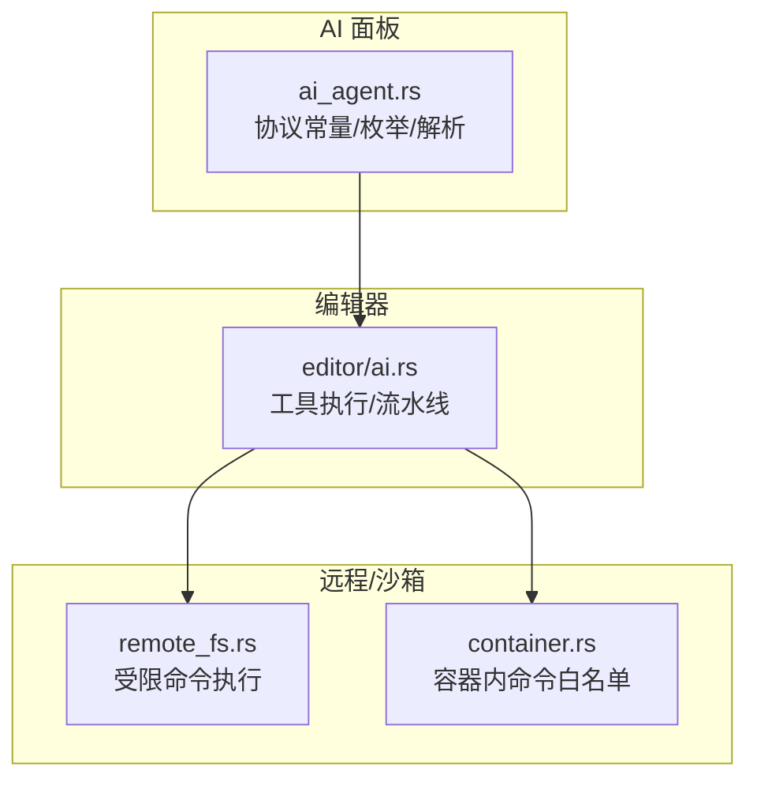
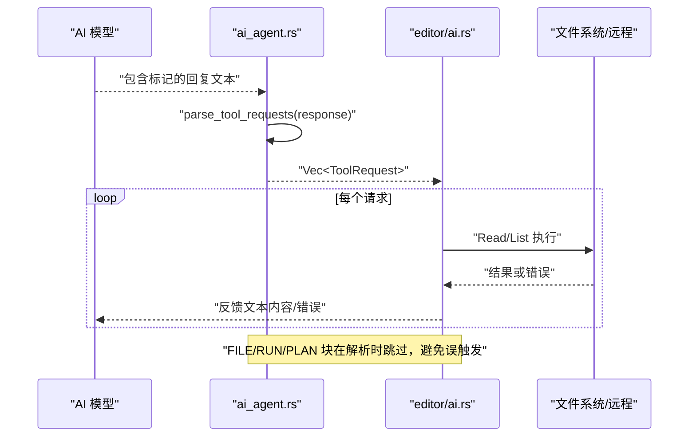
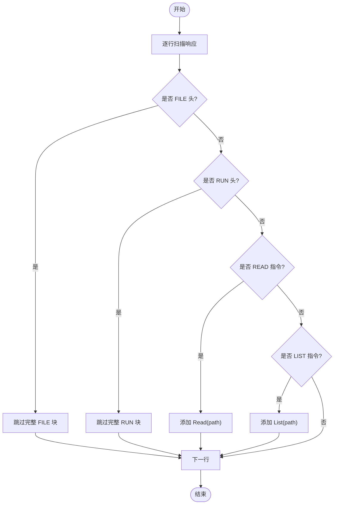
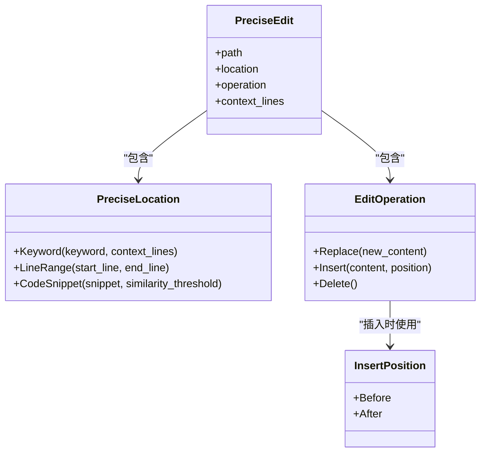
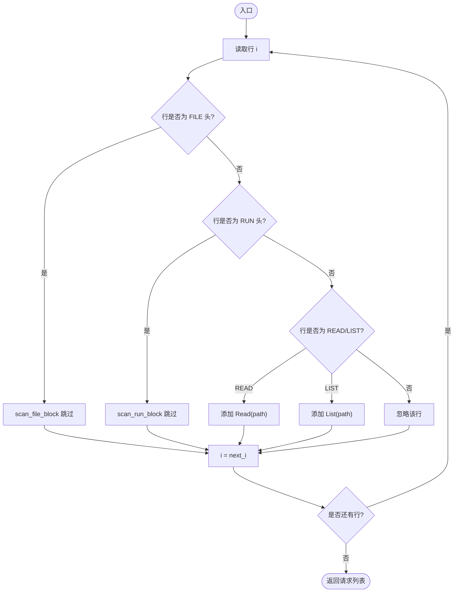
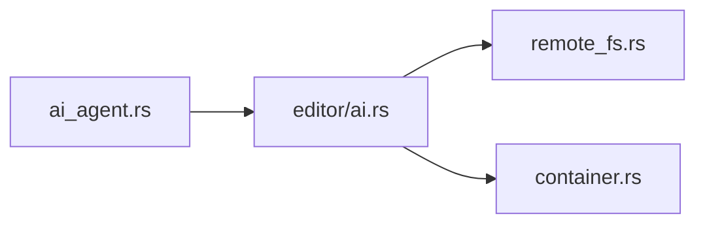

# 工具系统

<cite>
**本文引用的文件**
- [ai_agent.rs](file://crates/aether-ai-panel/src/ai_agent.rs)
- [ai.rs](file://crates/aether-win32/src/editor/ai.rs)
- [remote_fs.rs](file://crates/aether-remote/src/remote_fs.rs)
- [container.rs](file://crates/aether-remote/src/container.rs)
</cite>

## 目录
1. [简介](#简介)
2. [项目结构](#项目结构)
3. [核心组件](#核心组件)
4. [架构总览](#架构总览)
5. [详细组件分析](#详细组件分析)
6. [依赖关系分析](#依赖关系分析)
7. [性能考量](#性能考量)
8. [故障排查指南](#故障排查指南)
9. [结论](#结论)
10. [附录](#附录)

## 简介
本文件为“工具系统”的权威文档，聚焦 Agent 工具标记协议、只读工具请求解析、精准定位与编辑能力，以及扩展与安全策略。该系统的目标是让 AI 以结构化方式与编辑器交互：通过行锚定 + 独特哨兵的标记协议，安全地表达读取、列出、运行命令、规划任务、精准定位与精准编辑等意图；编辑器侧负责解析、执行并反馈结果，形成闭环。

## 项目结构
工具系统主要分布在以下模块：
- 协议定义与解析：位于 aether-ai-panel 的 ai_agent.rs，集中定义了所有标记常量、数据结构与解析函数。
- 工具执行与编排：位于 aether-win32 的 editor/ai.rs，负责将解析出的 ToolRequest 实际执行（读取文件、列出目录），并将结果回喂给模型。
- 安全与受限执行：位于 aether-remote 的 remote_fs.rs 与 container.rs，提供白名单命令执行、shell 元字符过滤等安全机制。

图表来源
- [ai_agent.rs:15-39](file://crates/aether-ai-panel/src/ai_agent.rs#L15-L39)
- [ai.rs:1099-1136](file://crates/aether-win32/src/editor/ai.rs#L1099-L1136)
- [remote_fs.rs:46-94](file://crates/aether-remote/src/remote_fs.rs#L46-L94)
- [container.rs:76-100](file://crates/aether-remote/src/container.rs#L76-L100)

章节来源
- [ai_agent.rs:15-39](file://crates/aether-ai-panel/src/ai_agent.rs#L15-L39)
- [ai.rs:1099-1136](file://crates/aether-win32/src/editor/ai.rs#L1099-L1136)
- [remote_fs.rs:46-94](file://crates/aether-remote/src/remote_fs.rs#L46-L94)
- [container.rs:76-100](file://crates/aether-remote/src/container.rs#L76-L100)

## 核心组件
- 工具请求枚举 ToolRequest：表示只读探查请求，包含 Read（读取文件）和 List（列出目录）。
- 精准定位 PreciseLocation：支持关键词搜索、行号范围、代码片段匹配三种定位方式。
- 精准编辑 EditOperation：支持替换、插入、删除三种操作类型（插入含 Before/After 位置）。
- 解析函数：parse_tool_requests、parse_precise_location、parse_edit_operation、parse_precise_edits、parse_plan 等。
- 显示块解析：parse_display_blocks，用于将 AI 回复转换为面板展示卡片。

章节来源
- [ai_agent.rs:52-59](file://crates/aether-ai-panel/src/ai_agent.rs#L52-L59)
- [ai_agent.rs:110-156](file://crates/aether-ai-panel/src/ai_agent.rs#L110-L156)
- [ai_agent.rs:238-342](file://crates/aether-ai-panel/src/ai_agent.rs#L238-L342)
- [ai_agent.rs:344-418](file://crates/aether-ai-panel/src/ai_agent.rs#L344-L418)
- [ai_agent.rs:500-541](file://crates/aether-ai-panel/src/ai_agent.rs#L500-L541)
- [ai_agent.rs:560-617](file://crates/aether-ai-panel/src/ai_agent.rs#L560-L617)
- [ai_agent.rs:732-858](file://crates/aether-ai-panel/src/ai_agent.rs#L732-L858)

## 架构总览
工具系统的工作流如下：
- AI 生成包含标记的回复文本。
- 编辑器调用 parse_tool_requests 解析出 ToolRequest 列表。
- 编辑器执行这些只读请求，得到内容并回喂给模型。
- 对于 FILE/RUN/PLAN 等块，分别由专用解析器处理，避免误解析。
- 精准定位/编辑通过 parse_precise_* 系列函数提取，并在编辑器中应用。

图表来源
- [ai_agent.rs:500-541](file://crates/aether-ai-panel/src/ai_agent.rs#L500-L541)
- [ai.rs:1099-1136](file://crates/aether-win32/src/editor/ai.rs#L1099-L1136)

章节来源
- [ai_agent.rs:500-541](file://crates/aether-ai-panel/src/ai_agent.rs#L500-L541)
- [ai.rs:1099-1136](file://crates/aether-win32/src/editor/ai.rs#L1099-L1136)

## 详细组件分析

### 协议设计原理：行锚定与独特哨兵
- 行锚定：每个标记必须独占整行（trim_end 后精确匹配/前缀匹配），避免行内出现相同字样被误解析。
- 独特哨兵：使用 AETHER_ 前缀的标记（如 AETHER_FILE、AETHER_RUN、AETHER_READ、AETHER_LIST、AETHER_PLAN、AETHER_LOCATE、AETHER_EDIT），与 Git 冲突标记（<<<<<<< / ======= / >>>>>>>）及常见代码彻底区分，防止文件内容含这些字样导致截断解析。
- 不使用长度前缀：LLM 无法可靠数出字节/字符数，长度前缀反而因计数错误导致更多截断；行锚定 + 独特哨兵对模型更友好、解析更确定。

章节来源
- [ai_agent.rs:3-13](file://crates/aether-ai-panel/src/ai_agent.rs#L3-L13)
- [ai_agent.rs:15-39](file://crates/aether-ai-panel/src/ai_agent.rs#L15-L39)

### ToolRequest 枚举与只读工具用法
- ToolRequest::Read(path)：读取工作区相对路径的文件内容。
- ToolRequest::List(path)：列出目录条目，空串表示工作区根。
- 解析规则：
  - READ_PREFIX 后须紧跟空白或行尾，且路径非空才有效。
  - LIST_PREFIX 后路径可为空，表示根目录。
  - 会跳过完整的 FILE/RUN 块体，避免块内内容被误读为工具请求。

图表来源
- [ai_agent.rs:500-541](file://crates/aether-ai-panel/src/ai_agent.rs#L500-L541)

章节来源
- [ai_agent.rs:52-59](file://crates/aether-ai-panel/src/ai_agent.rs#L52-L59)
- [ai_agent.rs:61-69](file://crates/aether-ai-panel/src/ai_agent.rs#L61-L69)
- [ai_agent.rs:500-541](file://crates/aether-ai-panel/src/ai_agent.rs#L500-L541)

### 精准定位与编辑
- PreciseLocation 三种定位方式：
  - Keyword{keyword, context_lines}：通过关键词、函数名、变量名等精确查找，可指定上下文行数。
  - LineRange{start_line, end_line}：指定起始行号和结束行号。
  - CodeSnippet{snippet, similarity_threshold}：通过内容特征匹配定位目标代码，可设置相似度阈值。
- EditOperation 四种操作类型（实现上为三类，插入含两种位置）：
  - Replace{new_content}：替换定位到的代码片段。
  - Insert{content, position}：在定位到的代码片段前/后插入新内容。
  - Delete：删除定位到的代码片段。
- 解析流程：
  - parse_precise_location：识别 LOCATE_HEADER 后的 location_type 与参数。
  - parse_edit_operation：识别 EDIT_HEADER 后的 operation_type 与可选参数。
  - parse_precise_edits：组合定位与操作，收集编辑内容直到 EDIT_FOOTER。

图表来源
- [ai_agent.rs:110-156](file://crates/aether-ai-panel/src/ai_agent.rs#L110-L156)
- [ai_agent.rs:238-342](file://crates/aether-ai-panel/src/ai_agent.rs#L238-L342)
- [ai_agent.rs:344-418](file://crates/aether-ai-panel/src/ai_agent.rs#L344-L418)

章节来源
- [ai_agent.rs:110-156](file://crates/aether-ai-panel/src/ai_agent.rs#L110-L156)
- [ai_agent.rs:238-342](file://crates/aether-ai-panel/src/ai_agent.rs#L238-L342)
- [ai_agent.rs:344-418](file://crates/aether-ai-panel/src/ai_agent.rs#L344-L418)

### 工具请求解析函数 parse_tool_requests 工作流程
- 输入：AI 回复字符串。
- 步骤：
  1. 逐行扫描，trim_end 后判断。
  2. 若检测到 FILE 头，跳过完整 FILE 块（scan_file_block）。
  3. 若检测到 RUN 头，跳过完整 RUN 块（scan_run_block）。
  4. 若检测到 READ 指令，且路径非空，添加 Read 请求。
  5. 若检测到 LIST 指令，添加 List 请求（空路径表示根）。
  6. 否则继续下一行。
- 输出：Vec<ToolRequest>。

图表来源
- [ai_agent.rs:500-541](file://crates/aether-ai-panel/src/ai_agent.rs#L500-L541)
- [ai_agent.rs:667-722](file://crates/aether-ai-panel/src/ai_agent.rs#L667-L722)

章节来源
- [ai_agent.rs:500-541](file://crates/aether-ai-panel/src/ai_agent.rs#L500-L541)
- [ai_agent.rs:667-722](file://crates/aether-ai-panel/src/ai_agent.rs#L667-L722)

### 工具执行与反馈
- execute_tool_requests：遍历 ToolRequest 列表，执行 Read/List。
- 成功：记录展示行与反馈文本（文件内容/目录列表）。
- 失败：记录错误信息，反馈给模型。
- 纯探查回合：仅包含 READ/LIST 时，隐藏开场白，只显示工具卡片。

章节来源
- [ai.rs:1099-1136](file://crates/aether-win32/src/editor/ai.rs#L1099-L1136)
- [ai_agent.rs:839-858](file://crates/aether-ai-panel/src/ai_agent.rs#L839-L858)

### 规划器任务清单解析
- parse_plan：识别 PLAN_HEADER 与 PLAN_FOOTER 之间的 GOAL/FILe/RUN 任务。
- 限制：最多解析 20 个任务；无有效任务时返回 None，回退到普通流程。
- 用途：将复杂目标分解为有序任务，编辑器顺序推进执行。

章节来源
- [ai_agent.rs:560-617](file://crates/aether-ai-panel/src/ai_agent.rs#L560-L617)

## 依赖关系分析
- ai_agent.rs 提供协议与解析能力，被 editor/ai.rs 调用以执行工具请求。
- editor/ai.rs 依赖文件系统接口进行 Read/List，并可能调用远程/容器执行受限命令。
- remote_fs.rs 与 container.rs 提供安全执行环境，确保命令白名单与 shell 元字符过滤。

图表来源
- [ai_agent.rs:500-541](file://crates/aether-ai-panel/src/ai_agent.rs#L500-L541)
- [ai.rs:1099-1136](file://crates/aether-win32/src/editor/ai.rs#L1099-L1136)
- [remote_fs.rs:46-94](file://crates/aether-remote/src/remote_fs.rs#L46-L94)
- [container.rs:76-100](file://crates/aether-remote/src/container.rs#L76-L100)

章节来源
- [ai_agent.rs:500-541](file://crates/aether-ai-panel/src/ai_agent.rs#L500-L541)
- [ai.rs:1099-1136](file://crates/aether-win32/src/editor/ai.rs#L1099-L1136)
- [remote_fs.rs:46-94](file://crates/aether-remote/src/remote_fs.rs#L46-L94)
- [container.rs:76-100](file://crates/aether-remote/src/container.rs#L76-L100)

## 性能考量
- 行锚定解析：O(n) 单遍扫描，避免回溯，适合长文本。
- 块跳过逻辑：scan_file_block/scan_run_block 一次性跳过大块，减少重复解析。
- 精准定位：关键词搜索与片段匹配可结合索引优化；相似度阈值可调以平衡精度与速度。
- 流式中断抢救：parse_trailing_create_block 仅在必要时处理尾部未闭合块，降低开销。

[本节为通用性能讨论，不直接分析具体文件]

## 故障排查指南
- 标记未触发：检查是否独占整行，是否包含 AETHER_ 前缀，是否被行内文本干扰。
- 解析为空：确认 READ 路径非空，LIST 路径可为空；FILE/RUN 块是否完整闭合。
- 执行失败：查看 execute_tool_requests 的错误反馈，检查文件系统权限或远程连接。
- 安全拒绝：命令不在白名单或包含 shell 元字符会被拒绝，需调整命令或放宽白名单（谨慎）。

章节来源
- [ai_agent.rs:500-541](file://crates/aether-ai-panel/src/ai_agent.rs#L500-L541)
- [ai.rs:1099-1136](file://crates/aether-win32/src/editor/ai.rs#L1099-L1136)
- [remote_fs.rs:46-94](file://crates/aether-remote/src/remote_fs.rs#L46-L94)
- [container.rs:76-100](file://crates/aether-remote/src/container.rs#L76-L100)

## 结论
工具系统通过行锚定与独特哨兵协议，实现了稳定、安全的 AI-编辑器交互。ToolRequest 提供只读探查能力，PreciseLocation/EditOperation 支持精准定位与编辑，parse_tool_requests 等解析函数确保正确性与鲁棒性。配合白名单命令执行与错误处理策略，系统在安全性与可用性之间取得平衡。扩展自定义工具时，应遵循协议兼容性要求，并充分考虑安全边界。

[本节为总结，不直接分析具体文件]

## 附录

### 工具扩展指南
- 新增工具类型：在 ToolRequest 中添加新变体，并在 parse_tool_requests 中增加对应解析逻辑。
- 协议兼容：保持行锚定与 AETHER_ 前缀约定，避免与现有标记冲突。
- 安全要求：任何执行类工具需通过白名单校验与 shell 元字符过滤。
- 错误处理：统一返回错误信息，便于上层展示与回喂模型。

[本节为通用指导，不直接分析具体文件]

### 安全考虑与错误处理策略
- 命令白名单：仅允许预定义的安全命令，写入操作额外审计。
- Shell 元字符过滤：拒绝包含危险字符的命令，防止注入攻击。
- 路径校验：工作区路径需安全化，防止越权访问。
- 错误分类：区分网络、文件系统、权限等错误，提供明确反馈。

章节来源
- [remote_fs.rs:46-94](file://crates/aether-remote/src/remote_fs.rs#L46-L94)
- [container.rs:76-100](file://crates/aether-remote/src/container.rs#L76-L100)