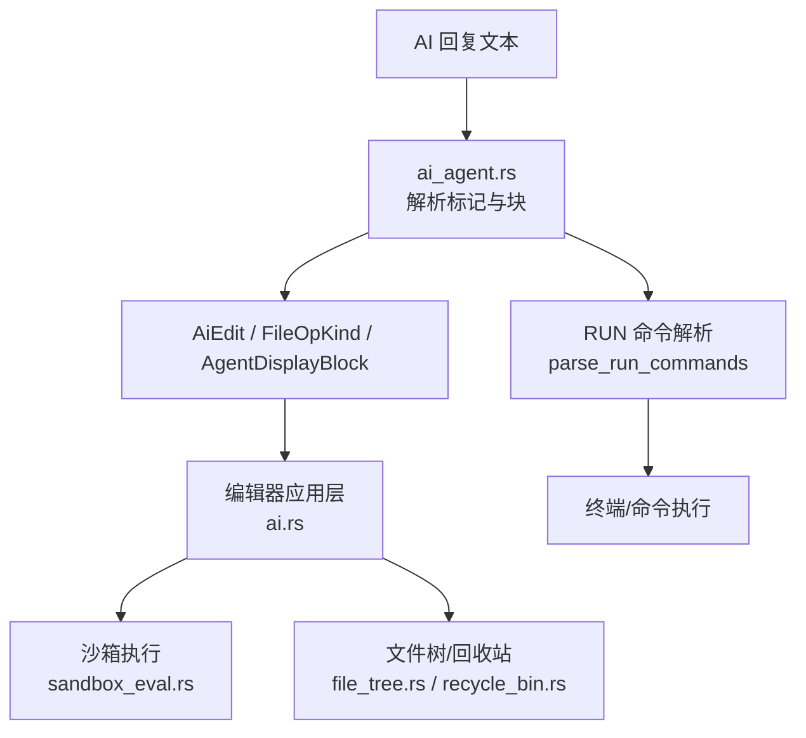
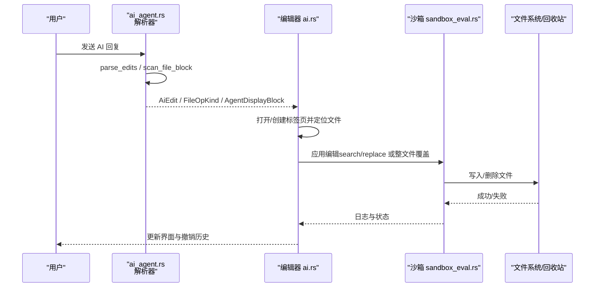
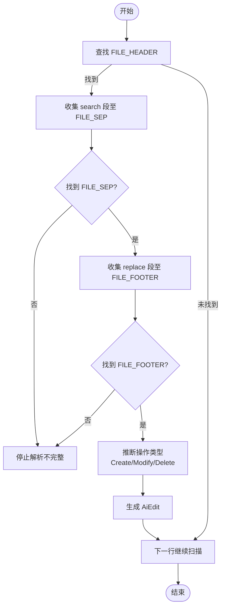
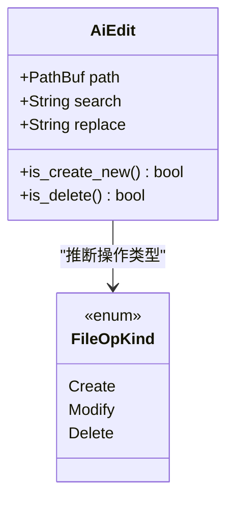
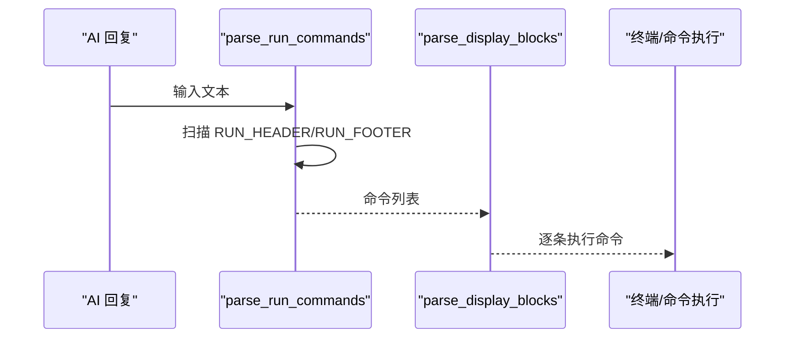
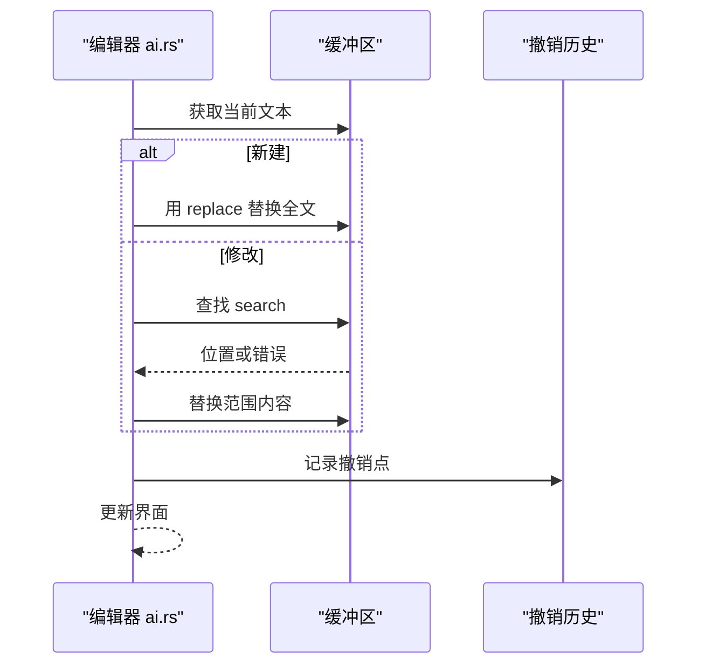
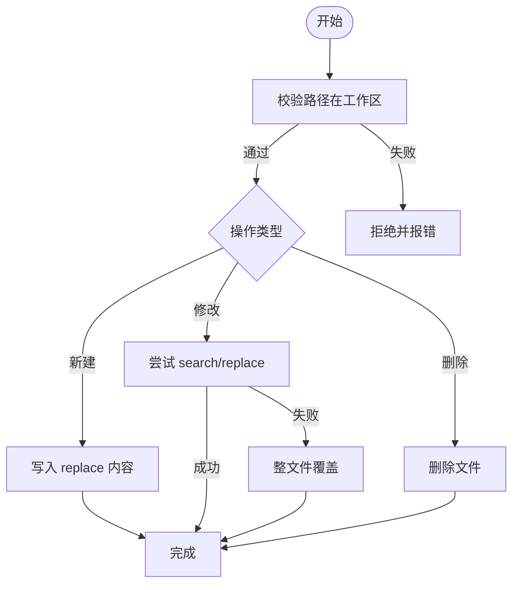
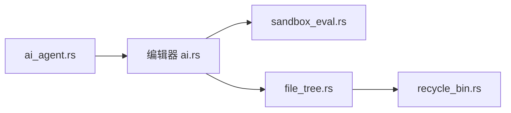

# 文件和命令块

<cite>
**本文引用的文件**
- [ai_agent.rs](file://crates/aether-ai-panel/src/ai_agent.rs)
- [ai.rs（编辑器应用层）](file://crates/aether-win32/src/editor/ai.rs)
- [sandbox_eval.rs（沙箱执行）](file://crates/aether-win32/src/sandbox_eval.rs)
- [file_tree.rs（文件树操作）](file://crates/aether-win32/src/editor/file_tree.rs)
- [recycle_bin.rs（回收站删除）](file://crates/aether-win32/src/recycle_bin.rs)
</cite>

## 目录
1. [简介](#简介)
2. [项目结构](#项目结构)
3. [核心组件](#核心组件)
4. [架构总览](#架构总览)
5. [详细组件分析](#详细组件分析)
6. [依赖关系分析](#依赖关系分析)
7. [性能考量](#性能考量)
8. [故障排查指南](#故障排查指南)
9. [结论](#结论)
10. [附录：完整示例与最佳实践](#附录完整示例与最佳实践)

## 简介
本章节面向“文件和命令块”系统，系统性说明 AI 回复中用于描述文件编辑与命令执行的标记协议、解析流程与应用落地。重点包括：
- 文件块的语法结构与标记：FILE_HEADER、FILE_SEP、FILE_FOOTER
- AiEdit 数据结构的设计与语义
- parse_edits 的解析逻辑：块扫描、内容提取、操作类型判断
- RUN 命令块的功能与 parse_run_commands 的工作原理
- 错误处理与恢复机制：流式中断时的抢救逻辑
- 完整的文件操作示例：新建、修改、删除

## 项目结构
该功能主要位于 AI 面板模块与编辑器应用层的协作中：
- 协议定义与解析集中在 ai_agent.rs
- 编辑器侧将解析结果应用到当前标签页或工作区文件
- 沙箱环境负责安全地写入/删除文件
- 文件树与回收站提供 UI 与系统级删除能力

**图表来源**
- [ai_agent.rs:15-24](file://crates/aether-ai-panel/src/ai_agent.rs#L15-L24)
- [ai_agent.rs:174-236](file://crates/aether-ai-panel/src/ai_agent.rs#L174-L236)
- [ai.rs:756-786](file://crates/aether-win32/src/editor/ai.rs#L756-L786)
- [sandbox_eval.rs:977-1002](file://crates/aether-win32/src/sandbox_eval.rs#L977-L1002)
- [file_tree.rs:189-210](file://crates/aether-win32/src/editor/file_tree.rs#L189-L210)
- [recycle_bin.rs:1-39](file://crates/aether-win32/src/recycle_bin.rs#L1-L39)

**章节来源**
- [ai_agent.rs:15-24](file://crates/aether-ai-panel/src/ai_agent.rs#L15-L24)
- [ai_agent.rs:174-236](file://crates/aether-ai-panel/src/ai_agent.rs#L174-L236)
- [ai.rs:756-786](file://crates/aether-win32/src/editor/ai.rs#L756-L786)
- [sandbox_eval.rs:977-1002](file://crates/aether-win32/src/sandbox_eval.rs#L977-L1002)
- [file_tree.rs:189-210](file://crates/aether-win32/src/editor/file_tree.rs#L189-L210)
- [recycle_bin.rs:1-39](file://crates/aether-win32/src/recycle_bin.rs#L1-L39)

## 核心组件
- 协议常量：FILE_HEADER_PREFIX、FILE_SEP、FILE_FOOTER、RUN_HEADER、RUN_FOOTER 等，确保行锚定与独特哨兵，避免与代码内容冲突
- AiEdit：表示单个文件编辑建议，包含路径、搜索内容与替换内容；提供 is_create_new 与 is_delete 判定
- 文件操作类型：FileOpKind::Create/Modify/Delete，由 scan_file_block 根据 search/replace 是否为空推断
- 显示块：AgentDisplayBlock，用于将原始标记转换为清晰的操作卡片（文本、文件操作、运行命令、读取/列出目录、不完整提示）
- 解析函数：parse_edits、scan_file_block、parse_run_commands、parse_display_blocks、parse_trailing_create_block

**章节来源**
- [ai_agent.rs:15-24](file://crates/aether-ai-panel/src/ai_agent.rs#L15-L24)
- [ai_agent.rs:84-108](file://crates/aether-ai-panel/src/ai_agent.rs#L84-L108)
- [ai_agent.rs:619-653](file://crates/aether-ai-panel/src/ai_agent.rs#L619-L653)
- [ai_agent.rs:667-703](file://crates/aether-ai-panel/src/ai_agent.rs#L667-L703)
- [ai_agent.rs:732-858](file://crates/aether-ai-panel/src/ai_agent.rs#L732-L858)
- [ai_agent.rs:420-464](file://crates/aether-ai-panel/src/ai_agent.rs#L420-L464)

## 架构总览
下图展示了从 AI 回复到最终文件/命令执行的端到端流程，包括解析、展示、应用与恢复。

**图表来源**
- [ai_agent.rs:174-236](file://crates/aether-ai-panel/src/ai_agent.rs#L174-L236)
- [ai_agent.rs:667-703](file://crates/aether-ai-panel/src/ai_agent.rs#L667-L703)
- [ai.rs:756-786](file://crates/aether-win32/src/editor/ai.rs#L756-L786)
- [sandbox_eval.rs:977-1002](file://crates/aether-win32/src/sandbox_eval.rs#L977-L1002)

## 详细组件分析

### 文件块语法与解析
- 标记约定：
  - FILE_HEADER：以 FILE_HEADER_PREFIX 开头的独占行，后跟相对路径
  - FILE_SEP：分隔行，区分 search 与 replace
  - FILE_FOOTER：结束行，标志文件块闭合
- 解析流程：
  - parse_edits 逐行扫描，识别 FILE_HEADER，收集 search 段至 FILE_SEP，再收集 replace 段至 FILE_FOOTER
  - 若缺少分隔或结束标记，则停止解析剩余内容，保证鲁棒性
  - 使用默认路径兜底当 header 未提供路径
- 操作类型判断：
  - scan_file_block 通过 search 与 replace 是否为空推断 Create/Modify/Delete
  - 仅当 search 为空且 replace 非空时视为新建；replace 为空且 search 非空视为删除；否则为修改

**图表来源**
- [ai_agent.rs:174-236](file://crates/aether-ai-panel/src/ai_agent.rs#L174-L236)
- [ai_agent.rs:667-703](file://crates/aether-ai-panel/src/ai_agent.rs#L667-L703)

**章节来源**
- [ai_agent.rs:15-24](file://crates/aether-ai-panel/src/ai_agent.rs#L15-L24)
- [ai_agent.rs:174-236](file://crates/aether-ai-panel/src/ai_agent.rs#L174-L236)
- [ai_agent.rs:667-703](file://crates/aether-ai-panel/src/ai_agent.rs#L667-L703)

### AiEdit 结构设计
- 字段：
  - path：目标文件路径（相对路径）
  - search：旧内容片段（新建时为空白）
  - replace：新内容片段（删除时为空白）
- 方法：
  - is_create_new：search 为空即为新建
  - is_delete：replace 为空且 search 非空即为删除
- 设计要点：
  - 统一表达三种操作（新建/修改/删除），便于上层应用一致处理
  - 与 FileOpKind 配合，既支持精确替换也支持整文件覆盖

**图表来源**
- [ai_agent.rs:84-108](file://crates/aether-ai-panel/src/ai_agent.rs#L84-L108)
- [ai_agent.rs:619-625](file://crates/aether-ai-panel/src/ai_agent.rs#L619-L625)

**章节来源**
- [ai_agent.rs:84-108](file://crates/aether-ai-panel/src/ai_agent.rs#L84-L108)
- [ai_agent.rs:619-625](file://crates/aether-ai-panel/src/ai_agent.rs#L619-L625)

### RUN 命令块与 parse_run_commands
- 标记约定：
  - RUN_HEADER：命令块起始行
  - RUN_FOOTER：命令块结束行
- 工作原理：
  - parse_run_commands 扫描响应文本，遇到 RUN_HEADER 后进入块体
  - 按行过滤空行，收集非空命令字符串，直到遇到 RUN_FOOTER
  - 支持多命令顺序执行
- 展示与执行：
  - parse_display_blocks 将 RUN 块转换为 AgentDisplayBlock::Run，供面板渲染
  - 编辑器侧可触发命令执行流程（如终端运行）

**图表来源**
- [ai_agent.rs:466-498](file://crates/aether-ai-panel/src/ai_agent.rs#L466-L498)
- [ai_agent.rs:732-858](file://crates/aether-ai-panel/src/ai_agent.rs#L732-L858)

**章节来源**
- [ai_agent.rs:466-498](file://crates/aether-ai-panel/src/ai_agent.rs#L466-L498)
- [ai_agent.rs:732-858](file://crates/aether-ai-panel/src/ai_agent.rs#L732-L858)

### 编辑器应用层：文件操作与撤销
- 打开/创建标签页：
  - 根据路径切换或加载文件，不存在则创建新标签页
- 应用编辑：
  - 新建：直接替换为 replace 内容
  - 修改：在旧文本中查找 search 并替换为 replace，找不到时报错
  - 记录撤销历史，支持 Ctrl+Z 逐文件撤销
- 错误处理：
  - 无法匹配 search 时返回错误信息，阻止不安全修改

**图表来源**
- [ai.rs:756-786](file://crates/aether-win32/src/editor/ai.rs#L756-L786)

**章节来源**
- [ai.rs:756-786](file://crates/aether-win32/src/editor/ai.rs#L756-L786)

### 沙箱执行：安全写入与删除
- 路径校验：
  - 仅允许工作区内路径，防止逃逸
- 写入策略：
  - 新建：直接写入 replace 内容
  - 修改：优先尝试 search/replace 一次替换；若失败则整文件覆盖
  - 删除：调用系统删除 API
- 日志记录：
  - 记录文件操作行为，便于审计与调试

**图表来源**
- [sandbox_eval.rs:977-1002](file://crates/aether-win32/src/sandbox_eval.rs#L977-L1002)

**章节来源**
- [sandbox_eval.rs:977-1002](file://crates/aether-win32/src/sandbox_eval.rs#L977-L1002)

### 文件树与回收站：UI 与系统级删除
- 新建文件：
  - 写入空文件，刷新文件树并打开新标签页
- 删除文件：
  - 移入系统回收站，支持从回收站恢复
  - 记录删除操作以支持撤销

**章节来源**
- [file_tree.rs:189-210](file://crates/aether-win32/src/editor/file_tree.rs#L189-L210)
- [file_tree.rs:548-571](file://crates/aether-win32/src/editor/file_tree.rs#L548-L571)
- [recycle_bin.rs:1-39](file://crates/aether-win32/src/recycle_bin.rs#L1-L39)

## 依赖关系分析
- ai_agent.rs 提供协议与解析，被编辑器与面板引用
- 编辑器 ai.rs 负责具体文件操作与 UI 更新
- 沙箱 sandbox_eval.rs 提供安全执行环境
- 文件树与回收站提供系统级文件管理能力

**图表来源**
- [ai_agent.rs:174-236](file://crates/aether-ai-panel/src/ai_agent.rs#L174-L236)
- [ai.rs:756-786](file://crates/aether-win32/src/editor/ai.rs#L756-L786)
- [sandbox_eval.rs:977-1002](file://crates/aether-win32/src/sandbox_eval.rs#L977-L1002)
- [file_tree.rs:189-210](file://crates/aether-win32/src/editor/file_tree.rs#L189-L210)
- [recycle_bin.rs:1-39](file://crates/aether-win32/src/recycle_bin.rs#L1-L39)

**章节来源**
- [ai_agent.rs:174-236](file://crates/aether-ai-panel/src/ai_agent.rs#L174-L236)
- [ai.rs:756-786](file://crates/aether-win32/src/editor/ai.rs#L756-L786)
- [sandbox_eval.rs:977-1002](file://crates/aether-win32/src/sandbox_eval.rs#L977-L1002)
- [file_tree.rs:189-210](file://crates/aether-win32/src/editor/file_tree.rs#L189-L210)
- [recycle_bin.rs:1-39](file://crates/aether-win32/src/recycle_bin.rs#L1-L39)

## 性能考量
- 行锚定解析：
  - 使用独占行匹配与独特哨兵，避免误触发，降低解析复杂度
- 流式处理：
  - 支持增量解析与展示，减少等待时间
- 内存与拷贝：
  - 解析过程中尽量复用行切片，减少不必要的字符串分配
- 批量操作：
  - 多个文件块与命令块可一次性解析并执行，提升效率

[本节为通用指导，不直接分析具体文件]

## 故障排查指南
- 标记不完整：
  - 缺少分隔或结束标记时，解析提前终止；面板会显示 Incomplete 提示
- 流式中断抢救：
  - parse_trailing_create_block 仅在尾部新建块未闭合且有实际内容时抢救部分内容
  - 修改/删除类块不抢救，避免截断内容破坏现有文件
- 网络/API 错误：
  - 区分本地调用失败与服务器错误，追加错误消息到消息历史
- 文件操作失败：
  - 编辑器侧无法匹配 search 时返回错误；沙箱写入失败时记录日志

**章节来源**
- [ai_agent.rs:420-464](file://crates/aether-ai-panel/src/ai_agent.rs#L420-L464)
- [ai_agent.rs:732-858](file://crates/aether-ai-panel/src/ai_agent.rs#L732-L858)
- [ai_panel.rs:751-800](file://crates/aether-ai-panel/src/ai_panel.rs#L751-L800)
- [ai.rs:756-786](file://crates/aether-win32/src/editor/ai.rs#L756-L786)

## 结论
该“文件和命令块”系统通过明确的标记协议与稳健的解析逻辑，实现了 AI 回复到文件/命令操作的可靠转换。AiEdit 与 FileOpKind 的统一抽象简化了上层应用的处理流程；RUN 命令块支持多命令执行；流式中断抢救机制提升了用户体验与数据安全性。整体架构清晰、可扩展性强，适合在复杂编辑场景中稳定运行。

[本节为总结，不直接分析具体文件]

## 附录：完整示例与最佳实践

### 文件块示例
- 新建文件：
  - 使用 FILE_HEADER 指定路径，search 留空，replace 写入初始内容，FILE_FOOTER 闭合
- 修改文件：
  - 在 search 中提供待替换片段，replace 中提供新内容
- 删除文件：
  - 在 search 中提供待删除片段，replace 留空

**章节来源**
- [ai_agent.rs:174-236](file://crates/aether-ai-panel/src/ai_agent.rs#L174-L236)
- [ai_agent.rs:667-703](file://crates/aether-ai-panel/src/ai_agent.rs#L667-L703)

### RUN 命令块示例
- 单条命令：
  - 在 RUN_HEADER 与 RUN_FOOTER 之间写一条命令
- 多条命令：
  - 在同一块内按行书写多条命令，空行将被忽略

**章节来源**
- [ai_agent.rs:466-498](file://crates/aether-ai-panel/src/ai_agent.rs#L466-L498)

### 错误处理与恢复
- 流式中断抢救：
  - 仅对尾部新建块进行抢救，确保数据安全
- 编辑器错误：
  - 无法匹配 search 时返回错误，避免误改
- 系统删除：
  - 使用回收站，支持恢复

**章节来源**
- [ai_agent.rs:420-464](file://crates/aether-ai-panel/src/ai_agent.rs#L420-L464)
- [ai.rs:756-786](file://crates/aether-win32/src/editor/ai.rs#L756-L786)
- [file_tree.rs:548-571](file://crates/aether-win32/src/editor/file_tree.rs#L548-L571)
- [recycle_bin.rs:1-39](file://crates/aether-win32/src/recycle_bin.rs#L1-L39)