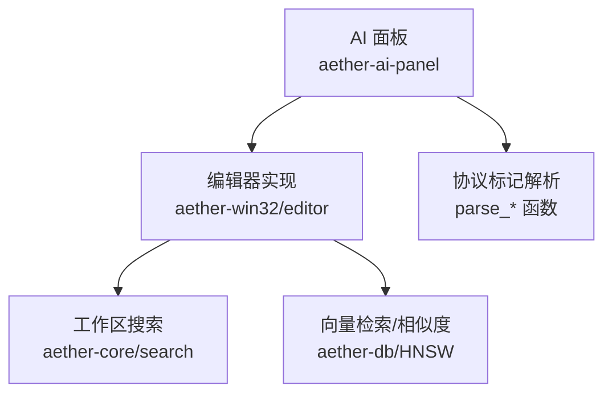
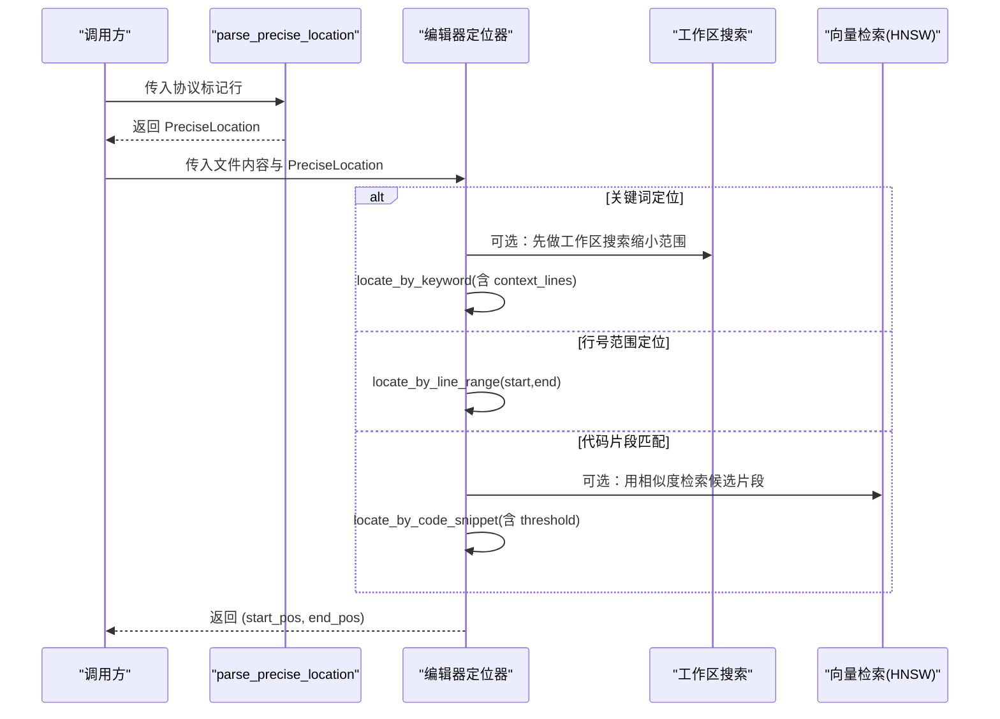
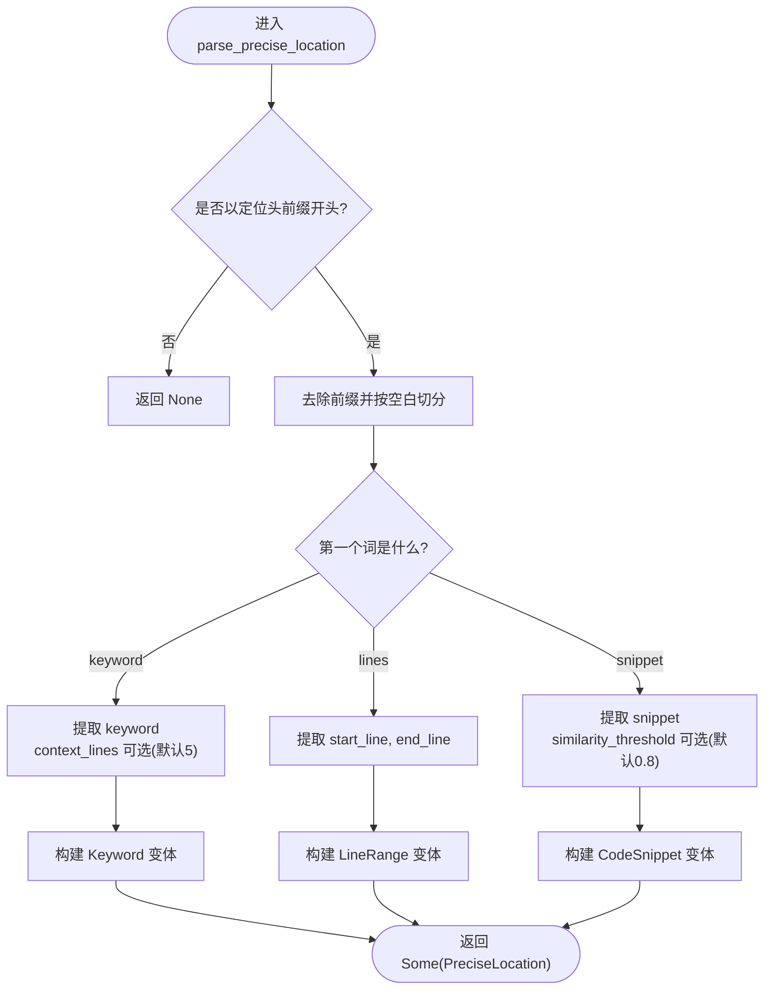
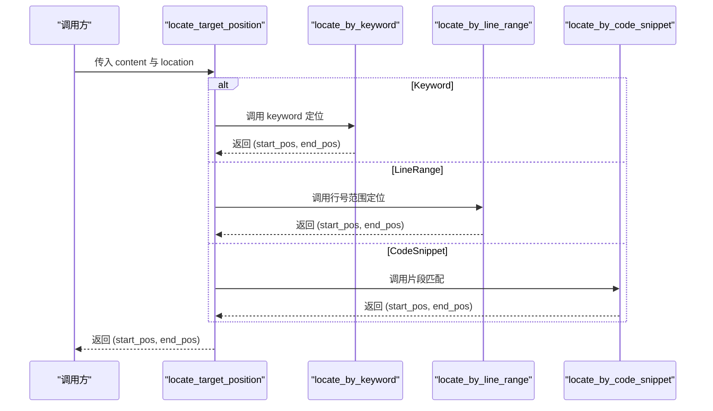
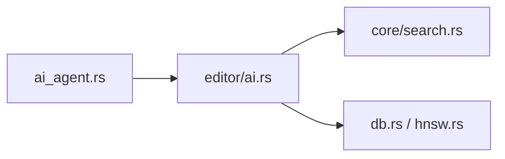

# 精准定位

<cite>
**本文引用的文件**
- [ai_agent.rs](file://crates/aether-ai-panel/src/ai_agent.rs)
- [ai.rs](file://crates/aether-win32/src/editor/ai.rs)
- [search.rs](file://crates/aether-core/src/search.rs)
- [hnsw.rs](file://crates/aether-db/src/hnsw.rs)
- [db.rs](file://crates/aether-db/src/db.rs)
</cite>

## 目录
1. [简介](#简介)
2. [项目结构](#项目结构)
3. [核心组件](#核心组件)
4. [架构总览](#架构总览)
5. [详细组件分析](#详细组件分析)
6. [依赖关系分析](#依赖关系分析)
7. [性能考量](#性能考量)
8. [故障排查指南](#故障排查指南)
9. [结论](#结论)
10. [附录：使用示例与最佳实践](#附录使用示例与最佳实践)

## 简介
本文件面向“精准定位”子系统，系统性说明三种定位方式（关键词搜索、行号范围、代码片段匹配）的参数配置、解析逻辑、使用场景与集成方式。重点覆盖：
- PreciseLocation 枚举的三种定位类型及其参数
- parse_precise_location 的解析规则与校验
- context_lines 上下文行数与 similarity_threshold 相似度阈值的含义与影响
- 与文件搜索、代码分析模块的集成点
- 性能优化建议（关键词索引、相似度计算算法等）

## 项目结构
精准定位能力由 AI 面板层定义数据结构与协议标记，由编辑器层实现具体定位与编辑应用，并可与工作区搜索、向量数据库等组件协作。

图表来源
- [ai_agent.rs:110-125](file://crates/aether-ai-panel/src/ai_agent.rs#L110-L125)
- [ai.rs:893-975](file://crates/aether-win32/src/editor/ai.rs#L893-L975)
- [search.rs:45-171](file://crates/aether-core/src/search.rs#L45-L171)
- [hnsw.rs:87-153](file://crates/aether-db/src/hnsw.rs#L87-L153)

章节来源
- [ai_agent.rs:110-125](file://crates/aether-ai-panel/src/ai_agent.rs#L110-L125)
- [ai.rs:893-975](file://crates/aether-win32/src/editor/ai.rs#L893-L975)
- [search.rs:45-171](file://crates/aether-core/src/search.rs#L45-L171)
- [hnsw.rs:87-153](file://crates/aether-db/src/hnsw.rs#L87-L153)

## 核心组件
- PreciseLocation：定义三种精准定位方式
  - Keyword：关键词搜索，支持 context_lines 上下文行数
  - LineRange：行号范围定位，start_line 与 end_line
  - CodeSnippet：代码片段摘要匹配，支持 similarity_threshold 相似度阈值
- parse_precise_location：从协议标记行解析出 PreciseLocation
- 编辑器定位器：根据 PreciseLocation 在文件内容中计算字符区间，并执行编辑操作
- 工作区搜索：提供全文检索能力，可作为关键词定位的前置或增强手段
- 向量检索：提供基于相似度的近似最近邻搜索，可用于代码片段匹配

章节来源
- [ai_agent.rs:110-125](file://crates/aether-ai-panel/src/ai_agent.rs#L110-L125)
- [ai_agent.rs:238-295](file://crates/aether-ai-panel/src/ai_agent.rs#L238-L295)
- [ai.rs:893-975](file://crates/aether-win32/src/editor/ai.rs#L893-L975)
- [search.rs:45-171](file://crates/aether-core/src/search.rs#L45-L171)
- [hnsw.rs:87-153](file://crates/aether-db/src/hnsw.rs#L87-L153)

## 架构总览
精准定位的数据流与控制流如下：

图表来源
- [ai_agent.rs:238-295](file://crates/aether-ai-panel/src/ai_agent.rs#L238-L295)
- [ai.rs:893-975](file://crates/aether-win32/src/editor/ai.rs#L893-L975)
- [search.rs:45-171](file://crates/aether-core/src/search.rs#L45-L171)
- [hnsw.rs:87-153](file://crates/aether-db/src/hnsw.rs#L87-L153)

## 详细组件分析

### 精准定位枚举与协议标记
- PreciseLocation 包含三种变体：
  - Keyword：keyword + context_lines
  - LineRange：start_line + end_line
  - CodeSnippet：snippet + similarity_threshold
- 协议标记以独占行的形式嵌入，便于稳定解析与避免误触发

章节来源
- [ai_agent.rs:110-125](file://crates/aether-ai-panel/src/ai_agent.rs#L110-L125)
- [ai_agent.rs:34-39](file://crates/aether-ai-panel/src/ai_agent.rs#L34-L39)

### parse_precise_location 解析逻辑
- 前置条件：行必须以定位头前缀开头，否则直接返回空
- 分割策略：去除前缀后按空白切分参数
- 分支处理：
  - keyword：至少需要 keyword；context_lines 可选，缺省为 5
  - lines：必须提供 start_line 与 end_line，均解析为无符号整数
  - snippet：至少需要 snippet；similarity_threshold 可选，缺省为 0.8
- 失败路径：参数不足或解析失败时返回空

图表来源
- [ai_agent.rs:238-295](file://crates/aether-ai-panel/src/ai_agent.rs#L238-L295)

章节来源
- [ai_agent.rs:238-295](file://crates/aether-ai-panel/src/ai_agent.rs#L238-L295)

### 编辑器侧定位实现
- locate_target_position：根据 PreciseLocation 分发到具体定位方法
- locate_by_keyword：
  - 逐行扫描，找到包含 keyword 的行
  - 计算上下文范围：start_line = i - context_lines，end_line = i + context_lines + 1
  - 将行号范围转换为字符位置（考虑换行符长度）
- locate_by_line_range：
  - 校验 start_line/end_line 有效性（非零且不超出行数）
  - 将 1-based 行号转换为字符位置
- locate_by_code_snippet：
  - 当前简化实现为子串查找
  - 可结合相似度阈值进行过滤（预留扩展点）

图表来源
- [ai.rs:893-975](file://crates/aether-win32/src/editor/ai.rs#L893-L975)

章节来源
- [ai.rs:893-975](file://crates/aether-win32/src/editor/ai.rs#L893-L975)

### 与工作区搜索的集成
- 当关键词定位可能命中过多结果时，可先用 search_workspace 在工作区内检索，缩小候选范围后再进行精确上下文计算
- search_workspace 支持正则/字面量匹配、大小写敏感、包含/排除模式、最大文件大小限制与结果数量上限

章节来源
- [search.rs:45-171](file://crates/aether-core/src/search.rs#L45-L171)

### 与向量检索的集成（相似度匹配）
- CodeSnippet 定位可借助 HNSW 近似最近邻搜索进行相似度匹配
- db.knn 支持按标签过滤、距离排序与 top-k 截断
- 通过设置 similarity_threshold 控制召回质量与性能平衡

章节来源
- [db.rs:259-300](file://crates/aether-db/src/db.rs#L259-L300)
- [hnsw.rs:87-153](file://crates/aether-db/src/hnsw.rs#L87-L153)

## 依赖关系分析
- ai_agent.rs 定义 PreciseLocation 与解析函数，作为上层协议与数据模型
- aether-win32/editor/ai.rs 消费该模型，实现具体定位与编辑应用
- aether-core/search.rs 提供工作区文本搜索，可作为关键词定位的前置步骤
- aether-db 提供向量检索能力，用于代码片段相似度匹配

图表来源
- [ai_agent.rs:110-125](file://crates/aether-ai-panel/src/ai_agent.rs#L110-L125)
- [ai.rs:893-975](file://crates/aether-win32/src/editor/ai.rs#L893-L975)
- [search.rs:45-171](file://crates/aether-core/src/search.rs#L45-L171)
- [db.rs:259-300](file://crates/aether-db/src/db.rs#L259-L300)
- [hnsw.rs:87-153](file://crates/aether-db/src/hnsw.rs#L87-L153)

章节来源
- [ai_agent.rs:110-125](file://crates/aether-ai-panel/src/ai_agent.rs#L110-L125)
- [ai.rs:893-975](file://crates/aether-win32/src/editor/ai.rs#L893-L975)
- [search.rs:45-171](file://crates/aether-core/src/search.rs#L45-L171)
- [db.rs:259-300](file://crates/aether-db/src/db.rs#L259-L300)
- [hnsw.rs:87-153](file://crates/aether-db/src/hnsw.rs#L87-L153)

## 性能考量
- 关键词搜索
  - 优先使用工作区搜索（ripgrep）快速定位候选行，再计算上下文范围
  - 合理设置 context_lines：过大导致范围过宽，过小丢失上下文
- 行号范围定位
  - 时间复杂度 O(n) 行扫描，空间 O(1) 额外内存（仅计数）
  - 注意边界校验，避免无效范围
- 代码片段匹配
  - 当前简化实现为子串查找，适合精确片段
  - 若需模糊匹配，可接入 HNSW 向量检索，利用 ef/fetch 参数控制召回率与速度
  - similarity_threshold 越高，召回越严格，但可能漏匹配；越低则召回更广，但需后续过滤
- 通用优化
  - 对大文件进行大小限制与分页读取
  - 缓存常用关键词索引（如符号表、AST 节点映射）
  - 批量处理多个定位请求，减少重复 IO

[本节为通用指导，不直接分析具体文件]

## 故障排查指南
- 未找到关键词
  - 检查 keyword 是否存在于目标文件中
  - 确认 context_lines 设置合理
  - 必要时先用工作区搜索验证关键词存在性
- 行号范围无效
  - 确保 start_line/end_line 非零且不超过文件行数
  - 注意行号从 1 开始，转换字符位置时需减 1
- 代码片段未匹配
  - 当前实现为精确子串匹配，需确保片段完全一致
  - 如需模糊匹配，请接入向量检索并调整 similarity_threshold
- 错误信息参考
  - 关键词未找到：返回错误提示
  - 行号范围无效：返回错误提示
  - 片段未找到：返回错误提示

章节来源
- [ai.rs:915-975](file://crates/aether-win32/src/editor/ai.rs#L915-L975)

## 结论
精准定位系统通过统一的 PreciseLocation 抽象，支持关键词、行号范围与代码片段三种定位方式，并提供可扩展的相似度匹配能力。配合工作区搜索与向量检索，可在保证精度的同时兼顾性能。建议在大规模项目中引入索引与缓存机制，并根据实际场景调优 context_lines 与 similarity_threshold。

[本节为总结，不直接分析具体文件]

## 附录：使用示例与最佳实践

### 生成精准定位标记
- 关键词定位
  - 格式：定位头 + keyword + 可选 context_lines
  - 示例：定位函数名并附带前后若干行上下文
- 行号范围定位
  - 格式：定位头 + lines + start_line + end_line
  - 示例：指定某段代码的起止行号
- 代码片段匹配
  - 格式：定位头 + snippet + 可选 similarity_threshold
  - 示例：通过一段特征代码定位目标，可调节相似度阈值

章节来源
- [ai_agent.rs:238-295](file://crates/aether-ai-panel/src/ai_agent.rs#L238-L295)

### 参数配置建议
- context_lines
  - 小改动：1-3 行
  - 中等上下文：5 行（默认）
  - 复杂重构：7-10 行
- similarity_threshold
  - 高严格度：0.9+
  - 默认：0.8
  - 宽松匹配：0.6-0.7（需配合后续过滤）

章节来源
- [ai_agent.rs:238-295](file://crates/aether-ai-panel/src/ai_agent.rs#L238-L295)

### 与其他组件的集成
- 文件搜索
  - 在关键词定位前，使用 search_workspace 缩小候选范围
  - 适用于大型仓库或关键词泛化的场景
- 代码分析
  - 结合 AST/符号表构建关键词索引，提升定位效率
  - 将语义信息（函数签名、变量作用域）融入定位策略
- 向量检索
  - 对代码片段进行向量化存储，使用 HNSW 进行近似最近邻搜索
  - 通过 db.knn 获取候选片段，再用 similarity_threshold 过滤

章节来源
- [search.rs:45-171](file://crates/aether-core/src/search.rs#L45-L171)
- [db.rs:259-300](file://crates/aether-db/src/db.rs#L259-L300)
- [hnsw.rs:87-153](file://crates/aether-db/src/hnsw.rs#L87-L153)