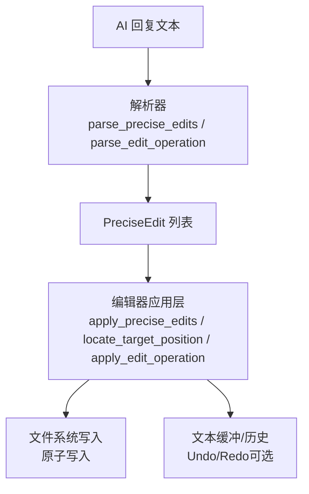
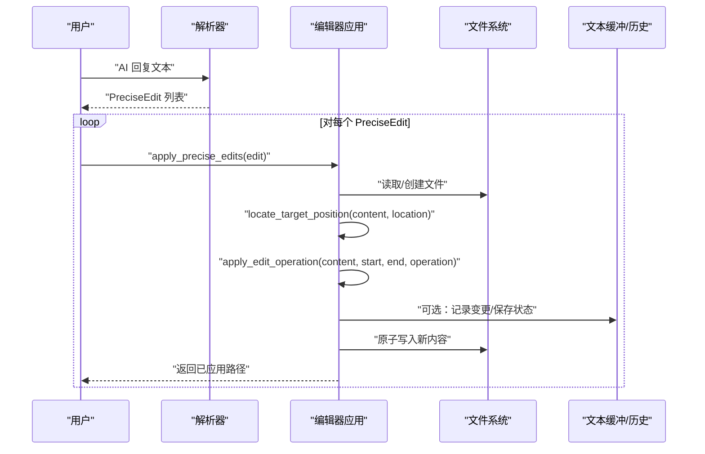
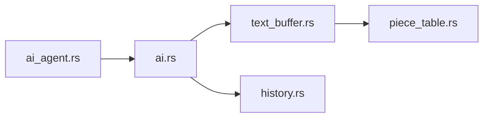

# 精准编辑

<cite>
**本文引用的文件**
- [ai_agent.rs](file://crates/aether-ai-panel/src/ai_agent.rs)
- [text_buffer.rs](file://crates/aether-core/src/buffer/text_buffer.rs)
- [history.rs](file://crates/aether-core/src/buffer/history.rs)
- [piece_table.rs](file://crates/aether-core/src/buffer/piece_table.rs)
- [ai.rs](file://crates/aether-win32/src/editor/ai.rs)
</cite>

## 目录
1. [简介](#简介)
2. [项目结构](#项目结构)
3. [核心组件](#核心组件)
4. [架构总览](#架构总览)
5. [详细组件分析](#详细组件分析)
6. [依赖关系分析](#依赖关系分析)
7. [性能考量](#性能考量)
8. [故障排查指南](#故障排查指南)
9. [结论](#结论)
10. [附录](#附录)

## 简介
本文件面向“精准编辑系统”，围绕以下目标展开：
- 解释 EditOperation 的三种操作类型（替换、插入、删除）的实现与语义。
- 说明 InsertPosition 的前后插入位置选择。
- 深入介绍 PreciseEdit 结构体的设计，包括路径、定位、操作和上下文行数的组合使用。
- 解析 parse_edit_operation 与 parse_precise_edits 的解析逻辑，包括标记识别与内容提取。
- 提供从定位到执行的端到端编辑流程示例。
- 说明安全考虑：编辑前验证、撤销机制。
- 说明与文本缓冲系统的集成方式与冲突解决策略。

## 项目结构
精准编辑能力由两部分组成：
- AI 面板侧：定义精准编辑的数据结构与解析器，负责将 AI 回复中的标记解析为可执行编辑任务。
- 编辑器侧：根据解析结果定位目标、应用编辑并持久化到文件；同时与底层文本缓冲、历史撤销等子系统协作。

**图表来源**
- [ai_agent.rs:238-418](file://crates/aether-ai-panel/src/ai_agent.rs#L238-L418)
- [ai.rs:843-885](file://crates/aether-win32/src/editor/ai.rs#L843-L885)

**章节来源**
- [ai_agent.rs:1-418](file://crates/aether-ai-panel/src/ai_agent.rs#L1-L418)
- [ai.rs:843-885](file://crates/aether-win32/src/editor/ai.rs#L843-L885)

## 核心组件
- EditOperation：表示对已定位代码片段的三类操作——替换、插入、删除。
- InsertPosition：用于 Insert 操作的相对位置（Before/After）。
- PreciseLocation：支持关键词、行号范围、代码片段摘要匹配等多种定位方式。
- PreciseEdit：封装一次精准编辑的完整信息（路径、定位、操作、上下文行数）。
- 解析器：parse_edit_operation、parse_precise_location、parse_precise_edits。
- 编辑器应用：locate_target_position、apply_edit_operation、apply_precise_edits。

**章节来源**
- [ai_agent.rs:110-172](file://crates/aether-ai-panel/src/ai_agent.rs#L110-L172)
- [ai_agent.rs:238-418](file://crates/aether-ai-panel/src/ai_agent.rs#L238-L418)
- [ai.rs:843-885](file://crates/aether-win32/src/editor/ai.rs#L843-L885)

## 架构总览
精准编辑的整体数据流如下：
1. AI 生成包含定位与编辑标记的回复。
2. 解析器识别定位标记与编辑标记，提取内容与参数，构建 PreciseEdit 列表。
3. 编辑器逐条处理 PreciseEdit：
   - 解析路径并读取文件内容（不存在则创建空内容）。
   - 根据定位方式计算目标字节范围。
   - 根据操作类型生成新内容。
   - 原子写入文件。
4. 可选地，通过文本缓冲与历史模块记录变更，以支持撤销/重做。

**图表来源**
- [ai_agent.rs:353-418](file://crates/aether-ai-panel/src/ai_agent.rs#L353-L418)
- [ai.rs:843-885](file://crates/aether-win32/src/editor/ai.rs#L843-L885)
- [text_buffer.rs:44-48](file://crates/aether-core/src/buffer/text_buffer.rs#L44-L48)
- [history.rs:124-138](file://crates/aether-core/src/buffer/history.rs#L124-L138)

## 详细组件分析

### EditOperation 与 InsertPosition
- EditOperation 包含：
  - Replace：用新内容替换定位到的片段。
  - Insert：在定位片段前后插入新内容，位置由 InsertPosition 指定。
  - Delete：删除定位到的片段。
- InsertPosition 包含：
  - Before：在定位片段之前插入。
  - After：在定位片段之后插入。

这些枚举定义了“做什么”以及“在哪里做”的基本语义，是精准编辑的最小抽象单元。

**章节来源**
- [ai_agent.rs:127-146](file://crates/aether-ai-panel/src/ai_agent.rs#L127-L146)

### PreciseLocation 与 PreciseEdit
- PreciseLocation 支持多种定位方式：
  - Keyword：基于关键词搜索，附带上下文行数。
  - LineRange：基于起始/结束行号的范围定位。
  - CodeSnippet：基于代码片段特征匹配，附带相似度阈值。
- PreciseEdit 将 path、location、operation、context_lines 组合在一起，形成一次完整的编辑请求。

该设计使上层可以灵活表达“在哪找、怎么改、保留多少上下文”。

**章节来源**
- [ai_agent.rs:110-172](file://crates/aether-ai-panel/src/ai_agent.rs#L110-L172)

### 解析器：parse_edit_operation 与 parse_precise_edits
- parse_edit_operation：
  - 识别编辑标记行（独占一行，带 AETHER_ 前缀），提取操作类型与参数。
  - 对于 insert，进一步解析 before/after。
- parse_precise_location：
  - 识别定位标记行，解析 keyword/lines/snippet 及其参数。
- parse_precise_edits：
  - 顺序扫描响应文本，找到定位标记 → 编辑标记 → 内容块 → 结束标记。
  - 将内容块填充到对应操作中，构造 PreciseEdit 列表。

解析器采用“行锚定 + 独特哨兵”的策略，避免与代码内容混淆，确保解析确定性。

**章节来源**
- [ai_agent.rs:238-418](file://crates/aether-ai-panel/src/ai_agent.rs#L238-L418)

### 编辑器应用：定位与执行
- locate_target_position：
  - 根据 PreciseLocation 的类型，在文件内容中计算目标字节范围（start_pos, end_pos）。
  - 例如：Keyword 需搜索匹配；LineRange 需按行号换算字节偏移；CodeSnippet 需进行片段匹配。
- apply_edit_operation：
  - 根据 EditOperation 类型，结合 start_pos/end_pos 生成新内容：
    - Replace：替换 [start_pos, end_pos)。
    - Insert：在 start_pos 或 end_pos 处插入内容（Before/After）。
    - Delete：删除 [start_pos, end_pos)。
- apply_precise_edits：
  - 遍历 PreciseEdit 列表，依次执行上述步骤，并原子写入文件。
  - 若文件不存在，则创建新文件并写入内容。

该流程保证每次编辑都是“先定位、再变换、最后落盘”的原子过程。

**章节来源**
- [ai.rs:843-885](file://crates/aether-win32/src/editor/ai.rs#L843-L885)

### 端到端编辑流程示例
假设 AI 回复中包含如下标记序列：
- 定位标记：<<<<<<< AETHER_LOCATE keyword <keyword> [context_lines]
- 编辑标记：<<<<<<< AETHER_EDIT replace
- 内容块：新代码
- 结束标记：>>>>>>> AETHER_END_EDIT

执行流程：
1. 解析器识别定位与编辑标记，提取 keyword、context_lines、new_content。
2. 编辑器读取文件内容，按 keyword 搜索定位到目标字节范围。
3. 应用 Replace 操作，生成新内容。
4. 原子写入文件，完成修改。

若为 Insert before/after：
- 定位到目标片段后，在 start_pos 或 end_pos 处插入新内容。

若为 Delete：
- 直接删除目标片段。

**章节来源**
- [ai_agent.rs:238-418](file://crates/aether-ai-panel/src/ai_agent.rs#L238-L418)
- [ai.rs:843-885](file://crates/aether-win32/src/editor/ai.rs#L843-L885)

### 与文本缓冲系统的集成
- TextBuffer 接口提供了 insert/delete/slice/full_text 等基础操作，以及 save_state/restore_state 用于撤销/重做。
- History 模块记录 EditDelta（Insert/Delete/Replace），支持合并连续输入、分组撤销、限制步数等优化。
- PieceTable 作为高性能缓冲区实现，支持 O(1) 插入/删除与大文件内存映射。

精准编辑可在应用层完成后，调用 TextBuffer.save_state 保存状态，并在需要时通过 History.undo/redo 恢复。

**章节来源**
- [text_buffer.rs:1-49](file://crates/aether-core/src/buffer/text_buffer.rs#L1-L49)
- [history.rs:6-77](file://crates/aether-core/src/buffer/history.rs#L6-L77)
- [piece_table.rs:11-35](file://crates/aether-core/src/buffer/piece_table.rs#L11-L35)

### 冲突解决策略
当前仓库未提供显式的“冲突检测与合并”逻辑。建议策略：
- 乐观锁：在应用编辑前读取文件版本哈希，写入前再次校验，若不一致则提示冲突。
- 重试与回退：检测到冲突时，重新定位并尝试应用，或回滚到上次成功状态。
- 合并策略：若允许自动合并，需比较差异并生成三方合并结果（当前实现未覆盖）。

由于精准编辑直接基于字节范围操作，必须确保定位与范围在并发场景下保持一致性。

[本节为概念性说明，不直接分析具体文件]

## 依赖关系分析
精准编辑的关键依赖关系如下：
- ai_agent.rs 定义数据结构与解析器，被编辑器应用层调用。
- ai.rs 实现编辑器应用逻辑，协调文件读写与定位/应用操作。
- text_buffer.rs 与 history.rs 提供缓冲与撤销能力，供编辑器在需要时集成。
- piece_table.rs 提供高性能文本存储与操作。

**图表来源**
- [ai_agent.rs:238-418](file://crates/aether-ai-panel/src/ai_agent.rs#L238-L418)
- [ai.rs:843-885](file://crates/aether-win32/src/editor/ai.rs#L843-L885)
- [text_buffer.rs:1-49](file://crates/aether-core/src/buffer/text_buffer.rs#L1-L49)
- [history.rs:6-77](file://crates/aether-core/src/buffer/history.rs#L6-L77)
- [piece_table.rs:11-35](file://crates/aether-core/src/buffer/piece_table.rs#L11-L35)

**章节来源**
- [ai_agent.rs:238-418](file://crates/aether-ai-panel/src/ai_agent.rs#L238-L418)
- [ai.rs:843-885](file://crates/aether-win32/src/editor/ai.rs#L843-L885)
- [text_buffer.rs:1-49](file://crates/aether-core/src/buffer/text_buffer.rs#L1-L49)
- [history.rs:6-77](file://crates/aether-core/src/buffer/history.rs#L6-L77)
- [piece_table.rs:11-35](file://crates/aether-core/src/buffer/piece_table.rs#L11-L35)

## 性能考量
- 解析器采用线性扫描，时间复杂度 O(N)，N 为响应文本行数。
- 定位操作取决于实现：
  - Keyword：字符串搜索，通常为 O(M*L)，M 为内容长度，L 为关键词长度。
  - LineRange：按行号换算字节偏移，O(L) 或借助索引 O(log L)。
  - CodeSnippet：片段匹配，可能涉及相似度计算，复杂度较高。
- 文件写入采用原子写入，避免部分写入导致的损坏。
- 文本缓冲使用 PieceTable，插入/删除接近 O(1)，适合大文件编辑。
- 历史记录使用差分记录与合并窗口，减少撤销栈大小与内存占用。

[本节为通用性能讨论，不直接分析具体文件]

## 故障排查指南
常见问题与排查要点：
- 解析失败：检查定位与编辑标记是否独占一行且带有正确前缀；确认结束标记存在。
- 定位失败：确认关键词唯一性或范围有效；检查上下文行数设置。
- 写入失败：检查文件权限、路径是否存在、磁盘空间是否充足。
- 撤销不可用：确认是否正确调用 save_state/restore_state 或 History 记录。
- 并发冲突：建议在应用前增加版本校验，或在 UI 层提示冲突并让用户选择策略。

**章节来源**
- [ai_agent.rs:238-418](file://crates/aether-ai-panel/src/ai_agent.rs#L238-L418)
- [ai.rs:843-885](file://crates/aether-win32/src/editor/ai.rs#L843-L885)
- [text_buffer.rs:44-48](file://crates/aether-core/src/buffer/text_buffer.rs#L44-L48)
- [history.rs:124-138](file://crates/aether-core/src/buffer/history.rs#L124-L138)

## 结论
精准编辑系统通过清晰的数据结构与解析器，将 AI 生成的自然语言意图转化为精确的文件级编辑操作。其核心优势在于：
- 灵活的定位方式与操作类型，适应多种编辑场景。
- 解析器采用行锚定与哨兵，确保解析鲁棒性。
- 编辑器应用层将定位、变换、落盘解耦，便于扩展与维护。
- 与文本缓冲和历史模块集成，支持撤销/重做与高性能编辑。

未来可增强的方向包括：
- 引入冲突检测与合并策略，提升并发安全性。
- 提供更丰富的定位方式（如符号表、AST 节点）。
- 在 UI 层提供更直观的预览与确认流程。

[本节为总结性内容，不直接分析具体文件]

## 附录
- 关键常量与标记：
  - LOCATE_HEADER、EDIT_HEADER、EDIT_FOOTER：用于定位与编辑的标记前缀与结束符。
- 最佳实践：
  - 始终使用独占行的标记，避免与代码内容混淆。
  - 在批量编辑时使用撤销组，保证原子性与用户体验。
  - 对敏感操作增加用户确认与预览。

[本节为补充信息，不直接分析具体文件]