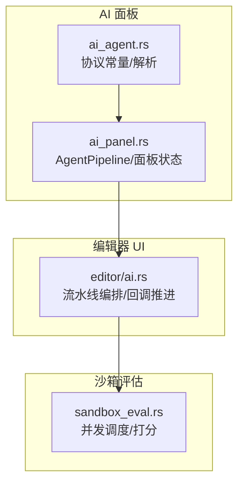
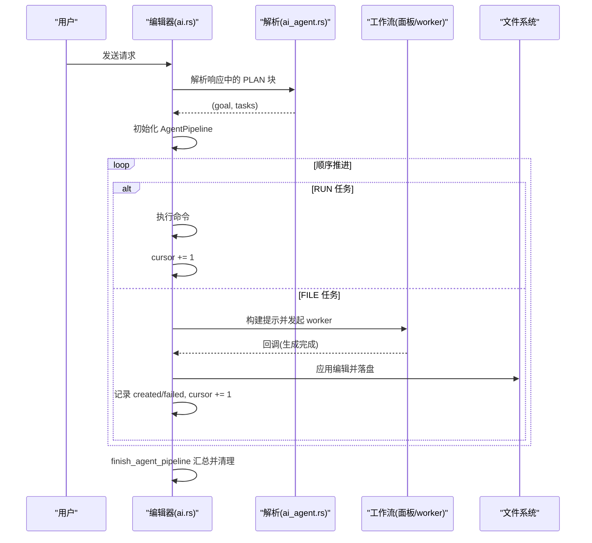
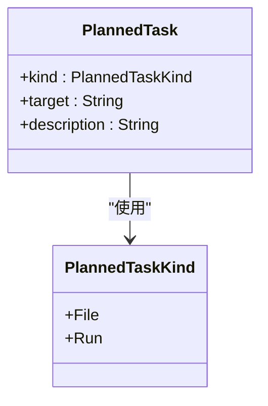
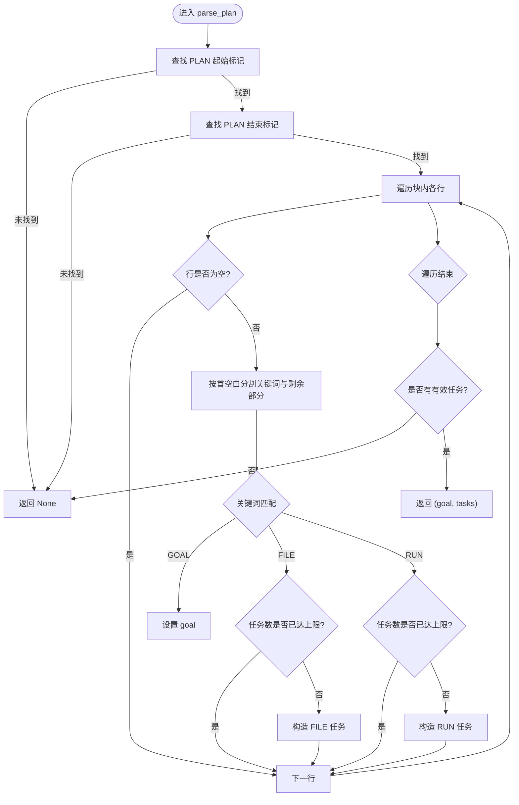
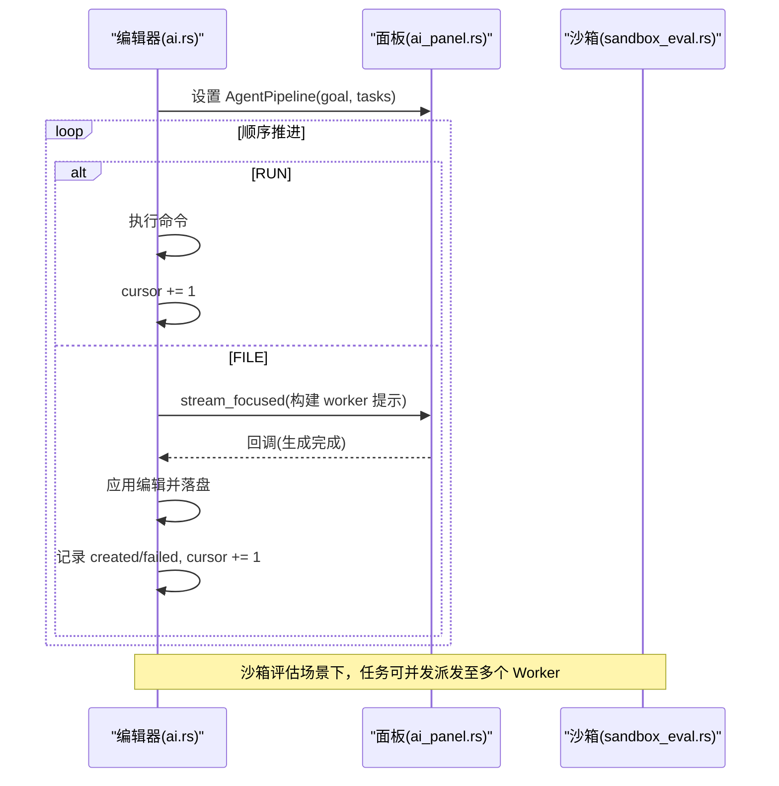
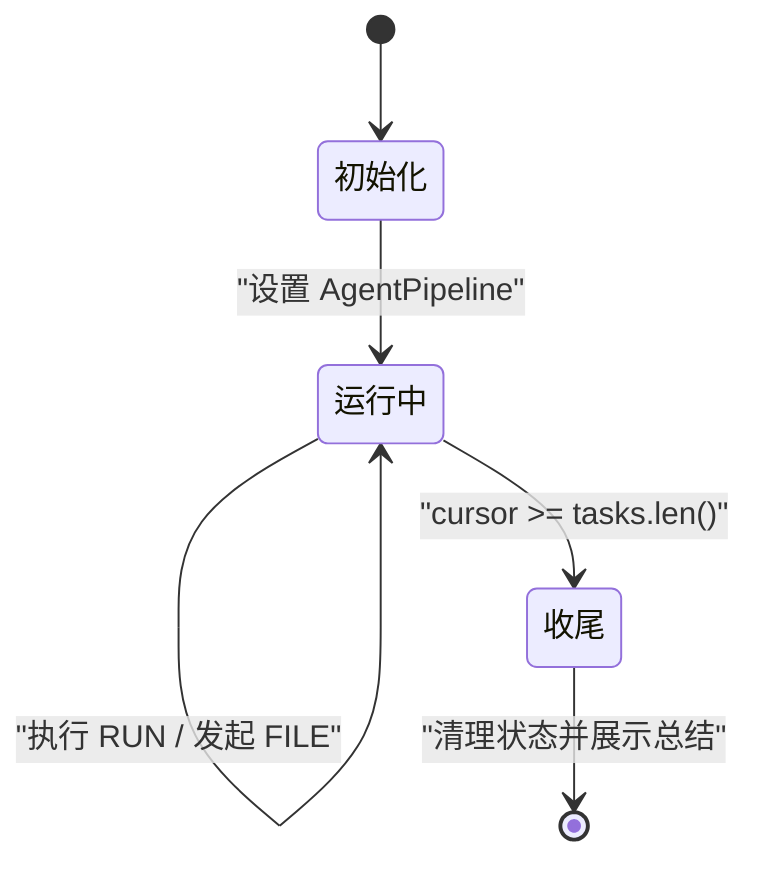

# 规划器系统

<cite>
**本文引用的文件**
- [ai_agent.rs](file://crates/aether-ai-panel/src/ai_agent.rs)
- [ai_panel.rs](file://crates/aether-ai-panel/src/ai_panel.rs)
- [ai.rs](file://crates/aether-win32/src/editor/ai.rs)
- [sandbox_eval.rs](file://crates/aether-win32/src/sandbox_eval.rs)
</cite>

## 目录
1. [简介](#简介)
2. [项目结构](#项目结构)
3. [核心组件](#核心组件)
4. [架构总览](#架构总览)
5. [详细组件分析](#详细组件分析)
6. [依赖关系分析](#依赖关系分析)
7. [性能考虑](#性能考虑)
8. [故障排查指南](#故障排查指南)
9. [结论](#结论)
10. [附录](#附录)

## 简介
本文件面向“规划器系统”，系统化说明任务类型、任务结构、解析逻辑、执行策略以及与 Agent 工作流的集成与状态管理。重点包括：
- PlannedTaskKind 枚举：区分“文件生成”和“命令执行”两类任务。
- PlannedTask 结构体：描述任务目标、职责与类型标识。
- parse_plan 函数：识别 PLAN 块、提取 GOAL/FIL E/RUN 指令、限制检查与容错。
- 关键字处理：GOAL、FILE、RUN 的语义与参数解析规则。
- 输出格式规范与最佳实践：如何编写可被正确解析的计划清单。
- 执行策略：顺序推进、依赖传递（已创建文件内容）、并发执行（沙箱评估场景）。
- 与 Agent 工作流集成：流水线状态、回调推进、失败记录与收尾汇总。

## 项目结构
规划器相关代码主要分布在 AI 面板与编辑器 UI 层：
- aether-ai-panel：定义协议常量、数据结构与解析函数，提供 AgentPipeline 等编排状态。
- aether-win32/editor：消费解析结果，驱动流水线执行（RUN 直接执行；FILE 触发 worker 生成并落盘）。
- aether-win32/sandbox_eval：在沙箱评估场景中实现多智能体并发执行与调度。

图表来源
- [ai_agent.rs:15-32](file://crates/aether-ai-panel/src/ai_agent.rs#L15-L32)
- [ai_panel.rs:540-552](file://crates/aether-ai-panel/src/ai_panel.rs#L540-L552)
- [ai.rs:1168-1177](file://crates/aether-win32/src/editor/ai.rs#L1168-L1177)
- [sandbox_eval.rs:783-810](file://crates/aether-win32/src/sandbox_eval.rs#L783-L810)

章节来源
- [ai_agent.rs:15-32](file://crates/aether-ai-panel/src/ai_agent.rs#L15-L32)
- [ai_panel.rs:540-552](file://crates/aether-ai-panel/src/ai_panel.rs#L540-L552)
- [ai.rs:1168-1177](file://crates/aether-win32/src/editor/ai.rs#L1168-L1177)
- [sandbox_eval.rs:783-810](file://crates/aether-win32/src/sandbox_eval.rs#L783-L810)

## 核心组件
- 计划块协议常量：用于标记 PLAN 块的起止行，确保与 Git 冲突标记及代码文本隔离。
- 任务类型 PlannedTaskKind：File（文件生成）与 Run（命令执行）。
- 任务结构 PlannedTask：包含 kind、target（路径或命令）、description（FILE 任务的职责说明）。
- 解析函数 parse_plan：从响应中定位 PLAN 块，逐行解析 GOAL/FIL E/RUN，限制最大任务数，返回 (goal, tasks)。
- 编排状态 AgentPipeline：保存 goal、tasks、cursor、created_files、failed_files，驱动顺序推进。
- 编辑器侧流水线：run_pipeline_until_file_task_or_finish 负责 RUN 直接执行、FILE 触发 worker 生成并等待回调继续。
- 沙箱评估并发：sandbox_eval 将任务分派给多个 AgentWorker，支持搜索续写、超时终止与打分阶段。

章节来源
- [ai_agent.rs:29-32](file://crates/aether-ai-panel/src/ai_agent.rs#L29-L32)
- [ai_agent.rs:543-558](file://crates/aether-ai-panel/src/ai_agent.rs#L543-L558)
- [ai_agent.rs:560-617](file://crates/aether-ai-panel/src/ai_agent.rs#L560-L617)
- [ai_panel.rs:540-552](file://crates/aether-ai-panel/src/ai_panel.rs#L540-L552)
- [ai.rs:1179-1257](file://crates/aether-win32/src/editor/ai.rs#L1179-L1257)
- [sandbox_eval.rs:783-810](file://crates/aether-win32/src/sandbox_eval.rs#L783-L810)

## 架构总览
规划器的工作流分为“解析—编排—执行—收尾”四个阶段：
- 解析：parse_plan 从 AI 回复中提取 PLAN 块，产出 (goal, tasks)。
- 编排：编辑器侧设置 AgentPipeline，按 cursor 顺序推进。
- 执行：RUN 直接执行；FILE 调用 worker 生成文件，完成后回调 advance_agent_pipeline 落盘并推进。
- 收尾：finish_agent_pipeline 汇总成功/失败，清理状态并展示总结。

图表来源
- [ai_agent.rs:560-617](file://crates/aether-ai-panel/src/ai_agent.rs#L560-L617)
- [ai.rs:1168-1177](file://crates/aether-win32/src/editor/ai.rs#L1168-L1177)
- [ai.rs:1179-1257](file://crates/aether-win32/src/editor/ai.rs#L1179-L1257)
- [ai.rs:1259-1317](file://crates/aether-win32/src/editor/ai.rs#L1259-L1317)

## 详细组件分析

### PlannedTaskKind 与 PlannedTask
- PlannedTaskKind：区分 File（需独立 AI 调用生成文件）与 Run（直接执行命令）。
- PlannedTask：
  - kind：任务类型。
  - target：FILE 为相对路径；RUN 为要执行的命令。
  - description：FILE 的任务职责描述；RUN 通常为空。

图表来源
- [ai_agent.rs:543-558](file://crates/aether-ai-panel/src/ai_agent.rs#L543-L558)

章节来源
- [ai_agent.rs:543-558](file://crates/aether-ai-panel/src/ai_agent.rs#L543-L558)

### parse_plan 解析逻辑
- 识别 PLAN 块：通过固定头尾标记定位块范围。
- 提取任务清单：逐行解析 GOAL、FILE、RUN。
- 限制检查：最多解析 20 个任务；空任务跳过。
- 参数解析：
  - GOAL：整体目标字符串。
  - FILE：第一个空白前为路径，其后为描述；若仅路径无描述则 description 为空。
  - RUN：整行为命令；description 为空。
- 返回：若无有效任务则返回 None，调用方回退到普通单次流程。

图表来源
- [ai_agent.rs:560-617](file://crates/aether-ai-panel/src/ai_agent.rs#L560-L617)

章节来源
- [ai_agent.rs:560-617](file://crates/aether-ai-panel/src/ai_agent.rs#L560-L617)

### 关键字处理方式与参数解析
- GOAL：读取其后的整段作为整体目标。
- FILE：
  - 参数：路径（必填），描述（可选）。
  - 约束：路径非空才计入任务；超过最大任务数忽略。
- RUN：
  - 参数：命令字符串（必填）。
  - 约束：命令非空且不超过最大任务数。

章节来源
- [ai_agent.rs:582-610](file://crates/aether-ai-panel/src/ai_agent.rs#L582-L610)

### 规划器输出格式规范与最佳实践
- 使用独占行的协议标记包围计划块，避免与代码内容混淆。
- 每行仅包含一个关键字指令（GOAL/FIL E/RUN），便于解析。
- FILE 任务建议提供清晰的路径与简要描述，提升可读性与后续 worker 上下文质量。
- 控制任务数量：合理规划，避免超出上限导致任务丢失。
- 保持命令简洁明确：RUN 任务应可直接在终端执行。

章节来源
- [ai_agent.rs:29-32](file://crates/aether-ai-panel/src/ai_agent.rs#L29-L32)
- [ai_agent.rs:560-617](file://crates/aether-ai-panel/src/ai_agent.rs#L560-L617)

### 任务执行策略：依赖管理与并发执行
- 顺序推进：
  - RUN 任务：立即执行并前进。
  - FILE 任务：发起 worker 生成，完成后回调落盘并前进。
- 依赖管理：
  - 后续 FILE 任务可引用已创建文件的内容（read_workspace_file 截断后传入），保证上下文连贯。
- 并发执行（沙箱评估）：
  - 将任务分派给多个 AgentWorker，空闲时自动领取新任务。
  - 支持搜索续写、超时终止与打分阶段。

图表来源
- [ai.rs:1179-1257](file://crates/aether-win32/src/editor/ai.rs#L1179-L1257)
- [ai.rs:1259-1317](file://crates/aether-win32/src/editor/ai.rs#L1259-L1317)
- [sandbox_eval.rs:708-729](file://crates/aether-win32/src/sandbox_eval.rs#L708-L729)

章节来源
- [ai.rs:1179-1257](file://crates/aether-win32/src/editor/ai.rs#L1179-L1257)
- [ai.rs:1259-1317](file://crates/aether-win32/src/editor/ai.rs#L1259-L1317)
- [sandbox_eval.rs:708-729](file://crates/aether-win32/src/sandbox_eval.rs#L708-L729)

### 与 Agent 工作流的集成与状态管理
- AgentPipeline：
  - goal：整体目标。
  - tasks：任务列表。
  - cursor：当前任务索引。
  - created_files：已成功写入的文件路径集合。
  - failed_files：写入失败的任务路径集合。
- 生命周期：
  - 启动：start_agent_pipeline 设置 pipeline 并进入推进循环。
  - 推进：run_pipeline_until_file_task_or_finish 根据任务类型执行或发起 worker。
  - 回调：advance_agent_pipeline 落盘、记录成败、推进 cursor。
  - 收尾：finish_agent_pipeline 汇总统计、清理状态、更新 UI。

图表来源
- [ai_panel.rs:540-552](file://crates/aether-ai-panel/src/ai_panel.rs#L540-L552)
- [ai.rs:1168-1177](file://crates/aether-win32/src/editor/ai.rs#L1168-L1177)
- [ai.rs:1179-1257](file://crates/aether-win32/src/editor/ai.rs#L1179-L1257)
- [ai.rs:1259-1317](file://crates/aether-win32/src/editor/ai.rs#L1259-L1317)
- [ai.rs:1319-1365](file://crates/aether-win32/src/editor/ai.rs#L1319-L1365)

章节来源
- [ai_panel.rs:540-552](file://crates/aether-ai-panel/src/ai_panel.rs#L540-L552)
- [ai.rs:1168-1177](file://crates/aether-win32/src/editor/ai.rs#L1168-L1177)
- [ai.rs:1179-1257](file://crates/aether-win32/src/editor/ai.rs#L1179-L1257)
- [ai.rs:1259-1317](file://crates/aether-win32/src/editor/ai.rs#L1259-L1317)
- [ai.rs:1319-1365](file://crates/aether-win32/src/editor/ai.rs#L1319-L1365)

## 依赖关系分析
- ai_agent.rs 提供协议常量与解析能力，被 ai_panel.rs 与 editor/ai.rs 引用。
- ai_panel.rs 维护 AgentPipeline 与面板状态，供 editor/ai.rs 驱动。
- editor/ai.rs 消费解析结果，协调文件系统与 worker，并在必要时调用面板方法。
- sandbox_eval.rs 在沙箱评估场景下复用解析与面板能力，实现并发调度与打分。

图表来源
- [ai_agent.rs:560-617](file://crates/aether-ai-panel/src/ai_agent.rs#L560-L617)
- [ai_panel.rs:540-552](file://crates/aether-ai-panel/src/ai_panel.rs#L540-L552)
- [ai.rs:1168-1177](file://crates/aether-win32/src/editor/ai.rs#L1168-L1177)
- [sandbox_eval.rs:783-810](file://crates/aether-win32/src/sandbox_eval.rs#L783-L810)

章节来源
- [ai_agent.rs:560-617](file://crates/aether-ai-panel/src/ai_agent.rs#L560-L617)
- [ai_panel.rs:540-552](file://crates/aether-ai-panel/src/ai_panel.rs#L540-L552)
- [ai.rs:1168-1177](file://crates/aether-win32/src/editor/ai.rs#L1168-L1177)
- [sandbox_eval.rs:783-810](file://crates/aether-win32/src/sandbox_eval.rs#L783-L810)

## 性能考虑
- 任务上限：parse_plan 限制最多 20 个任务，防止过长计划导致解析与执行开销过大。
- 上下文截断：读取已创建文件内容时进行长度截断，避免超长上下文影响模型生成效率。
- 关闭深度思考：worker 生成阶段强制关闭 thinking，减少思维链对输出预算的占用，降低截断风险。
- 温度设置：代码生成场景固定低温采样，提高长文件生成的稳定性。
- 并发调度：沙箱评估场景下，空闲 Worker 自动领取任务，提升吞吐。

章节来源
- [ai_agent.rs:560-617](file://crates/aether-ai-panel/src/ai_agent.rs#L560-L617)
- [ai.rs:1224-1250](file://crates/aether-win32/src/editor/ai.rs#L1224-L1250)
- [sandbox_eval.rs:708-729](file://crates/aether-win32/src/sandbox_eval.rs#L708-L729)

## 故障排查指南
- 无计划块或无有效任务：parse_plan 返回 None，调用方回退到普通单次流程。检查响应是否包含正确的 PLAN 块与至少一个有效任务。
- 任务超限：超过最大任务数的任务会被忽略。调整计划规模或拆分复杂任务。
- 文件写入失败：advance_agent_pipeline 会记录失败路径并在收尾时汇报。检查路径合法性与权限。
- 用户中途停止：should_stop 标志置位时中止流水线，剩余任务不执行。确认用户意图并重新发起。
- 沙箱评估错误：on_deadline_reached 或 on_task_response 中记录错误并进入打分阶段。查看日志定位问题。

章节来源
- [ai_agent.rs:560-617](file://crates/aether-ai-panel/src/ai_agent.rs#L560-L617)
- [ai.rs:1259-1317](file://crates/aether-win32/src/editor/ai.rs#L1259-L1317)
- [sandbox_eval.rs:731-781](file://crates/aether-win32/src/sandbox_eval.rs#L731-L781)

## 结论
规划器系统通过明确的协议标记与结构化解析，将 AI 回复转化为可执行的计划清单，并以顺序推进与回调机制保障任务执行的可靠性。结合上下文传递与并发调度，系统在复杂多文件生成与命令执行场景中具备良好扩展性。遵循输出格式规范与最佳实践，可进一步提升解析成功率与执行效率。

## 附录
- 协议常量参考：PLAN 块头尾标记、文件块与命令块标记等。
- 数据结构参考：PlannedTaskKind、PlannedTask、AgentPipeline。
- 关键函数参考：parse_plan、run_pipeline_until_file_task_or_finish、advance_agent_pipeline、finish_agent_pipeline。

章节来源
- [ai_agent.rs:15-32](file://crates/aether-ai-panel/src/ai_agent.rs#L15-L32)
- [ai_agent.rs:543-617](file://crates/aether-ai-panel/src/ai_agent.rs#L543-L617)
- [ai_panel.rs:540-552](file://crates/aether-ai-panel/src/ai_panel.rs#L540-L552)
- [ai.rs:1168-1365](file://crates/aether-win32/src/editor/ai.rs#L1168-L1365)
- [sandbox_eval.rs:708-810](file://crates/aether-win32/src/sandbox_eval.rs#L708-L810)