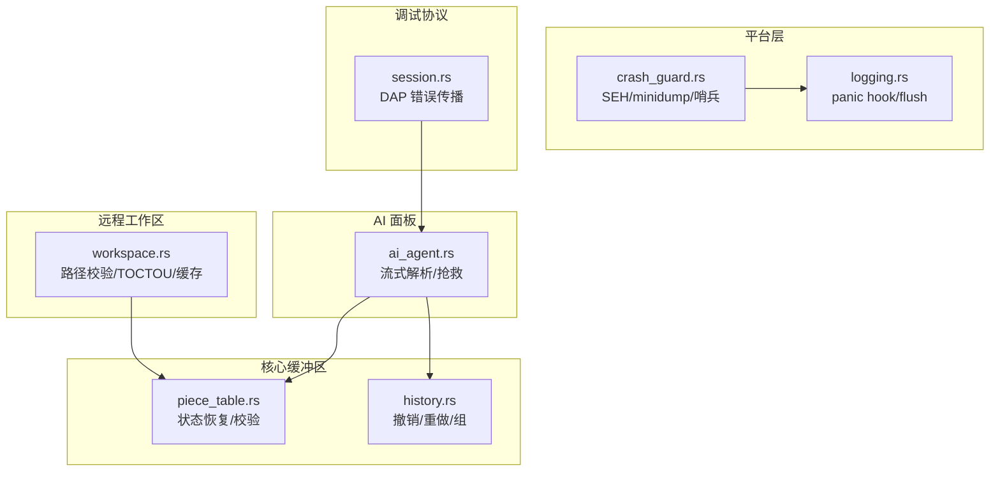
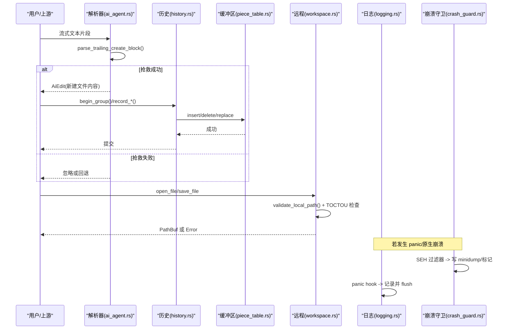
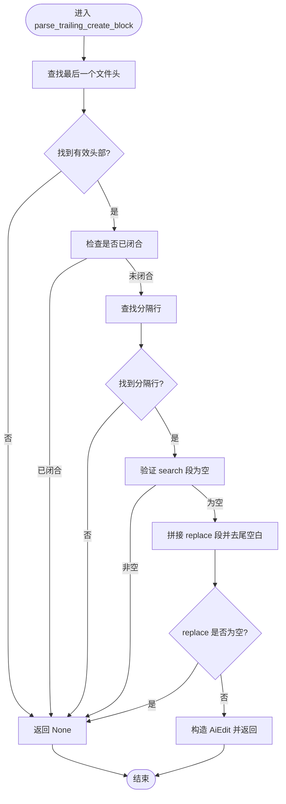
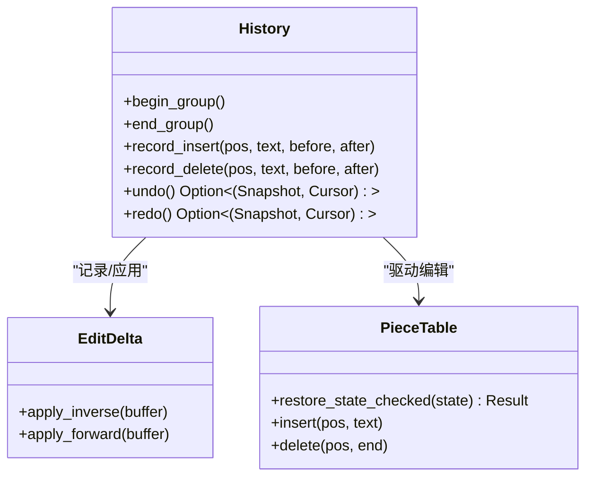
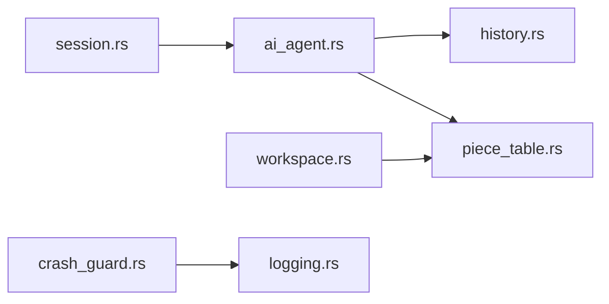

# 错误处理

<cite>
**本文引用的文件**
- [ai_agent.rs](file://crates/aether-ai-panel/src/ai_agent.rs)
- [piece_table.rs](file://crates/aether-core/src/buffer/piece_table.rs)
- [history.rs](file://crates/aether-core/src/buffer/history.rs)
- [workspace.rs](file://crates/aether-remote/src/workspace.rs)
- [logging.rs (UI)](file://crates/aether-ui/src/logging.rs)
- [logging.rs (Win32)](file://crates/aether-win32/src/logging.rs)
- [crash_guard.rs (UI)](file://crates/aether-ui/src/crash_guard.rs)
- [crash_guard.rs (Win32)](file://crates/aether-win32/src/crash_guard.rs)
- [session.rs (DAP)](file://crates/aether-dap/src/session.rs)
</cite>

## 目录
1. [简介](#简介)
2. [项目结构](#项目结构)
3. [核心组件](#核心组件)
4. [架构总览](#架构总览)
5. [详细组件分析](#详细组件分析)
6. [依赖关系分析](#依赖关系分析)
7. [性能考量](#性能考量)
8. [故障排查指南](#故障排查指南)
9. [结论](#结论)
10. [附录](#附录)

## 简介
本文件系统性梳理编辑器在“流式中断抢救、解析失败策略、错误恢复流程、异常分类与处理、诊断与调试工具”等方面的错误处理机制。重点覆盖：
- 流式中断时未闭合文件块的抢救（parse_trailing_create_block）
- 解析失败的部分解析与回退策略，以及数据完整性保证
- 状态回滚、撤销/重做与事务一致性维护
- 网络、文件操作、协议解析三类异常的分类与处理
- 日志、崩溃捕获、minidump 等诊断手段与问题定位技巧
- 常见错误解决方案与预防措施

## 项目结构
错误处理相关能力分布在多个 crate 中：
- AI 面板层：AI 回复的增量解析与流式中断抢救
- 核心缓冲区：PieceTable 持久化状态校验与恢复、历史撤销/重做
- 远程工作区：路径安全校验、TOCTOU 防护、缓存清理
- 平台层：崩溃守卫（SEH 过滤器 + minidump + 会话哨兵）、panic 钩子与日志落盘
- DAP 调试会话：协议响应错误传播

图表来源
- [ai_agent.rs:420-464](file://crates/aether-ai-panel/src/ai_agent.rs#L420-L464)
- [piece_table.rs:1662-1831](file://crates/aether-core/src/buffer/piece_table.rs#L1662-L1831)
- [history.rs:1-200](file://crates/aether-core/src/buffer/history.rs#L1-L200)
- [workspace.rs:28-100](file://crates/aether-remote/src/workspace.rs#L28-L100)
- [crash_guard.rs (UI):35-84](file://crates/aether-ui/src/crash_guard.rs#L35-L84)
- [logging.rs (UI):103-124](file://crates/aether-ui/src/logging.rs#L103-L124)
- [session.rs (DAP):545-583](file://crates/aether-dap/src/session.rs#L545-L583)

章节来源
- [ai_agent.rs:420-464](file://crates/aether-ai-panel/src/ai_agent.rs#L420-L464)
- [piece_table.rs:1662-1831](file://crates/aether-core/src/buffer/piece_table.rs#L1662-L1831)
- [history.rs:1-200](file://crates/aether-core/src/buffer/history.rs#L1-L200)
- [workspace.rs:28-100](file://crates/aether-remote/src/workspace.rs#L28-L100)
- [crash_guard.rs (UI):35-84](file://crates/aether-ui/src/crash_guard.rs#L35-L84)
- [logging.rs (UI):103-124](file://crates/aether-ui/src/logging.rs#L103-L124)
- [session.rs (DAP):545-583](file://crates/aether-dap/src/session.rs#L545-L583)

## 核心组件
- 流式中断抢救：对未闭合的尾部 FILE 块进行“新建文件”语义的抢救，避免破坏现有文件。
- 状态恢复与校验：反序列化 PieceTable 状态前进行严格边界检查，任何损坏即放弃恢复，保持当前稳定状态。
- 撤销/重做与组：基于差分的撤销/重做，支持分组批量操作，确保一致性与可回滚性。
- 远程路径安全：防止路径遍历与 TOCTOU 攻击，写入前后双重规范路径校验。
- 崩溃观测：SEH 未处理异常过滤、minidump 生成、会话哨兵检测上次异常退出。
- 日志与 panic 钩子：记录 panic 信息并强制 flush，关键操作后落盘。
- 调试协议错误：DAP 请求失败统一转为 io::Error，便于上层处理。

章节来源
- [ai_agent.rs:420-464](file://crates/aether-ai-panel/src/ai_agent.rs#L420-L464)
- [piece_table.rs:1662-1831](file://crates/aether-core/src/buffer/piece_table.rs#L1662-L1831)
- [history.rs:1-200](file://crates/aether-core/src/buffer/history.rs#L1-L200)
- [workspace.rs:28-100](file://crates/aether-remote/src/workspace.rs#L28-L100)
- [crash_guard.rs (UI):35-84](file://crates/aether-ui/src/crash_guard.rs#L35-L84)
- [logging.rs (UI):103-124](file://crates/aether-ui/src/logging.rs#L103-L124)
- [session.rs (DAP):545-583](file://crates/aether-dap/src/session.rs#L545-L583)

## 架构总览
错误处理贯穿“输入解析—状态变更—持久化—外部交互—崩溃兜底”全链路：
- 解析阶段：AI 回复增量解析，遇到中断则尝试抢救；协议层将失败转为标准错误。
- 状态阶段：持久化状态恢复前严格校验，失败则回退到旧状态；编辑通过 History 差分记录，支持撤销/重做。
- I/O 阶段：远程文件读写前进行路径安全校验，写入后进行二次校验，防止越界与符号链接劫持。
- 崩溃阶段：SEH 捕获原生异常，写 minidump 与标记；启动时检测上次会话是否异常终止。
- 日志阶段：panic 钩子记录上下文，关键路径 flush 日志，保障可观测性。

图表来源
- [ai_agent.rs:420-464](file://crates/aether-ai-panel/src/ai_agent.rs#L420-L464)
- [history.rs:124-200](file://crates/aether-core/src/buffer/history.rs#L124-L200)
- [piece_table.rs:1662-1831](file://crates/aether-core/src/buffer/piece_table.rs#L1662-L1831)
- [workspace.rs:58-100](file://crates/aether-remote/src/workspace.rs#L58-L100)
- [logging.rs (UI):103-124](file://crates/aether-ui/src/logging.rs#L103-L124)
- [crash_guard.rs (UI):35-84](file://crates/aether-ui/src/crash_guard.rs#L35-L84)

## 详细组件分析

### 流式中断抢救：parse_trailing_create_block
- 目标：当流式响应被中断且缺少结束标记时，尽可能抢救“新建文件”的尾部块。
- 策略：
  - 仅当尾部块为“新建文件”（分隔符前的 search 段为空）且有实际内容时才抢救。
  - 已闭合的块由常规解析处理，不在抢救范围。
  - 修改/删除类块不抢救，避免截断内容对现有文件造成破坏。
- 输出：返回 AiEdit，包含目标路径与待插入内容。

图表来源
- [ai_agent.rs:420-464](file://crates/aether-ai-panel/src/ai_agent.rs#L420-L464)

章节来源
- [ai_agent.rs:420-464](file://crates/aether-ai-panel/src/ai_agent.rs#L420-L464)

### 解析失败的处理策略：部分解析、回退与一致性
- 部分解析：AI 回复按块解析（FILE/RUN/PLAN），跳过无效或无法解析的块，继续处理后续内容。
- 回退机制：
  - 若抢救失败或解析不完整，调用方选择忽略该块或回退到上一稳定状态。
  - 对于修改/删除类块，在未闭合情况下不进行应用，避免破坏现有文件。
- 一致性保证：
  - 所有编辑通过 History 记录差分，支持撤销/重做与分组，确保原子性。
  - 持久化状态恢复前进行严格校验，失败则放弃恢复，保持当前状态不变。

章节来源
- [ai_agent.rs:466-599](file://crates/aether-ai-panel/src/ai_agent.rs#L466-L599)
- [history.rs:1-200](file://crates/aether-core/src/buffer/history.rs#L1-L200)
- [piece_table.rs:1662-1831](file://crates/aether-core/src/buffer/piece_table.rs#L1662-L1831)

### 错误恢复流程：状态回滚、事务管理与一致性
- 状态回滚：
  - PieceTable 恢复前执行 restore_state_checked，任何字段越界/损坏均返回错误，调用方保留旧状态。
- 事务管理：
  - History 提供 begin_group/end_group 将多次编辑合并为一个撤销步骤，提升一致性。
  - 撤销/重做通过 EditDelta 的逆/正操作实现，保证缓冲区状态可逆。
- 一致性维护：
  - 远程文件写入前后进行规范路径校验，防止 TOCTOU 攻击。
  - 缓存大小超限自动清理，避免资源耗尽导致的不一致。

图表来源
- [history.rs:1-200](file://crates/aether-core/src/buffer/history.rs#L1-L200)
- [piece_table.rs:1662-1831](file://crates/aether-core/src/buffer/piece_table.rs#L1662-L1831)

章节来源
- [history.rs:1-200](file://crates/aether-core/src/buffer/history.rs#L1-L200)
- [piece_table.rs:1662-1831](file://crates/aether-core/src/buffer/piece_table.rs#L1662-L1831)

### 异常情况分类与处理
- 网络错误：
  - DAP 会话中，请求失败统一转为 io::Error，便于上层捕获与重试。
- 文件操作错误：
  - 远程工作区打开/保存文件时进行路径合法性检查，写入后再次校验，防止越界与符号链接劫持。
  - 缓存大小超限触发清理，避免磁盘占用过高。
- 协议解析错误：
  - AI 回复解析失败时跳过无效块，尝试抢救新建文件块；修改/删除类块未闭合时不应用。

章节来源
- [session.rs (DAP):545-583](file://crates/aether-dap/src/session.rs#L545-L583)
- [workspace.rs:58-100](file://crates/aether-remote/src/workspace.rs#L58-L100)
- [ai_agent.rs:420-464](file://crates/aether-ai-panel/src/ai_agent.rs#L420-L464)

### 错误诊断工具与方法
- 日志记录：
  - panic 钩子记录 panic 负载与位置，并强制 flush 日志，确保关键信息落地。
- 崩溃捕获：
  - 安装 SEH 未处理异常过滤器，捕获原生崩溃，写 minidump 与文本标记。
  - 会话哨兵检测上次会话是否异常终止，并在日志中报告。
- 调试信息：
  - 使用 minidump 配合构建产物分析调用栈，定位崩溃点。
  - 通过日志中的 previous_session 与 crash_marker 快速关联问题。

章节来源
- [logging.rs (UI):103-124](file://crates/aether-ui/src/logging.rs#L103-L124)
- [crash_guard.rs (UI):35-84](file://crates/aether-ui/src/crash_guard.rs#L35-L84)
- [crash_guard.rs (Win32):35-84](file://crates/aether-win32/src/crash_guard.rs#L35-L84)

### 常见错误解决方案与预防措施
- 流式中断导致的内容丢失：
  - 启用 parse_trailing_create_block 抢救新建文件块；对修改/删除类块保持保守策略。
- 持久化状态损坏：
  - 恢复前严格校验，失败则放弃恢复，避免污染当前状态。
- 远程路径越界/符号链接劫持：
  - 写入前后双重规范路径校验，发现越界立即删除并报错。
- 缓存无限增长：
  - 超过阈值自动清理最旧文件，保持可用空间。
- 原生崩溃不可观测：
  - 安装崩溃守卫，生成 minidump 与标记，下次启动时报告上次异常。

章节来源
- [ai_agent.rs:420-464](file://crates/aether-ai-panel/src/ai_agent.rs#L420-L464)
- [piece_table.rs:1662-1831](file://crates/aether-core/src/buffer/piece_table.rs#L1662-L1831)
- [workspace.rs:58-100](file://crates/aether-remote/src/workspace.rs#L58-L100)
- [crash_guard.rs (UI):35-84](file://crates/aether-ui/src/crash_guard.rs#L35-L84)

## 依赖关系分析
- ai_agent.rs 依赖 history.rs 与 piece_table.rs 完成编辑与状态管理。
- workspace.rs 依赖文件系统与 RemoteFs 抽象，确保路径安全与缓存管理。
- crash_guard.rs 与 logging.rs 协同提供崩溃观测与日志落盘。
- session.rs 将协议层错误标准化，便于上层统一处理。

图表来源
- [ai_agent.rs:420-464](file://crates/aether-ai-panel/src/ai_agent.rs#L420-L464)
- [history.rs:1-200](file://crates/aether-core/src/buffer/history.rs#L1-L200)
- [piece_table.rs:1662-1831](file://crates/aether-core/src/buffer/piece_table.rs#L1662-L1831)
- [workspace.rs:58-100](file://crates/aether-remote/src/workspace.rs#L58-L100)
- [crash_guard.rs (UI):35-84](file://crates/aether-ui/src/crash_guard.rs#L35-L84)
- [logging.rs (UI):103-124](file://crates/aether-ui/src/logging.rs#L103-L124)
- [session.rs (DAP):545-583](file://crates/aether-dap/src/session.rs#L545-L583)

章节来源
- [ai_agent.rs:420-464](file://crates/aether-ai-panel/src/ai_agent.rs#L420-L464)
- [history.rs:1-200](file://crates/aether-core/src/buffer/history.rs#L1-L200)
- [piece_table.rs:1662-1831](file://crates/aether-core/src/buffer/piece_table.rs#L1662-L1831)
- [workspace.rs:58-100](file://crates/aether-remote/src/workspace.rs#L58-L100)
- [crash_guard.rs (UI):35-84](file://crates/aether-ui/src/crash_guard.rs#L35-L84)
- [logging.rs (UI):103-124](file://crates/aether-ui/src/logging.rs#L103-L124)
- [session.rs (DAP):545-583](file://crates/aether-dap/src/session.rs#L545-L583)

## 性能考量
- 撤销/重做采用差分记录，避免整表快照，降低内存与时间开销。
- 连续输入合并窗口减少历史记录膨胀，提升撤销效率。
- PieceTable 状态恢复前校验，避免昂贵且可能失败的恢复过程。
- 远程缓存清理策略按需触发，避免频繁 IO。

[本节为通用指导，无需特定文件来源]

## 故障排查指南
- 流式中断导致内容缺失：
  - 检查是否命中 parse_trailing_create_block 抢救逻辑；确认是否为新建文件块。
- 持久化状态损坏：
  - 查看 restore_state_checked 的错误信息，定位具体字段越界原因。
- 远程文件写入失败：
  - 检查 validate_local_path 与 TOCTOU 校验日志，确认路径是否越界。
- 原生崩溃无日志：
  - 检查崩溃守卫是否安装，查看 %TEMP%/Aether/crashes 下的 minidump 与标记文件。
- 协议请求失败：
  - 查看 DAP 会话错误类型，确认服务端响应 success=false 时的 message。

章节来源
- [ai_agent.rs:420-464](file://crates/aether-ai-panel/src/ai_agent.rs#L420-L464)
- [piece_table.rs:1662-1831](file://crates/aether-core/src/buffer/piece_table.rs#L1662-L1831)
- [workspace.rs:58-100](file://crates/aether-remote/src/workspace.rs#L58-L100)
- [crash_guard.rs (UI):35-84](file://crates/aether-ui/src/crash_guard.rs#L35-L84)
- [session.rs (DAP):545-583](file://crates/aether-dap/src/session.rs#L545-L583)

## 结论
本项目构建了从解析、状态管理、I/O 到崩溃观测的全链路错误处理体系：
- 流式中断抢救优先保护新建文件内容，避免破坏现有文件。
- 状态恢复严格校验，失败即回退，确保数据一致性。
- 远程文件操作强化路径安全与 TOCTOU 防护，结合缓存清理保障稳定性。
- 崩溃守卫与日志系统提供强大的可观测性，辅助快速定位问题。
- 通过差分撤销/重做与分组事务，提升用户体验与系统可靠性。

[本节为总结，无需特定文件来源]

## 附录
- 建议实践：
  - 在所有关键路径后调用日志 flush，确保信息落地。
  - 对 AI 回复解析增加超时与最大块数限制，防止资源滥用。
  - 定期清理 crashes 目录，避免磁盘占满。
  - 对远程路径输入进行白名单校验，进一步降低安全风险。

[本节为补充建议，无需特定文件来源]