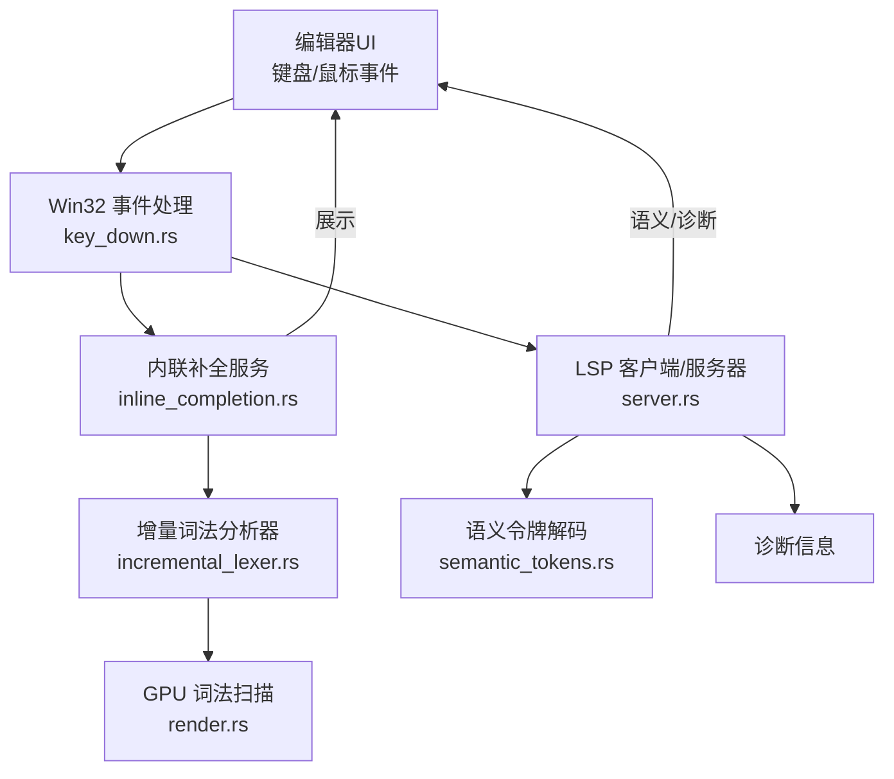
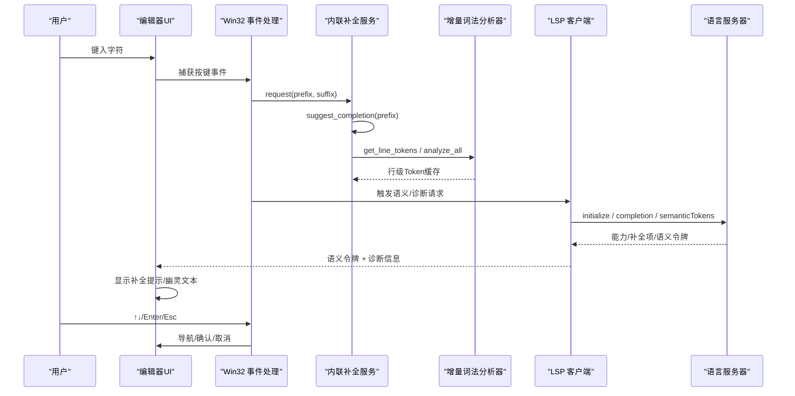
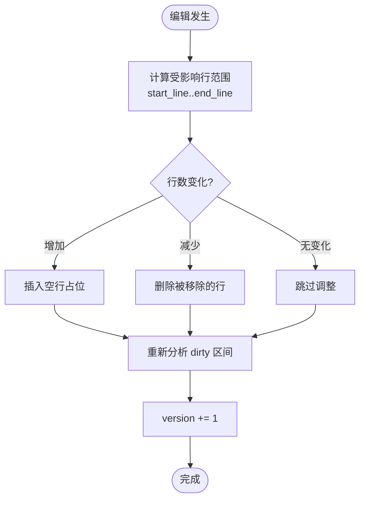
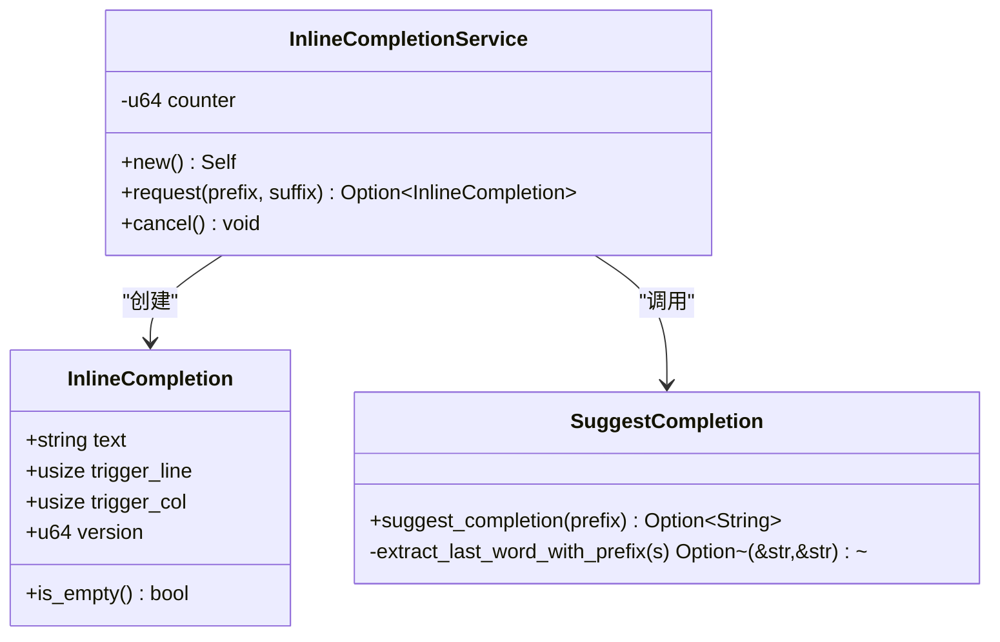
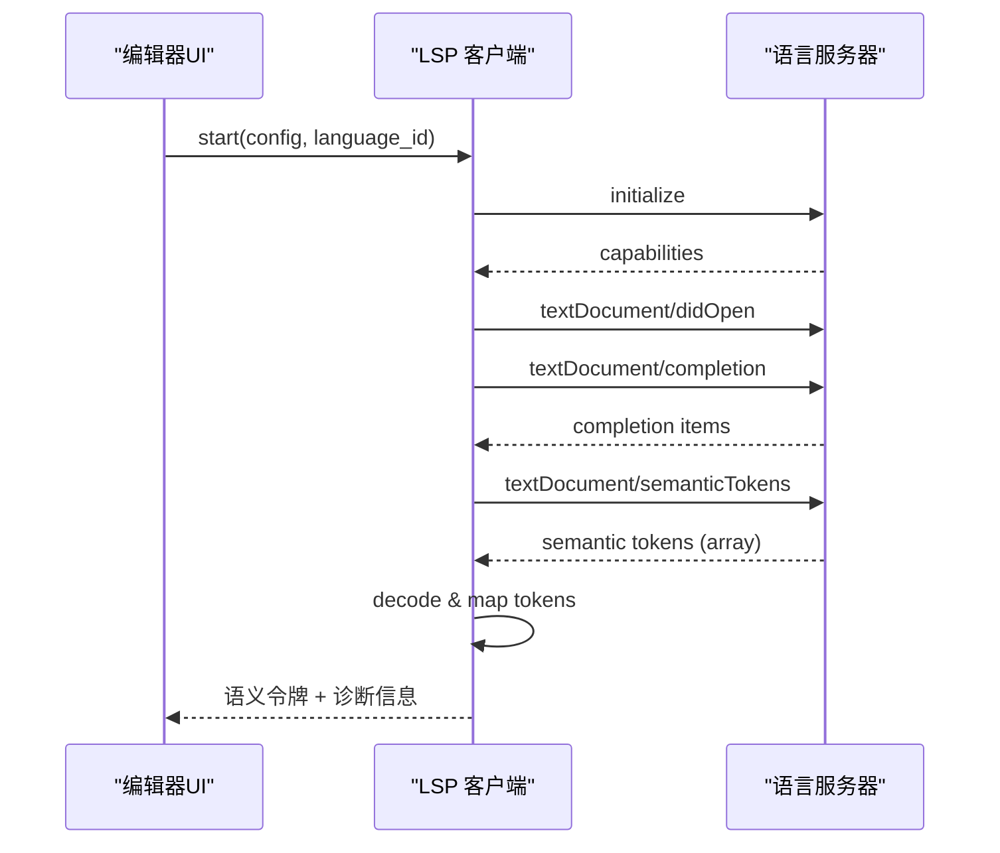
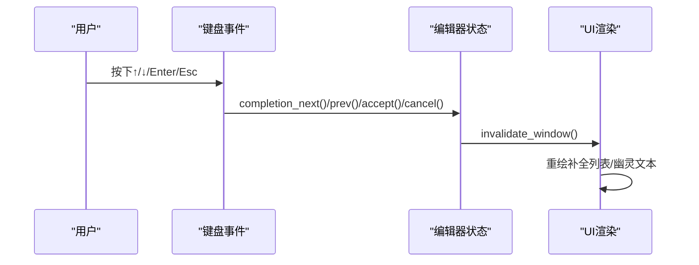
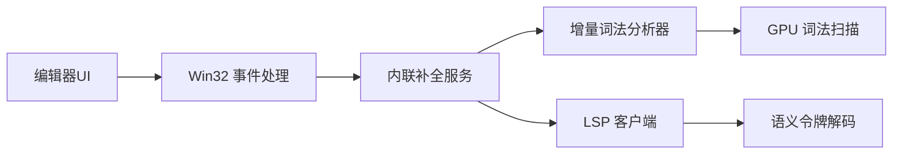

# 代码补全

<cite>
**本文引用的文件**
- [aether-core/src/incremental_lexer.rs](file://crates/aether-core/src/incremental_lexer.rs)
- [aether-editor/src/inline_completion.rs](file://crates/aether-editor/src/inline_completion.rs)
- [aether-win32/src/inline_completion.rs](file://crates/aether-win32/src/inline_completion.rs)
- [aether-lsp/src/server.rs](file://crates/aether-lsp/src/server.rs)
- [aether-lsp/src/semantic_tokens.rs](file://crates/aether-lsp/src/semantic_tokens.rs)
- [aether-win32/src/window/keyboard_handler/key_down.rs](file://crates/aether-win32/src/window/keyboard_handler/key_down.rs)
- [aether-render/src/gpu/render.rs](file://crates/aether-render/src/gpu/render.rs)
- [aether-core/src/benchmarks.rs](file://crates/aether-core/src/benchmarks.rs)
</cite>

## 目录
1. [简介](#简介)
2. [项目结构](#项目结构)
3. [核心组件](#核心组件)
4. [架构总览](#架构总览)
5. [详细组件分析](#详细组件分析)
6. [依赖关系分析](#依赖关系分析)
7. [性能考量](#性能考量)
8. [故障排查指南](#故障排查指南)
9. [结论](#结论)
10. [附录](#附录)

## 简介
本文件面向“智能代码补全”的完整实现与使用，覆盖上下文感知、语法分析与语义理解；深入说明增量词法分析在实时解析与错误恢复中的作用；文档化补全候选生成算法（相似度匹配、优先级排序、去重策略）；解释 UI 交互设计（提示显示、键盘导航、选择确认）；提供性能优化方案（异步加载、结果缓存、带宽优化）；说明与 LSP 集成方式（语义令牌使用、诊断信息融合）；并给出自定义补全规则与扩展开发指南。

## 项目结构
本项目将代码补全能力拆分为多个 crate：
- aether-core：增量词法分析器与语言无关的词法基础设施，为补全提供快速、可缓存的 Token 流。
- aether-editor：内联补全服务（幽灵文本），基于前缀模式匹配返回建议片段。
- aether-win32：Windows 平台上的 UI 事件处理与补全弹窗可见性控制、键盘导航。
- aether-lsp：LSP 客户端与服务端通信、语义令牌解码与能力协商。
- aether-render：GPU 加速的词法扫描与渲染，辅助高吞吐场景下的 Token 生成。

图表来源
- [aether-win32/src/window/keyboard_handler/key_down.rs:578-631](file://crates/aether-win32/src/window/keyboard_handler/key_down.rs#L578-L631)
- [aether-editor/src/inline_completion.rs:1-120](file://crates/aether-editor/src/inline_completion.rs#L1-L120)
- [aether-core/src/incremental_lexer.rs:1-130](file://crates/aether-core/src/incremental_lexer.rs#L1-L130)
- [aether-render/src/gpu/render.rs:1-41](file://crates/aether-render/src/gpu/render.rs#L1-L41)
- [aether-lsp/src/server.rs:1-125](file://crates/aether-lsp/src/server.rs#L1-L125)
- [aether-lsp/src/semantic_tokens.rs:1-50](file://crates/aether-lsp/src/semantic_tokens.rs#L1-L50)

章节来源
- [aether-core/src/incremental_lexer.rs:1-130](file://crates/aether-core/src/incremental_lexer.rs#L1-L130)
- [aether-editor/src/inline_completion.rs:1-120](file://crates/aether-editor/src/inline_completion.rs#L1-L120)
- [aether-win32/src/window/keyboard_handler/key_down.rs:578-631](file://crates/aether-win32/src/window/keyboard_handler/key_down.rs#L578-L631)
- [aether-lsp/src/server.rs:1-125](file://crates/aether-lsp/src/server.rs#L1-L125)
- [aether-lsp/src/semantic_tokens.rs:1-50](file://crates/aether-lsp/src/semantic_tokens.rs#L1-L50)
- [aether-render/src/gpu/render.rs:1-41](file://crates/aether-render/src/gpu/render.rs#L1-L41)

## 核心组件
- 增量词法分析器：按行缓存 Token，编辑后仅重新分析受影响行，支持版本失效检测与多文件管理。
- 内联补全服务：基于前缀的模式匹配，返回常见代码片段（如函数、结构体、循环等）。
- LSP 集成：启动/初始化语言服务器，请求/响应模型，语义令牌解码与能力协商。
- UI 交互：补全弹窗可见性、键盘导航（上/下/回车/Esc）、选择确认与取消。
- GPU 加速：通过 GPU 计算着色器进行 Token 扫描，提升大规模文件的解析性能。

章节来源
- [aether-core/src/incremental_lexer.rs:1-130](file://crates/aether-core/src/incremental_lexer.rs#L1-L130)
- [aether-editor/src/inline_completion.rs:1-120](file://crates/aether-editor/src/inline_completion.rs#L1-L120)
- [aether-lsp/src/server.rs:1-125](file://crates/aether-lsp/src/server.rs#L1-L125)
- [aether-win32/src/window/keyboard_handler/key_down.rs:578-631](file://crates/aether-win32/src/window/keyboard_handler/key_down.rs#L578-L631)
- [aether-render/src/gpu/render.rs:1-41](file://crates/aether-render/src/gpu/render.rs#L1-L41)

## 架构总览
下图展示了从用户输入到补全展示的端到端流程，包括增量词法分析、内联补全、LSP 语义令牌与诊断信息的融合。

图表来源
- [aether-editor/src/inline_completion.rs:47-120](file://crates/aether-editor/src/inline_completion.rs#L47-L120)
- [aether-core/src/incremental_lexer.rs:28-101](file://crates/aether-core/src/incremental_lexer.rs#L28-L101)
- [aether-lsp/src/server.rs:63-125](file://crates/aether-lsp/src/server.rs#L63-L125)
- [aether-win32/src/window/keyboard_handler/key_down.rs:578-631](file://crates/aether-win32/src/window/keyboard_handler/key_down.rs#L578-L631)

## 详细组件分析

### 增量词法分析器（实时语法解析与错误恢复）
- 行级缓存：每行 Token 以 Vec 存储，行号即索引，O(1) 访问。
- 增量更新：根据 EditResult 确定受影响行范围，仅对 dirty 区间重新 lex，避免全量重建。
- 版本失效：每次编辑递增 version，供上层判断缓存是否有效。
- 多文件管理：IncrementalLexerManager 维护多个文件的 lexer，限制最大缓存数量，防止内存无界增长。
- 错误恢复：当行内容不完整或存在语法错误时，lex_full 仍会产出尽可能多的合法 Token，保证 UI 不崩溃且能继续工作。

图表来源
- [aether-core/src/incremental_lexer.rs:36-101](file://crates/aether-core/src/incremental_lexer.rs#L36-L101)

章节来源
- [aether-core/src/incremental_lexer.rs:1-130](file://crates/aether-core/src/incremental_lexer.rs#L1-L130)

### 内联补全服务（上下文感知与模式匹配）
- 上下文提取：从光标前缀中抽取末尾“单词”，区分行首与非行首场景，用于决定补全模板。
- 模式匹配：针对常见关键字（fn/if/for/while/match/struct/enum/impl/trait/use/mod/const/static/return 等）返回对应代码片段。
- 版本控制：每次请求递增版本号，便于 UI 丢弃旧建议。
- 可扩展性：当前为本地模式匹配，后续可接入 aether-ai 或 LSP 补全项。

图表来源
- [aether-editor/src/inline_completion.rs:1-120](file://crates/aether-editor/src/inline_completion.rs#L1-L120)

章节来源
- [aether-editor/src/inline_completion.rs:1-120](file://crates/aether-editor/src/inline_completion.rs#L1-L120)
- [aether-win32/src/inline_completion.rs:39-120](file://crates/aether-win32/src/inline_completion.rs#L39-L120)

### LSP 集成（语义令牌与诊断信息融合）
- 生命周期管理：启动语言服务器进程，后台 reader task 持续读取 stdout，主线程发送请求并通过 oneshot channel 接收响应。
- 能力协商：声明支持的 CompletionItemKind 集合，确保 UI 正确渲染不同类别的补全项。
- 语义令牌：解码 LSP 返回的紧凑数组为结构化 SemanticToken，并映射为渲染可用的类型与修饰符。
- 诊断信息：收集并发布诊断，UI 层可按严重级别排序与过滤。

图表来源
- [aether-lsp/src/server.rs:63-125](file://crates/aether-lsp/src/server.rs#L63-L125)
- [aether-lsp/src/semantic_tokens.rs:17-50](file://crates/aether-lsp/src/semantic_tokens.rs#L17-L50)

章节来源
- [aether-lsp/src/server.rs:1-200](file://crates/aether-lsp/src/server.rs#L1-L200)
- [aether-lsp/src/semantic_tokens.rs:1-508](file://crates/aether-lsp/src/semantic_tokens.rs#L1-L508)

### UI 交互设计（提示显示、键盘导航、选择确认）
- 补全弹窗可见性：通过状态标志 completion_visible 控制显示/隐藏。
- 键盘导航：↑/↓ 切换候选项，Enter 接受补全，Esc 取消。
- 选择确认：completion_accept 将选中项应用到编辑器。
- 渲染位置：IME/候选窗口位置根据光标几何动态计算，确保提示紧贴输入位置。

图表来源
- [aether-win32/src/window/keyboard_handler/key_down.rs:578-631](file://crates/aether-win32/src/window/keyboard_handler/key_down.rs#L578-L631)

章节来源
- [aether-win32/src/window/keyboard_handler/key_down.rs:578-631](file://crates/aether-win32/src/window/keyboard_handler/key_down.rs#L578-L631)

### 补全候选生成算法（相似度、优先级、去重）
- 相似度匹配：基于前缀末尾单词与已知关键字的精确匹配；未来可扩展为模糊匹配与语义相似度。
- 优先级排序：当前按关键字模板顺序返回；结合 LSP 补全项时可依据 sortText/fillInText 排序。
- 去重策略：同一前缀多次请求通过版本控制避免重复展示；AI 侧可使用 RRF 融合与去重计数（参考 AI 面板中的相关逻辑）。

章节来源
- [aether-editor/src/inline_completion.rs:69-120](file://crates/aether-editor/src/inline_completion.rs#L69-L120)
- [aether-lsp/src/server.rs:362-384](file://crates/aether-lsp/src/server.rs#L362-L384)

### 与 LSP 集成的方式（语义令牌使用、诊断信息融合）
- 语义令牌：解码 LSP 语义令牌数组为结构化数据，映射为类型与修饰符，用于高亮与补全增强。
- 诊断信息：合并来自 LSP 的诊断，按严重级别排序，优先显示当前文件问题。
- 能力协商：声明支持的 CompletionItemKind，确保 UI 正确渲染不同类别的补全项。

章节来源
- [aether-lsp/src/semantic_tokens.rs:17-50](file://crates/aether-lsp/src/semantic_tokens.rs#L17-L50)
- [aether-win32/src/editor/ai.rs:569-595](file://crates/aether-win32/src/editor/ai.rs#L569-L595)
- [aether-lsp/src/server.rs:362-384](file://crates/aether-lsp/src/server.rs#L362-L384)

### 自定义补全规则与扩展开发指南
- 扩展点：
  - 在 suggest_completion 中添加新的关键字与模板，实现语言特定的补全。
  - 接入 LSP 补全项，结合语义令牌与诊断信息进行增强。
  - 在增量词法分析器中扩展语言支持，新增 Language::create_lexer 的实现。
- 最佳实践：
  - 保持前缀提取与匹配的高效性，避免大字符串频繁拷贝。
  - 使用版本控制与缓存失效机制，确保 UI 始终展示最新建议。
  - 对 LSP 请求设置超时与重试，避免阻塞主线程。

章节来源
- [aether-editor/src/inline_completion.rs:69-120](file://crates/aether-editor/src/inline_completion.rs#L69-L120)
- [aether-core/src/incremental_lexer.rs:18-35](file://crates/aether-core/src/incremental_lexer.rs#L18-L35)
- [aether-lsp/src/server.rs:140-200](file://crates/aether-lsp/src/server.rs#L140-L200)

## 依赖关系分析
- 内联补全服务依赖增量词法分析器获取上下文 Token。
- LSP 客户端负责与语言服务器通信，提供语义令牌与诊断信息。
- UI 层通过 Win32 事件处理协调键盘导航与补全展示。
- GPU 渲染模块提供高性能 Token 扫描，辅助大规模文件解析。

图表来源
- [aether-editor/src/inline_completion.rs:47-120](file://crates/aether-editor/src/inline_completion.rs#L47-L120)
- [aether-core/src/incremental_lexer.rs:28-101](file://crates/aether-core/src/incremental_lexer.rs#L28-L101)
- [aether-lsp/src/semantic_tokens.rs:17-50](file://crates/aether-lsp/src/semantic_tokens.rs#L17-L50)
- [aether-win32/src/window/keyboard_handler/key_down.rs:578-631](file://crates/aether-win32/src/window/keyboard_handler/key_down.rs#L578-L631)
- [aether-render/src/gpu/render.rs:1-41](file://crates/aether-render/src/gpu/render.rs#L1-L41)

章节来源
- [aether-editor/src/inline_completion.rs:47-120](file://crates/aether-editor/src/inline_completion.rs#L47-L120)
- [aether-core/src/incremental_lexer.rs:28-101](file://crates/aether-core/src/incremental_lexer.rs#L28-L101)
- [aether-lsp/src/semantic_tokens.rs:17-50](file://crates/aether-lsp/src/semantic_tokens.rs#L17-L50)
- [aether-win32/src/window/keyboard_handler/key_down.rs:578-631](file://crates/aether-win32/src/window/keyboard_handler/key_down.rs#L578-L631)
- [aether-render/src/gpu/render.rs:1-41](file://crates/aether-render/src/gpu/render.rs#L1-L41)

## 性能考量
- 增量词法分析：仅重新分析受影响行，显著降低编辑开销。
- GPU 加速：通过 GPU 计算着色器进行 Token 扫描，适合大规模文件。
- 异步与超时：LSP 请求设置默认超时，避免阻塞主线程。
- 缓存与限流：增量 lexer 管理器限制最大缓存文件数，防止内存无界增长。
- 基准测试：提供增量 vs 全量对比基准，验证性能提升。

章节来源
- [aether-core/src/incremental_lexer.rs:131-187](file://crates/aether-core/src/incremental_lexer.rs#L131-L187)
- [aether-core/src/benchmarks.rs:271-334](file://crates/aether-core/src/benchmarks.rs#L271-L334)
- [aether-lsp/src/server.rs:16-21](file://crates/aether-lsp/src/server.rs#L16-L21)

## 故障排查指南
- 补全不显示：检查 completion_visible 状态与键盘事件是否正确拦截。
- 语义令牌异常：确认 LSP 能力协商与语义令牌解码逻辑。
- 诊断信息缺失：验证 LSP 诊断发布与 UI 层排序逻辑。
- 性能瓶颈：使用基准测试定位增量 vs 全量差异，必要时启用 GPU 加速。

章节来源
- [aether-win32/src/window/keyboard_handler/key_down.rs:578-631](file://crates/aether-win32/src/window/keyboard_handler/key_down.rs#L578-L631)
- [aether-lsp/src/semantic_tokens.rs:17-50](file://crates/aether-lsp/src/semantic_tokens.rs#L17-L50)
- [aether-core/src/benchmarks.rs:271-334](file://crates/aether-core/src/benchmarks.rs#L271-L334)

## 结论
本项目实现了从增量词法分析到内联补全、LSP 语义令牌与诊断信息融合的完整代码补全链路。通过行级缓存、GPU 加速与异步请求，确保了在高负载场景下的流畅体验。未来可进一步扩展相似度匹配、优先级排序与去重策略，并结合 AI 模型提供更智能的补全建议。

## 附录
- 扩展建议：
  - 引入模糊匹配与语义相似度，提升补全准确性。
  - 结合 LSP 补全项与语义令牌，实现更丰富的上下文感知。
  - 优化 UI 交互，提供更直观的导航与确认方式。
- 参考实现：
  - 增量词法分析器：[incremental_lexer.rs](file://crates/aether-core/src/incremental_lexer.rs)
  - 内联补全服务：[inline_completion.rs](file://crates/aether-editor/src/inline_completion.rs)
  - LSP 集成：[server.rs](file://crates/aether-lsp/src/server.rs), [semantic_tokens.rs](file://crates/aether-lsp/src/semantic_tokens.rs)
  - UI 交互：[key_down.rs](file://crates/aether-win32/src/window/keyboard_handler/key_down.rs)
  - GPU 加速：[render.rs](file://crates/aether-render/src/gpu/render.rs)