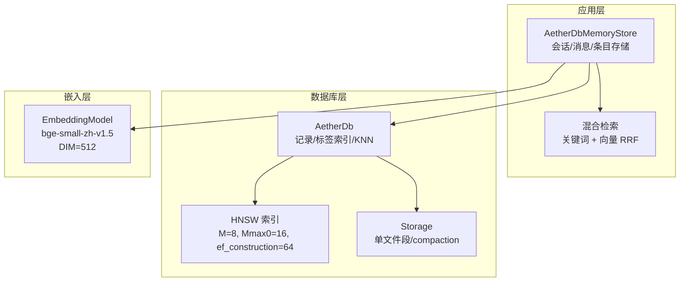
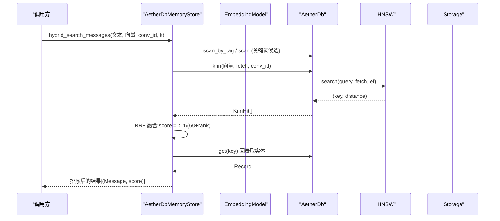
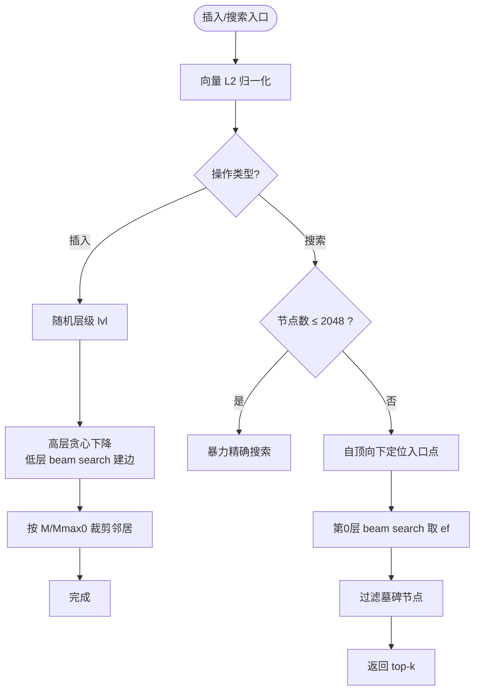
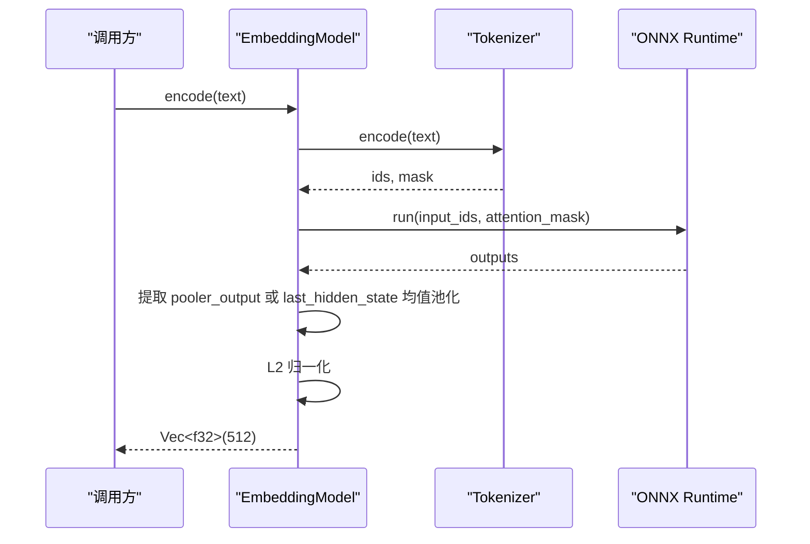
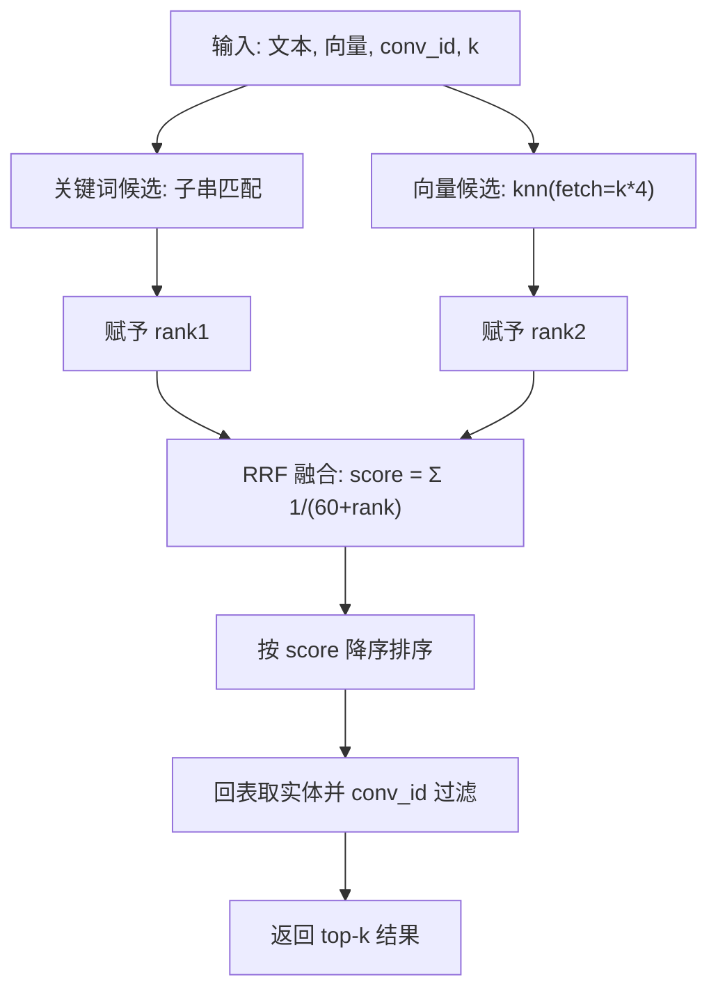
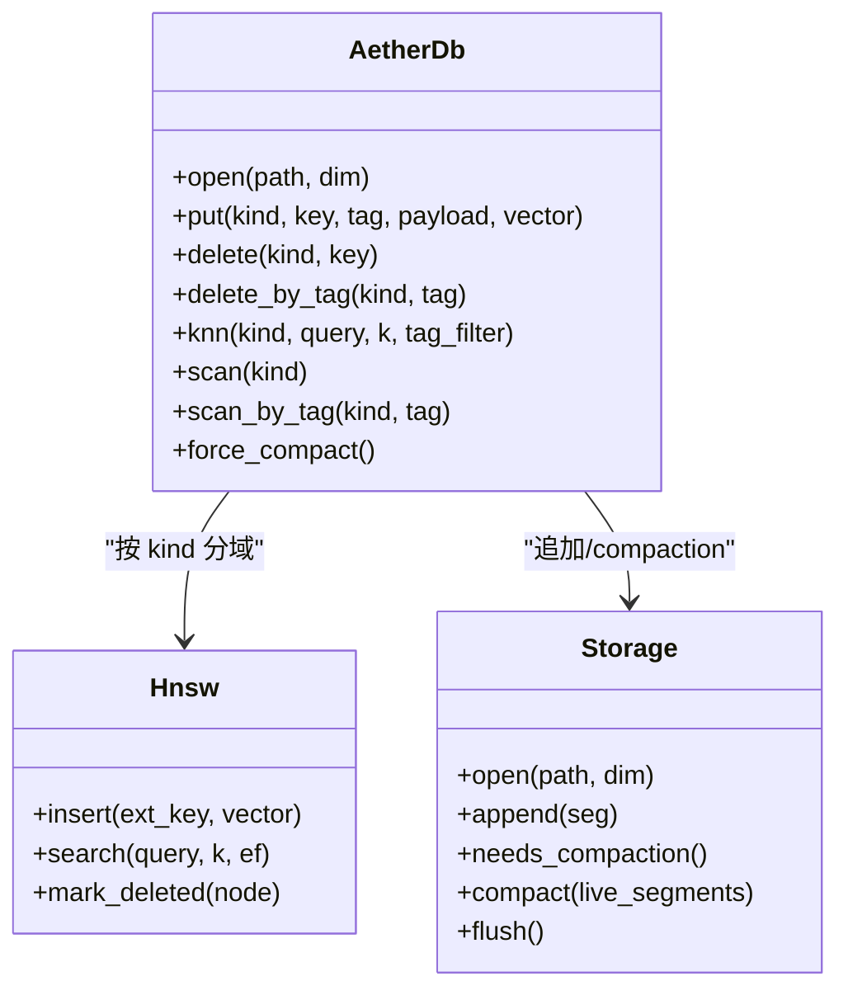
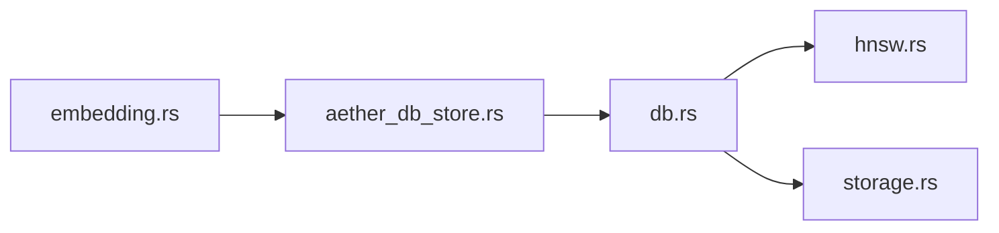

# 向量检索系统

<cite>
**本文引用的文件**
- [hnsw.rs](file://crates/aether-db/src/hnsw.rs)
- [db.rs](file://crates/aether-db/src/db.rs)
- [storage.rs](file://crates/aether-db/src/storage.rs)
- [embedding.rs](file://crates/aether-ai-panel/src/embedding.rs)
- [aether_db_store.rs](file://crates/aether-ai-panel/src/aether_db_store.rs)
</cite>

## 目录
1. [简介](#简介)
2. [项目结构](#项目结构)
3. [核心组件](#核心组件)
4. [架构总览](#架构总览)
5. [详细组件分析](#详细组件分析)
6. [依赖关系分析](#依赖关系分析)
7. [性能与调优](#性能与调优)
8. [故障排查指南](#故障排查指南)
9. [结论](#结论)

## 简介
本仓库实现了一个面向编辑器的嵌入式向量检索系统，包含：
- HNSW（Hierarchical Navigable Small World）近似最近邻索引，用于高维向量的快速相似度检索。
- 文本到向量的嵌入流程，默认使用 bge-small-zh-v1.5 的 ONNX 模型，维度为 512；未加载模型时回退到 n-gram 哈希向量，保证链路可用。
- 语义搜索与混合检索：支持纯向量检索、关键词子串匹配与 RRF（Reciprocal Rank Fusion）融合排序。
- 单文件存储与增量更新：追加式段写入、墓碑删除、自动 compaction 回收垃圾段，启动时全量扫描重建内存索引。
- 查询加速策略：小规模数据退化暴力精确搜索，HNSW 搜索层 beam search，按规模自适应 ef 参数。

## 项目结构
与向量检索相关的关键模块分布如下：
- aether-db：数据库内核，包含 HNSW 索引、KNN 检索、单文件存储与 compaction。
- aether-ai-panel：记忆存储适配层，封装会话/消息/条目的 upsert、检索、混合检索与剪枝逻辑。
- embedding：ONNX Runtime 嵌入模型管理，提供 bge-small-zh-v1.5 的文本编码与归一化。

图表来源
- [aether_db_store.rs:26-44](file://crates/aether-ai-panel/src/aether_db_store.rs#L26-L44)
- [db.rs:30-45](file://crates/aether-db/src/db.rs#L30-L45)
- [hnsw.rs:32-52](file://crates/aether-db/src/hnsw.rs#L32-L52)
- [storage.rs:175-182](file://crates/aether-db/src/storage.rs#L175-L182)
- [embedding.rs:18-28](file://crates/aether-ai-panel/src/embedding.rs#L18-L28)

章节来源
- [aether_db_store.rs:26-44](file://crates/aether-ai-panel/src/aether_db_store.rs#L26-L44)
- [db.rs:30-45](file://crates/aether-db/src/db.rs#L30-L45)
- [hnsw.rs:32-52](file://crates/aether-db/src/hnsw.rs#L32-L52)
- [storage.rs:175-182](file://crates/aether-db/src/storage.rs#L175-L182)
- [embedding.rs:18-28](file://crates/aether-ai-panel/src/embedding.rs#L18-L28)

## 核心组件
- HNSW 索引：实现余弦距离、L2 归一化、随机层级、beam search 建边与搜索、墓碑删除、小规模暴力优化。
- AetherDb：维护 records、tag_index、按 kind 分域的 HNSW、外部 key 映射；提供 put/delete/knn/scan/compaction。
- Storage：单文件格式、段编解码、CRC 校验、崩溃恢复、垃圾统计与 compaction。
- EmbeddingModel：ONNX 推理、Tokenizer 编码、输出池化或均值池化、L2 归一化；全局单例懒加载与 n-gram 回退。
- AetherDbMemoryStore：上层 API，封装消息/会话/条目的增删改查、语义检索、混合检索（RRF）、剪枝审计。

章节来源
- [hnsw.rs:7-35](file://crates/aether-db/src/hnsw.rs#L7-L35)
- [db.rs:13-45](file://crates/aether-db/src/db.rs#L13-L45)
- [storage.rs:1-16](file://crates/aether-db/src/storage.rs#L1-L16)
- [embedding.rs:18-28](file://crates/aether-ai-panel/src/embedding.rs#L18-L28)
- [aether_db_store.rs:26-44](file://crates/aether-ai-panel/src/aether_db_store.rs#L26-L44)

## 架构总览
整体数据流从“文本 → 向量 → 索引 → 检索”展开：
- 文本通过 EmbeddingModel 编码为 512 维向量并 L2 归一化。
- 向量随记录写入 AetherDb，按 kind 分域插入对应 HNSW 索引。
- 查询时，若集合较小则暴力精确搜索，否则走 HNSW 搜索；可选 tag_filter 过滤。
- 混合检索将关键词候选与向量候选通过 RRF 融合排序，再回表取实体。

图表来源
- [aether_db_store.rs:304-381](file://crates/aether-ai-panel/src/aether_db_store.rs#L304-L381)
- [db.rs:241-300](file://crates/aether-db/src/db.rs#L241-L300)
- [hnsw.rs:224-260](file://crates/aether-db/src/hnsw.rs#L224-L260)

章节来源
- [aether_db_store.rs:304-381](file://crates/aether-ai-panel/src/aether_db_store.rs#L304-L381)
- [db.rs:241-300](file://crates/aether-db/src/db.rs#L241-L300)
- [hnsw.rs:224-260](file://crates/aether-db/src/hnsw.rs#L224-L260)

## 详细组件分析

### HNSW 算法与参数
- 距离度量：对归一化向量计算余弦距离，等价于 1 - 内积。
- 归一化：零向量保持原样，非零向量进行 L2 归一化。
- 层级生成：随机层级公式 floor(-ln(U) * mL)，mL = 1/ln(M)。
- 建边策略：高层贪心下降，低层 beam search 选择至多 ef_construction 个邻居，并按 M/Mmax0 裁剪。
- 搜索策略：小规模（≤2048）退化暴力精确搜索；大规模自顶向下定位入口点，最后在第 0 层以 ef 做 beam search。
- 删除策略：墓碑标记，搜索时跳过；compaction 后由上层重建。

图表来源
- [hnsw.rs:7-35](file://crates/aether-db/src/hnsw.rs#L7-L35)
- [hnsw.rs:88-94](file://crates/aether-db/src/hnsw.rs#L88-L94)
- [hnsw.rs:96-153](file://crates/aether-db/src/hnsw.rs#L96-L153)
- [hnsw.rs:171-215](file://crates/aether-db/src/hnsw.rs#L171-L215)
- [hnsw.rs:224-260](file://crates/aether-db/src/hnsw.rs#L224-L260)

章节来源
- [hnsw.rs:7-35](file://crates/aether-db/src/hnsw.rs#L7-L35)
- [hnsw.rs:88-94](file://crates/aether-db/src/hnsw.rs#L88-L94)
- [hnsw.rs:96-153](file://crates/aether-db/src/hnsw.rs#L96-L153)
- [hnsw.rs:171-215](file://crates/aether-db/src/hnsw.rs#L171-L215)
- [hnsw.rs:224-260](file://crates/aether-db/src/hnsw.rs#L224-L260)

### 文本向量化与 bge-small-zh-v1.5
- 模型路径：默认 %CONFIG%/Aether/models/bge-small-zh-v1.5/，内含 model.onnx 与 tokenizer.json。
- 编码流程：Tokenizer 编码 → 构建 input_ids 与 attention_mask 张量 → ONNX 推理 → 提取 pooler_output 或 last_hidden_state 均值池化 → L2 归一化。
- 维度配置：DIM=512；未初始化模型时回退到 n-gram 哈希向量，仍保持 512 维并归一化，确保检索链路可用。
- 批量编码：encode_batch 顺序调用 encode。

图表来源
- [embedding.rs:43-120](file://crates/aether-ai-panel/src/embedding.rs#L43-L120)
- [embedding.rs:144-185](file://crates/aether-ai-panel/src/embedding.rs#L144-L185)
- [embedding.rs:187-218](file://crates/aether-ai-panel/src/embedding.rs#L187-L218)

章节来源
- [embedding.rs:43-120](file://crates/aether-ai-panel/src/embedding.rs#L43-L120)
- [embedding.rs:144-185](file://crates/aether-ai-panel/src/embedding.rs#L144-L185)
- [embedding.rs:187-218](file://crates/aether-ai-panel/src/embedding.rs#L187-L218)

### 语义搜索与混合检索（RRF）
- 语义搜索：AetherDb::knn 根据 query 向量在指定 kind/tag 下检索 top-k，小集合暴力精确，大集合走 HNSW。
- 混合检索：hybrid_search_messages 同时执行关键词子串匹配与向量检索，采用 RRF 融合：score = Σ 1/(60 + rank)。
- 融合流程：关键词通道按内容出现位置排序赋 rank；向量通道按距离排序；合并分数后回表取实体，最终按分数降序返回。

图表来源
- [aether_db_store.rs:304-381](file://crates/aether-ai-panel/src/aether_db_store.rs#L304-L381)
- [db.rs:241-300](file://crates/aether-db/src/db.rs#L241-L300)

章节来源
- [aether_db_store.rs:304-381](file://crates/aether-ai-panel/src/aether_db_store.rs#L304-L381)
- [db.rs:241-300](file://crates/aether-db/src/db.rs#L241-L300)

### 索引构建、更新与维护
- 构建：打开数据库时全量扫描段序列，折叠覆盖与墓碑，重建内存索引（records、tag_index、HNSW）。
- 增量更新：put 追加段并更新索引；delete 写墓碑段并标记 HNSW 节点删除；delete_by_tag 级联删除。
- 维护：垃圾统计达到阈值触发 compaction，重写存活段并原子替换文件；flush 显式同步点。

图表来源
- [db.rs:47-119](file://crates/aether-db/src/db.rs#L47-L119)
- [db.rs:146-204](file://crates/aether-db/src/db.rs#L146-L204)
- [db.rs:307-332](file://crates/aether-db/src/db.rs#L307-L332)
- [hnsw.rs:171-221](file://crates/aether-db/src/hnsw.rs#L171-L221)
- [storage.rs:184-317](file://crates/aether-db/src/storage.rs#L184-L317)

章节来源
- [db.rs:47-119](file://crates/aether-db/src/db.rs#L47-L119)
- [db.rs:146-204](file://crates/aether-db/src/db.rs#L146-L204)
- [db.rs:307-332](file://crates/aether-db/src/db.rs#L307-L332)
- [hnsw.rs:171-221](file://crates/aether-db/src/hnsw.rs#L171-L221)
- [storage.rs:184-317](file://crates/aether-db/src/storage.rs#L184-L317)

## 依赖关系分析
- aether-ai-panel 的 MemoryStore 实现依赖 aether-db 的 AetherDb 与 HNSW，以及 embedding 模块的文本编码能力。
- aether-db 内部依赖 hnsw 与 storage，形成“数据库内核 + 存储引擎”的分层。
- 各层职责清晰：嵌入层负责向量生成，数据库层负责索引与检索，存储层负责持久化与恢复。

图表来源
- [embedding.rs:18-28](file://crates/aether-ai-panel/src/embedding.rs#L18-L28)
- [aether_db_store.rs:26-44](file://crates/aether-ai-panel/src/aether_db_store.rs#L26-L44)
- [db.rs:30-45](file://crates/aether-db/src/db.rs#L30-L45)
- [hnsw.rs:32-52](file://crates/aether-db/src/hnsw.rs#L32-L52)
- [storage.rs:175-182](file://crates/aether-db/src/storage.rs#L175-L182)

章节来源
- [embedding.rs:18-28](file://crates/aether-ai-panel/src/embedding.rs#L18-L28)
- [aether_db_store.rs:26-44](file://crates/aether-ai-panel/src/aether_db_store.rs#L26-L44)
- [db.rs:30-45](file://crates/aether-db/src/db.rs#L30-L45)
- [hnsw.rs:32-52](file://crates/aether-db/src/hnsw.rs#L32-L52)
- [storage.rs:175-182](file://crates/aether-db/src/storage.rs#L175-L182)

## 性能与调优
- 索引参数调优
  - HNSW 构建参数：M=8、Mmax0=16、ef_construction=64，适合编辑器规模的数据集。
  - 搜索参数：小规模（≤2048）退化暴力精确搜索；大规模使用 ef = max(fetch*2, 64)，fetch 通常为 k 或 k*4（含 tag 过滤时放大）。
- 内存管理
  - 垃圾阈值：当垃圾字节 >1MB 且占比超过存活数据的 1/3 时触发 compaction。
  - Compaction：用存活段重写临时文件，fsync 后原子替换，避免碎片增长。
- 查询加速技巧
  - 合理使用 tag_filter：缩小候选集可显著降低暴力搜索成本。
  - 控制 k 与 fetch：过大的 k 会增加排序与回表开销；混合检索中 fetch 放大倍数需权衡召回与延迟。
  - 模型加载：优先加载 bge-small-zh-v1.5 以获得更好语义质量；未加载时回退 n-gram 向量保证可用性。
- 批处理与并发
  - 批量编码：encode_batch 顺序调用 encode，减少重复初始化开销。
  - 单例模型：全局单例懒加载，避免重复构建 ONNX 会话。

章节来源
- [hnsw.rs:32-35](file://crates/aether-db/src/hnsw.rs#L32-L35)
- [hnsw.rs:224-260](file://crates/aether-db/src/hnsw.rs#L224-L260)
- [db.rs:241-300](file://crates/aether-db/src/db.rs#L241-L300)
- [storage.rs:269-317](file://crates/aether-db/src/storage.rs#L269-L317)
- [embedding.rs:113-120](file://crates/aether-ai-panel/src/embedding.rs#L113-L120)
- [embedding.rs:127-185](file://crates/aether-ai-panel/src/embedding.rs#L127-L185)

## 故障排查指南
- 向量维度不匹配
  - 现象：put 时报错“向量维度不匹配”。
  - 原因：传入向量长度与数据库期望维度不一致。
  - 解决：确保嵌入模型 DIM=512，或调整数据库维度配置一致。
- 模型未找到
  - 现象：启动时提示未找到嵌入模型，回退 n-gram 哈希。
  - 原因：model.onnx 或 tokenizer.json 缺失。
  - 解决：下载 bge-small-zh-v1.5 的 ONNX 版本并放置到默认目录。
- 文件损坏或截断
  - 现象：打开数据库时报错或尾部损坏段被丢弃。
  - 原因：写入中断或磁盘错误导致段不完整。
  - 解决：Storage 会截断到最后一个有效段；必要时重新 compaction。
- 检索结果为空
  - 现象：knn 或混合检索返回空结果。
  - 可能原因：无向量索引、tag_filter 过滤过严、k=0。
  - 解决：检查是否成功插入向量、放宽 tag_filter、增大 k。

章节来源
- [db.rs:146-163](file://crates/aether-db/src/db.rs#L146-L163)
- [embedding.rs:154-185](file://crates/aether-ai-panel/src/embedding.rs#L154-L185)
- [storage.rs:225-246](file://crates/aether-db/src/storage.rs#L225-L246)
- [db.rs:241-248](file://crates/aether-db/src/db.rs#L241-L248)

## 结论
该向量检索系统在编辑器场景下提供了轻量、高效、可维护的解决方案：
- HNSW 索引在小规模数据上退化暴力精确搜索，保障召回准确性；大规模数据下通过分层图结构与 beam search 提升查询效率。
- 文本嵌入采用 bge-small-zh-v1.5，具备良好中文语义表征能力；未加载模型时回退机制保证系统鲁棒性。
- 混合检索结合关键词与向量相似度，通过 RRF 融合提升综合排序效果。
- 单文件存储与自动 compaction 简化运维，支持崩溃恢复与增量更新。
- 通过合理的参数调优与内存管理，可在有限资源下获得稳定性能。