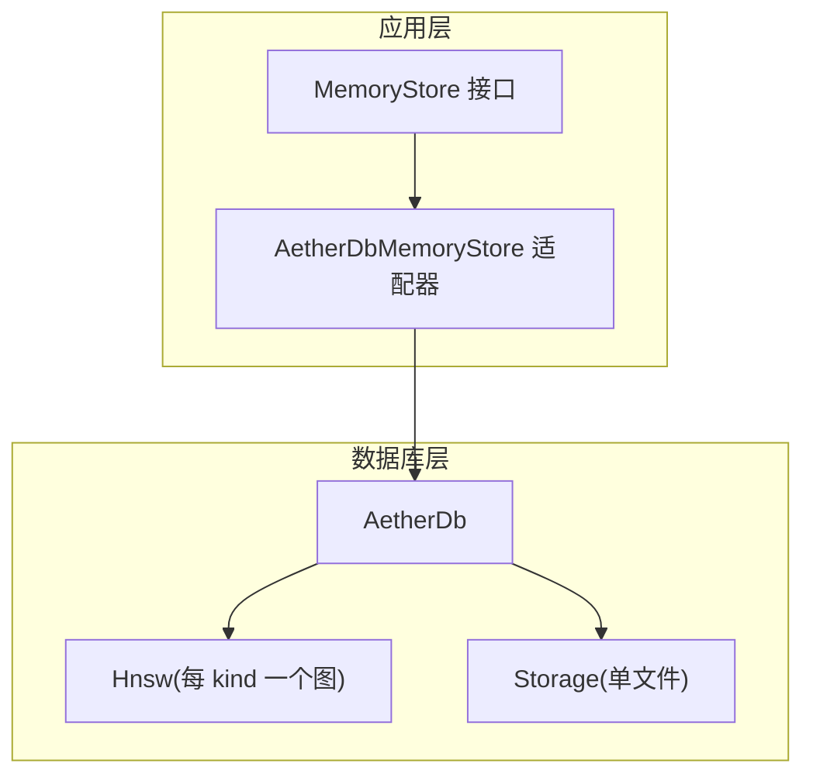
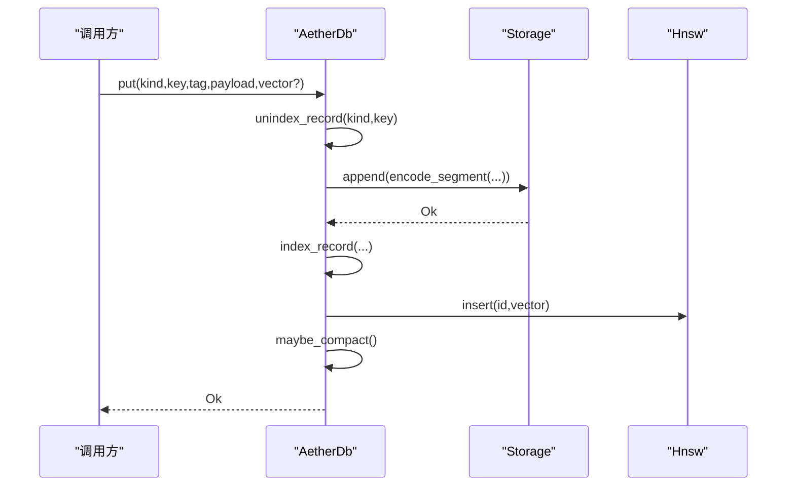
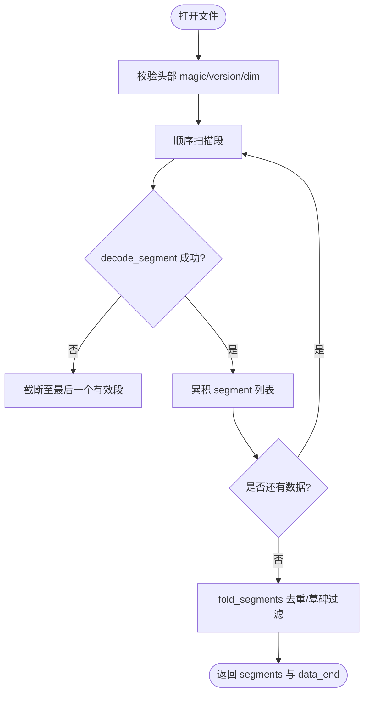
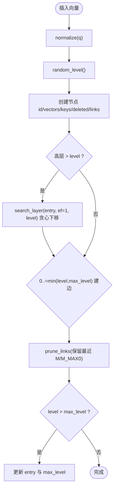
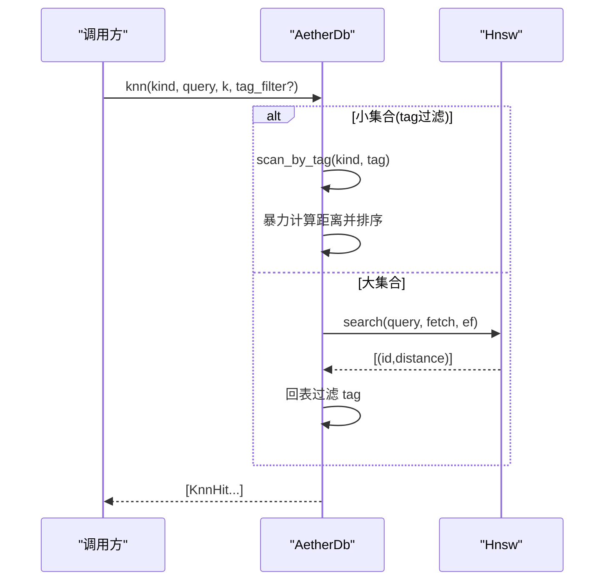
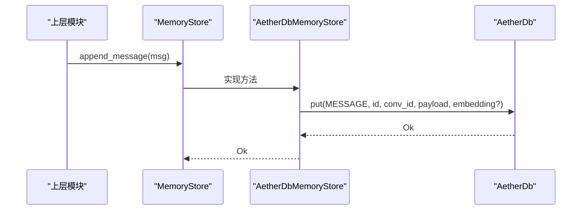
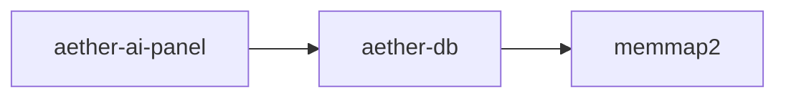

# AetherDB 数据库实现

<cite>
**本文引用的文件**
- [db.rs](file://crates/aether-db/src/db.rs)
- [hnsw.rs](file://crates/aether-db/src/hnsw.rs)
- [storage.rs](file://crates/aether-db/src/storage.rs)
- [Cargo.toml](file://crates/aether-db/Cargo.toml)
- [memory_store.rs](file://crates/aether-ai-panel/src/memory_store.rs)
- [aether_db_store.rs](file://crates/aether-ai-panel/src/aether_db_store.rs)
</cite>

## 目录
1. [简介](#简介)
2. [项目结构](#项目结构)
3. [核心组件](#核心组件)
4. [架构总览](#架构总览)
5. [详细组件分析](#详细组件分析)
6. [依赖关系分析](#依赖关系分析)
7. [性能考量](#性能考量)
8. [故障排查指南](#故障排查指南)
9. [结论](#结论)
10. [附录](#附录)

## 简介
AetherDB 是 Aether Studio 的自研嵌入式单文件向量数据库，采用“追加写 + 段折叠”的日志型存储设计，提供：
- 记录模型与二级索引（tag）
- 按 kind 分域的 HNSW 向量索引
- 崩溃恢复、自动 compaction
- 面向上层 MemoryStore 适配器的会话/消息/playbook 持久化能力

本文件从架构到实现细节，系统阐述数据文件组织、索引机制、事务语义（以追加段+墓碑实现）、HNSW 图构建与查询优化、存储层持久化与缓存策略，并给出架构图与数据流图。

## 项目结构
AetherDB 位于 crates/aether-db，包含三个核心源文件：
- db.rs：数据库主体，维护内存索引、KNN 检索、compaction
- hnsw.rs：HNSW 近似最近邻索引（余弦距离、增量插入、墓碑删除）
- storage.rs：单文件格式、段编解码、崩溃恢复、compaction

上层 aether-ai-panel 通过 memory_store.rs 定义 MemoryStore trait，并由 aether_db_store.rs 基于 AetherDb 实现该接口，将会话、消息、playbook 条目映射为 (kind, key) 记录与可选向量。



图表来源
- [memory_store.rs:77-201](file://crates/aether-ai-panel/src/memory_store.rs#L77-L201)
- [aether_db_store.rs:25-66](file://crates/aether-ai-panel/src/aether_db_store.rs#L25-L66)
- [db.rs:29-45](file://crates/aether-db/src/db.rs#L29-L45)
- [hnsw.rs:37-52](file://crates/aether-db/src/hnsw.rs#L37-L52)
- [storage.rs:175-182](file://crates/aether-db/src/storage.rs#L175-L182)

章节来源
- [db.rs:1-12](file://crates/aether-db/src/db.rs#L1-L12)
- [hnsw.rs:1-6](file://crates/aether-db/src/hnsw.rs#L1-L6)
- [storage.rs:1-16](file://crates/aether-db/src/storage.rs#L1-L16)
- [memory_store.rs:1-14](file://crates/aether-ai-panel/src/memory_store.rs#L1-L14)
- [aether_db_store.rs:1-14](file://crates/aether-ai-panel/src/aether_db_store.rs#L1-L14)

## 核心组件
- AetherDb：主入口，维护 records、tag_index、hnsw、node_of/id_of/key_of_id 等内存索引；提供 put/delete/get/scan/knn/flush/compact 等 API
- Hnsw：内存常驻的 HNSW 图，支持 cosine_distance、normalize、insert、search、mark_deleted
- Storage：单文件存储，段格式含 CRC，支持 append、open（崩溃恢复）、needs_compaction、compact（原子替换）
- AetherDbMemoryStore：将 MemoryStore 操作映射到 AetherDb 的 (kind, key) 记录与向量字段，实现会话/消息/playbook 的增删改查与混合检索

章节来源
- [db.rs:13-45](file://crates/aether-db/src/db.rs#L13-L45)
- [hnsw.rs:7-52](file://crates/aether-db/src/hnsw.rs#L7-L52)
- [storage.rs:21-61](file://crates/aether-db/src/storage.rs#L21-L61)
- [aether_db_store.rs:25-66](file://crates/aether-ai-panel/src/aether_db_store.rs#L25-L66)

## 架构总览
AetherDB 采用“追加写 + 段折叠”的不可变日志风格：
- 写入：put 先 unindex_record（旧版本计垃圾），再 encode_segment 追加，最后 index_record 更新内存索引
- 删除：delete 写入墓碑段（tombstone=true），unindex_record 标记 HNSW 节点删除
- 恢复：open 时 mmap 全量扫描，decode_segment 校验 CRC，fold_segments 去重/墓碑过滤得到 live 集合
- Compaction：当垃圾超过阈值且占比超 1/3 时，重写存活段为临时文件，fsync 后原子 rename 覆盖原文件



图表来源
- [db.rs:146-178](file://crates/aether-db/src/db.rs#L146-L178)
- [storage.rs:260-267](file://crates/aether-db/src/storage.rs#L260-L267)
- [hnsw.rs:171-215](file://crates/aether-db/src/hnsw.rs#L171-L215)

章节来源
- [db.rs:47-80](file://crates/aether-db/src/db.rs#L47-L80)
- [storage.rs:184-258](file://crates/aether-db/src/storage.rs#L184-L258)

## 详细组件分析

### 数据存储层：单文件格式与崩溃恢复
- 文件布局：固定 4KB 头（magic/version/dim），其后为连续数据段
- 段格式：定长头（magic/kind/flags/tag_len/key_len/payload_len/vec_len）+ tag/key/payload/vector(f32 LE) + CRC32
- 恢复策略：mmap 全量扫描，遇到首个损坏或截断段即停止；若尾部有损坏字节则截断至最后一个有效段
- 压缩触发：垃圾 > 1MB 且 垃圾*3 > 存活数据；压缩过程写临时文件、fsync、原子替换



图表来源
- [storage.rs:184-258](file://crates/aether-db/src/storage.rs#L184-L258)
- [storage.rs:320-341](file://crates/aether-db/src/storage.rs#L320-L341)

章节来源
- [storage.rs:21-33](file://crates/aether-db/src/storage.rs#L21-L33)
- [storage.rs:75-161](file://crates/aether-db/src/storage.rs#L75-L161)
- [storage.rs:269-317](file://crates/aether-db/src/storage.rs#L269-L317)

### 索引机制：二级索引与 HNSW 分域
- 二级索引：tag_index[(kind, tag)] -> keys 集合，用于 scan_by_tag 与 KNN 的 tag_filter
- HNSW 分域：每个 kind 独立一个 Hnsw 实例，避免跨 kind 污染
- 外部键映射：id_of[(kind,key)] <-> key_of_id[u64]，node_of[(kind,key)] -> HNSW 节点 id
- 维度校验：put 时校验 vector 长度等于 dim，否则拒绝

```mermaid
classDiagram
class AetherDb {
+dim : usize
+records : HashMap<(u8,String), Record>
+tag_index : HashMap<(u8,String), HashSet<String>>
+hnsw : HashMap<u8, Hnsw>
+node_of : HashMap<(u8,String), usize>
+id_of : HashMap<(u8,String), u64>
+key_of_id : HashMap<u64,(u8,String)>
+put(...)
+delete(...)
+knn(...)
+force_compact()
}
class Hnsw {
+vectors : Vec<Vec<f32>>
+keys : Vec<u64>
+links : Vec<Vec<Vec<u32>>>
+deleted : Vec<bool>
+insert(ext_key, vector) usize
+search(query, k, ef) Vec<(u64,f32)>
+mark_deleted(node)
}
AetherDb --> Hnsw : "按 kind 管理"
```

图表来源
- [db.rs:29-45](file://crates/aether-db/src/db.rs#L29-L45)
- [hnsw.rs:37-52](file://crates/aether-db/src/hnsw.rs#L37-L52)

章节来源
- [db.rs:99-144](file://crates/aether-db/src/db.rs#L99-L144)
- [db.rs:241-300](file://crates/aether-db/src/db.rs#L241-L300)

### HNSW 向量索引：图构建、相似度与查询优化
- 相似度：cosine_distance（归一化向量的余弦距离），normalize 对零向量安全处理
- 构建参数：M=8、M_MAX0=16、EF_CONSTRUCTION=64、MAX_LEVEL_CAP=8
- 插入流程：随机层级、高层贪心下降定位、低层 beam search 建边、邻居裁剪
- 查询流程：小规模（≤2048）退化暴力精确搜索；大规模分层下探 + 底层 ef 候选集过滤墓碑
- 删除：墓碑标记，搜索时跳过；compaction 由上层重建



图表来源
- [hnsw.rs:88-94](file://crates/aether-db/src/hnsw.rs#L88-L94)
- [hnsw.rs:171-215](file://crates/aether-db/src/hnsw.rs#L171-L215)
- [hnsw.rs:155-169](file://crates/aether-db/src/hnsw.rs#L155-L169)

章节来源
- [hnsw.rs:7-30](file://crates/aether-db/src/hnsw.rs#L7-L30)
- [hnsw.rs:96-153](file://crates/aether-db/src/hnsw.rs#L96-L153)
- [hnsw.rs:224-260](file://crates/aether-db/src/hnsw.rs#L224-L260)

### 事务处理：追加写与墓碑语义
- 无传统 ACID 事务，但通过“追加写 + 段折叠”保证一致性：
  - 覆盖写：旧版本段成为垃圾，新段覆盖逻辑值
  - 删除：墓碑段表示删除，fold_segments 忽略
  - 崩溃恢复：仅恢复完整段序列，截断损坏尾部
- 显式 flush：上层可调用 flush 作为同步点；append 内部已 flush

章节来源
- [db.rs:146-190](file://crates/aether-db/src/db.rs#L146-L190)
- [storage.rs:260-267](file://crates/aether-db/src/storage.rs#L260-L267)
- [storage.rs:320-341](file://crates/aether-db/src/storage.rs#L320-L341)

### 数据流：KNN 检索与标签过滤
- 小集合（含 tag 过滤后 ≤4096）：暴力精确计算 cosine_distance 并排序
- 大集合：HNSW 搜索取 k 或 k*4（带 tag 过滤时过量取），ef=(fetch*2).max(64)，再回表过滤 tag
- 结果按 distance 升序排序并截断到 k



图表来源
- [db.rs:241-300](file://crates/aether-db/src/db.rs#L241-L300)
- [hnsw.rs:224-260](file://crates/aether-db/src/hnsw.rs#L224-L260)

章节来源
- [db.rs:241-300](file://crates/aether-db/src/db.rs#L241-L300)

### 存储层：持久化、缓存与性能优化
- 持久化：append 立即 write_all + flush；compaction 使用临时文件 + fsync + atomic rename
- 缓存：内存中 records/tag_index/hnsw 充当热路径缓存；mmap 加速恢复扫描
- 性能优化：
  - 小集合退化暴力搜索减少图遍历开销
  - HNSW 参数调优（M、M_MAX0、EF_CONSTRUCTION）平衡构建与查询
  - 垃圾阈值与比例双条件触发 compaction，控制文件大小与碎片

章节来源
- [storage.rs:184-258](file://crates/aether-db/src/storage.rs#L184-L258)
- [storage.rs:269-317](file://crates/aether-db/src/storage.rs#L269-L317)
- [db.rs:241-300](file://crates/aether-db/src/db.rs#L241-L300)

### AetherDbMemoryStore 如何适配 MemoryStore 接口
- 会话：upsert_conversation/list/rename/delete（级联删除消息）
- 消息：append_message/get_messages（按 msg_index 排序）；embedding 单独存 vector 字段
- Playbook：upsert_bullet/bullet_feedback/list/delete；冲突合并保留计数器与 created_at
- 语义检索：search_messages/search_bullets 走 HNSW；hybrid_search_messages 子串关键词 + 向量 RRF 融合
- 剪枝：prune_bullets 按 harmful/helpful 阈值筛选，写审计日志后删除
- 资源回收：shrink_memory 触发 force_compact



图表来源
- [memory_store.rs:118-141](file://crates/aether-ai-panel/src/memory_store.rs#L118-L141)
- [aether_db_store.rs:132-151](file://crates/aether-ai-panel/src/aether_db_store.rs#L132-L151)
- [db.rs:146-178](file://crates/aether-db/src/db.rs#L146-L178)

章节来源
- [memory_store.rs:77-201](file://crates/aether-ai-panel/src/memory_store.rs#L77-L201)
- [aether_db_store.rs:77-443](file://crates/aether-ai-panel/src/aether_db_store.rs#L77-L443)

## 依赖关系分析
- aether-db 对外暴露 AetherDb、Hnsw、Storage 及错误类型
- aether-ai-panel 依赖 aether-db 并通过 MemoryStore trait 解耦具体实现
- 运行时依赖 memmap2 用于文件映射加速恢复



图表来源
- [Cargo.toml:6-8](file://crates/aether-db/Cargo.toml#L6-L8)
- [aether_db_store.rs:18-23](file://crates/aether-ai-panel/src/aether_db_store.rs#L18-L23)

章节来源
- [Cargo.toml:1-8](file://crates/aether-db/Cargo.toml#L1-L8)

## 性能考量
- 写入路径：append 直接落盘，避免额外缓冲；compaction 批量重写降低碎片
- 读取路径：内存索引命中 O(1)；KNN 对小集合退化暴力，对大集合 HNSW 近似
- 索引维护：插入时 normalize 与建边成本受 M、EF_CONSTRUCTION 影响；删除为 O(1) 墓碑标记
- 恢复性能：mmap 全量扫描 + CRC 校验，损坏尾部快速截断
- 建议：
  - 根据数据规模调整 EF 与 k，平衡召回与延迟
  - 合理设置 compaction 阈值，避免频繁重写
  - 对高频访问的 kind 保持较小集合以提升暴力路径效率

[本节为通用指导，不直接分析具体文件]

## 故障排查指南
- 维度不匹配：put 时校验 vector.len() == dim，否则返回错误
- 文件损坏：CRC 校验失败或截断段会被 decode_segment 拒绝；恢复时截断至最后一个有效段
- 垃圾过多：检查 needs_compaction 条件，必要时调用 force_compact
- 检索为空：确认 HNSW 是否已构建（存在向量记录），以及 tag_filter 是否正确

章节来源
- [db.rs:155-163](file://crates/aether-db/src/db.rs#L155-L163)
- [storage.rs:109-161](file://crates/aether-db/src/storage.rs#L109-L161)
- [storage.rs:274-278](file://crates/aether-db/src/storage.rs#L274-L278)

## 结论
AetherDB 以简洁的单文件追加写模型实现了高可靠、易恢复的持久化，结合内存中的二级索引与 HNSW 向量索引，满足编辑器场景下的会话、消息与 playbook 条目的高效存取需求。其设计在崩溃恢复、垃圾回收与查询优化之间取得良好平衡，并通过 MemoryStore 适配器向上层提供稳定抽象。

[本节为总结性内容，不直接分析具体文件]

## 附录
- 关键常量与错误类型
  - 文件头大小、魔数、版本、段头长度、墓碑标志位
  - DbError 统一错误封装
- 测试要点
  - 基本 CRUD、跨重启持久化、KNN 带 tag 过滤、级联删除、compaction 数据一致性、维度校验

章节来源
- [storage.rs:21-33](file://crates/aether-db/src/storage.rs#L21-L33)
- [storage.rs:34-48](file://crates/aether-db/src/storage.rs#L34-L48)
- [db.rs:335-465](file://crates/aether-db/src/db.rs#L335-L465)
- [hnsw.rs:263-336](file://crates/aether-db/src/hnsw.rs#L263-L336)