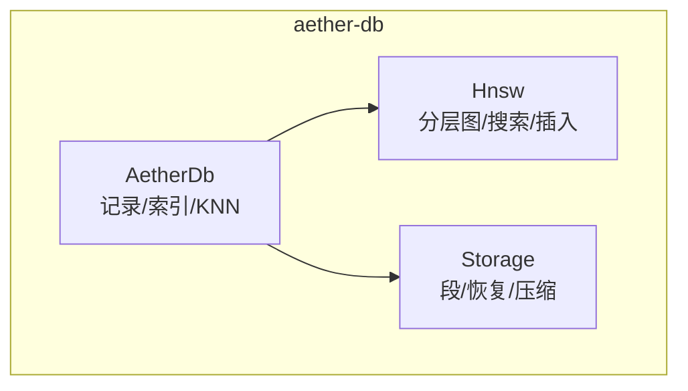
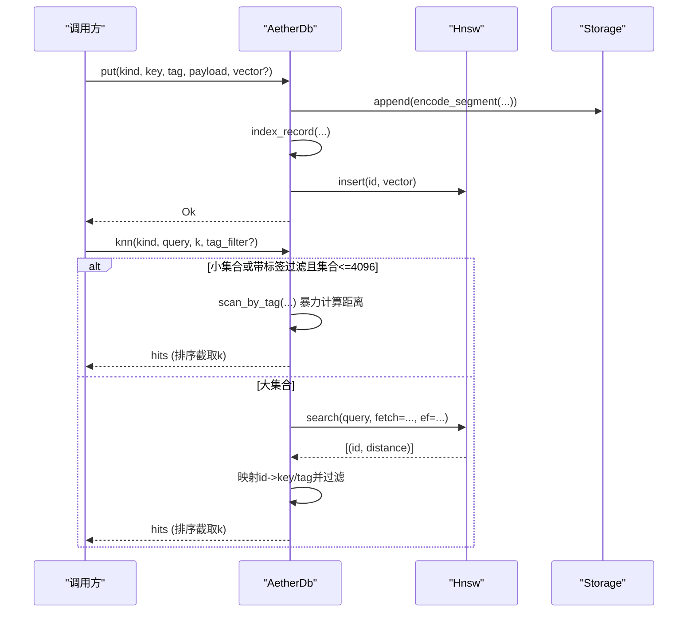
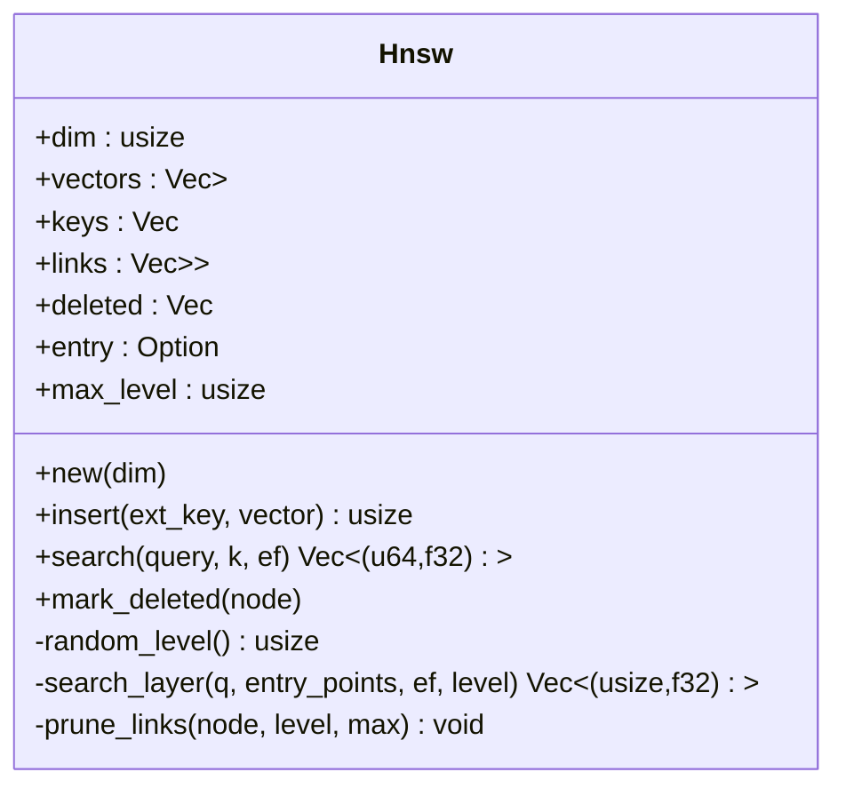
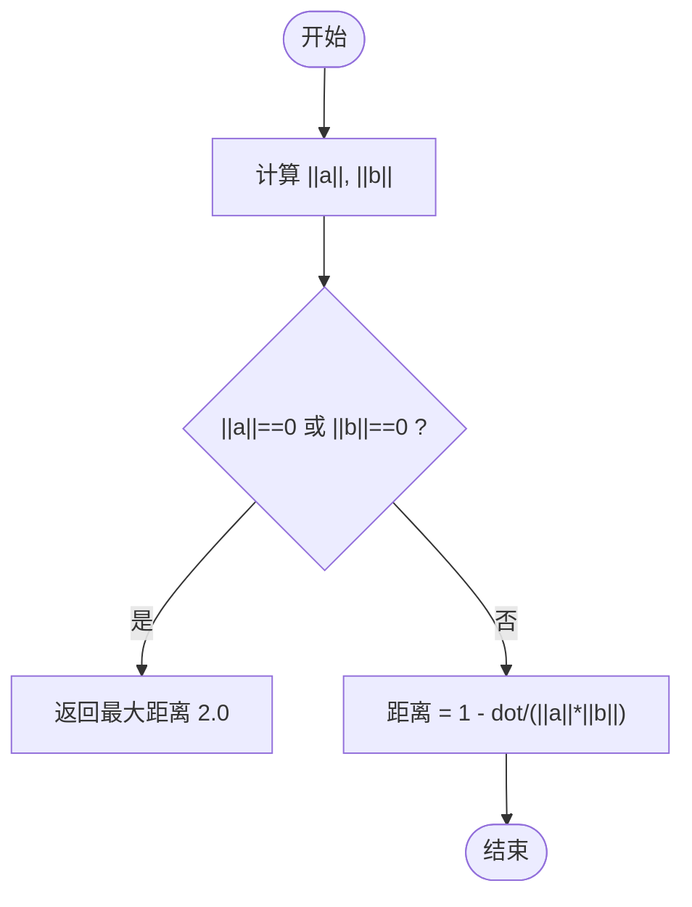
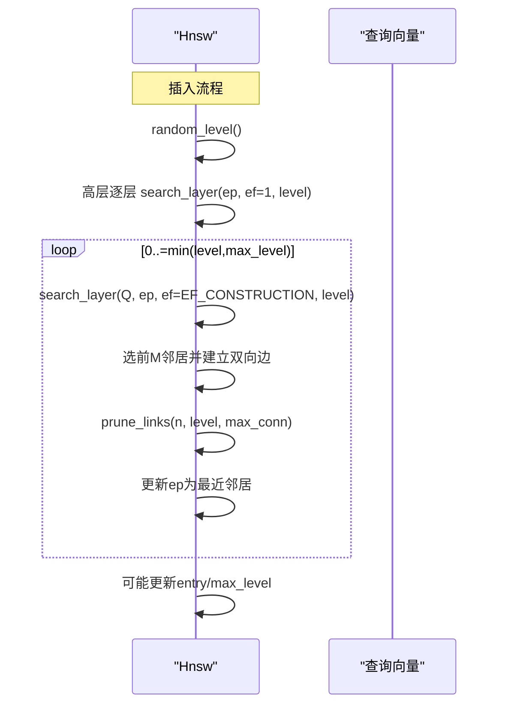
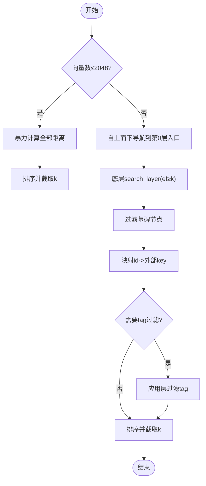
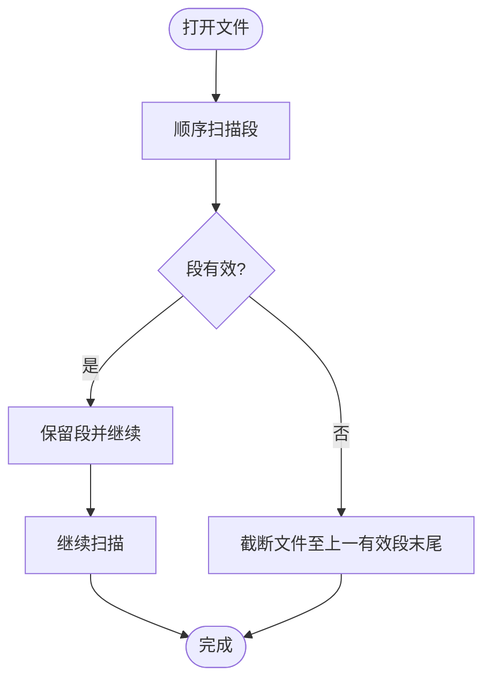
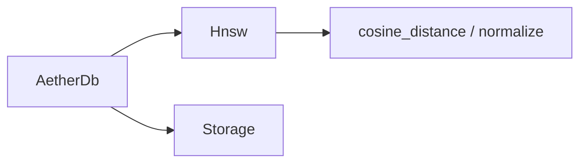

# HNSW 向量索引实现

<cite>
**本文引用的文件**
- [hnsw.rs](file://crates/aether-db/src/hnsw.rs)
- [db.rs](file://crates/aether-db/src/db.rs)
- [storage.rs](file://crates/aether-db/src/storage.rs)
</cite>

## 目录
1. [简介](#简介)
2. [项目结构](#项目结构)
3. [核心组件](#核心组件)
4. [架构总览](#架构总览)
5. [详细组件分析](#详细组件分析)
6. [依赖关系分析](#依赖关系分析)
7. [性能与复杂度](#性能与复杂度)
8. [故障排查指南](#故障排查指南)
9. [结论](#结论)
10. [附录：使用示例](#附录使用示例)

## 简介
本文件面向 HNSW（Hierarchical Navigable Small World）近似最近邻向量索引的实现，系统性阐述其分层图构建、多尺度导航机制、相似度计算与查询优化策略。该实现位于 aether-db 模块中，提供内存常驻的 HNSW 索引，并集成到 AetherDb 中以支持按 kind 分域的 KNN 检索、标签过滤、墓碑删除与自动压缩。

## 项目结构
- aether-db/src/hnsw.rs：HNSW 算法核心实现（距离度量、归一化、插入、搜索、层级管理）。
- aether-db/src/db.rs：数据库上层逻辑，维护记录、二级索引、按 kind 分域 HNSW 索引、KNN 检索入口与 compaction 触发。
- aether-db/src/storage.rs：单文件追加式存储层，段编解码、CRC 校验、崩溃恢复与 compaction。

图表来源
- [db.rs:30-45](file://crates/aether-db/src/db.rs#L30-L45)
- [hnsw.rs:37-52](file://crates/aether-db/src/hnsw.rs#L37-L52)
- [storage.rs:175-182](file://crates/aether-db/src/storage.rs#L175-L182)

章节来源
- [db.rs:1-466](file://crates/aether-db/src/db.rs#L1-L466)
- [hnsw.rs:1-337](file://crates/aether-db/src/hnsw.rs#L1-L337)
- [storage.rs:1-404](file://crates/aether-db/src/storage.rs#L1-L404)

## 核心组件
- HNSW 图结构
  - 节点：包含归一化向量、外部 key、链接表 links[node][level]、墓碑标记 deleted。
  - 层级：随机生成，控制节点参与的高层数量；第 0 层最大连接数 M_MAX0，其他层为 M。
  - 入口点 entry 与 max_level 用于自上而下导航。
- 相似度与归一化
  - 余弦距离：对 L2 归一化后的向量，距离 = 1 - 内积；零向量返回最大距离。
  - 归一化：对输入向量做 L2 归一化，零向量原样返回。
- 插入与建边
  - 增量插入：确定层级后，从高层到低层逐层 beam search 选择候选邻居，建立双向边并裁剪至上限。
- 查询与优化
  - 小规模暴力精确搜索（≤2048 维或集合较小），大规模走 HNSW 自上而下导航 + 底层 ef 过量采样 + 结果过滤。
  - 标签过滤时采用过度采样 fetch = k*4，再在应用层过滤 tag。
- 存储与持久化
  - 追加式段文件，CRC 校验，崩溃恢复截断损坏尾部；垃圾阈值触发 compaction 重写存活段。

章节来源
- [hnsw.rs:7-35](file://crates/aether-db/src/hnsw.rs#L7-L35)
- [hnsw.rs:37-52](file://crates/aether-db/src/hnsw.rs#L37-L52)
- [hnsw.rs:171-215](file://crates/aether-db/src/hnsw.rs#L171-L215)
- [hnsw.rs:224-260](file://crates/aether-db/src/hnsw.rs#L224-L260)
- [db.rs:241-300](file://crates/aether-db/src/db.rs#L241-L300)
- [storage.rs:1-16](file://crates/aether-db/src/storage.rs#L1-L16)

## 架构总览
AetherDb 将记录、二级索引与按 kind 分域的 HNSW 索引统一管理。写入时追加段并更新内存索引；删除以墓碑形式追加段并在内存中标记删除；KNN 检索根据数据规模与是否带标签过滤选择暴力或 HNSW 路径，必要时进行过度采样与结果过滤。

图表来源
- [db.rs:146-178](file://crates/aether-db/src/db.rs#L146-L178)
- [db.rs:241-300](file://crates/aether-db/src/db.rs#L241-L300)
- [hnsw.rs:171-215](file://crates/aether-db/src/hnsw.rs#L171-L215)
- [hnsw.rs:224-260](file://crates/aether-db/src/hnsw.rs#L224-L260)
- [storage.rs:75-107](file://crates/aether-db/src/storage.rs#L75-L107)

## 详细组件分析

### HNSW 图结构与参数
- 数据结构
  - vectors：按节点 id 存储归一化向量。
  - keys：外部稳定标识（由上层 AetherDb 分配）。
  - links：links[node][level] 保存该节点在各层的邻居列表。
  - deleted：墓碑标记，搜索时跳过已删除节点。
  - entry/max_level：顶层入口与最高层级。
- 关键常量
  - M：每层最大出边数（默认 8）。
  - M_MAX0：第 0 层最大出边数（默认 16）。
  - EF_CONSTRUCTION：建图时的 beam search 宽度（默认 64）。
  - MAX_LEVEL_CAP：层级上限（默认 8）。

图表来源
- [hnsw.rs:37-52](file://crates/aether-db/src/hnsw.rs#L37-L52)
- [hnsw.rs:88-94](file://crates/aether-db/src/hnsw.rs#L88-L94)
- [hnsw.rs:96-153](file://crates/aether-db/src/hnsw.rs#L96-L153)
- [hnsw.rs:155-169](file://crates/aether-db/src/hnsw.rs#L155-L169)
- [hnsw.rs:171-215](file://crates/aether-db/src/hnsw.rs#L171-L215)
- [hnsw.rs:217-260](file://crates/aether-db/src/hnsw.rs#L217-L260)

章节来源
- [hnsw.rs:32-52](file://crates/aether-db/src/hnsw.rs#L32-L52)

### 相似度计算与归一化
- 余弦距离
  - 先分别计算点积与范数，若任一范数为 0 则返回最大距离 2.0；否则距离 = 1 - 内积/(||a||·||b||)。
- L2 归一化
  - 计算范数，若为 0 则返回原向量；否则每个分量除以范数。

图表来源
- [hnsw.rs:7-21](file://crates/aether-db/src/hnsw.rs#L7-L21)
- [hnsw.rs:23-30](file://crates/aether-db/src/hnsw.rs#L23-L30)

章节来源
- [hnsw.rs:7-30](file://crates/aether-db/src/hnsw.rs#L7-L30)

### 图构建算法：插入与建边
- 层级选择
  - 基于指数分布随机生成层级，限制最大层级。
- 高层下降
  - 从当前 entry 出发，自顶向下逐层选择最近邻居作为下一层入口。
- 建边与剪枝
  - 在 0..=min(level, max_level) 各层执行 beam search（宽度 EF_CONSTRUCTION），选取前 M 个邻居建立双向边。
  - 对已有邻居列表按距离排序并裁剪至上限（第 0 层为 M_MAX0，其余为 M）。
- 入口更新
  - 若新节点层级高于现有 max_level，则更新 entry 与 max_level。

图表来源
- [hnsw.rs:88-94](file://crates/aether-db/src/hnsw.rs#L88-L94)
- [hnsw.rs:171-215](file://crates/aether-db/src/hnsw.rs#L171-L215)
- [hnsw.rs:96-153](file://crates/aether-db/src/hnsw.rs#L96-L153)
- [hnsw.rs:155-169](file://crates/aether-db/src/hnsw.rs#L155-L169)

章节来源
- [hnsw.rs:88-94](file://crates/aether-db/src/hnsw.rs#L88-L94)
- [hnsw.rs:171-215](file://crates/aether-db/src/hnsw.rs#L171-L215)

### 查询优化：范围控制、过度采样与结果过滤
- 小规模精确搜索
  - 当向量总数 ≤2048 时直接暴力计算所有距离并排序取 top-k，避免图导航误差。
- 大规模 HNSW 搜索
  - 自上而下导航定位底层入口点。
  - 底层使用 ef 过量采样（ef ≥ k），提升召回率。
  - 过滤墓碑节点，再映射回外部 key。
- 标签过滤
  - 若指定 tag_filter 且集合较小（≤4096），对该子集暴力计算距离。
  - 否则对 HNSW 结果进行过度采样 fetch = k*4，再在应用层过滤 tag 并排序截取 k。

图表来源
- [hnsw.rs:224-260](file://crates/aether-db/src/hnsw.rs#L224-L260)
- [db.rs:241-300](file://crates/aether-db/src/db.rs#L241-L300)

章节来源
- [hnsw.rs:224-260](file://crates/aether-db/src/hnsw.rs#L224-L260)
- [db.rs:241-300](file://crates/aether-db/src/db.rs#L241-L300)

### 存储与持久化：段格式、恢复与压缩
- 段格式
  - 固定 16B 头（魔数、kind、flags、tag_len、key_len、payload_len、vec_len），随后拼接 tag/key/payload/vector，最后 CRC32。
- 崩溃恢复
  - 打开文件时全量扫描段，遇到首个损坏/截断段即停止，并将文件长度截断至最后一个有效段末尾。
- 压缩
  - 垃圾字节超过阈值（>1MB 且占比超 1/3）时，用存活段重写临时文件，fsync 后原子替换原文件，重置垃圾计数。

图表来源
- [storage.rs:109-161](file://crates/aether-db/src/storage.rs#L109-L161)
- [storage.rs:184-258](file://crates/aether-db/src/storage.rs#L184-L258)
- [storage.rs:274-311](file://crates/aether-db/src/storage.rs#L274-L311)

章节来源
- [storage.rs:1-16](file://crates/aether-db/src/storage.rs#L1-L16)
- [storage.rs:109-161](file://crates/aether-db/src/storage.rs#L109-L161)
- [storage.rs:184-258](file://crates/aether-db/src/storage.rs#L184-L258)
- [storage.rs:274-311](file://crates/aether-db/src/storage.rs#L274-L311)

## 依赖关系分析
- AetherDb 依赖 HNSW 提供向量检索能力，并通过 Storage 实现持久化。
- HNSW 内部依赖余弦距离与归一化函数，以及随机层级生成。
- Storage 提供段编码/解码、CRC 校验与压缩，被 AetherDb 在写入与恢复时使用。

图表来源
- [db.rs:1-11](file://crates/aether-db/src/db.rs#L1-L11)
- [hnsw.rs:7-30](file://crates/aether-db/src/hnsw.rs#L7-L30)
- [storage.rs:75-107](file://crates/aether-db/src/storage.rs#L75-L107)

章节来源
- [db.rs:1-466](file://crates/aether-db/src/db.rs#L1-L466)
- [hnsw.rs:1-337](file://crates/aether-db/src/hnsw.rs#L1-L337)
- [storage.rs:1-404](file://crates/aether-db/src/storage.rs#L1-L404)

## 性能与复杂度
- 时间复杂度
  - 插入：O(log N) 层级选择 + 多层 beam search（宽度 EF_CONSTRUCTION），总体近似 O(log N · M · log N) 级别。
  - 查询：自上而下导航 O(log N)，底层搜索 O(ef · M)，整体近似 O(log N + ef · M)。
  - 小规模暴力：O(N · d)，d 为维度。
- 空间复杂度
  - 图结构 O(N · L · M)，L 为平均层级数；向量存储 O(N · d)。
- 调优建议
  - 增大 ef 可提升召回但增加查询开销；减小 ef 降低延迟但可能损失召回。
  - 调整 M 与 M_MAX0 平衡图密度与建图/查询成本。
  - 对于带标签过滤的场景，优先对小集合使用暴力路径；大集合下适度提高过度采样倍数（如 k*4）以提升召回。
  - 合理设置 compaction 阈值以避免过多垃圾影响 I/O。

[本节为通用指导，不直接分析具体文件]

## 故障排查指南
- 维度不匹配
  - 写入时若传入向量维度与数据库初始化维度不一致，会返回错误。检查 open 时的 dim 与 put 时传入向量长度。
- 文件损坏或截断
  - 启动时会扫描段，遇到损坏立即截断文件；确认磁盘健康与进程安全退出。
- 召回偏低
  - 增大 ef 或提高过度采样倍数；检查是否误入小规模暴力路径导致结果差异。
- 墓碑节点仍出现
  - 确认 mark_deleted 已被调用；搜索路径会过滤 deleted 标记。

章节来源
- [db.rs:146-178](file://crates/aether-db/src/db.rs#L146-L178)
- [storage.rs:184-258](file://crates/aether-db/src/storage.rs#L184-L258)
- [hnsw.rs:217-260](file://crates/aether-db/src/hnsw.rs#L217-L260)

## 结论
该 HNSW 实现以简洁高效的 Rust 代码提供了内存常驻的近似最近邻检索能力，结合 AetherDb 的分域索引与标签过滤，适配编辑器场景下的消息/上下文向量检索需求。通过合理的参数配置（M、M_MAX0、ef、EF_CONSTRUCTION）与过度采样策略，可在延迟与召回之间取得良好平衡；配合追加式存储与 compaction，保证数据一致性与空间效率。

[本节为总结性内容，不直接分析具体文件]

## 附录：使用示例
以下示例展示如何在 AetherDb 中使用 HNSW 进行向量检索（仅描述步骤，不粘贴代码）：
- 初始化数据库
  - 打开或创建数据库文件，指定向量维度。
- 写入记录与向量
  - 调用 put(kind, key, tag, payload, Some(vector)) 写入记录与向量。
- 执行 KNN 检索
  - 调用 knn(kind, query, k, tag_filter?) 获取相似记录；如需标签过滤，传入 tag_filter。
- 删除记录
  - 调用 delete(kind, key) 删除记录；HNSW 中标记墓碑，搜索时跳过。
- 压缩与同步
  - 根据需要调用 force_compact() 或 flush() 进行压缩与同步。

章节来源
- [db.rs:146-178](file://crates/aether-db/src/db.rs#L146-L178)
- [db.rs:241-300](file://crates/aether-db/src/db.rs#L241-L300)
- [db.rs:315-332](file://crates/aether-db/src/db.rs#L315-L332)