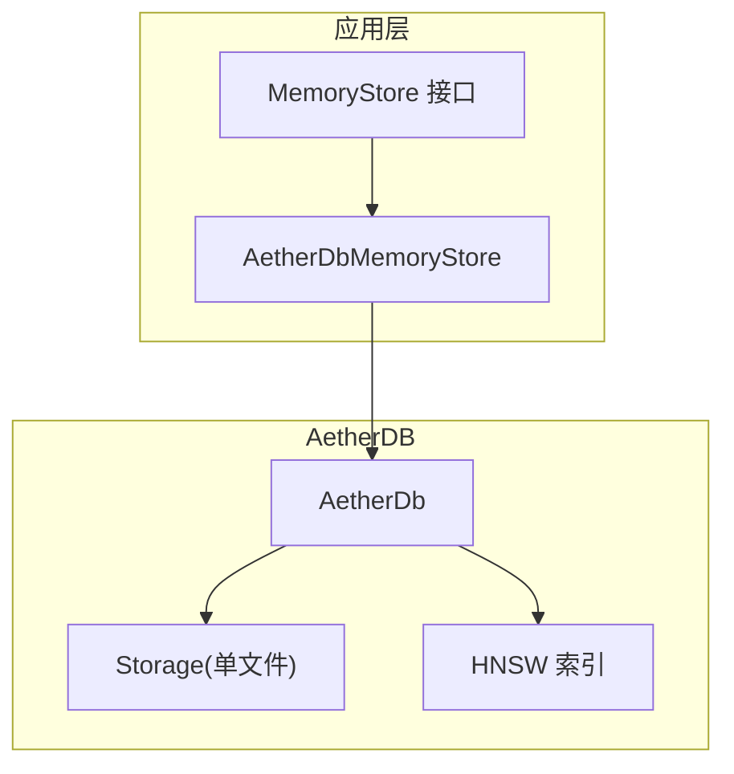
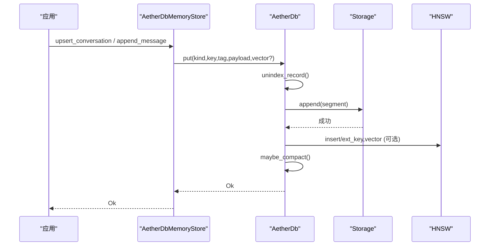
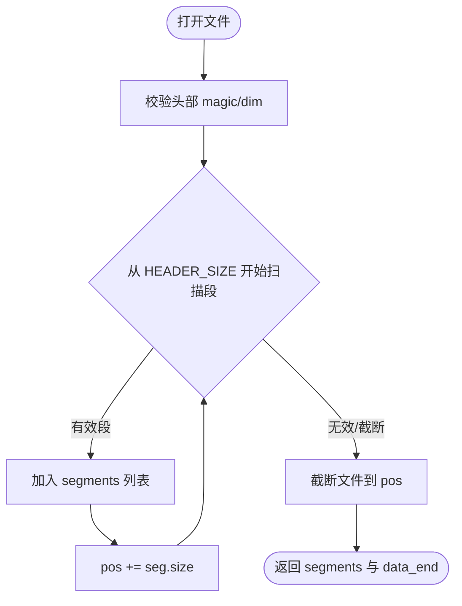
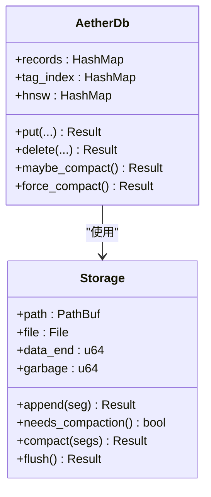
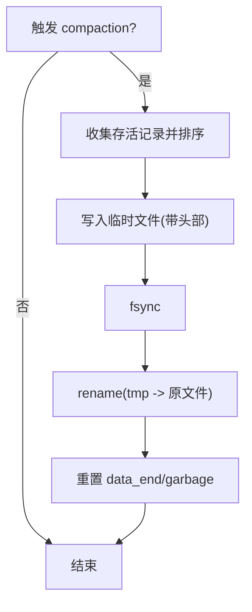
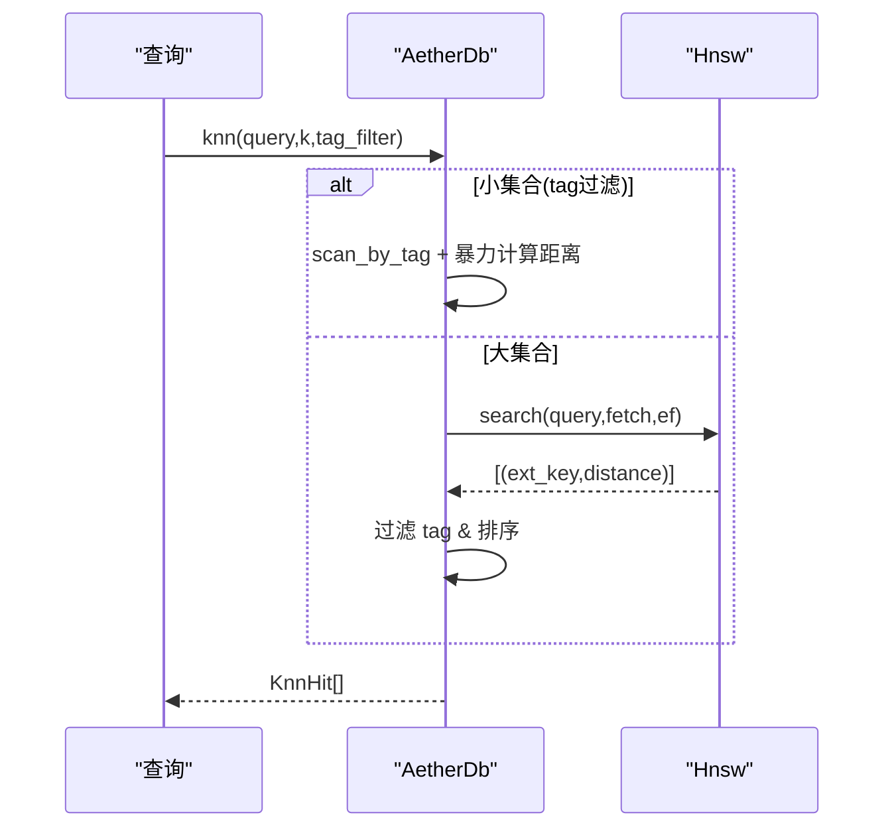
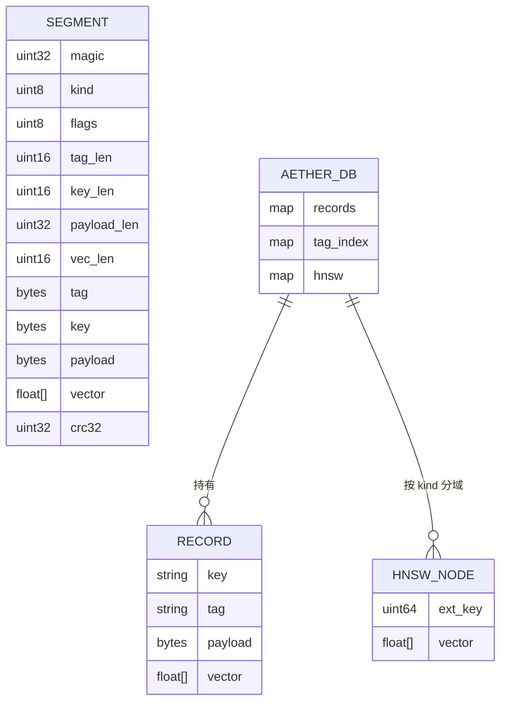
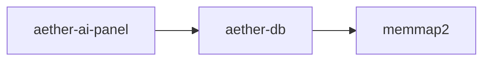

# 数据存储层

<cite>
**本文引用的文件**
- [db.rs](file://crates/aether-db/src/db.rs)
- [storage.rs](file://crates/aether-db/src/storage.rs)
- [hnsw.rs](file://crates/aether-db/src/hnsw.rs)
- [Cargo.toml](file://crates/aether-db/Cargo.toml)
- [memory_store.rs](file://crates/aether-ai-panel/src/memory_store.rs)
- [aether_db_store.rs](file://crates/aether-ai-panel/src/aether_db_store.rs)
</cite>

## 目录
1. [简介](#简介)
2. [项目结构](#项目结构)
3. [核心组件](#核心组件)
4. [架构总览](#架构总览)
5. [详细组件分析](#详细组件分析)
6. [依赖关系分析](#依赖关系分析)
7. [性能考量](#性能考量)
8. [故障排查指南](#故障排查指南)
9. [结论](#结论)
10. [附录：使用示例与配置](#附录使用示例与配置)

## 简介
本文件为 AetherDB 数据存储层的权威技术文档，聚焦单文件存储架构、段（Segment）格式、持久化机制（追加写、事务保证、崩溃恢复）、缓存与内存管理（段缓存、脏块、垃圾回收）、压缩合并（compaction）算法与触发条件、数据一致性保障，以及向量检索（HNSW）的集成。同时提供文件布局图、数据流图和性能优化建议，并给出具体使用示例展示如何配置和使用该存储层。

## 项目结构
AetherDB 位于 crates/aether-db，由三个核心模块组成：
- db.rs：对外 API 与索引维护（记录、标签索引、HNSW 索引），封装 compaction 策略。
- storage.rs：单文件格式、段编解码、追加写、崩溃恢复、compaction。
- hnsw.rs：内存中的 HNSW 近似最近邻索引，支持增量插入与墓碑删除。

上层通过 aether-ai-panel 的 MemoryStore 抽象适配到 AetherDbMemoryStore，将会话、消息、条目等实体映射为 (kind, key) 记录，payload 为 JSON，向量单独存储于 vector 字段。

图表来源
- [memory_store.rs:77-141](file://crates/aether-ai-panel/src/memory_store.rs#L77-L141)
- [aether_db_store.rs:25-66](file://crates/aether-ai-panel/src/aether_db_store.rs#L25-L66)
- [db.rs:30-45](file://crates/aether-db/src/db.rs#L30-L45)
- [storage.rs:175-182](file://crates/aether-db/src/storage.rs#L175-L182)
- [hnsw.rs:37-52](file://crates/aether-db/src/hnsw.rs#L37-L52)

章节来源
- [memory_store.rs:1-200](file://crates/aether-ai-panel/src/memory_store.rs#L1-L200)
- [aether_db_store.rs:1-120](file://crates/aether-ai-panel/src/aether_db_store.rs#L1-L120)
- [db.rs:1-120](file://crates/aether-db/src/db.rs#L1-L120)
- [storage.rs:1-60](file://crates/aether-db/src/storage.rs#L1-L60)
- [hnsw.rs:1-60](file://crates/aether-db/src/hnsw.rs#L1-L60)

## 核心组件
- AetherDb：对外主入口，维护 records、tag_index、hnsw 等内存索引，负责 put/delete/scan/knn/flush/compaction。
- Storage：单文件存储，实现 append、open（崩溃恢复）、compact（原子替换）、flush；维护 data_end、garbage。
- Segment：数据段结构，包含 kind、tombstone、tag、key、payload、vector。
- Hnsw：内存 HNSW 索引，支持 cosine_distance、normalize、insert、search、mark_deleted。
- AetherDbMemoryStore：将业务实体映射到 AetherDb，实现 MemoryStore 接口。

章节来源
- [db.rs:13-45](file://crates/aether-db/src/db.rs#L13-L45)
- [storage.rs:50-61](file://crates/aether-db/src/storage.rs#L50-L61)
- [hnsw.rs:37-52](file://crates/aether-db/src/hnsw.rs#L37-L52)
- [aether_db_store.rs:25-66](file://crates/aether-ai-panel/src/aether_db_store.rs#L25-L66)

## 架构总览
AetherDB 采用“单文件 + 追加写 + 内存索引”的 LSM 风格设计：
- 文件头固定 4KB，包含魔数、版本、维度；数据区按段追加写入。
- 每次 put/delete 都追加一个段；删除以墓碑段表示。
- 启动时全量扫描文件，折叠段序列得到存活记录，重建内存索引。
- 当垃圾字节超过阈值且占比过高时触发 compaction，重写存活段并原子替换文件。
- 向量检索通过 HNSW 进行，小集合退化暴力精确搜索，大集合走 HNSW 近似搜索。

图表来源
- [aether_db_store.rs:80-151](file://crates/aether-ai-panel/src/aether_db_store.rs#L80-L151)
- [db.rs:147-178](file://crates/aether-db/src/db.rs#L147-L178)
- [storage.rs:260-267](file://crates/aether-db/src/storage.rs#L260-L267)
- [hnsw.rs:171-215](file://crates/aether-db/src/hnsw.rs#L171-L215)

## 详细组件分析

### 单文件存储与段格式
- 文件头：4KB，包含 magic、version、dim；用于校验与维度一致性检查。
- 段格式（小端）：
  - 定长头 16B：magic u32 | kind u8 | flags u8 | tag_len u16 | key_len u16 | payload_len u32 | vec_len u16
  - 变体体：tag bytes | key bytes | payload bytes | vector(f32 LE) bytes
  - CRC32：覆盖段头到向量尾的全部字节
- 追加写：append 直接写到 data_end，并 flush；data_end 更新。
- 崩溃恢复：open 时 mmap 或读取文件，从 HEADER_SIZE 开始顺序解码段；遇到损坏或截断即停止，并将文件长度截断至最后一个有效段末尾。

图表来源
- [storage.rs:186-258](file://crates/aether-db/src/storage.rs#L186-L258)
- [storage.rs:109-161](file://crates/aether-db/src/storage.rs#L109-L161)

章节来源
- [storage.rs:1-60](file://crates/aether-db/src/storage.rs#L1-L60)
- [storage.rs:163-172](file://crates/aether-db/src/storage.rs#L163-L172)
- [storage.rs:186-258](file://crates/aether-db/src/storage.rs#L186-L258)

### 持久化机制：追加写、事务保证、崩溃恢复
- 追加写：put/delete 均调用 encode_segment 生成段并 append；append 内部 write_all + flush，确保落盘。
- 事务保证：当前实现无多段原子事务；每个段独立落盘。compaction 阶段通过临时文件 + fsync + rename 实现原子替换，避免部分写入导致的不一致。
- 崩溃恢复：启动时全量扫描，丢弃尾部损坏段；若文件头损坏则报错；维度不匹配时报错。

章节来源
- [db.rs:147-190](file://crates/aether-db/src/db.rs#L147-L190)
- [storage.rs:260-317](file://crates/aether-db/src/storage.rs#L260-L317)
- [storage.rs:186-258](file://crates/aether-db/src/storage.rs#L186-L258)

### 缓存策略与内存管理
- 段缓存：open 时使用 memmap2 映射文件加速恢复扫描；实际读写仍通过 File 句柄。
- 脏块管理：无显式脏块表；所有写操作立即 flush，属于“写后即落盘”模式。
- 垃圾回收：unindex_record 计算旧版本大小并累加 garbage；needs_compaction 判断垃圾 > 1MB 且垃圾*3 > 存活数据；force_compact 重写存活段并重置 garbage=0。

图表来源
- [storage.rs:175-317](file://crates/aether-db/src/storage.rs#L175-L317)
- [db.rs:99-144](file://crates/aether-db/src/db.rs#L99-L144)
- [db.rs:307-332](file://crates/aether-db/src/db.rs#L307-L332)

章节来源
- [storage.rs:175-317](file://crates/aether-db/src/storage.rs#L175-L317)
- [db.rs:99-144](file://crates/aether-db/src/db.rs#L99-L144)
- [db.rs:307-332](file://crates/aether-db/src/db.rs#L307-L332)

### 压缩合并（Compaction）算法
- 触发条件：垃圾字节 > 1MB 且垃圾*3 > 存活数据（data_end - HEADER_SIZE）。
- 执行策略：收集当前存活记录，按 key 排序编码为新段序列，写入临时文件，fsync 后 rename 原子替换原文件；重新打开文件句柄并重置 data_end/garbage。
- 数据一致性：compaction 期间不改变内存索引；完成后新文件仅含存活段，语义等价。

图表来源
- [storage.rs:274-311](file://crates/aether-db/src/storage.rs#L274-L311)
- [db.rs:307-332](file://crates/aether-db/src/db.rs#L307-L332)

章节来源
- [storage.rs:274-311](file://crates/aether-db/src/storage.rs#L274-L311)
- [db.rs:307-332](file://crates/aether-db/src/db.rs#L307-L332)

### 向量检索与 HNSW
- 距离度量：余弦距离（归一化向量的内积差），零向量返回最大距离。
- 参数：M=8，Mmax0=16，ef_construction=64，MAX_LEVEL_CAP=8。
- 插入：随机层级，高层贪心下降，低层 beam search 建边，邻居裁剪保留最近 M/Mmax0。
- 搜索：小规模（≤2048）暴力精确；大规模走 HNSW，自上而下定位入口点，底层 ef 扩展，过滤墓碑节点。
- 与 AetherDb 集成：按 kind 分域维护多个 HNSW；node_of/id_of/key_of_id 维持外部键与节点 id 的双向映射。

图表来源
- [db.rs:241-300](file://crates/aether-db/src/db.rs#L241-L300)
- [hnsw.rs:224-260](file://crates/aether-db/src/hnsw.rs#L224-L260)

章节来源
- [hnsw.rs:7-30](file://crates/aether-db/src/hnsw.rs#L7-L30)
- [hnsw.rs:171-215](file://crates/aether-db/src/hnsw.rs#L171-L215)
- [hnsw.rs:224-260](file://crates/aether-db/src/hnsw.rs#L224-L260)
- [db.rs:241-300](file://crates/aether-db/src/db.rs#L241-L300)

### 数据模型与关系

图表来源
- [storage.rs:50-61](file://crates/aether-db/src/storage.rs#L50-L61)
- [db.rs:13-45](file://crates/aether-db/src/db.rs#L13-L45)
- [hnsw.rs:37-52](file://crates/aether-db/src/hnsw.rs#L37-L52)

## 依赖关系分析
- aether-db 仅依赖 memmap2，用于加速恢复时的文件映射。
- aether-ai-panel 通过 MemoryStore 抽象解耦上层逻辑与存储实现；AetherDbMemoryStore 将业务实体映射为 AetherDb 记录。
- 耦合点：
  - AetherDb 依赖 storage 与 hnsw 模块。
  - AetherDbMemoryStore 依赖 aether-db 的 kind 常量与 API。
- 潜在循环依赖：无；分层清晰。

图表来源
- [Cargo.toml:6-7](file://crates/aether-db/Cargo.toml#L6-L7)
- [aether_db_store.rs:18-23](file://crates/aether-ai-panel/src/aether_db_store.rs#L18-L23)

章节来源
- [Cargo.toml:1-8](file://crates/aether-db/Cargo.toml#L1-L8)
- [aether_db_store.rs:18-23](file://crates/aether-ai-panel/src/aether_db_store.rs#L18-L23)

## 性能考量
- 追加写 + 即时 flush：降低延迟抖动，但增加系统调用开销；适合中小规模写入。
- 恢复扫描：mmap 提升大文件恢复速度；小文件退化为直接读。
- HNSW 搜索：小规模暴力精确，减少近似误差；大规模 ef 可调以提升召回率。
- Compaction 触发：垃圾阈值与比例平衡空间与性能；频繁覆盖场景下应关注 compaction 频率。
- 内存占用：records/tag_index/hnsw 常驻内存；需评估数据集规模。
- 建议：
  - 合理设置 embedding_dim 与批量写入以减少多次 flush。
  - 对高写入负载，可调整 compaction 阈值或异步触发。
  - 监控 garbage 增长，必要时主动 shrink_memory。

[本节为通用性能讨论，不直接分析具体文件]

## 故障排查指南
- 文件头损坏：打开时报错，确认文件是否被外部进程修改或磁盘错误。
- 维度不匹配：运行时期望维度与文件头不一致，需统一 embedding_dim。
- 段损坏/截断：恢复时跳过损坏段并截断文件；检查写入流程是否异常中断。
- 向量维度不匹配：put 时校验失败，检查上游嵌入生成器输出维度。
- 检索结果为空：确认是否存在对应 kind/tag 的记录；检查 HNSW 是否已构建。
- 混合检索未命中：关键词长度不足 3 字符不会启用子串匹配；检查 query_text。

章节来源
- [storage.rs:186-258](file://crates/aether-db/src/storage.rs#L186-L258)
- [db.rs:147-178](file://crates/aether-db/src/db.rs#L147-L178)
- [aether_db_store.rs:304-381](file://crates/aether-ai-panel/src/aether_db_store.rs#L304-L381)

## 结论
AetherDB 以单文件追加写为核心，结合内存索引与 HNSW 向量检索，提供了轻量、易部署的嵌入式存储能力。其崩溃恢复与 compaction 机制保证了数据一致性与空间效率。上层通过 MemoryStore 抽象实现了灵活的业务适配。对于编辑器场景下的对话历史、上下文工程条目等数据，该存储层在性能与可靠性之间取得了良好平衡。

[本节为总结性内容，不直接分析具体文件]

## 附录：使用示例与配置
- 初始化存储：
  - 创建目录与数据库文件：AetherDbMemoryStore::open(dir, embedding_dim)
  - 默认文件路径：dir/aether_memory.aedb
- 写入与会话：
  - 会话：upsert_conversation / list_conversations / delete_conversation / rename_conversation
  - 消息：append_message / get_messages / search_messages
  - 条目：upsert_bullet / bullet_feedback / list_bullets / delete_bullet
- 向量检索：
  - 纯向量：search_messages / search_bullets
  - 混合检索：hybrid_search_messages（子串关键词 + 向量 RRF 融合）
- 持久化与回收：
  - flush：显式同步点
  - shrink_memory：强制 compaction 回收墓碑垃圾

章节来源
- [aether_db_store.rs:32-66](file://crates/aether-ai-panel/src/aether_db_store.rs#L32-L66)
- [aether_db_store.rs:80-151](file://crates/aether-ai-panel/src/aether_db_store.rs#L80-L151)
- [aether_db_store.rs:166-242](file://crates/aether-ai-panel/src/aether_db_store.rs#L166-L242)
- [aether_db_store.rs:246-381](file://crates/aether-ai-panel/src/aether_db_store.rs#L246-L381)
- [aether_db_store.rs:285-300](file://crates/aether-ai-panel/src/aether_db_store.rs#L285-L300)