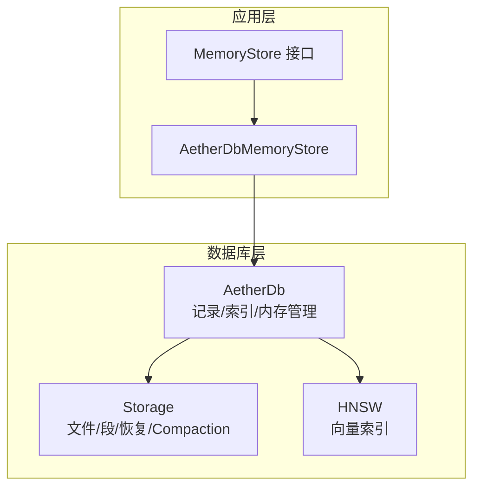
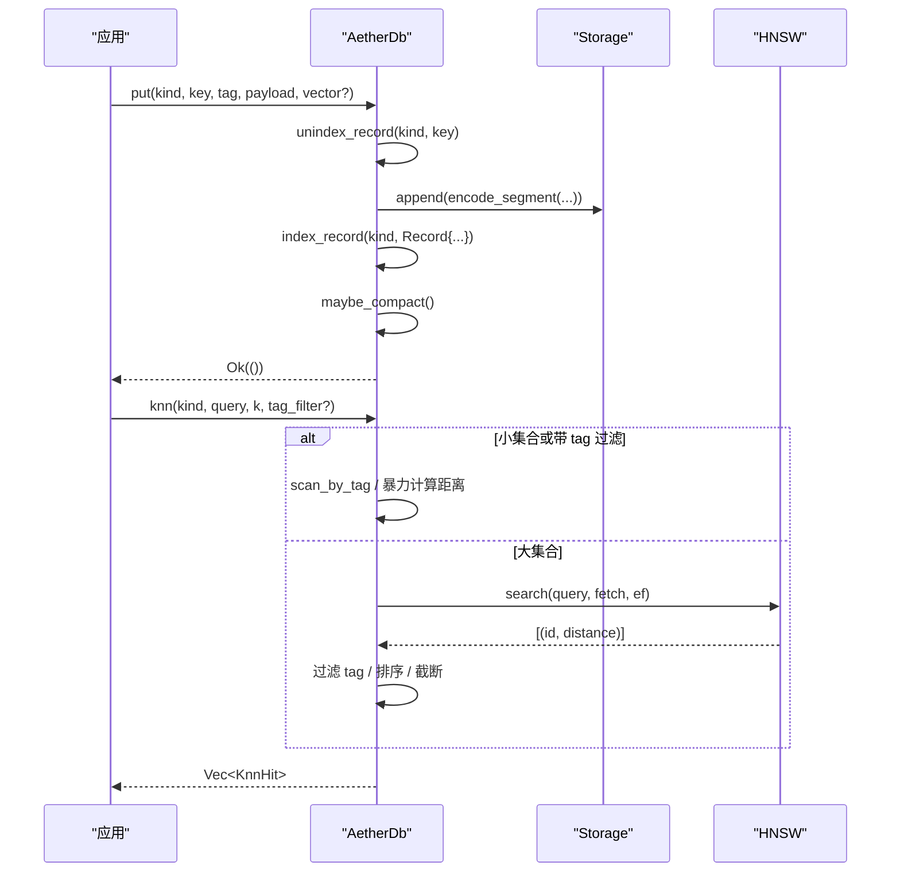
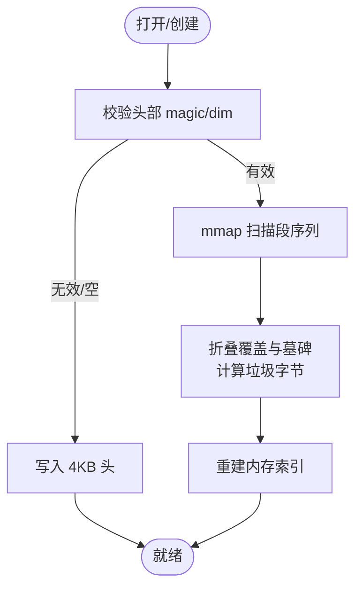
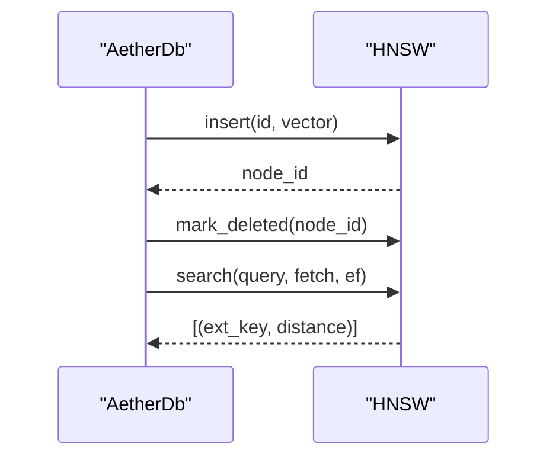
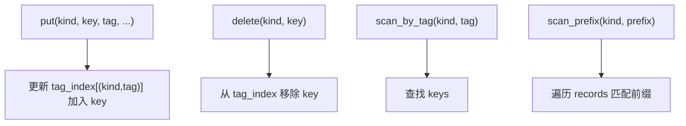
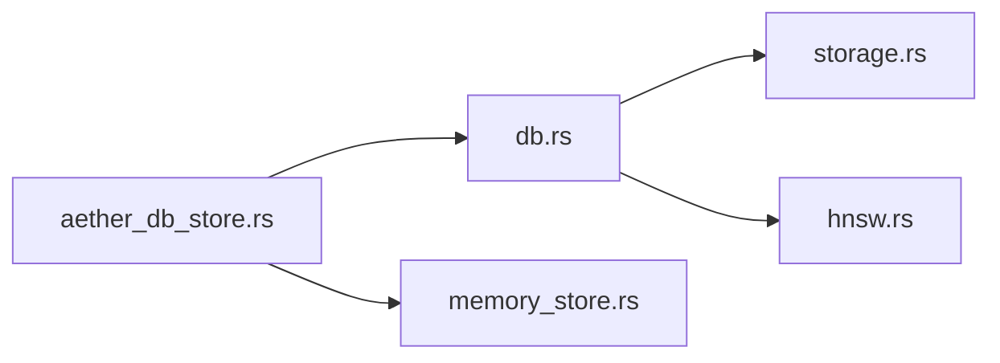

# 数据库核心接口

<cite>
**本文引用的文件**
- [db.rs](file://crates/aether-db/src/db.rs)
- [storage.rs](file://crates/aether-db/src/storage.rs)
- [hnsw.rs](file://crates/aether-db/src/hnsw.rs)
- [Cargo.toml](file://crates/aether-db/Cargo.toml)
- [aether_db_store.rs](file://crates/aether-ai-panel/src/aether_db_store.rs)
- [memory_store.rs](file://crates/aether-ai-panel/src/memory_store.rs)
</cite>

## 目录
1. [简介](#简介)
2. [项目结构](#项目结构)
3. [核心组件](#核心组件)
4. [架构总览](#架构总览)
5. [详细组件分析](#详细组件分析)
6. [依赖关系分析](#依赖关系分析)
7. [性能考量](#性能考量)
8. [故障排查指南](#故障排查指南)
9. [结论](#结论)
10. [附录：API 参考与示例](#附录api-参考与示例)

## 简介
本文件为 AetherDB 数据库核心接口的权威文档，面向需要在其上构建应用或二次开发的工程师。内容涵盖主结构体设计（记录模型、索引结构与内存管理）、核心 API（put/get/delete、KNN 向量检索、批量/级联操作）、二级索引机制（tag 索引、前缀扫描、复合键支持）、事务与并发安全策略、错误处理与持久化恢复，以及丰富的使用示例与最佳实践。

AetherDB 是一个单文件嵌入式数据库，采用追加写段 + 垃圾回收压缩的 LSM-like 思想，结合内存中的 tag 二级索引与按 kind 分域的 HNSW 向量索引，提供高吞吐写入、稳定查询与近似最近邻检索能力。上层通过 MemoryStore 适配层将业务实体映射到 (kind, key) 记录，payload 以 JSON 存储，向量独立存放并参与检索。

## 项目结构
AetherDB 位于 crates/aether-db，包含三个核心源文件：
- db.rs：对外暴露的主结构体 AetherDb 及其 API（CRUD、KNN、扫描、压缩）
- storage.rs：单文件格式、段编解码、崩溃恢复、compaction
- hnsw.rs：纯 Rust 实现的 HNSW 近似最近邻索引（余弦距离、增量插入、墓碑删除）

上层 aether-ai-panel 通过 aether_db_store.rs 将业务对象持久化到 AetherDB，并通过 memory_store.rs 定义统一抽象接口。



图表来源
- [aether_db_store.rs:25-66](file://crates/aether-ai-panel/src/aether_db_store.rs#L25-L66)
- [db.rs:29-45](file://crates/aether-db/src/db.rs#L29-L45)
- [storage.rs:174-182](file://crates/aether-db/src/storage.rs#L174-L182)
- [hnsw.rs:37-52](file://crates/aether-db/src/hnsw.rs#L37-L52)

章节来源
- [db.rs:1-466](file://crates/aether-db/src/db.rs#L1-L466)
- [storage.rs:1-404](file://crates/aether-db/src/storage.rs#L1-L404)
- [hnsw.rs:1-337](file://crates/aether-db/src/hnsw.rs#L1-L337)
- [aether_db_store.rs:1-675](file://crates/aether-ai-panel/src/aether_db_store.rs#L1-L675)
- [memory_store.rs:1-361](file://crates/aether-ai-panel/src/memory_store.rs#L1-L361)

## 核心组件
- 记录模型 Record：包含 key、tag、payload、vector，是 AetherDB 的最小数据单元。
- 主结构体 AetherDb：维护 records（(kind,key)->Record）、tag_index（(kind,tag)->keys）、hnsw（按 kind 分域）、node_of/id_of/key_of_id（向量节点映射）。
- 存储层 Storage：单文件追加写、段格式、CRC 校验、mmap 恢复、compaction。
- 向量索引 HNSW：余弦距离、增量插入、墓碑删除、搜索时跳过已删节点。

章节来源
- [db.rs:13-45](file://crates/aether-db/src/db.rs#L13-L45)
- [storage.rs:50-61](file://crates/aether-db/src/storage.rs#L50-L61)
- [hnsw.rs:37-52](file://crates/aether-db/src/hnsw.rs#L37-L52)

## 架构总览
AetherDB 采用“内存索引 + 持久化段”的混合架构：
- 写入路径：put/delete 生成段并追加到文件，同时更新内存索引；必要时触发 compaction。
- 读取路径：get/scan/scan_by_tag/scan_prefix 直接查内存索引；KNN 走 HNSW 或小集合暴力精确搜索。
- 恢复路径：open 时 mmap 全量扫描段，折叠覆盖与墓碑，重建内存索引。
- 一致性：无显式事务；通过追加写 + 折叠逻辑保证重启后语义正确性。



图表来源
- [db.rs:146-178](file://crates/aether-db/src/db.rs#L146-L178)
- [db.rs:241-300](file://crates/aether-db/src/db.rs#L241-L300)
- [storage.rs:260-267](file://crates/aether-db/src/storage.rs#L260-L267)
- [hnsw.rs:224-260](file://crates/aether-db/src/hnsw.rs#L224-L260)

## 详细组件分析

### AetherDb 主结构体与内存管理
- 字段职责：
  - records：存活记录缓存，(kind, key) 唯一
  - tag_index：二级索引，(kind, tag) -> key 集合
  - hnsw：按 kind 分域的 HNSW 实例
  - node_of/id_of/key_of_id：向量节点与记录的互映射
- 关键方法：
  - open：打开/创建文件，fold_segments 折叠段序列，按偏移顺序重建索引，确保 HNSW 确定性
  - put：先 unindex_record 旧版本，再 encode_segment 追加，再 index_record 新记录，可能触发 compaction
  - delete：追加墓碑段，更新内存索引
  - delete_by_tag：基于 tag_index 级联删除
  - get/scan/scan_by_tag/scan_prefix：内存索引查询
  - knn：小集合暴力精确搜索，大集合走 HNSW，支持 tag 过滤
  - flush/force_compact：显式同步与强制压缩

```mermaid
classDiagram
class AetherDb {
-storage : Storage
-dim : usize
-records : HashMap<(u8,String), Record>
-tag_index : HashMap<(u8,String), HashSet<String>>
-hnsw : HashMap<u8, Hnsw>
-node_of : HashMap<(u8,String), usize>
-next_vec_id : u64
-id_of : HashMap<(u8,String), u64>
-key_of_id : HashMap<u64, (u8,String)>
+open(path, dim) Result
+put(kind, key, tag, payload, vector) Result
+delete(kind, key) Result<bool>
+delete_by_tag(kind, tag) Result<usize>
+get(kind, key) Option<&Record>
+scan(kind) Vec<&Record>
+scan_by_tag(kind, tag) Vec<&Record>
+scan_prefix(kind, prefix) Vec<&Record>
+knn(kind, query, k, tag_filter) Vec<KnnHit>
+flush() Result
+force_compact() Result
}
class Record {
+key : String
+tag : String
+payload : Vec<u8>
+vector : Option<Vec<f32>>
}
class KnnHit {
+key : String
+distance : f32
}
AetherDb --> Record : "维护"
AetherDb --> KnnHit : "返回"
```

图表来源
- [db.rs:13-45](file://crates/aether-db/src/db.rs#L13-L45)
- [db.rs:47-333](file://crates/aether-db/src/db.rs#L47-L333)

章节来源
- [db.rs:47-333](file://crates/aether-db/src/db.rs#L47-L333)

### 存储层：段格式、恢复与 Compaction
- 文件布局：固定 4KB 头（magic/version/dim），其后为追加段；删除/覆盖产生垃圾段
- 段格式：定长头（magic/kind/flags/tag_len/key_len/payload_len/vec_len）+ 变长字段 + CRC32
- 恢复策略：mmap 全量扫描，遇到损坏/截断即停止；尾部截断自动修复
- Compaction：当垃圾字节 > 1MB 且占比超 1/3 时，重写存活段并原子替换文件



图表来源
- [storage.rs:184-258](file://crates/aether-db/src/storage.rs#L184-L258)
- [storage.rs:320-341](file://crates/aether-db/src/storage.rs#L320-L341)

章节来源
- [storage.rs:1-404](file://crates/aether-db/src/storage.rs#L1-L404)

### HNSW 向量索引
- 距离度量：归一化向量的余弦距离（0 完全相同，2 完全相反）
- 参数：M=8、Mmax0=16、ef_construction=64，适合编辑器规模
- 特性：增量插入、墓碑删除、搜索时跳过已删节点；小规模退化暴力精确搜索
- 上层集成：AetherDb 按 kind 分域维护 HNSW，并提供 tag 过滤后的融合结果



图表来源
- [hnsw.rs:171-222](file://crates/aether-db/src/hnsw.rs#L171-L222)
- [hnsw.rs:224-260](file://crates/aether-db/src/hnsw.rs#L224-L260)
- [db.rs:106-118](file://crates/aether-db/src/db.rs#L106-L118)

章节来源
- [hnsw.rs:1-337](file://crates/aether-db/src/hnsw.rs#L1-L337)
- [db.rs:100-118](file://crates/aether-db/src/db.rs#L100-L118)

### 二级索引机制：Tag 索引、前缀扫描与复合键
- Tag 索引：(kind, tag) -> keys，支持 scan_by_tag 与 delete_by_tag 级联删除
- 前缀扫描：scan_prefix 支持复合键前缀检索（如 "conv-1/"），用于会话内消息分组
- 复合键：key 可承载层级信息（如 "conv-id/msg-id"），配合前缀扫描实现高效范围检索



图表来源
- [db.rs:100-118](file://crates/aether-db/src/db.rs#L100-L118)
- [db.rs:192-239](file://crates/aether-db/src/db.rs#L192-L239)

章节来源
- [db.rs:192-239](file://crates/aether-db/src/db.rs#L192-L239)

### 事务处理与并发安全
- 事务：无显式事务；通过追加写 + 折叠逻辑保证重启后一致性
- 并发：AetherDb 本身未内置锁；上层通过 Mutex 包裹 AetherDb 实例（见 AetherDbMemoryStore）
- 一致性保证：
  - 覆盖写：旧版本计为垃圾，新段追加后内存索引更新
  - 删除：墓碑段追加，内存索引移除
  - 恢复：fold_segments 按顺序折叠，墓碑生效

章节来源
- [aether_db_store.rs:25-66](file://crates/aether-ai-panel/src/aether_db_store.rs#L25-L66)
- [storage.rs:320-341](file://crates/aether-db/src/storage.rs#L320-L341)

## 依赖关系分析
- 外部依赖：memmap2（用于 mmap 加速恢复扫描）
- 内部依赖：
  - db.rs 依赖 storage.rs（段编解码、append/compact）、hnsw.rs（向量索引）
  - aether_db_store.rs 依赖 db.rs（AetherDb API）与 memory_store.rs（接口定义）



图表来源
- [Cargo.toml:6-7](file://crates/aether-db/Cargo.toml#L6-L7)
- [aether_db_store.rs:15-23](file://crates/aether-ai-panel/src/aether_db_store.rs#L15-L23)
- [db.rs:7-11](file://crates/aether-db/src/db.rs#L7-L11)

章节来源
- [Cargo.toml:1-8](file://crates/aether-db/Cargo.toml#L1-L8)
- [aether_db_store.rs:15-23](file://crates/aether-ai-panel/src/aether_db_store.rs#L15-L23)
- [db.rs:7-11](file://crates/aether-db/src/db.rs#L7-L11)

## 性能考量
- 写入路径：追加写 O(1)，索引更新 O(1)；compaction 阈值避免频繁重写
- 读取路径：get/scan/scan_by_tag/scan_prefix 均为内存访问；KNN 小集合暴力精确搜索，大集合 HNSW 近似搜索
- 向量维度：严格校验，避免不匹配导致错误
- 恢复性能：mmap 全量扫描，损坏段快速截断
- 建议：
  - 合理设置 k 与 ef 平衡精度与延迟
  - 使用 tag 过滤缩小候选集
  - 定期调用 force_compact 控制文件大小

[本节为通用指导，不直接分析具体文件]

## 故障排查指南
- 向量维度不匹配：put 时校验失败，检查数据库初始化 dim 与传入向量长度
- 文件损坏：open 时头部 magic/dim 校验失败或段 CRC 校验失败，需重建或清理文件
- 检索结果为空：确认存在向量、tag 过滤条件、k>0
- 性能问题：评估是否触发 compaction、是否使用 tag 过滤、是否选择合适 ef

章节来源
- [db.rs:155-163](file://crates/aether-db/src/db.rs#L155-L163)
- [storage.rs:208-246](file://crates/aether-db/src/storage.rs#L208-L246)
- [storage.rs:130-133](file://crates/aether-db/src/storage.rs#L130-L133)

## 结论
AetherDB 以简洁的单文件设计与高效的内存索引提供了可靠的 CRUD、二级索引与向量检索能力。其追加写 + 折叠恢复模式保证了崩溃安全与数据一致性，HNSW 向量索引在编辑器规模下表现良好。上层通过 MemoryStore 抽象实现了业务解耦，便于扩展与维护。

[本节为总结，不直接分析具体文件]

## 附录：API 参考与示例

### AetherDb 核心 API
- open(path, dim) -> Result<AetherDb, DbError>
  - 参数：path 数据库文件路径；dim 向量维度
  - 返回：成功返回 AetherDb；失败返回错误（magic/dim 不匹配等）
- put(kind, key, tag, payload, vector) -> Result<(), DbError>
  - 参数：kind 记录类型；key 唯一键；tag 标签；payload 二进制负载；vector 可选向量
  - 行为：覆盖写旧版本，追加新段，更新索引，可能触发 compaction
- delete(kind, key) -> Result<bool, DbError>
  - 返回：true 表示删除成功，false 表示不存在
- delete_by_tag(kind, tag) -> Result<usize, DbError>
  - 级联删除某 kind 下所有 tag 匹配的记录
- get(kind, key) -> Option<&Record>
- scan(kind) -> Vec<&Record>
- scan_by_tag(kind, tag) -> Vec<&Record>
- scan_prefix(kind, prefix) -> Vec<&Record>
- knn(kind, query, k, tag_filter) -> Vec<KnnHit>
  - 小集合（含 tag 过滤后 ≤4096）走暴力精确搜索；大集合走 HNSW
- flush() -> Result<(), DbError>
- force_compact() -> Result<(), DbError>

章节来源
- [db.rs:47-333](file://crates/aether-db/src/db.rs#L47-L333)

### 存储层常量与工具
- HEADER_SIZE: 4096
- FILE_MAGIC: "AEDB"
- SEG_MAGIC: 段魔数
- FLAG_TOMBSTONE: 墓碑标记
- encode_segment(...) -> Vec<u8>
- decode_segment(data, pos) -> Option<Segment>
- fold_segments(segments) -> (HashMap, garbage_bytes)

章节来源
- [storage.rs:21-32](file://crates/aether-db/src/storage.rs#L21-L32)
- [storage.rs:75-107](file://crates/aether-db/src/storage.rs#L75-L107)
- [storage.rs:109-161](file://crates/aether-db/src/storage.rs#L109-L161)
- [storage.rs:320-341](file://crates/aether-db/src/storage.rs#L320-L341)

### 向量索引工具
- cosine_distance(a, b) -> f32
- normalize(v) -> Vec<f32>
- Hnsw::new(dim)
- Hnsw::insert(ext_key, vector) -> usize
- Hnsw::mark_deleted(node)
- Hnsw::search(query, k, ef) -> Vec<(u64, f32)>

章节来源
- [hnsw.rs:7-30](file://crates/aether-db/src/hnsw.rs#L7-L30)
- [hnsw.rs:54-66](file://crates/aether-db/src/hnsw.rs#L54-L66)
- [hnsw.rs:171-222](file://crates/aether-db/src/hnsw.rs#L171-L222)
- [hnsw.rs:224-260](file://crates/aether-db/src/hnsw.rs#L224-L260)

### 使用示例（来自测试与上层实现）
- 基本 CRUD：put/get/delete，覆盖写与墓碑删除
- 跨进程持久化：关闭后重新打开，索引重建一致
- KNN 带 tag 过滤：仅返回指定 tag 下的最近邻
- 级联删除：delete_by_tag 删除某会话全部消息
- 压缩保留数据：force_compact 后数据完整
- 维度不匹配拒绝：put 时校验失败
- 上层用法：AetherDbMemoryStore 封装会话/消息/条目读写与检索

章节来源
- [db.rs:350-464](file://crates/aether-db/src/db.rs#L350-L464)
- [aether_db_store.rs:80-151](file://crates/aether-ai-panel/src/aether_db_store.rs#L80-L151)
- [aether_db_store.rs:246-283](file://crates/aether-ai-panel/src/aether_db_store.rs#L246-L283)
- [aether_db_store.rs:530-560](file://crates/aether-ai-panel/src/aether_db_store.rs#L530-L560)