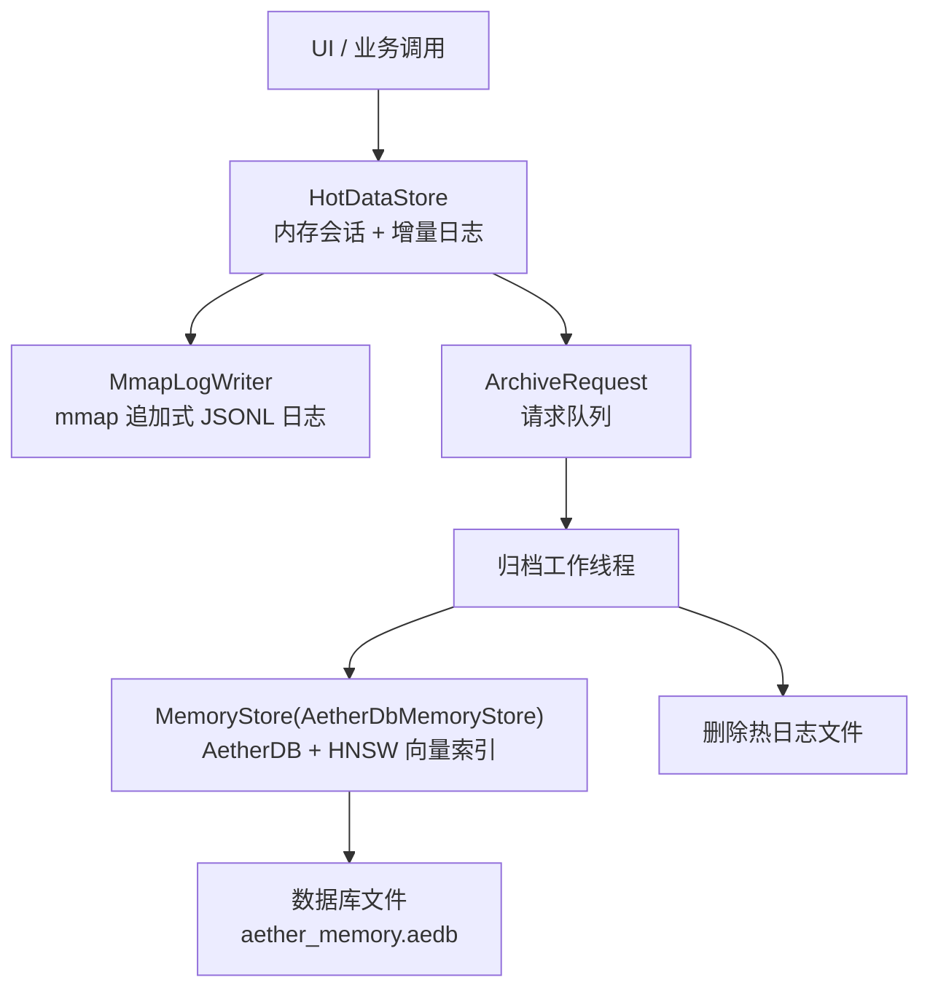
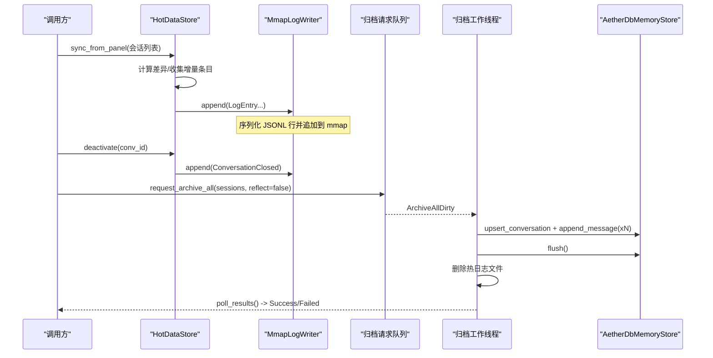
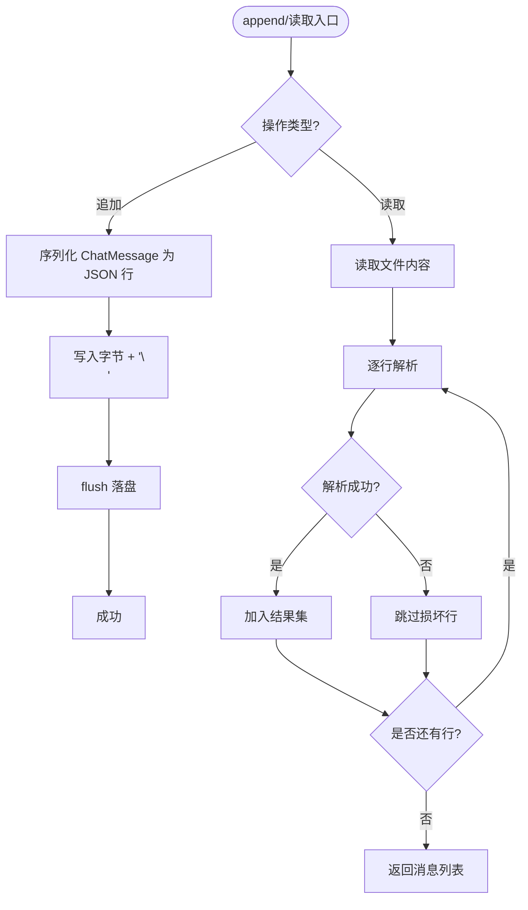
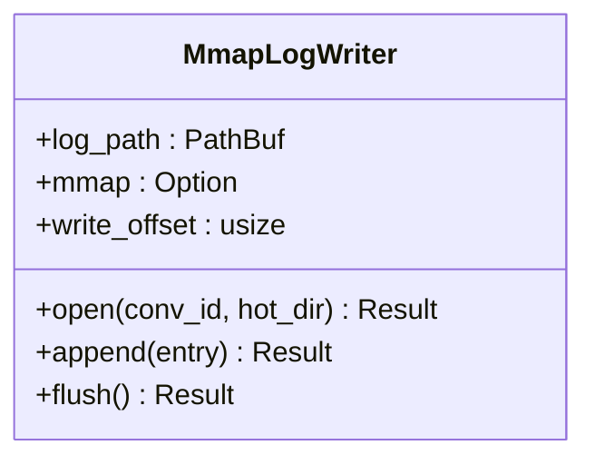
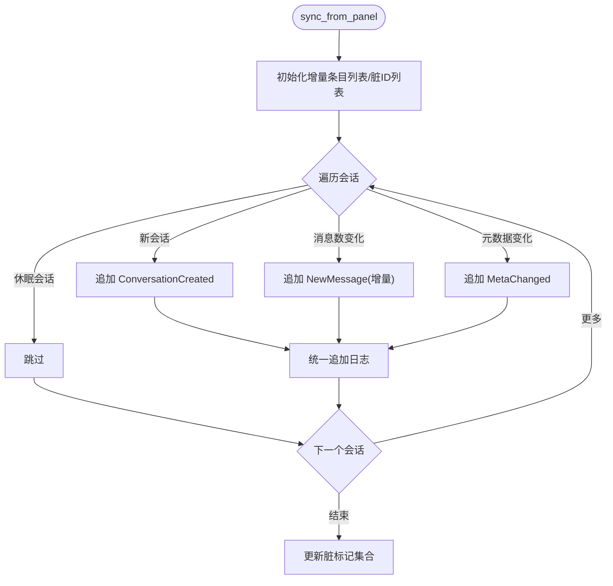
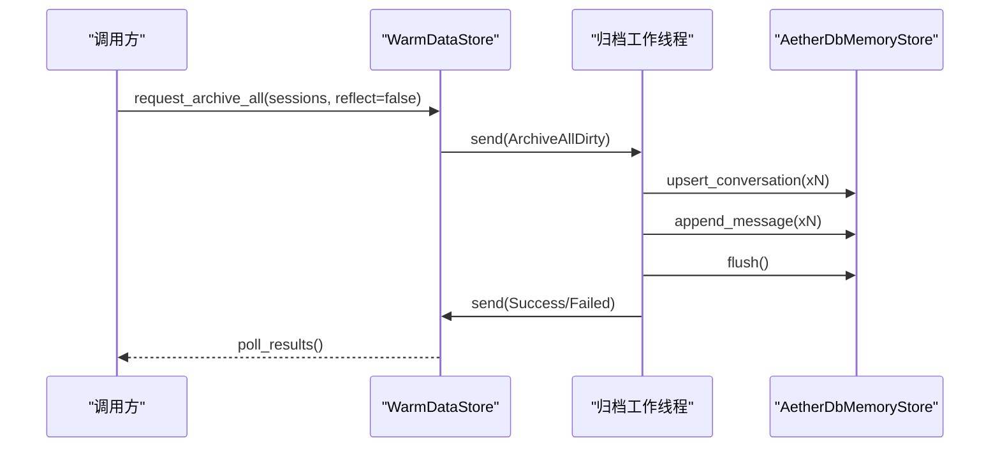
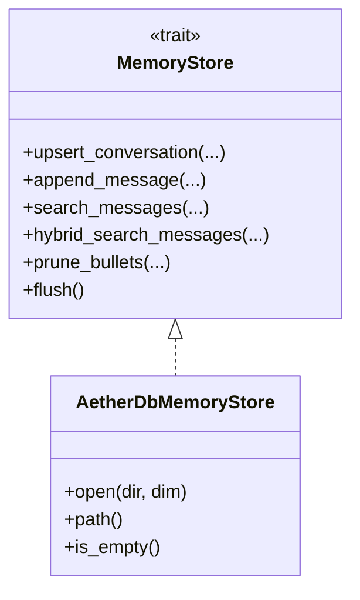
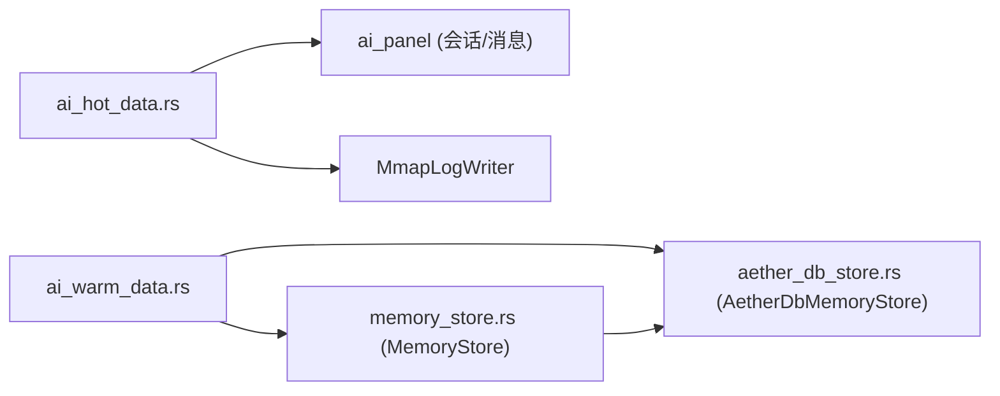

# JSONL 热数据存储

<cite>
**本文引用的文件**
- [ai_hot_data.rs](file://crates/aether-ai-panel/src/ai_hot_data.rs)
- [ai_warm_data.rs](file://crates/aether-ai-panel/src/ai_warm_data.rs)
- [memory_store.rs](file://crates/aether-ai-panel/src/memory_store.rs)
- [aether_db_store.rs](file://crates/aether-ai-panel/src/aether_db_store.rs)
- [lib.rs](file://crates/aether-ai-panel/src/lib.rs)
</cite>

## 目录
1. [简介](#简介)
2. [项目结构](#项目结构)
3. [核心组件](#核心组件)
4. [架构总览](#架构总览)
5. [详细组件分析](#详细组件分析)
6. [依赖关系分析](#依赖关系分析)
7. [性能考量](#性能考量)
8. [故障排查指南](#故障排查指南)
9. [结论](#结论)
10. [附录：使用示例与最佳实践](#附录使用示例与最佳实践)

## 简介
本文件面向“JSONL 热数据存储”的设计与实现，围绕 JsonlSessionLog、HotDataStore、MmapLogWriter、WarmDataStore 等核心类型，系统阐述以下主题：
- 追加式写入模式与崩溃恢复机制
- VS Code 同款会话日志格式的设计考虑（schema 版本管理与向后兼容）
- 日志文件的组织结构与管理策略（生命周期、清理、存储优化）
- 热数据到温数据的迁移流程（归档、一致性、错误处理）
- 并发访问控制、错误恢复与性能调优
- 常见问题与排障建议

## 项目结构
AI 面板模块通过分层设计将“热数据（活跃会话）—温数据（归档入库）—冷数据（长期压缩归档）”解耦。本次文档聚焦热/温两层：
- 热数据层：内存状态 + mmap 增量日志（按会话分文件），提供极低延迟的追加写与快速重建能力
- 温数据层：后台线程异步归档至 AetherDB（含向量索引），支持语义检索、Playbook 沉淀与剪枝

图表来源
- [ai_hot_data.rs:13-29](file://crates/aether-ai-panel/src/ai_hot_data.rs#L13-L29)
- [ai_hot_data.rs:31-71](file://crates/aether-ai-panel/src/ai_hot_data.rs#L31-L71)
- [ai_hot_data.rs:203-284](file://crates/aether-ai-panel/src/ai_hot_data.rs#L203-L284)
- [ai_warm_data.rs:21-70](file://crates/aether-ai-panel/src/ai_warm_data.rs#L21-L70)
- [ai_warm_data.rs:218-282](file://crates/aether-ai-panel/src/ai_warm_data.rs#L218-L282)
- [memory_store.rs:249-306](file://crates/aether-ai-panel/src/memory_store.rs#L249-L306)
- [aether_db_store.rs:25-44](file://crates/aether-ai-panel/src/aether_db_store.rs#L25-L44)

章节来源
- [lib.rs:1-14](file://crates/aether-ai-panel/src/lib.rs#L1-L14)

## 核心组件
- JsonlSessionLog：VS Code 同款的追加式 JSONL 会话日志，单会话一文件，行级追加、每行立即 flush，崩溃最多丢失最后一行；支持重放读取并跳过损坏行
- MmapLogWriter：基于 memmap2 的追加式日志写入器，预分配与按需扩容，零拷贝写入 JSONL 行，自动 flush
- HotDataStore：热数据管理器，维护内存会话列表与脏标记集合，计算差异后批量追加日志，并在空闲时触发温数据归档
- WarmDataStore：温数据归档服务，后台线程接收归档请求，将完整会话写入 AetherDB（含向量索引），成功后删除对应热日志文件
- MemoryStore/AetherDbMemoryStore：统一存储抽象与具体实现，提供会话/消息/条目 CRUD、语义检索、混合检索、剪枝审计等能力

章节来源
- [memory_store.rs:249-306](file://crates/aether-ai-panel/src/memory_store.rs#L249-L306)
- [ai_hot_data.rs:13-71](file://crates/aether-ai-panel/src/ai_hot_data.rs#L13-L71)
- [ai_hot_data.rs:73-201](file://crates/aether-ai-panel/src/ai_hot_data.rs#L73-L201)
- [ai_hot_data.rs:203-284](file://crates/aether-ai-panel/src/ai_hot_data.rs#L203-L284)
- [ai_warm_data.rs:21-70](file://crates/aether-ai-panel/src/ai_warm_data.rs#L21-L70)
- [ai_warm_data.rs:218-282](file://crates/aether-ai-panel/src/ai_warm_data.rs#L218-L282)
- [aether_db_store.rs:25-44](file://crates/aether-ai-panel/src/aether_db_store.rs#L25-L44)

## 架构总览
热数据阶段以“内存优先 + 增量日志”为核心：所有读写先走内存，变更仅以最小单元追加到 JSONL 日志；当会话进入非活跃或应用空闲时，由后台线程将完整会话归档至温数据层（AetherDB），并删除热日志文件，完成状态切换。

图表来源
- [ai_hot_data.rs:89-158](file://crates/aether-ai-panel/src/ai_hot_data.rs#L89-L158)
- [ai_hot_data.rs:160-174](file://crates/aether-ai-panel/src/ai_hot_data.rs#L160-L174)
- [ai_warm_data.rs:218-282](file://crates/aether-ai-panel/src/ai_warm_data.rs#L218-L282)
- [aether_db_store.rs:80-162](file://crates/aether-ai-panel/src/aether_db_store.rs#L80-L162)

## 详细组件分析

### JsonlSessionLog：VS Code 同款 JSONL 会话日志
- 设计要点
  - 每会话一个 JSONL 文件，追加写一行一条记录，每次写入后立即 flush，崩溃最多丢失最后一行
  - 读取时逐行反序列化，遇到损坏行直接跳过，保证可恢复性
  - schema 版本字段 schema_ver 用于未来演进时的兼容性判断
- 关键接口
  - open(dir, session_id)：创建/打开日志文件
  - append(msg)：追加一行 JSON 并 flush
  - read_all()：重放全部消息，构建完整会话
- 复杂度与性能
  - 追加时间 O(1)，I/O 开销小；读取为 O(N) 顺序扫描
- 错误处理
  - 写入失败返回错误；读取时忽略损坏行，避免中断恢复流程

图表来源
- [memory_store.rs:259-306](file://crates/aether-ai-panel/src/memory_store.rs#L259-L306)

章节来源
- [memory_store.rs:249-306](file://crates/aether-ai-panel/src/memory_store.rs#L249-L306)

### MmapLogWriter：mmap 追加式日志写入器
- 设计要点
  - 预分配初始大小（如 1MB），超出容量时 flush 旧映射、扩大文件、重新 mmap
  - 写入路径为内存映射区直接拷贝，减少系统调用与拷贝次数
  - 每条日志为 JSONL 行，末尾换行符分隔
- 关键接口
  - open(conv_id, hot_dir)：打开/创建会话日志文件并建立 mmap
  - append(entry)：序列化 LogEntry 并追加到 mmap，必要时扩容
  - flush()：强制刷写到磁盘
- 复杂度与性能
  - 追加近似 O(1)；扩容为 O(文件大小) 但频率可控
- 错误处理
  - 打开/扩容/mmap/flush 失败均返回错误，上层可据此重试或降级

图表来源
- [ai_hot_data.rs:31-43](file://crates/aether-ai-panel/src/ai_hot_data.rs#L31-L43)
- [ai_hot_data.rs:203-284](file://crates/aether-ai-panel/src/ai_hot_data.rs#L203-L284)

章节来源
- [ai_hot_data.rs:203-284](file://crates/aether-ai-panel/src/ai_hot_data.rs#L203-L284)

### HotDataStore：热数据管理与会话差异追踪
- 设计要点
  - 内存维护会话列表与脏标记集合，避免重复深拷贝
  - 同步时仅对新增消息与元数据变更生成增量日志条目
  - 会话关闭时追加 ConversationClosed 作为归档点
  - 空闲超时（默认 30 秒）且存在脏会话时触发温数据归档
- 关键接口
  - new(base_dir)：初始化热数据目录
  - sync_from_panel(conversations)：对比差异并批量追加日志
  - deactivate(conv_id)：标记会话非活跃并追加关闭事件
  - should_warm_archive()：判断是否应归档
  - shutdown()：关闭时 flush 日志
- 复杂度与性能
  - 同步过程线性遍历会话，增量日志聚合一次写入，降低 I/O 次数
- 错误处理
  - 目录创建/日志写入失败返回错误；休眠会话被跳过以避免误判脏

图表来源
- [ai_hot_data.rs:89-158](file://crates/aether-ai-panel/src/ai_hot_data.rs#L89-L158)

章节来源
- [ai_hot_data.rs:73-201](file://crates/aether-ai-panel/src/ai_hot_data.rs#L73-L201)

### WarmDataStore：温数据归档与一致性保障
- 设计要点
  - 后台线程通过 channel 接收归档请求，串行执行归档任务，避免竞争
  - 归档单一会话时，先 upsert 会话元数据，再批量 append 消息（含向量），最后 flush
  - 归档成功后删除对应热日志文件，完成“热→温”切换
  - 可选启用 ACE Reflector，在归档后自动沉淀 Playbook 条目
- 关键接口
  - new(base_dir)：初始化存储与归档线程
  - request_archive_all(sessions, reflect)：批量归档
  - poll_results()：主线程轮询归档结果
  - load_conversation()/semantic_search()：从温数据加载/检索
- 复杂度与性能
  - 归档为批处理，I/O 集中；向量嵌入在归档阶段计算，避免热路径阻塞
- 错误处理
  - 归档失败返回错误；退出场景禁用反思避免网络阻塞

图表来源
- [ai_warm_data.rs:218-282](file://crates/aether-ai-panel/src/ai_warm_data.rs#L218-L282)
- [aether_db_store.rs:80-162](file://crates/aether-ai-panel/src/aether_db_store.rs#L80-L162)

章节来源
- [ai_warm_data.rs:72-116](file://crates/aether-ai-panel/src/ai_warm_data.rs#L72-L116)
- [ai_warm_data.rs:218-282](file://crates/aether-ai-panel/src/ai_warm_data.rs#L218-L282)
- [ai_warm_data.rs:350-391](file://crates/aether-ai-panel/src/ai_warm_data.rs#L350-L391)

### MemoryStore 与 AetherDbMemoryStore：存储抽象与实现
- 抽象层（MemoryStore）
  - 定义会话/消息/条目 CRUD、语义检索、混合检索、剪枝审计等接口
  - 提供默认实现（如 search_conversations 内存过滤），便于扩展
- 具体实现（AetherDbMemoryStore）
  - 纯 Rust 嵌入式数据库，键值+标签+向量字段
  - 消息 tag=conv_id，支持级联删除与按会话检索
  - 混合检索采用关键词子串匹配 + 向量 RRF 融合
  - grow-and-refine 剪枝：高 harmful 条目清理并写审计日志

图表来源
- [memory_store.rs:77-201](file://crates/aether-ai-panel/src/memory_store.rs#L77-L201)
- [aether_db_store.rs:25-44](file://crates/aether-ai-panel/src/aether_db_store.rs#L25-L44)
- [aether_db_store.rs:302-381](file://crates/aether-ai-panel/src/aether_db_store.rs#L302-L381)

章节来源
- [memory_store.rs:77-201](file://crates/aether-ai-panel/src/memory_store.rs#L77-L201)
- [aether_db_store.rs:77-162](file://crates/aether-ai-panel/src/aether_db_store.rs#L77-L162)
- [aether_db_store.rs:302-381](file://crates/aether-ai-panel/src/aether_db_store.rs#L302-L381)

## 依赖关系分析
- ai_hot_data.rs 依赖 ai_panel 中的会话/消息类型与时间函数，并通过 MmapLogWriter 进行日志写入
- ai_warm_data.rs 依赖 memory_store 抽象与 aether_db_store 实现，同时可选依赖 aether_ai 客户端进行反思
- memory_store.rs 提供 JsonlSessionLog 与 MemoryStore trait，是热/温数据之间的桥梁
- aether_db_store.rs 实现 MemoryStore，封装 AetherDB 的持久化与向量检索

图表来源
- [ai_hot_data.rs:1-12](file://crates/aether-ai-panel/src/ai_hot_data.rs#L1-L12)
- [ai_warm_data.rs:10-19](file://crates/aether-ai-panel/src/ai_warm_data.rs#L10-L19)
- [memory_store.rs:1-14](file://crates/aether-ai-panel/src/memory_store.rs#L1-L14)
- [aether_db_store.rs:15-23](file://crates/aether-ai-panel/src/aether_db_store.rs#L15-L23)

章节来源
- [lib.rs:1-14](file://crates/aether-ai-panel/src/lib.rs#L1-L14)

## 性能考量
- 热数据层
  - 内存优先：会话状态驻留内存，避免频繁磁盘 IO
  - 增量日志：仅追加新增消息与元数据变更，减少冗余写入
  - mmap 写入：预分配与按需扩容，降低系统调用与拷贝成本
  - 批量合并：sync_from_panel 中聚合多条 LogEntry 后统一追加
- 温数据层
  - 后台线程归档：不阻塞 UI 线程
  - 向量嵌入离线：归档阶段计算 embedding，避免热路径延迟
  - 混合检索：关键词子串匹配 + 向量 RRF 融合，提升召回质量
- 存储优化
  - 日志文件按会话分片，便于独立清理与恢复
  - 归档成功后删除热日志，释放空间
  - AetherDB 支持 compaction/shrink_memory 回收垃圾段

[本节为通用性能指导，不直接分析具体代码片段]

## 故障排查指南
- 日志写入失败
  - 现象：append 返回错误
  - 排查：检查日志目录权限、磁盘空间、mmap 扩容是否成功
  - 参考：[ai_hot_data.rs:203-284](file://crates/aether-ai-panel/src/ai_hot_data.rs#L203-L284)
- 会话恢复不完整
  - 现象：read_all 缺失部分消息
  - 排查：确认崩溃前是否 flush；JSONL 损坏行会被跳过，需检查上游写入逻辑
  - 参考：[memory_store.rs:286-301](file://crates/aether-ai-panel/src/memory_store.rs#L286-L301)
- 归档失败
  - 现象：poll_results 返回 Failed
  - 排查：检查 AetherDB 打开/写入/flush 是否报错；向量维度是否匹配
  - 参考：[ai_warm_data.rs:218-282](file://crates/aether-ai-panel/src/ai_warm_data.rs#L218-L282), [aether_db_store.rs:56-65](file://crates/aether-ai-panel/src/aether_db_store.rs#L56-L65)
- 热日志未清理
  - 现象：归档成功但热日志仍存在
  - 排查：确认 RemoveHotLog 请求已发送并被处理
  - 参考：[ai_warm_data.rs:270-276](file://crates/aether-ai-panel/src/ai_warm_data.rs#L270-L276)
- 向量维度不匹配
  - 现象：search_messages/search_bullets 报错
  - 排查：确保 embedding 维度与存储初始化维度一致
  - 参考：[aether_db_store.rs:56-65](file://crates/aether-ai-panel/src/aether_db_store.rs#L56-L65)

章节来源
- [ai_hot_data.rs:203-284](file://crates/aether-ai-panel/src/ai_hot_data.rs#L203-L284)
- [memory_store.rs:286-301](file://crates/aether-ai-panel/src/memory_store.rs#L286-L301)
- [ai_warm_data.rs:218-282](file://crates/aether-ai-panel/src/ai_warm_data.rs#L218-L282)
- [aether_db_store.rs:56-65](file://crates/aether-ai-panel/src/aether_db_store.rs#L56-L65)

## 结论
该方案通过“内存优先 + 增量 JSONL 日志 + 后台归档”的组合，实现了高吞吐、低延迟的热数据写入与可靠的崩溃恢复；借助 AetherDB 的向量索引与混合检索能力，温数据层提供了强大的历史对话检索与上下文沉淀能力。整体设计兼顾了性能、可靠性与可扩展性，适合在高交互场景下稳定运行。

[本节为总结性内容，不直接分析具体代码片段]

## 附录：使用示例与最佳实践
- 并发访问控制
  - 热数据写入：通过 HotDataStore.sync_from_panel 聚合增量后统一追加，避免循环内多次借用 self
  - 温数据归档：后台线程串行处理归档请求，主线程通过 channel 轮询结果
  - 参考：[ai_hot_data.rs:89-158](file://crates/aether-ai-panel/src/ai_hot_data.rs#L89-L158), [ai_warm_data.rs:218-282](file://crates/aether-ai-panel/src/ai_warm_data.rs#L218-L282)
- 错误恢复
  - 日志损坏行跳过：read_all 遇到不可解析行直接跳过，保证恢复连续性
  - 归档失败重试：根据 poll_results 的错误信息定位问题并重试
  - 参考：[memory_store.rs:286-301](file://crates/aether-ai-panel/src/memory_store.rs#L286-L301), [ai_warm_data.rs:382-391](file://crates/aether-ai-panel/src/ai_warm_data.rs#L382-L391)
- 性能调优
  - 调整空闲阈值：should_warm_archive 的 30 秒阈值可按场景调整
  - 向量维度：确保 embedding 维度与模型一致，避免运行时校验失败
  - 定期 shrink_memory：在冰冻态调用以回收底层存储垃圾
  - 参考：[ai_hot_data.rs:189-193](file://crates/aether-ai-panel/src/ai_hot_data.rs#L189-L193), [ai_warm_data.rs:118-123](file://crates/aether-ai-panel/src/ai_warm_data.rs#L118-L123), [aether_db_store.rs:293-300](file://crates/aether-ai-panel/src/aether_db_store.rs#L293-L300)
- 文件生命周期与清理
  - 热日志：每个会话一个 .log 文件，归档成功后删除
  - 温数据：AetherDB 文件持久化，支持清空/清理孤儿会话
  - 参考：[ai_warm_data.rs:270-276](file://crates/aether-ai-panel/src/ai_warm_data.rs#L270-L276), [ai_warm_data.rs:417-430](file://crates/aether-ai-panel/src/ai_warm_data.rs#L417-L430)

章节来源
- [ai_hot_data.rs:89-158](file://crates/aether-ai-panel/src/ai_hot_data.rs#L89-L158)
- [ai_warm_data.rs:218-282](file://crates/aether-ai-panel/src/ai_warm_data.rs#L218-L282)
- [memory_store.rs:286-301](file://crates/aether-ai-panel/src/memory_store.rs#L286-L301)
- [ai_warm_data.rs:382-391](file://crates/aether-ai-panel/src/ai_warm_data.rs#L382-L391)
- [ai_warm_data.rs:118-123](file://crates/aether-ai-panel/src/ai_warm_data.rs#L118-L123)
- [aether_db_store.rs:293-300](file://crates/aether-ai-panel/src/aether_db_store.rs#L293-L300)
- [ai_warm_data.rs:417-430](file://crates/aether-ai-panel/src/ai_warm_data.rs#L417-L430)