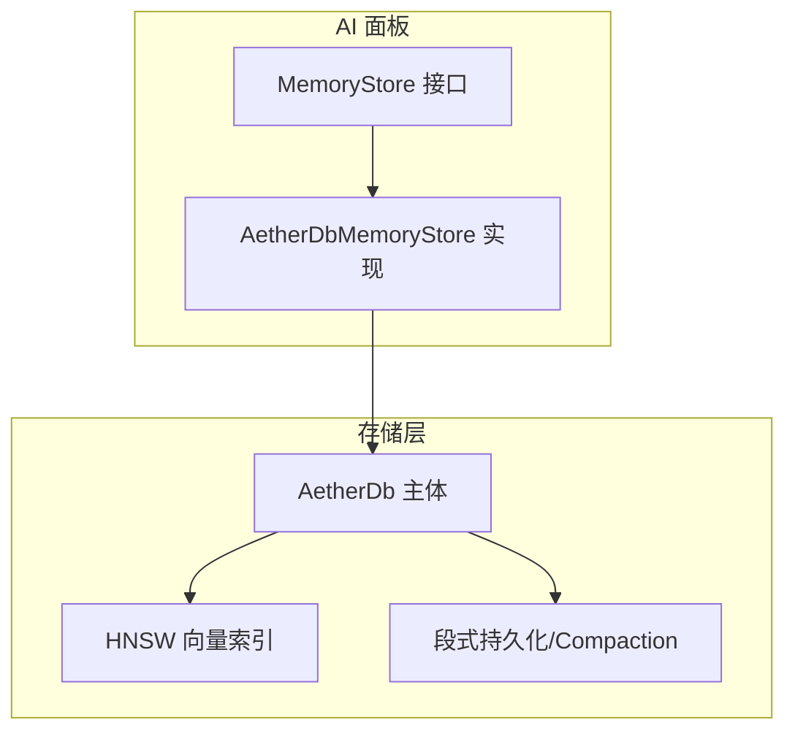
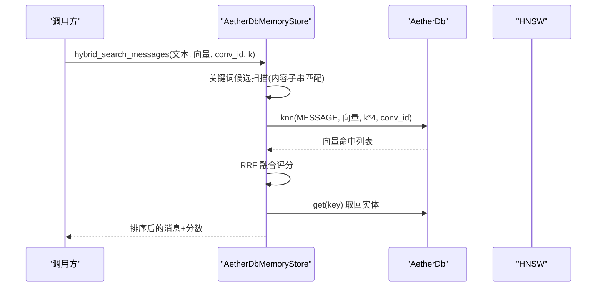
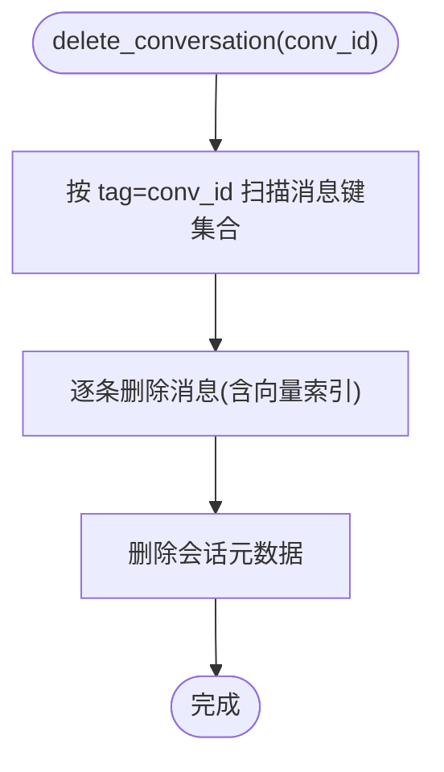
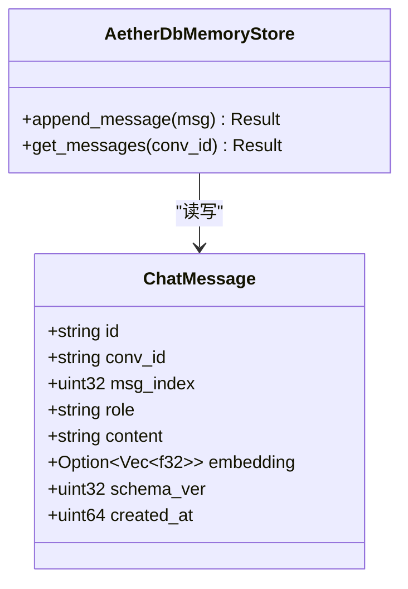
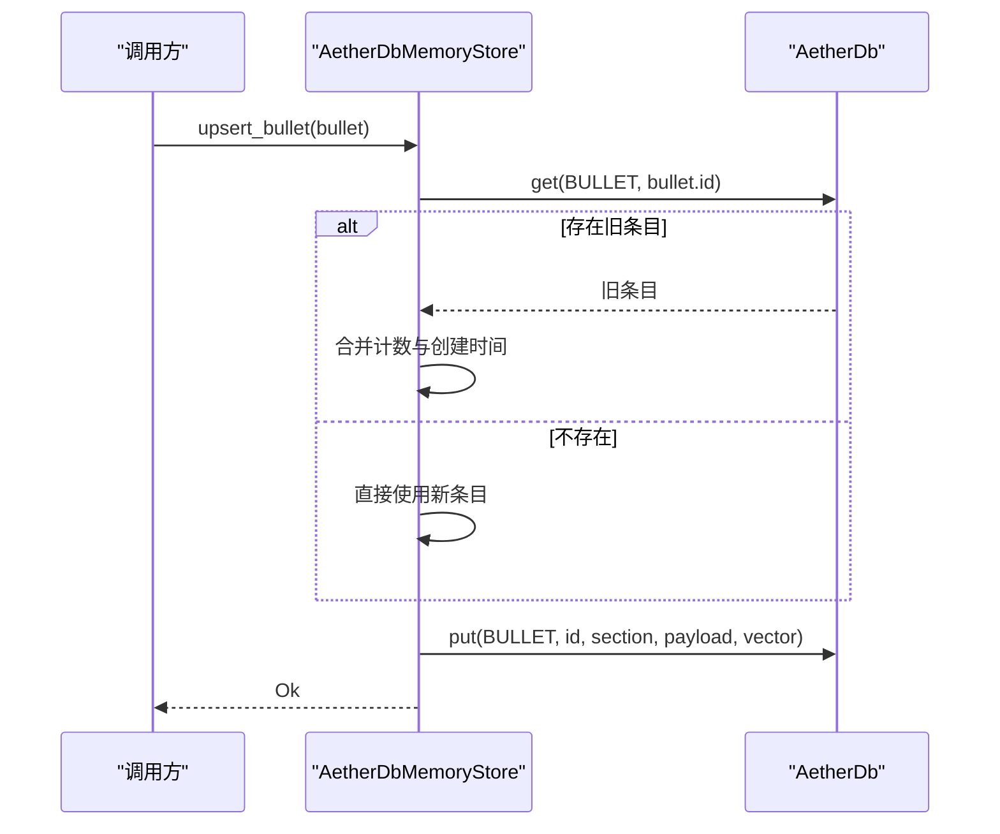
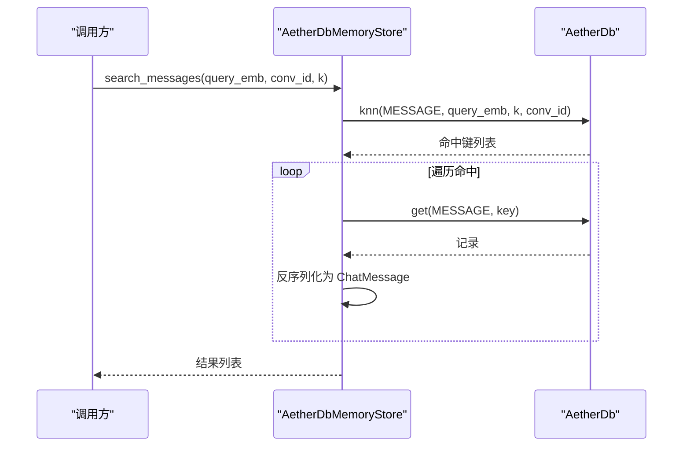
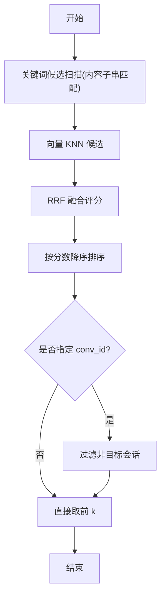
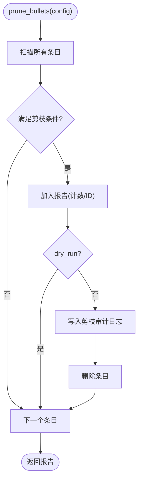
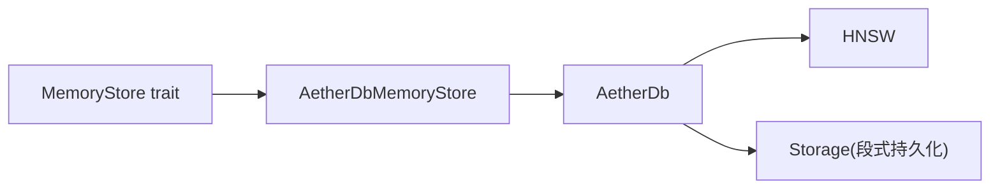

# MemoryStore 接口设计

<cite>
**本文引用的文件**
- [memory_store.rs](file://crates/aether-ai-panel/src/memory_store.rs)
- [aether_db_store.rs](file://crates/aether-ai-panel/src/aether_db_store.rs)
- [db.rs](file://crates/aether-db/src/db.rs)
</cite>

## 目录
1. [简介](#简介)
2. [项目结构](#项目结构)
3. [核心组件](#核心组件)
4. [架构总览](#架构总览)
5. [详细组件分析](#详细组件分析)
6. [依赖关系分析](#依赖关系分析)
7. [性能考量](#性能考量)
8. [故障排查指南](#故障排查指南)
9. [结论](#结论)
10. [附录：使用示例与最佳实践](#附录使用示例与最佳实践)

## 简介
本文件围绕 MemoryStore 接口进行系统化文档化，覆盖会话管理、消息持久化、playbook 条目管理、语义检索与混合检索、grow-and-refine 剪枝机制与审计日志、默认实现与扩展点（内存回收、检索优化）等。MemoryStore 是上层 AI 面板模块对“对话持久化 + ACE 上下文工程条目库”的统一抽象，当前由基于自研 AetherDB 的 AetherDbMemoryStore 提供实现，支持 HNSW 向量索引与 RRF 融合混合检索。

## 项目结构
- 接口与数据模型定义位于 aether-ai-panel 的 memory_store.rs，包含 Conversation、ChatMessage、PlaybookBullet、PruneConfig/Report/LogEntry、JsonlSessionLog 以及 MemoryStore trait。
- 具体实现位于 aether-ai-panel 的 aether_db_store.rs，实现 MemoryStore 并封装 AetherDB 的 put/get/scan/knn/compaction 能力。
- 底层存储与向量索引在 aether-db 的 db.rs 中，提供记录模型、HNSW 分域索引、标签二级索引、段级持久化与 compaction。

图表来源
- [memory_store.rs:77-201](file://crates/aether-ai-panel/src/memory_store.rs#L77-L201)
- [aether_db_store.rs:25-77](file://crates/aether-ai-panel/src/aether_db_store.rs#L25-L77)
- [db.rs:29-45](file://crates/aether-db/src/db.rs#L29-L45)

章节来源
- [memory_store.rs:1-361](file://crates/aether-ai-panel/src/memory_store.rs#L1-L361)
- [aether_db_store.rs:1-675](file://crates/aether-ai-panel/src/aether_db_store.rs#L1-L675)
- [db.rs:1-200](file://crates/aether-db/src/db.rs#L1-L200)

## 核心组件
- 数据结构
  - Conversation：会话元数据（id/title/workspace_hash/mode/时间戳/message_count）。
  - ChatMessage：单条消息（id/conv_id/msg_index/role/content/embedding/schema_ver/created_at）。
  - PlaybookBullet：ACE playbook 条目（id/section/content/helpful_count/harmful_count/embedding/时间戳）。
  - PruneConfig/PruneReport/PruneLogEntry：grow-and-refine 剪枝配置、报告与审计日志。
  - JsonlSessionLog：VS Code 同款追加式 JSONL 会话日志（热数据），用于快速回放与恢复。
- 接口
  - MemoryStore trait 定义了会话 CRUD、消息 append/get、playbook upsert/feedback/list/delete、语义检索 search_messages/search_bullets、混合检索 hybrid_search_messages、flush/shrink_memory、会话搜索 search_conversations、剪枝 prune_bullets/list_prune_log 等。

章节来源
- [memory_store.rs:28-71](file://crates/aether-ai-panel/src/memory_store.rs#L28-L71)
- [memory_store.rs:77-201](file://crates/aether-ai-panel/src/memory_store.rs#L77-L201)
- [memory_store.rs:207-246](file://crates/aether-ai-panel/src/memory_store.rs#L207-L246)
- [memory_store.rs:254-306](file://crates/aether-ai-panel/src/memory_store.rs#L254-L306)

## 架构总览
MemoryStore 作为统一抽象，屏蔽底层存储差异；AetherDbMemoryStore 将业务实体映射为 AetherDB 的 (kind, key) 记录，payload 为 JSON，向量单独存入 HNSW 索引。混合检索通过子串关键词匹配与向量 KNN 结果以 RRF 融合排序。

图表来源
- [aether_db_store.rs:304-381](file://crates/aether-ai-panel/src/aether_db_store.rs#L304-L381)
- [db.rs:146-178](file://crates/aether-db/src/db.rs#L146-L178)

章节来源
- [aether_db_store.rs:304-381](file://crates/aether-ai-panel/src/aether_db_store.rs#L304-L381)
- [db.rs:146-178](file://crates/aether-db/src/db.rs#L146-L178)

## 详细组件分析

### 会话管理
- upsert_conversation：写入会话元数据（带 workspace_hash 标签），用于工作区隔离。
- list_conversations：按 updated_at 降序返回会话列表，支持 limit。
- delete_conversation：级联删除该会话的全部消息（含向量索引），再删除会话元数据。
- rename_conversation：仅更新 title，不触碰 updated_at/message_count（默认实现为读改写，具体实现可优化）。
- clear_all_conversations/clear_orphan_conversations：批量清理全部或无工作区绑定的历史会话。

图表来源
- [aether_db_store.rs:107-115](file://crates/aether-ai-panel/src/aether_db_store.rs#L107-L115)
- [db.rs:192-200](file://crates/aether-db/src/db.rs#L192-L200)

章节来源
- [memory_store.rs:77-116](file://crates/aether-ai-panel/src/memory_store.rs#L77-L116)
- [aether_db_store.rs:80-128](file://crates/aether-ai-panel/src/aether_db_store.rs#L80-L128)

### 消息持久化
- append_message：校验向量维度，payload 不含 embedding（向量单独存），按 msg_index 顺序写入。
- get_messages：按 conv_id 标签扫描，按 msg_index 升序返回。

图表来源
- [memory_store.rs:41-54](file://crates/aether-ai-panel/src/memory_store.rs#L41-L54)
- [aether_db_store.rs:132-162](file://crates/aether-ai-panel/src/aether_db_store.rs#L132-L162)

章节来源
- [memory_store.rs:118-120](file://crates/aether-ai-panel/src/memory_store.rs#L118-L120)
- [aether_db_store.rs:132-162](file://crates/aether-ai-panel/src/aether_db_store.rs#L132-L162)

### Playbook 条目管理
- upsert_bullet：冲突时保留 helpful/harmful/created_at，只更新 section/content/updated_at，向量同步更新。
- bullet_feedback：根据 helpful 布尔值递增对应计数器，不存在条目静默成功。
- list_bullets：可按 section 过滤，按 updated_at 降序返回。
- delete_bullet：删除条目及向量索引，不存在时报错。

图表来源
- [aether_db_store.rs:166-193](file://crates/aether-ai-panel/src/aether_db_store.rs#L166-L193)

章节来源
- [memory_store.rs:122-126](file://crates/aether-ai-panel/src/memory_store.rs#L122-L126)
- [aether_db_store.rs:166-242](file://crates/aether-ai-panel/src/aether_db_store.rs#L166-L242)

### 语义检索接口
- search_messages：按 query_embedding 在 MESSAGE 类型中进行 KNN 检索，可选 conv_id 过滤，返回 (ChatMessage, distance)。
- search_bullets：按 query_embedding 在 BULLET 类型中进行 KNN 检索，返回 (PlaybookBullet, distance)。

图表来源
- [aether_db_store.rs:246-264](file://crates/aether-ai-panel/src/aether_db_store.rs#L246-L264)
- [db.rs:146-178](file://crates/aether-db/src/db.rs#L146-L178)

章节来源
- [memory_store.rs:128-139](file://crates/aether-ai-panel/src/memory_store.rs#L128-L139)
- [aether_db_store.rs:246-283](file://crates/aether-ai-panel/src/aether_db_store.rs#L246-L283)

### 混合检索能力（hybrid_search_messages）
- 关键词通道：当查询文本长度≥3 时，对 MESSAGE 内容进行子串匹配，生成候选并按出现位置排序。
- 向量通道：KNN 检索 MESSAGE，获取候选。
- RRF 融合：score = Σ 1/(RRF_K + rank)，RRF_K 固定为 60.0。
- 最终按融合分数降序返回前 k 条，并在最后阶段补齐 conv_id 过滤。

图表来源
- [aether_db_store.rs:304-381](file://crates/aether-ai-panel/src/aether_db_store.rs#L304-L381)

章节来源
- [aether_db_store.rs:304-381](file://crates/aether-ai-panel/src/aether_db_store.rs#L304-L381)

### grow-and-refine 剪枝机制与审计日志
- PruneConfig：harmful_threshold（有害阈值）、min_total_uses（最小总使用次数）、dry_run（试运行模式）。
- prune_bullets：筛选 harmful_count ≥ threshold 且 total ≥ min_total_uses 且 harmful > helpful 的条目；dry_run=false 时先写审计日志再删除条目。
- list_prune_log：按 pruned_at 降序返回审计日志条目。

图表来源
- [aether_db_store.rs:385-442](file://crates/aether-ai-panel/src/aether_db_store.rs#L385-L442)
- [memory_store.rs:207-246](file://crates/aether-ai-panel/src/memory_store.rs#L207-L246)

章节来源
- [memory_store.rs:192-201](file://crates/aether-ai-panel/src/memory_store.rs#L192-L201)
- [aether_db_store.rs:385-442](file://crates/aether-ai-panel/src/aether_db_store.rs#L385-L442)

### 默认实现与扩展点
- shrink_memory：默认空实现，AetherDbMemoryStore 覆写为强制 compaction，回收墓碑垃圾段。
- hybrid_search_messages：默认退化为纯向量检索，AetherDbMemoryStore 提供关键词+向量 RRF 融合。
- search_conversations：默认内存过滤（标题小写包含 + workspace_hash 过滤），可在实现层优化。
- update_bullet/delete_bullet：默认分别委托 upsert_bullet 与返回不支持错误，AetherDbMemoryStore 提供删除实现。

章节来源
- [memory_store.rs:143-190](file://crates/aether-ai-panel/src/memory_store.rs#L143-L190)
- [aether_db_store.rs:293-300](file://crates/aether-ai-panel/src/aether_db_store.rs#L293-L300)
- [aether_db_store.rs:233-242](file://crates/aether-ai-panel/src/aether_db_store.rs#L233-L242)

## 依赖关系分析
- MemoryStore trait 被上层 ai_warm_data / ai_agent / reflector 等模块依赖，解耦了具体存储实现。
- AetherDbMemoryStore 依赖 aether-db 的 AetherDb，利用其 kind/tag/key 模型与 HNSW 向量索引。
- AetherDb 内部维护 records、tag_index、hnsw、node_of、id_of、key_of_id 等索引结构，保证一致性。

图表来源
- [memory_store.rs:77-201](file://crates/aether-ai-panel/src/memory_store.rs#L77-L201)
- [aether_db_store.rs:25-77](file://crates/aether-ai-panel/src/aether_db_store.rs#L25-L77)
- [db.rs:29-45](file://crates/aether-db/src/db.rs#L29-L45)

章节来源
- [memory_store.rs:77-201](file://crates/aether-ai-panel/src/memory_store.rs#L77-L201)
- [aether_db_store.rs:25-77](file://crates/aether-ai-panel/src/aether_db_store.rs#L25-L77)
- [db.rs:29-45](file://crates/aether-db/src/db.rs#L29-L45)

## 性能考量
- 向量维度校验：append/upsert 时检查 embedding 维度，避免索引不一致。
- 混合检索候选池：knn 取 k*4 扩大候选集，提升召回率后再融合排序。
- 关键词匹配：仅对长度≥3 的查询启用，减少无效扫描。
- Compaction：shrink_memory 触发强制压缩，回收墓碑垃圾段，降低存储膨胀。
- 排序与截断：list_* 按 updated_at 降序并 truncate(limit)，控制内存占用。

[本节为通用性能建议，无需特定文件引用]

## 故障排查指南
- 向量维度不匹配：检查 embedding_dim 初始化与传入向量长度一致。
- 会话不存在：rename_conversation 会报错，需确认会话已存在。
- 条目不存在：delete_bullet 会报错；bullet_feedback 对不存在条目静默成功。
- 混合检索为空：确认查询文本长度≥3，或向量检索有命中；检查 conv_id 过滤是否过严。
- 剪枝未生效：检查 PruneConfig 阈值与 dry_run 设置；查看 list_prune_log 审计日志。

章节来源
- [aether_db_store.rs:56-65](file://crates/aether-ai-panel/src/aether_db_store.rs#L56-L65)
- [aether_db_store.rs:117-128](file://crates/aether-ai-panel/src/aether_db_store.rs#L117-L128)
- [aether_db_store.rs:195-217](file://crates/aether-ai-panel/src/aether_db_store.rs#L195-L217)
- [aether_db_store.rs:233-242](file://crates/aether-ai-panel/src/aether_db_store.rs#L233-L242)
- [aether_db_store.rs:304-381](file://crates/aether-ai-panel/src/aether_db_store.rs#L304-L381)
- [aether_db_store.rs:385-442](file://crates/aether-ai-panel/src/aether_db_store.rs#L385-L442)

## 结论
MemoryStore 提供了清晰、可扩展的接口，将会话、消息、playbook 管理与语义/混合检索统一抽象。AetherDbMemoryStore 基于 AetherDB 实现了高性能的向量检索与混合检索，并通过 grow-and-refine 剪枝机制与审计日志保障条目质量。默认实现提供了良好的扩展点，便于在不同场景下定制行为（如内存回收、检索优化）。

[本节为总结性内容，无需特定文件引用]

## 附录：使用示例与最佳实践
以下示例展示典型用法路径与注意事项，避免直接粘贴代码内容。

- 初始化与打开
  - 使用 AetherDbMemoryStore::open(dir, embedding_dim) 打开或创建数据库，确保 embedding_dim 与模型输出维度一致。
  - 参考路径：[aether_db_store.rs:32-44](file://crates/aether-ai-panel/src/aether_db_store.rs#L32-L44)

- 会话管理
  - 写入会话：upsert_conversation(&Conversation{...})
  - 列出会话：list_conversations(limit)
  - 删除会话：delete_conversation(conv_id)（级联删除消息与向量）
  - 重命名会话：rename_conversation(conv_id, new_title)
  - 参考路径：[memory_store.rs:77-116](file://crates/aether-ai-panel/src/memory_store.rs#L77-L116), [aether_db_store.rs:80-128](file://crates/aether-ai-panel/src/aether_db_store.rs#L80-L128)

- 消息持久化
  - 追加消息：append_message(&ChatMessage{...})，embedding 可为空，后台补齐
  - 读取消息：get_messages(conv_id) 按 msg_index 升序返回
  - 参考路径：[memory_store.rs:118-120](file://crates/aether-ai-panel/src/memory_store.rs#L118-L120), [aether_db_store.rs:132-162](file://crates/aether-ai-panel/src/aether_db_store.rs#L132-L162)

- Playbook 条目管理
  - 新增/更新：upsert_bullet(&PlaybookBullet{...})，冲突时保留计数与创建时间
  - 反馈：bullet_feedback(bullet_id, helpful)
  - 列出：list_bullets(section?)
  - 删除：delete_bullet(bullet_id)
  - 参考路径：[memory_store.rs:122-126](file://crates/aether-ai-panel/src/memory_store.rs#L122-L126), [aether_db_store.rs:166-242](file://crates/aether-ai-panel/src/aether_db_store.rs#L166-L242)

- 语义检索
  - 消息检索：search_messages(query_embedding, conv_id?, k)
  - 条目检索：search_bullets(query_embedding, k)
  - 参考路径：[memory_store.rs:128-139](file://crates/aether-ai-panel/src/memory_store.rs#L128-L139), [aether_db_store.rs:246-283](file://crates/aether-ai-panel/src/aether_db_store.rs#L246-L283)

- 混合检索
  - hybrid_search_messages(query_text, query_embedding, conv_id?, k)
  - 注意：query_text 长度≥3 才启用关键词通道；RRF_K=60.0
  - 参考路径：[aether_db_store.rs:304-381](file://crates/aether-ai-panel/src/aether_db_store.rs#L304-L381)

- 剪枝与审计
  - 配置：PruneConfig{harmful_threshold, min_total_uses, dry_run}
  - 执行：prune_bullets(&config) -> PruneReport
  - 审计：list_prune_log(limit)
  - 参考路径：[memory_store.rs:207-246](file://crates/aether-ai-panel/src/memory_store.rs#L207-L246), [aether_db_store.rs:385-442](file://crates/aether-ai-panel/src/aether_db_store.rs#L385-L442)

- 内存回收
  - shrink_memory() 触发 compaction，回收墓碑垃圾段
  - 参考路径：[aether_db_store.rs:293-300](file://crates/aether-ai-panel/src/aether_db_store.rs#L293-L300)

- JSONL 会话日志（热数据）
  - 打开：JsonlSessionLog::open(dir, session_id)
  - 追加：append(&ChatMessage)
  - 回放：read_all()
  - 参考路径：[memory_store.rs:254-306](file://crates/aether-ai-panel/src/memory_store.rs#L254-L306)

章节来源
- [aether_db_store.rs:32-44](file://crates/aether-ai-panel/src/aether_db_store.rs#L32-L44)
- [memory_store.rs:77-116](file://crates/aether-ai-panel/src/memory_store.rs#L77-L116)
- [aether_db_store.rs:80-128](file://crates/aether-ai-panel/src/aether_db_store.rs#L80-L128)
- [memory_store.rs:118-120](file://crates/aether-ai-panel/src/memory_store.rs#L118-L120)
- [aether_db_store.rs:132-162](file://crates/aether-ai-panel/src/aether_db_store.rs#L132-L162)
- [memory_store.rs:122-126](file://crates/aether-ai-panel/src/memory_store.rs#L122-L126)
- [aether_db_store.rs:166-242](file://crates/aether-ai-panel/src/aether_db_store.rs#L166-L242)
- [memory_store.rs:128-139](file://crates/aether-ai-panel/src/memory_store.rs#L128-L139)
- [aether_db_store.rs:246-283](file://crates/aether-ai-panel/src/aether_db_store.rs#L246-L283)
- [aether_db_store.rs:304-381](file://crates/aether-ai-panel/src/aether_db_store.rs#L304-L381)
- [memory_store.rs:207-246](file://crates/aether-ai-panel/src/memory_store.rs#L207-L246)
- [aether_db_store.rs:385-442](file://crates/aether-ai-panel/src/aether_db_store.rs#L385-L442)
- [aether_db_store.rs:293-300](file://crates/aether-ai-panel/src/aether_db_store.rs#L293-L300)
- [memory_store.rs:254-306](file://crates/aether-ai-panel/src/memory_store.rs#L254-L306)