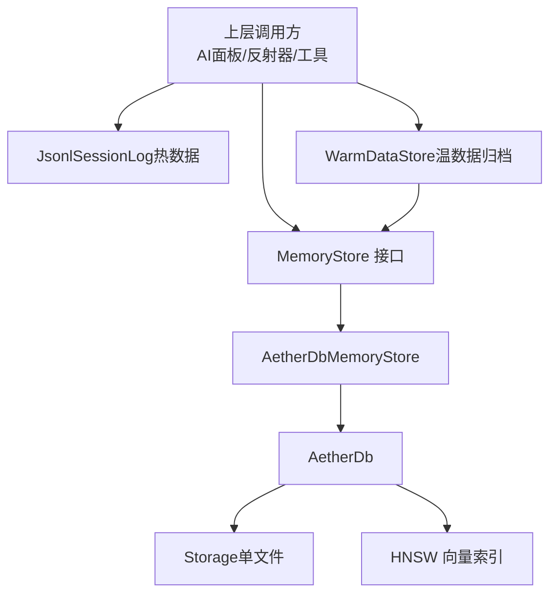
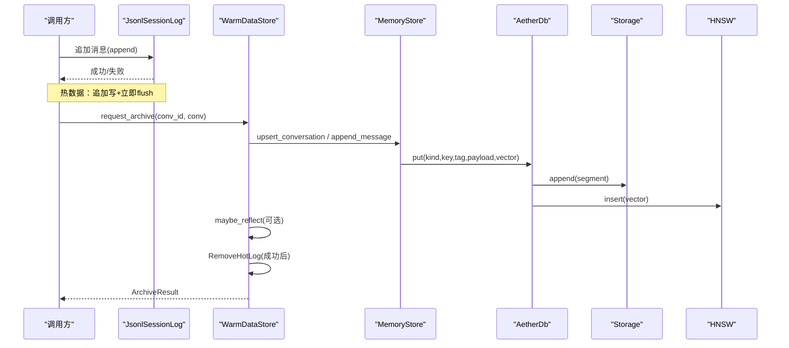
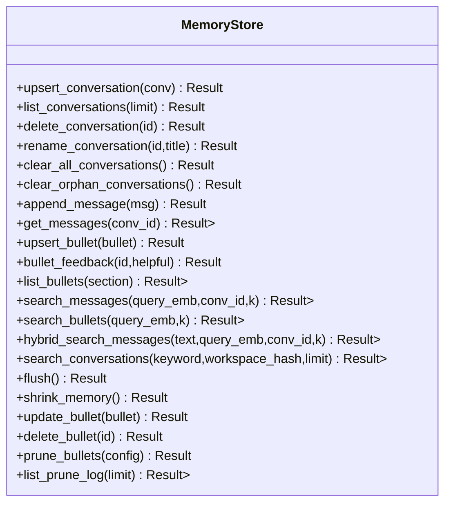
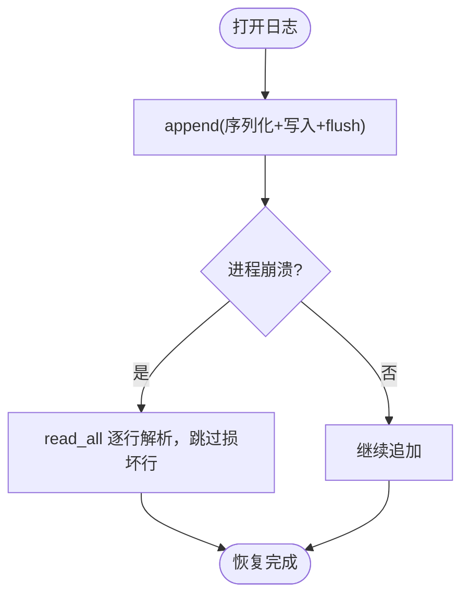
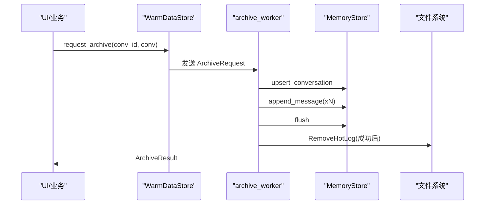
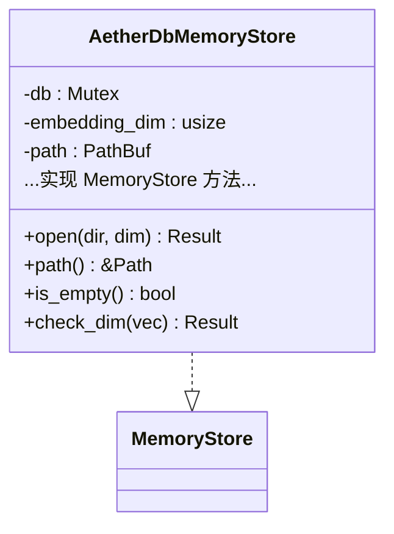
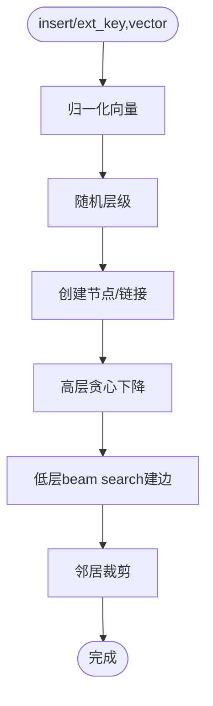
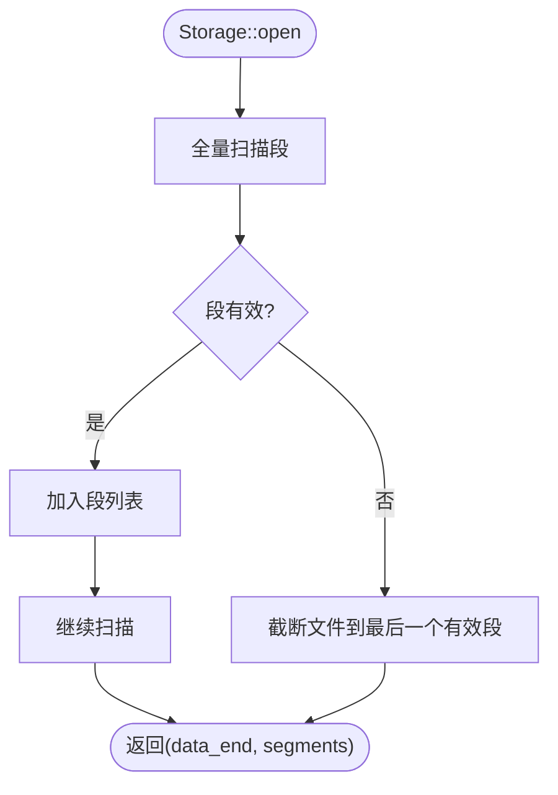
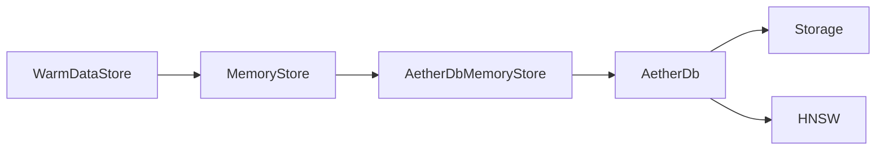

# 存储架构设计

<cite>
**本文引用的文件**
- [memory_store.rs](file://crates/aether-ai-panel/src/memory_store.rs)
- [aether_db_store.rs](file://crates/aether-ai-panel/src/aether_db_store.rs)
- [ai_warm_data.rs](file://crates/aether-ai-panel/src/ai_warm_data.rs)
- [db.rs](file://crates/aether-db/src/db.rs)
- [hnsw.rs](file://crates/aether-db/src/hnsw.rs)
- [storage.rs](file://crates/aether-db/src/storage.rs)
</cite>

## 目录
1. [简介](#简介)
2. [项目结构](#项目结构)
3. [核心组件](#核心组件)
4. [架构总览](#架构总览)
5. [详细组件分析](#详细组件分析)
6. [依赖关系分析](#依赖关系分析)
7. [性能考量](#性能考量)
8. [故障排查指南](#故障排查指南)
9. [结论](#结论)
10. [附录](#附录)

## 简介
本文件面向“三阶段存储架构”（热数据、温数据、冷数据）的设计与实现，系统性说明：
- 热数据：JSONL 会话日志的追加式写入、崩溃恢复与性能优化。
- 温数据：后台异步归档到自研 AetherDB，建立向量索引并支持语义检索。
- 冷数据：AetherDB 单文件持久化、HNSW 向量索引、自动 compaction 与崩溃恢复。
同时文档化 MemoryStore trait 的接口设计（会话管理、消息持久化、playbook 条目管理等），以及不同存储层之间的数据流转与迁移策略。

## 项目结构
围绕存储的关键模块分布如下：
- 记忆存储适配层与数据结构定义：memory_store.rs
- MemoryStore 的 AetherDB 实现：aether_db_store.rs
- 温数据归档与后台线程：ai_warm_data.rs
- 自研数据库主体：db.rs
- HNSW 近似最近邻索引：hnsw.rs
- 单文件存储层（段编解码、compaction、崩溃恢复）：storage.rs



图表来源
- [memory_store.rs:77-201](file://crates/aether-ai-panel/src/memory_store.rs#L77-L201)
- [aether_db_store.rs:25-75](file://crates/aether-ai-panel/src/aether_db_store.rs#L25-L75)
- [db.rs:29-45](file://crates/aether-db/src/db.rs#L29-L45)
- [storage.rs:175-182](file://crates/aether-db/src/storage.rs#L175-L182)
- [hnsw.rs:37-52](file://crates/aether-db/src/hnsw.rs#L37-L52)
- [ai_warm_data.rs:52-108](file://crates/aether-ai-panel/src/ai_warm_data.rs#L52-L108)

章节来源
- [memory_store.rs:1-201](file://crates/aether-ai-panel/src/memory_store.rs#L1-L201)
- [aether_db_store.rs:1-75](file://crates/aether-ai-panel/src/aether_db_store.rs#L1-L75)
- [ai_warm_data.rs:1-108](file://crates/aether-ai-panel/src/ai_warm_data.rs#L1-L108)
- [db.rs:1-45](file://crates/aether-db/src/db.rs#L1-L45)
- [hnsw.rs:1-52](file://crates/aether-db/src/hnsw.rs#L1-L52)
- [storage.rs:1-182](file://crates/aether-db/src/storage.rs#L1-L182)

## 核心组件
- MemoryStore trait：统一抽象会话、消息、playbook 条目的增删改查、语义检索、混合检索、剪枝审计等能力，屏蔽底层实现差异。
- JsonlSessionLog：热数据阶段的追加式 JSONL 会话日志，具备崩溃恢复与简单重放能力。
- WarmDataStore：温数据归档入口，后台线程批量将活跃会话归档至 MemoryStore，并在成功后清理热数据日志。
- AetherDbMemoryStore：MemoryStore 的具体实现，基于 AetherDB 进行持久化与向量检索。
- AetherDb：单文件嵌入式数据库，维护内存索引（records、tag_index、HNSW）、KNN 检索、compaction。
- HNSW：纯 Rust 实现的近似最近邻索引，支持增量插入、墓碑删除、按规模退化暴力搜索。
- Storage：单文件格式、段编解码、CRC 校验、append-only 写入、compaction 与崩溃恢复。

章节来源
- [memory_store.rs:77-201](file://crates/aether-ai-panel/src/memory_store.rs#L77-L201)
- [memory_store.rs:249-306](file://crates/aether-ai-panel/src/memory_store.rs#L249-L306)
- [ai_warm_data.rs:52-108](file://crates/aether-ai-panel/src/ai_warm_data.rs#L52-L108)
- [aether_db_store.rs:25-75](file://crates/aether-ai-panel/src/aether_db_store.rs#L25-L75)
- [db.rs:29-45](file://crates/aether-db/src/db.rs#L29-L45)
- [hnsw.rs:37-52](file://crates/aether-db/src/hnsw.rs#L37-L52)
- [storage.rs:175-182](file://crates/aether-db/src/storage.rs#L175-L182)

## 架构总览
三阶段存储的数据流如下：
- 热数据：用户交互产生的消息以 JSONL 追加写入，每行一条消息，立即 flush；崩溃时最多丢失最后一行不完整记录。
- 温数据：在空闲或窗口切换时，后台线程将完整会话批量归档为 MemoryStore 记录，生成向量并建立 HNSW 索引；归档成功则删除对应热日志。
- 冷数据：AetherDB 单文件通过 append-only 段存储，配合 compaction 回收垃圾段；启动时全量扫描重建内存索引，保证一致性。



图表来源
- [memory_store.rs:259-306](file://crates/aether-ai-panel/src/memory_store.rs#L259-L306)
- [ai_warm_data.rs:218-282](file://crates/aether-ai-panel/src/ai_warm_data.rs#L218-L282)
- [aether_db_store.rs:132-151](file://crates/aether-ai-panel/src/aether_db_store.rs#L132-L151)
- [db.rs:146-178](file://crates/aether-db/src/db.rs#L146-L178)
- [storage.rs:260-267](file://crates/aether-db/src/storage.rs#L260-L267)
- [hnsw.rs:171-215](file://crates/aether-db/src/hnsw.rs#L171-L215)

## 详细组件分析

### MemoryStore trait 接口设计
- 会话管理：upsert/list/delete/rename/clear_all/clear_orphan。
- 消息持久化：append/get，支持按会话 tag 级联检索。
- playbook 条目：upsert/update/delete/feedback/list，支持权重计数（helpful/harmful）。
- 语义检索：search_messages/search_bullets，返回 (实体, 距离)。
- 混合检索：hybrid_search_messages，默认退化为纯向量检索，实现可融合关键词与向量。
- 内存回收：shrink_memory，触发 compaction 释放空间。
- grow-and-refine 剪枝：prune_bullets/list_prune_log，支持 dry_run 与审计日志。



图表来源
- [memory_store.rs:77-201](file://crates/aether-ai-panel/src/memory_store.rs#L77-L201)

章节来源
- [memory_store.rs:77-201](file://crates/aether-ai-panel/src/memory_store.rs#L77-L201)

### JsonlSessionLog 热数据存储方案
- 追加式写入：每条消息一行 JSON，append 后立即 flush，确保崩溃后最多丢失最后一行。
- 崩溃恢复：read_all 逐行解析，跳过损坏或不完整行，保证重放安全。
- 性能优化：小文件顺序追加，适合高频写入；归档成功后可删除，避免长期占用磁盘。



图表来源
- [memory_store.rs:259-306](file://crates/aether-ai-panel/src/memory_store.rs#L259-L306)

章节来源
- [memory_store.rs:249-306](file://crates/aether-ai-panel/src/memory_store.rs#L249-L306)

### WarmDataStore 温数据归档流程
- 触发时机：关闭聊天窗口、切换会话、空闲状态。
- 归档步骤：写入会话元数据、写入所有消息（含向量）、flush 落盘；成功后删除热日志。
- 可选反思：归档成功后根据配置执行 ACE Reflector，沉淀策略条目。
- 后台线程：通过 channel 发送请求，结果回传主线程轮询。



图表来源
- [ai_warm_data.rs:218-282](file://crates/aether-ai-panel/src/ai_warm_data.rs#L218-L282)
- [ai_warm_data.rs:311-348](file://crates/aether-ai-panel/src/ai_warm_data.rs#L311-L348)

章节来源
- [ai_warm_data.rs:52-108](file://crates/aether-ai-panel/src/ai_warm_data.rs#L52-L108)
- [ai_warm_data.rs:218-282](file://crates/aether-ai-panel/src/ai_warm_data.rs#L218-L282)
- [ai_warm_data.rs:311-348](file://crates/aether-ai-panel/src/ai_warm_data.rs#L311-L348)

### AetherDbMemoryStore 实现要点
- 会话：kind=CONVERSATION，tag=workspace_hash；列表按 updated_at 降序。
- 消息：kind=MESSAGE，tag=conv_id；读取按 msg_index 升序；embedding 单独存 vector 字段。
- playbook：kind=BULLET，tag=section；upsert 冲突合并保留计数器；反馈更新计数。
- 语义检索：knn 按 kind 分域检索，支持 tag_filter 过滤会话。
- 混合检索：子串关键词匹配 + 向量 RRF 融合，提升召回与精度。
- 剪枝审计：prune_bullets 输出报告并写 PruneLog，dry_run 仅候选不删除。



图表来源
- [aether_db_store.rs:25-75](file://crates/aether-ai-panel/src/aether_db_store.rs#L25-L75)
- [aether_db_store.rs:77-443](file://crates/aether-ai-panel/src/aether_db_store.rs#L77-L443)

章节来源
- [aether_db_store.rs:77-443](file://crates/aether-ai-panel/src/aether_db_store.rs#L77-L443)

### AetherDB 自研数据库
- 记录模型：Record(key, tag, payload, vector)，KnnHit(key, distance)。
- 内存索引：records((kind,key)->Record)、tag_index((kind,tag)->keys)、HNSW(kind->索引)、node_of/id_of/key_of_id 映射。
- 写入/删除：put 追加段并更新索引；delete 追加墓碑段；delete_by_tag 级联删除。
- KNN：小规模集合走暴力精确搜索；大规模走 HNSW，支持 tag_filter。
- Compaction：垃圾阈值触发重写存活段，原子替换文件。
- 崩溃恢复：启动时全量扫描段序列，fold_segments 去重与墓碑处理，截断损坏尾部。

```mermaid
classDiagram
class AetherDb {
-storage : Storage
-dim : usize
-records : HashMap<(u8,String), Record>
-tag_index : HashMap<(u8,String), HashSet<String>>
-hnsw : HashMap<u8, Hnsw>
-node_of : HashMap<(u8,String), usize>
-next_vec_id : u64
-id_of : HashMap<(u8,String), u64>
-key_of_id : HashMap<u64,(u8,String)>
+open(path,dim) Result
+put(kind,key,tag,payload,vector) Result
+delete(kind,key) Result<bool>
+delete_by_tag(kind,tag) Result<usize>
+scan(kind) Vec<&Record>
+scan_by_tag(kind,tag) Vec<&Record>
+scan_prefix(kind,prefix) Vec<&Record>
+knn(kind,query,k,tag_filter) Vec<KnnHit>
+flush() Result
+force_compact() Result
}
AetherDb --> Storage : "使用"
AetherDb --> Hnsw : "按kind分域"
```

图表来源
- [db.rs:29-45](file://crates/aether-db/src/db.rs#L29-L45)
- [db.rs:146-178](file://crates/aether-db/src/db.rs#L146-L178)
- [db.rs:241-300](file://crates/aether-db/src/db.rs#L241-L300)
- [db.rs:307-332](file://crates/aether-db/src/db.rs#L307-L332)

章节来源
- [db.rs:146-332](file://crates/aether-db/src/db.rs#L146-L332)

### HNSW 向量索引
- 参数：M=8、Mmax0=16、ef_construction=64，针对编辑器规模定制。
- 插入：归一化向量，随机层级，高层贪心下降，低层 beam search 建边，邻居裁剪。
- 删除：墓碑标记，搜索时跳过；compaction 后由上层重建。
- 搜索：小规模直接暴力精确搜索；大规模从顶层 entry 开始逐层下降，最后层 ef 取候选并过滤墓碑。



图表来源
- [hnsw.rs:171-215](file://crates/aether-db/src/hnsw.rs#L171-L215)
- [hnsw.rs:224-260](file://crates/aether-db/src/hnsw.rs#L224-L260)

章节来源
- [hnsw.rs:37-52](file://crates/aether-db/src/hnsw.rs#L37-L52)
- [hnsw.rs:171-260](file://crates/aether-db/src/hnsw.rs#L171-L260)

### Storage 单文件存储与崩溃恢复
- 文件布局：4KB 头（magic/version/dim）+ 数据段（append-only）。
- 段格式：定长头（magic/kind/flags/tag_len/key_len/payload_len/vec_len）+ 变长体 + CRC32。
- 恢复：mmap 加速扫描，连续有效段保留，首个损坏/截断处停止；尾部截断修复。
- Compaction：临时文件写入存活段，fsync 后原子替换原文件，重置垃圾统计。



图表来源
- [storage.rs:184-258](file://crates/aether-db/src/storage.rs#L184-L258)
- [storage.rs:280-311](file://crates/aether-db/src/storage.rs#L280-L311)

章节来源
- [storage.rs:184-311](file://crates/aether-db/src/storage.rs#L184-L311)

## 依赖关系分析
- 上层对 MemoryStore 的依赖解耦了具体存储实现，便于替换或扩展。
- AetherDbMemoryStore 依赖 AetherDb 提供持久化与向量检索能力。
- AetherDb 依赖 Storage 负责 I/O 与段管理，依赖 HNSW 提供近似最近邻搜索。
- WarmDataStore 协调热数据与温数据的迁移，并通过 channel 与后台线程通信。



图表来源
- [memory_store.rs:77-201](file://crates/aether-ai-panel/src/memory_store.rs#L77-L201)
- [aether_db_store.rs:25-75](file://crates/aether-ai-panel/src/aether_db_store.rs#L25-L75)
- [db.rs:29-45](file://crates/aether-db/src/db.rs#L29-L45)
- [storage.rs:175-182](file://crates/aether-db/src/storage.rs#L175-L182)
- [hnsw.rs:37-52](file://crates/aether-db/src/hnsw.rs#L37-L52)
- [ai_warm_data.rs:52-108](file://crates/aether-ai-panel/src/ai_warm_data.rs#L52-L108)

章节来源
- [memory_store.rs:77-201](file://crates/aether-ai-panel/src/memory_store.rs#L77-L201)
- [aether_db_store.rs:25-75](file://crates/aether-ai-panel/src/aether_db_store.rs#L25-L75)
- [db.rs:29-45](file://crates/aether-db/src/db.rs#L29-L45)
- [storage.rs:175-182](file://crates/aether-db/src/storage.rs#L175-L182)
- [hnsw.rs:37-52](file://crates/aether-db/src/hnsw.rs#L37-L52)
- [ai_warm_data.rs:52-108](file://crates/aether-ai-panel/src/ai_warm_data.rs#L52-L108)

## 性能考量
- 热数据：JSONL 追加写 + 立即 flush，适合高吞吐写入；读路径线性扫描，适合小会话。
- 温数据：后台归档避免阻塞 UI；批量写入减少系统调用；向量入库后进行 HNSW 索引构建。
- 冷数据：HNSW 在小规模退化暴力搜索保证准确性；compaction 阈值控制（垃圾 >1MB 且占比超 1/3）平衡写入与回收；mmap 加速恢复扫描。
- 混合检索：关键词子串匹配与向量 RRF 融合，兼顾精确与召回。

[本节为通用指导，无需特定文件引用]

## 故障排查指南
- JSONL 损坏行：read_all 会跳过不完整行，检查日志文件末尾是否被截断。
- 维度不匹配：AetherDbMemoryStore.check_dim 与 AetherDb.put 均会拒绝错误维度，确认嵌入模型维度一致。
- 崩溃恢复：Storage::open 会在发现损坏段时截断文件，重新打开即可恢复；若出现 magic 或维度不匹配，需检查文件是否被外部修改。
- Compaction 失败：force_compact 可能因文件替换失败报错，检查权限与磁盘空间。
- 归档失败：WarmDataStore 后台线程返回 ArchiveResult::Failed，查看错误信息定位 MemoryStore 或 AetherDB 问题。

章节来源
- [memory_store.rs:286-301](file://crates/aether-ai-panel/src/memory_store.rs#L286-L301)
- [aether_db_store.rs:56-65](file://crates/aether-ai-panel/src/aether_db_store.rs#L56-L65)
- [db.rs:155-163](file://crates/aether-db/src/db.rs#L155-L163)
- [storage.rs:208-246](file://crates/aether-db/src/storage.rs#L208-L246)
- [storage.rs:280-311](file://crates/aether-db/src/storage.rs#L280-L311)
- [ai_warm_data.rs:237-282](file://crates/aether-ai-panel/src/ai_warm_data.rs#L237-L282)

## 结论
本存储架构通过热、温、冷三层协同，实现了高吞吐写入、可靠持久化与高效语义检索：
- 热数据 JSONL 保障快速写入与崩溃恢复。
- 温数据后台归档建立向量索引，支持语义检索与策略沉淀。
- 冷数据 AetherDB 提供单文件持久化、HNSW 索引与自动 compaction，确保数据一致性与空间效率。
MemoryStore 接口统一了上层访问方式，便于扩展与替换实现。整体设计兼顾性能、可靠性与可维护性。

[本节为总结，无需特定文件引用]

## 附录
- 关键数据结构：
  - Conversation：会话元数据（id/title/workspace_hash/mode/时间戳/message_count）。
  - ChatMessage：消息（id/conv_id/msg_index/role/content/embedding/schema_ver/created_at）。
  - PlaybookBullet：playbook 条目（id/section/content/helpful_count/harmful_count/embedding/时间戳）。
- 关键算法：
  - fold_segments：按 (kind,key) 折叠段序列，墓碑表示删除，计算垃圾字节。
  - cosine_distance：归一化向量的余弦距离。
  - normalize：L2 归一化。

章节来源
- [memory_store.rs:28-71](file://crates/aether-ai-panel/src/memory_store.rs#L28-L71)
- [storage.rs:320-341](file://crates/aether-db/src/storage.rs#L320-L341)
- [hnsw.rs:7-30](file://crates/aether-db/src/hnsw.rs#L7-L30)