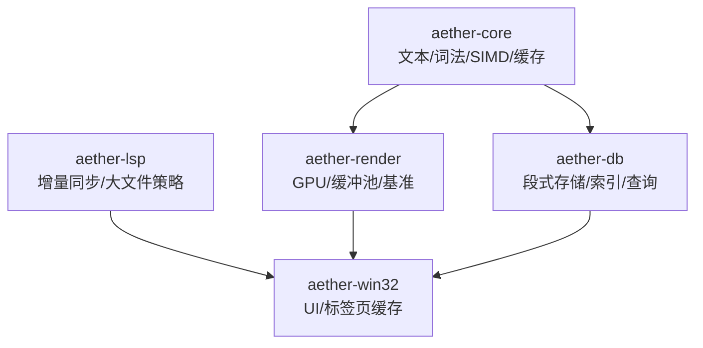
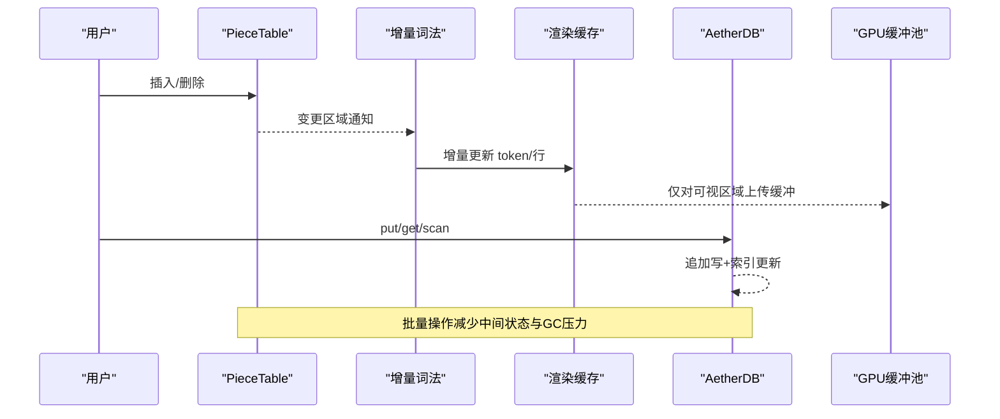
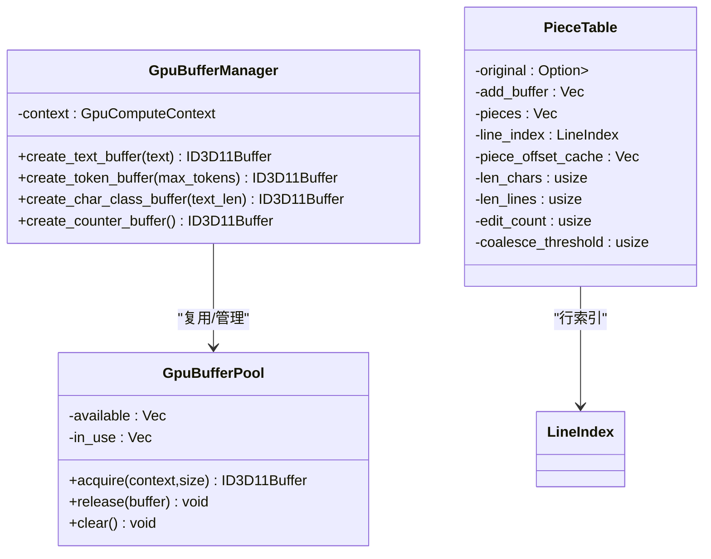
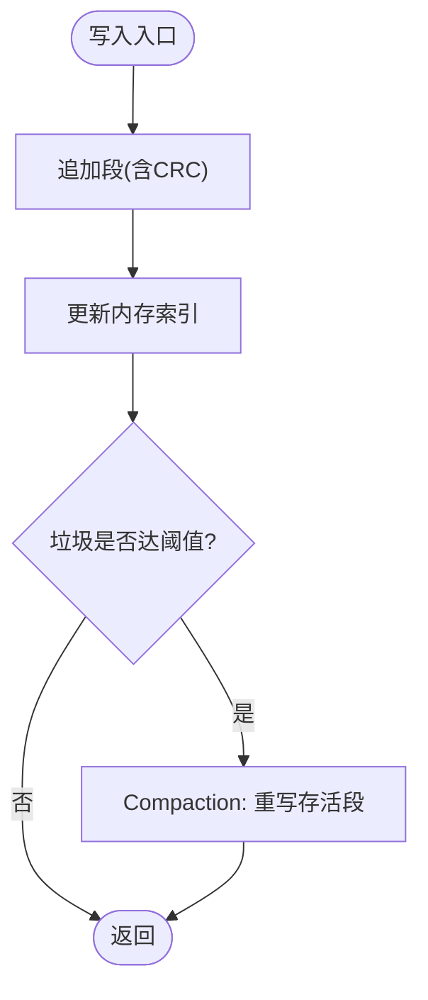
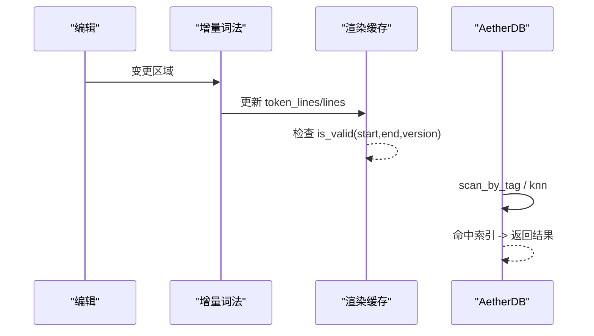
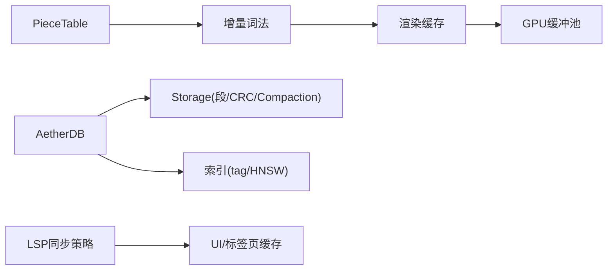

# 性能优化策略

<cite>
**本文引用的文件**
- [crates/aether-core/src/benchmarks.rs](file://crates/aether-core/src/benchmarks.rs)
- [crates/aether-render/src/gpu/benchmark.rs](file://crates/aether-render/src/gpu/benchmark.rs)
- [crates/aether-core/src/buffer/piece_table.rs](file://crates/aether-core/src/buffer/piece_table.rs)
- [crates/aether-core/src/simd_utils.rs](file://crates/aether-core/src/simd_utils.rs)
- [crates/aether-core/src/render_prep.rs](file://crates/aether-core/src/render_prep.rs)
- [crates/aether-db/src/db.rs](file://crates/aether-db/src/db.rs)
- [crates/aether-db/src/storage.rs](file://crates/aether-db/src/storage.rs)
- [crates/aether-render/src/gpu/render.rs](file://crates/aether-render/src/gpu/render.rs)
- [crates/aether-render/src/gpu/buffer.rs](file://crates/aether-render/src/gpu/buffer.rs)
- [crates/aether-lsp/src/incremental_sync.rs](file://crates/aether-lsp/src/incremental_sync.rs)
- [crates/aether-win32/src/tabs.rs](file://crates/aether-win32/src/tabs.rs)
</cite>

## 目录
1. [简介](#简介)
2. [项目结构](#项目结构)
3. [核心组件](#核心组件)
4. [架构总览](#架构总览)
5. [详细组件分析](#详细组件分析)
6. [依赖关系分析](#依赖关系分析)
7. [性能考量](#性能考量)
8. [故障排查指南](#故障排查指南)
9. [结论](#结论)
10. [附录](#附录)

## 简介
本文件面向“牧羊人编辑器”的性能优化，围绕内存管理、存储层、查询与缓存、并发控制、I/O 优化以及性能监控与分析展开。文档基于仓库中的实际实现进行解读，并提供可视化图示与可操作的优化建议，帮助读者理解并落地高性能实践。

## 项目结构
本项目采用多 crate 的模块化设计：
- aether-core：文本缓冲区（PieceTable）、增量词法、SIMD 工具、渲染预处理与缓存等核心算法与数据结构。
- aether-db：自研键值/向量存储，包含段式追加写、compaction、索引与查询。
- aether-render：GPU 渲染管线、缓冲池、基准测试与着色器相关逻辑。
- aether-lsp：增量同步与大文件同步策略。
- aether-win32：UI 与窗口侧缓存、标签页视图等。

图表来源
- [crates/aether-core/src/buffer/piece_table.rs:1-200](file://crates/aether-core/src/buffer/piece_table.rs#L1-L200)
- [crates/aether-db/src/db.rs:119-333](file://crates/aether-db/src/db.rs#L119-L333)
- [crates/aether-render/src/gpu/render.rs:153-219](file://crates/aether-render/src/gpu/render.rs#L153-L219)
- [crates/aether-lsp/src/incremental_sync.rs:336-351](file://crates/aether-lsp/src/incremental_sync.rs#L336-L351)

章节来源
- [crates/aether-core/src/buffer/piece_table.rs:1-200](file://crates/aether-core/src/buffer/piece_table.rs#L1-L200)
- [crates/aether-db/src/db.rs:119-333](file://crates/aether-db/src/db.rs#L119-L333)
- [crates/aether-render/src/gpu/render.rs:153-219](file://crates/aether-render/src/gpu/render.rs#L153-L219)
- [crates/aether-lsp/src/incremental_sync.rs:336-351](file://crates/aether-lsp/src/incremental_sync.rs#L336-L351)

## 核心组件
- 文本缓冲区与历史：PieceTable 提供 O(1) 插入/删除、零拷贝大文件打开；持久化历史支持批量操作减少中间快照开销。
- SIMD 加速：换行计数、字节查找、空白跳过等热点路径使用 AVX2/SSE2 分派或 SWAR 向量化。
- 渲染预处理与缓存：RenderCache 按行范围与版本维护缓存，避免重复解析与高亮。
- 存储层：AetherDB 以单文件追加写、段级 CRC、垃圾回收与 compaction 保证写入吞吐与空间效率。
- GPU 缓冲池：GpuBufferPool/GpuBufferManager 复用 GPU 缓冲区，降低分配/释放成本。
- 增量同步：LargeFileSyncStrategy 针对大文件切换完整/增量同步策略，降低网络与 CPU 压力。
- UI 缓存：标签页视图维护可见窗口内的行缓存，滑动时尽量复用已有数据。

章节来源
- [crates/aether-core/src/buffer/piece_table.rs:1-200](file://crates/aether-core/src/buffer/piece_table.rs#L1-L200)
- [crates/aether-core/src/simd_utils.rs:1-200](file://crates/aether-core/src/simd_utils.rs#L1-L200)
- [crates/aether-core/src/render_prep.rs:89-193](file://crates/aether-core/src/render_prep.rs#L89-L193)
- [crates/aether-db/src/db.rs:119-333](file://crates/aether-db/src/db.rs#L119-L333)
- [crates/aether-render/src/gpu/render.rs:153-219](file://crates/aether-render/src/gpu/render.rs#L153-L219)
- [crates/aether-lsp/src/incremental_sync.rs:336-351](file://crates/aether-lsp/src/incremental_sync.rs#L336-L351)
- [crates/aether-win32/src/tabs.rs:213-239](file://crates/aether-win32/src/tabs.rs#L213-L239)

## 架构总览
下图展示从编辑输入到渲染与存储的关键路径，突出缓存、增量更新与批处理点。

图表来源
- [crates/aether-core/src/buffer/piece_table.rs:1-200](file://crates/aether-core/src/buffer/piece_table.rs#L1-L200)
- [crates/aether-core/src/render_prep.rs:89-193](file://crates/aether-core/src/render_prep.rs#L89-L193)
- [crates/aether-db/src/db.rs:119-333](file://crates/aether-db/src/db.rs#L119-L333)
- [crates/aether-render/src/gpu/render.rs:153-219](file://crates/aether-render/src/gpu/render.rs#L153-L219)

## 详细组件分析

### 内存管理与对象池
- GPU 缓冲池：通过 available/in_use 双列表复用 ID3D11Buffer，避免频繁创建/销毁带来的系统调用与显存碎片。acquire/release/clear 构成典型池化模式。
- 缓冲区管理器：集中封装不同用途缓冲区的创建（文本、token、字符分类、计数器），统一 BufferUsage 语义，便于后续扩展与统计。
- PieceTable 内存模型：原始文件使用内存映射（Arc<Mmap>）共享，新增内容追加至 add_buffer；pieces 有序引用两段源，配合 piece_offset_cache 将偏移计算降至 O(1)。
- 行索引分块：LineIndex 采用块级基址 + 相对偏移，编辑时只需平移少量块基址与局部相对偏移，显著降低大文件编辑时的内存移动成本。

图表来源
- [crates/aether-render/src/gpu/render.rs:153-219](file://crates/aether-render/src/gpu/render.rs#L153-L219)
- [crates/aether-render/src/gpu/buffer.rs:1-47](file://crates/aether-render/src/gpu/buffer.rs#L1-L47)
- [crates/aether-core/src/buffer/piece_table.rs:1-200](file://crates/aether-core/src/buffer/piece_table.rs#L1-L200)

章节来源
- [crates/aether-render/src/gpu/render.rs:153-219](file://crates/aether-render/src/gpu/render.rs#L153-L219)
- [crates/aether-render/src/gpu/buffer.rs:1-47](file://crates/aether-render/src/gpu/buffer.rs#L1-L47)
- [crates/aether-core/src/buffer/piece_table.rs:1-200](file://crates/aether-core/src/buffer/piece_table.rs#L1-L200)

### 存储层优化（批量、事务、索引）
- 追加写与段格式：Storage 以固定头 + 数据段追加写，段含 CRC 校验，崩溃恢复时扫描重建段列表。
- 覆盖/删除与垃圾回收：put 会追加新段并更新内存索引；delete/tag 删除产生墓碑段；fold_segments 统计存活记录与垃圾字节数。
- Compaction：当垃圾达到阈值触发 force_compact，重写为紧凑段序列，减少读取放大与空间浪费。
- 索引与查询：db 层维护 records、tag_index、hnsw（向量近似最近邻）等索引；scan/scan_by_tag/knn 提供高效检索。

图表来源
- [crates/aether-db/src/storage.rs:1-200](file://crates/aether-db/src/storage.rs#L1-L200)
- [crates/aether-db/src/storage.rs:317-361](file://crates/aether-db/src/storage.rs#L317-L361)
- [crates/aether-db/src/db.rs:119-333](file://crates/aether-db/src/db.rs#L119-L333)

章节来源
- [crates/aether-db/src/storage.rs:1-200](file://crates/aether-db/src/storage.rs#L1-L200)
- [crates/aether-db/src/storage.rs:317-361](file://crates/aether-db/src/storage.rs#L317-L361)
- [crates/aether-db/src/db.rs:119-333](file://crates/aether-db/src/db.rs#L119-L333)

### 查询性能优化（缓存、预加载、计划）
- 渲染缓存：RenderCache 以 start_line/end_line/version 三元组判定有效性，update/clear 管理生命周期，避免重复解析与高亮。
- 增量词法：IncrementalLexer 在编辑后仅对受影响区域更新 token，减少全量重算。
- 大文件同步策略：LargeFileSyncStrategy 根据文件大小与变更比例决定发送完整内容或增量，降低带宽与 CPU 消耗。
- 查询计划：db 层通过 tag_index 与 HNSW 索引选择 scan/scan_by_tag/knn 路径，避免全表扫描。

图表来源
- [crates/aether-core/src/render_prep.rs:89-193](file://crates/aether-core/src/render_prep.rs#L89-L193)
- [crates/aether-core/src/benchmarks.rs:269-334](file://crates/aether-core/src/benchmarks.rs#L269-L334)
- [crates/aether-lsp/src/incremental_sync.rs:336-351](file://crates/aether-lsp/src/incremental_sync.rs#L336-L351)
- [crates/aether-db/src/db.rs:187-333](file://crates/aether-db/src/db.rs#L187-L333)

章节来源
- [crates/aether-core/src/render_prep.rs:89-193](file://crates/aether-core/src/render_prep.rs#L89-L193)
- [crates/aether-core/src/benchmarks.rs:269-334](file://crates/aether-core/src/benchmarks.rs#L269-L334)
- [crates/aether-lsp/src/incremental_sync.rs:336-351](file://crates/aether-lsp/src/incremental_sync.rs#L336-L351)
- [crates/aether-db/src/db.rs:187-333](file://crates/aether-db/src/db.rs#L187-L333)

### 并发访问控制（锁粒度、读写分离、无锁结构）
- 当前实现中，关键路径多为单线程内顺序执行（如编辑→增量词法→渲染），并通过缓存与增量更新降低竞争。
- 若引入多线程，建议：
  - 读多写少场景：使用读写锁保护 PieceTable 与 db 索引，读路径不阻塞。
  - 细粒度锁：按行/片段粒度加锁，避免整表锁。
  - 无锁队列：任务派发可使用无锁环形队列（例如 worker 与主循环之间）。
  - 原子标志：用于停止信号与阶段切换（参考现有代码中的 should_stop 等模式）。

[本节为通用指导，未直接分析具体文件]

### I/O 优化（异步、缓冲、磁盘调优）
- 内存映射：PieceTable 使用 memmap2 对原始文件进行只读映射，避免一次性加载大文件到堆内存。
- 追加写与 flush：Storage 采用追加写，必要时显式 flush，减少随机写放大。
- 批量 I/O：db 层 compaction 将存活段连续写出，提升顺序写吞吐。
- 建议：
  - 使用异步 I/O 包装耗时操作（如网络请求、大文件导入）。
  - 合理设置 OS 页面大小与文件系统参数（如 Windows 上的 NTFS 簇大小）。
  - 对高频小写合并为批量提交，降低系统调用次数。

章节来源
- [crates/aether-core/src/buffer/piece_table.rs:1-200](file://crates/aether-core/src/buffer/piece_table.rs#L1-L200)
- [crates/aether-db/src/storage.rs:1-200](file://crates/aether-db/src/storage.rs#L1-L200)
- [crates/aether-db/src/db.rs:119-333](file://crates/aether-db/src/db.rs#L119-L333)

### 性能监控与分析工具
- 基准框架：
  - aether-core 提供 run_benchmark、BenchmarkResult，支持最大时间限制、预热、吞吐统计。
  - aether-render 提供 LexerBenchmark，对比 GPU/CPU/第三方方案，输出 MB/s 与 ms/行。
- 覆盖与剖析：
  - tests/tools/coverage.ps1 使用 llvm-profdata/llvm-cov 生成覆盖率报告。
- 建议：
  - 建立回归基准套件，纳入 CI。
  - 结合 perf/VTune/Visual Studio Profiler 定位热点。
  - 对关键路径添加计时点与指标上报（如延迟分布、P95/P99）。

章节来源
- [crates/aether-core/src/benchmarks.rs:1-443](file://crates/aether-core/src/benchmarks.rs#L1-L443)
- [crates/aether-render/src/gpu/benchmark.rs:1-287](file://crates/aether-render/src/gpu/benchmark.rs#L1-L287)
- [tests/tools/coverage.ps1:30-55](file://tests/tools/coverage.ps1#L30-L55)

## 依赖关系分析
- 文本与词法：PieceTable 作为基础数据结构，被增量词法与渲染缓存依赖。
- 存储与查询：db 依赖 storage 的段编解码与 compaction；query 依赖 tag_index 与 HNSW。
- 渲染管线：render 依赖 gpu buffer pool 与 compute context；benchmark 独立于运行时。
- UI 与同步：tabs 缓存行数据；lsp 的同步策略影响网络与 CPU 负载。

图表来源
- [crates/aether-core/src/buffer/piece_table.rs:1-200](file://crates/aether-core/src/buffer/piece_table.rs#L1-L200)
- [crates/aether-core/src/render_prep.rs:89-193](file://crates/aether-core/src/render_prep.rs#L89-L193)
- [crates/aether-db/src/db.rs:119-333](file://crates/aether-db/src/db.rs#L119-L333)
- [crates/aether-db/src/storage.rs:1-200](file://crates/aether-db/src/storage.rs#L1-L200)
- [crates/aether-lsp/src/incremental_sync.rs:336-351](file://crates/aether-lsp/src/incremental_sync.rs#L336-L351)
- [crates/aether-win32/src/tabs.rs:213-239](file://crates/aether-win32/src/tabs.rs#L213-L239)

章节来源
- [crates/aether-core/src/buffer/piece_table.rs:1-200](file://crates/aether-core/src/buffer/piece_table.rs#L1-L200)
- [crates/aether-core/src/render_prep.rs:89-193](file://crates/aether-core/src/render_prep.rs#L89-L193)
- [crates/aether-db/src/db.rs:119-333](file://crates/aether-db/src/db.rs#L119-L333)
- [crates/aether-db/src/storage.rs:1-200](file://crates/aether-db/src/storage.rs#L1-L200)
- [crates/aether-lsp/src/incremental_sync.rs:336-351](file://crates/aether-lsp/src/incremental_sync.rs#L336-L351)
- [crates/aether-win32/src/tabs.rs:213-239](file://crates/aether-win32/src/tabs.rs#L213-L239)

## 性能考量
- 内存管理
  - 优先使用对象池（GPU 缓冲）与内存映射（大文件）减少分配与拷贝。
  - 利用追加写与 compaction 降低碎片与 GC 压力。
- 存储层
  - 批量写入与 compaction 提升吞吐；合理使用 tag/index 避免全表扫描。
- 查询与缓存
  - 渲染缓存按行范围与版本失效；增量词法最小化重算。
  - 大文件同步策略动态切换，平衡带宽与 CPU。
- 并发
  - 读多写少场景采用读写锁；细粒度锁减少争用；无锁队列用于任务派发。
- I/O
  - 顺序写优于随机写；合并小写为大块；必要时异步化。
- 监控
  - 建立基准套件与覆盖率流程；持续追踪 P95/P99 延迟与吞吐。

[本节为通用指导，未直接分析具体文件]

## 故障排查指南
- 存储损坏与恢复
  - Storage 在 open 时进行段扫描与 CRC 校验，截断损坏尾部，确保一致性。
- 索引不一致
  - unindex_record 在删除/覆盖时清理 tag_index、node_of、id_of 等，保持索引一致。
- 渲染卡顿
  - 检查 RenderCache 的 is_valid 与 update 是否按版本正确失效；确认增量词法是否仅更新受影响区域。
- 基准异常
  - 使用 run_benchmark 的最大时间限制避免长时间运行；关注预热与迭代次数对结果的影响。

章节来源
- [crates/aether-db/src/storage.rs:1-200](file://crates/aether-db/src/storage.rs#L1-L200)
- [crates/aether-db/src/db.rs:119-144](file://crates/aether-db/src/db.rs#L119-L144)
- [crates/aether-core/src/render_prep.rs:89-193](file://crates/aether-core/src/render_prep.rs#L89-L193)
- [crates/aether-core/src/benchmarks.rs:55-87](file://crates/aether-core/src/benchmarks.rs#L55-L87)

## 结论
本项目在内存管理、存储层、查询缓存、并发与 I/O 方面已具备多项高性能实践：对象池、内存映射、追加写与 compaction、渲染缓存与增量词法、大文件同步策略等。建议继续完善并发控制、异步 I/O 与性能监控体系，形成闭环的优化与回归保障。

[本节为总结性内容，未直接分析具体文件]

## 附录
- 关键基准函数与用例
  - PieceTable 加载/插入/删除/行读取/全文/快照/编辑吞吐
  - SIMD 换行计数/字节查找/空白跳过
  - 增量词法 vs 全量分析
  - GPU/CPU/第三方方案对比

章节来源
- [crates/aether-core/src/benchmarks.rs:108-334](file://crates/aether-core/src/benchmarks.rs#L108-L334)
- [crates/aether-core/src/benchmarks.rs:398-443](file://crates/aether-core/src/benchmarks.rs#L398-L443)
- [crates/aether-render/src/gpu/benchmark.rs:41-157](file://crates/aether-render/src/gpu/benchmark.rs#L41-L157)