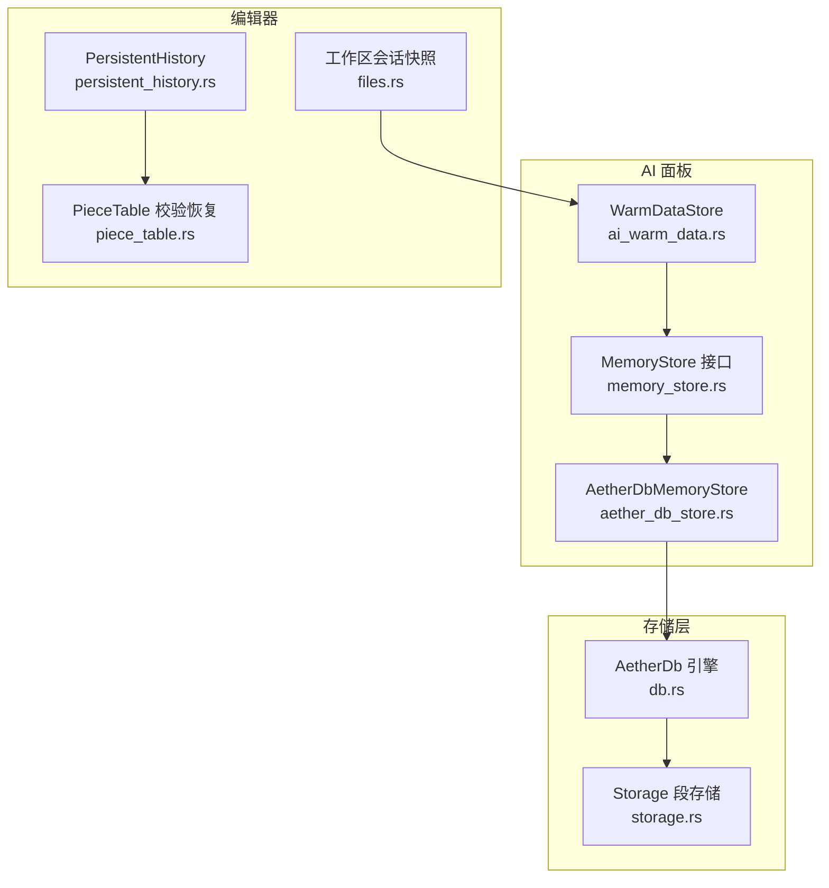
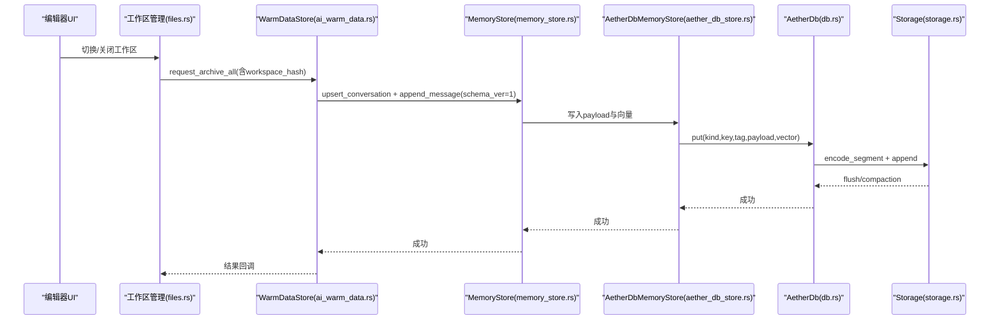
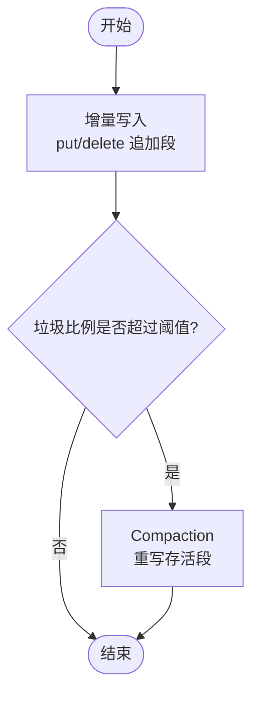
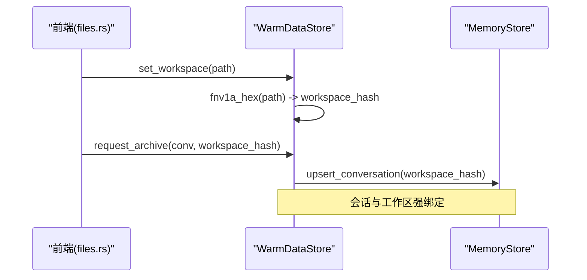
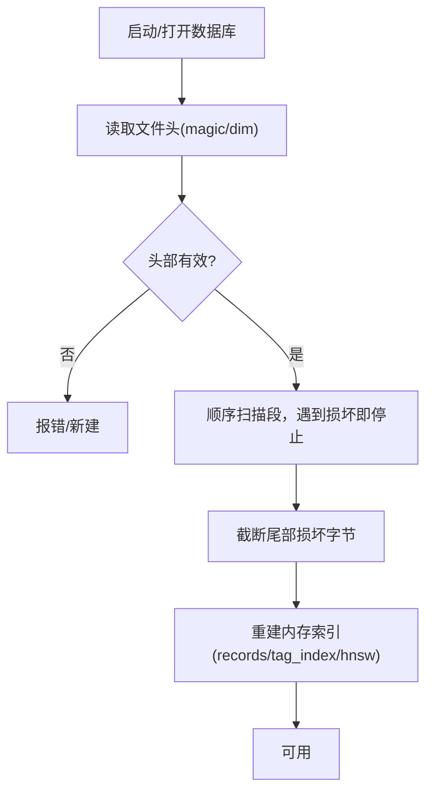
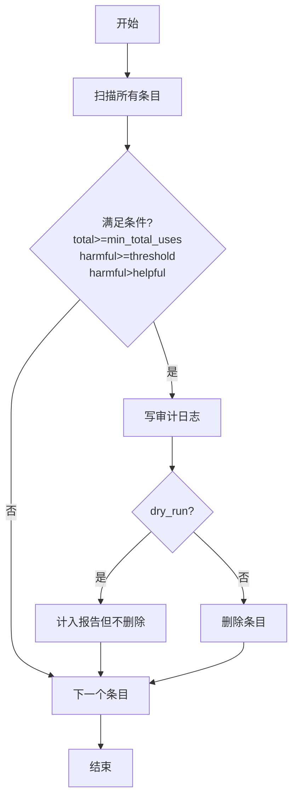
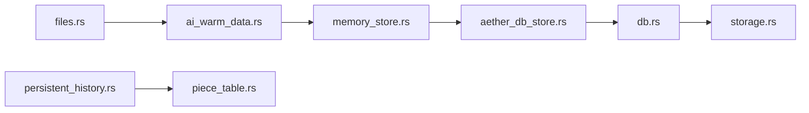

# 数据迁移与版本管理

<cite>
**本文引用的文件**
- [ai_warm_data.rs](file://crates/aether-ai-panel/src/ai_warm_data.rs)
- [memory_store.rs](file://crates/aether-ai-panel/src/memory_store.rs)
- [aether_db_store.rs](file://crates/aether-ai-panel/src/aether_db_store.rs)
- [db.rs](file://crates/aether-db/src/db.rs)
- [storage.rs](file://crates/aether-db/src/storage.rs)
- [persistent_history.rs](file://crates/aether-core/src/persistent_history.rs)
- [piece_table.rs](file://crates/aether-core/src/buffer/piece_table.rs)
- [files.rs](file://crates/aether-win32/src/editor/files.rs)
- [migrate_editor_state.ps1](file://scripts/migrate_editor_state.ps1)
- [migrate_editor_state_v2.ps1](file://scripts/migrate_editor_state_v2.ps1)
</cite>

## 目录
1. [简介](#简介)
2. [项目结构](#项目结构)
3. [核心组件](#核心组件)
4. [架构总览](#架构总览)
5. [详细组件分析](#详细组件分析)
6. [依赖关系分析](#依赖关系分析)
7. [性能考量](#性能考量)
8. [故障排查指南](#故障排查指南)
9. [结论](#结论)
10. [附录](#附录)

## 简介
本文件面向“数据迁移与版本管理”，聚焦以下目标：
- 对话历史的数据结构版本控制机制，尤其是 schema_ver 字段的作用与向后兼容性保证。
- 数据迁移策略：增量迁移、全量迁移与回滚机制。
- 工作区绑定机制：workspace_hash 的计算与管理，以及无主会话的清理策略。
- 数据备份与恢复流程：自动备份、手动导出与灾难恢复。
- 剪枝功能的 grow-and-refine 算法：harmful_count 统计、阈值配置与审计日志记录。
- 数据完整性检查工具与使用指南。

## 项目结构
围绕数据持久化与版本管理的核心代码分布在以下模块：
- AI 面板温数据归档与检索：ai_warm_data.rs、memory_store.rs、aether_db_store.rs
- 自研向量数据库：aether-db（db.rs、storage.rs）
- 编辑器持久化历史与版本快照：persistent_history.rs、piece_table.rs
- 工作区切换与会话快照：files.rs
- 编辑器状态迁移脚本：scripts 下的 migrate_* 脚本

图表来源
- [ai_warm_data.rs:1-120](file://crates/aether-ai-panel/src/ai_warm_data.rs#L1-L120)
- [memory_store.rs:1-120](file://crates/aether-ai-panel/src/memory_store.rs#L1-L120)
- [aether_db_store.rs:1-120](file://crates/aether-ai-panel/src/aether_db_store.rs#L1-L120)
- [db.rs:1-120](file://crates/aether-db/src/db.rs#L1-L120)
- [storage.rs:163-251](file://crates/aether-db/src/storage.rs#L163-L251)
- [persistent_history.rs:1-120](file://crates/aether-core/src/persistent_history.rs#L1-L120)
- [piece_table.rs:1663-1721](file://crates/aether-core/src/buffer/piece_table.rs#L1663-L1721)
- [files.rs:579-605](file://crates/aether-win32/src/editor/files.rs#L579-L605)

章节来源
- [ai_warm_data.rs:1-120](file://crates/aether-ai-panel/src/ai_warm_data.rs#L1-L120)
- [memory_store.rs:1-120](file://crates/aether-ai-panel/src/memory_store.rs#L1-L120)
- [aether_db_store.rs:1-120](file://crates/aether-ai-panel/src/aether_db_store.rs#L1-L120)
- [db.rs:1-120](file://crates/aether-db/src/db.rs#L1-L120)
- [storage.rs:163-251](file://crates/aether-db/src/storage.rs#L163-L251)
- [persistent_history.rs:1-120](file://crates/aether-core/src/persistent_history.rs#L1-L120)
- [piece_table.rs:1663-1721](file://crates/aether-core/src/buffer/piece_table.rs#L1663-L1721)
- [files.rs:579-605](file://crates/aether-win32/src/editor/files.rs#L579-L605)

## 核心组件
- WarmDataStore：负责将活跃会话异步归档到 AetherDB，附带工作区哈希绑定、可选反思沉淀、剪枝启动时执行。
- MemoryStore 接口：统一抽象会话、消息、playbook 条目、语义检索、混合检索、剪枝与审计日志等能力。
- AetherDbMemoryStore：基于自研 AetherDB 的实现，提供键值+标签索引、HNSW 向量检索、RRF 融合混合检索。
- AetherDb/Storage：单文件追加式段存储，支持崩溃恢复、compaction、维度校验、垃圾回收。
- PersistentHistory/PieceTable：编辑器文本编辑的历史版本管理与撤销重做；带边界校验的状态恢复。
- 工作区会话快照：在切换/关闭工作区时归档当前会话并保存内存快照，按 workspace_hash 组织。

章节来源
- [ai_warm_data.rs:21-120](file://crates/aether-ai-panel/src/ai_warm_data.rs#L21-L120)
- [memory_store.rs:24-201](file://crates/aether-ai-panel/src/memory_store.rs#L24-L201)
- [aether_db_store.rs:25-120](file://crates/aether-ai-panel/src/aether_db_store.rs#L25-L120)
- [db.rs:29-120](file://crates/aether-db/src/db.rs#L29-L120)
- [storage.rs:163-251](file://crates/aether-db/src/storage.rs#L163-L251)
- [persistent_history.rs:29-120](file://crates/aether-core/src/persistent_history.rs#L29-L120)
- [piece_table.rs:1663-1721](file://crates/aether-core/src/buffer/piece_table.rs#L1663-L1721)
- [files.rs:579-605](file://crates/aether-win32/src/editor/files.rs#L579-L605)

## 架构总览
系统采用“热→温”两级数据流：
- 热数据：JSONL 追加式会话日志（每个会话一个文件），用于快速写入与崩溃恢复。
- 温数据：AetherDB 持久化，包含会话元数据、消息、向量索引、playbook 条目与剪枝审计日志。
- 工作区绑定：通过 workspace_hash 将会话与工作区关联，避免跨工作区串扰。
- 版本管理：编辑器侧通过 PersistentHistory 维护可撤销/重做的版本快照；数据库侧通过段追加与 compaction 实现增量更新与崩溃恢复。

图表来源
- [files.rs:579-605](file://crates/aether-win32/src/editor/files.rs#L579-L605)
- [ai_warm_data.rs:218-282](file://crates/aether-ai-panel/src/ai_warm_data.rs#L218-L282)
- [memory_store.rs:77-141](file://crates/aether-ai-panel/src/memory_store.rs#L77-L141)
- [aether_db_store.rs:80-151](file://crates/aether-ai-panel/src/aether_db_store.rs#L80-L151)
- [db.rs:146-178](file://crates/aether-db/src/db.rs#L146-L178)
- [storage.rs:75-161](file://crates/aether-db/src/storage.rs#L75-L161)

## 详细组件分析

### 数据结构版本控制与 schema_ver
- ChatMessage 包含 schema_ver 字段，用于标识消息结构的版本。归档时固定为 1，便于后续升级时进行兼容处理。
- 读取端可按 schema_ver 分支解析，确保旧格式仍可被正确消费。
- 建议：新增字段时应保持向后兼容（如默认值、可空字段），并在必要时引入迁移逻辑。

章节来源
- [memory_store.rs:41-54](file://crates/aether-ai-panel/src/memory_store.rs#L41-L54)
- [ai_warm_data.rs:329-342](file://crates/aether-ai-panel/src/ai_warm_data.rs#L329-L342)

### 数据迁移策略（增量、全量、回滚）
- 增量迁移：
  - AetherDB 采用追加写段（append-only segments），每次 put/delete 都追加新段，旧段标记为垃圾或墓碑，触发 compaction 时重写为紧凑文件。
  - 适合频繁小更新的场景，降低锁竞争与拷贝开销。
- 全量迁移：
  - 通过 force_compact 将存活记录重写为单一连续段，可用于离线整理或跨环境迁移。
- 回滚机制：
  - 数据库侧：通过墓碑段与 compaction 实现删除语义；若需回滚，应在应用层保留必要快照或事务边界。
  - 编辑器侧：PersistentHistory 提供 undo/redo，可在编辑层面回退到之前版本快照。

图表来源
- [db.rs:146-178](file://crates/aether-db/src/db.rs#L146-L178)
- [db.rs:307-332](file://crates/aether-db/src/db.rs#L307-L332)
- [storage.rs:184-251](file://crates/aether-db/src/storage.rs#L184-L251)

章节来源
- [db.rs:146-178](file://crates/aether-db/src/db.rs#L146-L178)
- [db.rs:307-332](file://crates/aether-db/src/db.rs#L307-L332)
- [storage.rs:184-251](file://crates/aether-db/src/storage.rs#L184-L251)
- [persistent_history.rs:66-136](file://crates/aether-core/src/persistent_history.rs#L66-L136)

### 工作区绑定机制与无主会话清理
- workspace_hash 计算：
  - 使用 FNV-1a 对路径字符串生成短哈希，确保同一工作区在不同机器/路径下具有一致性（同路径）。
  - 工作区切换时，编辑器侧捕获当前路径哈希并传入归档请求，保证会话归属正确。
- 无主会话清理：
  - 提供 clear_orphan_conversations 接口，删除 workspace_hash 为空的会话，避免无归属数据污染。
  - 启动时可按工作区过滤仅恢复属于当前工作区的会话，防止跨工作区串扰。

图表来源
- [ai_warm_data.rs:110-116](file://crates/aether-ai-panel/src/ai_warm_data.rs#L110-L116)
- [ai_warm_data.rs:546-554](file://crates/aether-ai-panel/src/ai_warm_data.rs#L546-L554)
- [memory_store.rs:104-116](file://crates/aether-ai-panel/src/memory_store.rs#L104-L116)
- [files.rs:579-605](file://crates/aether-win32/src/editor/files.rs#L579-L605)

章节来源
- [ai_warm_data.rs:110-116](file://crates/aether-ai-panel/src/ai_warm_data.rs#L110-L116)
- [ai_warm_data.rs:546-554](file://crates/aether-ai-panel/src/ai_warm_data.rs#L546-L554)
- [memory_store.rs:104-116](file://crates/aether-ai-panel/src/memory_store.rs#L104-L116)
- [files.rs:579-605](file://crates/aether-win32/src/editor/files.rs#L579-L605)

### 数据备份与恢复流程
- 自动备份：
  - 热数据 JSONL 追加写，每行一条消息，崩溃最多丢失最后一行不完整记录。
  - 温数据 AetherDB 通过段追加与 compaction 保障一致性；打开时扫描段重建索引，损坏尾部截断。
- 手动导出：
  - 可通过 list_conversations/get_messages/list_bullets 导出会话与条目；结合 search_conversations 按工作区过滤。
- 灾难恢复：
  - 数据库：Storage::open 会校验 magic 与维度，扫描段直到首个损坏处并截断，保证下次写入覆盖。
  - 编辑器：PieceTable 恢复前进行严格边界校验，失败则放弃恢复以保护当前状态。

图表来源
- [storage.rs:184-251](file://crates/aether-db/src/storage.rs#L184-L251)
- [db.rs:47-80](file://crates/aether-db/src/db.rs#L47-L80)
- [piece_table.rs:1663-1721](file://crates/aether-core/src/buffer/piece_table.rs#L1663-L1721)

章节来源
- [memory_store.rs:248-306](file://crates/aether-ai-panel/src/memory_store.rs#L248-L306)
- [storage.rs:184-251](file://crates/aether-db/src/storage.rs#L184-L251)
- [db.rs:47-80](file://crates/aether-db/src/db.rs#L47-L80)
- [piece_table.rs:1663-1721](file://crates/aether-core/src/buffer/piece_table.rs#L1663-L1721)

### 剪枝功能：grow-and-refine 算法
- harmful_count 统计：
  - PlaybookBullet 维护 helpful_count 与 harmful_count，作为权重演化信号。
- 阈值配置：
  - PruneConfig 包含 harmful_threshold、min_total_uses、dry_run 等参数，默认阈值可调整。
- 审计日志：
  - 剪枝前先写审计日志（PruneLogEntry），再删除条目，保证可追溯。
  - 支持 dry_run 模式预览候选而不实际删除。

图表来源
- [memory_store.rs:207-246](file://crates/aether-ai-panel/src/memory_store.rs#L207-L246)
- [aether_db_store.rs:383-442](file://crates/aether-ai-panel/src/aether_db_store.rs#L383-L442)
- [ai_warm_data.rs:218-235](file://crates/aether-ai-panel/src/ai_warm_data.rs#L218-L235)

章节来源
- [memory_store.rs:207-246](file://crates/aether-ai-panel/src/memory_store.rs#L207-L246)
- [aether_db_store.rs:383-442](file://crates/aether-ai-panel/src/aether_db_store.rs#L383-L442)
- [ai_warm_data.rs:218-235](file://crates/aether-ai-panel/src/ai_warm_data.rs#L218-L235)

### 编辑器版本历史与撤销重做
- PersistentHistory 维护环形缓冲区版本栈，支持合并小编辑、限制历史大小、撤销/重做。
- PieceTable 通过 Arc<Vec<Piece>> 共享数据，减少拷贝；批量操作可合并为一次历史记录。
- 恢复时进行严格校验，任何越界或损坏均放弃恢复，保护当前状态。

章节来源
- [persistent_history.rs:29-136](file://crates/aether-core/src/persistent_history.rs#L29-L136)
- [persistent_history.rs:240-376](file://crates/aether-core/src/persistent_history.rs#L240-L376)
- [piece_table.rs:1663-1721](file://crates/aether-core/src/buffer/piece_table.rs#L1663-L1721)

## 依赖关系分析
- WarmDataStore 依赖 MemoryStore 接口，解耦底层存储实现。
- AetherDbMemoryStore 依赖 AetherDb，后者依赖 Storage 进行段读写与 compaction。
- 编辑器侧 files.rs 在工作区切换时调用 WarmDataStore 归档会话，并维护内存快照。
- PersistentHistory 与 PieceTable 共同提供编辑器版本管理能力。

图表来源
- [files.rs:579-605](file://crates/aether-win32/src/editor/files.rs#L579-L605)
- [ai_warm_data.rs:1-120](file://crates/aether-ai-panel/src/ai_warm_data.rs#L1-L120)
- [memory_store.rs:1-120](file://crates/aether-ai-panel/src/memory_store.rs#L1-L120)
- [aether_db_store.rs:1-120](file://crates/aether-ai-panel/src/aether_db_store.rs#L1-L120)
- [db.rs:1-120](file://crates/aether-db/src/db.rs#L1-L120)
- [storage.rs:163-251](file://crates/aether-db/src/storage.rs#L163-L251)
- [persistent_history.rs:1-120](file://crates/aether-core/src/persistent_history.rs#L1-L120)
- [piece_table.rs:1663-1721](file://crates/aether-core/src/buffer/piece_table.rs#L1663-L1721)

章节来源
- [files.rs:579-605](file://crates/aether-win32/src/editor/files.rs#L579-L605)
- [ai_warm_data.rs:1-120](file://crates/aether-ai-panel/src/ai_warm_data.rs#L1-L120)
- [memory_store.rs:1-120](file://crates/aether-ai-panel/src/memory_store.rs#L1-L120)
- [aether_db_store.rs:1-120](file://crates/aether-ai-panel/src/aether_db_store.rs#L1-L120)
- [db.rs:1-120](file://crates/aether-db/src/db.rs#L1-L120)
- [storage.rs:163-251](file://crates/aether-db/src/storage.rs#L163-L251)
- [persistent_history.rs:1-120](file://crates/aether-core/src/persistent_history.rs#L1-L120)
- [piece_table.rs:1663-1721](file://crates/aether-core/src/buffer/piece_table.rs#L1663-L1721)

## 性能考量
- 向量检索：
  - 小集合（含 tag 过滤后 ≤4096 条）走暴力精确搜索；大集合走 HNSW，过量取 k*4 后过滤。
  - 混合检索使用 RRF 融合关键词与向量结果，提升召回率。
- 存储层：
  - 追加写减少锁竞争；compaction 按需触发，避免频繁 IO。
  - 崩溃恢复时只扫描有效段，损坏尾部直接截断，缩短恢复时间。
- 编辑器历史：
  - 通过 Arc 共享 pieces，减少撤销/重做时的拷贝成本；合并小编辑减少历史膨胀。

章节来源
- [db.rs:241-300](file://crates/aether-db/src/db.rs#L241-L300)
- [aether_db_store.rs:302-381](file://crates/aether-ai-panel/src/aether_db_store.rs#L302-L381)
- [storage.rs:184-251](file://crates/aether-db/src/storage.rs#L184-L251)
- [persistent_history.rs:66-136](file://crates/aether-core/src/persistent_history.rs#L66-L136)

## 故障排查指南
- 数据库维度不匹配：
  - 错误提示期望维度与实际维度不一致，检查 embedding_dim 配置与模型输出维度。
- 文件头损坏或维度不匹配：
  - Storage::open 校验 magic 与 dim，不匹配时报错；损坏尾部会被截断。
- 编辑器状态恢复失败：
  - PieceTable restore_state_checked 校验失败时放弃恢复，保留当前状态；检查持久化数据是否被异常截断。
- 剪枝误删风险：
  - 使用 dry_run 模式先预览候选；检查 harmful_threshold 与 min_total_uses 配置。

章节来源
- [aether_db_store.rs:56-65](file://crates/aether-ai-panel/src/aether_db_store.rs#L56-L65)
- [storage.rs:208-245](file://crates/aether-db/src/storage.rs#L208-L245)
- [piece_table.rs:1663-1721](file://crates/aether-core/src/buffer/piece_table.rs#L1663-L1721)
- [aether_db_store.rs:383-442](file://crates/aether-ai-panel/src/aether_db_store.rs#L383-L442)

## 结论
本项目通过“热→温”两级数据流、工作区绑定、版本快照与增量化存储，实现了稳健的数据迁移与版本管理。schema_ver 提供向前兼容基础，AetherDB 的追加写与 compaction 保障高性能与可靠性，PersistentHistory 提供编辑器级撤销重做。剪枝功能通过 grow-and-refine 算法持续优化 playbook 质量，审计日志确保可追溯。建议在后续迭代中继续完善 schema 演进策略与迁移脚本自动化。

## 附录
- 编辑器状态迁移脚本：
  - migrate_editor_state.ps1：批量替换 self.field 为 self.domain.field，按字段映射表迁移。
  - migrate_editor_state_v2.ps1：限定在 impl EditorState 块内执行替换，避免误改其他上下文。

章节来源
- [migrate_editor_state.ps1:1-158](file://scripts/migrate_editor_state.ps1#L1-L158)
- [migrate_editor_state_v2.ps1:1-78](file://scripts/migrate_editor_state_v2.ps1#L1-L78)