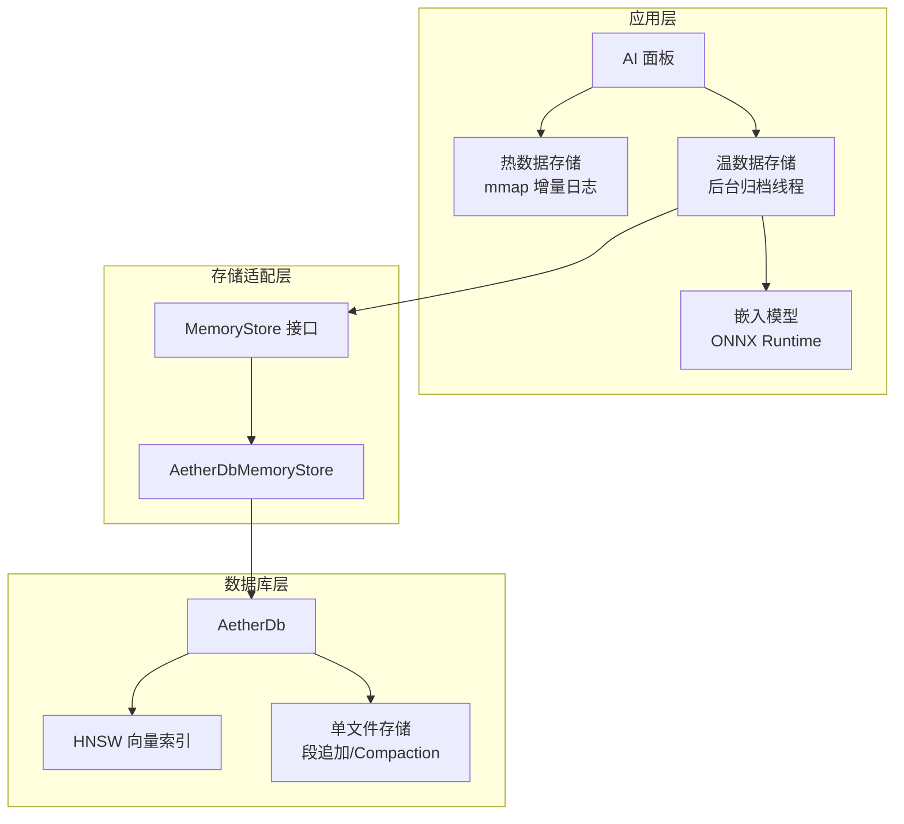
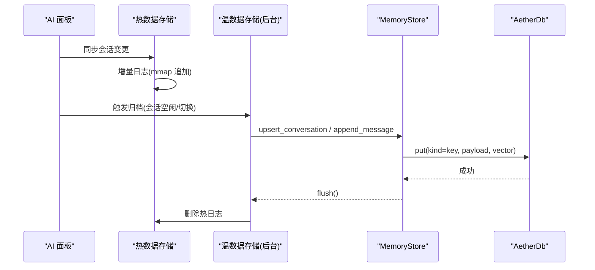
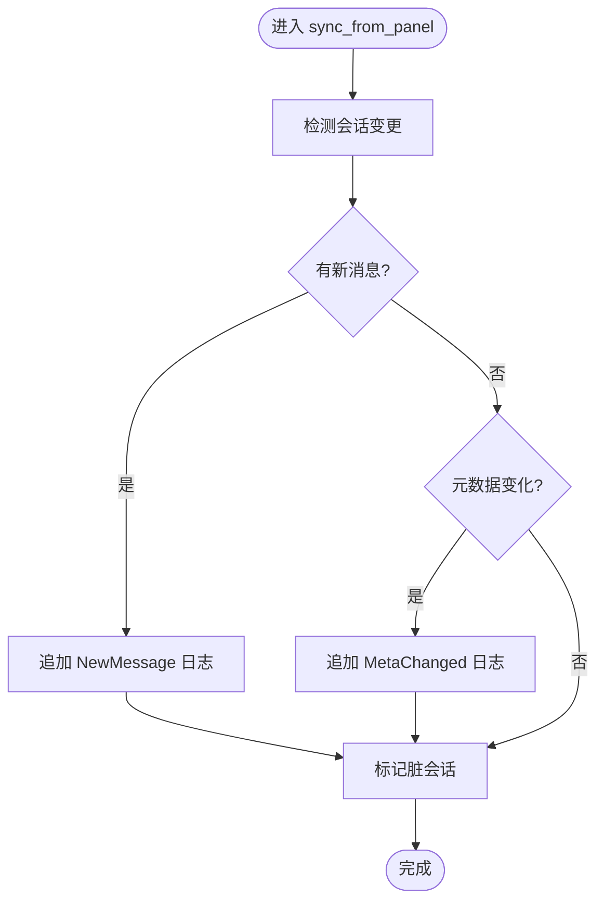
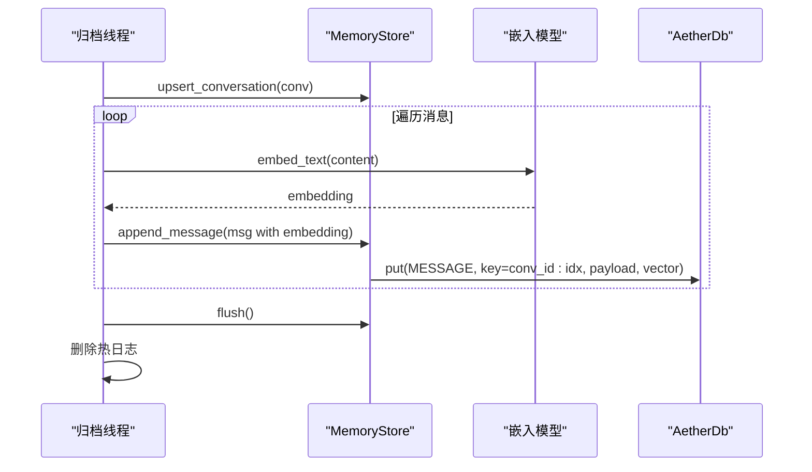
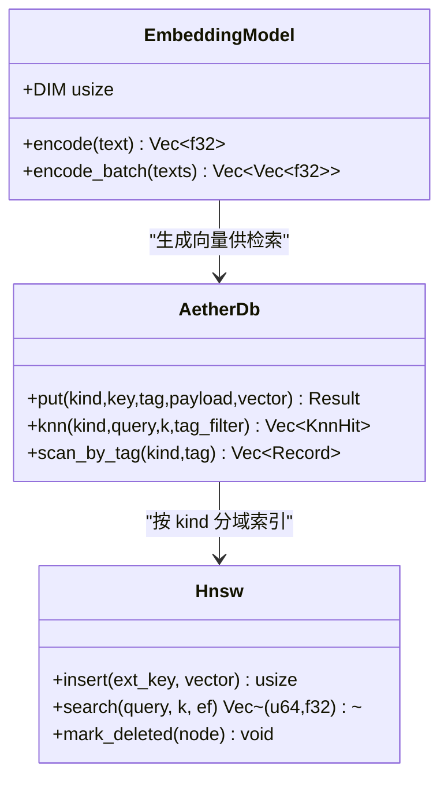
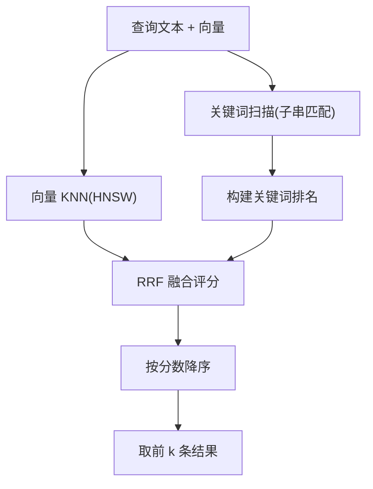
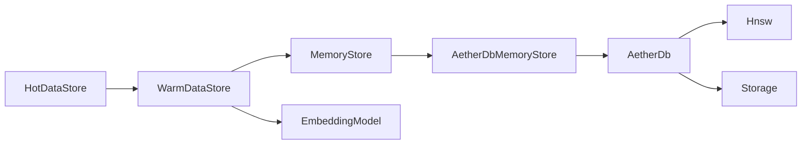

# 记忆存储系统

<cite>
**本文引用的文件**
- [memory_store.rs](file://crates/aether-ai-panel/src/memory_store.rs)
- [ai_hot_data.rs](file://crates/aether-ai-panel/src/ai_hot_data.rs)
- [ai_warm_data.rs](file://crates/aether-ai-panel/src/ai_warm_data.rs)
- [aether_db_store.rs](file://crates/aether-ai-panel/src/aether_db_store.rs)
- [embedding.rs](file://crates/aether-ai-panel/src/embedding.rs)
- [db.rs](file://crates/aether-db/src/db.rs)
- [hnsw.rs](file://crates/aether-db/src/hnsw.rs)
- [storage.rs](file://crates/aether-db/src/storage.rs)
</cite>

## 目录
1. [简介](#简介)
2. [项目结构](#项目结构)
3. [核心组件](#核心组件)
4. [架构总览](#架构总览)
5. [详细组件分析](#详细组件分析)
6. [依赖关系分析](#依赖关系分析)
7. [性能考虑](#性能考虑)
8. [故障排查指南](#故障排查指南)
9. [结论](#结论)
10. [附录：数据库 Schema 与维护指南](#附录数据库-schema-与维护指南)

## 简介
本记忆存储系统为 AI 对话提供三阶段持久化与语义检索能力：热数据（内存 + mmap 增量日志）、温数据（异步归档到自研 AetherDB，建立向量索引）、冷数据（长期不访问的会话压缩归档）。系统支持对话历史的消息序列化、索引构建与查询优化；实现文本向量化、相似度计算与语义搜索；提供数据迁移、备份恢复策略建议；并给出存储性能优化与安全机制建议。

## 项目结构
记忆存储相关代码主要分布在两个 crate：
- aether-ai-panel：上层业务与存储适配层（热/温数据管理、嵌入模型、MemoryStore 接口）
- aether-db：底层单文件嵌入式向量数据库（段式追加写、HNSW 向量索引、compaction）

图表来源
- [ai_hot_data.rs:1-342](file://crates/aether-ai-panel/src/ai_hot_data.rs#L1-L342)
- [ai_warm_data.rs:1-601](file://crates/aether-ai-panel/src/ai_warm_data.rs#L1-L601)
- [aether_db_store.rs:1-675](file://crates/aether-ai-panel/src/aether_db_store.rs#L1-L675)
- [db.rs:1-466](file://crates/aether-db/src/db.rs#L1-L466)
- [hnsw.rs:1-337](file://crates/aether-db/src/hnsw.rs#L1-L337)
- [storage.rs:1-404](file://crates/aether-db/src/storage.rs#L1-L404)

章节来源
- [ai_hot_data.rs:1-342](file://crates/aether-ai-panel/src/ai_hot_data.rs#L1-L342)
- [ai_warm_data.rs:1-601](file://crates/aether-ai-panel/src/ai_warm_data.rs#L1-L601)
- [aether_db_store.rs:1-675](file://crates/aether-ai-panel/src/aether_db_store.rs#L1-L675)
- [db.rs:1-466](file://crates/aether-db/src/db.rs#L1-L466)
- [hnsw.rs:1-337](file://crates/aether-db/src/hnsw.rs#L1-L337)
- [storage.rs:1-404](file://crates/aether-db/src/storage.rs#L1-L404)

## 核心组件
- MemoryStore 接口：统一抽象对话持久化与 ACE 上下文工程条目库操作，屏蔽底层实现差异
- 热数据存储：活跃会话内存状态 + mmap 追加式增量日志，零磁盘 IO 优先
- 温数据存储：后台线程异步归档会话至 AetherDB，建立向量索引，删除热日志
- 嵌入模型：ONNX Runtime 加载 bge-small-zh-v1.5，未初始化时回退 n-gram 哈希向量
- AetherDbMemoryStore：基于 AetherDB 的 MemoryStore 实现，支持混合检索（关键词+向量 RRF 融合）
- AetherDb：单文件嵌入式向量数据库，记录模型、二级 tag 索引、按 kind 分域 HNSW
- HNSW：近似最近邻索引，余弦距离，增量插入与墓碑删除
- 存储层：单文件格式，段追加写，崩溃恢复，自动 compaction

章节来源
- [memory_store.rs:1-361](file://crates/aether-ai-panel/src/memory_store.rs#L1-L361)
- [ai_hot_data.rs:1-342](file://crates/aether-ai-panel/src/ai_hot_data.rs#L1-L342)
- [ai_warm_data.rs:1-601](file://crates/aether-ai-panel/src/ai_warm_data.rs#L1-L601)
- [embedding.rs:1-234](file://crates/aether-ai-panel/src/embedding.rs#L1-L234)
- [aether_db_store.rs:1-675](file://crates/aether-ai-panel/src/aether_db_store.rs#L1-L675)
- [db.rs:1-466](file://crates/aether-db/src/db.rs#L1-L466)
- [hnsw.rs:1-337](file://crates/aether-db/src/hnsw.rs#L1-L337)
- [storage.rs:1-404](file://crates/aether-db/src/storage.rs#L1-L404)

## 架构总览
三阶段存储架构将“热—温—冷”分层设计，兼顾实时性与持久性：
- 热数据：内存中维护完整会话消息列表，通过 mmap 只追加写入增量日志（新增消息、元数据变更、会话创建/关闭），避免重复写入历史消息与固定系统提示
- 温数据：空闲或会话切换时触发后台归档，将整段会话批量写入 AetherDB，生成消息向量索引，成功后删除热日志
- 冷数据：超长期不访问的会话可压缩归档（当前仓库未实现具体压缩归档逻辑，但已预留扩展点）

图表来源
- [ai_hot_data.rs:89-193](file://crates/aether-ai-panel/src/ai_hot_data.rs#L89-L193)
- [ai_warm_data.rs:218-348](file://crates/aether-ai-panel/src/ai_warm_data.rs#L218-L348)
- [aether_db_store.rs:80-151](file://crates/aether-ai-panel/src/aether_db_store.rs#L80-L151)
- [db.rs:146-178](file://crates/aether-db/src/db.rs#L146-L178)

## 详细组件分析

### 热数据存储（HotDataStore）
- 职责：维护活跃会话内存状态，增量日志写入，脏会话追踪，空闲检测触发归档
- 关键特性：
  - 增量日志：仅写入新增消息与变化的元数据，避免重复写入历史消息
  - mmap 追加：预分配空间，按需扩容，减少系统调用
  - 脏标记：跟踪变更会话 ID，用于温数据阶段增量归档
  - 空闲判定：最后活动时间超过阈值且存在脏会话时触发归档

图表来源
- [ai_hot_data.rs:89-193](file://crates/aether-ai-panel/src/ai_hot_data.rs#L89-L193)

章节来源
- [ai_hot_data.rs:1-342](file://crates/aether-ai-panel/src/ai_hot_data.rs#L1-L342)

### 温数据存储（WarmDataStore）
- 职责：后台线程异步归档会话，建立向量索引，可选 ACE 反思沉淀策略条目
- 关键流程：
  - 归档会话元数据（标题、工作区哈希、模式、时间戳、消息数）
  - 归档所有消息（稳定 ID = conv_id:msg_index，语义向量由嵌入模型生成）
  - 刷写 WAL checkpoint，删除热日志
  - 可选反思：对含用户消息的真实对话执行策略沉淀

图表来源
- [ai_warm_data.rs:311-348](file://crates/aether-ai-panel/src/ai_warm_data.rs#L311-L348)
- [aether_db_store.rs:132-151](file://crates/aether-ai-panel/src/aether_db_store.rs#L132-L151)
- [embedding.rs:187-218](file://crates/aether-ai-panel/src/embedding.rs#L187-L218)

章节来源
- [ai_warm_data.rs:1-601](file://crates/aether-ai-panel/src/ai_warm_data.rs#L1-L601)

### 嵌入向量存储（Embedding & HNSW）
- 文本向量化：ONNX Runtime 加载 bge-small-zh-v1.5，Tokenize → 推理 → 池化 → L2 归一化；未初始化时回退 n-gram 哈希向量（保证维度一致）
- 相似度计算：余弦距离（归一化向量内积），HNSW 近似最近邻搜索
- 语义搜索：按会话去重后取前 k，距离转相似度得分 1/(1+distance)

图表来源
- [embedding.rs:18-121](file://crates/aether-ai-panel/src/embedding.rs#L18-L121)
- [hnsw.rs:37-260](file://crates/aether-db/src/hnsw.rs#L37-L260)
- [db.rs:146-300](file://crates/aether-db/src/db.rs#L146-L300)

章节来源
- [embedding.rs:1-234](file://crates/aether-ai-panel/src/embedding.rs#L1-L234)
- [hnsw.rs:1-337](file://crates/aether-db/src/hnsw.rs#L1-L337)
- [db.rs:1-466](file://crates/aether-db/src/db.rs#L1-L466)

### 混合检索（关键词 + 向量 RRF 融合）
- 关键词通道：子串匹配（≥3 字符启用），按内容出现位置排序
- 向量通道：HNSW KNN 检索
- 融合策略：RRF（Reciprocal Rank Fusion），score = Σ 1/(60 + rank)，取 top k

图表来源
- [aether_db_store.rs:304-381](file://crates/aether-ai-panel/src/aether_db_store.rs#L304-L381)

章节来源
- [aether_db_store.rs:304-381](file://crates/aether-ai-panel/src/aether_db_store.rs#L304-L381)

### 数据迁移策略（版本升级、备份与恢复）
- 版本升级：
  - 文件头包含魔数、版本号、维度，打开时校验维度匹配
  - 段格式稳定，新增字段可通过兼容解析处理
- 备份与恢复：
  - 单文件存储便于拷贝备份
  - 崩溃恢复：全量扫描段序列，跳过损坏尾部，重建存活记录
  - Compaction：垃圾占比超阈值时重写文件，原子替换原文件

章节来源
- [storage.rs:163-311](file://crates/aether-db/src/storage.rs#L163-L311)
- [db.rs:47-80](file://crates/aether-db/src/db.rs#L47-L80)

### 数据安全机制
- 加密存储：当前实现未内置加密，可在存储层之上封装加密文件系统或使用平台密钥服务
- 访问控制：通过工作区哈希绑定会话归属，防止跨工作区误访问
- 隐私保护：消息内容本地存储，向量检索在进程内完成；可选禁用网络反射（退出场景 reflect=false）

章节来源
- [ai_warm_data.rs:125-133](file://crates/aether-ai-panel/src/ai_warm_data.rs#L125-L133)
- [memory_store.rs:28-39](file://crates/aether-ai-panel/src/memory_store.rs#L28-L39)

## 依赖关系分析
- 热数据依赖 mmap 日志写入器，温数据依赖 MemoryStore 接口
- MemoryStore 接口由 AetherDbMemoryStore 实现，依赖 AetherDb
- AetherDb 依赖 HNSW 向量索引与单文件存储层
- 嵌入模型独立于存储层，通过全局单例懒加载

图表来源
- [ai_hot_data.rs:17-29](file://crates/aether-ai-panel/src/ai_hot_data.rs#L17-L29)
- [ai_warm_data.rs:52-70](file://crates/aether-ai-panel/src/ai_warm_data.rs#L52-L70)
- [aether_db_store.rs:25-30](file://crates/aether-ai-panel/src/aether_db_store.rs#L25-L30)
- [db.rs:29-45](file://crates/aether-db/src/db.rs#L29-L45)

章节来源
- [ai_hot_data.rs:1-342](file://crates/aether-ai-panel/src/ai_hot_data.rs#L1-L342)
- [ai_warm_data.rs:1-601](file://crates/aether-ai-panel/src/ai_warm_data.rs#L1-L601)
- [aether_db_store.rs:1-675](file://crates/aether-ai-panel/src/aether_db_store.rs#L1-L675)
- [db.rs:1-466](file://crates/aether-db/src/db.rs#L1-L466)

## 性能考虑
- 索引策略：
  - HNSW 参数 M=8, Mmax0=16, ef_construction=64，适合编辑器规模
  - 小集合（≤4096）走暴力精确搜索，保证召回率
- 缓存设计：
  - 内存索引 records/tag_index/hnsw 常驻内存，避免频繁磁盘 IO
  - 混合检索候选放大（k*4）后过滤，提升召回质量
- 内存管理：
  - mmap 预分配 1MB，按需扩容，减少系统调用
  - Compaction 阈值：垃圾 >1MB 且占比 >1/3 触发重写
  - shrink_memory 强制 compaction 回收墓碑垃圾段

章节来源
- [hnsw.rs:32-35](file://crates/aether-db/src/hnsw.rs#L32-L35)
- [db.rs:241-300](file://crates/aether-db/src/db.rs#L241-L300)
- [storage.rs:274-311](file://crates/aether-db/src/storage.rs#L274-L311)
- [aether_db_store.rs:293-300](file://crates/aether-ai-panel/src/aether_db_store.rs#L293-L300)

## 故障排查指南
- 向量维度不匹配：检查嵌入模型维度与数据库维度是否一致（默认 512）
- 段损坏恢复：启动时全量扫描段序列，跳过损坏尾部，截断文件
- 归档失败：检查后台线程是否正常运行，确认存储路径权限
- 混合检索无结果：确认关键词长度 ≥3 字符，或向量检索是否启用

章节来源
- [aether_db_store.rs:56-65](file://crates/aether-ai-panel/src/aether_db_store.rs#L56-L65)
- [storage.rs:225-240](file://crates/aether-db/src/storage.rs#L225-L240)
- [ai_warm_data.rs:218-282](file://crates/aether-ai-panel/src/ai_warm_data.rs#L218-L282)

## 结论
本记忆存储系统通过三阶段架构实现了高效、可靠的对话历史持久化与语义检索。热数据保障低延迟交互，温数据提供强一致持久化与向量索引，冷数据预留扩展空间。结合 HNSW 向量索引、混合检索与自动 compaction，系统在性能与可靠性之间取得平衡。未来可增强冷数据压缩归档、加密存储与更细粒度的访问控制。

## 附录：数据库 Schema 与维护指南
- 实体类型：
  - 会话（CONVERSATION）：id, title, workspace_hash, mode, created_at, updated_at, message_count
  - 消息（MESSAGE）：id, conv_id, msg_index, role, content, embedding, schema_ver, created_at
  - 条目（BULLET）：id, section, content, helpful_count, harmful_count, embedding, created_at, updated_at
  - 剪枝日志（PRUNE_LOG）：id, bullet_id, content, helpful_count, harmful_count, reason, pruned_at
- 维护操作：
  - 级联删除：删除会话时先删其全部消息（含向量索引），再删会话元数据
  - 反馈计数：upsert_bullet 冲突时保留计数器与 created_at，仅更新内容字段
  - 混合检索：关键词通道与向量通道 RRF 融合，按会话过滤后取 top k
  - 压缩回收：垃圾占比超阈值时触发 compaction，原子替换文件

章节来源
- [memory_store.rs:28-71](file://crates/aether-ai-panel/src/memory_store.rs#L28-L71)
- [aether_db_store.rs:80-242](file://crates/aether-ai-panel/src/aether_db_store.rs#L80-L242)
- [aether_db_store.rs:383-442](file://crates/aether-ai-panel/src/aether_db_store.rs#L383-L442)