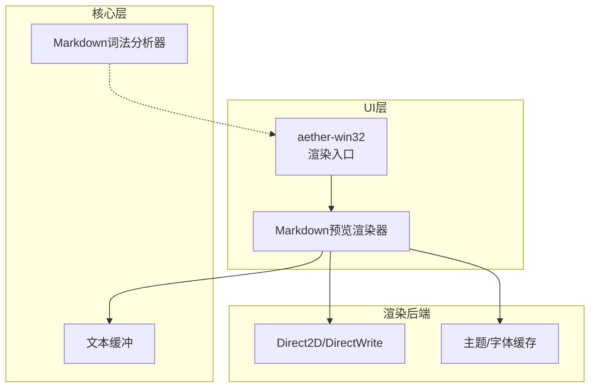
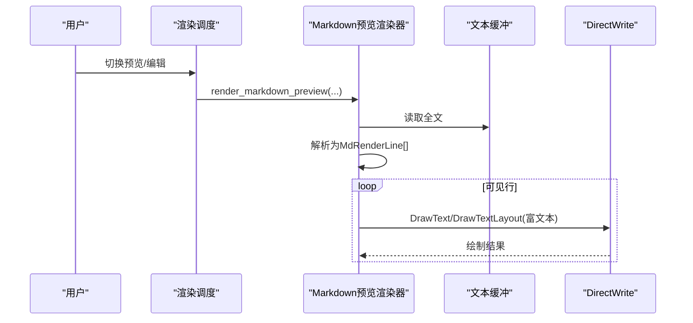
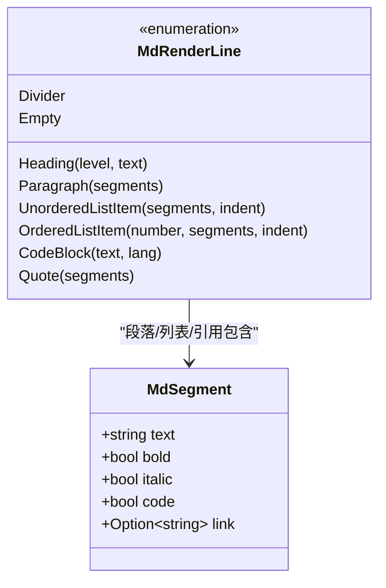
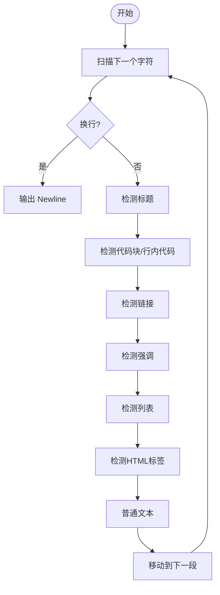
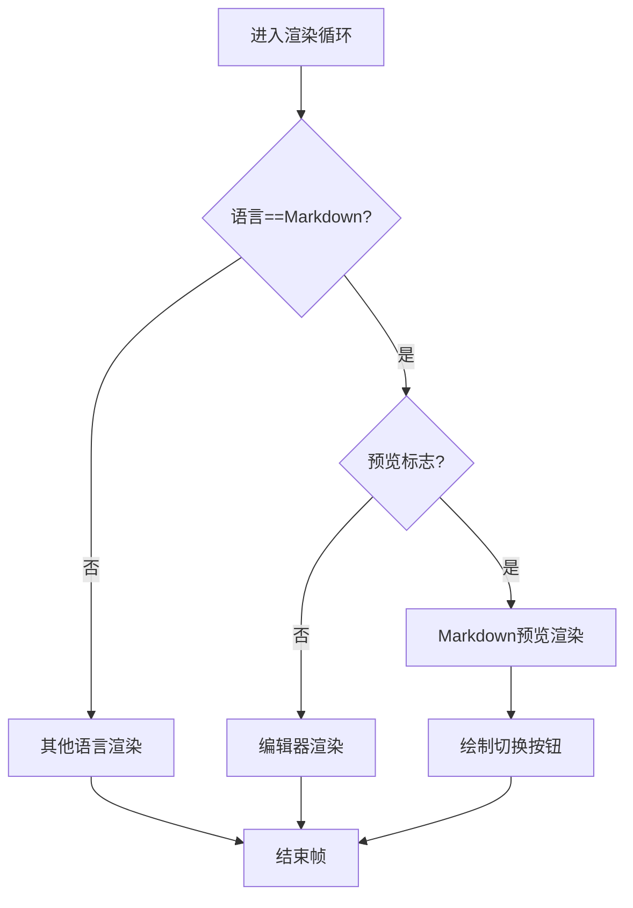
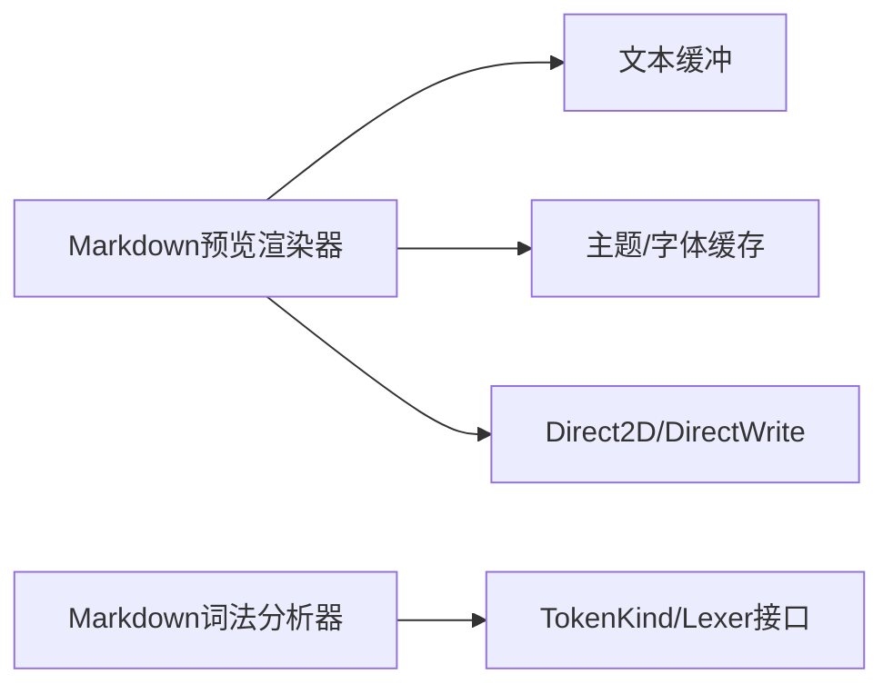

# Markdown预览模式

<cite>
**本文引用的文件**
- [README.md](file://README.md)
- [Cargo.toml](file://Cargo.toml)
- [markdown_preview.rs](file://crates/aether-win32/src/render/markdown_preview.rs)
- [render/mod.rs](file://crates/aether-win32/src/render/mod.rs)
- [markdown_lexer.rs](file://crates/aether-core/src/lexer/markdown_lexer.rs)
- [lexer/mod.rs](file://crates/aether-core/src/lexer/mod.rs)
</cite>

## 目录
1. [简介](#简介)
2. [项目结构](#项目结构)
3. [核心组件](#核心组件)
4. [架构总览](#架构总览)
5. [详细组件分析](#详细组件分析)
6. [依赖关系分析](#依赖关系分析)
7. [性能考量](#性能考量)
8. [故障排查指南](#故障排查指南)
9. [结论](#结论)

## 简介
本仓库为 Aether Studio（牧羊人编辑器）的源码，其中包含“Markdown 预览”功能：在编辑区右上角提供切换按钮，支持在“编辑/预览”之间切换；当处于预览模式且当前语言为 Markdown 时，渲染器将文本解析为结构化行并直接绘制到 Direct2D/DirectWrite 目标上，实现所见即所得的格式化预览。该功能与编辑器核心词法模块解耦，同时复用主题、字体格式缓存等渲染基础设施。

## 项目结构
- 工作区由多个 crate 组成，核心涉及：
  - aether-win32：Windows 原生 UI 层，负责窗口渲染、事件处理与 Markdown 预览渲染入口
  - aether-core：文本缓冲、词法分析框架与 Markdown 词法分析器
  - aether-render / aether-render-win：Direct2D/DirectWrite 渲染抽象与平台适配
- Markdown 预览的关键路径位于 aether-win32 的渲染模块中，解析逻辑内联于渲染器，同时 aether-core 提供独立的 Markdown 词法分析器供语法高亮等场景使用。

图表来源
- [render/mod.rs:814-850](file://crates/aether-win32/src/render/mod.rs#L814-L850)
- [markdown_preview.rs:80-167](file://crates/aether-win32/src/render/markdown_preview.rs#L80-L167)
- [markdown_lexer.rs:1-137](file://crates/aether-core/src/lexer/markdown_lexer.rs#L1-L137)

章节来源
- [README.md:48-66](file://README.md#L48-L66)
- [Cargo.toml:1-18](file://Cargo.toml#L1-L18)

## 核心组件
- Markdown 预览渲染器：负责读取缓冲区文本、解析为渲染行、按可见区域裁剪绘制、处理空文档提示、标题/段落/列表/代码块/引用/分割线等元素绘制。
- Markdown 词法分析器：面向语法高亮的轻量级分词器，识别标题、代码块、链接、强调、列表等标记，输出统一 Token 流。
- 渲染调度：根据当前语言与预览标志决定渲染分支，仅在 Markdown 语言且开启预览时进入预览渲染流程。

章节来源
- [markdown_preview.rs:80-167](file://crates/aether-win32/src/render/markdown_preview.rs#L80-L167)
- [markdown_lexer.rs:1-137](file://crates/aether-core/src/lexer/markdown_lexer.rs#L1-L137)
- [render/mod.rs:814-850](file://crates/aether-win32/src/render/mod.rs#L814-L850)

## 架构总览
Markdown 预览的整体数据流如下：
- 用户点击预览/编辑切换按钮，设置预览标志
- 渲染循环检测到 Markdown 语言且预览开启，调用预览渲染函数
- 从文本缓冲读取全文，解析为 MdRenderLine 序列
- 遍历渲染行，计算行高与可视裁剪，调用具体绘制函数
- 通过 DirectWrite TextLayout 应用富文本样式（粗体/斜体），绘制到目标表面

图表来源
- [render/mod.rs:814-850](file://crates/aether-win32/src/render/mod.rs#L814-L850)
- [markdown_preview.rs:80-167](file://crates/aether-win32/src/render/markdown_preview.rs#L80-L167)

## 详细组件分析

### Markdown 预览渲染器
- 职责
  - 渲染预览/编辑切换按钮（SVG图标、命中区域）
  - 渲染预览内容：背景、空文档提示、标题、段落、列表、代码块、引用、分割线
  - 基于滚动偏移进行可视裁剪，避免绘制不可见区域
  - 使用 DirectWrite TextLayout 对段落中的粗体/斜体片段应用样式
- 关键流程
  - 读取缓冲区文本，若为空则显示占位提示
  - 解析为 MdRenderLine 列表，逐行计算高度并绘制
  - 标题级别映射字号与缩放系数，H1/H2 下方绘制分割线
  - 代码块以深色背景+浅色文字呈现
  - 引用左侧绘制竖线，文本颜色偏灰
  - 分割线以半透明横线表示
- 数据结构
  - MdSegment：行内片段，包含文本、粗体/斜体/代码/链接标记
  - MdRenderLine：渲染行枚举，涵盖标题、段落、无序/有序列表、代码块、引用、分割线、空行

图表来源
- [markdown_preview.rs:743-783](file://crates/aether-win32/src/render/markdown_preview.rs#L743-L783)

章节来源
- [markdown_preview.rs:80-167](file://crates/aether-win32/src/render/markdown_preview.rs#L80-L167)
- [markdown_preview.rs:212-717](file://crates/aether-win32/src/render/markdown_preview.rs#L212-L717)
- [markdown_preview.rs:785-863](file://crates/aether-win32/src/render/markdown_preview.rs#L785-L863)

### Markdown 词法分析器
- 职责
  - 将 Markdown 文本切分为 Token 流，用于语法高亮等场景
  - 识别标题、代码块、行内代码、链接、强调、列表、HTML 标签与普通文本
- 算法要点
  - 单字节扫描，遇到特殊字符或模式匹配后快速推进位置
  - 标题：统计连续 # 数量，限制级别范围
  - 代码块/行内代码：定位反引号边界
  - 链接：匹配 [text](url) 模式
  - 强调：匹配 * 或 _ 的开闭标记，跨行未闭合时仅消耗开标记
  - 列表：识别无序/有序前缀
  - HTML 标签：跳过至 > 结束
- 复杂度
  - 时间 O(n)，空间 O(k) 存储 token 列表，k 为 token 数量

图表来源
- [markdown_lexer.rs:11-137](file://crates/aether-core/src/lexer/markdown_lexer.rs#L11-L137)

章节来源
- [markdown_lexer.rs:11-137](file://crates/aether-core/src/lexer/markdown_lexer.rs#L11-L137)
- [markdown_lexer.rs:145-264](file://crates/aether-core/src/lexer/markdown_lexer.rs#L145-L264)
- [lexer/mod.rs:1-64](file://crates/aether-core/src/lexer/mod.rs#L1-L64)

### 渲染调度与视图切换
- 渲染分支
  - 若当前语言为 Image，走图片预览分支
  - 若当前语言为 Markdown 且预览标志为真，走 Markdown 预览分支
  - 否则走普通编辑器渲染分支
- 切换按钮
  - 在 Markdown 语言且非欢迎页/空占位时显示预览/编辑切换按钮
  - 按钮区域记录命中矩形，用于鼠标交互

图表来源
- [render/mod.rs:814-850](file://crates/aether-win32/src/render/mod.rs#L814-L850)
- [markdown_preview.rs:80-167](file://crates/aether-win32/src/render/markdown_preview.rs#L80-L167)

章节来源
- [render/mod.rs:814-850](file://crates/aether-win32/src/render/mod.rs#L814-L850)
- [markdown_preview.rs:80-167](file://crates/aether-win32/src/render/markdown_preview.rs#L80-L167)

## 依赖关系分析
- 渲染器依赖
  - 文本缓冲：读取全文
  - 主题与字体缓存：获取画笔与文本格式
  - Direct2D/DirectWrite：绘制几何与文本布局
- 词法分析器依赖
  - 通用 Lexer trait 与 TokenKind 定义
- 耦合与内聚
  - 预览解析逻辑内聚于渲染器，便于快速迭代与优化
  - 词法分析器独立于渲染器，可被语法高亮复用

图表来源
- [markdown_preview.rs:80-167](file://crates/aether-win32/src/render/markdown_preview.rs#L80-L167)
- [markdown_lexer.rs:1-137](file://crates/aether-core/src/lexer/markdown_lexer.rs#L1-L137)
- [lexer/mod.rs:1-64](file://crates/aether-core/src/lexer/mod.rs#L1-L64)

章节来源
- [markdown_preview.rs:80-167](file://crates/aether-win32/src/render/markdown_preview.rs#L80-L167)
- [markdown_lexer.rs:1-137](file://crates/aether-core/src/lexer/markdown_lexer.rs#L1-L137)
- [lexer/mod.rs:1-64](file://crates/aether-core/src/lexer/mod.rs#L1-L64)

## 性能考量
- 可视裁剪：仅绘制可见行，减少不必要的绘制开销
- 文本布局复用：通过 DirectWrite TextLayout 批量应用富文本样式，避免多次创建格式对象
- 主题与画笔缓存：复用已创建的画笔与格式，降低系统调用频率
- 解析策略：行级解析简单高效，适合中等规模文档；超大文档可考虑增量解析与分页渲染
- 内存分配：段落拼接纯文本用于 TextLayout，注意大文档下的字符串拷贝成本

[本节为通用指导，不直接分析具体文件]

## 故障排查指南
- 预览不显示
  - 检查当前语言是否为 Markdown 且预览标志是否开启
  - 确认渲染分支是否正确进入预览渲染
- 空白文档提示
  - 若缓冲区为空，会显示占位提示；检查文本读取逻辑
- 富文本样式异常
  - 检查段落解析生成的 MdSegment 是否正确标记粗体/斜体
  - 确认 TextLayout 的范围与长度计算无误
- 列表/引用/代码块渲染错位
  - 检查行高计算与缩进参数
  - 核对代码块背景与文本颜色配置

章节来源
- [render/mod.rs:814-850](file://crates/aether-win32/src/render/mod.rs#L814-L850)
- [markdown_preview.rs:169-210](file://crates/aether-win32/src/render/markdown_preview.rs#L169-L210)
- [markdown_preview.rs:340-437](file://crates/aether-win32/src/render/markdown_preview.rs#L340-L437)
- [markdown_preview.rs:558-717](file://crates/aether-win32/src/render/markdown_preview.rs#L558-L717)

## 结论
Markdown 预览模式通过轻量级行级解析与 Direct2D/DirectWrite 渲染，实现了高效的所见即所得体验。其设计将解析与渲染紧密集成，同时保持与词法分析器的解耦，便于在不同场景复用。未来可在超大文档场景引入增量解析与分页渲染，进一步提升性能与可扩展性。

[本节为总结，不直接分析具体文件]