# UI 系统

<cite>
**本文引用的文件**   
- [main.rs](file://crates/aether-win32/src/main.rs)
- [window.rs](file://crates/aether-win32/src/window.rs)
- [window_setup.rs](file://crates/aether-win32/src/window/window_setup.rs)
- [render.rs](file://crates/aether-win32/src/render.rs)
- [render_context.rs](file://crates/aether-win32/src/render_context.rs)
- [dirty_rect.rs](file://crates/aether-win32/src/dirty_rect.rs)
- [hit_test.rs](file://crates/aether-win32/src/hit_test.rs)
- [input.rs](file://crates/aether-win32/src/input.rs)
- [ime.rs](file://crates/aether-win32/src/ime.rs)
- [keyboard_handler.rs](file://crates/aether-win32/src/window/keyboard_handler.rs)
- [mouse_handler.rs](file://crates/aether-win32/src/window/mouse_handler.rs)
- [theme.rs](file://crates/aether-win32/src/theme.rs)
- [aether-render_theme.rs](file://crates/aether-render/src/theme.rs)
- [aether-render_lib.rs](file://crates/aether-render/src/lib.rs)
- [user_menu.rs](file://crates/aether-win32/src/user_menu.rs)
- [account.rs](file://crates/aether-win32/src/render/account.rs)
- [welcome.rs](file://crates/aether-win32/src/welcome.rs)
- [bitmap_loader.rs](file://crates/aether-win32/src/bitmap_loader.rs)
- [browser.rs](file://crates/aether-win32/src/browser.rs)
- [agent_right_panel.rs](file://crates/aether-win32/src/render/agent_right_panel.rs)
- [agent_sidebar.rs](file://crates/aether-win32/src/render/agent_sidebar.rs)
- [chrome.rs](file://crates/aether-win32/src/render/chrome.rs)
- [layout.rs](file://crates/aether-win32/src/layout.rs)
- [ai_agent.rs](file://crates/aether-ai-panel/src/ai_agent.rs)
</cite>

## 更新摘要
**变更内容**   
- 新增嵌入式浏览器功能，基于 WebView2 实现智能体模式下的网页浏览能力
- 新增 Agent 右侧面板组件，支持标签页管理、新标签页快捷操作和浏览器工具栏
- 新增 Agent 侧边栏组件，提供对话历史管理和工作区文件列表
- 增强布局系统以支持智能体模式和开发者模式的动态切换
- 集成 AI Agent 工具标记协议，支持文件编辑、命令执行等高级功能

## 目录
1. [简介](#简介)
2. [项目结构](#项目结构)
3. [核心组件](#核心组件)
4. [架构总览](#架构总览)
5. [详细组件分析](#详细组件分析)
6. [依赖关系分析](#依赖关系分析)
7. [性能考量](#性能考量)
8. [故障排查指南](#故障排查指南)
9. [结论](#结论)
10. [附录](#附录)

## 简介
本技术文档面向牧羊人编辑器的 UI 子系统，聚焦以下方面：
- Win32 窗口管理机制：窗口创建、消息循环与事件分发
- Direct2D/DirectWrite 渲染集成：绘制上下文管理、脏矩形优化与动画效果
- 输入事件处理：键盘映射、鼠标交互与输入法（IME）支持
- 主题系统：颜色管理、样式继承与动态切换
- **新增** 嵌入式浏览器功能：基于 WebView2 的智能体模式网页浏览
- **新增** Agent 模式支持：右侧面板和侧边栏组件的完整实现
- UI 组件开发最佳实践与性能优化技巧

**更新** 已新增完整的浏览器功能和Agent模式支持，包括嵌入式WebView2浏览器、Agent右侧面板和Agent侧边栏组件，显著增强了编辑器的智能化能力。

## 项目结构
UI 子系统主要位于 aether-win32 crate 中，围绕 window 模块组织；渲染相关能力由 aether-render crate 提供。**新增** 的浏览器和Agent模式功能分布在专门的模块中。关键入口与职责如下：
- main.rs：进程启动、单实例控制、调用 run(args)
- window.rs：注册窗口类、创建主窗口、消息循环、WndProc 分发
- window/window_setup.rs：DPI 感知、DWM 背景效果、窗口持久化、COPYDATA 处理
- render.rs：EditorState::render 主渲染流程、区域裁剪、设备丢失恢复
- render_context.rs：Direct2D 渲染目标封装、画刷/文本格式缓存、多矩形裁剪
- dirty_rect.rs：脏矩形追踪与渲染命令推断
- hit_test.rs：命中区域记录（调试/测试构建）
- input.rs：按键类型、快捷键绑定、动作枚举、多光标模型
- ime.rs：IMM32 集成，候选/合成窗口定位与 DPI 缩放
- window/keyboard_handler.rs、window/mouse_handler.rs：键盘/鼠标事件拆分处理
- theme.rs：UI 设置与默认主题工厂
- user_menu.rs：用户菜单和头像下拉菜单功能
- render/account.rs：账户相关的渲染逻辑（简化版）
- welcome.rs：欢迎屏幕界面，包含吉祥物图像显示
- bitmap_loader.rs：位图加载器，支持嵌入式PNG资源
- **新增** browser.rs：嵌入式浏览器管理器，基于 WebView2 实现
- **新增** agent_right_panel.rs：Agent模式右侧面板渲染
- **新增** agent_sidebar.rs：Agent模式左侧边栏渲染
- **新增** chrome.rs：状态栏、菜单栏、标题栏渲染增强
- **新增** layout.rs：布局管理器，支持智能体模式切换
- **新增** ai_agent.rs：AI Agent工具标记协议解析

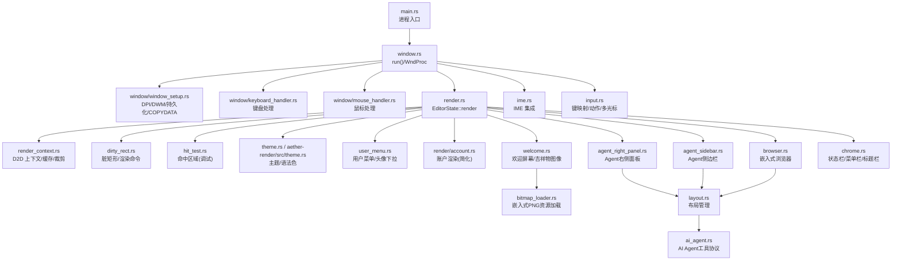

**图表来源** 
- [main.rs:1-52](file://crates/aether-win32/src/main.rs#L1-L52)
- [window.rs:114-173](file://crates/aether-win32/src/window.rs#L114-L173)
- [window_setup.rs:18-86](file://crates/aether-win32/src/window/window_setup.rs#L18-L86)
- [render.rs:62-780](file://crates/aether-win32/src/render.rs#L62-L780)
- [render_context.rs:1-226](file://crates/aether-win32/src/render_context.rs#L1-L226)
- [dirty_rect.rs:1-707](file://crates/aether-win32/src/dirty_rect.rs#L1-L707)
- [hit_test.rs:1-245](file://crates/aether-win32/src/hit_test.rs#L1-L245)
- [ime.rs:1-255](file://crates/aether-win32/src/ime.rs#L1-L255)
- [input.rs:1-355](file://crates/aether-win32/src/input.rs#L1-L355)
- [theme.rs:1-26](file://crates/aether-win32/src/theme.rs#L1-L26)
- [aether-render_theme.rs:1-485](file://crates/aether-render/src/theme.rs#L1-L485)
- [user_menu.rs:1-100](file://crates/aether-win32/src/user_menu.rs#L1-L100)
- [account.rs:1-50](file://crates/aether-win32/src/render/account.rs#L1-L50)
- [welcome.rs:1-100](file://crates/aether-win32/src/welcome.rs#L1-L100)
- [bitmap_loader.rs:1-100](file://crates/aether-win32/src/bitmap_loader.rs#L1-L100)
- [browser.rs:1-651](file://crates/aether-win32/src/browser.rs#L1-L651)
- [agent_right_panel.rs:1-568](file://crates/aether-win32/src/render/agent_right_panel.rs#L1-L568)
- [agent_sidebar.rs:1-284](file://crates/aether-win32/src/render/agent_sidebar.rs#L1-L284)
- [chrome.rs:1-800](file://crates/aether-win32/src/render/chrome.rs#L1-L800)
- [layout.rs:1-400](file://crates/aether-win32/src/layout.rs#L1-L400)
- [ai_agent.rs:1-800](file://crates/aether-ai-panel/src/ai_agent.rs#L1-L800)

**章节来源**
- [main.rs:1-52](file://crates/aether-win32/src/main.rs#L1-L52)
- [window.rs:114-173](file://crates/aether-win32/src/window.rs#L114-L173)

## 核心组件
- 窗口与消息循环
  - 注册窗口类、创建主窗口、设置 DPI 感知与 DWM 背景效果
  - 全局窗口计数确保多窗口正确退出
  - WndProc 统一分发到各处理器
- 渲染管线
  - EditorState::render 负责布局计算、脏区推断、裁剪与绘制
  - RenderContext 封装 D2D 目标、画刷/文本格式缓存、多矩形裁剪
  - DirtyRectTracker 维护脏矩形并推断最小重绘范围
- 输入系统
  - KeyMap 将虚拟键码转换为编辑器动作
  - 鼠标/滚轮处理覆盖标签栏、侧边栏、终端等区域
  - IME 集成支持候选/合成窗口定位与 DPI 缩放
- 主题系统
  - Theme 提供玻璃/深色两套配色，SyntaxColors 集中管理语法着色
  - 通过 BrushCache/TextFormatCache 预初始化常用资源
- 用户界面组件
  - 简化的用户菜单系统，仅包含头像下拉菜单功能
  - 移除了复杂的账户设置页面，降低了UI架构复杂度
  - **新增** 欢迎屏幕吉祥物图像采用嵌入式PNG资源，确保跨平台一致性
- **新增** 嵌入式浏览器系统
  - 基于 WebView2 的嵌入式浏览器，支持标签页管理
  - 异步环境初始化，避免阻塞主线程
  - 智能体模式下叠于右面板，经典模式下叠于编辑器区域
- **新增** Agent 模式组件
  - 右侧面板：标签页管理、新标签页快捷操作、浏览器工具栏
  - 左侧边栏：对话历史管理、工作区文件列表
  - 支持智能体模式与开发者模式的动态切换

**更新** 新增了完整的浏览器功能和Agent模式支持，包括嵌入式WebView2浏览器、Agent右侧面板和Agent侧边栏组件，显著增强了编辑器的智能化能力。

**章节来源**
- [window.rs:175-297](file://crates/aether-win32/src/window.rs#L175-L297)
- [render.rs:62-780](file://crates/aether-win32/src/render.rs#L62-L780)
- [render_context.rs:1-226](file://crates/aether-win32/src/render_context.rs#L1-L226)
- [dirty_rect.rs:1-707](file://crates/aether-win32/src/dirty_rect.rs#L1-L707)
- [input.rs:1-355](file://crates/aether-win32/src/input.rs#L1-L355)
- [ime.rs:1-255](file://crates/aether-win32/src/ime.rs#L1-L255)
- [theme.rs:1-26](file://crates/aether-win32/src/theme.rs#L1-L26)
- [aether-render_theme.rs:1-485](file://crates/aether-render/src/theme.rs#L1-L485)
- [user_menu.rs:1-100](file://crates/aether-win32/src/user_menu.rs#L1-L100)
- [account.rs:1-50](file://crates/aether-win32/src/render/account.rs#L1-L50)
- [welcome.rs:1-100](file://crates/aether-win32/src/welcome.rs#L1-L100)
- [bitmap_loader.rs:1-100](file://crates/aether-win32/src/bitmap_loader.rs#L1-L100)
- [browser.rs:1-651](file://crates/aether-win32/src/browser.rs#L1-L651)
- [agent_right_panel.rs:1-568](file://crates/aether-win32/src/render/agent_right_panel.rs#L1-L568)
- [agent_sidebar.rs:1-284](file://crates/aether-win32/src/render/agent_sidebar.rs#L1-L284)

## 架构总览
下图展示从进程启动到渲染输出的关键路径，以及输入事件如何驱动状态变更与重绘。**新增** 了浏览器和Agent模式的完整集成路径。

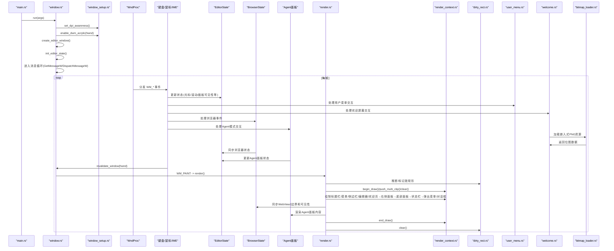

**图表来源** 
- [main.rs:1-52](file://crates/aether-win32/src/main.rs#L1-L52)
- [window.rs:114-173](file://crates/aether-win32/src/window.rs#L114-L173)
- [window_setup.rs:18-86](file://crates/aether-win32/src/window/window_setup.rs#L18-L86)
- [render.rs:62-780](file://crates/aether-win32/src/render.rs#L62-L780)
- [render_context.rs:66-155](file://crates/aether-win32/src/render_context.rs#L66-L155)
- [dirty_rect.rs:387-426](file://crates/aether-win32/src/dirty_rect.rs#L387-L426)
- [user_menu.rs:1-100](file://crates/aether-win32/src/user_menu.rs#L1-L100)
- [welcome.rs:1-100](file://crates/aether-win32/src/welcome.rs#L1-L100)
- [bitmap_loader.rs:1-100](file://crates/aether-win32/src/bitmap_loader.rs#L1-L100)
- [browser.rs:1-651](file://crates/aether-win32/src/browser.rs#L1-L651)
- [agent_right_panel.rs:1-568](file://crates/aether-win32/src/render/agent_right_panel.rs#L1-L568)
- [agent_sidebar.rs:1-284](file://crates/aether-win32/src/render/agent_sidebar.rs#L1-L284)

## 详细组件分析

### Win32 窗口管理与消息循环
- 窗口类注册与创建
  - 使用 RegisterClassW 注册窗口类，CreateWindowExW 创建主窗口
  - 启用 CS_DBLCLKS 以接收双击消息
  - 应用 DWM 属性实现 Acrylic/Mica 背景与透明客户区穿透
- DPI 感知与尺寸恢复
  - 优先使用 Per-Monitor V2 DPI 感知，失败回退至 Per-Monitor
  - 根据持久化 settings 计算窗口矩形，校验显示器存在性
  - 最大化状态在创建后通过 ShowWindow(SW_MAXIMIZE) 恢复
- 消息循环与分发
  - GetMessageW/TranslateMessage/DispatchMessageW 标准循环
  - WndProc 内 catch_unwind 包裹，异常时回退 DefWindowProcW
  - 自定义消息用于低层键盘钩子投递（终端直接接收编辑键）
- 窗口生命周期与持久化
  - WM_DESTROY 中卸载键盘钩子、持久化窗口位置/最大化/工作区
  - 全局窗口计数保证所有窗口关闭才退出应用

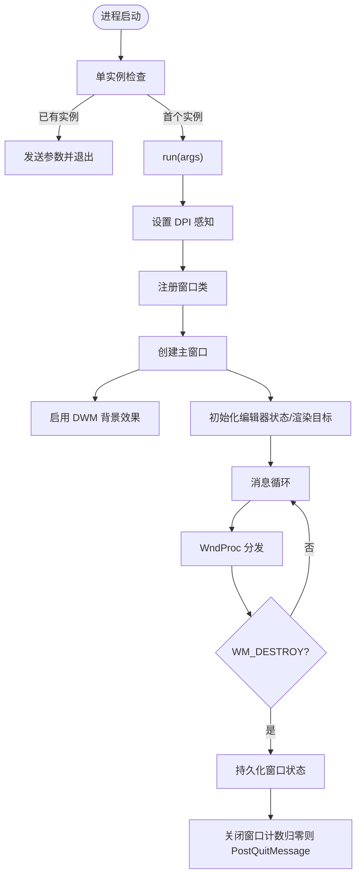

**图表来源** 
- [main.rs:1-52](file://crates/aether-win32/src/main.rs#L1-L52)
- [window.rs:114-173](file://crates/aether-win32/src/window.rs#L114-L173)
- [window_setup.rs:18-86](file://crates/aether-win32/src/window/window_setup.rs#L18-L86)
- [window_setup.rs:110-178](file://crates/aether-win32/src/window/window_setup.rs#L110-L178)
- [window_setup.rs:188-217](file://crates/aether-win32/src/window/window_setup.rs#L188-L217)
- [window.rs:299-373](file://crates/aether-win32/src/window.rs#L299-L373)

**章节来源**
- [window.rs:175-297](file://crates/aether-win32/src/window.rs#L175-L297)
- [window_setup.rs:18-86](file://crates/aether-win32/src/window/window_setup.rs#L18-L86)
- [window_setup.rs:110-178](file://crates/aether-win32/src/window/window_setup.rs#L110-L178)
- [window_setup.rs:188-217](file://crates/aether-win32/src/window/window_setup.rs#L188-L217)
- [window.rs:299-373](file://crates/aether-win32/src/window.rs#L299-L373)

### Direct2D/DirectWrite 渲染集成
- 绘制上下文管理
  - RenderContext 封装 ID2D1HwndRenderTarget、BrushCache、TextFormatCache、TextLayoutCache
  - 设备丢失时清理并重建资源，避免崩溃
- 脏矩形与裁剪
  - DirtyRectTracker 按区域类型合并重叠矩形，超过阈值降级为全窗口重绘
  - RenderContext::push_multi_clip 支持多矩形并集裁剪，失败回退包围盒
- 渲染流程
  - EditorState::render 先计算布局与可见行范围，重建增量缓存
  - 根据状态变化推断 RenderCommand，仅标记必要脏区域
  - 按层级绘制：标题栏→菜单栏→活动栏→侧边栏→标签栏→编辑器/欢迎页→右侧面板→底部面板→状态栏→弹出菜单/对话框
  - 最后清除脏标记并输出命中区域（调试）

**更新** 渲染流程已增强，新增了对嵌入式浏览器和Agent模式的支持。在智能体模式下，WebView2 子窗口会叠于右面板内容区域之上，提供更好的用户体验。

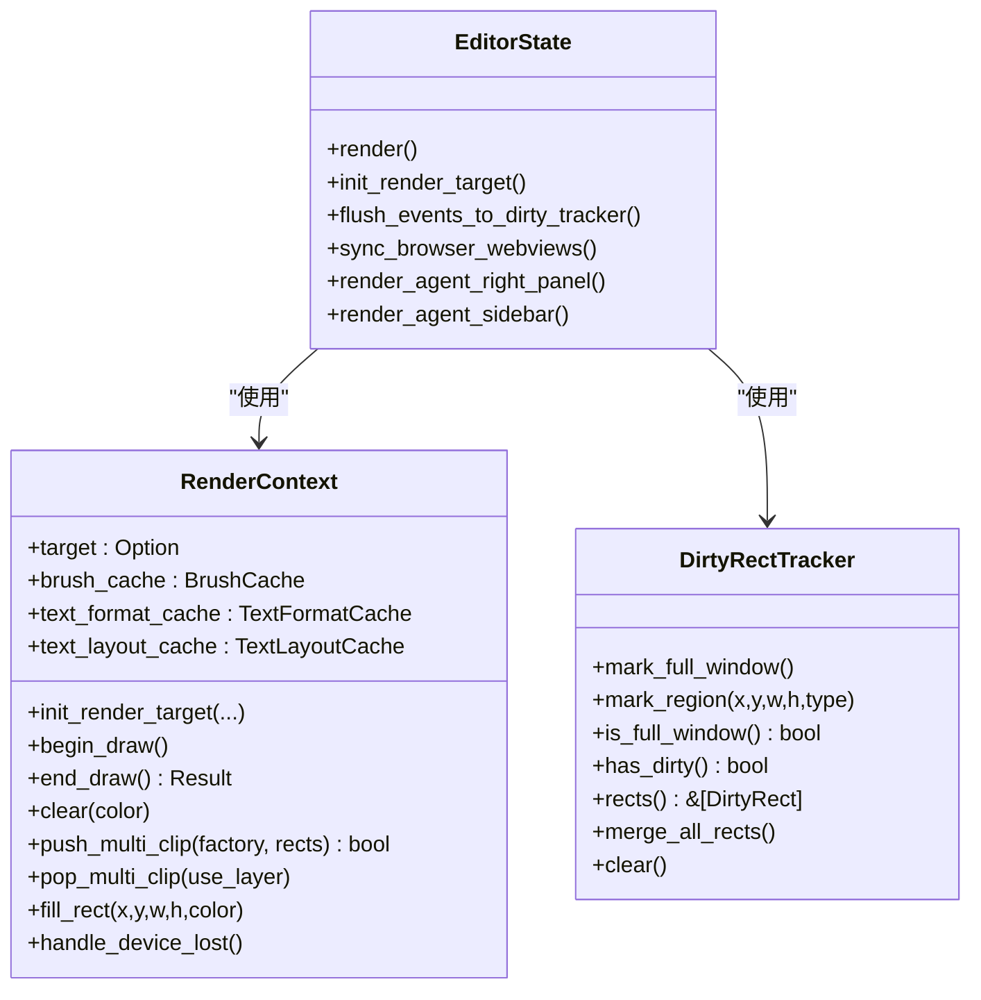

**图表来源** 
- [render_context.rs:1-226](file://crates/aether-win32/src/render_context.rs#L1-L226)
- [dirty_rect.rs:1-707](file://crates/aether-win32/src/dirty_rect.rs#L1-L707)
- [render.rs:62-780](file://crates/aether-win32/src/render.rs#L62-L780)
- [browser.rs:608-651](file://crates/aether-win32/src/browser.rs#L608-L651)
- [agent_right_panel.rs:1-568](file://crates/aether-win32/src/render/agent_right_panel.rs#L1-L568)
- [agent_sidebar.rs:1-284](file://crates/aether-win32/src/render/agent_sidebar.rs#L1-L284)

**章节来源**
- [render.rs:62-780](file://crates/aether-win32/src/render.rs#L62-L780)
- [render_context.rs:1-226](file://crates/aether-win32/src/render_context.rs#L1-L226)
- [dirty_rect.rs:1-707](file://crates/aether-win32/src/dirty_rect.rs#L1-L707)

### 输入事件处理系统
- 键盘映射
  - KeyMap 将 VK 码与修饰键组合映射到 EditorAction
  - vk_to_char 使用 ToUnicode 获取当前键盘布局字符，支持多语言
- 鼠标交互
  - 左键按下/抬起/双击：选择、拖拽、标签重排、长按检测
  - 滚轮：标签栏横向滚动、Shift+滚轮横向滚动、终端面板滚动、侧边栏滚动
  - 水平滚轮：编辑器内容横向滚动
- IME 支持
  - IMM32 集成：ImmGetContext/ImmSetCandidateWindow/ImmSetCompositionWindow
  - 候选/合成窗口尺寸随 DPI 缩放，跟随光标定位
  - 支持临时解除 IME 关联以旁路系统级拦截（如终端删除汉字问题）

**更新** 输入系统已增强以支持新的浏览器和Agent模式功能。现在可以处理浏览器标签页的点击事件、Agent面板的交互操作，以及智能体模式下的特殊键盘快捷键。

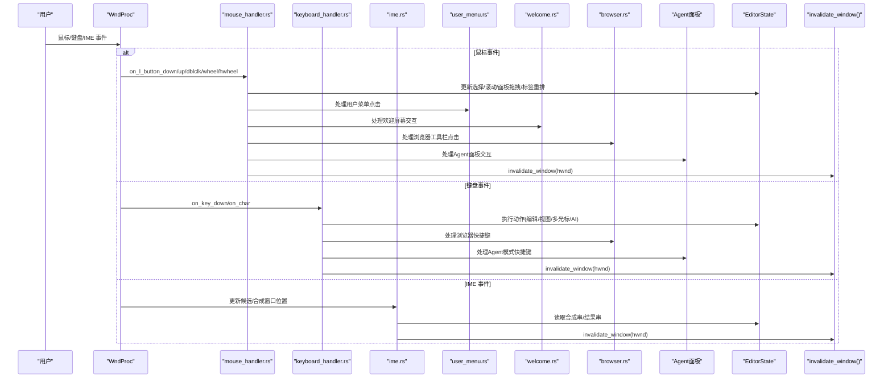

**图表来源** 
- [window.rs:301-373](file://crates/aether-win32/src/window.rs#L301-L373)
- [mouse_handler.rs:1-277](file://crates/aether-win32/src/window/mouse_handler.rs#L1-L277)
- [keyboard_handler.rs:1-13](file://crates/aether-win32/src/window/keyboard_handler.rs#L1-L13)
- [ime.rs:1-255](file://crates/aether-win32/src/ime.rs#L1-L255)
- [input.rs:1-355](file://crates/aether-win32/src/input.rs#L1-L355)
- [user_menu.rs:1-100](file://crates/aether-win32/src/user_menu.rs#L1-L100)
- [welcome.rs:1-100](file://crates/aether-win32/src/welcome.rs#L1-L100)
- [browser.rs:1-651](file://crates/aether-win32/src/browser.rs#L1-L651)
- [agent_right_panel.rs:1-568](file://crates/aether-win32/src/render/agent_right_panel.rs#L1-L568)
- [agent_sidebar.rs:1-284](file://crates/aether-win32/src/render/agent_sidebar.rs#L1-L284)

**章节来源**
- [input.rs:1-355](file://crates/aether-win32/src/input.rs#L1-L355)
- [mouse_handler.rs:1-277](file://crates/aether-win32/src/window/mouse_handler.rs#L1-L277)
- [keyboard_handler.rs:1-13](file://crates/aether-win32/src/window/keyboard_handler.rs#L1-L13)
- [ime.rs:1-255](file://crates/aether-win32/src/ime.rs#L1-L255)
- [user_menu.rs:1-100](file://crates/aether-win32/src/user_menu.rs#L1-L100)
- [welcome.rs:1-100](file://crates/aether-win32/src/welcome.rs#L1-L100)

### 主题系统
- 颜色管理
  - Theme 包含编辑器背景、行号、选择高亮、侧边栏、状态栏、标签栏、标题栏、阴影、光晕等字段
  - SyntaxColors 统一管理关键字、字符串、注释、函数、类型名、语义令牌等颜色
  - color_for_token/color_for_semantic_token_index 提供通用 token 与语义令牌的颜色查找
- 样式继承与默认值
  - dark() 与 glass() 共享 SyntaxColors::shared()，减少重复
  - Default 实现返回 glass 主题
- 动态切换
  - 通过 brush_cache.init_common_brushes 与 text_format_cache.init_common_formats 预初始化常用资源
  - 设备丢失或主题切换时重建缓存

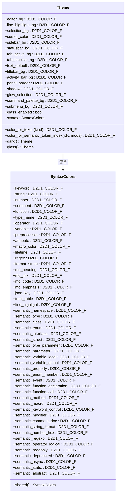

**图表来源** 
- [aether-render_theme.rs:1-485](file://crates/aether-render/src/theme.rs#L1-L485)

**章节来源**
- [aether-render_theme.rs:1-485](file://crates/aether-render/src/theme.rs#L1-L485)
- [theme.rs:1-26](file://crates/aether-win32/src/theme.rs#L1-L26)
- [render_context.rs:189-217](file://crates/aether-win32/src/render_context.rs#L189-L217)

### 嵌入式浏览器系统

**新增** 基于 WebView2 的嵌入式浏览器系统，为智能体模式提供强大的网页浏览能力。

- WebView2 集成
  - 使用 Microsoft Edge Chromium 内核的 WebView2 控件
  - 每个窗口共享一个 ICoreWebView2Environment，首次打开时惰性异步创建
  - 每个浏览器标签持有一个 ICoreWebView2Controller，父窗口为主窗口
  - 所有回调通过 PostMessage 安全地传递到 UI 线程处理
- 浏览器实例管理
  - BrowserState 管理多个浏览器实例的生命周期
  - 支持标签页的创建、销毁、导航和历史记录管理
  - 自动处理 WebView2 环境的初始化和错误恢复
- 智能体模式集成
  - 在智能体模式下，浏览器叠于右面板内容区域之上
  - 在经典模式下，浏览器叠于中心编辑器内容区域
  - 每帧同步 WebView2 子窗口的边界和可见性
- 工具栏功能
  - 后退/前进按钮，支持历史记录导航
  - 刷新按钮，重新加载当前页面
  - 地址栏，支持 URL 输入和搜索查询
  - 自动 URL 规范化，支持域名补全和搜索查询转换

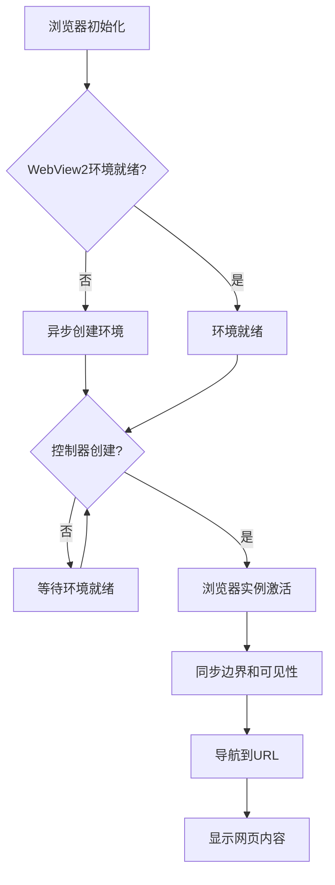

**图表来源** 
- [browser.rs:237-651](file://crates/aether-win32/src/browser.rs#L237-L651)

**章节来源**
- [browser.rs:1-651](file://crates/aether-win32/src/browser.rs#L1-L651)

### Agent 模式组件

**新增** 完整的 Agent 模式支持，包括右侧面板和左侧边栏组件。

- Agent 右侧面板
  - 标签页管理：支持多个标签页的创建、切换和关闭
  - 新标签页（NTP）：提供快捷搜索框和常用操作按钮
  - 浏览器工具栏：集成嵌入式浏览器的导航功能
  - 内容区域：根据活动标签页类型渲染不同的内容
- Agent 左侧边栏
  - 对话历史：显示和管理 AI 对话会话
  - 工作区文件：集成文件树浏览功能
  - 新会话按钮：快速创建新的 AI 对话
  - 可折叠设计：支持对话历史和文件列表的展开/收起
- 布局管理
  - 支持智能体模式和开发者模式的动态切换
  - 智能体模式下，AI 对话面板为主体，编辑器移至右侧
  - 开发者模式下，传统 IDE 布局，AI 面板在右侧
- AI Agent 工具协议
  - 支持文件编辑、命令执行、只读探查等工具标记
  - 解析 AI 回复中的结构化指令
  - 提供精确的代码定位和编辑功能

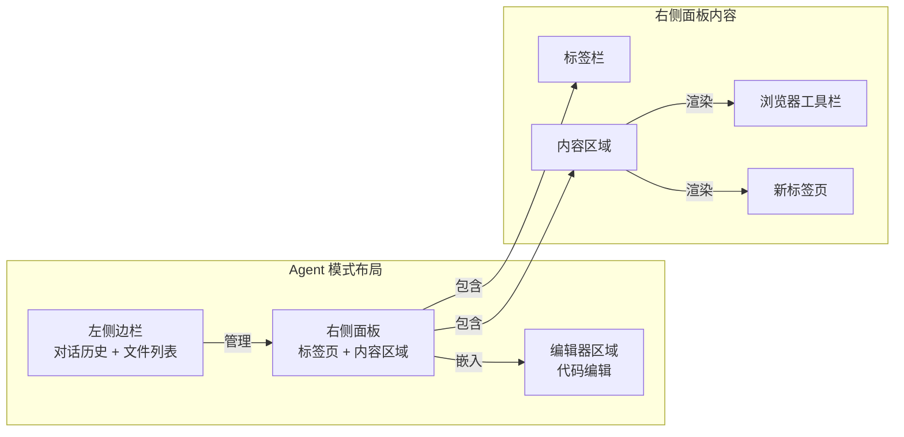

**图表来源** 
- [agent_right_panel.rs:1-568](file://crates/aether-win32/src/render/agent_right_panel.rs#L1-L568)
- [agent_sidebar.rs:1-284](file://crates/aether-win32/src/render/agent_sidebar.rs#L1-L284)
- [layout.rs:137-171](file://crates/aether-win32/src/layout.rs#L137-L171)
- [ai_agent.rs:1-800](file://crates/aether-ai-panel/src/ai_agent.rs#L1-L800)

**章节来源**
- [agent_right_panel.rs:1-568](file://crates/aether-win32/src/render/agent_right_panel.rs#L1-L568)
- [agent_sidebar.rs:1-284](file://crates/aether-win32/src/render/agent_sidebar.rs#L1-L284)
- [layout.rs:137-171](file://crates/aether-win32/src/layout.rs#L137-L171)
- [ai_agent.rs:1-800](file://crates/aether-ai-panel/src/ai_agent.rs#L1-L800)

### 用户界面组件简化

**更新** 用户界面组件已大幅简化，移除了复杂的账户设置页面功能。

- 简化的用户菜单
  - 仅保留头像下拉菜单功能，提供更简洁的用户交互体验
  - 移除了账户设置页面的复杂渲染逻辑和相关状态管理
  - 减少了UI组件间的耦合度，提高了系统的可维护性
- 账户渲染简化
  - account.rs 模块现在只处理基本的账户信息显示
  - 移除了设置页面的表单渲染、验证逻辑和数据持久化
  - 降低了内存占用和渲染开销

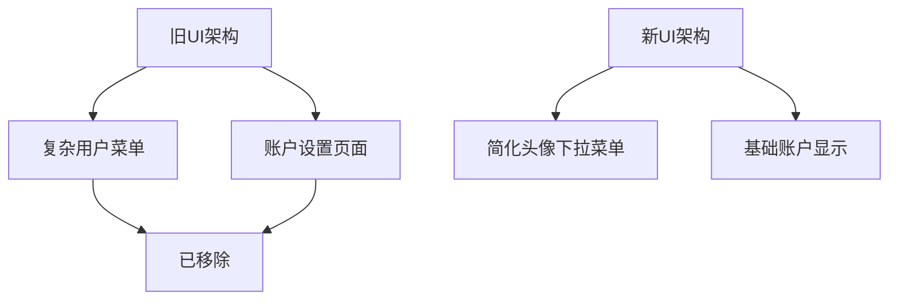

**图表来源** 
- [user_menu.rs:1-100](file://crates/aether-win32/src/user_menu.rs#L1-L100)
- [account.rs:1-50](file://crates/aether-win32/src/render/account.rs#L1-L50)

**章节来源**
- [user_menu.rs:1-100](file://crates/aether-win32/src/user_menu.rs#L1-L100)
- [account.rs:1-50](file://crates/aether-win32/src/render/account.rs#L1-L50)

### 欢迎屏幕吉祥物图像处理改进

**更新** Windows编辑器欢迎屏幕吉祥物图像处理得到显著改进，采用嵌入式PNG资源确保跨构建环境的一致性。

- 嵌入式PNG资源管理
  - 吉祥物图像直接从二进制可执行文件中加载，不再依赖外部文件系统
  - 解决了CI构建环境和不同部署场景下的资源缺失问题
  - 确保了应用程序在所有环境下具有一致的视觉呈现
- 位图加载器优化
  - bitmap_loader.rs 模块支持从嵌入式资源加载PNG格式图像
  - 提供了统一的位图接口，简化了图像资源的访问和管理
  - 支持内存高效的图像解码和渲染
- 欢迎屏幕渲染增强
  - welcome.rs 模块集成了新的嵌入式图像加载机制
  - 保持了原有的欢迎屏幕布局和交互逻辑
  - 提升了图像加载的可靠性和性能

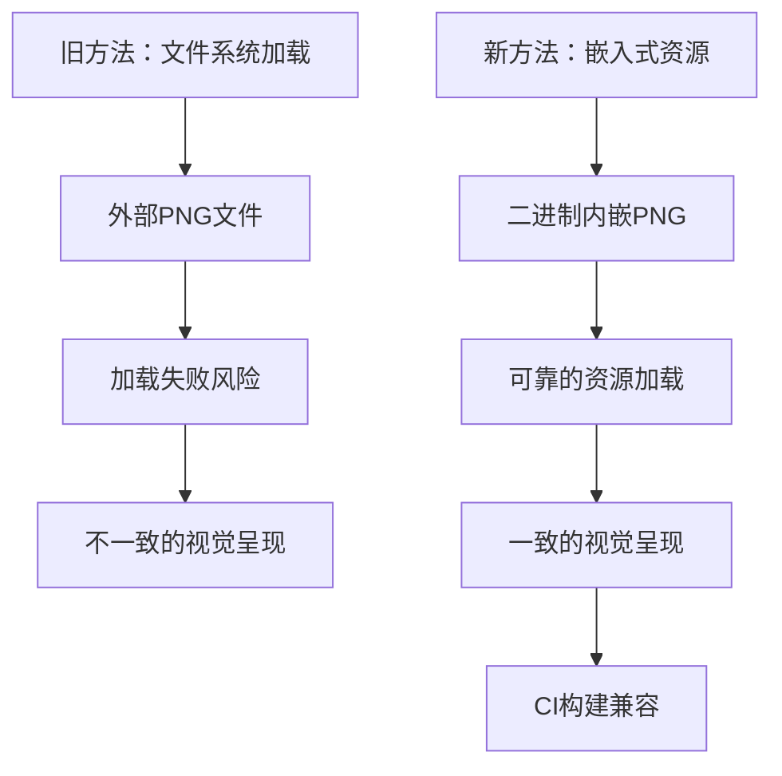

**图表来源** 
- [welcome.rs:1-100](file://crates/aether-win32/src/welcome.rs#L1-L100)
- [bitmap_loader.rs:1-100](file://crates/aether-win32/src/bitmap_loader.rs#L1-L100)

**章节来源**
- [welcome.rs:1-100](file://crates/aether-win32/src/welcome.rs#L1-L100)
- [bitmap_loader.rs:1-100](file://crates/aether-win32/src/bitmap_loader.rs#L1-L100)

## 依赖关系分析
- 模块耦合
  - window.rs 依赖 window_setup、keyboard_handler、mouse_handler、render、ime、input
  - render.rs 依赖 render_context、dirty_rect、theme、layout、icons 等
  - render_context.rs 依赖 aether-render d2d factory/brush/text 缓存
- 外部依赖
  - Windows API：窗口、消息、DWM、GDI、HiDpi、IME、Direct2D、DirectWrite
  - aether-core：字符宽度、词法分析器语言枚举
  - aether-shared：AppSettings 持久化
- **新增** 浏览器和Agent模式依赖
  - webview2_com：WebView2 COM 接口
  - windows：Windows API 绑定
  - aether-ai-panel：AI Agent 功能模块

**更新** 由于新增了浏览器和Agent模式功能，依赖关系变得更加复杂。现在需要额外的 WebView2 运行时支持和 AI 面板模块。

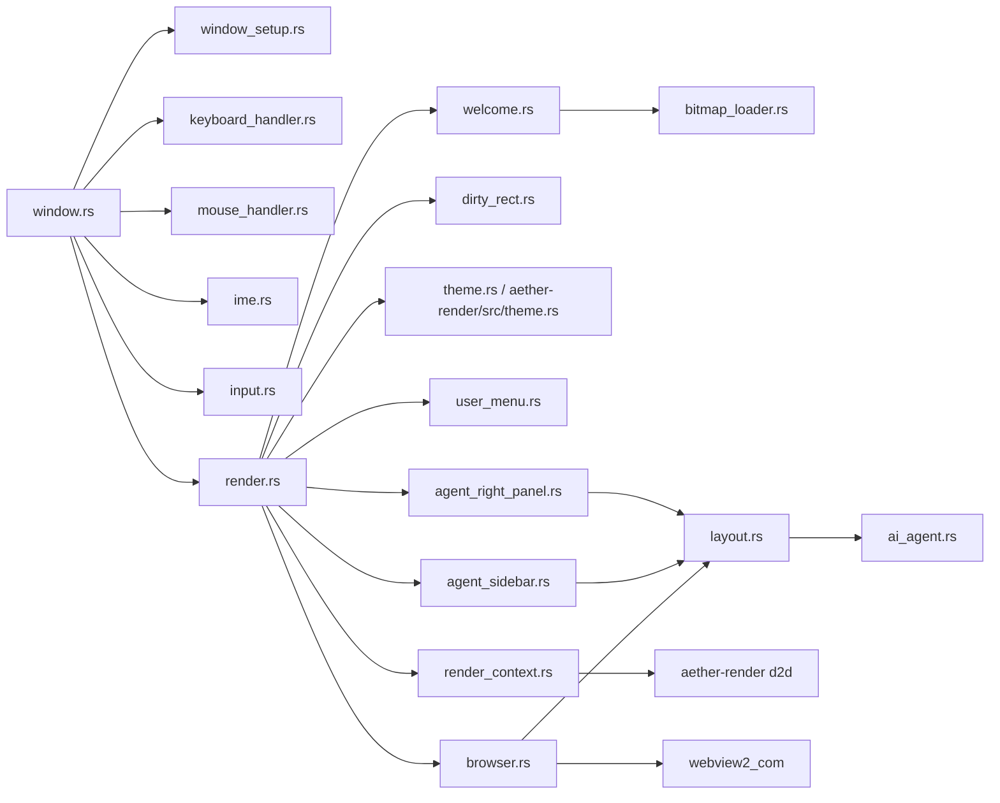

**图表来源** 
- [window.rs:1-373](file://crates/aether-win32/src/window.rs#L1-L373)
- [render.rs:1-800](file://crates/aether-win32/src/render.rs#L1-L800)
- [render_context.rs:1-226](file://crates/aether-win32/src/render_context.rs#L1-L226)
- [dirty_rect.rs:1-707](file://crates/aether-win32/src/dirty_rect.rs#L1-L707)
- [aether-render_lib.rs:1-4](file://crates/aether-render/src/lib.rs#L1-L4)
- [user_menu.rs:1-100](file://crates/aether-win32/src/user_menu.rs#L1-L100)
- [welcome.rs:1-100](file://crates/aether-win32/src/welcome.rs#L1-L100)
- [bitmap_loader.rs:1-100](file://crates/aether-win32/src/bitmap_loader.rs#L1-L100)
- [browser.rs:1-651](file://crates/aether-win32/src/browser.rs#L1-L651)
- [agent_right_panel.rs:1-568](file://crates/aether-win32/src/render/agent_right_panel.rs#L1-L568)
- [agent_sidebar.rs:1-284](file://crates/aether-win32/src/render/agent_sidebar.rs#L1-L284)
- [layout.rs:1-400](file://crates/aether-win32/src/layout.rs#L1-L400)
- [ai_agent.rs:1-800](file://crates/aether-ai-panel/src/ai_agent.rs#L1-L800)

**章节来源**
- [window.rs:1-373](file://crates/aether-win32/src/window.rs#L1-L373)
- [render.rs:1-800](file://crates/aether-win32/src/render.rs#L1-L800)
- [render_context.rs:1-226](file://crates/aether-win32/src/render_context.rs#L1-L226)
- [dirty_rect.rs:1-707](file://crates/aether-win32/src/dirty_rect.rs#L1-L707)
- [aether-render_lib.rs:1-4](file://crates/aether-render/src/lib.rs#L1-L4)
- [user_menu.rs:1-100](file://crates/aether-win32/src/user_menu.rs#L1-L100)
- [welcome.rs:1-100](file://crates/aether-win32/src/welcome.rs#L1-L100)
- [bitmap_loader.rs:1-100](file://crates/aether-win32/src/bitmap_loader.rs#L1-L100)
- [browser.rs:1-651](file://crates/aether-win32/src/browser.rs#L1-L651)
- [agent_right_panel.rs:1-568](file://crates/aether-win32/src/render/agent_right_panel.rs#L1-L568)
- [agent_sidebar.rs:1-284](file://crates/aether-win32/src/render/agent_sidebar.rs#L1-L284)
- [layout.rs:1-400](file://crates/aether-win32/src/layout.rs#L1-L400)
- [ai_agent.rs:1-800](file://crates/aether-ai-panel/src/ai_agent.rs#L1-L800)

## 性能考量
- 脏矩形优化
  - 按区域类型合并重叠矩形，数量超过阈值自动降级为全窗口重绘
  - 无状态变化时跳过渲染（RenderCommand::None），避免空转
- 裁剪策略
  - 多矩形并集裁剪减少无效绘制，失败回退包围盒保证稳定性
- 资源缓存
  - 画刷与文本格式缓存避免每帧创建 COM 对象
  - 设备丢失时快速重建并恢复缓存
- 命中区域记录
  - debug 构建下记录可点击区域，release 构建零开销
- **更新** 用户界面简化带来的性能提升
  - 移除了账户设置页面的复杂渲染逻辑，减少了渲染负载
  - 简化的用户菜单减少了事件处理和状态管理的开销
  - 整体UI架构的简化提高了响应性和内存效率
- **新增** 嵌入式图像资源的优势
  - 消除了文件系统I/O操作，提升了图像加载速度
  - 减少了运行时资源依赖，提高了应用程序的自包含性
  - 避免了CI构建环境中的资源路径解析问题
- **新增** 浏览器和Agent模式性能优化
  - WebView2 环境惰性初始化，避免启动时的性能开销
  - 浏览器实例按需创建，减少内存占用
  - Agent 面板组件采用增量渲染，只更新变化的部分
  - 智能体模式下的布局计算经过优化，减少重绘范围

[本节为通用指导，不直接分析具体文件]

## 故障排查指南
- 窗口未显示或黑屏
  - 检查 DPI 感知是否成功设置，DWM 背景效果是否启用
  - 确认渲染目标已初始化且尺寸有效
- 中文输入异常
  - 验证 IME 候选/合成窗口位置是否正确更新
  - 终端场景下确认是否临时解除了 IME 关联
- 频繁全量重绘
  - 检查脏矩形标记逻辑，确认是否误触发 FullRedraw
  - 观察是否有过多不相交脏矩形导致阈值触发
- 设备丢失导致崩溃
  - 捕获错误码并调用 handle_device_lost，重建渲染目标与缓存
- **更新** 用户菜单相关问题
  - 头像下拉菜单无法显示：检查用户菜单初始化逻辑
  - 菜单点击无响应：验证鼠标事件处理链路
- **更新** 欢迎屏幕图像问题
  - 吉祥物图像无法显示：检查嵌入式PNG资源是否正确编译到二进制文件
  - 图像显示异常：验证bitmap_loader的资源加载逻辑
  - CI构建环境问题：确认构建脚本正确包含了嵌入式资源
- **新增** 浏览器功能问题
  - WebView2 环境初始化失败：检查系统是否安装了 WebView2 Runtime
  - 浏览器标签页无法显示：验证控制器创建和边界同步逻辑
  - 网页加载缓慢：检查网络连接和 WebView2 配置
- **新增** Agent 模式问题
  - 模式切换无效：检查布局管理器的模式切换逻辑
  - Agent 面板渲染异常：验证右侧面板和侧边栏的渲染流程
  - AI 工具标记解析失败：检查 ai_agent.rs 中的解析逻辑

**章节来源**
- [window_setup.rs:18-86](file://crates/aether-win32/src/window/window_setup.rs#L18-L86)
- [render.rs:704-746](file://crates/aether-win32/src/render.rs#L704-L746)
- [render_context.rs:219-225](file://crates/aether-win32/src/render_context.rs#L219-L225)
- [ime.rs:208-243](file://crates/aether-win32/src/ime.rs#L208-L243)
- [dirty_rect.rs:387-426](file://crates/aether-win32/src/dirty_rect.rs#L387-L426)
- [user_menu.rs:1-100](file://crates/aether-win32/src/user_menu.rs#L1-L100)
- [welcome.rs:1-100](file://crates/aether-win32/src/welcome.rs#L1-L100)
- [bitmap_loader.rs:1-100](file://crates/aether-win32/src/bitmap_loader.rs#L1-L100)
- [browser.rs:324-350](file://crates/aether-win32/src/browser.rs#L324-L350)
- [agent_right_panel.rs:1-568](file://crates/aether-win32/src/render/agent_right_panel.rs#L1-L568)
- [agent_sidebar.rs:1-284](file://crates/aether-win32/src/render/agent_sidebar.rs#L1-L284)
- [layout.rs:137-171](file://crates/aether-win32/src/layout.rs#L137-L171)
- [ai_agent.rs:1-800](file://crates/aether-ai-panel/src/ai_agent.rs#L1-L800)

## 结论
牧羊人编辑器的 UI 系统采用清晰的 Win32 窗口管理与 Direct2D/DirectWrite 渲染分层设计，结合脏矩形与多矩形裁剪显著降低重绘成本。输入系统通过模块化键盘/鼠标/IME 处理提升可维护性，主题系统提供灵活的配色与语法着色方案。**最新更新** 通过移除账户设置页面功能、使用嵌入式PNG资源改进欢迎屏幕吉祥物图像处理，以及新增完整的浏览器功能和Agent模式支持，UI架构得到显著优化，进一步提升了系统的性能和跨构建环境的一致性。新增的 WebView2 嵌入式浏览器和 Agent 模式组件为编辑器带来了智能化的工作能力，使其能够更好地支持现代开发工作流程。遵循本文的最佳实践与性能建议，可进一步提升 UI 响应性与稳定性。

[本节为总结，不直接分析具体文件]

## 附录
- 术语
  - DPI：每英寸点数，影响 UI 缩放
  - DWM：桌面窗口管理器，提供 Acrylic/Mica 背景
  - IMM32：输入法管理器，用于 IME 集成
  - D2D/DWrite：Direct2D/DirectWrite，GPU 加速图形与文本渲染
  - PNG：便携式网络图形格式，用于高质量图像存储
  - WebView2：Microsoft Edge 内核的嵌入式浏览器控件
  - Agent 模式：AI 驱动的编程助手模式
  - 智能体模式：与 Agent 模式同义，强调 AI 代理的能力
- 参考路径
  - 窗口创建与设置：[window_setup.rs](file://crates/aether-win32/src/window/window_setup.rs)
  - 渲染主流程：[render.rs](file://crates/aether-win32/src/render.rs)
  - 渲染上下文：[render_context.rs](file://crates/aether-win32/src/render_context.rs)
  - 脏矩形系统：[dirty_rect.rs](file://crates/aether-win32/src/dirty_rect.rs)
  - 输入与 IME：[input.rs](file://crates/aether-win32/src/input.rs)、[ime.rs](file://crates/aether-win32/src/ime.rs)
  - 主题系统：[theme.rs](file://crates/aether-win32/src/theme.rs)、[aether-render/src/theme.rs](file://crates/aether-render/src/theme.rs)
  - **新增** 用户界面组件：[user_menu.rs](file://crates/aether-win32/src/user_menu.rs)、[account.rs](file://crates/aether-win32/src/render/account.rs)
  - **新增** 欢迎屏幕与图像处理：[welcome.rs](file://crates/aether-win32/src/welcome.rs)、[bitmap_loader.rs](file://crates/aether-win32/src/bitmap_loader.rs)
  - **新增** 嵌入式浏览器：[browser.rs](file://crates/aether-win32/src/browser.rs)
  - **新增** Agent 模式组件：[agent_right_panel.rs](file://crates/aether-win32/src/render/agent_right_panel.rs)、[agent_sidebar.rs](file://crates/aether-win32/src/render/agent_sidebar.rs)
  - **新增** 布局管理：[layout.rs](file://crates/aether-win32/src/layout.rs)
  - **新增** AI Agent 协议：[ai_agent.rs](file://crates/aether-ai-panel/src/ai_agent.rs)

[本节为附录，不直接分析具体文件]