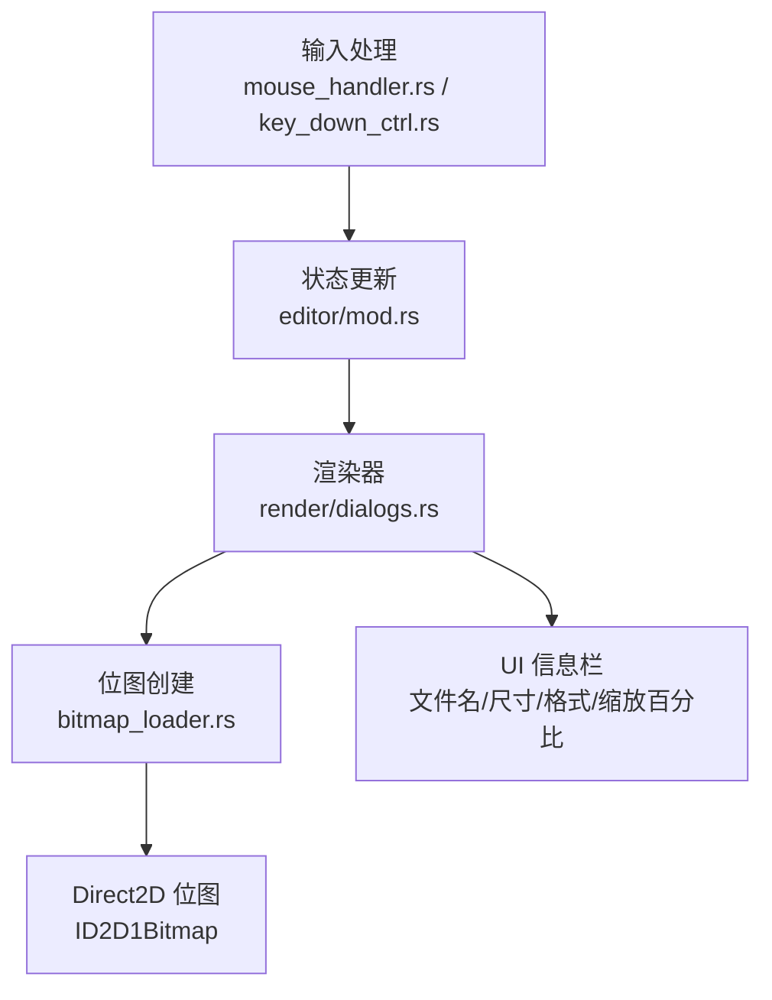
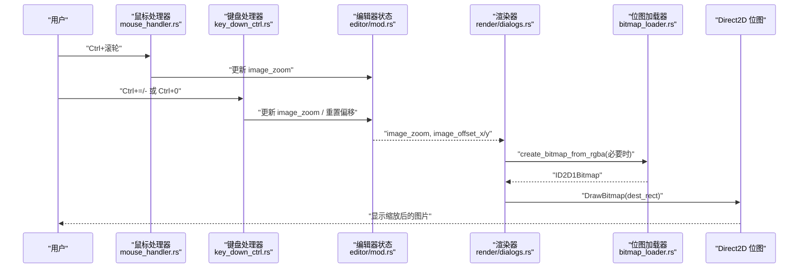
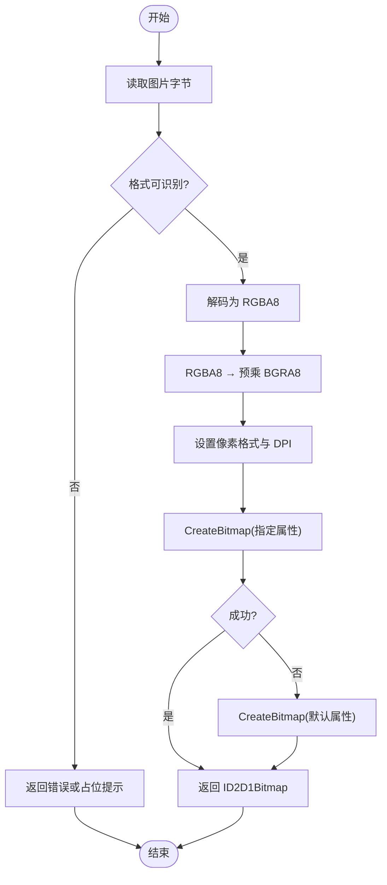
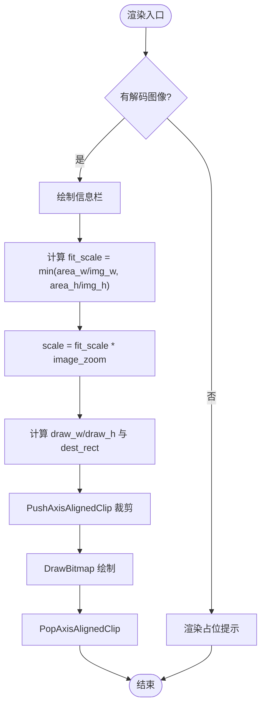
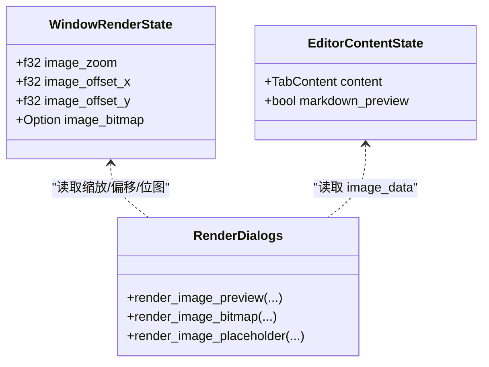
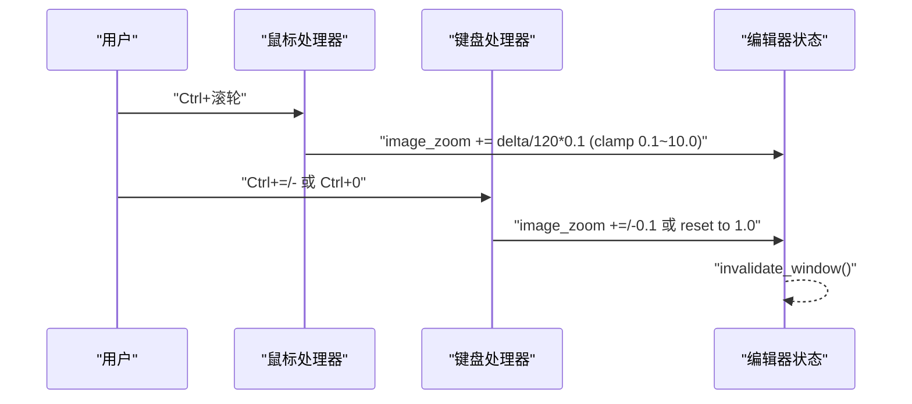
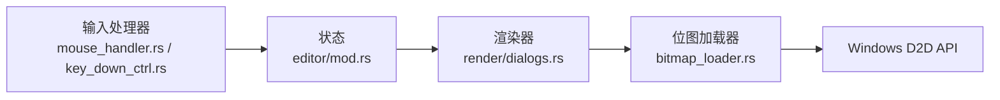

# 图片预览与缩放

<cite>
**本文引用的文件**
- [crates/aether-win32/src/bitmap_loader.rs](file://crates/aether-win32/src/bitmap_loader.rs)
- [crates/aether-ui/src/bitmap_loader.rs](file://crates/aether-ui/src/bitmap_loader.rs)
- [crates/aether-win32/src/render/dialogs.rs](file://crates/aether-win32/src/render/dialogs.rs)
- [crates/aether-win32/src/editor/mod.rs](file://crates/aether-win32/src/editor/mod.rs)
- [crates/aether-win32/src/window/mouse_handler.rs](file://crates/aether-win32/src/window/mouse_handler.rs)
- [crates/aether-win32/src/window/keyboard_handler/key_down_ctrl.rs](file://crates/aether-win32/src/window/keyboard_handler/key_down_ctrl.rs)
- [tests/repro/verify_image_preview.ps1](file://tests/repro/verify_image_preview.ps1)
</cite>

## 目录
1. [简介](#简介)
2. [项目结构](#项目结构)
3. [核心组件](#核心组件)
4. [架构总览](#架构总览)
5. [详细组件分析](#详细组件分析)
6. [依赖关系分析](#依赖关系分析)
7. [性能考虑](#性能考虑)
8. [故障排查指南](#故障排查指南)
9. [结论](#结论)
10. [附录](#附录)

## 简介
本章节聚焦“图片预览与缩放”功能，涵盖图片解码、位图创建、渲染布局、缩放与平移交互、以及测试验证。该功能在编辑器中打开图片时自动识别并显示，支持保持宽高比的自适应缩放、用户自定义缩放（键盘/滚轮）、以及设备相关位图的惰性创建与缓存。

## 项目结构
图片预览与缩放涉及以下关键模块：
- 图片解码与位图创建：跨平台/窗口层共享的解码与 D2D 位图创建能力
- 渲染层：图片预览区域绘制、信息栏展示、占位提示
- 状态管理：缩放比例、偏移量、位图缓存等
- 输入处理：鼠标滚轮缩放、Ctrl+按键缩放、重置缩放
- 测试脚本：自动化启动应用并截图验证图片预览

图表来源
- [crates/aether-win32/src/window/mouse_handler.rs:210-238](file://crates/aether-win32/src/window/mouse_handler.rs#L210-L238)
- [crates/aether-win32/src/window/keyboard_handler/key_down_ctrl.rs:300-349](file://crates/aether-win32/src/window/keyboard_handler/key_down_ctrl.rs#L300-L349)
- [crates/aether-win32/src/editor/mod.rs:470-478](file://crates/aether-win32/src/editor/mod.rs#L470-L478)
- [crates/aether-win32/src/render/dialogs.rs:407-569](file://crates/aether-win32/src/render/dialogs.rs#L407-L569)
- [crates/aether-win32/src/bitmap_loader.rs:18-137](file://crates/aether-win32/src/bitmap_loader.rs#L18-L137)

章节来源
- [crates/aether-win32/src/window/mouse_handler.rs:210-238](file://crates/aether-win32/src/window/mouse_handler.rs#L210-L238)
- [crates/aether-win32/src/window/keyboard_handler/key_down_ctrl.rs:300-349](file://crates/aether-win32/src/window/keyboard_handler/key_down_ctrl.rs#L300-L349)
- [crates/aether-win32/src/editor/mod.rs:470-478](file://crates/aether-win32/src/editor/mod.rs#L470-L478)
- [crates/aether-win32/src/render/dialogs.rs:407-569](file://crates/aether-win32/src/render/dialogs.rs#L407-L569)
- [crates/aether-win32/src/bitmap_loader.rs:18-137](file://crates/aether-win32/src/bitmap_loader.rs#L18-L137)

## 核心组件
- 解码与位图创建
  - 解码图片为 RGBA8，并转换为预乘 alpha 的 BGRA8 以适配 Direct2D CreateBitmap
  - 提供 PNG 字节到 ID2D1Bitmap 的快速路径
- 渲染与布局
  - 顶部信息栏显示文件名、尺寸、格式、当前缩放百分比
  - 图片居中显示并保持宽高比；支持裁剪防止溢出
- 状态与缓存
  - 缩放比例 image_zoom、偏移 image_offset_x/y、设备相关位图缓存 image_bitmap
- 输入处理
  - Ctrl+滚轮缩放、Ctrl+=/- 缩放、Ctrl+0 重置缩放
- 测试验证
  - 自动化启动应用、打开图片、截图保存用于验证

章节来源
- [crates/aether-win32/src/bitmap_loader.rs:18-137](file://crates/aether-win32/src/bitmap_loader.rs#L18-L137)
- [crates/aether-win32/src/render/dialogs.rs:407-569](file://crates/aether-win32/src/render/dialogs.rs#L407-L569)
- [crates/aether-win32/src/editor/mod.rs:470-478](file://crates/aether-win32/src/editor/mod.rs#L470-L478)
- [crates/aether-win32/src/window/mouse_handler.rs:210-238](file://crates/aether-win32/src/window/mouse_handler.rs#L210-L238)
- [crates/aether-win32/src/window/keyboard_handler/key_down_ctrl.rs:300-349](file://crates/aether-win32/src/window/keyboard_handler/key_down_ctrl.rs#L300-L349)
- [tests/repro/verify_image_preview.ps1:1-69](file://tests/repro/verify_image_preview.ps1#L1-L69)

## 架构总览
图片预览与缩放的端到端流程如下：
- 输入事件触发缩放或平移
- 更新全局状态中的缩放比例与偏移
- 渲染器根据状态计算目标矩形并绘制位图
- 位图按需从 RGBA 数据创建并缓存，避免重复解码与转换

图表来源
- [crates/aether-win32/src/window/mouse_handler.rs:210-238](file://crates/aether-win32/src/window/mouse_handler.rs#L210-L238)
- [crates/aether-win32/src/window/keyboard_handler/key_down_ctrl.rs:300-349](file://crates/aether-win32/src/window/keyboard_handler/key_down_ctrl.rs#L300-L349)
- [crates/aether-win32/src/render/dialogs.rs:407-569](file://crates/aether-win32/src/render/dialogs.rs#L407-L569)
- [crates/aether-win32/src/bitmap_loader.rs:82-121](file://crates/aether-win32/src/bitmap_loader.rs#L82-L121)

## 详细组件分析

### 图片解码与位图创建
- 解码流程
  - 读取文件字节，自动探测格式并解码为 RGBA8
  - 将 RGBA8 转换为预乘 alpha 的 BGRA8 以满足 D2D CreateBitmap 要求
  - 设置像素格式与 DPI，创建 ID2D1Bitmap
- 错误处理
  - 若指定属性失败，回退到默认属性再次尝试
  - 记录警告与错误日志便于诊断
- PNG 快速路径
  - 针对 PNG 字节直接解码并创建位图，适用于欢迎页/占位图

图表来源
- [crates/aether-win32/src/bitmap_loader.rs:29-48](file://crates/aether-win32/src/bitmap_loader.rs#L29-L48)
- [crates/aether-win32/src/bitmap_loader.rs:65-121](file://crates/aether-win32/src/bitmap_loader.rs#L65-L121)

章节来源
- [crates/aether-win32/src/bitmap_loader.rs:18-137](file://crates/aether-win32/src/bitmap_loader.rs#L18-L137)
- [crates/aether-ui/src/bitmap_loader.rs:18-137](file://crates/aether-ui/src/bitmap_loader.rs#L18-L137)

### 渲染与布局
- 信息栏
  - 显示文件名、尺寸、格式、当前缩放百分比
- 图片绘制
  - 计算基础适应缩放 fit_scale 以保持宽高比
  - 应用用户缩放 image_zoom 得到最终 scale
  - 计算目标矩形并居中，叠加用户偏移 image_offset_x/y
  - 使用裁剪区域防止溢出
- 占位提示
  - 当不支持或解码失败时显示占位文本

图表来源
- [crates/aether-win32/src/render/dialogs.rs:407-569](file://crates/aether-win32/src/render/dialogs.rs#L407-L569)

章节来源
- [crates/aether-win32/src/render/dialogs.rs:407-569](file://crates/aether-win32/src/render/dialogs.rs#L407-L569)

### 状态与缓存
- 缩放与偏移
  - image_zoom：缩放比例，范围 0.1~10.0
  - image_offset_x/y：平移偏移，用于查看放大后细节
- 位图缓存
  - image_bitmap：设备相关的 ID2D1Bitmap，惰性创建并在设备丢失或切换标签时重建

图表来源
- [crates/aether-win32/src/editor/mod.rs:470-478](file://crates/aether-win32/src/editor/mod.rs#L470-L478)
- [crates/aether-win32/src/render/dialogs.rs:407-569](file://crates/aether-win32/src/render/dialogs.rs#L407-L569)

章节来源
- [crates/aether-win32/src/editor/mod.rs:470-478](file://crates/aether-win32/src/editor/mod.rs#L470-L478)
- [crates/aether-win32/src/render/dialogs.rs:407-569](file://crates/aether-win32/src/render/dialogs.rs#L407-L569)

### 输入处理（缩放与平移）
- 鼠标滚轮缩放
  - 仅在图片语言模式下且光标位于编辑器区域内响应
  - 每 120 单位滚轮对应 10% 缩放变化
- 键盘缩放
  - Ctrl+= 放大、Ctrl+- 缩小、Ctrl+0 重置缩放与偏移
- 平移
  - 通过 image_offset_x/y 实现平移查看（后续可扩展拖拽平移）

图表来源
- [crates/aether-win32/src/window/mouse_handler.rs:210-238](file://crates/aether-win32/src/window/mouse_handler.rs#L210-L238)
- [crates/aether-win32/src/window/keyboard_handler/key_down_ctrl.rs:300-349](file://crates/aether-win32/src/window/keyboard_handler/key_down_ctrl.rs#L300-L349)

章节来源
- [crates/aether-win32/src/window/mouse_handler.rs:210-238](file://crates/aether-win32/src/window/mouse_handler.rs#L210-L238)
- [crates/aether-win32/src/window/keyboard_handler/key_down_ctrl.rs:300-349](file://crates/aether-win32/src/window/keyboard_handler/key_down_ctrl.rs#L300-L349)

### 测试验证
- 自动化脚本
  - 启动应用并打开指定图片
  - 等待窗口出现并置前
  - 截取窗口画面并保存用于验证

章节来源
- [tests/repro/verify_image_preview.ps1:1-69](file://tests/repro/verify_image_preview.ps1#L1-L69)

## 依赖关系分析
- 模块耦合
  - 渲染器依赖状态中的缩放与偏移，以及解码后的图像数据
  - 位图加载器依赖 Direct2D 接口，负责内存到 GPU 资源的转换
  - 输入处理器仅修改状态，不直接操作渲染资源
- 外部依赖
  - image crate 用于多格式解码
  - Windows Direct2D/DirectWrite 用于位图与文本渲染

图表来源
- [crates/aether-win32/src/window/mouse_handler.rs:210-238](file://crates/aether-win32/src/window/mouse_handler.rs#L210-L238)
- [crates/aether-win32/src/window/keyboard_handler/key_down_ctrl.rs:300-349](file://crates/aether-win32/src/window/keyboard_handler/key_down_ctrl.rs#L300-L349)
- [crates/aether-win32/src/editor/mod.rs:470-478](file://crates/aether-win32/src/editor/mod.rs#L470-L478)
- [crates/aether-win32/src/render/dialogs.rs:407-569](file://crates/aether-win32/src/render/dialogs.rs#L407-L569)
- [crates/aether-win32/src/bitmap_loader.rs:82-121](file://crates/aether-win32/src/bitmap_loader.rs#L82-L121)

章节来源
- [crates/aether-win32/src/window/mouse_handler.rs:210-238](file://crates/aether-win32/src/window/mouse_handler.rs#L210-L238)
- [crates/aether-win32/src/window/keyboard_handler/key_down_ctrl.rs:300-349](file://crates/aether-win32/src/window/keyboard_handler/key_down_ctrl.rs#L300-L349)
- [crates/aether-win32/src/editor/mod.rs:470-478](file://crates/aether-win32/src/editor/mod.rs#L470-L478)
- [crates/aether-win32/src/render/dialogs.rs:407-569](file://crates/aether-win32/src/render/dialogs.rs#L407-L569)
- [crates/aether-win32/src/bitmap_loader.rs:82-121](file://crates/aether-win32/src/bitmap_loader.rs#L82-L121)

## 性能考虑
- 惰性创建位图
  - 仅在首次渲染时创建 ID2D1Bitmap，避免无谓开销
- 格式检测与解码
  - 使用 image crate 自动探测格式，减少手动配置
- 缩放范围限制
  - 将缩放限制在 0.1~10.0，防止极端值导致渲染异常或性能问题
- 裁剪优化
  - 使用轴对齐裁剪确保只绘制可见区域，减少多余绘制

[本节为通用指导，无需具体文件引用]

## 故障排查指南
- 位图创建失败
  - 检查图片尺寸是否为 0
  - 确认像素格式与预乘 alpha 设置正确
  - 观察日志中的警告与错误信息
- 不支持的格式
  - 某些格式（如 SVG/RAW/PSD）可能不被 image crate 支持，会进入占位提示
- 缩放无效
  - 确认当前语言模式为图片模式
  - 检查鼠标是否在编辑器区域内
  - 验证缩放范围是否被 clamp 限制

章节来源
- [crates/aether-win32/src/bitmap_loader.rs:82-121](file://crates/aether-win32/src/bitmap_loader.rs#L82-L121)
- [crates/aether-win32/src/render/dialogs.rs:407-569](file://crates/aether-win32/src/render/dialogs.rs#L407-L569)
- [crates/aether-win32/src/window/mouse_handler.rs:210-238](file://crates/aether-win32/src/window/mouse_handler.rs#L210-L238)

## 结论
图片预览与缩放功能通过解耦的解码、渲染与输入处理模块实现了稳定高效的体验。惰性位图创建与缩放范围限制保障了性能与稳定性，而丰富的输入方式（滚轮与快捷键）提升了可用性。未来可考虑扩展平移交互、动画 GIF 播放与更多格式支持。

[本节为总结性内容，无需具体文件引用]

## 附录
- 支持的常见图片格式：PNG、JPEG、GIF（首帧）、BMP、ICO、TIFF、WebP
- 快捷键说明：
  - Ctrl+=：放大图片
  - Ctrl+-：缩小图片
  - Ctrl+0：重置缩放与偏移
  - Ctrl+滚轮：在图片模式下缩放

[本节为补充说明，无需具体文件引用]