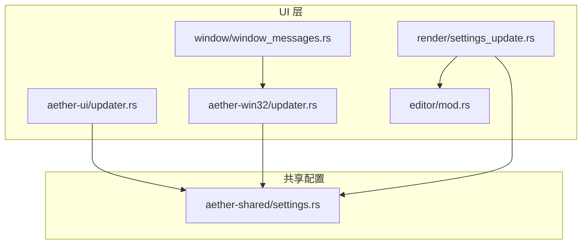
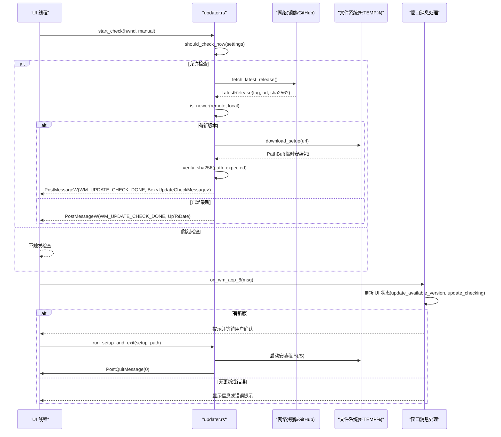
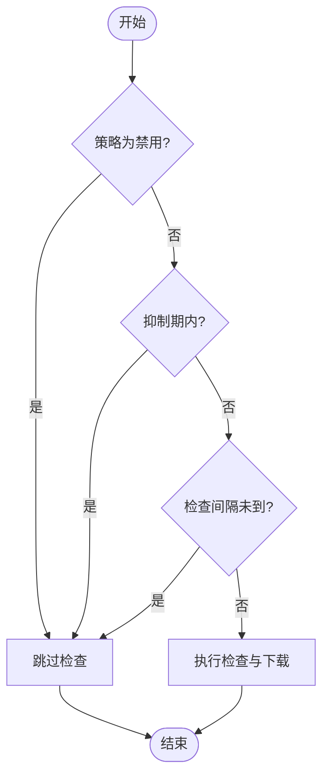
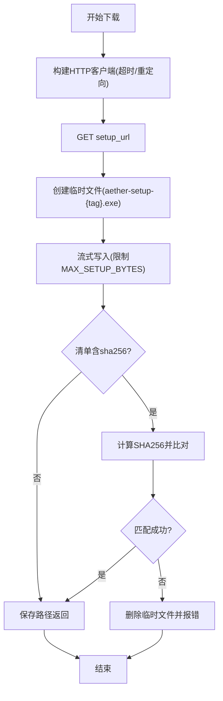
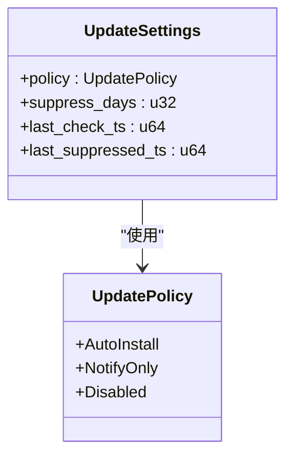
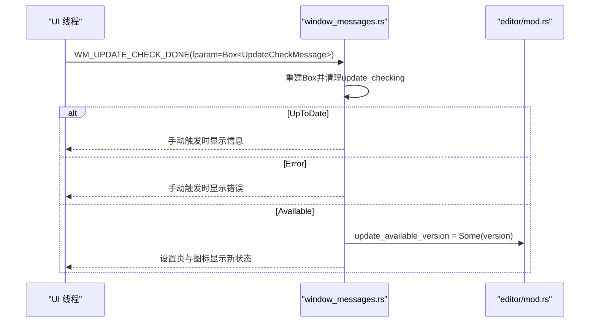
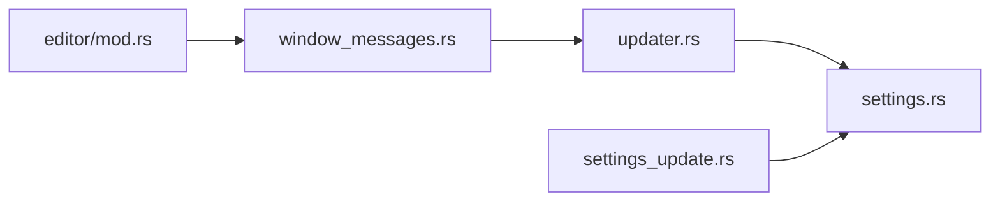

# 自动更新系统

<cite>
**本文引用的文件**
- [crates/aether-ui/src/updater.rs](file://crates/aether-ui/src/updater.rs)
- [crates/aether-win32/src/updater.rs](file://crates/aether-win32/src/updater.rs)
- [crates/aether-shared/src/settings.rs](file://crates/aether-shared/src/settings.rs)
- [crates/aether-win32/src/render/settings_update.rs](file://crates/aether-win32/src/render/settings_update.rs)
- [crates/aether-win32/src/window/window_messages.rs](file://crates/aether-win32/src/window/window_messages.rs)
- [crates/aether-win32/src/editor/mod.rs](file://crates/aether-win32/src/editor/mod.rs)
</cite>

## 目录
1. [简介](#简介)
2. [项目结构](#项目结构)
3. [核心组件](#核心组件)
4. [架构总览](#架构总览)
5. [详细组件分析](#详细组件分析)
6. [依赖关系分析](#依赖关系分析)
7. [性能考量](#性能考量)
8. [故障排查指南](#故障排查指南)
9. [结论](#结论)
10. [附录](#附录)

## 简介
本仓库实现了一个跨模块的“自动更新系统”，用于在应用启动后检查新版本、下载并校验安装包，最终通过静默安装完成升级。其设计要点包括：
- 后台线程执行网络请求与下载，避免阻塞 UI；
- 优先使用国内镜像清单，失败时回退到 GitHub Releases；
- 下载完成后进行 SHA256 校验（若清单提供）；
- 通过自定义窗口消息将结果投递给 UI 线程；
- 支持策略控制（自动安装/仅通知/禁用）、抑制期与检查间隔；
- 设置页展示版本信息与检查按钮，并提供“立即检查更新”入口。

该功能同时存在于 aether-ui 与 aether-win32 两个 crate 中，逻辑基本一致，UI 层负责通用能力，Win32 层负责 Windows 平台的消息处理与渲染集成。

## 项目结构
自动更新相关代码主要分布在以下位置：
- 更新核心逻辑（网络请求、版本比较、下载与校验）：aether-ui 与 aether-win32 各自实现；
- 配置与策略：aether-shared 中的 settings 模块；
- 设置页渲染：aether-win32/render/settings_update.rs；
- 窗口消息处理：aether-win32/window/window_messages.rs；
- UI 状态字段：aether-win32/editor/mod.rs。

图表来源
- [crates/aether-ui/src/updater.rs:1-42](file://crates/aether-ui/src/updater.rs#L1-L42)
- [crates/aether-win32/src/updater.rs:1-42](file://crates/aether-win32/src/updater.rs#L1-L42)
- [crates/aether-shared/src/settings.rs:1073-1113](file://crates/aether-shared/src/settings.rs#L1073-L1113)
- [crates/aether-win32/src/render/settings_update.rs:1-131](file://crates/aether-win32/src/render/settings_update.rs#L1-L131)
- [crates/aether-win32/src/window/window_messages.rs:558-596](file://crates/aether-win32/src/window/window_messages.rs#L558-L596)
- [crates/aether-win32/src/editor/mod.rs:601-603](file://crates/aether-win32/src/editor/mod.rs#L601-L603)

章节来源
- [crates/aether-ui/src/updater.rs:1-42](file://crates/aether-ui/src/updater.rs#L1-L42)
- [crates/aether-win32/src/updater.rs:1-42](file://crates/aether-win32/src/updater.rs#L1-L42)
- [crates/aether-shared/src/settings.rs:1073-1113](file://crates/aether-shared/src/settings.rs#L1073-L1113)

## 核心组件
- 更新检查触发与调度
  - should_check_now：根据策略、抑制期与检查间隔决定是否进行检查；
  - start_check：在后台线程执行检查与下载，完成后通过 PostMessageW 发送 WM_UPDATE_CHECK_DONE；
  - run_setup_and_exit：用户确认后启动静默安装并退出当前进程。
- 版本源与下载
  - fetch_latest_release：优先从镜像服务器获取 latest.json，失败则回退 GitHub Releases；
  - download_setup：下载安装包到 %TEMP%，限制最大字节数，可选 SHA256 校验；
  - is_newer：版本号分段数值比较，判断是否有新版本。
- 设置与策略
  - UpdatePolicy：AutoInstall / NotifyOnly / Disabled；
  - UpdateSettings：包含策略、抑制天数、上次检查时间戳等；
  - 设置页渲染：展示版本信息、策略选择与“立即检查更新”按钮。
- 窗口消息与 UI 状态
  - on_wm_app_8：处理 WM_UPDATE_CHECK_DONE，更新 UI 状态（如 update_available_version、update_checking），并在需要时弹窗提示。

章节来源
- [crates/aether-win32/src/updater.rs:44-146](file://crates/aether-win32/src/updater.rs#L44-L146)
- [crates/aether-win32/src/updater.rs:155-311](file://crates/aether-win32/src/updater.rs#L155-L311)
- [crates/aether-shared/src/settings.rs:1073-1113](file://crates/aether-shared/src/settings.rs#L1073-L1113)
- [crates/aether-win32/src/render/settings_update.rs:1-131](file://crates/aether-win32/src/render/settings_update.rs#L1-L131)
- [crates/aether-win32/src/window/window_messages.rs:558-596](file://crates/aether-win32/src/window/window_messages.rs#L558-L596)

## 架构总览
自动更新流程分为“检查决策 → 网络获取 → 下载与校验 → 结果回调 → 安装与重启”。

图表来源
- [crates/aether-win32/src/updater.rs:98-146](file://crates/aether-win32/src/updater.rs#L98-L146)
- [crates/aether-win32/src/updater.rs:155-311](file://crates/aether-win32/src/updater.rs#L155-L311)
- [crates/aether-win32/src/window/window_messages.rs:558-596](file://crates/aether-win32/src/window/window_messages.rs#L558-L596)

## 详细组件分析

### 更新检查决策与调度
- should_check_now：综合策略、抑制期与检查间隔，决定本次是否进行检查；
- start_check：创建后台线程执行 check_and_download，完成后通过 PostMessageW 将结果投递到 UI 线程；
- run_setup_and_exit：调用安装程序并退出当前进程，由安装器负责覆盖安装与重启。

图表来源
- [crates/aether-win32/src/updater.rs:44-71](file://crates/aether-win32/src/updater.rs#L44-L71)

章节来源
- [crates/aether-win32/src/updater.rs:44-146](file://crates/aether-win32/src/updater.rs#L44-L146)

### 版本源与下载
- fetch_latest_release：优先请求镜像清单 latest.json，失败记录日志并回退 GitHub Releases；
- parse_manifest：解析清单字段 version、downloadUrl/setup_url、sha256（可选）；
- fetch_from_github：查询 releases/latest，提取 tag_name 与 AetherStudio-Setup.exe 的下载链接；
- download_setup：下载安装包到 %TEMP%，限制最大字节数，若清单提供 sha256 则进行校验；
- verify_sha256：计算文件哈希并与期望值比较，失败删除临时文件；
- is_newer：将版本号拆分为数字段逐位比较，缺段按 0 补齐。

图表来源
- [crates/aether-win32/src/updater.rs:250-311](file://crates/aether-win32/src/updater.rs#L250-L311)

章节来源
- [crates/aether-win32/src/updater.rs:155-311](file://crates/aether-win32/src/updater.rs#L155-L311)

### 设置与策略
- UpdatePolicy：三种模式——自动安装、仅通知、禁用；
- UpdateSettings：包含 policy、suppress_days、last_check_ts、last_suppressed_ts；
- 设置页渲染：展示当前版本、上次检查时间、发现新版本提示；展示策略与抑制期选项；提供“立即检查更新”按钮。

图表来源
- [crates/aether-shared/src/settings.rs:1073-1113](file://crates/aether-shared/src/settings.rs#L1073-L1113)

章节来源
- [crates/aether-shared/src/settings.rs:1073-1113](file://crates/aether-shared/src/settings.rs#L1073-L1113)
- [crates/aether-win32/src/render/settings_update.rs:1-131](file://crates/aether-win32/src/render/settings_update.rs#L1-L131)

### 窗口消息与 UI 状态
- on_wm_app_8：接收 WM_UPDATE_CHECK_DONE，重建 Box 确保内存安全，清除 update_checking；
- 根据结果更新 UI：
  - UpToDate：手动触发时提示“已是最新版本”；
  - Error：手动触发时提示错误；
  - Available：设置 update_available_version，并在设置页与齿轮图标上显示新状态。

图表来源
- [crates/aether-win32/src/window/window_messages.rs:558-596](file://crates/aether-win32/src/window/window_messages.rs#L558-L596)
- [crates/aether-win32/src/editor/mod.rs:601-603](file://crates/aether-win32/src/editor/mod.rs#L601-L603)

章节来源
- [crates/aether-win32/src/window/window_messages.rs:558-596](file://crates/aether-win32/src/window/window_messages.rs#L558-L596)
- [crates/aether-win32/src/editor/mod.rs:601-603](file://crates/aether-win32/src/editor/mod.rs#L601-L603)

## 依赖关系分析
- 模块耦合
  - updater.rs 依赖 shared settings 以读取策略与抑制期；
  - window_messages.rs 依赖 updater 的结果类型与常量；
  - settings_update.rs 依赖 shared settings 与 UI 状态字段；
  - editor/mod.rs 持有 update_available_version 与 update_checking 状态。
- 外部依赖
  - 网络：ureq（HTTP 客户端）；
  - JSON：serde_json（清单与响应解析）；
  - 加密校验：sha2（SHA256 计算）。
- 潜在循环依赖
  - 当前实现中各模块职责清晰，未发现循环依赖。

图表来源
- [crates/aether-win32/src/updater.rs:1-42](file://crates/aether-win32/src/updater.rs#L1-L42)
- [crates/aether-shared/src/settings.rs:1073-1113](file://crates/aether-shared/src/settings.rs#L1073-L1113)
- [crates/aether-win32/src/window/window_messages.rs:558-596](file://crates/aether-win32/src/window/window_messages.rs#L558-L596)
- [crates/aether-win32/src/render/settings_update.rs:1-131](file://crates/aether-win32/src/render/settings_update.rs#L1-L131)
- [crates/aether-win32/src/editor/mod.rs:601-603](file://crates/aether-win32/src/editor/mod.rs#L601-L603)

章节来源
- [crates/aether-win32/src/updater.rs:1-42](file://crates/aether-win32/src/updater.rs#L1-L42)
- [crates/aether-shared/src/settings.rs:1073-1113](file://crates/aether-shared/src/settings.rs#L1073-L1113)
- [crates/aether-win32/src/window/window_messages.rs:558-596](file://crates/aether-win32/src/window/window_messages.rs#L558-L596)
- [crates/aether-win32/src/render/settings_update.rs:1-131](file://crates/aether-win32/src/render/settings_update.rs#L1-L131)
- [crates/aether-win32/src/editor/mod.rs:601-603](file://crates/aether-win32/src/editor/mod.rs#L601-L603)

## 性能考量
- 后台线程：所有网络请求与下载均在独立线程执行，避免阻塞 UI；
- 延迟与间隔：启动后延迟检查（UPDATE_CHECK_DELAY_MS），周期检查间隔（UPDATE_CHECK_INTERVAL_SECS）防止频繁网络请求；
- 下载限制：MAX_SETUP_BYTES 限制最大下载大小，防止异常响应占用磁盘；
- 缓存与回退：镜像清单优先，失败快速回退 GitHub，减少不可用源的影响；
- 校验开销：仅在清单提供 sha256 时进行校验，降低不必要计算。

[本节为通用指导，不直接分析具体文件]

## 故障排查指南
- 检查被跳过
  - 策略为 Disabled 或处于抑制期，或距离上次检查不足 4 小时；
  - 参考 should_check_now 的判断逻辑。
- 网络请求失败
  - 镜像服务器不可达或清单解析失败会回退 GitHub；
  - 若两者均失败，on_wm_app_8 会在手动触发时显示错误提示。
- 下载失败或过大
  - 超过 MAX_SETUP_BYTES 会被截断；
  - 创建临时文件或写入失败会返回错误。
- 校验失败
  - SHA256 不匹配会删除临时文件并返回错误；
  - 请检查清单中的 sha256 是否与安装包一致。
- 安装失败
  - run_setup_and_exit 启动安装程序失败会返回错误；
  - 请检查安装程序路径与权限。

章节来源
- [crates/aether-win32/src/updater.rs:44-146](file://crates/aether-win32/src/updater.rs#L44-L146)
- [crates/aether-win32/src/updater.rs:250-311](file://crates/aether-win32/src/updater.rs#L250-L311)
- [crates/aether-win32/src/window/window_messages.rs:558-596](file://crates/aether-win32/src/window/window_messages.rs#L558-L596)

## 结论
该自动更新系统通过清晰的模块划分与稳健的错误处理，实现了跨平台的版本检查、下载与安装流程。其关键优势包括：
- 多线程与消息机制保证 UI 流畅；
- 镜像优先与 GitHub 回退提升可用性；
- 策略与抑制期控制用户体验；
- SHA256 校验保障安装包完整性；
- 设置页提供直观的控制入口。

建议在实际部署中：
- 确保镜像清单格式正确且可访问；
- 合理配置抑制期与检查间隔；
- 监控网络错误与校验失败日志；
- 在 CI 中注入正确的 AETHER_VERSION 以保证版本比较准确。

[本节为总结性内容，不直接分析具体文件]

## 附录
- 版本串格式：支持 vYYYY.MM.DD-N 或纯数字分段，解析时忽略前缀 v，按点与横杠拆分；
- 清单字段：version、downloadUrl 或 setup_url、sha256（可选）；
- 安装参数：静默安装使用 /S；
- 临时文件命名：aether-setup-{tag}.exe，存放于 %TEMP%。

[本节为补充说明，不直接分析具体文件]