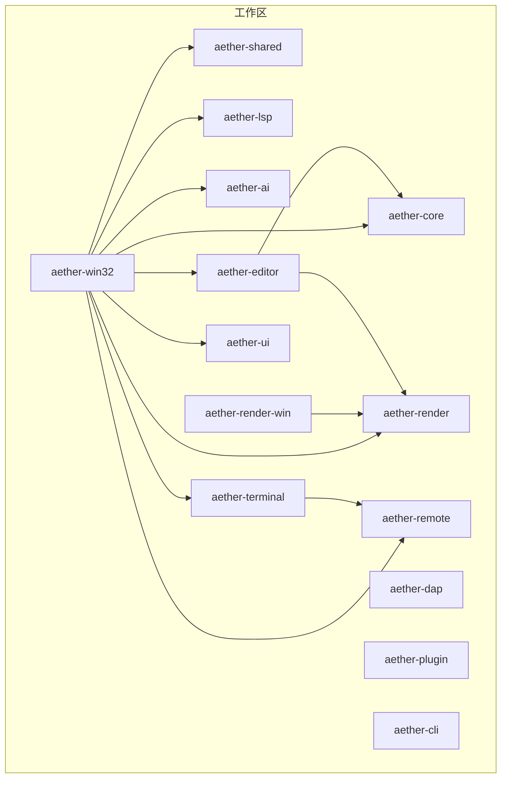
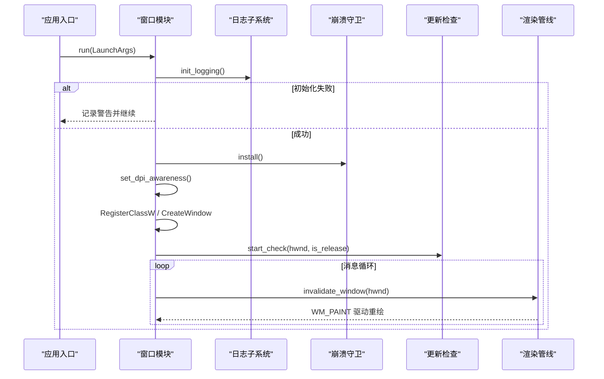
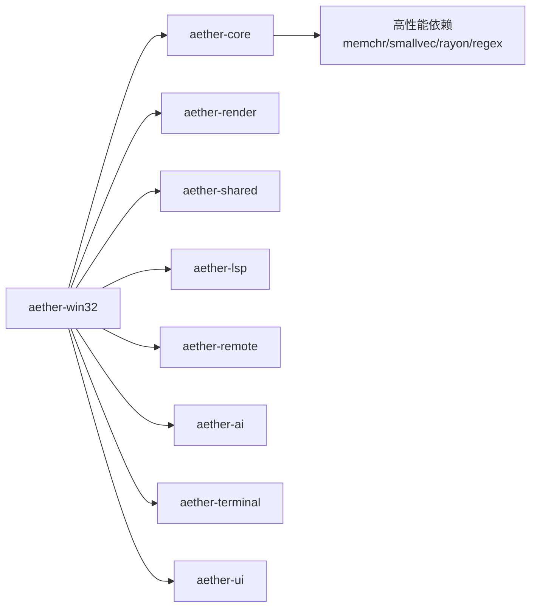

# 代码规范

<cite>
**本文引用的文件**
- [Cargo.toml](file://Cargo.toml)
- [rust-toolchain.toml](file://rust-toolchain.toml)
- [.cargo/config.toml](file://.cargo/config.toml)
- [README.md](file://README.md)
- [CONTRIBUTING.md](file://CONTRIBUTING.md)
- [crates/aether-core/src/lib.rs](file://crates/aether-core/src/lib.rs)
- [crates/aether-win32/src/lib.rs](file://crates/aether-win32/src/lib.rs)
- [crates/aether-shared/src/settings.rs](file://crates/aether-shared/src/settings.rs)
- [crates/aether-win32/src/window.rs](file://crates/aether-win32/src/window.rs)
- [crates/aether-core/Cargo.toml](file://crates/aether-core/Cargo.toml)
- [crates/aether-win32/Cargo.toml](file://crates/aether-win32/Cargo.toml)
</cite>

## 目录
1. [简介](#简介)
2. [项目结构](#项目结构)
3. [核心组件](#核心组件)
4. [架构总览](#架构总览)
5. [详细组件分析](#详细组件分析)
6. [依赖关系分析](#依赖关系分析)
7. [性能考量](#性能考量)
8. [故障排查指南](#故障排查指南)
9. [结论](#结论)
10. [附录](#附录)

## 简介
本规范面向 Aether Studio（牧羊人编辑器）Rust 代码库，目标是建立统一的编码标准与质量门禁，覆盖命名与模块组织、错误处理模式、注释与 API 文档、格式化与静态检查、代码审查清单、性能优化指导、以及常用工具链配置。规范基于仓库现有实现与约定提炼而成，确保新贡献者快速对齐团队风格，同时为长期演进提供稳定基线。

## 项目结构
仓库采用 Cargo Workspace 多 crate 组织，按职责拆分：
- aether-core：文本缓冲、历史栈、词法分析器、工作区数据结构、搜索等核心能力
- aether-render：Direct2D/DirectWrite 渲染抽象、主题系统、画笔缓存
- aether-win32：Windows 原生 UI 层（窗口、消息循环、菜单、布局、事件、应用入口）
- aether-shared：共享配置与持久化设置
- aether-lsp：语言服务器协议客户端
- aether-dap：调试适配器协议客户端基础
- aether-remote：SSH/Git/容器远程操作抽象
- aether-ai：AI 服务接口与请求处理
- aether-plugin：插件注册、权限与运行时
- aether-cli：命令行启动器
- aether-editor、aether-terminal、aether-ui、aether-render-win 等：UI 与平台适配相关

图表来源
- [Cargo.toml:1-19](file://Cargo.toml#L1-L19)
- [crates/aether-win32/Cargo.toml:14-23](file://crates/aether-win32/Cargo.toml#L14-L23)

章节来源
- [Cargo.toml:1-19](file://Cargo.toml#L1-L19)
- [README.md:162-179](file://README.md#L162-L179)

## 核心组件
- 窗口与应用生命周期：aether-win32 负责 Windows 窗口创建、消息循环、定时器、状态管理、崩溃守卫与更新检查；通过线程局部变量维护当前活跃窗口状态，使用原子计数器控制多窗口退出行为。
- 配置与持久化：aether-shared 提供 AppSettings/AiSettings/U iSettings 等配置模型，支持默认值、迁移、加密存储（DPAPI）、原子写入 settings.json，并提供 active_ai_settings 等便捷访问方法。
- 核心编辑能力：aether-core 暴露 buffer、lexer、search、workspace 等模块，供上层 UI 与渲染消费。

章节来源
- [crates/aether-win32/src/window.rs:75-128](file://crates/aether-win32/src/window.rs#L75-L128)
- [crates/aether-win32/src/window.rs:132-200](file://crates/aether-win32/src/window.rs#L132-L200)
- [crates/aether-shared/src/settings.rs:329-560](file://crates/aether-shared/src/settings.rs#L329-L560)
- [crates/aether-core/src/lib.rs:1-12](file://crates/aether-core/src/lib.rs#L1-L12)

## 架构总览
下图展示从应用启动到窗口渲染的关键调用链，体现错误处理与异步刷新策略。

图表来源
- [crates/aether-win32/src/window.rs:132-200](file://crates/aether-win32/src/window.rs#L132-L200)

章节来源
- [crates/aether-win32/src/window.rs:132-200](file://crates/aether-win32/src/window.rs#L132-L200)

## 详细组件分析

### 命名与模块组织规范
- 模块划分遵循“功能域 + 子模块”的层级结构，如 buffer/history、buffer/piece_table、buffer/text_buffer；公共类型在父模块 re-export，便于外部使用。
- 模块内常量集中声明，使用全大写蛇形命名（如 LP_TIMER_ID、TERM_REFRESH_MS），避免魔法数字散落。
- 跨模块依赖通过 workspace 成员与相对路径引用，保持 crate 边界清晰。

章节来源
- [crates/aether-core/src/buffer/mod.rs:1-9](file://crates/aether-core/src/buffer/mod.rs#L1-L9)
- [crates/aether-win32/src/window.rs:32-72](file://crates/aether-win32/src/window.rs#L32-L72)
- [crates/aether-core/src/lib.rs:1-12](file://crates/aether-core/src/lib.rs#L1-L12)

### 错误处理模式
- 配置加载：settings 解析失败时记录警告、备份损坏文件并回退默认值，保证可用性。
- 日志初始化：失败不阻塞启动，仅记录警告并尝试落盘临时文件以便调试。
- 安全敏感字段：API Key 不序列化到 settings.json，改为 DPAPI 加密单独存储；Debug 输出对敏感字段脱敏。
- 原子写入：settings.json 采用临时文件 + fsync + rename 的原子保存策略，防止部分写入导致损坏。

章节来源
- [crates/aether-shared/src/settings.rs:389-453](file://crates/aether-shared/src/settings.rs#L389-L453)
- [crates/aether-shared/src/settings.rs:487-560](file://crates/aether-shared/src/settings.rs#L487-L560)
- [crates/aether-shared/src/settings.rs:562-642](file://crates/aether-shared/src/settings.rs#L562-L642)
- [crates/aether-win32/src/window.rs:132-156](file://crates/aether-win32/src/window.rs#L132-L156)

### 注释与 API 文档规范
- 函数与类型应包含清晰的 doc comment，说明用途、参数约束、返回值语义与副作用。
- 复杂逻辑（如 AI 模型选择、自动保存策略、加密解密流程）需补充设计意图与边界条件说明。
- 对外暴露的公共 API 建议提供示例与错误分支说明，便于生成 rustdoc 文档。

章节来源
- [crates/aether-shared/src/settings.rs:39-71](file://crates/aether-shared/src/settings.rs#L39-L71)
- [crates/aether-shared/src/settings.rs:143-166](file://crates/aether-shared/src/settings.rs#L143-L166)
- [crates/aether-shared/src/settings.rs:329-367](file://crates/aether-shared/src/settings.rs#L329-L367)

### 代码格式化工具与规则
- 统一使用 cargo fmt 进行格式化，提交前执行 --check 确保一致性。
- 工具链固定 stable 版本，并启用 rustfmt 与 clippy 组件。
- 建议在 IDE 中集成 rust-analyzer 与 clippy 提示，提升本地反馈速度。

章节来源
- [rust-toolchain.toml:1-5](file://rust-toolchain.toml#L1-L5)
- [CONTRIBUTING.md:99-110](file://CONTRIBUTING.md#L99-L110)
- [README.md:127-146](file://README.md#L127-L146)

### 代码审查标准与检查清单
- 提交前必须通过：格式化检查、编译检查、单元测试。
- PR 目标分支为 dev，禁止直接合并至 main。
- 提交信息遵循 type(scope): description 格式，并在正文说明改动点与验证结果。
- CI 失败按指引修复，不得跳过测试或绕过检查。

章节来源
- [CONTRIBUTING.md:84-110](file://CONTRIBUTING.md#L84-L110)
- [CONTRIBUTING.md:113-145](file://CONTRIBUTING.md#L113-L145)
- [CONTRIBUTING.md:147-191](file://CONTRIBUTING.md#L147-L191)

### 性能优化指导原则
- 内存使用
  - 大对象与频繁分配场景优先复用缓冲区（如 UTF-16 缓冲、token 扫描）。
  - 使用小向量 smallvec、切片与零拷贝读取减少堆分配。
  - 配置持久化采用原子写入与最小化变更集，避免不必要的全量写盘。
- 并发处理
  - 使用 tokio 多线程运行时处理 I/O 密集型任务（网络、文件扫描）。
  - 窗口状态通过 Rc+RefCell 与 thread_local 管理，避免全局可变状态竞争。
  - 定时器驱动 UI 刷新（终端、AI 后台刷新、动画），降低主线程阻塞。
- 算法选择
  - 词法分析使用 SIMD 加速与增量解析，提升吞吐。
  - 搜索与匹配优先使用高效正则与字节级查找。
  - 渲染脏矩形优化，合并多次无效区域为一次重绘。

章节来源
- [crates/aether-core/Cargo.toml:6-17](file://crates/aether-core/Cargo.toml#L6-L17)
- [crates/aether-win32/src/window.rs:32-72](file://crates/aether-win32/src/window.rs#L32-L72)
- [crates/aether-win32/src/window.rs:84-93](file://crates/aether-win32/src/window.rs#L84-L93)
- [crates/aether-win32/Cargo.toml:24-41](file://crates/aether-win32/Cargo.toml#L24-L41)

### 代码质量工具配置
- Clippy：工作区级别运行，开启 -D warnings 将警告视为错误，强制高质量。
- cargo audit：建议纳入 CI 以检测依赖漏洞（仓库未显式配置，可按需添加）。
- 覆盖率：通过 tests/tools/coverage.ps1 收集，业务逻辑模块目标 80–100%。
- 构建优化：release 配置启用 fat LTO、单 codegen unit、strip 与 panic=abort，减小体积并提升性能。

章节来源
- [README.md:127-146](file://README.md#L127-L146)
- [README.md:148-159](file://README.md#L148-L159)
- [Cargo.toml:29-37](file://Cargo.toml#L29-L37)
- [.cargo/config.toml:19-31](file://.cargo/config.toml#L19-L31)

## 依赖关系分析
- 顶层 workspace 定义所有成员 crate，统一版本与 edition。
- aether-win32 作为 GUI 入口，依赖 core、render、shared、lsp、remote、ai、terminal、ui 等模块，形成“UI 聚合层”。
- aether-core 依赖高性能库（memchr、bytecount、smallvec、rayon、regex、walkdir），支撑文本与搜索能力。
- 构建目标与编译器标志集中在 .cargo/config.toml，确保一致性与可移植性。

图表来源
- [crates/aether-win32/Cargo.toml:14-23](file://crates/aether-win32/Cargo.toml#L14-L23)
- [crates/aether-core/Cargo.toml:6-17](file://crates/aether-core/Cargo.toml#L6-L17)

章节来源
- [Cargo.toml:1-19](file://Cargo.toml#L1-L19)
- [crates/aether-win32/Cargo.toml:14-23](file://crates/aether-win32/Cargo.toml#L14-L23)
- [crates/aether-core/Cargo.toml:6-17](file://crates/aether-core/Cargo.toml#L6-L17)

## 性能考量
- 渲染与输入
  - 使用 InvalidateRect 合并重绘，避免重复渲染；定时器驱动平滑刷新。
  - DPI 感知与 DWM 深色模式提升视觉体验与性能。
- 文本与词法
  - 增量解析与 SIMD 加速，提高大文件处理效率。
  - 小向量与切片减少分配，降低 GC 压力。
- 配置与 IO
  - 原子写入与 fsync 保障数据一致性；按需持久化 last_workspace，避免无意义写盘。
- 构建与发布
  - fat LTO、单 codegen unit、strip、panic=abort 组合优化二进制大小与运行期稳定性。

章节来源
- [crates/aether-win32/src/window.rs:84-93](file://crates/aether-win32/src/window.rs#L84-L93)
- [crates/aether-shared/src/settings.rs:487-560](file://crates/aether-shared/src/settings.rs#L487-L560)
- [Cargo.toml:29-37](file://Cargo.toml#L29-L37)
- [.cargo/config.toml:19-31](file://.cargo/config.toml#L19-L31)

## 故障排查指南
- 格式化失败：执行 cargo fmt --all 后重新提交。
- 编译失败：定位具体错误文件与行号，本地复现并修复。
- 测试失败：使用 --no-fail-fast 查看完整结果，针对性修复用例。
- 配置损坏：settings.json 解析失败会备份为 .json.corrupt 并回退默认值，检查备份文件定位问题。
- 日志初始化失败：不影响启动，会在临时目录生成错误文件，便于离线分析。

章节来源
- [CONTRIBUTING.md:164-191](file://CONTRIBUTING.md#L164-L191)
- [crates/aether-shared/src/settings.rs:442-453](file://crates/aether-shared/src/settings.rs#L442-L453)
- [crates/aether-win32/src/window.rs:132-156](file://crates/aether-win32/src/window.rs#L132-L156)

## 结论
本规范以仓库现有实践为基础，明确了 Rust 代码风格、模块组织、错误处理、注释与文档、格式化与静态检查、审查清单、性能优化与工具链配置。遵循这些约定可显著提升代码可读性、可维护性与交付质量。建议在新功能开发与重构中持续对齐规范，并通过 CI 与本地工具链固化质量门禁。

## 附录

### 最佳实践与常见反模式（示例路径）
- 最佳实践
  - 使用 thread_local 与 Rc<RefCell<T>> 管理窗口状态，避免全局可变状态竞争
    - 参考：[crates/aether-win32/src/window.rs:75-128](file://crates/aether-win32/src/window.rs#L75-L128)
  - 配置持久化采用原子写入与加密密钥分离存储
    - 参考：[crates/aether-shared/src/settings.rs:487-560](file://crates/aether-shared/src/settings.rs#L487-L560)
  - 使用定时器驱动 UI 刷新，合并重绘降低开销
    - 参考：[crates/aether-win32/src/window.rs:84-93](file://crates/aether-win32/src/window.rs#L84-L93)
- 常见反模式
  - 直接在事件处理中调用渲染导致双重渲染
    - 正确做法：标记失效区域，由 WM_PAINT 统一驱动
    - 参考：[crates/aether-win32/src/window.rs:84-93](file://crates/aether-win32/src/window.rs#L84-L93)
  - 将敏感信息明文序列化到配置文件
    - 正确做法：skip_serializing 并使用 DPAPI 加密存储
    - 参考：[crates/aether-shared/src/settings.rs:562-642](file://crates/aether-shared/src/settings.rs#L562-L642)

### 工具链与构建配置要点
- 固定工具链与目标平台，启用 rustfmt 与 clippy
  - 参考：[rust-toolchain.toml:1-5](file://rust-toolchain.toml#L1-L5)
- 统一构建目标与编译器标志，优化 release 性能
  - 参考：[.cargo/config.toml:8-11](file://.cargo/config.toml#L8-L11)
  - 参考：[Cargo.toml:29-37](file://Cargo.toml#L29-L37)