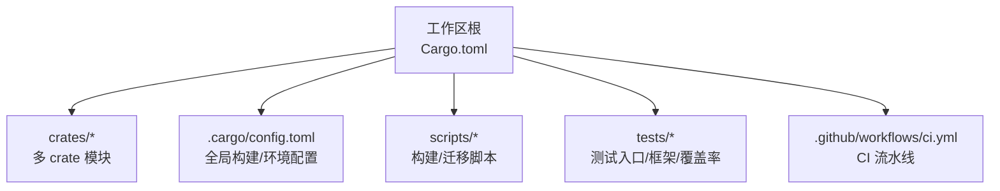
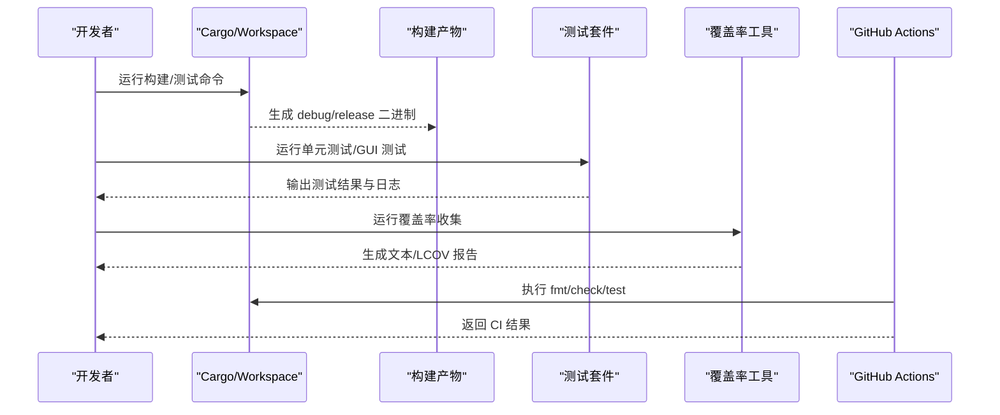
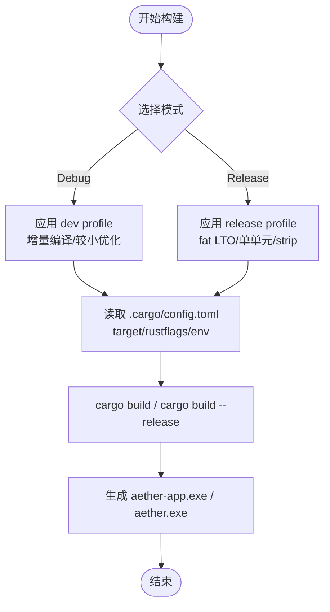
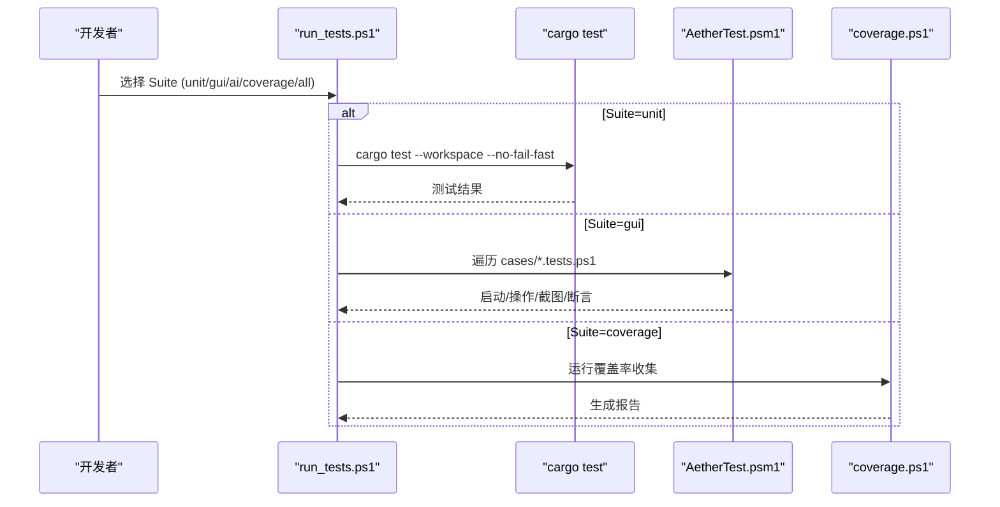
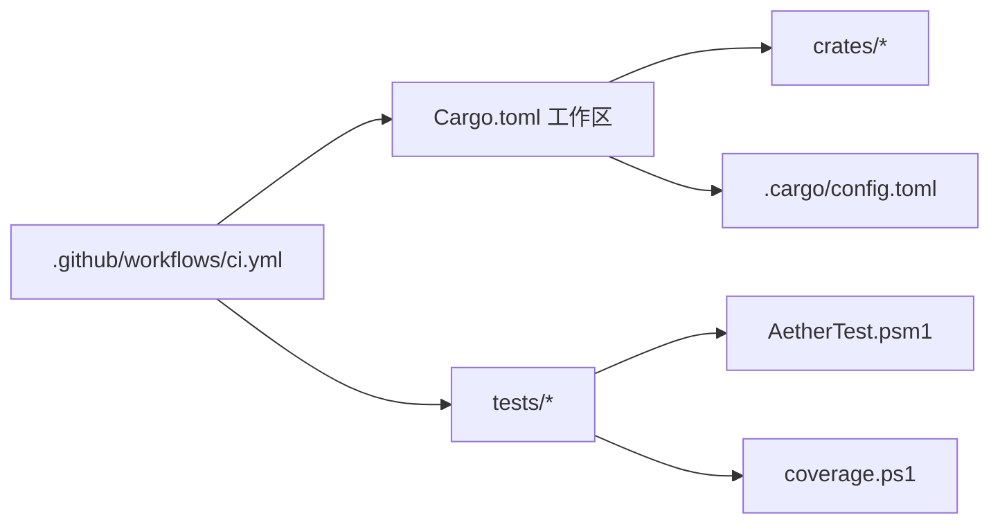

# 开发工具

<cite>
**本文引用的文件**
- [Cargo.toml](file://Cargo.toml)
- [.cargo/config.toml](file://.cargo/config.toml)
- [rust-toolchain.toml](file://rust-toolchain.toml)
- [README.md](file://README.md)
- [CONTRIBUTING.md](file://CONTRIBUTING.md)
- [scripts/build-release.ps1](file://scripts/build-release.ps1)
- [tests/run_tests.ps1](file://tests/run_tests.ps1)
- [tests/tools/coverage.ps1](file://tests/tools/coverage.ps1)
- [tests/framework/AetherTest.psm1](file://tests/framework/AetherTest.psm1)
- [.github/workflows/ci.yml](file://.github/workflows/ci.yml)
</cite>

## 目录
1. [简介](#简介)
2. [项目结构](#项目结构)
3. [核心组件](#核心组件)
4. [架构总览](#架构总览)
5. [详细组件分析](#详细组件分析)
6. [依赖关系分析](#依赖关系分析)
7. [性能与构建优化](#性能与构建优化)
8. [故障排除指南](#故障排除指南)
9. [结论](#结论)
10. [附录：常用命令参考](#附录：常用命令参考)

## 简介
本章节面向开发者，系统介绍 Aether Studio（牧羊人编辑器）的开发工具链、构建系统与测试体系，并给出调试技巧、自动化脚本与效率工具建议。内容涵盖：
- 构建系统与编译选项（调试 vs 发布）
- 测试框架使用方法（单元测试、集成/GUI 测试、覆盖率）
- 调试技巧与工具配置（VS Code 调试、日志输出、性能分析）
- 代码重构与自动化脚本
- 常用命令与故障排除

## 项目结构
仓库采用 Cargo Workspace 组织，包含多个 crate：核心编辑能力、渲染、Win32 UI、LSP/DAP、AI、远程、CLI、共享设置等。根级配置文件统一了工作区成员、版本、目标平台与发布构建策略；.cargo 下提供跨 crate 的构建与环境配置；scripts 提供一键构建与迁移脚本；tests 提供统一的测试入口、GUI 测试框架与覆盖率收集工具；CI 通过 GitHub Actions 执行格式化、检查与测试。

**图表来源**
- [Cargo.toml:1-37](file://Cargo.toml#L1-L37)
- [.cargo/config.toml:1-31](file://.cargo/config.toml#L1-L31)
- [tests/run_tests.ps1:1-91](file://tests/run_tests.ps1#L1-L91)
- [.github/workflows/ci.yml:1-26](file://.github/workflows/ci.yml#L1-L26)

**章节来源**
- [Cargo.toml:1-37](file://Cargo.toml#L1-L37)
- [README.md:85-159](file://README.md#L85-L159)
- [README.md:258-333](file://README.md#L258-L333)

## 核心组件
- 构建系统：基于 Cargo Workspace，目标平台 x86_64-pc-windows-msvc，启用增量编译（调试）、fat LTO 与单 codegen unit（发布）。
- 测试框架：PowerShell 驱动的 GUI 测试框架 + cargo test 单元测试；覆盖率通过 llvm-tools 插桩生成报告。
- 自动化脚本：一键构建脚本、状态迁移脚本、覆盖率一体化脚本。
- CI：GitHub Actions 在 Windows 上执行格式检查、cargo check 与 cargo test。

**章节来源**
- [Cargo.toml:22-37](file://Cargo.toml#L22-L37)
- [.cargo/config.toml:8-31](file://.cargo/config.toml#L8-L31)
- [tests/run_tests.ps1:1-91](file://tests/run_tests.ps1#L1-L91)
- [tests/tools/coverage.ps1:1-64](file://tests/tools/coverage.ps1#L1-L64)
- [.github/workflows/ci.yml:1-26](file://.github/workflows/ci.yml#L1-L26)

## 架构总览
下图展示了从源码到可执行产物、再到测试与覆盖率的完整流程，以及 CI 如何串联这些步骤。

**图表来源**
- [README.md:85-159](file://README.md#L85-L159)
- [tests/run_tests.ps1:1-91](file://tests/run_tests.ps1#L1-L91)
- [tests/tools/coverage.ps1:1-64](file://tests/tools/coverage.ps1#L1-L64)
- [.github/workflows/ci.yml:1-26](file://.github/workflows/ci.yml#L1-L26)

## 详细组件分析

### 构建系统与编译选项
- 工作区与目标：
  - 工作区成员定义于根 Cargo.toml，统一版本、edition、rust-version。
  - 默认目标为 x86_64-pc-windows-msvc，可通过 .cargo/config.toml 指定。
- 调试模式（dev）：
  - 开启增量编译，opt-level=1，便于快速迭代。
  - 保留调试信息，便于断点与回溯。
- 发布模式（release）：
  - fat LTO、codegen-units=1、opt-level=3、panic="abort"、strip=true、incremental=false，追求体积与性能。
- 构建环境变量：
  - C/C++ 依赖统一使用 /MD（动态 CRT），避免链接期运行时冲突。
  - target-cpu=sandybridge 作为通用优化基准。
- 一键构建脚本：
  - scripts/build-release.ps1 支持 --Release 与 --Run 参数，自动定位目标路径并输出二进制位置。

**图表来源**
- [Cargo.toml:22-37](file://Cargo.toml#L22-L37)
- [.cargo/config.toml:8-31](file://.cargo/config.toml#L8-L31)
- [scripts/build-release.ps1:1-42](file://scripts/build-release.ps1#L1-L42)

**章节来源**
- [Cargo.toml:1-37](file://Cargo.toml#L1-L37)
- [.cargo/config.toml:1-31](file://.cargo/config.toml#L1-L31)
- [scripts/build-release.ps1:1-42](file://scripts/build-release.ps1#L1-L42)
- [README.md:85-159](file://README.md#L85-L159)
- [README.md:258-333](file://README.md#L258-L333)

### 测试框架与执行方式
- 统一入口：tests/run_tests.ps1
  - 支持 Suite=unit/gui/ai/coverage/all，可指定 Case 仅运行单个 GUI 用例。
  - 单元测试通过 cargo test --workspace 执行，禁用增量编译以避免 ICE。
  - GUI 测试会启动应用并模拟鼠标键盘，需保持前台独占。
- GUI 测试框架：tests/framework/AetherTest.psm1
  - 封装应用生命周期（构建/启动/停止）、窗口管理、输入注入、截图、临时工作区、日志观测、断言与报告。
  - 坐标约定考虑 DPI 缩放，优先使用消息注入提高稳定性。
- 覆盖率：tests/tools/coverage.ps1
  - 阶段一：设置 RUSTFLAGS="-C instrument-coverage" 与 LLVM_PROFILE_FILE，运行全量单元测试收集 profraw。
  - 阶段二：合并 profraw 并通过 llvm-cov 生成文本与 LCOV 报告，过滤第三方依赖。

**图表来源**
- [tests/run_tests.ps1:1-91](file://tests/run_tests.ps1#L1-L91)
- [tests/framework/AetherTest.psm1:1-200](file://tests/framework/AetherTest.psm1#L1-L200)
- [tests/tools/coverage.ps1:1-64](file://tests/tools/coverage.ps1#L1-L64)

**章节来源**
- [tests/run_tests.ps1:1-91](file://tests/run_tests.ps1#L1-L91)
- [tests/framework/AetherTest.psm1:1-200](file://tests/framework/AetherTest.psm1#L1-L200)
- [tests/tools/coverage.ps1:1-64](file://tests/tools/coverage.ps1#L1-L64)
- [README.md:127-159](file://README.md#L127-L159)
- [README.md:300-333](file://README.md#L300-L333)

### 调试技巧与工具配置
- VS Code 调试配置要点（Windows + MSVC）：
  - 目标平台：x86_64-pc-windows-msvc
  - 程序：target/x86_64-pc-windows-msvc/debug/aether-app.exe
  - 工作目录：仓库根
  - 若需传递工作区或打开文件，可通过命令行参数或 launch JSON 传入（注意 PowerShell 调用时引号处理）
  - 建议在 .cargo/config.toml 中保持增量编译以加速调试循环
- 日志输出：
  - GUI 测试框架会在 %TEMP%\Aether\logs 写入日志，便于复现问题
  - 覆盖率脚本将 cargo 输出重定向至 tests/coverage/cargo_test_coverage.log
- 性能分析：
  - 发布构建已启用 strip 与 LTO，适合性能剖析
  - 可使用 Windows Performance Toolkit 或 Visual Studio Profiler 对 release 产物进行分析
  - 词法分析器基准位于 crates/aether-core/benches 与 examples，可用于回归验证

**章节来源**
- [tests/framework/AetherTest.psm1:24-31](file://tests/framework/AetherTest.psm1#L24-L31)
- [tests/tools/coverage.ps1:21-26](file://tests/tools/coverage.ps1#L21-L26)
- [README.md:85-159](file://README.md#L85-L159)
- [README.md:258-333](file://README.md#L258-L333)

### 代码重构与自动化脚本
- 一键构建：scripts/build-release.ps1
  - 支持 --Release 与 --Run，自动检测目标路径并打印产物位置
- 状态迁移：scripts/migrate_editor_state_v*.ps1
  - 用于编辑器状态结构的演进迁移，按版本顺序执行
- 清理与拆分：remove_unnecessary_drop.ps1、split_impl_editor_state.ps1
  - 辅助清理不必要的 Drop 实现与拆分大型状态实现
- 修复引用：fix_editor_crate_refs.ps1
  - 批量修复编辑器相关 crate 引用

**章节来源**
- [scripts/build-release.ps1:1-42](file://scripts/build-release.ps1#L1-L42)
- [scripts/migrate_editor_state_v1.ps1](file://scripts/migrate_editor_state_v1.ps1)
- [scripts/remove_unnecessary_drop.ps1](file://scripts/remove_unnecessary_drop.ps1)
- [scripts/split_impl_editor_state.ps1](file://scripts/split_impl_editor_state.ps1)
- [scripts/fix_editor_crate_refs.ps1](file://scripts/fix_editor_crate_refs.ps1)

### 开发效率工具推荐
- 插件/扩展（VS Code）：
  - Rust Analyzer：智能补全、跳转、诊断
  - Clippy：静态分析与提示
  - Error Lens：行内错误高亮
  - GitLens：提交历史与变更对比
  - Pester Explorer：运行 PowerShell 测试
- 快捷键与工作流：
  - 使用 cargo fmt 与 cargo clippy 作为提交前检查
  - 使用 run_tests.ps1 快速切换测试套件
  - 使用 build-release.ps1 快速构建并运行
- 终端与脚本：
  - 使用 PowerShell 执行测试与覆盖率脚本
  - 结合任务运行器（如 VS Code Tasks）绑定常用命令

[本节为通用建议，不直接分析具体文件]

## 依赖关系分析
- 工作区依赖：
  - 根 Cargo.toml 声明所有 crate 成员，统一版本与 edition
  - .cargo/config.toml 提供全局构建目标、rustflags 与 env
- 测试依赖：
  - 单元测试依赖 cargo test
  - GUI 测试依赖 AetherTest.psm1 提供的进程/窗口/输入封装
  - 覆盖率依赖 rustup component add llvm-tools 提供的 llvm-profdata/llvm-cov
- CI 依赖：
  - GitHub Actions 在 windows-latest 上安装 Rust stable，执行 fmt/check/test

**图表来源**
- [Cargo.toml:1-37](file://Cargo.toml#L1-L37)
- [.cargo/config.toml:1-31](file://.cargo/config.toml#L1-L31)
- [tests/run_tests.ps1:1-91](file://tests/run_tests.ps1#L1-L91)
- [tests/tools/coverage.ps1:1-64](file://tests/tools/coverage.ps1#L1-L64)
- [.github/workflows/ci.yml:1-26](file://.github/workflows/ci.yml#L1-L26)

**章节来源**
- [Cargo.toml:1-37](file://Cargo.toml#L1-L37)
- [.cargo/config.toml:1-31](file://.cargo/config.toml#L1-L31)
- [tests/run_tests.ps1:1-91](file://tests/run_tests.ps1#L1-L91)
- [tests/tools/coverage.ps1:1-64](file://tests/tools/coverage.ps1#L1-L64)
- [.github/workflows/ci.yml:1-26](file://.github/workflows/ci.yml#L1-L26)

## 性能与构建优化
- 调试模式：
  - 增量编译开启，缩短冷启动时间
  - opt-level=1，平衡速度与调试体验
- 发布模式：
  - fat LTO 与单 codegen unit 提升最终二进制性能
  - strip=true 减小体积
  - panic="abort" 降低异常开销
- 构建环境：
  - target-cpu=sandybridge 保证兼容性
  - C/C++ 统一 /MD 避免运行时冲突
- 基准与回归：
  - 词法分析器基准位于 crates/aether-core/benches 与 examples，可用于回归验证

**章节来源**
- [Cargo.toml:22-37](file://Cargo.toml#L22-L37)
- [.cargo/config.toml:8-31](file://.cargo/config.toml#L8-L31)
- [README.md:85-159](file://README.md#L85-L159)
- [README.md:258-333](file://README.md#L258-L333)

## 故障排除指南
- 构建失败：
  - 确认目标平台与工具链：rust-toolchain.toml 指定 stable 与 targets
  - 检查 .cargo/config.toml 中的 target 与 rustflags
  - 若 C/C++ 链接报错，确认 CFLAGS/CXXFLAGS=/MD
- 测试失败：
  - 单元测试：使用 $env:CARGO_INCREMENTAL='0' 避免增量导致的 ICE
  - GUI 测试：确保前台独占，避免窗口被遮挡；必要时使用 Isolate 隔离窗口
  - 覆盖率：安装 llvm-tools 组件，确保 llvm-profdata/llvm-cov 可用
- CI 失败：
  - 格式检查失败：运行 cargo fmt --all
  - cargo check/test 失败：本地复现并修复后重新推送
- 常见错误与处理：
  - 未找到二进制：先执行构建或使用 build-release.ps1
  - 覆盖率报告为空：确认已运行插桩测试并存在 .profraw 文件

**章节来源**
- [rust-toolchain.toml:1-5](file://rust-toolchain.toml#L1-L5)
- [.cargo/config.toml:8-31](file://.cargo/config.toml#L8-L31)
- [tests/run_tests.ps1:35-46](file://tests/run_tests.ps1#L35-L46)
- [tests/tools/coverage.ps1:21-34](file://tests/tools/coverage.ps1#L21-L34)
- [CONTRIBUTING.md:99-190](file://CONTRIBUTING.md#L99-L190)

## 结论
本项目通过 Cargo Workspace 统一管理多 crate，配合 .cargo 全局配置与发布优化策略，形成高效的构建体系。测试体系覆盖单元测试、GUI 测试与覆盖率，辅以 PowerShell 脚本与 CI 流水线，保障质量与可维护性。开发者可借助 VS Code 插件与脚本工具提升效率，并通过标准化命令与故障排除指南快速定位问题。

## 附录：常用命令参考
- 构建
  - 调试构建：cargo build -p aether-win32 --bin aether-app
  - 发布构建：cargo build -p aether-win32 --bin aether-app --release
  - CLI 构建：cargo build -p aether-cli --bin aether
  - 一键构建：powershell -File scripts/build-release.ps1 [--Release] [--Run]
- 运行
  - 启动 GUI：cargo run -p aether-win32 --bin aether-app
  - 打开文件：cargo run -p aether-cli --bin aether -- path/to/file.rs
  - 定位行列：cargo run -p aether-cli --bin aether -- file.txt:10:5
- 测试
  - 单元测试：$env:CARGO_INCREMENTAL='0'; cargo test --workspace --no-fail-fast
  - GUI 测试：pwsh -File tests/run_tests.ps1 -Suite gui [-Case <name>]
  - AI 自检：pwsh -File tests/run_tests.ps1 -Suite ai
  - 覆盖率：pwsh -File tests/tools/coverage.ps1
- 质量检查
  - 格式化：cargo fmt --all -- --check
  - 静态分析：cargo clippy --workspace --all-targets -- -D warnings
  - 编译检查：cargo check -p aether-win32

**章节来源**
- [README.md:85-159](file://README.md#L85-L159)
- [README.md:258-333](file://README.md#L258-L333)
- [tests/run_tests.ps1:1-91](file://tests/run_tests.ps1#L1-L91)
- [scripts/build-release.ps1:1-42](file://scripts/build-release.ps1#L1-L42)
- [CONTRIBUTING.md:99-190](file://CONTRIBUTING.md#L99-L190)