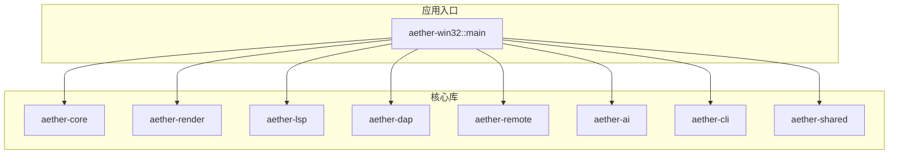
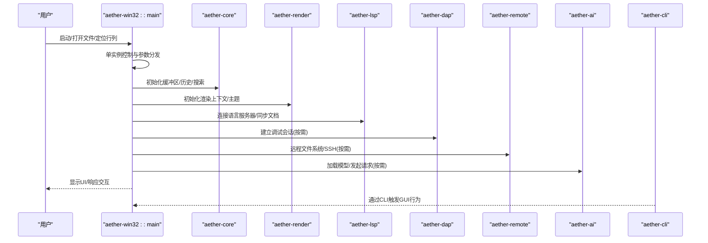
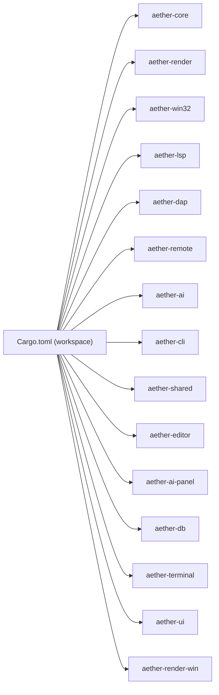

# 开发者指南

<cite>
**本文引用的文件**
- [README.md](file://README.md)
- [CONTRIBUTING.md](file://CONTRIBUTING.md)
- [Cargo.toml](file://Cargo.toml)
- [rust-toolchain.toml](file://rust-toolchain.toml)
- [.cargo/config.toml](file://.cargo/config.toml)
- [main.rs](file://crates/aether-win32/src/main.rs)
- [ci.yml](file://.github/workflows/ci.yml)
- [build-release.ps1](file://scripts/build-release.ps1)
- [AI_TESTING.md](file://tests/ai/AI_TESTING.md)
</cite>

## 目录
1. [简介](#简介)
2. [项目结构](#项目结构)
3. [核心组件](#核心组件)
4. [架构总览](#架构总览)
5. [详细组件分析](#详细组件分析)
6. [依赖分析](#依赖分析)
7. [性能考虑](#性能考虑)
8. [故障排除指南](#故障排除指南)
9. [结论](#结论)
10. [附录：快速上手与资源](#附录快速上手与资源)

## 简介
本指南面向首次参与 Aether Studio（牧羊人编辑器）开发的工程师，目标是帮助你在 Windows 平台上快速搭建开发环境、理解工程结构与工作流、遵循代码规范与贡献流程，并掌握调试、日志、性能分析与质量保障方法。Aether Studio 是基于 Rust + Win32 API 的现代化编辑器，强调高性能文本编辑、自绘渲染、LSP/DAP 集成、AI 能力与远程开发等特性。

## 项目结构
仓库采用 Cargo Workspace 组织，按职责拆分为多个 crate：
- aether-core：文本缓冲、历史栈、词法分析器、工作区数据结构、搜索
- aether-render：Direct2D / DirectWrite 渲染抽象、主题系统、画笔缓存
- aether-win32：Windows 原生 UI 层（窗口、消息循环、菜单、布局、事件、应用入口）
- aether-shared：共享配置与持久化
- aether-lsp：语言服务器协议客户端
- aether-dap：调试适配器协议客户端基础
- aether-remote：SSH/Git/容器远程操作抽象
- aether-ai：AI 服务接口与请求处理
- aether-cli：命令行启动器
- 其他：aether-editor、aether-ai-panel、aether-db、aether-terminal、aether-ui、aether-render-win 等

图表来源
- [main.rs:1-26](file://crates/aether-win32/src/main.rs#L1-L26)
- [Cargo.toml:1-19](file://Cargo.toml#L1-L19)

章节来源
- [README.md:162-179](file://README.md#L162-L179)
- [Cargo.toml:1-19](file://Cargo.toml#L1-L19)

## 核心组件
- 应用入口与单实例控制：主进程负责解析参数、单实例互斥、转发参数到已有窗口或启动新窗口。
- 构建与发布：Workspace 统一版本与工具链；发布配置启用 fat LTO、单代码生成单元、strip 等优化。
- 本地构建配置：目标平台、增量编译、C/C++ 运行时统一为 /MD，避免链接期冲突。
- CI 流水线：格式化检查、编译检查、测试执行。
- 一键构建脚本：封装 debug/release 构建与可选运行。

章节来源
- [main.rs:1-26](file://crates/aether-win32/src/main.rs#L1-L26)
- [Cargo.toml:22-37](file://Cargo.toml#L22-L37)
- [.cargo/config.toml:8-31](file://.cargo/config.toml#L8-L31)
- [ci.yml:1-26](file://.github/workflows/ci.yml#L1-L26)
- [build-release.ps1:1-42](file://scripts/build-release.ps1#L1-L42)

## 架构总览
下图展示了 GUI 应用入口如何协调核心模块，包括文本编辑、渲染、语言服务、调试、AI、远程与 CLI 等。

图表来源
- [main.rs:1-26](file://crates/aether-win32/src/main.rs#L1-L26)
- [Cargo.toml:1-19](file://Cargo.toml#L1-L19)

## 详细组件分析

### 环境与工具链安装
- 操作系统：Windows 10 1809+（推荐 Windows 11）
- Rust 工具链：stable，包含 rustfmt、clippy，目标 x86_64-pc-windows-msvc
- Visual Studio 2022 或 Windows SDK 构建工具
- 构建目标：x86_64-pc-windows-msvc

章节来源
- [README.md:85-93](file://README.md#L85-L93)
- [rust-toolchain.toml:1-5](file://rust-toolchain.toml#L1-L5)
- [.cargo/config.toml:8-17](file://.cargo/config.toml#L8-L17)

### IDE 配置建议
- 使用支持 Rust 的 IDE（如 VS Code + rust-analyzer，或 RustRover），确保启用 rustfmt 与 clippy。
- 在 IDE 中设置工作区根为仓库根目录，以便识别多 crate 结构。
- 将 .cargo/config.toml 中的 target 与 rustflags 作为默认构建配置。
- 开启增量编译以加速调试迭代（dev profile 已启用）。

章节来源
- [.cargo/config.toml:19-22](file://.cargo/config.toml#L19-L22)
- [Cargo.toml:22-37](file://Cargo.toml#L22-L37)

### 项目初始化与构建
- 调试构建：构建 GUI 二进制与 CLI 工具
- 发布构建：启用 fat LTO、单代码生成单元、strip，提升性能与体积优化
- 直接运行 GUI 或通过 CLI 打开文件/定位行列

章节来源
- [README.md:94-125](file://README.md#L94-L125)
- [build-release.ps1:16-41](file://scripts/build-release.ps1#L16-L41)

### 代码规范与编码标准
- 提交前检查清单：格式检查、编译检查、单元测试
- 提交信息规范：type(scope): description，正文说明改动点与验证结果
- 分支规范：从 dev 切出临时分支，PR 合并到 dev，禁止直接在 main/dev 提交
- 外部贡献者 Fork 流程：Fork -> 克隆 -> 添加上游 -> 同步 -> 创建功能分支 -> 推送 -> 创建 PR

章节来源
- [CONTRIBUTING.md:7-81](file://CONTRIBUTING.md#L7-L81)
- [CONTRIBUTING.md:84-110](file://CONTRIBUTING.md#L84-L110)
- [CONTRIBUTING.md:113-145](file://CONTRIBUTING.md#L113-L145)
- [CONTRIBUTING.md:147-160](file://CONTRIBUTING.md#L147-L160)

### 贡献流程与 Pull Request
- 推送临时分支到远程后，在 GitHub 创建 PR，base=dev，compare=temp/<branch-name>
- CI 失败处理：格式化失败用 cargo fmt 修复；check/test 失败需本地复现并修复
- 合并冲突处理：拉取最新 dev，rebase 或 merge 解决冲突后重新检查并强制推送

章节来源
- [CONTRIBUTING.md:147-160](file://CONTRIBUTING.md#L147-L160)
- [CONTRIBUTING.md:164-190](file://CONTRIBUTING.md#L164-L190)
- [CONTRIBUTING.md:193-220](file://CONTRIBUTING.md#L193-L220)

### 开发工作流：调试技巧与日志
- 日志位置：%TEMP%\Aether\logs\aether.YYYY-MM-DD（无扩展名，按天轮转）
- 异步行为验证：等待新增日志事件，避免匹配历史会话
- 观察手段：hit regions、截图、像素断言、UI 状态、编辑器状态摘要
- 报告与诊断：用例失败后生成诊断包（manifest、report、screenshots、app.log、hit_regions、process.txt）

章节来源
- [AI_TESTING.md:134-156](file://tests/ai/AI_TESTING.md#L134-L156)
- [AI_TESTING.md:201-233](file://tests/ai/AI_TESTING.md#L201-L233)

### 开发工作流：性能分析与基准
- 词法分析性能基准：统计吞吐与延迟，输出表格与 Markdown 报告
- 测试数据生成：按行数生成 Rust/JS 代码用于压测
- 回归基线：步骤耗时自动记录，多次运行对比趋势

章节来源
- [crates/aether-render/src/gpu/benchmark.rs:87-157](file://crates/aether-render/src/gpu/benchmark.rs#L87-L157)
- [crates/aether-render/src/gpu/benchmark.rs:159-195](file://crates/aether-render/src/gpu/benchmark.rs#L159-L195)

### 开发工具与脚本
- 一键构建脚本：支持 debug/release 构建，输出路径提示，可选直接运行 GUI
- CI 流水线：格式化检查、cargo check、cargo test
- 覆盖率收集：需要 llvm-tools-preview，使用 tests/tools/coverage.ps1

章节来源
- [build-release.ps1:1-42](file://scripts/build-release.ps1#L1-L42)
- [ci.yml:1-26](file://.github/workflows/ci.yml#L1-L26)
- [README.md:127-146](file://README.md#L127-L146)

### 代码审查与质量保证
- 提交前必须通过：cargo fmt --all -- --check、cargo check -p aether-win32、cargo test --workspace --lib --no-fail-fast
- CI 阶段：format check、cargo check、cargo test
- 建议在本地先跑完整检查清单再推送，减少 CI 失败次数

章节来源
- [CONTRIBUTING.md:99-110](file://CONTRIBUTING.md#L99-L110)
- [ci.yml:18-25](file://.github/workflows/ci.yml#L18-L25)

## 依赖分析
- Workspace 成员：所有 crates 在根 Cargo.toml 中声明，便于统一管理与构建
- 目标平台与工具链：rust-toolchain.toml 指定 stable 与必要组件；.cargo/config.toml 指定目标与构建标志
- 发布优化：fat LTO、单代码生成单元、opt-level 3、panic=abort、strip=true、incremental=false

图表来源
- [Cargo.toml:1-19](file://Cargo.toml#L1-L19)

章节来源
- [Cargo.toml:1-37](file://Cargo.toml#L1-L37)
- [rust-toolchain.toml:1-5](file://rust-toolchain.toml#L1-L5)
- [.cargo/config.toml:8-31](file://.cargo/config.toml#L8-L31)

## 性能考虑
- 发布构建优化：fat LTO、单代码生成单元、opt-level 3、strip、禁用增量编译
- 词法分析基准：吞吐与延迟指标可用于回归检测
- 渲染与输入：自绘渲染引擎与脏矩形优化有助于降低重绘开销
- 内存与启动：GUI 冒烟测试与内存占用可作为健康指标

章节来源
- [Cargo.toml:29-37](file://Cargo.toml#L29-L37)
- [crates/aether-render/src/gpu/benchmark.rs:87-157](file://crates/aether-render/src/gpu/benchmark.rs#L87-L157)
- [README.md:127-159](file://README.md#L127-L159)

## 故障排除指南
- 网络问题：GitHub 连接失败时检查端口连通性，配置代理后重试
- 合并冲突：中止合并、拉取最新 dev、rebase/merge 解决冲突、执行完整检查清单、强制推送
- CI 失败：
  - 格式化失败：运行 cargo fmt 修复并提交
  - cargo check 失败：查看日志定位错误，本地复现修复
  - cargo test 失败：本地执行测试，针对性修复用例
- 构建产物路径：debug/release 下对应二进制路径可参考 README

章节来源
- [CONTRIBUTING.md:193-220](file://CONTRIBUTING.md#L193-L220)
- [CONTRIBUTING.md:164-190](file://CONTRIBUTING.md#L164-L190)
- [README.md:120-125](file://README.md#L120-L125)

## 结论
本指南覆盖了 Aether Studio 的开发环境搭建、工程结构、贡献流程、代码规范、调试与性能分析、工具与脚本使用方法以及质量保证流程。建议新贡献者先从“快速上手”开始，逐步熟悉工作流与规范，再通过小范围改动参与贡献。遇到问题时优先查阅故障排除与 CI 日志，必要时生成诊断包进行定位。

## 附录：快速上手与资源
- 快速开始：阅读 README 的“从源码构建”与“运行”部分，完成环境准备与首次构建
- 内部文档：项目内置详细文档系统（位于 .qoder/repowiki/zh/content/），涵盖架构、API、UI、性能、扩展与语言支持
- 测试框架：AI 测试文档提供日志、hit regions、截图、状态观测与诊断包生成方法
- 贡献流程：遵循 CONTRIBUTING.md 的 Fork、分支、提交信息与 PR 流程

章节来源
- [README.md:85-125](file://README.md#L85-L125)
- [README.md:180-194](file://README.md#L180-L194)
- [AI_TESTING.md:134-156](file://tests/ai/AI_TESTING.md#L134-L156)
- [CONTRIBUTING.md:7-81](file://CONTRIBUTING.md#L7-L81)