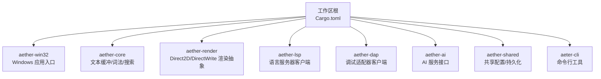
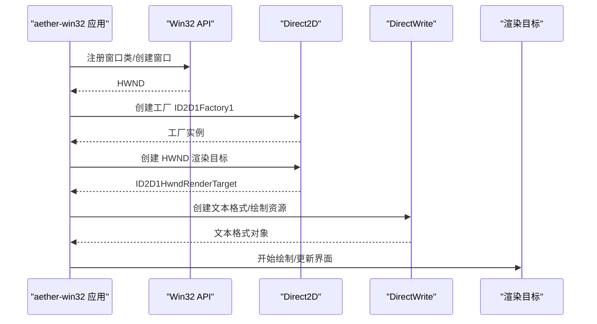
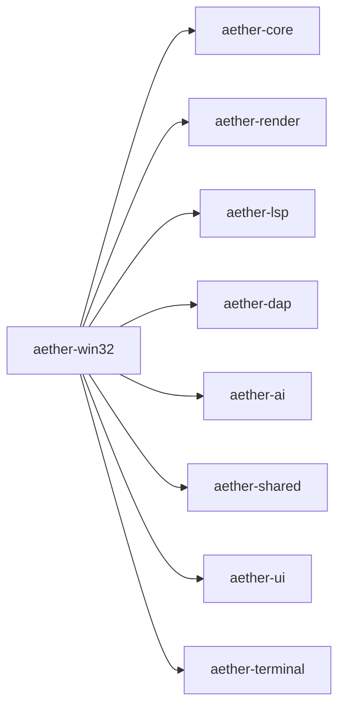

# 环境搭建

<cite>
**本文引用的文件**
- [Cargo.toml](file://Cargo.toml)
- [rust-toolchain.toml](file://rust-toolchain.toml)
- [.cargo/config.toml](file://.cargo/config.toml)
- [README.md](file://README.md)
- [crates/aether-win32/Cargo.toml](file://crates/aether-win32/Cargo.toml)
- [scripts/build-release.ps1](file://scripts/build-release.ps1)
- [tests/tools/coverage.ps1](file://tests/tools/coverage.ps1)
- [crates/aether-render/src/d2d/factory.rs](file://crates/aether-render/src/d2d/factory.rs)
- [crates/aether-render/src/gpu/compute_context.rs](file://crates/aether-render/src/gpu/compute_context.rs)
</cite>

## 目录
1. [简介](#简介)
2. [项目结构](#项目结构)
3. [核心组件](#核心组件)
4. [架构总览](#架构总览)
5. [详细组件分析](#详细组件分析)
6. [依赖关系分析](#依赖关系分析)
7. [性能注意事项](#性能注意事项)
8. [故障排除指南](#故障排除指南)
9. [结论](#结论)
10. [附录](#附录)

## 简介
本指南面向首次参与 Aether Studio（牧羊人编辑器）开发的工程师，目标是帮助你在 Windows 平台上快速、稳定地搭建开发环境。内容涵盖：
- Rust 工具链安装与配置（rustup、cargo、必要组件）
- Windows SDK、DirectX/Direct2D/DirectWrite 等系统要求说明
- IDE 配置建议（VS Code、Visual Studio、CLion）
- Cargo workspace 与 crate 依赖管理
- 常见环境问题排查（路径、权限、代理）
- 安装验证步骤与一键脚本使用说明

## 项目结构
本项目采用 Cargo Workspace 组织，包含多个 crate，其中 aether-win32 是 Windows 原生 GUI 应用入口，aether-core、aether-render、aether-lsp、aether-dap、aether-ai 等为功能模块。构建目标为 x86_64-pc-windows-msvc，使用 MSVC 工具链进行编译。

图表来源
- [Cargo.toml:1-19](file://Cargo.toml#L1-L19)
- [crates/aether-win32/Cargo.toml:1-44](file://crates/aether-win32/Cargo.toml#L1-L44)

章节来源
- [Cargo.toml:1-37](file://Cargo.toml#L1-L37)
- [README.md:85-125](file://README.md#L85-L125)

## 核心组件
- 工作区与工作单元
  - 工作区成员在根 Cargo.toml 中声明，统一版本、Edition 与最低 Rust 版本约束。
  - 发布构建启用 fat LTO、单代码生成单元、strip 等优化策略。
- 目标平台与工具链
  - rust-toolchain.toml 指定 stable 通道，并包含 rustfmt、clippy 组件，目标为 x86_64-pc-windows-msvc。
- 构建配置
  - .cargo/config.toml 设置默认 target、rustflags、C/C++ 链接标志（统一 /MD），以及 dev/release profile。
- 关键 crate
  - aether-win32：Windows 原生 UI 层与应用入口，依赖 Direct2D/DirectWrite、Webview2 等。
  - aether-render：Direct2D/DirectWrite 渲染抽象与 GPU 计算上下文封装。
  - aether-lsp/aether-dap：语言服务与调试协议客户端基础实现。
  - aether-ai：AI 服务接口与请求处理。
  - aether-cli：命令行启动器。

章节来源
- [Cargo.toml:22-37](file://Cargo.toml#L22-L37)
- [rust-toolchain.toml:1-5](file://rust-toolchain.toml#L1-L5)
- [.cargo/config.toml:8-31](file://.cargo/config.toml#L8-L31)
- [crates/aether-win32/Cargo.toml:14-44](file://crates/aether-win32/Cargo.toml#L14-L44)

## 架构总览
下图展示了从应用入口到渲染子系统的关键调用链，体现 Windows 原生窗口创建与 Direct2D/DirectWrite 初始化流程。

图表来源
- [crates/aether-render/src/d2d/factory.rs:14-63](file://crates/aether-render/src/d2d/factory.rs#L14-L63)
- [crates/aether-render/src/gpu/compute_context.rs:58-83](file://crates/aether-render/src/gpu/compute_context.rs#L58-L83)

## 详细组件分析

### Rust 工具链与环境准备
- 安装 rustup 与 cargo
  - 通过官方安装器安装 rustup，确保 PATH 中包含 ~/.cargo/bin。
  - 使用 rustup 安装 stable 工具链及目标 x86_64-pc-windows-msvc。
- 安装必要组件
  - rustfmt、clippy：用于格式化与静态检查。
  - llvm-tools-preview：覆盖率收集需要 llvm-profdata、llvm-cov。
- 目标平台与编译器
  - 目标为 x86_64-pc-windows-msvc，需安装 Visual Studio 2022 或 Windows SDK Build Tools（MSVC）。
- 环境变量与镜像源
  - 项目级 .cargo/config.toml 仅设置构建目标与 rustflags； crates.io 镜像源由用户级 ~/.cargo/config.toml 配置，避免冲突。
  - HTTP 超时与低速率限制已在项目级配置。

章节来源
- [rust-toolchain.toml:1-5](file://rust-toolchain.toml#L1-L5)
- [.cargo/config.toml:1-11](file://.cargo/config.toml#L1-L11)
- [tests/tools/coverage.ps1:28-34](file://tests/tools/coverage.ps1#L28-L34)

### Windows SDK 与 DirectX/Direct2D/DirectWrite 要求
- 操作系统
  - 支持 Windows 10 1809+ 与 Windows 11。
- 构建工具链
  - Visual Studio 2022（推荐）或 Windows SDK Build Tools，提供 MSVC 编译器与链接器。
- DirectX/Direct2D/DirectWrite
  - 项目通过 windows crate 的 Win32_Graphics_* 特性调用 Direct2D/DirectWrite 与 D3D11 相关 API。
  - 运行时依赖系统内置的 Direct2D/DirectWrite 与 D3D11 驱动栈；无需额外安装 DirectX SDK，但需确保系统图形驱动与 Windows 更新到位。
- Webview2
  - 运行 GUI 时可能需要 Microsoft Edge WebView2 运行时；若缺失，应用会提示安装或回退行为（具体以运行时错误为准）。

章节来源
- [README.md:85-93](file://README.md#L85-L93)
- [crates/aether-win32/Cargo.toml:41-44](file://crates/aether-win32/Cargo.toml#L41-L44)
- [crates/aether-render/src/d2d/factory.rs:14-63](file://crates/aether-render/src/d2d/factory.rs#L14-L63)
- [crates/aether-render/src/gpu/compute_context.rs:58-83](file://crates/aether-render/src/gpu/compute_context.rs#L58-L83)

### IDE 配置建议
- Visual Studio 2022
  - 安装“使用 C++ 的桌面开发”工作负载，勾选“MSVC v143 生成工具”和“Windows 10/11 SDK”。
  - 打开仓库根目录，VS 会自动识别 Cargo workspace 并生成解决方案。
  - 将 aether-win32 设为启动项目，便于直接调试 GUI。
- VS Code
  - 安装 Rust Analyzer 扩展，配置 rust-analyzer.rustc.source 指向 rustup 工具链。
  - 在 settings.json 中设置 cargo.buildScript.enable = true，确保 build script 执行。
  - 使用任务或终端执行 cargo build/test/clippy/fmt。
- CLion
  - 安装 Rust 插件，导入 Cargo workspace。
  - 配置外部工具链指向 rustup 安装的 stable 工具链。
  - 为 aether-win32 添加运行配置，选择 aether-app 二进制。

章节来源
- [README.md:85-93](file://README.md#L85-L93)
- [crates/aether-win32/Cargo.toml:6-12](file://crates/aether-win32/Cargo.toml#L6-L12)

### Cargo workspace 与 crate 依赖管理
- 工作区成员
  - 根 Cargo.toml 声明所有 crate 成员，统一版本与 Edition，并设置 resolver = "2"。
- 依赖解析
  - aether-win32 依赖 aether-core、aether-render、aether-lsp、aether-dap、aether-ai、aether-shared、aeter-cli、aether-terminal、aether-ui 等内部 crate。
  - 外部依赖包括 tokio、lsp-types、windows、webview2-com、ort、tokenizers 等。
- 构建与发布
  - 工作区级别 release profile 启用 fat LTO、单 codegen unit、opt-level=3、panic=abort、strip=true。
  - 可通过 cargo build -p <crate> --bin <name> 构建特定二进制。

章节来源
- [Cargo.toml:1-37](file://Cargo.toml#L1-L37)
- [crates/aether-win32/Cargo.toml:14-44](file://crates/aether-win32/Cargo.toml#L14-L44)

### 一键脚本使用说明
- 构建脚本
  - scripts/build-release.ps1 提供一键构建能力，支持 Release/Debug 模式与可选自动运行。
  - 脚本会在执行前追加 ~/.cargo/bin 到 PATH，然后调用 cargo build 或 cargo build --release。
  - 构建完成后输出 GUI 与 CLI 二进制路径，并在传入 -Run 时启动 GUI。
- 覆盖率脚本
  - tests/tools/coverage.ps1 整合插桩测试与报告生成，依赖 llvm-tools-preview。
  - 首次运行会清理并创建 tests/coverage 目录，设置 RUSTFLAGS 与 LLVM_PROFILE_FILE，执行全工作区测试，合并 profraw 并生成文本与 LCOV 报告。

章节来源
- [scripts/build-release.ps1:1-42](file://scripts/build-release.ps1#L1-L42)
- [tests/tools/coverage.ps1:1-64](file://tests/tools/coverage.ps1#L1-L64)

## 依赖关系分析
下图展示 aether-win32 与其主要内部依赖的关系，体现 GUI 层对核心模块的聚合。

图表来源
- [crates/aether-win32/Cargo.toml:14-24](file://crates/aether-win32/Cargo.toml#L14-L24)

章节来源
- [crates/aether-win32/Cargo.toml:14-44](file://crates/aether-win32/Cargo.toml#L14-L44)

## 性能注意事项
- 构建优化
  - 发布构建启用 fat LTO、单 codegen unit、opt-level=3、strip=true，可显著减小体积并提升性能。
- 增量编译
  - 开发构建开启 incremental=true，加速迭代；测试时可按 README 禁用增量以避免 ICE。
- 渲染与 GPU
  - Direct2D 硬件渲染目标与 D3D11 设备上下文初始化需系统驱动支持；如遇设备丢失或初始化失败，检查显卡驱动与 Windows 更新。
- 网络与下载
  - ort、tokenizers 等依赖可能下载二进制或模型；请确保网络可达或配置代理。

章节来源
- [Cargo.toml:29-37](file://Cargo.toml#L29-L37)
- [.cargo/config.toml:19-31](file://.cargo/config.toml#L19-L31)
- [crates/aether-render/src/d2d/factory.rs:33-63](file://crates/aether-render/src/d2d/factory.rs#L33-L63)
- [crates/aether-render/src/gpu/compute_context.rs:58-83](file://crates/aether-render/src/gpu/compute_context.rs#L58-L83)

## 故障排除指南
- 找不到 rustup/cargo
  - 确认已安装 rustup 并将 ~/.cargo/bin 加入 PATH；重新打开终端使 PATH 生效。
- 目标平台不匹配
  - 确保已安装 x86_64-pc-windows-msvc 目标；如缺失，使用 rustup target add。
- MSVC 工具链缺失
  - 安装 Visual Studio 2022 或 Windows SDK Build Tools；确保 cl.exe、link.exe 可用。
- 构建失败：RuntimeLibrary 不匹配
  - 项目已将 C/C++ 标志统一为 /MD；若仍报错，检查第三方库是否强制 /MT，必要时调整其构建选项。
- 代理与网络问题
  - 配置用户级 ~/.cargo/config.toml 中的 crates.io 镜像源与 HTTP 代理；项目级已设置超时与低速率限制。
- 权限问题
  - 以管理员身份运行 PowerShell 或 CMD，或在受保护目录外克隆仓库。
- 覆盖率报告缺失
  - 安装 llvm-tools-preview；确保 tests/tools/coverage.ps1 能定位 llvm-profdata 与 llvm-cov。
- GUI 无法启动或渲染异常
  - 检查 Direct2D/DirectWrite/D3D11 是否可用；更新显卡驱动与 Windows 更新；必要时安装 WebView2 运行时。

章节来源
- [README.md:85-125](file://README.md#L85-L125)
- [.cargo/config.toml:1-17](file://.cargo/config.toml#L1-L17)
- [tests/tools/coverage.ps1:28-34](file://tests/tools/coverage.ps1#L28-L34)
- [crates/aether-render/src/d2d/factory.rs:14-63](file://crates/aether-render/src/d2d/factory.rs#L14-L63)
- [crates/aether-render/src/gpu/compute_context.rs:58-83](file://crates/aether-render/src/gpu/compute_context.rs#L58-L83)

## 结论
通过以上步骤，你可以在 Windows 上完成 Aether Studio 的开发环境搭建，包括 Rust 工具链、Windows SDK、DirectX/Direct2D/DirectWrite 依赖、IDE 配置与 Cargo workspace 使用。借助一键脚本与覆盖率工具，可以高效地进行构建、测试与质量保障。遇到问题时，参考故障排除指南逐步定位与解决。

## 附录

### 安装与验证清单
- 安装 rustup 与 stable 工具链，目标 x86_64-pc-windows-msvc
- 安装 rustfmt、clippy、llvm-tools-preview
- 安装 Visual Studio 2022 或 Windows SDK Build Tools
- 配置用户级 crates.io 镜像与代理（如需）
- 克隆仓库并进入目录
- 执行一键构建脚本：pwsh -File scripts\build-release.ps1
- 运行 GUI：target\x86_64-pc-windows-msvc\debug\aether-app.exe 或 release 目录对应二进制
- 运行测试：cargo test --workspace --no-fail-fast（必要时设置 $env:CARGO_INCREMENTAL='0'）
- 运行静态检查：cargo clippy --workspace --all-targets -- -D warnings
- 运行覆盖率：pwsh -File tests\tools\coverage.ps1

章节来源
- [README.md:85-146](file://README.md#L85-L146)
- [scripts/build-release.ps1:1-42](file://scripts/build-release.ps1#L1-L42)
- [tests/tools/coverage.ps1:1-64](file://tests/tools/coverage.ps1#L1-L64)