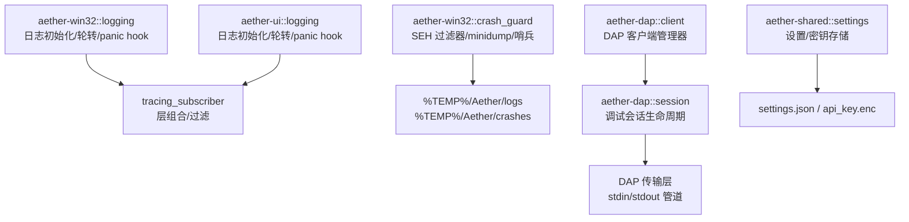
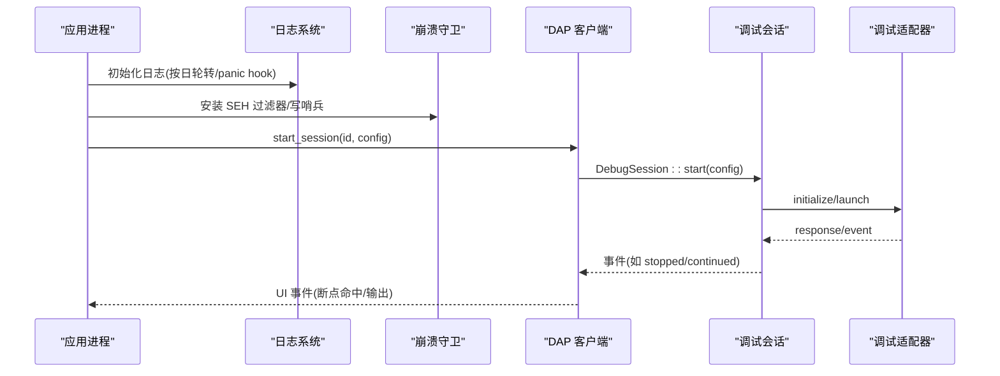
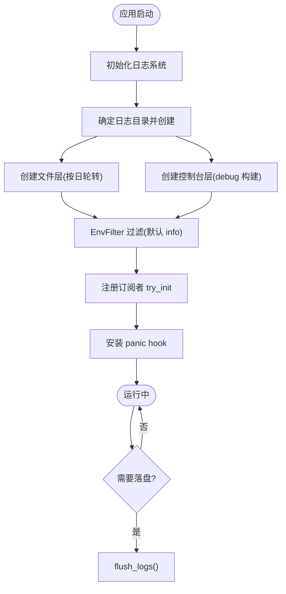
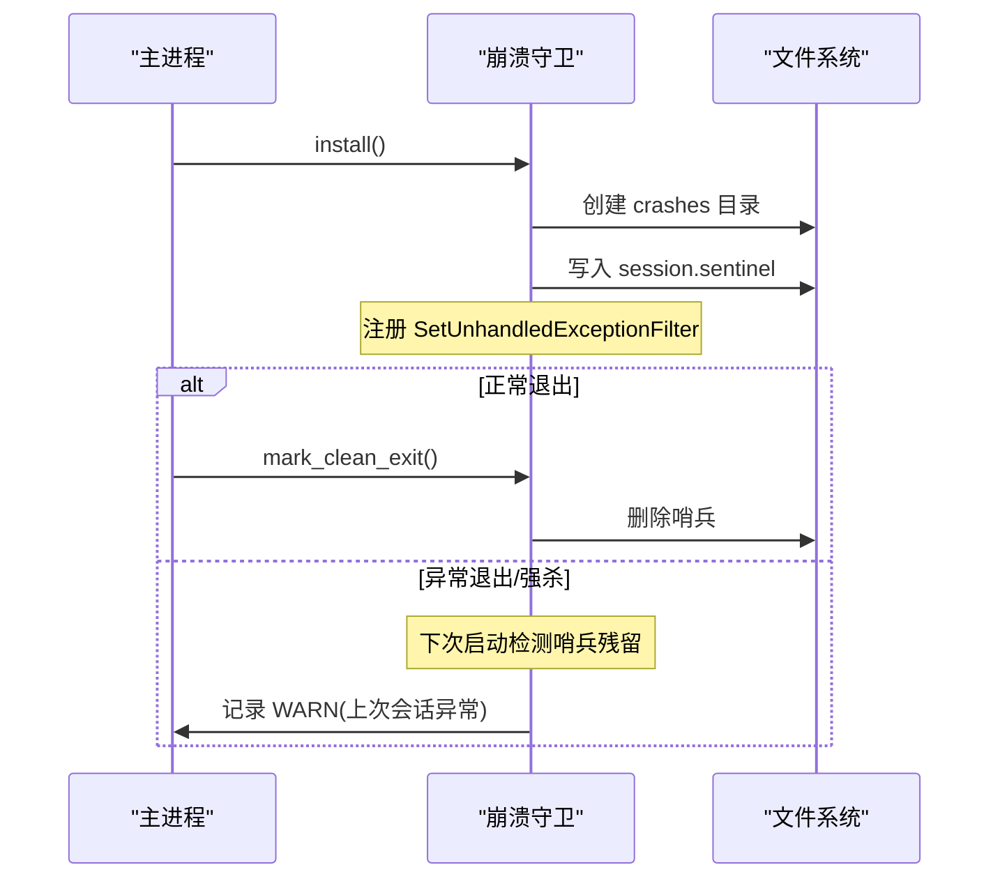
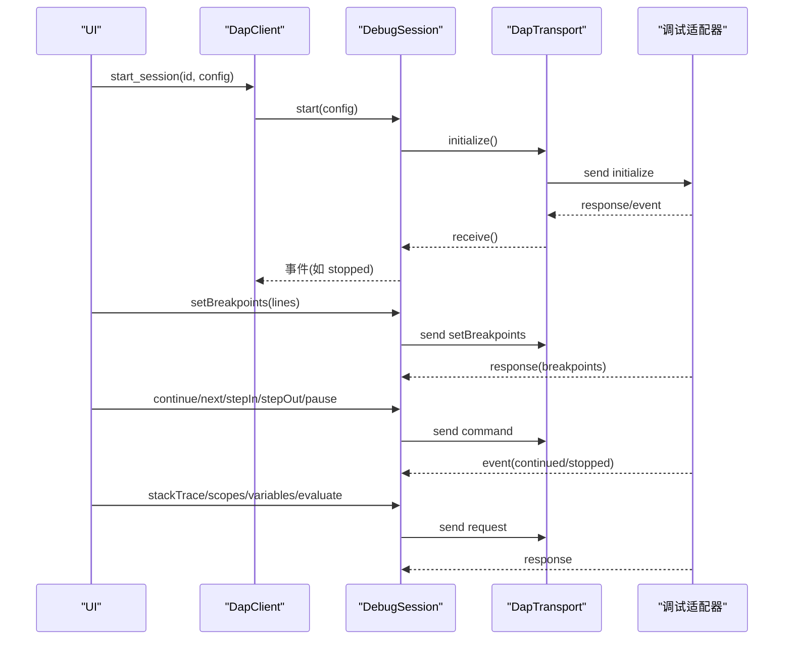
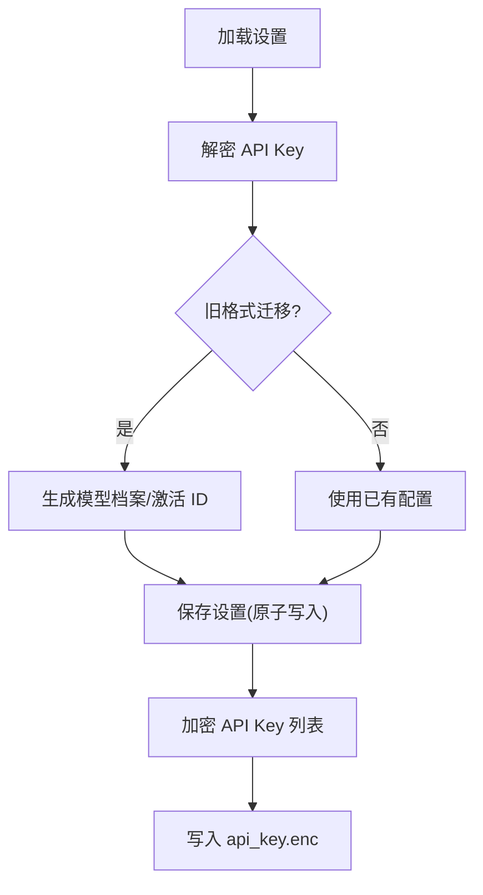
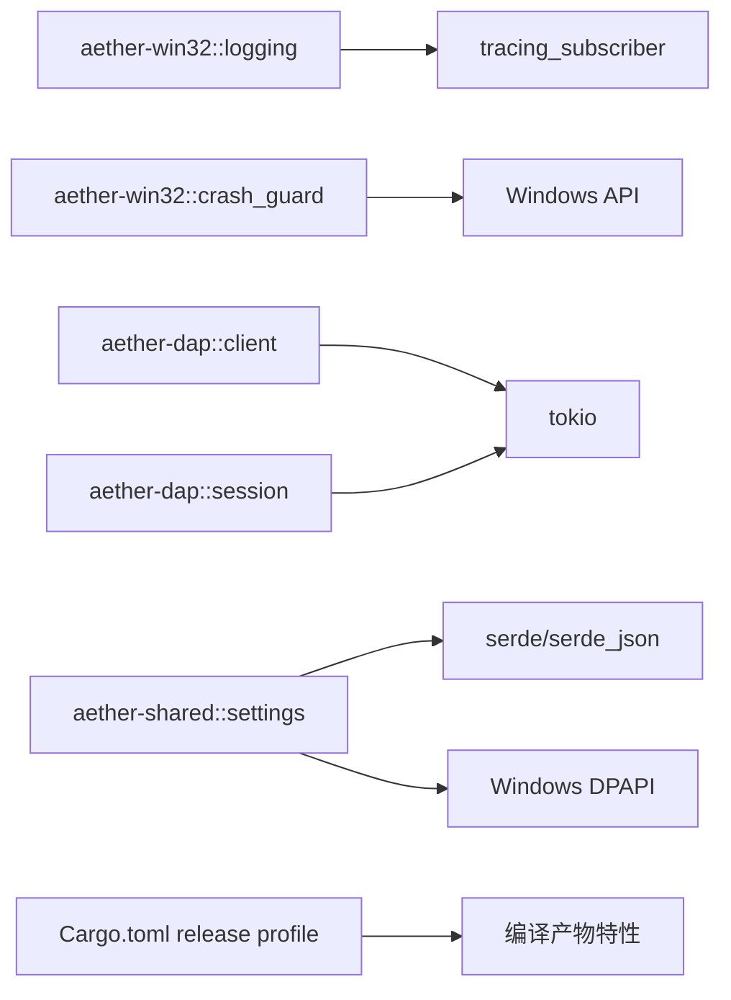

# 调试指南

<cite>
**本文引用的文件**
- [crates/aether-win32/src/logging.rs](file://crates/aether-win32/src/logging.rs)
- [crates/aether-ui/src/logging.rs](file://crates/aether-ui/src/logging.rs)
- [crates/aether-win32/src/crash_guard.rs](file://crates/aether-win32/src/crash_guard.rs)
- [crates/aether-dap/src/lib.rs](file://crates/aether-dap/src/lib.rs)
- [crates/aether-dap/src/client.rs](file://crates/aether-dap/src/client.rs)
- [crates/aether-dap/src/session.rs](file://crates/aether-dap/src/session.rs)
- [crates/aether-shared/src/settings.rs](file://crates/aether-shared/src/settings.rs)
- [Cargo.toml](file://Cargo.toml)
- [tests/repro/BUG_REPORT_empty_folder_lsp.md](file://tests/repro/BUG_REPORT_empty_folder_lsp.md)
- [crates/aether-core/src/benchmarks.rs](file://crates/aether-core/src/benchmarks.rs)
- [crates/aether-render/src/gpu/benchmark.rs](file://crates/aether-render/src/gpu/benchmark.rs)
- [tests/tools/coverage.ps1](file://tests/tools/coverage.ps1)
</cite>

## 目录
1. [简介](#简介)
2. [项目结构](#项目结构)
3. [核心组件](#核心组件)
4. [架构总览](#架构总览)
5. [详细组件分析](#详细组件分析)
6. [依赖关系分析](#依赖关系分析)
7. [性能考虑](#性能考虑)
8. [故障排除指南](#故障排除指南)
9. [结论](#结论)
10. [附录](#附录)

## 简介
本指南面向牧羊人编辑器的开发与维护者，提供从“如何配置与使用调试器”到“日志系统、崩溃可观测性、性能分析与远程调试”的完整实践手册。文档基于仓库内现有实现进行说明，包含断点设置、变量检查、调用栈分析、日志级别管理、常见问题诊断（内存泄漏、死锁、性能瓶颈）、远程与容器化调试方法、典型 Bug 复现与修复案例，以及调试最佳实践和问题报告模板。

## 项目结构
本项目采用多 crate 工作区组织，调试相关能力分布在以下位置：
- 日志系统：Windows UI 与通用 UI 均实现了基于 tracing 的日志初始化、按日轮转、panic hook 与 flush。
- 崩溃守卫：Windows 平台通过 SEH 未处理异常过滤器捕获原生崩溃，写入 minidump 与文本标记，并通过会话哨兵检测异常退出。
- DAP 调试客户端：实现 Debug Adapter Protocol 客户端，支持启动/连接调试适配器、发送 initialize/launch/setBreakpoints/stackTrace/scopes/variables/evaluate 等请求，并处理 stopped/continued/exited/terminated/output/breakpoint 事件。
- 配置与设置：应用设置持久化、API Key 加密存储、自动保存策略等。
- 性能基准：核心模块与渲染模块提供基准测试工具，便于定位热点与回归。
- 覆盖率与插桩：PowerShell 脚本驱动 llvm-tools 生成覆盖率报告。

图表来源
- [crates/aether-win32/src/logging.rs:31-85](file://crates/aether-win32/src/logging.rs#L31-L85)
- [crates/aether-ui/src/logging.rs:31-85](file://crates/aether-ui/src/logging.rs#L31-L85)
- [crates/aether-win32/src/crash_guard.rs:36-55](file://crates/aether-win32/src/crash_guard.rs#L36-L55)
- [crates/aether-dap/src/client.rs:14-43](file://crates/aether-dap/src/client.rs#L14-L43)
- [crates/aether-dap/src/session.rs:36-74](file://crates/aether-dap/src/session.rs#L36-L74)
- [crates/aether-shared/src/settings.rs:385-559](file://crates/aether-shared/src/settings.rs#L385-L559)

章节来源
- [Cargo.toml:1-37](file://Cargo.toml#L1-L37)

## 核心组件
- 日志系统：按天轮转的文件日志 + 控制台输出；支持 RUST_LOG 覆盖默认级别；panic hook 记录 panic 信息并在崩溃前 flush。
- 崩溃守卫：安装 SEH 未处理异常过滤器，写 minidump 与文本标记；会话哨兵在下次启动时报告上次会话异常终止。
- DAP 客户端：管理多个调试会话；为不同语言提供默认适配器配置；封装 setBreakpoints、stackTrace、scopes、variables、evaluate 等常用操作。
- 设置与密钥：settings.json 原子写入；API Key 通过 DPAPI 加密单独存储；自动保存策略防抖与周期兜底。
- 性能基准：核心与渲染模块提供基准测试框架，用于对比方案与量化吞吐/延迟。
- 覆盖率：通过 llvm-profdata/llvm-cov 合并 profraw 并生成报告。

章节来源
- [crates/aether-win32/src/logging.rs:31-85](file://crates/aether-win32/src/logging.rs#L31-L85)
- [crates/aether-win32/src/crash_guard.rs:36-55](file://crates/aether-win32/src/crash_guard.rs#L36-L55)
- [crates/aether-dap/src/client.rs:45-71](file://crates/aether-dap/src/client.rs#L45-L71)
- [crates/aether-dap/src/session.rs:196-330](file://crates/aether-dap/src/session.rs#L196-L330)
- [crates/aether-shared/src/settings.rs:385-559](file://crates/aether-shared/src/settings.rs#L385-L559)
- [crates/aether-core/src/benchmarks.rs:55-87](file://crates/aether-core/src/benchmarks.rs#L55-L87)
- [tests/tools/coverage.ps1:30-55](file://tests/tools/coverage.ps1#L30-L55)

## 架构总览
下图展示调试子系统的关键交互：UI 与 Win32 侧日志初始化后，崩溃守卫注册；DAP 客户端创建会话并与外部调试适配器通信；设置模块负责配置与密钥安全存储。

图表来源
- [crates/aether-win32/src/logging.rs:31-85](file://crates/aether-win32/src/logging.rs#L31-L85)
- [crates/aether-win32/src/crash_guard.rs:36-55](file://crates/aether-win32/src/crash_guard.rs#L36-L55)
- [crates/aether-dap/src/client.rs:24-43](file://crates/aether-dap/src/client.rs#L24-L43)
- [crates/aether-dap/src/session.rs:36-74](file://crates/aether-dap/src/session.rs#L36-L74)

## 详细组件分析

### 日志系统与级别管理
- 日志目录：优先使用临时目录下的 Aether/logs，避免 GUI 子系统下无 %APPDATA% 的问题。
- 轮转策略：按日轮转，文件名前缀 aether，便于归档与清理。
- 输出层：文件层含时间戳、级别、目标模块、行号与文件；控制台层在 debug 构建启用 ANSI 彩色输出。
- 级别过滤：默认 info，可通过环境变量 RUST_LOG 覆盖。
- Panic Hook：记录 panic payload 与位置，强制 flush 后再调用默认 hook。
- Flush：提供手动 flush 接口，用于关键操作后确保日志落地。

图表来源
- [crates/aether-win32/src/logging.rs:31-85](file://crates/aether-win32/src/logging.rs#L31-L85)
- [crates/aether-ui/src/logging.rs:31-85](file://crates/aether-ui/src/logging.rs#L31-L85)

章节来源
- [crates/aether-win32/src/logging.rs:11-85](file://crates/aether-win32/src/logging.rs#L11-L85)
- [crates/aether-ui/src/logging.rs:11-85](file://crates/aether-ui/src/logging.rs#L11-L85)

### 崩溃守卫与会话哨兵
- 安装时机：应在日志系统初始化后、窗口创建前调用。
- 功能：
  - 写入本次会话哨兵（pid、启动时间），正常退出删除。
  - 下次启动检测残留哨兵，记录“上次会话未正常退出”，并附带最近一次原生崩溃标记详情。
  - 注册 SEH 未处理异常过滤器，捕获 FFI/原生崩溃，写文本标记与 minidump。
- 产物路径：%TEMP%/Aether/crashes。

图表来源
- [crates/aether-win32/src/crash_guard.rs:36-55](file://crates/aether-win32/src/crash_guard.rs#L36-L55)
- [crates/aether-win32/src/crash_guard.rs:64-84](file://crates/aether-win32/src/crash_guard.rs#L64-L84)
- [crates/aether-win32/src/crash_guard.rs:115-136](file://crates/aether-win32/src/crash_guard.rs#L115-L136)

章节来源
- [crates/aether-win32/src/crash_guard.rs:36-55](file://crates/aether-win32/src/crash_guard.rs#L36-L55)
- [crates/aether-win32/src/crash_guard.rs:64-84](file://crates/aether-win32/src/crash_guard.rs#L64-L84)
- [crates/aether-win32/src/crash_guard.rs:115-136](file://crates/aether-win32/src/crash_guard.rs#L115-L136)

### DAP 调试客户端与会话
- 客户端管理器：维护多个会话，事件通过通道发送到 UI。
- 默认适配器：rust/c/cpp -> lldb-dap；python -> debugpy.adapter；javascript/typescript -> node-debug2-adapter。
- 会话生命周期：
  - start：spawn 适配器进程，建立 stdin/stdout 传输，发送 initialize，等待响应或事件。
  - launch：启动被调试程序，带参数与工作目录。
  - 控制流：setBreakpoints、continue、next、stepIn、stepOut、pause。
  - 状态查询：stackTrace、scopes、variables、evaluate。
  - 断开：disconnect（终止被调试）或 detach（保留被调试）。
  - 子进程回收：超时未退出则 kill，防止僵尸进程。

图表来源
- [crates/aether-dap/src/client.rs:14-43](file://crates/aether-dap/src/client.rs#L14-L43)
- [crates/aether-dap/src/client.rs:45-71](file://crates/aether-dap/src/client.rs#L45-L71)
- [crates/aether-dap/src/session.rs:36-74](file://crates/aether-dap/src/session.rs#L36-L74)
- [crates/aether-dap/src/session.rs:131-194](file://crates/aether-dap/src/session.rs#L131-L194)
- [crates/aether-dap/src/session.rs:196-330](file://crates/aether-dap/src/session.rs#L196-L330)
- [crates/aether-dap/src/session.rs:483-535](file://crates/aether-dap/src/session.rs#L483-L535)

章节来源
- [crates/aether-dap/src/lib.rs:1-8](file://crates/aether-dap/src/lib.rs#L1-L8)
- [crates/aether-dap/src/client.rs:14-71](file://crates/aether-dap/src/client.rs#L14-L71)
- [crates/aether-dap/src/session.rs:36-74](file://crates/aether-dap/src/session.rs#L36-L74)
- [crates/aether-dap/src/session.rs:131-194](file://crates/aether-dap/src/session.rs#L131-L194)
- [crates/aether-dap/src/session.rs:196-330](file://crates/aether-dap/src/session.rs#L196-L330)
- [crates/aether-dap/src/session.rs:483-535](file://crates/aether-dap/src/session.rs#L483-L535)

### 设置与密钥存储
- settings.json：原子写入（临时文件 + fsync + rename），避免损坏。
- API Key：DPAPI 加密存储在 api_key.enc，不在 JSON 中明文出现。
- 自动保存：防抖空闲 + 失焦立即保存 + 周期兜底，大文件智能降级。
- 最后打开的工作区：独立持久化，避免多窗口互相覆盖。

图表来源
- [crates/aether-shared/src/settings.rs:385-559](file://crates/aether-shared/src/settings.rs#L385-L559)

章节来源
- [crates/aether-shared/src/settings.rs:385-559](file://crates/aether-shared/src/settings.rs#L385-L559)

### 性能基准与覆盖率
- 核心基准：PieceTable、增量词法分析、SIMD 加速等，提供 run_benchmark 与结果报告。
- 渲染基准：词法分析方案对比（GPU/CPU/tree-sitter），输出吞吐与延迟。
- 覆盖率：通过 llvm-profdata merge 与 llvm-cov report 生成覆盖率报告，仅统计项目二进制。

章节来源
- [crates/aether-core/src/benchmarks.rs:55-87](file://crates/aether-core/src/benchmarks.rs#L55-L87)
- [crates/aether-core/src/benchmarks.rs:398-443](file://crates/aether-core/src/benchmarks.rs#L398-L443)
- [crates/aether-render/src/gpu/benchmark.rs:1-158](file://crates/aether-render/src/gpu/benchmark.rs#L1-L158)
- [tests/tools/coverage.ps1:30-55](file://tests/tools/coverage.ps1#L30-L55)

## 依赖关系分析
- 日志与崩溃守卫：Win32 与 UI 共用相似实现；崩溃守卫依赖 Windows API 写 minidump。
- DAP 客户端：依赖 tokio 异步运行时与进程管理；会话内部维护状态机与超时。
- 设置模块：依赖 serde/serde_json 与 Windows DPAPI（非 Windows 回退）。
- 构建配置：release 开启 LTO、优化等级 3、panic=abort、strip=true，影响调试体验与崩溃可观测性。

图表来源
- [crates/aether-win32/src/logging.rs:31-85](file://crates/aether-win32/src/logging.rs#L31-L85)
- [crates/aether-win32/src/crash_guard.rs:115-136](file://crates/aether-win32/src/crash_guard.rs#L115-L136)
- [crates/aether-dap/src/client.rs:14-43](file://crates/aether-dap/src/client.rs#L14-L43)
- [crates/aether-dap/src/session.rs:36-74](file://crates/aether-dap/src/session.rs#L36-L74)
- [crates/aether-shared/src/settings.rs:385-559](file://crates/aether-shared/src/settings.rs#L385-L559)
- [Cargo.toml:29-37](file://Cargo.toml#L29-L37)

章节来源
- [Cargo.toml:29-37](file://Cargo.toml#L29-L37)

## 性能考虑
- 基准测试：
  - 核心模块：PieceTable 加载/插入/删除/读取/快照/编辑吞吐；增量 lexer 全量与增量更新对比；SIMD 加速效果。
  - 渲染模块：词法分析方案对比，输出 MB/s 与 ms/行。
- 覆盖率：
  - 使用 llvm-tools 组件，合并 .profraw 并生成报告，忽略第三方依赖。
- 建议：
  - 在 PR 中附带基准结果，避免性能回归。
  - 对热点路径使用基准框架进行回归验证。

章节来源
- [crates/aether-core/src/benchmarks.rs:55-87](file://crates/aether-core/src/benchmarks.rs#L55-L87)
- [crates/aether-core/src/benchmarks.rs:398-443](file://crates/aether-core/src/benchmarks.rs#L398-L443)
- [crates/aether-render/src/gpu/benchmark.rs:1-158](file://crates/aether-render/src/gpu/benchmark.rs#L1-L158)
- [tests/tools/coverage.ps1:30-55](file://tests/tools/coverage.ps1#L30-L55)

## 故障排除指南

### 日志排查步骤
- 查看日志目录：%TEMP%/Aether/logs，按日期轮转。
- 调整级别：设置环境变量 RUST_LOG 以获取更详细的日志（例如设为 debug 或指定模块级别）。
- 关键操作后：调用 flush_logs 确保日志落盘。
- Panic 场景：panic hook 会记录 payload 与位置，并强制 flush。

章节来源
- [crates/aether-win32/src/logging.rs:11-85](file://crates/aether-win32/src/logging.rs#L11-L85)
- [crates/aether-ui/src/logging.rs:11-85](file://crates/aether-ui/src/logging.rs#L11-L85)

### 崩溃与异常退出
- 现象：release 构建 panic=abort + strip=true，原生崩溃可能无痕迹消失。
- 机制：
  - SEH 未处理异常过滤器：捕获 FFI/原生崩溃，写 minidump 与文本标记。
  - 会话哨兵：下次启动检测残留，记录“上次会话未正常退出”。
- 产物：%TEMP%/Aether/crashes，包含 crash_*.txt 与 crash_*.dmp。
- 建议：
  - 首次排查先查看哨兵与最近崩溃标记。
  - 使用 WinDbg 配合符号分析 minidump。

章节来源
- [crates/aether-win32/src/crash_guard.rs:36-55](file://crates/aether-win32/src/crash_guard.rs#L36-L55)
- [crates/aether-win32/src/crash_guard.rs:64-84](file://crates/aether-win32/src/crash_guard.rs#L64-L84)
- [crates/aether-win32/src/crash_guard.rs:115-136](file://crates/aether-win32/src/crash_guard.rs#L115-L136)

### DAP 调试问题
- 无法启动适配器：检查 default_adapter_config 返回的命令是否存在 PATH。
- 初始化超时：initialize 有 60s 超时，若失败需检查适配器日志与网络。
- 断点无效：确认 setBreakpoints 成功且 breakpoint 已验证；关注 “breakpoint” 事件。
- 卡住或无响应：检查会话状态机与事件处理；必要时 disconnect/detach 并回收子进程。
- 常见错误：命令不存在、权限不足、工作目录错误、被调试程序路径错误。

章节来源
- [crates/aether-dap/src/client.rs:45-71](file://crates/aether-dap/src/client.rs#L45-L71)
- [crates/aether-dap/src/session.rs:76-129](file://crates/aether-dap/src/session.rs#L76-L129)
- [crates/aether-dap/src/session.rs:196-253](file://crates/aether-dap/src/session.rs#L196-L253)
- [crates/aether-dap/src/session.rs:483-535](file://crates/aether-dap/src/session.rs#L483-L535)

### 典型 Bug 复现与修复案例：空文件夹 LSP 服务异常终止
- 现象：打开任意文件夹（包括空文件夹）后，rust-analyzer.exe 约 10~20 秒异常退出，主进程存活但语言服务失效。
- 根因：PATH 上的 rust-analyzer.exe 为 rustup shim，当前工具链未安装该组件；应用无条件拉起 LSP，失败被静默丢弃。
- 修复要点：
  - 按需启动 LSP：仅在存在 Cargo.toml 时拉起 rust-analyzer。
  - 启动前探活：以 --version 校验二进制可用，失败提示用户。
  - 失败可见化：start_server 的错误不再丢弃，reader_loop 退出升级为 warn 并推送事件。
  - 进程退出监听：移除死服务器句柄，可按需重启。
- 验证：单元测试通过；空文件夹不再拉起 rust-analyzer；Rust 项目探活失败优雅跳过。

章节来源
- [tests/repro/BUG_REPORT_empty_folder_lsp.md:1-154](file://tests/repro/BUG_REPORT_empty_folder_lsp.md#L1-L154)

### 内存泄漏与死锁排查
- 内存泄漏：
  - 使用性能基准与覆盖率辅助定位热点；结合任务管理器/性能监视器观察工作集增长。
  - 关注长时间运行的后台任务与缓存是否释放。
- 死锁：
  - 检查 DAP 会话的事件通道与子进程 stderr drain 任务的生命周期，避免任务残留。
  - 使用线程转储与堆栈分析定位阻塞点。

[本节为通用指导，不直接分析具体文件]

### 性能瓶颈定位
- 使用基准框架对比不同方案（如 GPU vs CPU 词法分析）。
- 针对热点函数添加基准用例，评估优化前后差异。
- 结合覆盖率报告识别未覆盖或低效路径。

章节来源
- [crates/aether-core/src/benchmarks.rs:398-443](file://crates/aether-core/src/benchmarks.rs#L398-L443)
- [crates/aether-render/src/gpu/benchmark.rs:1-158](file://crates/aether-render/src/gpu/benchmark.rs#L1-L158)

### 远程调试与容器化调试
- 远程调试：
  - 通过 DAP 客户端连接远程调试适配器（如 lldb-dap、debugpy.adapter），注意网络连通性与认证。
  - 在远程环境配置 PATH 与权限，确保适配器可执行。
- 容器化调试：
  - 将调试适配器与依赖打包进镜像，暴露调试端口或使用标准输入输出管道。
  - 在容器中运行被测程序，主机通过 DAP 客户端连接容器内的适配器。

[本节为通用指导，不直接分析具体文件]

### 调试最佳实践
- 日志：
  - 使用 RUST_LOG 动态调整级别；关键路径后调用 flush_logs。
  - 区分 info/debug/warn/error，避免生产环境过度日志。
- 崩溃：
  - 利用崩溃守卫与 minidump 快速定位原生崩溃。
  - 下次启动检查哨兵残留，收集上下文。
- DAP：
  - 启动前先探活；失败时明确提示用户。
  - 合理设置超时，避免长时间阻塞。
- 性能：
  - 新增功能附带基准用例；PR 中提交结果。
  - 使用覆盖率报告指导测试补充。

[本节为通用指导，不直接分析具体文件]

### 问题报告模板
- 标题：简明描述问题与影响范围。
- 环境：操作系统、版本、构建类型（debug/release）、关键依赖版本。
- 复现步骤：逐步说明，尽量自动化（脚本/命令）。
- 期望行为：清晰描述预期结果。
- 实际行为：记录错误信息、日志片段、minidump 路径。
- 附加信息：截图、视频、配置文件（脱敏）、覆盖率/基准结果。
- 关联问题：引用相关 Issue 或 PR。

[本节为通用指导，不直接分析具体文件]

## 结论
本项目提供了完善的调试基础设施：基于 tracing 的日志系统、崩溃守卫与会话哨兵、完整的 DAP 客户端实现、安全的设置与密钥存储、以及性能基准与覆盖率工具。通过这些能力，开发者可以高效定位问题、验证修复并持续优化性能。建议在开发流程中常态化使用日志、崩溃产物、DAP 调试与基准测试，形成闭环的质量保障体系。

## 附录

### 常用命令与环境变量
- 调整日志级别：设置 RUST_LOG 环境变量（例如 debug 或模块级过滤）。
- 查看日志目录：%TEMP%/Aether/logs。
- 查看崩溃产物：%TEMP%/Aether/crashes。
- 运行覆盖率：使用 tests/tools/coverage.ps1（需安装 llvm-tools）。

章节来源
- [crates/aether-win32/src/logging.rs:31-85](file://crates/aether-win32/src/logging.rs#L31-L85)
- [crates/aether-win32/src/crash_guard.rs:36-55](file://crates/aether-win32/src/crash_guard.rs#L36-L55)
- [tests/tools/coverage.ps1:30-55](file://tests/tools/coverage.ps1#L30-L55)