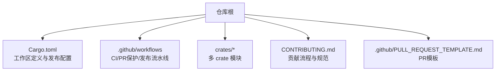
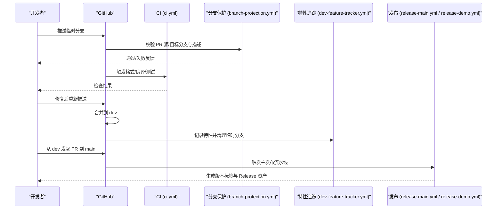
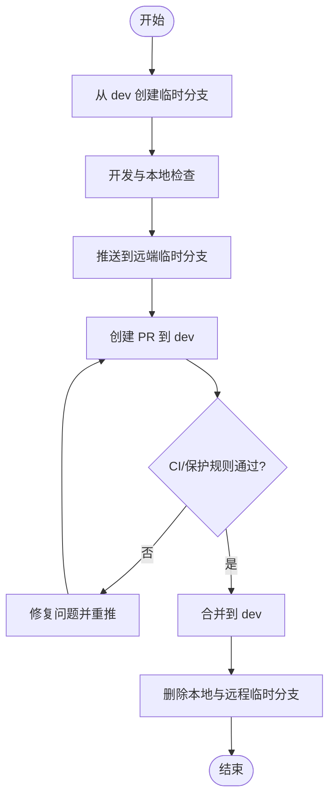
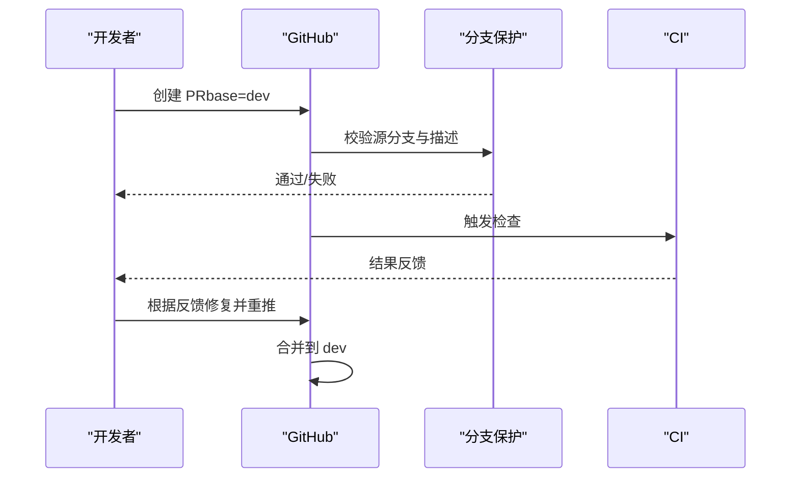
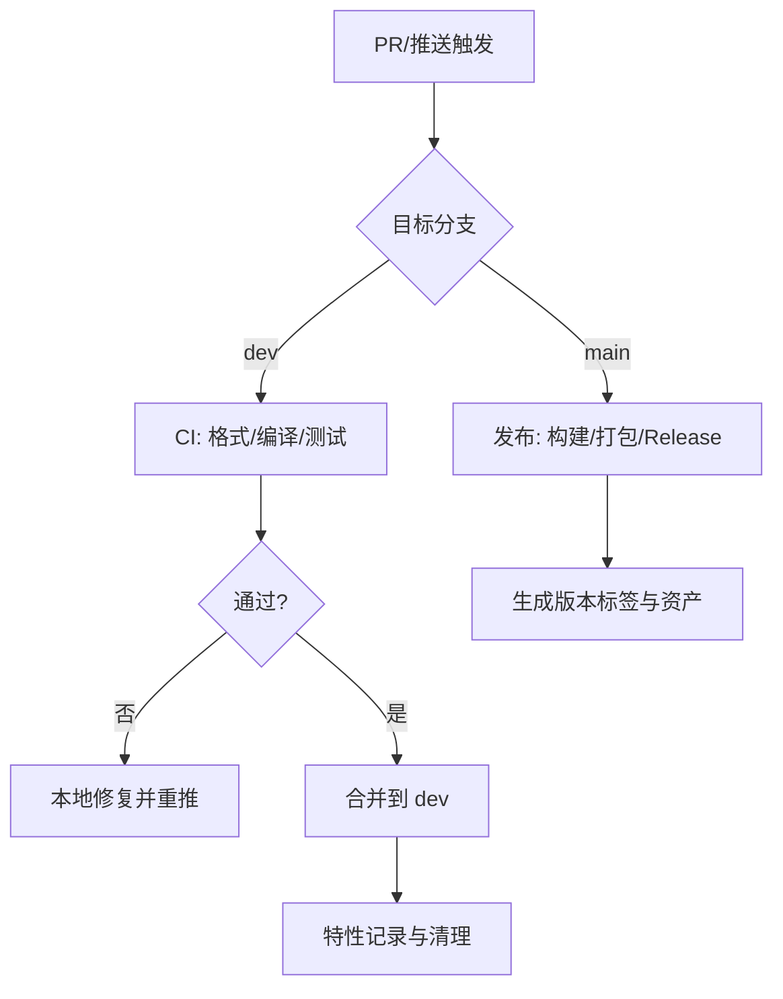
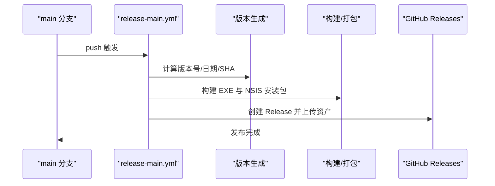
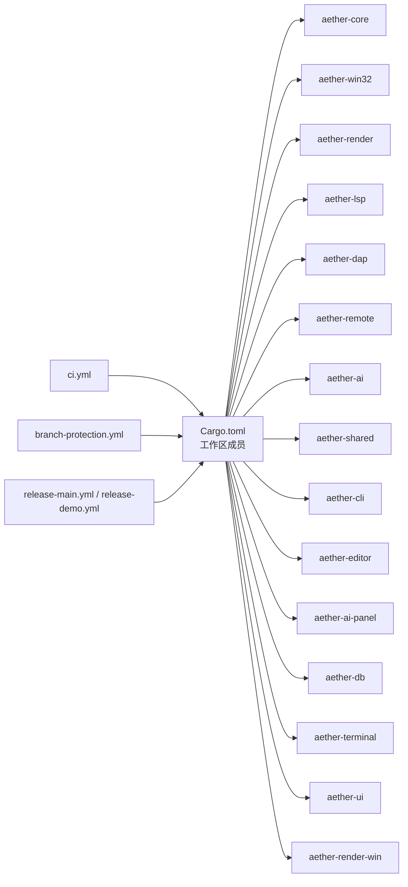

# 贡献流程

<cite>
**本文引用的文件**
- [CONTRIBUTING.md](file://CONTRIBUTING.md)
- [README.md](file://README.md)
- [Cargo.toml](file://Cargo.toml)
- [ci.yml](file://.github/workflows/ci.yml)
- [branch-protection.yml](file://.github/workflows/branch-protection.yml)
- [release-main.yml](file://.github/workflows/release-main.yml)
- [release-demo.yml](file://.github/workflows/release-demo.yml)
- [dev-feature-tracker.yml](file://.github/workflows/dev-feature-tracker.yml)
- [PULL_REQUEST_TEMPLATE.md](file://.github/PULL_REQUEST_TEMPLATE.md)
</cite>

## 目录
1. [简介](#简介)
2. [项目结构](#项目结构)
3. [核心组件](#核心组件)
4. [架构总览](#架构总览)
5. [详细组件分析](#详细组件分析)
6. [依赖关系分析](#依赖关系分析)
7. [性能与效率建议](#性能与效率建议)
8. [故障排查指南](#故障排查指南)
9. [结论](#结论)
10. [附录](#附录)

## 简介
本文件为 Aether Studio（牧羊人编辑器）的完整贡献工作流程说明，覆盖 Fork 工作流、分支命名与生命周期管理、Pull Request 创建与审查标准、CI/CD 流水线与失败处理、版本发布与标签策略、冲突解决最佳实践、协作规范、新贡献者入门与常见问题，以及代码所有权与维护责任分配机制。目标是让首次贡献者与长期维护者都能高效、安全地参与开发。

## 项目结构
仓库采用 Cargo Workspace 组织，按职责拆分为多个 crate；根级配置定义了工作区成员、统一版本与发布优化选项。贡献流程围绕 dev/main 双主干分支与临时功能分支展开，并通过 GitHub Actions 实现自动化检查与发布。

图表来源
- [Cargo.toml:1-37](file://Cargo.toml#L1-L37)
- [ci.yml:1-26](file://.github/workflows/ci.yml#L1-L26)
- [branch-protection.yml:1-81](file://.github/workflows/branch-protection.yml#L1-L81)
- [release-main.yml:1-185](file://.github/workflows/release-main.yml#L1-L185)
- [release-demo.yml:1-148](file://.github/workflows/release-demo.yml#L1-L148)
- [dev-feature-tracker.yml:1-111](file://.github/workflows/dev-feature-tracker.yml#L1-L111)
- [CONTRIBUTING.md:1-270](file://CONTRIBUTING.md#L1-L270)
- [PULL_REQUEST_TEMPLATE.md:1-23](file://.github/PULL_REQUEST_TEMPLATE.md#L1-L23)

章节来源
- [Cargo.toml:1-37](file://Cargo.toml#L1-L37)
- [README.md:162-179](file://README.md#L162-L179)

## 核心组件
- 分支与合并策略：dev 作为集成分支，main 作为稳定发布分支；所有变更通过临时分支进入 dev，再由 dev 合入 main。
- PR 模板与描述要求：强制包含“更新了哪些特性”或“变更内容”，便于自动生成发布说明。
- CI 流水线：对 dev 分支 push 与 PR 触发格式化、编译与测试检查。
- 分支保护规则：限制 PR 源/目标分支，防止非法合并路径。
- 版本发布：main 推送自动构建并创建 Release；dev 支持手动触发演示版发布。
- 特性追踪：合并到 dev 的 PR 自动记录特性清单，供后续汇总生成发布说明。

章节来源
- [CONTRIBUTING.md:7-96](file://CONTRIBUTING.md#L7-L96)
- [branch-protection.yml:18-53](file://.github/workflows/branch-protection.yml#L18-L53)
- [ci.yml:3-25](file://.github/workflows/ci.yml#L3-L25)
- [release-main.yml:31-66](file://.github/workflows/release-main.yml#L31-L66)
- [release-demo.yml:25-42](file://.github/workflows/release-demo.yml#L25-L42)
- [dev-feature-tracker.yml:21-58](file://.github/workflows/dev-feature-tracker.yml#L21-L58)
- [PULL_REQUEST_TEMPLATE.md:8-23](file://.github/PULL_REQUEST_TEMPLATE.md#L8-L23)

## 架构总览
下图展示了从开发者提交到发布的全链路：本地检查 → 推送至临时分支 → PR 到 dev → CI 检查 → 合并到 dev → 特性记录 → 从 dev 合并到 main → 自动构建并发布 Release。

图表来源
- [ci.yml:3-25](file://.github/workflows/ci.yml#L3-L25)
- [branch-protection.yml:18-68](file://.github/workflows/branch-protection.yml#L18-L68)
- [dev-feature-tracker.yml:21-111](file://.github/workflows/dev-feature-tracker.yml#L21-L111)
- [release-main.yml:31-185](file://.github/workflows/release-main.yml#L31-L185)
- [release-demo.yml:25-148](file://.github/workflows/release-demo.yml#L25-L148)

## 详细组件分析

### 分支管理与生命周期
- 分支命名规范
  - 临时功能分支：temp/<简短描述>（英文、无空格）
  - 修复分支：fix/<问题描述>
  - 禁止在 dev/main 直接提交
- 生命周期管理
  - 日常开发：从 dev 切出 temp 分支，完成后 PR 到 dev
  - 合并后删除本地与远程临时分支
  - 保持与上游 dev 同步，必要时 rebase 更新
- 分支保护规则
  - main 只能由 dev 合并
  - dev 禁止直接从 main/master 合并
  - 建议临时分支使用“用户名/功能”格式

图表来源
- [CONTRIBUTING.md:84-96](file://CONTRIBUTING.md#L84-L96)
- [CONTRIBUTING.md:193-221](file://CONTRIBUTING.md#L193-L221)
- [branch-protection.yml:18-53](file://.github/workflows/branch-protection.yml#L18-L53)

章节来源
- [CONTRIBUTING.md:7-96](file://CONTRIBUTING.md#L7-L96)
- [CONTRIBUTING.md:193-221](file://CONTRIBUTING.md#L193-L221)
- [branch-protection.yml:18-53](file://.github/workflows/branch-protection.yml#L18-L53)

### Pull Request 创建流程与模板
- 创建步骤
  - 推送临时分支到远端
  - 打开比较页面，确保 base=dev，compare=临时分支
  - 填写标题与描述，必须包含“更新了哪些特性”或“变更内容”
- 模板字段
  - 更新了哪些特性
  - 修复了哪些问题
  - 其他说明
- 自动化验证
  - 分支保护动作会检查 PR 描述是否包含必需部分
  - 不符合将阻止合并并给出提示

图表来源
- [PULL_REQUEST_TEMPLATE.md:8-23](file://.github/PULL_REQUEST_TEMPLATE.md#L8-L23)
- [branch-protection.yml:55-68](file://.github/workflows/branch-protection.yml#L55-L68)
- [ci.yml:3-25](file://.github/workflows/ci.yml#L3-L25)

章节来源
- [CONTRIBUTING.md:147-161](file://CONTRIBUTING.md#L147-L161)
- [PULL_REQUEST_TEMPLATE.md:8-23](file://.github/PULL_REQUEST_TEMPLATE.md#L8-L23)
- [branch-protection.yml:55-68](file://.github/workflows/branch-protection.yml#L55-L68)

### 代码审查要求与合并标准
- 审查要点
  - 符合提交信息规范（type(scope): description）
  - 通过本地检查清单（格式、编译、测试）
  - 变更范围清晰，避免无关改动
  - 新增/修改行为有测试覆盖或说明
- 合并标准
  - CI 全部通过
  - 分支保护规则通过
  - 至少一名维护者批准（建议）
  - 无未决冲突

章节来源
- [CONTRIBUTING.md:99-145](file://CONTRIBUTING.md#L99-L145)
- [branch-protection.yml:18-68](file://.github/workflows/branch-protection.yml#L18-L68)
- [ci.yml:10-25](file://.github/workflows/ci.yml#L10-L25)

### CI/CD 流水线工作原理与失败处理
- CI（ci.yml）
  - 触发：push 到 dev 与 PR 到 dev
  - 步骤：安装 Rust、格式检查、cargo check、运行测试
- 失败处理
  - 格式失败：执行 cargo fmt 并重新推送
  - 编译失败：查看日志定位错误，本地复现修复
  - 测试失败：本地运行测试，针对性修复
- 分支保护（branch-protection.yml）
  - 校验 PR 源/目标分支合法性
  - 校验 PR 描述包含必需字段
  - 失败时在 PR 评论中给出指引
- 特性追踪（dev-feature-tracker.yml）
  - 合并到 dev 时提取“更新了哪些特性”并保存
  - 自动删除已合并的临时分支
- 发布（release-main.yml / release-demo.yml）
  - main 推送自动构建并创建 Release，上传 EXE 与安装包
  - dev 支持手动触发演示版发布，收集特性并生成预发布

图表来源
- [ci.yml:3-25](file://.github/workflows/ci.yml#L3-L25)
- [branch-protection.yml:18-68](file://.github/workflows/branch-protection.yml#L18-L68)
- [dev-feature-tracker.yml:21-111](file://.github/workflows/dev-feature-tracker.yml#L21-L111)
- [release-main.yml:31-185](file://.github/workflows/release-main.yml#L31-L185)
- [release-demo.yml:25-148](file://.github/workflows/release-demo.yml#L25-L148)

章节来源
- [ci.yml:3-25](file://.github/workflows/ci.yml#L3-L25)
- [CONTRIBUTING.md:164-191](file://CONTRIBUTING.md#L164-L191)
- [branch-protection.yml:18-81](file://.github/workflows/branch-protection.yml#L18-L81)
- [dev-feature-tracker.yml:21-111](file://.github/workflows/dev-feature-tracker.yml#L21-L111)
- [release-main.yml:31-185](file://.github/workflows/release-main.yml#L31-L185)
- [release-demo.yml:25-148](file://.github/workflows/release-demo.yml#L25-L148)

### 版本发布流程与标签管理策略
- 版本号生成
  - main 自动：基于北京时间日期 + build 序号，如 vYYYY.MM.DD-build
  - dev 手动：可输入版本号或自动生成
- 发布产物
  - aether-app.exe（绿色单文件）
  - aether-setup.exe（NSIS 安装包）
- 发布说明
  - 从 PR 模板中提取“更新了哪些特性/修复了哪些问题”
  - 若无则显示常规维护说明
- 标签策略
  - 每次发布创建对应 tag_name
  - 同一日期多次发布递增 build 号

图表来源
- [release-main.yml:31-66](file://.github/workflows/release-main.yml#L31-L66)
- [release-main.yml:68-185](file://.github/workflows/release-main.yml#L68-L185)
- [release-demo.yml:25-42](file://.github/workflows/release-demo.yml#L25-L42)

章节来源
- [release-main.yml:31-185](file://.github/workflows/release-main.yml#L31-L185)
- [release-demo.yml:25-148](file://.github/workflows/release-demo.yml#L25-L148)

### 冲突解决最佳实践与协作开发指南
- 冲突处理
  - 中止当前合并，拉取最新 dev
  - 变基或合并 dev 到临时分支，手动解决冲突
  - 冲突解决后执行完整检查清单并强制推送
- 协作建议
  - 小步提交，频繁同步上游
  - 明确变更范围，避免大杂烩 PR
  - 及时沟通复杂逻辑与影响面
  - 合并后清理临时分支

章节来源
- [CONTRIBUTING.md:193-221](file://CONTRIBUTING.md#L193-L221)
- [CONTRIBUTING.md:241-250](file://CONTRIBUTING.md#L241-L250)

### 新贡献者入门指南
- 环境准备
  - Windows 10 1809+，Rust stable，Visual Studio 2022 或构建工具
  - 目标平台 x86_64-pc-windows-msvc
- 获取与构建
  - Fork 仓库并克隆
  - 添加上游并同步 dev
  - 构建 GUI 与 CLI
- 测试与质量
  - 运行单元测试、静态分析与格式化检查
  - 遵循提交前检查清单
- 提交流程
  - 创建临时分支，提交并推送
  - 创建 PR 到 dev，填写模板
  - 根据 CI 与审查反馈迭代

章节来源
- [README.md:85-118](file://README.md#L85-L118)
- [README.md:127-146](file://README.md#L127-L146)
- [CONTRIBUTING.md:7-57](file://CONTRIBUTING.md#L7-L57)
- [CONTRIBUTING.md:99-145](file://CONTRIBUTING.md#L99-L145)

### 代码所有权与维护责任分配机制
- 建议角色
  - 项目所有者：负责架构决策、发布审批与最终合并
  - 核心维护者：负责关键模块（aether-core、aether-win32、aether-render）的代码审查与稳定性保障
  - 领域维护者：负责特定子系统（LSP/DAP/AI/Remote/Plugin）的审查与演进
  - 贡献者：遵循流程提交变更，响应审查意见
- 责任边界
  - 每个 crate 指定负责人，负责该模块的文档、测试与兼容性
  - 跨模块变更需相关领域维护者联审
- 治理原则
  - 重大变更需 RFC 或设计文档
  - 发布前需通过完整 CI 与至少一名核心维护者批准
  - 定期回顾依赖升级与安全漏洞

[本节为通用治理建议，不直接分析具体文件]

## 依赖关系分析
工作区与 CI/发布流水线的耦合关系如下：

图表来源
- [Cargo.toml:1-19](file://Cargo.toml#L1-L19)
- [ci.yml:3-25](file://.github/workflows/ci.yml#L3-L25)
- [branch-protection.yml:3-7](file://.github/workflows/branch-protection.yml#L3-L7)
- [release-main.yml:3-10](file://.github/workflows/release-main.yml#L3-L10)
- [release-demo.yml:3-11](file://.github/workflows/release-demo.yml#L3-L11)

章节来源
- [Cargo.toml:1-37](file://Cargo.toml#L1-L37)

## 性能与效率建议
- 本地优先：在推送前执行完整检查清单，减少 CI 轮次
- 缓存利用：CI 已启用 Rust 依赖缓存，本地也可复用 target 缓存
- 增量提交：按功能拆分提交，便于审查与回滚
- 测试聚焦：新增逻辑补充单元测试，提升覆盖率与回归防护
- 发布节奏：dev 累积特性后合并到 main 发布，避免频繁打乱主线

[本节提供通用指导，不直接分析具体文件]

## 故障排查指南
- 格式检查失败
  - 执行 cargo fmt 并重新推送
- 编译失败
  - 查看 CI 日志中的错误文件与行号，本地复现修复
- 测试失败
  - 本地运行测试，定位失败用例并修复
- 分支保护失败
  - 确认 PR 源/目标分支合法，补全 PR 描述
- 网络问题
  - 检查连接与代理配置，恢复后重试推送

章节来源
- [CONTRIBUTING.md:164-191](file://CONTRIBUTING.md#L164-L191)
- [branch-protection.yml:55-81](file://.github/workflows/branch-protection.yml#L55-L81)

## 结论
本项目建立了清晰的分支模型、严格的 PR 规范与自动化流水线，确保变更质量与发布可控。贡献者应遵循临时分支→dev→main 的路径，配合 CI 与分支保护规则，保证代码一致性与可追溯性。维护团队通过角色划分与治理原则，持续保障项目的稳定性与演进方向。

## 附录
- 快速参考命令
  - 同步上游：git checkout dev && git pull upstream dev
  - 创建临时分支：git checkout -b temp/<简短描述>
  - 本地检查：cargo fmt --all -- --check && cargo check -p aether-win32 && cargo test --workspace --lib --no-fail-fast
  - 推送与创建 PR：git push -u origin temp/<简短描述>，并在 GitHub 创建 PR 到 dev
- 常用链接
  - 仓库首页：https://github.com/songdiyang/AetherStudio
  - 比较页面：https://github.com/songdiyang/AetherStudio/compare/dev...temp/<branch-name>

章节来源
- [CONTRIBUTING.md:254-269](file://CONTRIBUTING.md#L254-L269)