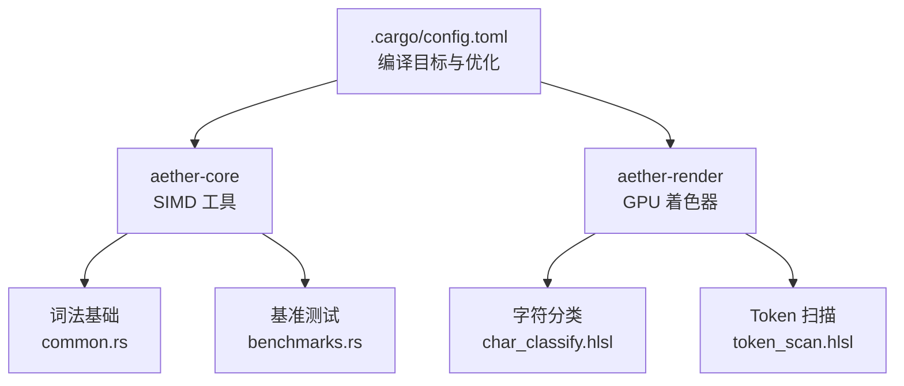
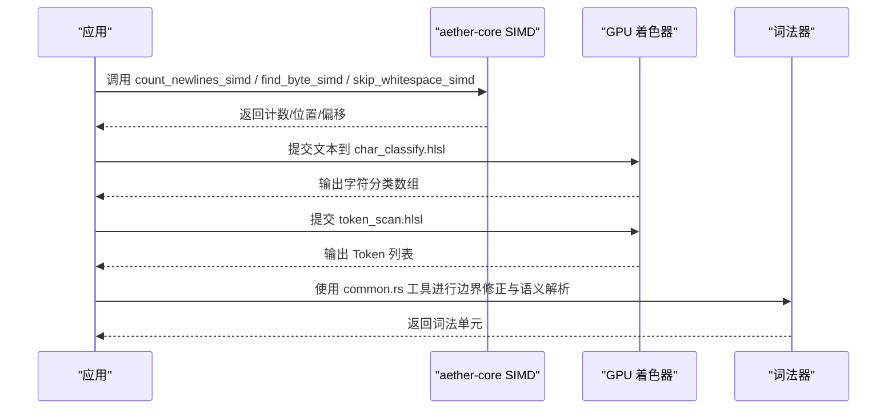
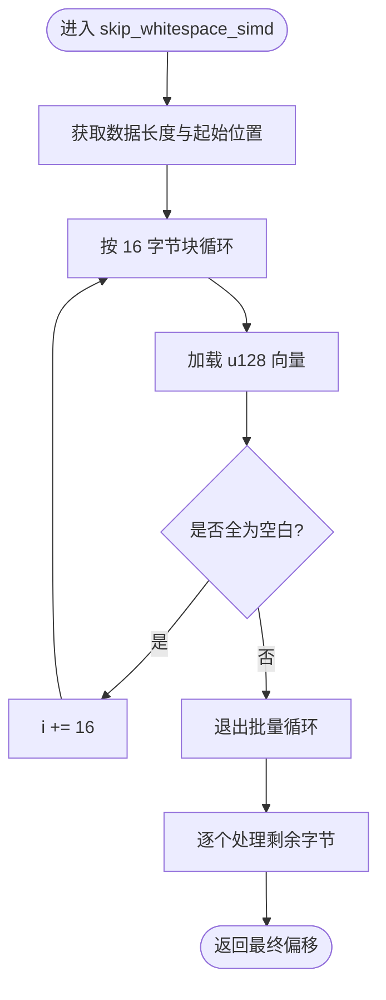
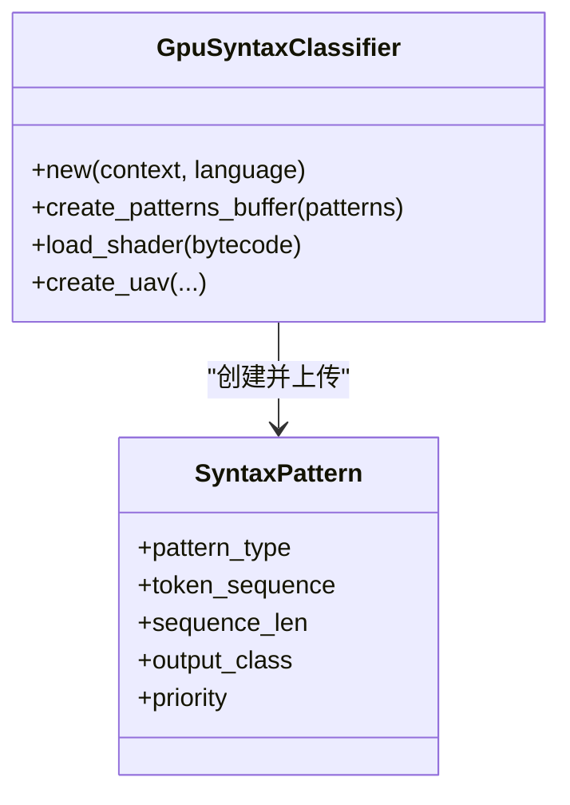
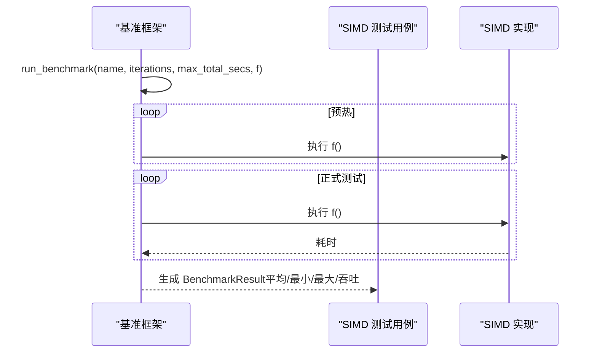
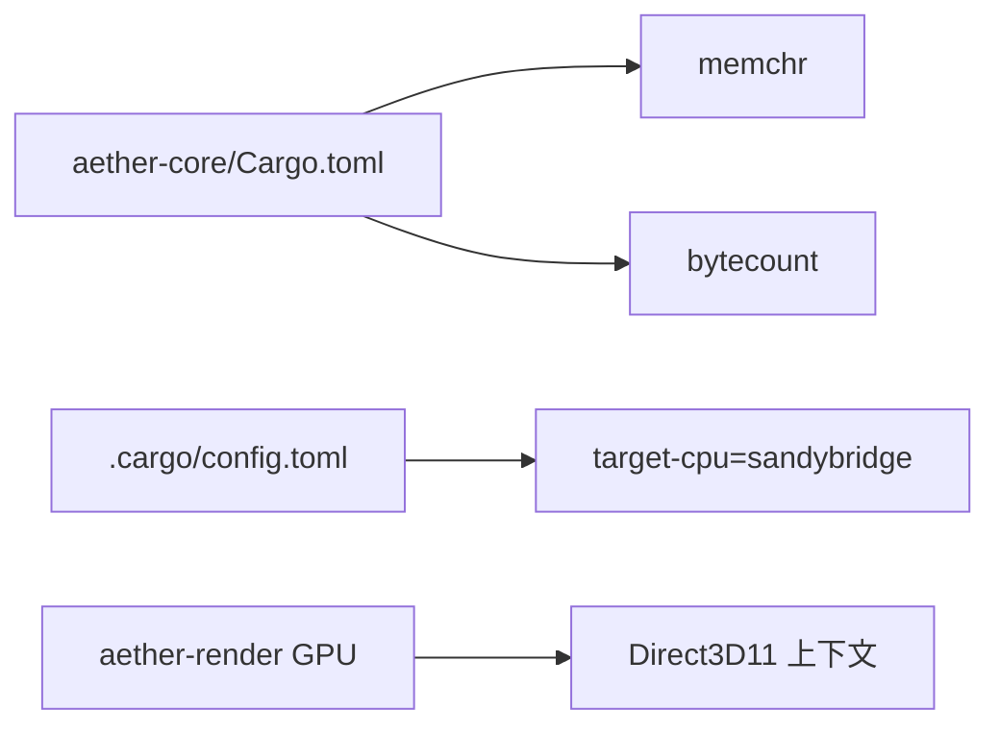

# SIMD 算法优化

<cite>
**本文引用的文件**
- [crates/aether-core/src/simd_utils.rs](file://crates/aether-core/src/simd_utils.rs)
- [crates/aether-core/Cargo.toml](file://crates/aether-core/Cargo.toml)
- [crates/aether-core/src/benchmarks.rs](file://crates/aether-core/src/benchmarks.rs)
- [crates/aether-core/src/lexer/common.rs](file://crates/aether-core/src/lexer/common.rs)
- [crates/aether-render/src/gpu/shaders/char_classify.hlsl](file://crates/aether-render/src/gpu/shaders/char_classify.hlsl)
- [crates/aether-render/src/gpu/shaders/token_scan.hlsl](file://crates/aether-render/src/gpu/shaders/token_scan.hlsl)
- [crates/aether-render/src/gpu/syntax.rs](file://crates/aether-render/src/gpu/syntax.rs)
- [.cargo/config.toml](file://.cargo/config.toml)
</cite>

## 目录
1. [简介](#简介)
2. [项目结构](#项目结构)
3. [核心组件](#核心组件)
4. [架构总览](#架构总览)
5. [详细组件分析](#详细组件分析)
6. [依赖关系分析](#依赖关系分析)
7. [性能考量](#性能考量)
8. [故障排查指南](#故障排查指南)
9. [结论](#结论)
10. [附录](#附录)

## 简介
本技术文档聚焦于编辑器核心中的 SIMD（单指令多数据）算法优化，覆盖以下主题：
- 向量操作与并行数据处理在文本处理中的应用
- 换行符计数、字节查找、空白跳过等关键算法的 SIMD 实现
- x86 SSE/AVX 与 ARM NEON 的支持策略（通过第三方库运行时分派）
- 性能基准测试方法与结果解读
- SIMD 编程最佳实践、调试技巧与常见瓶颈定位及解决方案
- 面向开发者的优化指导原则与实用示例

## 项目结构
本项目将 SIMD 加速集中在 aether-core 的文本工具层，并通过 GPU 着色器在渲染侧进行大规模并行词法扫描。整体结构如下：
- CPU 侧 SIMD：基于 bytecount/memchr 的高性能原语，以及 SWAR 实现的空白跳过
- 词法基础：通用跳过/扫描工具函数，供各语言 lexer 复用
- GPU 侧并行：字符分类与 Token 扫描着色器，利用 Compute Shader 并行化
- 构建配置：目标 CPU 特性与发布优化选项

图表来源
- [crates/aether-core/src/simd_utils.rs:1-20](file://crates/aether-core/src/simd_utils.rs#L1-L20)
- [crates/aether-core/src/lexer/common.rs:1-20](file://crates/aether-core/src/lexer/common.rs#L1-L20)
- [crates/aether-core/src/benchmarks.rs:1-20](file://crates/aether-core/src/benchmarks.rs#L1-L20)
- [crates/aether-render/src/gpu/shaders/char_classify.hlsl:1-20](file://crates/aether-render/src/gpu/shaders/char_classify.hlsl#L1-L20)
- [crates/aether-render/src/gpu/shaders/token_scan.hlsl:1-20](file://crates/aether-render/src/gpu/shaders/token_scan.hlsl#L1-L20)
- [.cargo/config.toml:8-11](file://.cargo/config.toml#L8-L11)

章节来源
- [crates/aether-core/src/simd_utils.rs:1-20](file://crates/aether-core/src/simd_utils.rs#L1-L20)
- [crates/aether-core/Cargo.toml:6-12](file://crates/aether-core/Cargo.toml#L6-L12)
- [crates/aether-core/src/benchmarks.rs:1-20](file://crates/aether-core/src/benchmarks.rs#L1-L20)
- [crates/aether-core/src/lexer/common.rs:1-20](file://crates/aether-core/src/lexer/common.rs#L1-L20)
- [crates/aether-render/src/gpu/shaders/char_classify.hlsl:1-20](file://crates/aether-render/src/gpu/shaders/char_classify.hlsl#L1-L20)
- [crates/aether-render/src/gpu/shaders/token_scan.hlsl:1-20](file://crates/aether-render/src/gpu/shaders/token_scan.hlsl#L1-L20)
- [.cargo/config.toml:8-11](file://.cargo/config.toml#L8-L11)

## 核心组件
- SIMD 文本工具：提供换行计数、字节查找、空白跳过、前缀匹配、行长度计算、字符分类等高性能原语
- 词法基础工具：通用跳过空白、注释、字符串字面量、标识符、数字等逻辑
- GPU 并行词法：字符分类与 Token 扫描着色器，用于大规模并行识别
- 基准测试框架：统一的计时、迭代、吞吐统计，覆盖 SIMD 与增量词法分析

章节来源
- [crates/aether-core/src/simd_utils.rs:8-101](file://crates/aether-core/src/simd_utils.rs#L8-L101)
- [crates/aether-core/src/lexer/common.rs:5-90](file://crates/aether-core/src/lexer/common.rs#L5-L90)
- [crates/aether-render/src/gpu/shaders/char_classify.hlsl:44-88](file://crates/aether-render/src/gpu/shaders/char_classify.hlsl#L44-L88)
- [crates/aether-render/src/gpu/shaders/token_scan.hlsl:56-141](file://crates/aether-render/src/gpu/shaders/token_scan.hlsl#L56-L141)
- [crates/aether-core/src/benchmarks.rs:11-87](file://crates/aether-core/src/benchmarks.rs#L11-L87)

## 架构总览
CPU 侧使用高度优化的 SIMD 原语（bytecount/memchr/SWAR），配合编译器向量化友好的切片遍历；GPU 侧通过 HLSL 着色器完成字符分类与 Token 扫描，形成“CPU 预处理 + GPU 并行”的双轨加速路径。

图表来源
- [crates/aether-core/src/simd_utils.rs:8-79](file://crates/aether-core/src/simd_utils.rs#L8-L79)
- [crates/aether-render/src/gpu/shaders/char_classify.hlsl:74-88](file://crates/aether-render/src/gpu/shaders/char_classify.hlsl#L74-L88)
- [crates/aether-render/src/gpu/shaders/token_scan.hlsl:141-312](file://crates/aether-render/src/gpu/shaders/token_scan.hlsl#L141-L312)
- [crates/aether-core/src/lexer/common.rs:5-90](file://crates/aether-core/src/lexer/common.rs#L5-L90)

## 详细组件分析

### SIMD 文本工具（aether-core）
- 换行计数：委托给 bytecount，内部具备 AVX2/SSE2 运行时分派，适合大数据集快速统计
- 字节查找：委托给 memchr，同样具备底层 SIMD 分派，支持高效定位目标字节
- 空白跳过：采用 16 字节 SWAR 批量检测，结合 chunks_exact 消除边界检查，提升向量化友好性
- 其他工具：前缀匹配、行长度计算、字符分类等，保持零拷贝与最小开销

图表来源
- [crates/aether-core/src/simd_utils.rs:20-55](file://crates/aether-core/src/simd_utils.rs#L20-L55)

章节来源
- [crates/aether-core/src/simd_utils.rs:8-101](file://crates/aether-core/src/simd_utils.rs#L8-L101)

### 词法基础工具（common.rs）
- 提供跨语言复用的跳过/扫描函数：空白、行注释、块注释、字符串字面量、标识符、数字等
- 这些函数仅依赖字节切片，不耦合特定语言语义，便于在不同 lexer 中复用
- 与 SIMD 工具互补：SIMD 负责热点路径加速，common 负责复杂语义边界处理

章节来源
- [crates/aether-core/src/lexer/common.rs:5-90](file://crates/aether-core/src/lexer/common.rs#L5-L90)

### GPU 并行词法（HLSL）
- 字符分类着色器：每个线程处理一个字符，查表得到类别，输出 CharClasses
- Token 扫描着色器：基于字符分类识别 Token 边界，使用共享内存与前缀和思想，原子计数器写入全局 Token 列表
- 语法分类器（Rust 侧）：管理模式缓冲区与着色器资源，驱动 GPU 执行

图表来源
- [crates/aether-render/src/gpu/syntax.rs:39-72](file://crates/aether-render/src/gpu/syntax.rs#L39-L72)
- [crates/aether-render/src/gpu/syntax.rs:236-256](file://crates/aether-render/src/gpu/syntax.rs#L236-L256)

章节来源
- [crates/aether-render/src/gpu/shaders/char_classify.hlsl:44-88](file://crates/aether-render/src/gpu/shaders/char_classify.hlsl#L44-L88)
- [crates/aether-render/src/gpu/shaders/token_scan.hlsl:56-141](file://crates/aether-render/src/gpu/shaders/token_scan.hlsl#L56-L141)
- [crates/aether-render/src/gpu/shaders/token_scan.hlsl:218-312](file://crates/aether-render/src/gpu/shaders/token_scan.hlsl#L218-L312)
- [crates/aether-render/src/gpu/syntax.rs:39-72](file://crates/aether-render/src/gpu/syntax.rs#L39-L72)
- [crates/aether-render/src/gpu/syntax.rs:236-256](file://crates/aether-render/src/gpu/syntax.rs#L236-L256)

### 基准测试与结果分析
- 统一基准框架：run_benchmark 支持预热、最大时间限制、多次迭代统计平均/最小/最大时间与吞吐量
- SIMD 专项测试：覆盖换行计数、字节查找、空白跳过，验证正确性与性能
- 增量词法对比：全量分析与增量更新的速度对比，体现增量策略优势

图表来源
- [crates/aether-core/src/benchmarks.rs:55-87](file://crates/aether-core/src/benchmarks.rs#L55-L87)
- [crates/aether-core/src/benchmarks.rs:234-263](file://crates/aether-core/src/benchmarks.rs#L234-L263)

章节来源
- [crates/aether-core/src/benchmarks.rs:11-87](file://crates/aether-core/src/benchmarks.rs#L11-L87)
- [crates/aether-core/src/benchmarks.rs:234-263](file://crates/aether-core/src/benchmarks.rs#L234-L263)
- [crates/aether-core/src/benchmarks.rs:398-442](file://crates/aether-core/src/benchmarks.rs#L398-L442)

## 依赖关系分析
- aether-core 依赖 memchr 与 bytecount，二者在运行时根据 CPU 能力选择最优实现（SSE/AVX2/NEON 等）
- .cargo/config.toml 设置目标 CPU 与发布优化，确保编译器生成高效代码
- GPU 侧通过 Direct3D11 上下文管理着色器与缓冲区，Rust 侧负责资源生命周期

图表来源
- [crates/aether-core/Cargo.toml:6-12](file://crates/aether-core/Cargo.toml#L6-L12)
- [.cargo/config.toml:8-11](file://.cargo/config.toml#L8-L11)

章节来源
- [crates/aether-core/Cargo.toml:6-12](file://crates/aether-core/Cargo.toml#L6-L12)
- [.cargo/config.toml:8-11](file://.cargo/config.toml#L8-L11)

## 性能考量
- 使用成熟 SIMD 库：bytecount/memchr 提供运行时分派，避免手写 SWAR 的维护成本与潜在错误
- 向量化友好遍历：使用 chunks_exact 减少边界检查，利于编译器自动向量化
- GPU 并行：字符分类与 Token 扫描在 GPU 上并行执行，适合大规模文本处理
- 构建优化：发布配置启用 LTO、单 codegen unit、opt-level 3，最大化性能
- 基准驱动优化：通过统一基准框架持续评估改进效果，避免局部优化导致整体退化

[本节为通用性能讨论，不直接分析具体文件]

## 故障排查指南
- 高字节误报问题：确保字节查找与分类对非 ASCII 字符正确处理，测试覆盖中文、带音标字符与 emoji
- 边界条件：验证空输入、短输入、16 字节边界等场景的正确性
- GPU 资源泄漏：确保 patterns_buffer、UAV/SRV 等资源生命周期管理正确
- 基准稳定性：预热次数与最大时间限制需合理设置，避免冷启动或超时影响结果

章节来源
- [crates/aether-core/src/simd_utils.rs:127-141](file://crates/aether-core/src/simd_utils.rs#L127-L141)
- [crates/aether-core/src/simd_utils.rs:172-183](file://crates/aether-core/src/simd_utils.rs#L172-L183)
- [crates/aether-core/src/benchmarks.rs:55-87](file://crates/aether-core/src/benchmarks.rs#L55-L87)
- [crates/aether-render/src/gpu/syntax.rs:236-256](file://crates/aether-render/src/gpu/syntax.rs#L236-L256)

## 结论
本项目通过“CPU SIMD + GPU 并行”的组合策略，显著提升了文本处理的吞吐与延迟表现。核心思路包括：
- 借助成熟 SIMD 库获得跨平台、跨指令集的高效实现
- 以 SWAR 与向量化友好遍历优化热点路径
- 在 GPU 上并行执行字符分类与 Token 扫描，充分利用硬件并行能力
- 通过基准测试驱动持续优化，确保性能可度量、可回归

[本节为总结性内容，不直接分析具体文件]

## 附录

### SIMD 编程最佳实践
- 优先使用成熟库：如 bytecount/memchr，避免重复造轮子
- 控制数据布局：对齐与连续内存访问有利于向量化
- 减少分支与边界检查：使用 chunks_exact 等工具函数
- 合理划分任务：CPU 做轻量预处理，GPU 做大规模并行
- 持续基准验证：用统一框架衡量每次改动的影响

[本节为通用指导，不直接分析具体文件]

### 调试技巧
- 单元测试覆盖边界与异常路径：空串、短串、16 字节边界、高字节字符
- 打印中间状态：在 GPU 端可通过 UAV 输出中间结果辅助定位
- 隔离热点：将热点函数独立成模块，便于单独基准与剖析

章节来源
- [crates/aether-core/src/simd_utils.rs:107-170](file://crates/aether-core/src/simd_utils.rs#L107-L170)
- [crates/aether-core/src/benchmarks.rs:398-442](file://crates/aether-core/src/benchmarks.rs#L398-L442)