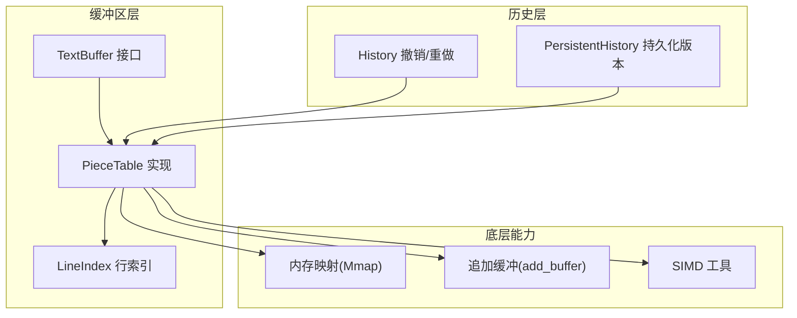
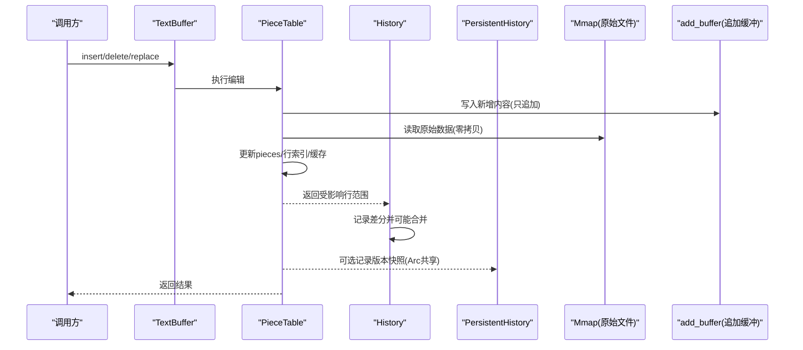
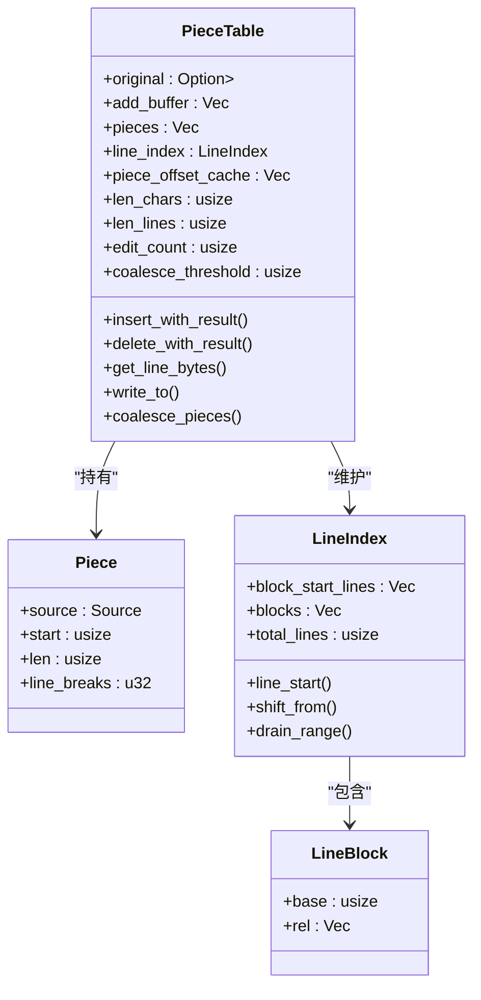
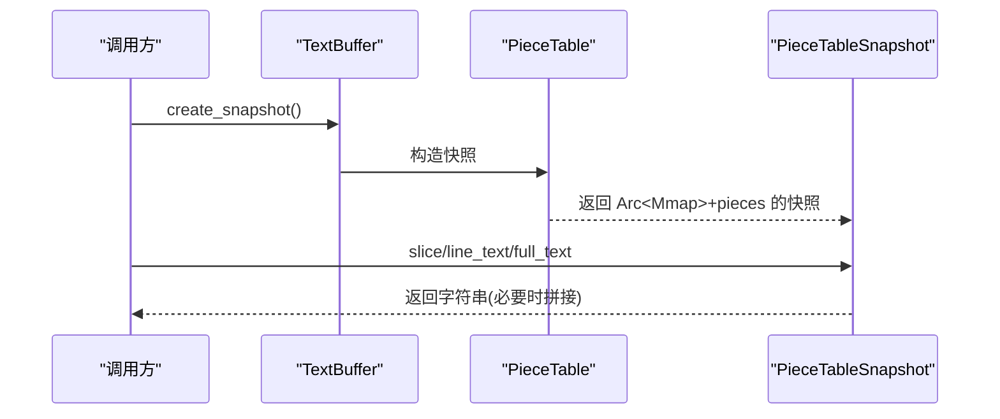
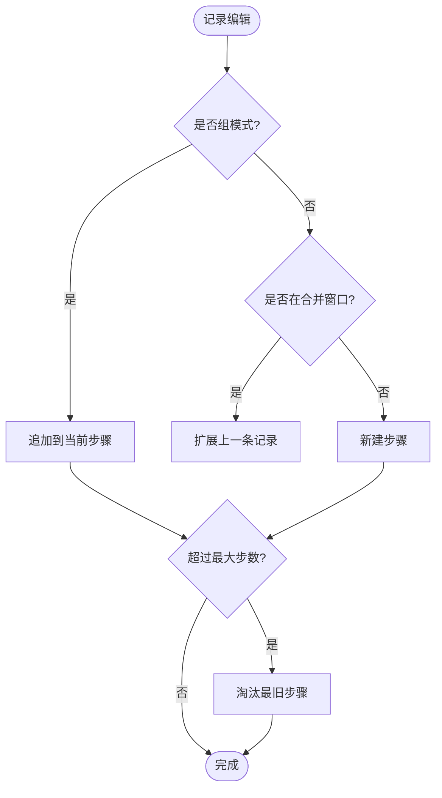
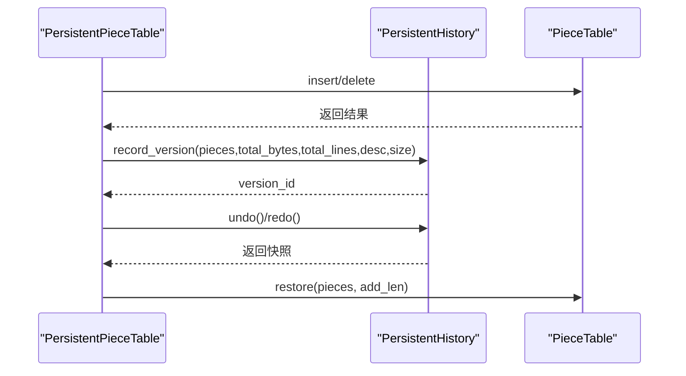
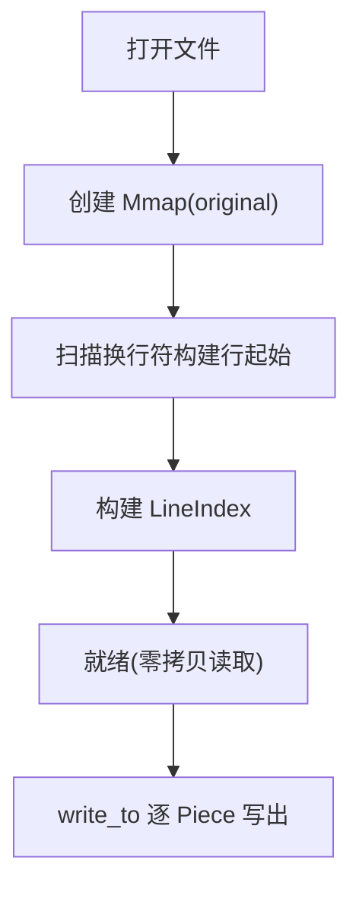
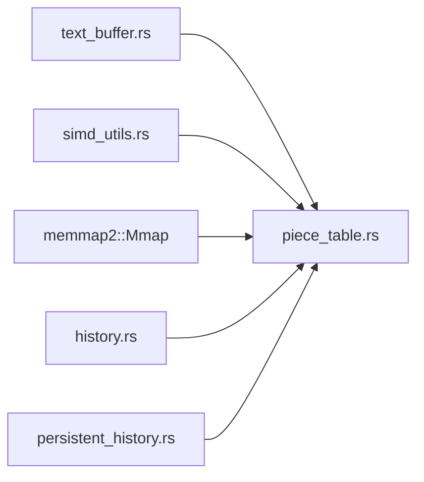

# 内存管理

<cite>
**本文引用的文件**
- [piece_table.rs](file://crates/aether-core/src/buffer/piece_table.rs)
- [text_buffer.rs](file://crates/aether-core/src/buffer/text_buffer.rs)
- [history.rs](file://crates/aether-core/src/buffer/history.rs)
- [persistent_history.rs](file://crates/aether-core/src/persistent_history.rs)
- [simd_utils.rs](file://crates/aether-core/src/simd_utils.rs)
</cite>

## 目录
1. [简介](#简介)
2. [项目结构](#项目结构)
3. [核心组件](#核心组件)
4. [架构总览](#架构总览)
5. [详细组件分析](#详细组件分析)
6. [依赖关系分析](#依赖关系分析)
7. [性能与内存特性](#性能与内存特性)
8. [故障排查指南](#故障排查指南)
9. [结论](#结论)
10. [附录](#附录)

## 简介
本技术文档聚焦于文本编辑器的内存管理，围绕 Piece Table 算法的零拷贝、内存池（追加缓冲）、碎片整理、持久化历史快照、大文件处理（内存映射与流式写入）以及内存使用监控与调优实践展开。目标是帮助开发者理解并优化编辑器在高并发、大文件、长会话场景下的内存占用与性能表现。

## 项目结构
本项目在 aether-core 中实现了高性能文本缓冲区与历史管理：
- 文本缓冲区抽象与实现：TextBuffer trait 与 PieceTable 实现
- 行索引与增量更新：两级分块 LineIndex，支持 O(块数+块大小) 的平移/插入/删除
- 历史与撤销/重做：基于差分记录的 History，避免完整快照复制
- 持久化版本历史：PersistentHistory/PersistentPieceTable，利用 Arc 共享片段列表
- SIMD 加速工具：换行计数、字节查找等，降低 CPU 开销

图表来源
- [piece_table.rs:11-35](file://crates/aether-core/src/buffer/piece_table.rs#L11-L35)
- [text_buffer.rs:1-49](file://crates/aether-core/src/buffer/text_buffer.rs#L1-L49)
- [history.rs:14-28](file://crates/aether-core/src/buffer/history.rs#L14-L28)
- [persistent_history.rs:7-50](file://crates/aether-core/src/persistent_history.rs#L7-L50)
- [simd_utils.rs:1-18](file://crates/aether-core/src/simd_utils.rs#L1-L18)

章节来源
- [piece_table.rs:11-35](file://crates/aether-core/src/buffer/piece_table.rs#L11-L35)
- [text_buffer.rs:1-49](file://crates/aether-core/src/buffer/text_buffer.rs#L1-L49)
- [history.rs:14-28](file://crates/aether-core/src/buffer/history.rs#L14-L28)
- [persistent_history.rs:7-50](file://crates/aether-core/src/persistent_history.rs#L7-L50)
- [simd_utils.rs:1-18](file://crates/aether-core/src/simd_utils.rs#L1-L18)

## 核心组件
- PieceTable：以“原始只读区 + 追加缓冲”的两段式存储，配合有序片段表与行索引，提供 O(1) 插入/删除、零拷贝读取、高效行定位。
- TextBuffer：统一接口，屏蔽底层数据结构差异，支持不可变快照用于后台线程安全访问。
- History：记录最小可逆操作（Insert/Delete/Replace），通过时间窗口合并连续输入，显著降低撤销栈内存。
- PersistentHistory：以 Arc<Vec<Piece>> 共享片段列表，构建轻量版本快照，支持撤销/重做与批量操作。
- SIMD 工具：换行计数、字节查找、空白跳过等，提升热点路径性能。

章节来源
- [piece_table.rs:11-35](file://crates/aether-core/src/buffer/piece_table.rs#L11-L35)
- [text_buffer.rs:1-49](file://crates/aether-core/src/buffer/text_buffer.rs#L1-L49)
- [history.rs:14-28](file://crates/aether-core/src/buffer/history.rs#L14-L28)
- [persistent_history.rs:7-50](file://crates/aether-core/src/persistent_history.rs#L7-L50)
- [simd_utils.rs:1-18](file://crates/aether-core/src/simd_utils.rs#L1-L18)

## 架构总览
下图展示了从用户编辑到内存布局与历史管理的整体流程：

图表来源
- [piece_table.rs:450-562](file://crates/aether-core/src/buffer/piece_table.rs#L450-L562)
- [history.rs:140-280](file://crates/aether-core/src/buffer/history.rs#L140-L280)
- [persistent_history.rs:66-136](file://crates/aether-core/src/persistent_history.rs#L66-L136)
- [simd_utils.rs:8-18](file://crates/aether-core/src/simd_utils.rs#L8-L18)

## 详细组件分析

### PieceTable 内存布局与零拷贝策略
- 两段式存储：
  - original：Arc<Mmap> 指向只读原始文件，打开大文件时不拷贝，仅建立映射。
  - add_buffer：Vec<u8> 作为追加缓冲，只增长不收缩，天然支持撤销（删除即回退引用）。
- 片段表 pieces：每个 Piece 指向 original 或 add_buffer 的一段连续区间，包含起始偏移、长度与缓存的换行数。
- 行索引 LineIndex：两级分块结构，块内相对偏移 u32，块级基址 usize；支持增量平移与分裂，避免全量重建。
- 前缀和缓存 piece_offset_cache：O(1) 获取总字节数与片段起始偏移，加速二分定位。
- 零拷贝读取：
  - get_line_bytes/get_text_bytes：若目标范围完全落在单个 Piece 内，直接返回切片，无堆分配。
  - write_to：按 Piece 顺序写出，避免拼接中间 String。
- 碎片整理：
  - coalesce_pieces：当 edit_count 达到阈值时，合并相邻且连续的 Add 片段，减少碎片数量。
  - 行索引分裂：LINE_BLOCK_MAX 超限自动对半分裂，控制单次 memmove 上界。

图表来源
- [piece_table.rs:11-35](file://crates/aether-core/src/buffer/piece_table.rs#L11-L35)
- [piece_table.rs:53-66](file://crates/aether-core/src/buffer/piece_table.rs#L53-L66)
- [piece_table.rs:73-114](file://crates/aether-core/src/buffer/piece_table.rs#L73-L114)
- [piece_table.rs:1843-1876](file://crates/aether-core/src/buffer/piece_table.rs#L1843-L1876)

章节来源
- [piece_table.rs:11-35](file://crates/aether-core/src/buffer/piece_table.rs#L11-L35)
- [piece_table.rs:408-447](file://crates/aether-core/src/buffer/piece_table.rs#L408-L447)
- [piece_table.rs:710-794](file://crates/aether-core/src/buffer/piece_table.rs#L710-L794)
- [piece_table.rs:881-932](file://crates/aether-core/src/buffer/piece_table.rs#L881-L932)
- [piece_table.rs:946-989](file://crates/aether-core/src/buffer/piece_table.rs#L946-L989)
- [piece_table.rs:1843-1876](file://crates/aether-core/src/buffer/piece_table.rs#L1843-L1876)

### 文本缓冲区接口与快照
- TextBuffer 抽象：所有操作基于字节偏移，支持行号转换、切片、全量文本、不可变快照。
- 快照实现：
  - PieceTableSnapshot：克隆 Arc<Mmap> 与 pieces，避免大文件拷贝；add_buffer 通过 Arc<Vec<u8>> 共享。
  - 行范围计算：未命中单 Piece 时回退到拼接路径，保证正确性。

图表来源
- [text_buffer.rs:1-59](file://crates/aether-core/src/buffer/text_buffer.rs#L1-L59)
- [piece_table.rs:1462-1548](file://crates/aether-core/src/buffer/piece_table.rs#L1462-L1548)
- [piece_table.rs:1632-1643](file://crates/aether-core/src/buffer/piece_table.rs#L1632-L1643)

章节来源
- [text_buffer.rs:1-59](file://crates/aether-core/src/buffer/text_buffer.rs#L1-L59)
- [piece_table.rs:1462-1548](file://crates/aether-core/src/buffer/piece_table.rs#L1462-L1548)
- [piece_table.rs:1632-1643](file://crates/aether-core/src/buffer/piece_table.rs#L1632-L1643)

### 撤销/重做与历史内存优化
- 差分记录：History 仅保存 EditDelta（Insert/Delete/Replace），每条记录极小，避免整张 piece 表克隆。
- 合并窗口：同位置快速输入/删除在 500ms 窗口内合并为一条记录，降低撤销栈规模。
- 组模式：begin_group/end_group 将一组编辑合并为一个撤销步骤，提升用户体验与内存效率。
- 应用逆/正操作：apply_inverse/apply_forward 直接作用于 PieceTable，无需额外状态。

图表来源
- [history.rs:14-28](file://crates/aether-core/src/buffer/history.rs#L14-L28)
- [history.rs:140-280](file://crates/aether-core/src/buffer/history.rs#L140-L280)
- [history.rs:282-340](file://crates/aether-core/src/buffer/history.rs#L282-L340)

章节来源
- [history.rs:14-28](file://crates/aether-core/src/buffer/history.rs#L14-L28)
- [history.rs:140-280](file://crates/aether-core/src/buffer/history.rs#L140-L280)
- [history.rs:282-340](file://crates/aether-core/src/buffer/history.rs#L282-L340)

### 持久化历史与版本快照
- VersionSnapshot：包含 Arc<Vec<Piece>>、总字节/行数、编辑描述与时间戳，内存开销极低。
- 合并策略：small edits 在时间窗口内合并到当前版本，减少版本数量。
- 环形历史：VecDeque 限制历史长度，溢出时优先保留当前版本附近条目。
- 撤销/重做：从 Arc 中 clone pieces（仅引用计数+1），恢复时替换 PieceTable 的 pieces 引用。

图表来源
- [persistent_history.rs:7-50](file://crates/aether-core/src/persistent_history.rs#L7-L50)
- [persistent_history.rs:66-136](file://crates/aether-core/src/persistent_history.rs#L66-L136)
- [persistent_history.rs:240-376](file://crates/aether-core/src/persistent_history.rs#L240-L376)

章节来源
- [persistent_history.rs:7-50](file://crates/aether-core/src/persistent_history.rs#L7-L50)
- [persistent_history.rs:66-136](file://crates/aether-core/src/persistent_history.rs#L66-L136)
- [persistent_history.rs:240-376](file://crates/aether-core/src/persistent_history.rs#L240-L376)

### 大文件处理：内存映射与流式处理
- 内存映射：from_file 使用 Mmap 打开文件，original 字段持有 Arc<Mmap>，后续读取零拷贝。
- 流式写入：write_to 按 Piece 顺序写出，避免一次性拼接全量文本，降低峰值内存。
- 行索引构建：from_file 时一次扫描构建行起始偏移，结合 SIMD 加速换行查找。

图表来源
- [piece_table.rs:408-447](file://crates/aether-core/src/buffer/piece_table.rs#L408-L447)
- [piece_table.rs:776-794](file://crates/aether-core/src/buffer/piece_table.rs#L776-L794)
- [simd_utils.rs:8-18](file://crates/aether-core/src/simd_utils.rs#L8-L18)

章节来源
- [piece_table.rs:408-447](file://crates/aether-core/src/buffer/piece_table.rs#L408-L447)
- [piece_table.rs:776-794](file://crates/aether-core/src/buffer/piece_table.rs#L776-L794)
- [simd_utils.rs:8-18](file://crates/aether-core/src/simd_utils.rs#L8-L18)

## 依赖关系分析
- PieceTable 依赖：
  - text_buffer::TextBuffer：对外暴露统一接口
  - simd_utils：换行计数、字节查找
  - memmap2::Mmap：内存映射原始文件
- History 依赖：
  - PieceTable：应用逆/正操作
- PersistentHistory 依赖：
  - PieceTable：恢复状态
  - Arc<Vec<Piece>>：共享片段列表

图表来源
- [text_buffer.rs:1-49](file://crates/aether-core/src/buffer/text_buffer.rs#L1-L49)
- [piece_table.rs:1-10](file://crates/aether-core/src/buffer/piece_table.rs#L1-L10)
- [history.rs:1-5](file://crates/aether-core/src/buffer/history.rs#L1-L5)
- [persistent_history.rs:1-5](file://crates/aether-core/src/persistent_history.rs#L1-L5)

章节来源
- [text_buffer.rs:1-49](file://crates/aether-core/src/buffer/text_buffer.rs#L1-L49)
- [piece_table.rs:1-10](file://crates/aether-core/src/buffer/piece_table.rs#L1-L10)
- [history.rs:1-5](file://crates/aether-core/src/buffer/history.rs#L1-L5)
- [persistent_history.rs:1-5](file://crates/aether-core/src/persistent_history.rs#L1-L5)

## 性能与内存特性
- 零拷贝读取：
  - 单 Piece 命中时直接返回切片，避免 String 分配与 UTF-8 转换。
  - 大文件打开通过 Mmap，避免全量加载。
- 追加缓冲与只追加语义：
  - add_buffer 只增长不收缩，天然支持撤销；合并阈值控制碎片数量。
- 行索引增量更新：
  - shift_from/shift_from_sub/splice_insert/drain_range 避免全量重建，复杂度降至 O(块内+块数)。
- 前缀和缓存：
  - piece_offset_cache 提供 O(1) 总字节与片段起始偏移查找。
- 历史内存优化：
  - 差分记录 + 时间窗口合并，显著降低撤销栈内存。
  - 持久化版本使用 Arc 共享片段列表，避免重复拷贝。
- SIMD 加速：
  - 换行计数、字节查找、空白跳过等热点路径使用 SIMD，提升吞吐。

[本节为通用性能讨论，不直接分析具体文件]

## 故障排查指南
- 行索引一致性：
  - 删除跨行文本后，确保 drain_range 与 shift_from_sub 正确更新，避免幽灵行起点。
  - 参考测试用例验证随机编辑后的行索引一致性。
- 状态恢复校验：
  - restore_state_checked 对 pieces_data 进行严格边界检查，防止越界与损坏数据导致 panic。
  - 任何校验失败应放弃恢复，保留当前状态。
- 快照与零拷贝：
  - 跨 Piece 读取会回退到拼接路径，注意性能影响；尽量保持热点读取落在单 Piece。
- 历史合并与组模式：
  - 确认 begin_group/end_group 正确使用，避免误合并导致撤销粒度异常。
- 大文件写入：
  - 使用 write_to 流式写出，避免一次性拼接全量文本造成峰值内存。

章节来源
- [piece_table.rs:1025-1059](file://crates/aether-core/src/buffer/piece_table.rs#L1025-L1059)
- [piece_table.rs:1674-1831](file://crates/aether-core/src/buffer/piece_table.rs#L1674-L1831)
- [history.rs:124-138](file://crates/aether-core/src/buffer/history.rs#L124-L138)
- [piece_table.rs:776-794](file://crates/aether-core/src/buffer/piece_table.rs#L776-L794)

## 结论
该实现通过 Piece Table 的两段式存储、零拷贝读取、追加缓冲与碎片整理、两级分块行索引、差分历史与 Arc 共享版本快照，以及 SIMD 加速，构建了高吞吐、低内存占用的文本编辑内核。针对大文件与长会话场景，提供了内存映射、流式写入与历史合并等关键优化。建议在生产环境中结合内存监控工具持续评估峰值内存与 GC 行为，并根据业务特征调整合并阈值与历史容量。

[本节为总结性内容，不直接分析具体文件]

## 附录

### 内存使用监控与分析工具建议
- 进程级指标：
  - 使用系统工具（如 Windows Performance Monitor、Task Manager）观察 RSS、虚拟内存、句柄数变化。
  - 关注 Mmap 映射区域大小与增长趋势，判断大文件加载与释放是否合理。
- Rust 运行时：
  - 启用 jemalloc 或 mimalloc 等分配器，结合其统计接口观察分配热点。
  - 使用 cargo-flamegraph 或 perf 分析 CPU 热点，定位频繁分配路径。
- 应用内埋点：
  - 在关键路径（插入/删除/历史合并/版本快照）记录内存峰值与分配次数。
  - 导出 metrics 至监控系统，设置告警阈值。

[本节为通用指导，不直接分析具体文件]

### 内存泄漏检测与性能调优最佳实践
- 泄漏检测：
  - 使用 Valgrind 或 Windows Application Verifier 检测悬垂指针与重复释放。
  - 在 CI 中运行长期压力测试，观察内存曲线是否稳定。
- 调优要点：
  - 调整 coalesce_threshold 与 LINE_BLOCK_SIZE/LINE_BLOCK_MAX，平衡碎片与移动成本。
  - 合理使用 with_batch 批量操作，减少历史与索引更新频率。
  - 对热点读取路径，尽量保持单 Piece 命中，避免跨 Piece 拼接。
- 常见陷阱：
  - 避免在高频路径创建临时 String；优先使用 write_to 或切片。
  - 谨慎使用 full_text，仅在必要时拼接全量文本。
  - 历史合并窗口不宜过小，否则增加步骤数量；不宜过大，否则影响撤销粒度。

[本节为通用指导，不直接分析具体文件]

### 常见问题解决方案
- 问题：大文件打开慢
  - 解决：确保 from_file 使用 Mmap，并利用 SIMD 加速行索引构建。
- 问题：长时间编辑后内存持续增长
  - 解决：检查 coalesce_pieces 是否触发；调整阈值；确认 add_buffer 只追加语义未被破坏。
- 问题：撤销后显示异常
  - 解决：验证 History 的差分记录与 apply_inverse 逻辑；确认组模式与合并窗口配置。
- 问题：行号与列号转换错误
  - 解决：检查 line_col_to_byte/byte_to_line_col 的边界处理，尤其是末尾光标与 CRLF 换行。

[本节为通用指导，不直接分析具体文件]