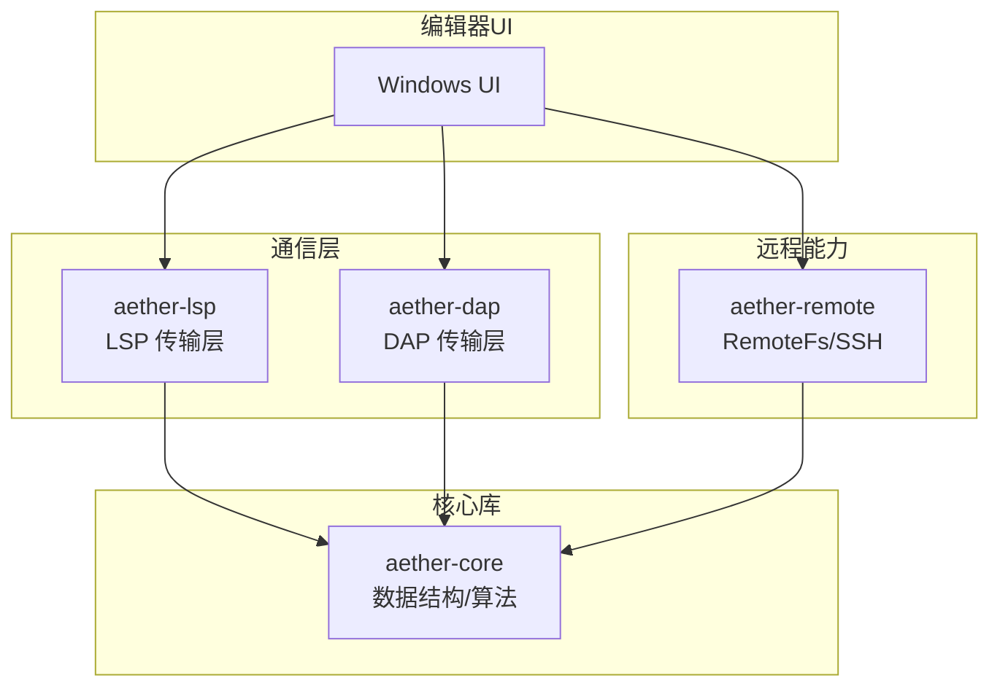
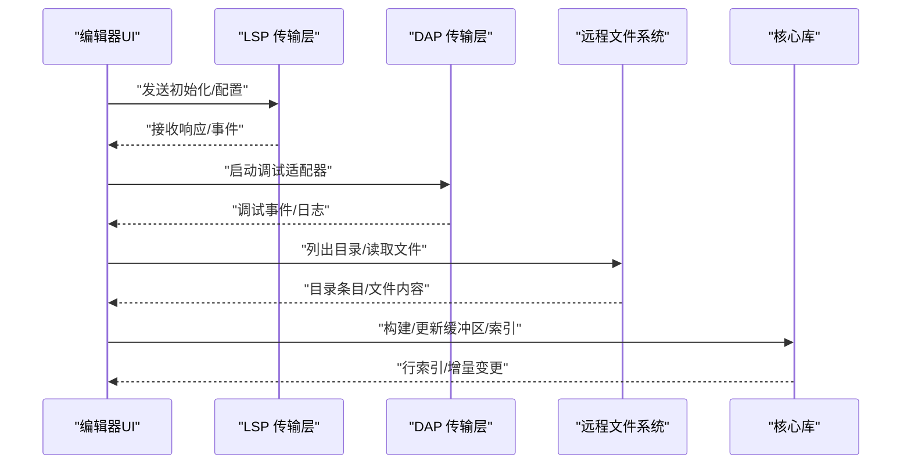
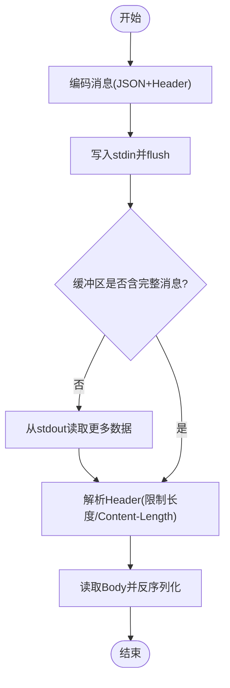
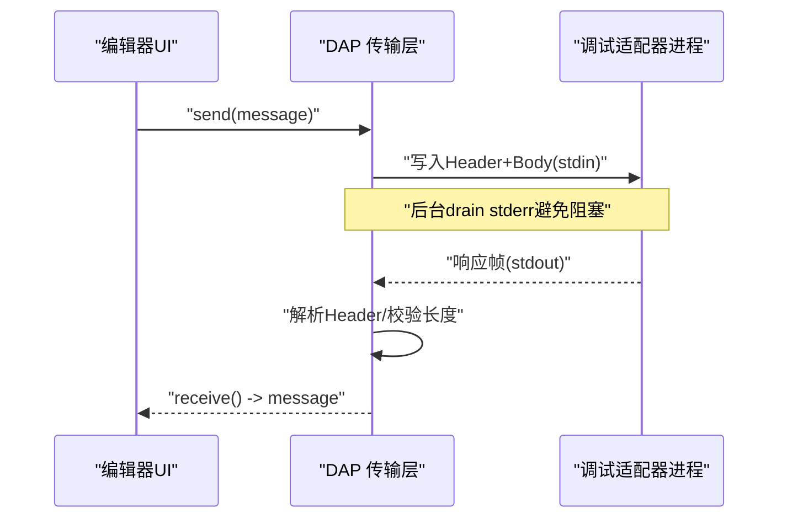
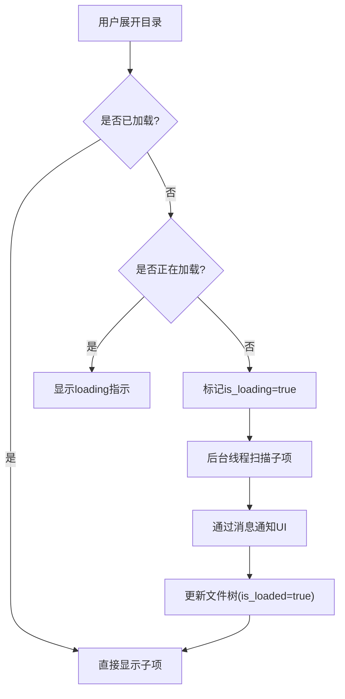
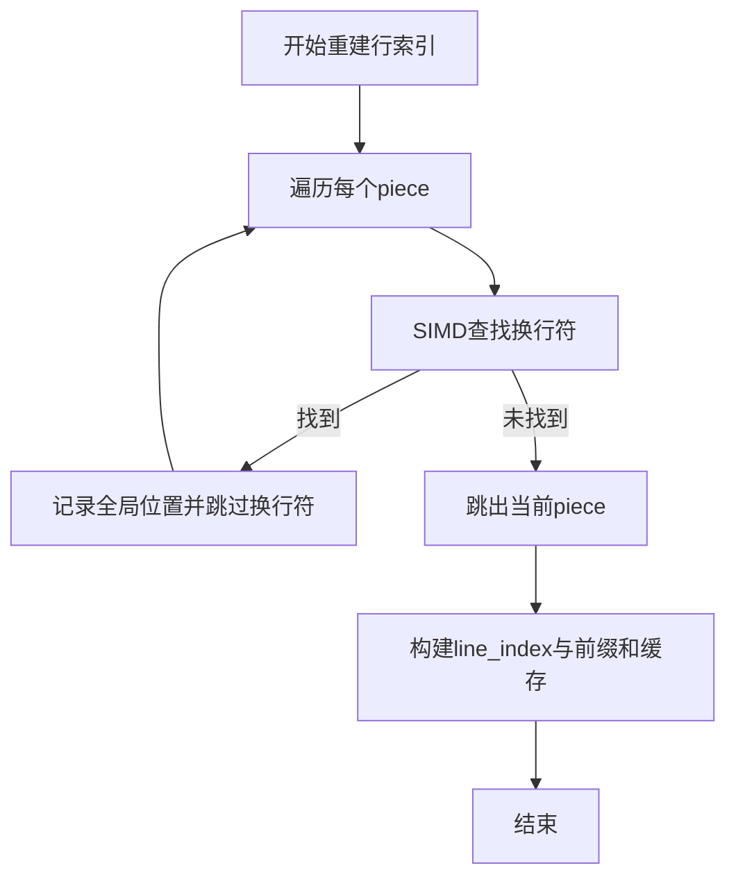
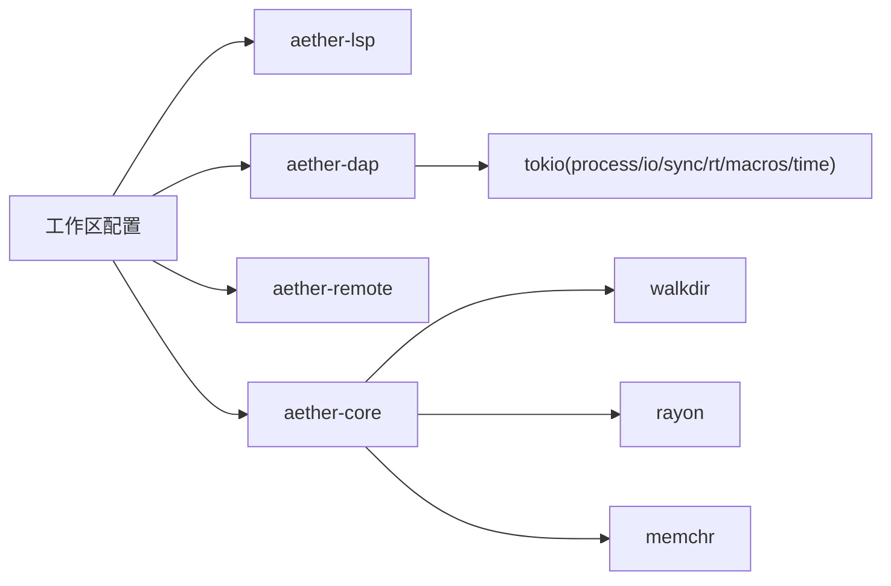

# 异步 I/O 优化

<cite>
**本文引用的文件**
- [Cargo.toml](file://Cargo.toml)
- [aether-core/Cargo.toml](file://crates/aether-core/Cargo.toml)
- [aether-dap/Cargo.toml](file://crates/aether-dap/Cargo.toml)
- [aether-dap/src/transport.rs](file://crates/aether-dap/src/transport.rs)
- [aether-lsp/src/transport.rs](file://crates/aether-lsp/src/transport.rs)
- [aether-remote/src/remote_fs.rs](file://crates/aether-remote/src/remote_fs.rs)
- [aether-win32/src/editor/file_tree.rs](file://crates/aether-win32/src/editor/file_tree.rs)
- [aether-core/src/workspace/file_tree.rs](file://crates/aether-core/src/workspace/file_tree.rs)
- [aether-core/src/buffer/piece_table.rs](file://crates/aether-core/src/buffer/piece_table.rs)
- [aether-render/src/gpu/benchmark.rs](file://crates/aether-render/src/gpu/benchmark.rs)
- [tests/tools/coverage.ps1](file://tests/tools/coverage.ps1)
</cite>

## 目录
1. [简介](#简介)
2. [项目结构](#项目结构)
3. [核心组件](#核心组件)
4. [架构总览](#架构总览)
5. [详细组件分析](#详细组件分析)
6. [依赖分析](#依赖分析)
7. [性能考虑](#性能考虑)
8. [故障排查指南](#故障排查指南)
9. [结论](#结论)
10. [附录](#附录)

## 简介
本技术文档围绕 Rust 异步 I/O 优化展开，结合仓库中 LSP/DAP 传输层、远程文件系统抽象与 UI 侧的异步目录遍历等实现，系统阐述：
- tokio 运行时与非阻塞 I/O 的使用模式
- 大文件读取的流式解析与背压控制策略
- 网络请求（LSP/DAP）的异步优化、连接复用与并发控制
- 文件系统操作的异步化改造（目录遍历、文件监控）
- 异步 I/O 的性能监控与调试工具使用
- 常见异步编程陷阱与解决方案
- 面向开发者的最佳实践与调优建议

## 项目结构
本项目采用多 crate 工作区组织，异步 I/O 相关能力主要分布在以下模块：
- aether-lsp：语言服务器协议客户端/服务端传输层，基于 tokio 的 stdio 异步读写
- aether-dap：调试适配器协议传输层，基于 tokio 进程与异步 I/O
- aether-remote：远程文件系统抽象与 SSH 后端，提供统一接口与安全命令白名单
- aether-win32：Windows UI 层的文件树异步懒加载与后台扫描
- aether-core：核心数据结构与算法（如 PieceTable、SIMD 加速），为异步 I/O 提供高效数据模型
- 基准与覆盖率：GPU 词法基准与覆盖率脚本，用于性能评估



图表来源
- [aether-lsp/src/transport.rs:1-486](file://crates/aether-lsp/src/transport.rs#L1-L486)
- [aether-dap/src/transport.rs:1-288](file://crates/aether-dap/src/transport.rs#L1-L288)
- [aether-remote/src/remote_fs.rs:1-268](file://crates/aether-remote/src/remote_fs.rs#L1-L268)
- [aether-core/src/workspace/file_tree.rs:1-329](file://crates/aether-core/src/workspace/file_tree.rs#L1-L329)

章节来源
- [Cargo.toml:1-37](file://Cargo.toml#L1-L37)

## 核心组件
- LSP 传输层：实现 JSON-RPC over stdio 的编码/解码，包含 Header 解析、Content-Length 校验、超大消息限制、EOF 处理与 stderr 后台 draining。
- DAP 传输层：实现调试适配器的帧格式传输，包含头部长度限制、最大内容长度保护、子进程启动与 stderr 后台 draining。
- 远程文件系统抽象：统一 read/write/list/watch/exec 接口，提供 exec_restricted 安全命令白名单与 Git 路径校验。
- 文件树与异步懒加载：扁平化节点存储 + 字符串池，支持目录子项后台扫描与 UI 非阻塞更新。
- 大文本缓冲与行索引：PieceTable 配合 SIMD 换行符查找，构建快速行索引，提升大文件定位与增量同步效率。
- 性能基准与覆盖率：GPU 词法基准统计吞吐与延迟；覆盖率脚本聚合 profraw 并生成报告。

章节来源
- [aether-lsp/src/transport.rs:1-486](file://crates/aether-lsp/src/transport.rs#L1-L486)
- [aether-dap/src/transport.rs:1-288](file://crates/aether-dap/src/transport.rs#L1-L288)
- [aether-remote/src/remote_fs.rs:1-268](file://crates/aether-remote/src/remote_fs.rs#L1-L268)
- [aether-core/src/workspace/file_tree.rs:1-329](file://crates/aether-core/src/workspace/file_tree.rs#L1-L329)
- [aether-core/src/buffer/piece_table.rs:945-975](file://crates/aether-core/src/buffer/piece_table.rs#L945-L975)
- [aether-render/src/gpu/benchmark.rs:49-195](file://crates/aether-render/src/gpu/benchmark.rs#L49-L195)
- [tests/tools/coverage.ps1:30-55](file://tests/tools/coverage.ps1#L30-L55)

## 架构总览
下图展示编辑器 UI 通过 LSP/DAP 与外部进程通信，并通过远程文件系统访问远端资源，同时利用核心库的数据结构与算法进行高效处理。



图表来源
- [aether-lsp/src/transport.rs:21-107](file://crates/aether-lsp/src/transport.rs#L21-L107)
- [aether-dap/src/transport.rs:26-93](file://crates/aether-dap/src/transport.rs#L26-L93)
- [aether-remote/src/remote_fs.rs:28-44](file://crates/aether-remote/src/remote_fs.rs#L28-L44)
- [aether-core/src/buffer/piece_table.rs:945-975](file://crates/aether-core/src/buffer/piece_table.rs#L945-L975)

## 详细组件分析

### LSP 传输层（JSON-RPC over stdio）
- 设计要点
  - 将写入器与读取器拆分，避免 send/receive 互锁，reader task 独占 stdout，writer 独占 stdin。
  - 严格解析 Header，限制最大 Header 长度（8KB）与 Content-Length（64MB），防止恶意或异常服务导致 OOM。
  - 对 EOF 与非法 JSON 返回明确错误类型，便于上层重试或降级。
  - 后台持续读取 stderr，避免管道缓冲区满导致 LSP 进程阻塞。
- 关键流程
  - 编码消息：序列化 JSON 并附加标准头。
  - 接收消息：循环读取至完整消息，解析 Header，校验长度，反序列化为 LspMessage。
  - 启动/探测：构造 Command，支持 Windows 无控制台标志，启动前探活验证二进制可用性。



图表来源
- [aether-lsp/src/transport.rs:21-107](file://crates/aether-lsp/src/transport.rs#L21-L107)
- [aether-lsp/src/transport.rs:162-208](file://crates/aether-lsp/src/transport.rs#L162-L208)
- [aether-lsp/src/transport.rs:211-229](file://crates/aether-lsp/src/transport.rs#L211-L229)
- [aether-lsp/src/transport.rs:341-359](file://crates/aether-lsp/src/transport.rs#L341-L359)

章节来源
- [aether-lsp/src/transport.rs:1-486](file://crates/aether-lsp/src/transport.rs#L1-L486)

### DAP 传输层（调试适配器进程通信）
- 设计要点
  - 帧格式：Content-Length + \r\n\r\n + JSON body，限制最大消息大小（64MB）。
  - 子进程管理：启动调试适配器，分离 stderr 后台 draining，避免管道阻塞。
  - 健壮性：缺失 Content-Length、畸形 JSON、超大 Content-Length 均返回 InvalidData。
- 关键流程
  - 发送：序列化消息，写入头部与内容，flush。
  - 接收：逐字节读取直到头部结束，解析 Content-Length，校验上限后读取 body 并反序列化。
  - 启动：根据配置构造命令与环境变量，spawn 子进程。



图表来源
- [aether-dap/src/transport.rs:26-93](file://crates/aether-dap/src/transport.rs#L26-L93)
- [aether-dap/src/transport.rs:118-162](file://crates/aether-dap/src/transport.rs#L118-L162)

章节来源
- [aether-dap/src/transport.rs:1-288](file://crates/aether-dap/src/transport.rs#L1-L288)

### 远程文件系统抽象与 SSH 后端
- 抽象接口
  - 统一 read_file/write_file/list_dir/watch/exec 方法，屏蔽底层差异（SSH/容器等）。
  - watch 返回 mpsc::Receiver<FsEvent>，支持事件驱动的文件变更监听。
- 安全与健壮性
  - exec_restricted：命令白名单 + shell 元字符过滤，防止注入。
  - git_exec：参数校验（禁止以 '-' 开头、路径遍历、绝对路径等），确保安全性。
  - exists/is_git_repo：优先 list_dir 检查，避免读取整个文件。
- 典型用法
  - 获取 Git 信息：通过受限命令查询 remote、branch、status。
  - 列出目录：返回 RemoteDirEntry 列表，供 UI 懒加载。

```mermaid
classDiagram
class RemoteFs {
+read_file(path) Result<Vec<u8>>
+write_file(path,content) Result<()>
+list_dir(path) Result<Vec<RemoteDirEntry>>
+watch(path) Result<mpsc : : Receiver<FsEvent>>
+exec(command) Result<(String,String)>
+exec_restricted(command) Result<(String,String)>
+exists(path) Result<bool>
+is_git_repo(path) Result<bool>
+get_git_info(path) Result<GitRemoteInfo>
+git_exec(path,args) Result<(String,String)>
}
class RemoteDirEntry {
+name : String
+is_dir : bool
+size : u64
+modified : Option<SystemTime>
}
class FsEvent {
<<enum>>
Created{path}
Modified{path}
Deleted{path}
Renamed{from,to}
}
RemoteFs --> RemoteDirEntry : "返回"
RemoteFs --> FsEvent : "监听"
```

图表来源
- [aether-remote/src/remote_fs.rs:5-21](file://crates/aether-remote/src/remote_fs.rs#L5-L21)
- [aether-remote/src/remote_fs.rs:28-186](file://crates/aether-remote/src/remote_fs.rs#L28-L186)

章节来源
- [aether-remote/src/remote_fs.rs:1-268](file://crates/aether-remote/src/remote_fs.rs#L1-L268)

### 文件树与异步懒加载（UI 侧）
- 数据结构
  - 扁平化 FileTree + StringPool，减少指针开销，缓存友好。
  - 节点标记 is_loaded/is_loading 区分“未加载”、“加载中”、“已加载”，防止重复触发。
- 异步策略
  - 展开目录时，若未加载则启动后台线程扫描子项，立即返回不阻塞 UI。
  - 扫描完成后通过消息通知 UI 更新，避免长时间阻塞主线程。
  - 初始扫描完成后，预加载根层目录的子节点，降低可见延迟。
- 复杂度与性能
  - 插入与遍历采用 O(1)/O(n) 操作，适合大规模文件树。
  - 字符串池共享名称存储，减少内存分配与拷贝。



图表来源
- [aether-win32/src/editor/file_tree.rs:990-1096](file://crates/aether-win32/src/editor/file_tree.rs#L990-L1096)
- [aether-core/src/workspace/file_tree.rs:1-329](file://crates/aether-core/src/workspace/file_tree.rs#L1-L329)

章节来源
- [aether-win32/src/editor/file_tree.rs:990-1096](file://crates/aether-win32/src/editor/file_tree.rs#L990-L1096)
- [aether-core/src/workspace/file_tree.rs:1-329](file://crates/aether-core/src/workspace/file_tree.rs#L1-L329)

### 大文件读取与流式解析（PieceTable + 行索引）
- 行索引重建
  - 使用 SIMD 加速换行符查找，批量定位每行起始位置，显著优于逐字节遍历。
  - 重建 line_index 与 piece 偏移前缀和缓存，保证后续定位的高效性。
- 性能收益
  - 行级定位时间复杂度接近 O(1)，适合大文件的增量编辑与搜索。
  - 与 LSP 增量同步配合，减少不必要的全量传输。



图表来源
- [aether-core/src/buffer/piece_table.rs:945-975](file://crates/aether-core/src/buffer/piece_table.rs#L945-L975)

章节来源
- [aether-core/src/buffer/piece_table.rs:945-975](file://crates/aether-core/src/buffer/piece_table.rs#L945-L975)

### 性能监控与调试工具
- GPU 词法基准
  - 统计平均/最小/最大耗时、吞吐量(MB/s)、每行延迟(ms/line)，用于对比不同方案。
  - 支持生成 Markdown 报告，便于回归测试与性能审计。
- 覆盖率收集
  - 使用 llvm-profdata 合并 .profraw，llvm-cov 生成覆盖率报告，排除第三方依赖。
- 建议
  - 在 CI 中集成基准与覆盖率，设置阈值告警。
  - 针对热点路径（如 Header 解析、行索引重建）进行专项优化与回归测试。

章节来源
- [aether-render/src/gpu/benchmark.rs:49-195](file://crates/aether-render/src/gpu/benchmark.rs#L49-L195)
- [tests/tools/coverage.ps1:30-55](file://tests/tools/coverage.ps1#L30-L55)

## 依赖分析
- 工作区与版本
  - 工作区成员包含多个 crate，统一版本与发布配置（LTO、opt-level 等）。
- 异步运行时
  - aether-dap 依赖 tokio（process、io-util、sync、rt、macros、time），用于进程管理与异步 I/O。
  - aether-core 依赖 walkdir、rayon、memchr 等，用于文件系统遍历与高性能计算。
- 耦合关系
  - UI 层依赖 LSP/DAP/Remote 抽象，核心库提供数据模型与算法支撑。
  - 远程文件系统抽象解耦具体实现（SSH/容器），便于扩展与维护。



图表来源
- [Cargo.toml:1-37](file://Cargo.toml#L1-L37)
- [aether-dap/Cargo.toml:1-18](file://crates/aether-dap/Cargo.toml#L1-L18)
- [aether-core/Cargo.toml:1-22](file://crates/aether-core/Cargo.toml#L1-L22)

章节来源
- [Cargo.toml:1-37](file://Cargo.toml#L1-L37)
- [aether-dap/Cargo.toml:1-18](file://crates/aether-dap/Cargo.toml#L1-L18)
- [aether-core/Cargo.toml:1-22](file://crates/aether-core/Cargo.toml#L1-L22)

## 性能考虑
- 流式 I/O 与背压
  - LSP/DAP 传输层使用固定大小缓冲区与分块读取，避免一次性分配过大内存。
  - 通过 Content-Length 限制与 Header 长度限制，防止恶意或异常输入导致 OOM。
- 并发与任务调度
  - 后台 stderr draining 与目录扫描使用独立任务/线程，避免阻塞 UI 与主循环。
  - 合理拆分 reader/writer，减少锁竞争与上下文切换。
- 数据局部性与缓存友好
  - FileTree 扁平化存储与 StringPool 共享名称，减少指针跳转与内存碎片。
  - PieceTable 行索引重建使用 SIMD，提升热点路径性能。
- 基准与回归
  - 使用 GPU 词法基准评估不同方案的吞吐与延迟，纳入 CI 进行回归检测。
  - 覆盖率脚本帮助识别未覆盖路径，辅助性能与稳定性优化。

[本节提供通用指导，无需特定文件引用]

## 故障排查指南
- LSP 传输层常见问题
  - 缺失 Content-Length：返回 InvalidData，检查 LSP 服务器实现是否符合规范。
  - 超大 Content-Length：拒绝接收，调整服务器输出或增加限制。
  - EOF 过早关闭：UnexpectedEof，检查服务器生命周期与退出逻辑。
  - stderr 阻塞：确认 spawn_stderr_drain 已启动并持续读取。
- DAP 传输层常见问题
  - 子进程无法启动：检查命令与 PATH，使用 probe_server_command 提前验证。
  - 调试适配器崩溃：查看 stderr 日志，确保后台 draining 有效。
  - 消息格式错误：检查 JSON 序列化与帧格式，参考单元测试用例。
- 远程文件系统问题
  - 命令被拒绝：检查 exec_restricted 白名单与 shell 元字符过滤。
  - Git 路径非法：确保路径不含 '..'、不以 '/' 开头、不含相对路径前缀。
  - 文件不存在：优先 list_dir 检查，避免读取整个文件。
- 文件树懒加载问题
  - 重复触发加载：检查 is_loading 标记与 loading_nodes 集合。
  - UI 未更新：确认后台扫描结果通过消息正确传递并更新 is_loaded。

章节来源
- [aether-lsp/src/transport.rs:74-107](file://crates/aether-lsp/src/transport.rs#L74-L107)
- [aether-lsp/src/transport.rs:162-208](file://crates/aether-lsp/src/transport.rs#L162-L208)
- [aether-lsp/src/transport.rs:341-359](file://crates/aether-lsp/src/transport.rs#L341-L359)
- [aether-dap/src/transport.rs:40-93](file://crates/aether-dap/src/transport.rs#L40-L93)
- [aether-dap/src/transport.rs:118-162](file://crates/aether-dap/src/transport.rs#L118-L162)
- [aether-remote/src/remote_fs.rs:51-94](file://crates/aether-remote/src/remote_fs.rs#L51-L94)
- [aether-remote/src/remote_fs.rs:118-186](file://crates/aether-remote/src/remote_fs.rs#L118-L186)
- [aether-win32/src/editor/file_tree.rs:1000-1096](file://crates/aether-win32/src/editor/file_tree.rs#L1000-L1096)

## 结论
本项目在异步 I/O 方面采用了成熟且稳健的实践：
- 使用 tokio 实现非阻塞 I/O，结合严格的协议解析与长度限制，保障稳定性与安全性。
- 通过远程文件系统抽象与命令白名单，提供安全的远端访问能力。
- 文件树异步懒加载与 PieceTable 行索引，显著提升大文件与大型项目的交互体验。
- 基准与覆盖率工具链支持持续性能监控与回归检测。
建议在实际工程中：
- 持续监控热点路径性能，结合基准测试进行回归验证。
- 遵循安全最佳实践，严格校验输入与限制资源使用。
- 保持代码模块化与职责清晰，便于扩展与维护。

[本节总结性内容，无需特定文件引用]

## 附录
- 术语表
  - LSP：Language Server Protocol，语言服务器协议
  - DAP：Debug Adapter Protocol，调试适配器协议
  - tokio：Rust 异步运行时
  - PieceTable：一种高效的文本编辑数据结构
  - SIMD：单指令多数据，用于并行数据处理
- 参考链接
  - 工作区配置与发布选项见 Cargo.toml
  - LSP/DAP 传输层实现见对应 crate 的 transport.rs
  - 远程文件系统抽象见 aether-remote/src/remote_fs.rs
  - 文件树与懒加载见 aether-core 与 aether-win32 相关文件

[本节提供补充信息，无需特定文件引用]