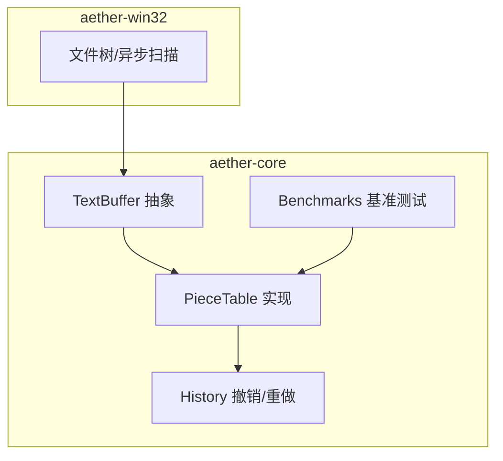
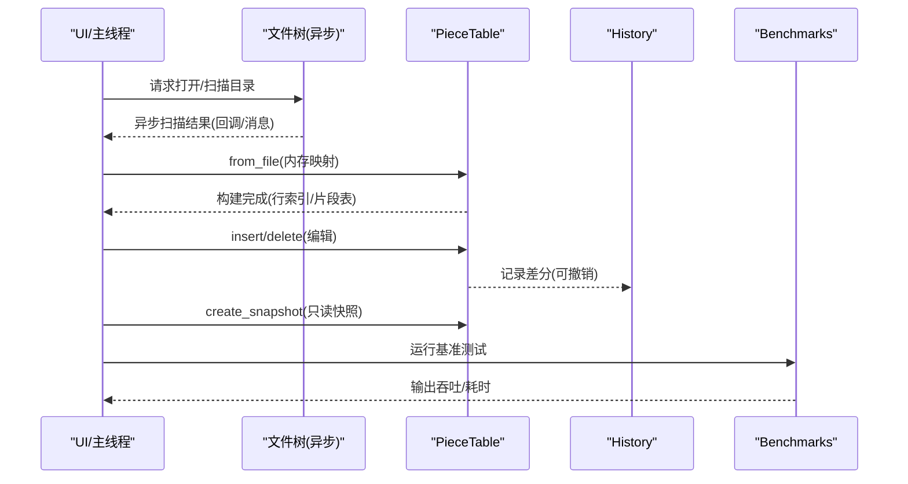
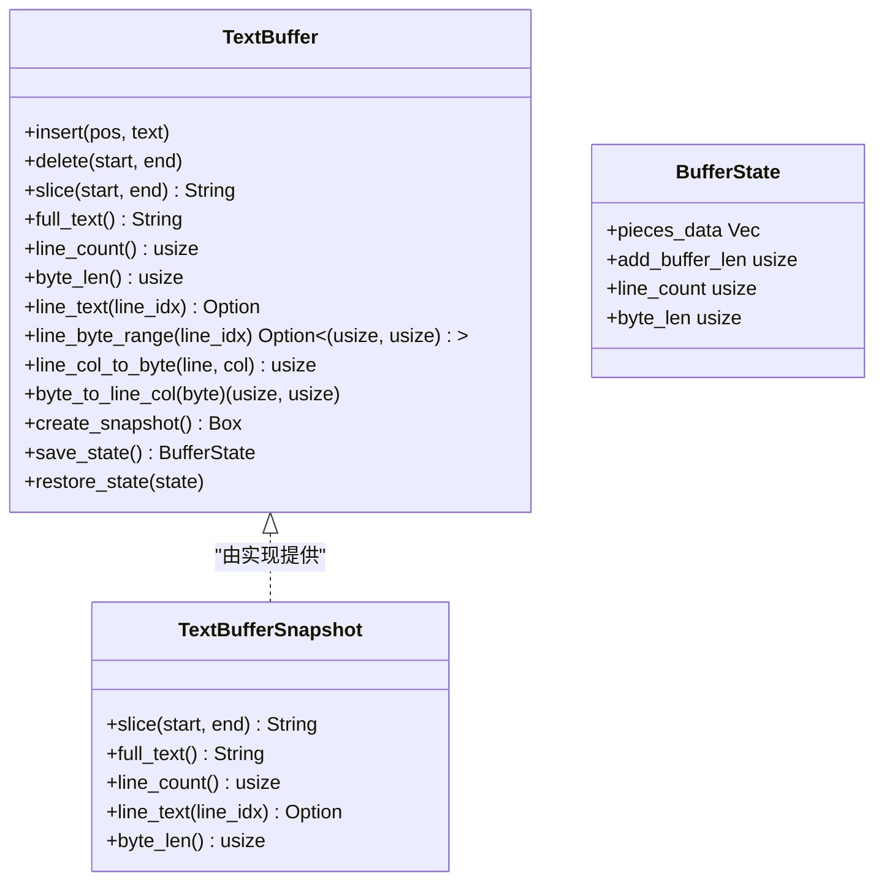
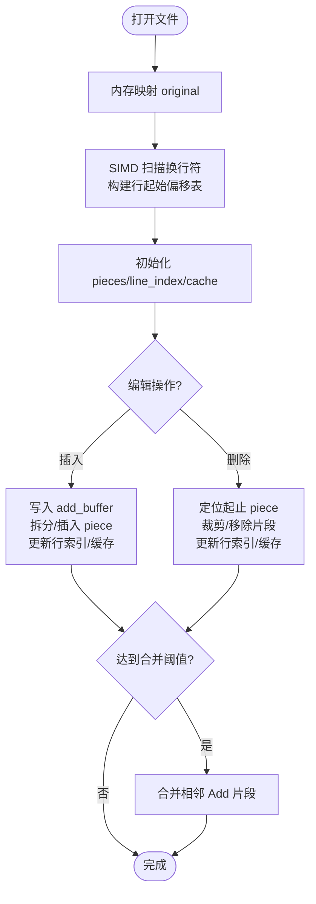
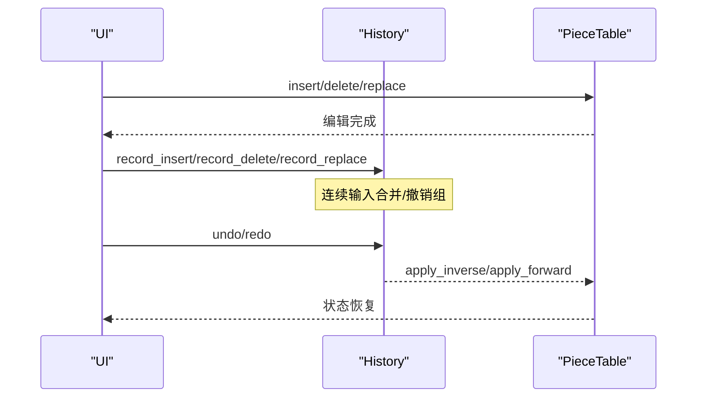
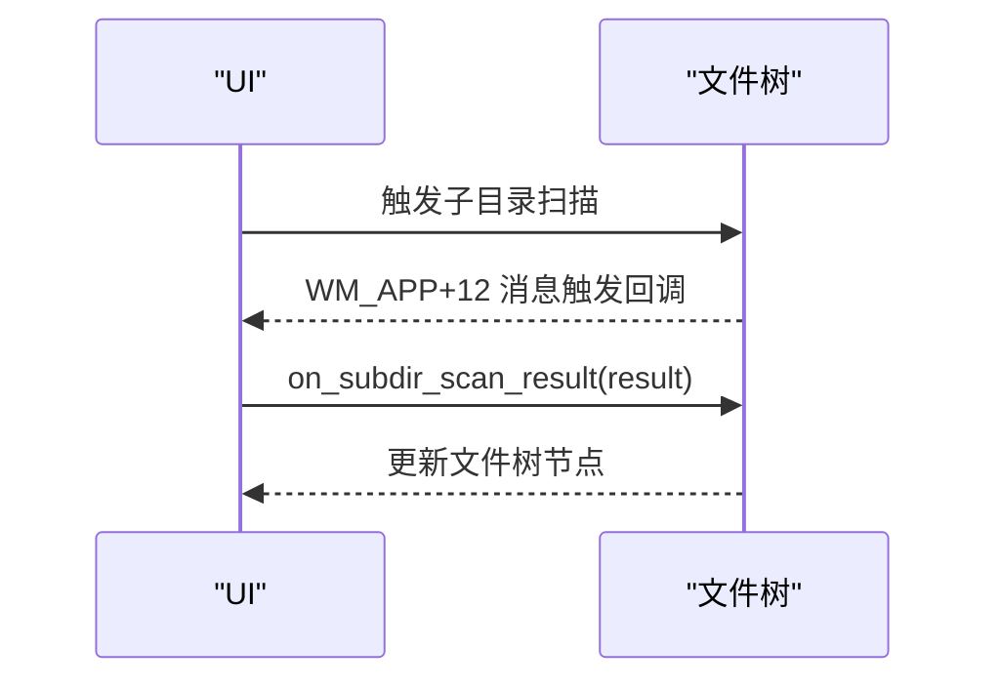
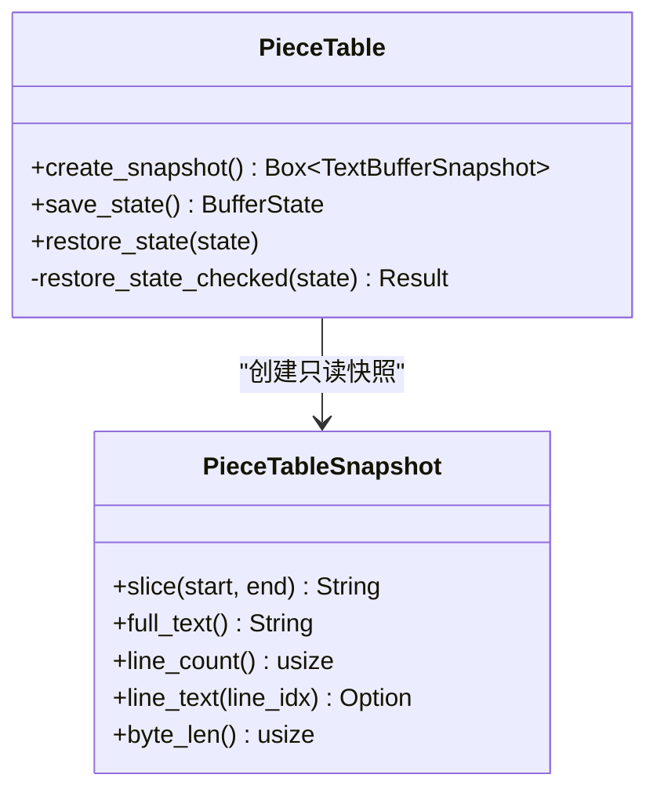
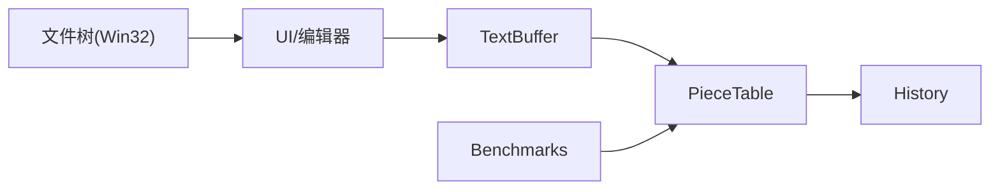
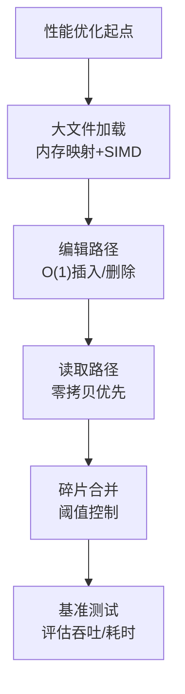

# 文件操作优化

<cite>
**本文引用的文件**
- [crates/aether-core/src/buffer/mod.rs](file://crates/aether-core/src/buffer/mod.rs)
- [crates/aether-core/src/buffer/text_buffer.rs](file://crates/aether-core/src/buffer/text_buffer.rs)
- [crates/aether-core/src/buffer/piece_table.rs](file://crates/aether-core/src/buffer/piece_table.rs)
- [crates/aether-core/src/buffer/history.rs](file://crates/aether-core/src/buffer/history.rs)
- [crates/aether-core/src/benchmarks.rs](file://crates/aether-core/src/benchmarks.rs)
- [crates/aether-core/examples/perf_test.rs](file://crates/aether-core/examples/perf_test.rs)
- [crates/aether-win32/src/editor/file_tree.rs](file://crates/aether-win32/src/editor/file_tree.rs)
</cite>

## 目录
1. [简介](#简介)
2. [项目结构](#项目结构)
3. [核心组件](#核心组件)
4. [架构总览](#架构总览)
5. [详细组件分析](#详细组件分析)
6. [依赖关系分析](#依赖关系分析)
7. [性能考量](#性能考量)
8. [故障排查指南](#故障排查指南)
9. [结论](#结论)
10. [附录](#附录)

## 简介
本技术文档围绕“文件操作优化”展开，聚焦文本缓冲区的异步文件读取机制、大文件流式加载与内存管理策略；Piece Table 算法在异步环境中的增量更新与并发安全访问；文件系统监控的异步实现（事件监听与变更检测）；缓冲区状态管理的不可变快照与线程安全并发访问；并提供基准测试方法与优化建议，以及常见 I/O 问题与解决方案。

## 项目结构
本项目采用按功能模块划分的 crate 组织方式：
- aether-core：核心编辑能力，包含文本缓冲区（TextBuffer 抽象）、Piece Table 实现、撤销历史、SIMD 工具、增量词法分析等。
- aether-win32：Windows 平台 UI/交互层，包含文件树、编辑器视图、消息处理等。
- 其他 crate：AI、LSP、渲染、终端、远程等。

图表来源
- [crates/aether-core/src/buffer/mod.rs:1-9](file://crates/aether-core/src/buffer/mod.rs#L1-L9)
- [crates/aether-core/src/buffer/text_buffer.rs:1-49](file://crates/aether-core/src/buffer/text_buffer.rs#L1-L49)
- [crates/aether-core/src/buffer/piece_table.rs:11-35](file://crates/aether-core/src/buffer/piece_table.rs#L11-L35)
- [crates/aether-core/src/buffer/history.rs:6-28](file://crates/aether-core/src/buffer/history.rs#L6-L28)
- [crates/aether-core/src/benchmarks.rs:104-133](file://crates/aether-core/src/benchmarks.rs#L104-L133)
- [crates/aether-win32/src/editor/file_tree.rs:1065-1096](file://crates/aether-win32/src/editor/file_tree.rs#L1065-L1096)

章节来源
- [crates/aether-core/src/buffer/mod.rs:1-9](file://crates/aether-core/src/buffer/mod.rs#L1-L9)

## 核心组件
- TextBuffer 抽象：定义统一的插入、删除、切片、行号转换、快照创建、状态保存/恢复等接口，屏蔽底层数据结构差异。
- PieceTable：高性能文本缓冲区，支持 O(1) 插入/删除、零拷贝大文件打开（内存映射）、增量行索引与碎片合并。
- History：基于差分的撤销/重做，支持连续输入合并、撤销组、光标位置记录。
- Benchmarks：提供 PieceTable、SIMD、增量词法的基准测试套件。
- 文件树（Win32）：异步子目录扫描与结果回传，避免阻塞 UI。

章节来源
- [crates/aether-core/src/buffer/text_buffer.rs:1-49](file://crates/aether-core/src/buffer/text_buffer.rs#L1-L49)
- [crates/aether-core/src/buffer/piece_table.rs:11-35](file://crates/aether-core/src/buffer/piece_table.rs#L11-L35)
- [crates/aether-core/src/buffer/history.rs:6-28](file://crates/aether-core/src/buffer/history.rs#L6-L28)
- [crates/aether-core/src/benchmarks.rs:104-133](file://crates/aether-core/src/benchmarks.rs#L104-L133)
- [crates/aether-win32/src/editor/file_tree.rs:1065-1096](file://crates/aether-win32/src/editor/file_tree.rs#L1065-L1096)

## 架构总览
下图展示从文件打开到编辑、撤销、快照与基准测试的整体流程，体现异步与并发设计要点。

图表来源
- [crates/aether-core/src/buffer/piece_table.rs:408-448](file://crates/aether-core/src/buffer/piece_table.rs#L408-L448)
- [crates/aether-core/src/buffer/text_buffer.rs:39-49](file://crates/aether-core/src/buffer/text_buffer.rs#L39-L49)
- [crates/aether-core/src/buffer/history.rs:140-280](file://crates/aether-core/src/buffer/history.rs#L140-L280)
- [crates/aether-core/src/benchmarks.rs:104-133](file://crates/aether-core/src/benchmarks.rs#L104-L133)
- [crates/aether-win32/src/editor/file_tree.rs:1065-1096](file://crates/aether-win32/src/editor/file_tree.rs#L1065-L1096)

## 详细组件分析

### 文本缓冲区抽象与不可变快照
- TextBuffer trait 定义了所有编辑操作的统一接口，强调字节偏移、行号从 0 开始、支持不可变快照用于后台线程安全读取。
- TextBufferSnapshot 提供只读视图，允许后台线程在不加锁的情况下读取内容，提升并发安全性与性能。
- BufferState 轻量元数据快照，用于 Undo/Redo 或持久化恢复，不包含完整文本内容。

图表来源
- [crates/aether-core/src/buffer/text_buffer.rs:1-59](file://crates/aether-core/src/buffer/text_buffer.rs#L1-L59)
- [crates/aether-core/src/buffer/text_buffer.rs:61-81](file://crates/aether-core/src/buffer/text_buffer.rs#L61-L81)

章节来源
- [crates/aether-core/src/buffer/text_buffer.rs:1-59](file://crates/aether-core/src/buffer/text_buffer.rs#L1-L59)
- [crates/aether-core/src/buffer/text_buffer.rs:61-81](file://crates/aether-core/src/buffer/text_buffer.rs#L61-L81)

### Piece Table 算法与异步环境实现
- 大文件打开：使用内存映射（Mmap）直接映射原始文件，避免全量拷贝；通过 SIMD 加速换行符查找，一次性构建行起始偏移表，显著降低打开时间。
- 增量更新：插入/删除时维护有序片段表（pieces），并增量更新行索引与缓存（piece_offset_cache、len_lines）。
- 并发安全：通过 create_snapshot 生成只读快照，共享 Arc<Mmap>，避免复制大文件；add_buffer 克隆为 Arc<Vec<u8>> 以减轻拷贝开销（注释指出待进一步优化）。
- 碎片合并：达到阈值后合并相邻同 Source 的片段，减少碎片数量，提升后续查询性能。

图表来源
- [crates/aether-core/src/buffer/piece_table.rs:408-448](file://crates/aether-core/src/buffer/piece_table.rs#L408-L448)
- [crates/aether-core/src/buffer/piece_table.rs:450-562](file://crates/aether-core/src/buffer/piece_table.rs#L450-L562)
- [crates/aether-core/src/buffer/piece_table.rs:569-688](file://crates/aether-core/src/buffer/piece_table.rs#L569-L688)
- [crates/aether-core/src/buffer/piece_table.rs:1843-1876](file://crates/aether-core/src/buffer/piece_table.rs#L1843-L1876)

章节来源
- [crates/aether-core/src/buffer/piece_table.rs:408-448](file://crates/aether-core/src/buffer/piece_table.rs#L408-L448)
- [crates/aether-core/src/buffer/piece_table.rs:450-562](file://crates/aether-core/src/buffer/piece_table.rs#L450-L562)
- [crates/aether-core/src/buffer/piece_table.rs:569-688](file://crates/aether-core/src/buffer/piece_table.rs#L569-L688)
- [crates/aether-core/src/buffer/piece_table.rs:1843-1876](file://crates/aether-core/src/buffer/piece_table.rs#L1843-L1876)

### 撤销/重做与增量合并
- History 记录 EditDelta（Insert/Delete/Replace），支持撤销/重做，且对连续快速输入进行合并以减少步骤数。
- 撤销组：begin_group/end_group 将多条记录归为一个撤销步骤，提升用户体验。
- 光标位置：记录每次编辑前后的光标位置，便于撤销/重做后恢复。

图表来源
- [crates/aether-core/src/buffer/history.rs:140-280](file://crates/aether-core/src/buffer/history.rs#L140-L280)
- [crates/aether-core/src/buffer/history.rs:303-323](file://crates/aether-core/src/buffer/history.rs#L303-L323)

章节来源
- [crates/aether-core/src/buffer/history.rs:140-280](file://crates/aether-core/src/buffer/history.rs#L140-L280)
- [crates/aether-core/src/buffer/history.rs:303-323](file://crates/aether-core/src/buffer/history.rs#L303-L323)

### 文件监控的异步实现
- Win32 文件树支持异步子目录扫描，通过消息回调 on_subdir_scan_result 处理结果，避免阻塞 UI。
- 在回调中验证节点有效性，再更新文件树，确保一致性。

图表来源
- [crates/aether-win32/src/editor/file_tree.rs:1065-1096](file://crates/aether-win32/src/editor/file_tree.rs#L1065-L1096)

章节来源
- [crates/aether-win32/src/editor/file_tree.rs:1065-1096](file://crates/aether-win32/src/editor/file_tree.rs#L1065-L1096)

### 缓冲区状态管理与并发访问
- 不可变快照：create_snapshot 返回只读视图，共享 Arc<Mmap>，避免复制大文件；add_buffer 克隆为 Arc<Vec<u8>>，降低拷贝成本。
- 状态保存/恢复：save_state 序列化 piece 元数据；restore_state_checked 严格校验边界与完整性，失败则放弃恢复，保证稳定性。

图表来源
- [crates/aether-core/src/buffer/piece_table.rs:1632-1671](file://crates/aether-core/src/buffer/piece_table.rs#L1632-L1671)
- [crates/aether-core/src/buffer/piece_table.rs:1674-1831](file://crates/aether-core/src/buffer/piece_table.rs#L1674-L1831)

章节来源
- [crates/aether-core/src/buffer/piece_table.rs:1632-1671](file://crates/aether-core/src/buffer/piece_table.rs#L1632-L1671)
- [crates/aether-core/src/buffer/piece_table.rs:1674-1831](file://crates/aether-core/src/buffer/piece_table.rs#L1674-L1831)

## 依赖关系分析
- TextBuffer 抽象被上层 UI/编辑器依赖，具体实现为 PieceTable。
- History 依赖 PieceTable 进行撤销/重做。
- Benchmarks 依赖 PieceTable、SIMD、增量词法进行分析与对比。
- 文件树（Win32）通过消息机制与 UI 交互，间接影响编辑器状态。

图表来源
- [crates/aether-core/src/buffer/mod.rs:1-9](file://crates/aether-core/src/buffer/mod.rs#L1-L9)
- [crates/aether-core/src/buffer/text_buffer.rs:1-49](file://crates/aether-core/src/buffer/text_buffer.rs#L1-L49)
- [crates/aether-core/src/buffer/piece_table.rs:11-35](file://crates/aether-core/src/buffer/piece_table.rs#L11-L35)
- [crates/aether-core/src/buffer/history.rs:6-28](file://crates/aether-core/src/buffer/history.rs#L6-L28)
- [crates/aether-core/src/benchmarks.rs:104-133](file://crates/aether-core/src/benchmarks.rs#L104-L133)
- [crates/aether-win32/src/editor/file_tree.rs:1065-1096](file://crates/aether-win32/src/editor/file_tree.rs#L1065-L1096)

章节来源
- [crates/aether-core/src/buffer/mod.rs:1-9](file://crates/aether-core/src/buffer/mod.rs#L1-L9)

## 性能考量
- 大文件打开：内存映射 + SIMD 换行符扫描，避免全量拷贝，显著提升打开速度。
- 编辑性能：O(1) 插入/删除，增量更新行索引与缓存；碎片合并阈值控制碎片数量。
- 读取性能：优先零拷贝路径（单 piece 命中），跨 piece 回退拼接。
- 基准测试：提供多项基准（加载、插入、删除、行读取、全文读取、快照、编辑吞吐、SIMD、增量词法），可通过示例程序运行。

图表来源
- [crates/aether-core/src/buffer/piece_table.rs:408-448](file://crates/aether-core/src/buffer/piece_table.rs#L408-L448)
- [crates/aether-core/src/buffer/piece_table.rs:450-562](file://crates/aether-core/src/buffer/piece_table.rs#L450-L562)
- [crates/aether-core/src/buffer/piece_table.rs:710-741](file://crates/aether-core/src/buffer/piece_table.rs#L710-L741)
- [crates/aether-core/src/buffer/piece_table.rs:1843-1876](file://crates/aether-core/src/buffer/piece_table.rs#L1843-L1876)
- [crates/aether-core/src/benchmarks.rs:104-133](file://crates/aether-core/src/benchmarks.rs#L104-L133)

章节来源
- [crates/aether-core/src/benchmarks.rs:104-133](file://crates/aether-core/src/benchmarks.rs#L104-L133)
- [crates/aether-core/examples/perf_test.rs:1-18](file://crates/aether-core/examples/perf_test.rs#L1-L18)

## 故障排查指南
- 大文件处理：确保使用内存映射打开；若出现越界，检查 piece 的 start+len 是否超出 buffer 长度。
- 内存泄漏防护：避免重复克隆大对象；快照共享 Arc<Mmap>；add_buffer 尽量复用或延迟释放。
- 错误恢复机制：restore_state_checked 严格校验，任何损坏字段均放弃恢复，保留当前状态；日志输出错误信息以便定位。
- 并发访问：仅通过只读快照进行后台读取；编辑在主线程或受控上下文进行，避免数据竞争。

章节来源
- [crates/aether-core/src/buffer/piece_table.rs:1674-1831](file://crates/aether-core/src/buffer/piece_table.rs#L1674-L1831)

## 结论
该实现通过 Piece Table、内存映射、SIMD 加速、增量行索引与碎片合并，提供了高效的大文件处理与编辑能力；结合不可变快照与差分撤销历史，实现了安全的并发访问与强大的撤销/重做体验；文件树的异步扫描进一步提升了 UI 响应性。基准测试套件为持续优化提供了量化依据。

## 附录
- 运行基准测试：通过示例程序执行全部基准测试，查看吞吐与耗时指标。
- 优化建议：
  - 继续推进 add_buffer 的零拷贝改造（Arc<Vec<u8>>）。
  - 调整碎片合并阈值以平衡编辑与读取性能。
  - 在高频编辑场景下，考虑批量合并与延迟重建行索引。
  - 对超大文件，考虑分块加载与按需解析。

章节来源
- [crates/aether-core/examples/perf_test.rs:1-18](file://crates/aether-core/examples/perf_test.rs#L1-L18)
- [crates/aether-core/src/benchmarks.rs:398-443](file://crates/aether-core/src/benchmarks.rs#L398-L443)