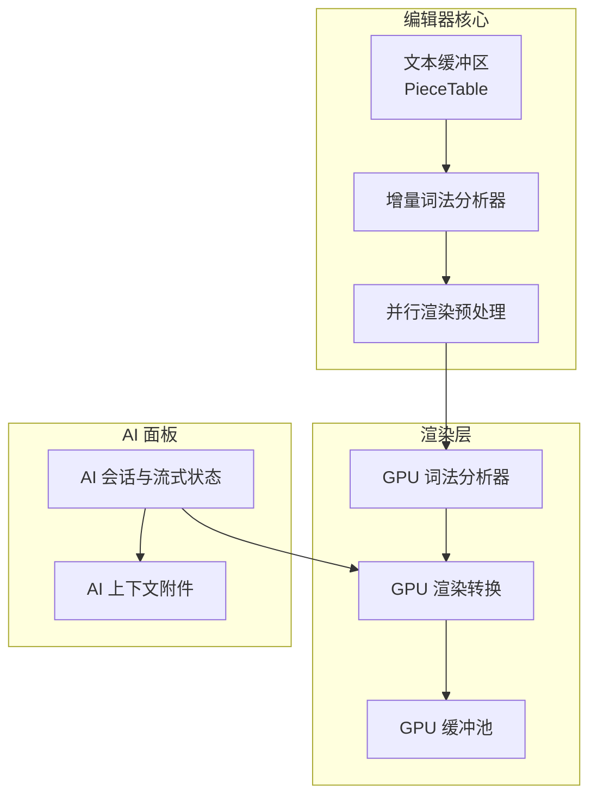
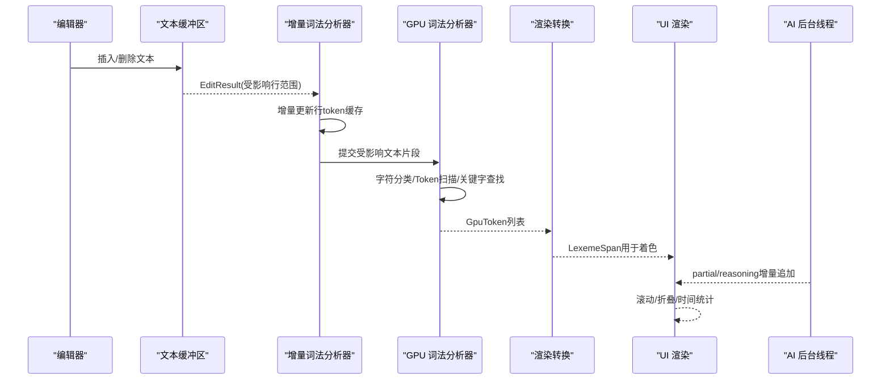
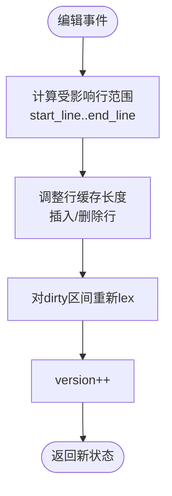
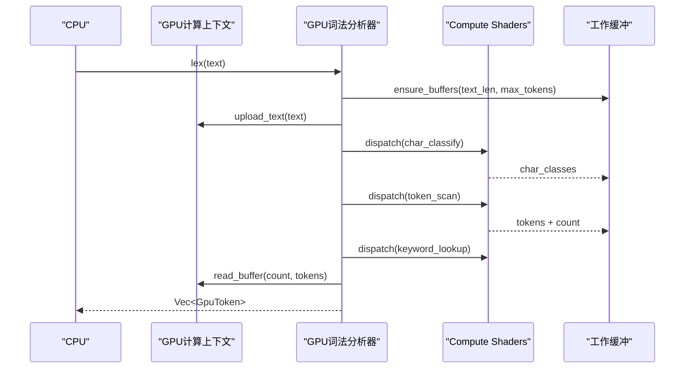
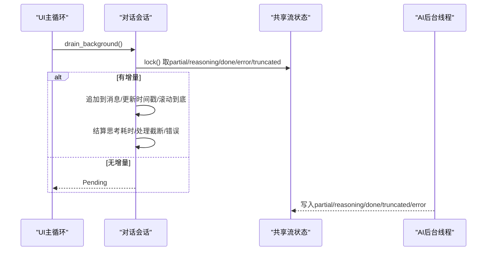
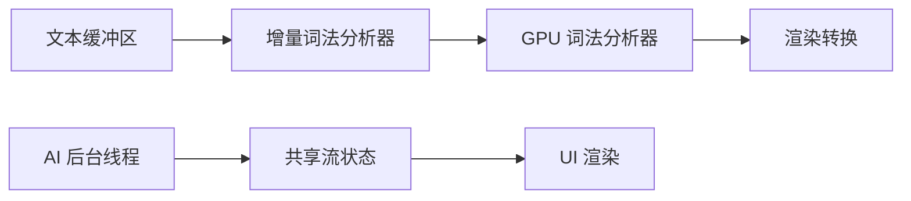

# 流式处理优化

<cite>
**本文引用的文件**
- [incremental_lexer.rs](file://crates/aether-core/src/incremental_lexer.rs)
- [text_buffer.rs](file://crates/aether-core/src/buffer/text_buffer.rs)
- [piece_table.rs](file://crates/aether-core/src/buffer/piece_table.rs)
- [render_prep.rs](file://crates/aether-core/src/render_prep.rs)
- [lexer.rs](file://crates/aether-render/src/gpu/lexer.rs)
- [render.rs](file://crates/aether-render/src/gpu/render.rs)
- [buffer.rs](file://crates/aether-render/src/gpu/buffer.rs)
- [benchmark.rs](file://crates/aether-render/src/gpu/benchmark.rs)
- [ai_panel.rs](file://crates/aether-ai-panel/src/ai_panel.rs)
- [ai_context.rs](file://crates/aether-ai-panel/src/ai_context.rs)
</cite>

## 目录
1. [简介](#简介)
2. [项目结构](#项目结构)
3. [核心组件](#核心组件)
4. [架构总览](#架构总览)
5. [详细组件分析](#详细组件分析)
6. [依赖关系分析](#依赖关系分析)
7. [性能考量](#性能考量)
8. [故障排查指南](#故障排查指南)
9. [结论](#结论)
10. [附录](#附录)

## 简介
本技术文档围绕“流式处理优化”展开，聚焦以下四个关键领域：
- 增量词法分析的流式机制：分块解析与状态保持，支撑编辑时的高频、低延迟重算。
- GPU 渲染管道的流式数据：顶点/文本数据流与着色器执行优化，提升高吞吐下的渲染帧率。
- AI 响应的流式处理：实时文本生成与 UI 同步更新，保障多会话并发时的稳定性与可观测性。
- 背压控制与内存保护：流量调节、资源复用与错误传播策略，确保系统在高负载下稳定运行。
同时提供性能监控与调试技巧，以及流式编程的最佳实践（错误传播、资源管理、并发控制）。

## 项目结构
本项目采用多 crate 分层组织，流式处理相关能力分布在 core、render、ai-panel 等模块：
- aether-core：文本缓冲区、增量词法分析、并行渲染预处理。
- aether-render：GPU 计算上下文、词法分析管线、渲染转换与缓冲池。
- aether-ai-panel：AI 会话、流式状态、后台线程轮询与 UI 同步。

图表来源
- [piece_table.rs:11-35](file://crates/aether-core/src/buffer/piece_table.rs#L11-L35)
- [incremental_lexer.rs:4-16](file://crates/aether-core/src/incremental_lexer.rs#L4-L16)
- [render_prep.rs:13-20](file://crates/aether-core/src/render_prep.rs#L13-L20)
- [lexer.rs:48-77](file://crates/aether-render/src/gpu/lexer.rs#L48-L77)
- [render.rs:7-32](file://crates/aether-render/src/gpu/render.rs#L7-L32)
- [buffer.rs:6-11](file://crates/aether-render/src/gpu/buffer.rs#L6-L11)
- [ai_panel.rs:170-187](file://crates/aether-ai-panel/src/ai_panel.rs#L170-L187)
- [ai_context.rs:1-19](file://crates/aether-ai-panel/src/ai_context.rs#L1-L19)

章节来源
- [piece_table.rs:11-35](file://crates/aether-core/src/buffer/piece_table.rs#L11-L35)
- [incremental_lexer.rs:4-16](file://crates/aether-core/src/incremental_lexer.rs#L4-L16)
- [render_prep.rs:13-20](file://crates/aether-core/src/render_prep.rs#L13-L20)
- [lexer.rs:48-77](file://crates/aether-render/src/gpu/lexer.rs#L48-L77)
- [render.rs:7-32](file://crates/aether-render/src/gpu/render.rs#L7-L32)
- [buffer.rs:6-11](file://crates/aether-render/src/gpu/buffer.rs#L6-L11)
- [ai_panel.rs:170-187](file://crates/aether-ai-panel/src/ai_panel.rs#L170-L187)
- [ai_context.rs:1-19](file://crates/aether-ai-panel/src/ai_context.rs#L1-L19)

## 核心组件
- 增量词法分析器：缓存每行 token，编辑时仅重算受影响行，支持版本失效检测与多文件管理。
- 文本缓冲区：抽象编辑操作，提供快照与行级范围计算，支撑增量更新的精确影响面。
- GPU 词法分析器：三阶段 Compute Shader（字符分类、Token 扫描、关键字查找），工作缓冲与计数器管理。
- 渲染预处理：按行并行构建 token，减少重复计算；渲染缓存避免逐帧重建。
- AI 流式状态：共享状态封装 partial/reasoning/done/error/truncated，后台线程写入，UI 轮询消费。

章节来源
- [incremental_lexer.rs:18-129](file://crates/aether-core/src/incremental_lexer.rs#L18-L129)
- [text_buffer.rs:1-49](file://crates/aether-core/src/buffer/text_buffer.rs#L1-L49)
- [lexer.rs:187-221](file://crates/aether-render/src/gpu/lexer.rs#L187-L221)
- [render_prep.rs:32-61](file://crates/aether-core/src/render_prep.rs#L32-L61)
- [ai_panel.rs:170-187](file://crates/aether-ai-panel/src/ai_panel.rs#L170-L187)

## 架构总览
整体流程从编辑事件触发，经增量词法分析得到受影响的行 token，再进入 GPU 词法分析管线进行并行处理，最终转换为渲染所需的 LexemeSpan 并输出到显示层。AI 响应通过后台线程流式写入共享状态，UI 在渲染循环中消费并更新界面。

图表来源
- [text_buffer.rs:124-171](file://crates/aether-core/src/buffer/text_buffer.rs#L124-L171)
- [incremental_lexer.rs:36-101](file://crates/aether-core/src/incremental_lexer.rs#L36-L101)
- [lexer.rs:187-221](file://crates/aether-render/src/gpu/lexer.rs#L187-L221)
- [render.rs:7-32](file://crates/aether-render/src/gpu/render.rs#L7-L32)
- [ai_panel.rs:731-800](file://crates/aether-ai-panel/src/ai_panel.rs#L731-L800)

## 详细组件分析

### 增量词法分析的流式机制（分块解析与状态保持）
- 分块解析：以行为单位缓存 token，编辑时根据 EditResult 的 start_line/end_line/line_delta 精确计算受影响区间，仅对区间内行重新 lex。
- 状态保持：使用 Vec<Vec<LexemeSpan>> 存储行级 token，O(1) 访问；维护 version 用于失效检测；管理器支持多文件切换与上限保护。
- 复杂度：单次编辑影响 k 行，时间复杂度 O(k·L)，L 为平均行长；空间复杂度 O(N·T)，N 为行数，T 为平均每行 token 数。

图表来源
- [incremental_lexer.rs:36-101](file://crates/aether-core/src/incremental_lexer.rs#L36-L101)
- [text_buffer.rs:124-171](file://crates/aether-core/src/buffer/text_buffer.rs#L124-L171)

章节来源
- [incremental_lexer.rs:18-129](file://crates/aether-core/src/incremental_lexer.rs#L18-L129)
- [text_buffer.rs:124-171](file://crates/aether-core/src/buffer/text_buffer.rs#L124-L171)

### GPU 渲染管道的流式数据处理（顶点数据流与着色器优化）
- 三阶段流水线：字符分类 → Token 扫描 → 关键字查找，均通过 Compute Shader 并行执行，分组大小为 256。
- 工作缓冲：字符分类结果、Token 列表、计数器等缓冲按需分配与复用，避免频繁创建销毁。
- 回读与转换：读取 token 数量与列表，转换为 LexemeSpan，结合语法分类决定最终 TokenKind。

图表来源
- [lexer.rs:187-221](file://crates/aether-render/src/gpu/lexer.rs#L187-L221)
- [lexer.rs:258-314](file://crates/aether-render/src/gpu/lexer.rs#L258-L314)
- [lexer.rs:321-370](file://crates/aether-render/src/gpu/lexer.rs#L321-L370)
- [lexer.rs:372-401](file://crates/aether-render/src/gpu/lexer.rs#L372-L401)

章节来源
- [lexer.rs:48-77](file://crates/aether-render/src/gpu/lexer.rs#L48-L77)
- [lexer.rs:187-221](file://crates/aether-render/src/gpu/lexer.rs#L187-L221)
- [render.rs:7-32](file://crates/aether-render/src/gpu/render.rs#L7-L32)

### AI 响应的流式处理（实时文本生成与 UI 同步）
- 共享状态：AiStreamState 包含 partial、reasoning、done、error、truncated、start_time、received_first_response。
- 后台线程：spawn_ai_stream 接收 SSE 事件，将 token/reasoning/done/truncated/error 写入共享状态。
- UI 消费：drain_background 周期性取走增量，合并到消息体，处理思考计时、截断提示、错误中断等边沿。

图表来源
- [ai_panel.rs:170-187](file://crates/aether-ai-panel/src/ai_panel.rs#L170-L187)
- [ai_panel.rs:364-459](file://crates/aether-ai-panel/src/ai_panel.rs#L364-L459)
- [ai_panel.rs:731-800](file://crates/aether-ai-panel/src/ai_panel.rs#L731-L800)

章节来源
- [ai_panel.rs:170-187](file://crates/aether-ai-panel/src/ai_panel.rs#L170-L187)
- [ai_panel.rs:364-459](file://crates/aether-ai-panel/src/ai_panel.rs#L364-L459)
- [ai_panel.rs:731-800](file://crates/aether-ai-panel/src/ai_panel.rs#L731-L800)

### 背压控制与内存保护（流量调节与内存保护）
- 增量词法：EditResult 精确限定受影响行，避免全量重算；管理器设置 MAX_INCREMENTAL_LEXER_FILES 限制缓存规模。
- GPU 缓冲：ensure_buffers 按需扩容，GpuBufferPool 复用缓冲，降低分配开销；UAV/计数器缓冲最小化。
- AI 流式：should_stop 原子标志允许中断；stream_state 使用 Mutex 保护，避免竞争；截断与错误边沿明确传递。
- 文本缓冲：PieceTable 使用内存映射与追加缓冲，零拷贝路径减少分配；行索引分块平移避免 O(N) 移动。

章节来源
- [incremental_lexer.rs:131-187](file://crates/aether-core/src/incremental_lexer.rs#L131-L187)
- [lexer.rs:258-314](file://crates/aether-render/src/gpu/lexer.rs#L258-L314)
- [render.rs:161-199](file://crates/aether-render/src/gpu/render.rs#L161-L199)
- [ai_panel.rs:731-800](file://crates/aether-ai-panel/src/ai_panel.rs#L731-L800)
- [piece_table.rs:101-114](file://crates/aether-core/src/buffer/piece_table.rs#L101-L114)

### 性能监控与调试技巧
- 基准测试：benchmark 模块统计吞吐量 MB/s、每行延迟 ms/line、加速比；可用于对比不同方案。
- 缓存命中率：IncrementalLexer::cache_stats 返回缓存行数与上次行数，辅助评估增量效果。
- 日志脱敏：sanitize_error 移除敏感头与密钥，避免泄露；错误信息区分本地失败与 API 返回。
- 可视化报告：print_report 输出表格与 Markdown，便于集成到 CI/CD。

章节来源
- [benchmark.rs:49-157](file://crates/aether-render/src/gpu/benchmark.rs#L49-L157)
- [incremental_lexer.rs:125-128](file://crates/aether-core/src/incremental_lexer.rs#L125-L128)
- [ai_panel.rs:17-100](file://crates/aether-ai-panel/src/ai_panel.rs#L17-L100)

### 流式编程最佳实践
- 错误传播：AI 流式错误区分网络/SSL/DNS 与 API 返回，统一格式化并脱敏；中断边沿保留已接收内容供抢救。
- 资源管理：GPU 缓冲池复用；增量 lexer 管理器限制缓存大小；文本缓冲使用内存映射与追加缓冲。
- 并发控制：后台线程通过 should_stop 原子标志安全退出；共享状态使用 Mutex 保护；UI 轮询消费避免阻塞。
- 状态一致性：version 字段用于失效检测；drain_background 原子取走增量，避免重复消费。

章节来源
- [ai_panel.rs:731-800](file://crates/aether-ai-panel/src/ai_panel.rs#L731-L800)
- [incremental_lexer.rs:131-187](file://crates/aether-core/src/incremental_lexer.rs#L131-L187)
- [render.rs:161-199](file://crates/aether-render/src/gpu/render.rs#L161-L199)

## 依赖关系分析
- 文本缓冲区与增量词法：TextBuffer 提供 EditResult，IncrementalLexer 基于此精确重算。
- 增量词法与 GPU 词法：IncrementalLexer 输出受影响行，GPU Lexer 并行处理文本片段。
- GPU 词法与渲染：GpuToken 转换为 LexemeSpan，结合语法分类确定最终 TokenKind。
- AI 面板与共享状态：后台线程写入 stream_state，UI 消费并更新消息与思考块。

图表来源
- [text_buffer.rs:124-171](file://crates/aether-core/src/buffer/text_buffer.rs#L124-L171)
- [incremental_lexer.rs:36-101](file://crates/aether-core/src/incremental_lexer.rs#L36-L101)
- [lexer.rs:187-221](file://crates/aether-render/src/gpu/lexer.rs#L187-L221)
- [render.rs:7-32](file://crates/aether-render/src/gpu/render.rs#L7-L32)
- [ai_panel.rs:731-800](file://crates/aether-ai-panel/src/ai_panel.rs#L731-L800)

章节来源
- [text_buffer.rs:124-171](file://crates/aether-core/src/buffer/text_buffer.rs#L124-L171)
- [incremental_lexer.rs:36-101](file://crates/aether-core/src/incremental_lexer.rs#L36-L101)
- [lexer.rs:187-221](file://crates/aether-render/src/gpu/lexer.rs#L187-L221)
- [render.rs:7-32](file://crates/aether-render/src/gpu/render.rs#L7-L32)
- [ai_panel.rs:731-800](file://crates/aether-ai-panel/src/ai_panel.rs#L731-L800)

## 性能考量
- 增量词法：行级缓存与精确影响范围，显著降低编辑重算成本；Vec 连续内存布局提升缓存命中。
- GPU 并行：Compute Shader 三阶段流水线，分组大小 256，充分利用 GPU 并行度；缓冲复用减少分配。
- 并行预处理：rayon 线程池按行并行 lex，阈值低于 100 行时回退单线程，避免小任务开销。
- 基准指标：吞吐量 MB/s、每行延迟 ms/line、最小/最大耗时，用于方案对比与回归检测。

章节来源
- [incremental_lexer.rs:18-129](file://crates/aether-core/src/incremental_lexer.rs#L18-L129)
- [lexer.rs:187-221](file://crates/aether-render/src/gpu/lexer.rs#L187-L221)
- [render_prep.rs:32-61](file://crates/aether-core/src/render_prep.rs#L32-L61)
- [benchmark.rs:49-157](file://crates/aether-render/src/gpu/benchmark.rs#L49-L157)

## 故障排查指南
- 流式中断：检查 should_stop 标志与网络连接；确认 error 字段是否包含 network/connection/dns/ssl。
- 截断处理：truncated 字段携带原因（如 max_tokens），UI 提示用户继续生成。
- 思考计时：reasoning_started_ms 与 reasoning_ms 确保思考阶段正确结算，避免“永远思考中”。
- 缓存失效：version 递增用于检测变更；cache_stats 帮助评估增量效果。
- GPU 缓冲：ensure_buffers 按需扩容；readback 前检查 token_count 是否为 0。

章节来源
- [ai_panel.rs:731-800](file://crates/aether-ai-panel/src/ai_panel.rs#L731-L800)
- [ai_panel.rs:364-459](file://crates/aether-ai-panel/src/ai_panel.rs#L364-L459)
- [incremental_lexer.rs:125-128](file://crates/aether-core/src/incremental_lexer.rs#L125-L128)
- [lexer.rs:372-401](file://crates/aether-render/src/gpu/lexer.rs#L372-L401)

## 结论
本项目通过增量词法分析、GPU 并行词法处理、AI 流式响应与严格的背压控制，实现了高效、稳定的流式处理体系。关键优化包括：
- 行级缓存与精确影响范围，降低编辑重算成本。
- GPU 三阶段流水线与缓冲复用，提升吞吐与帧率。
- 共享状态与后台线程解耦，保障 UI 流畅与多会话并发。
- 完善的错误传播、资源管理与性能监控，确保系统健壮性与可观测性。

## 附录
- 术语表：
  - EditResult：编辑操作结果，包含受影响行范围与行数变化。
  - GpuToken：GPU 生成的 token，包含起始位置、长度、类型等。
  - LexemeSpan：渲染器使用的 token 跨度，包含起止与种类。
  - AiStreamState：AI 流式共享状态，包含增量内容与完成标志。
- 参考实现路径：
  - 增量词法：[incremental_lexer.rs:36-101](file://crates/aether-core/src/incremental_lexer.rs#L36-L101)
  - GPU 词法：[lexer.rs:187-221](file://crates/aether-render/src/gpu/lexer.rs#L187-L221)
  - AI 流式：[ai_panel.rs:731-800](file://crates/aether-ai-panel/src/ai_panel.rs#L731-L800)