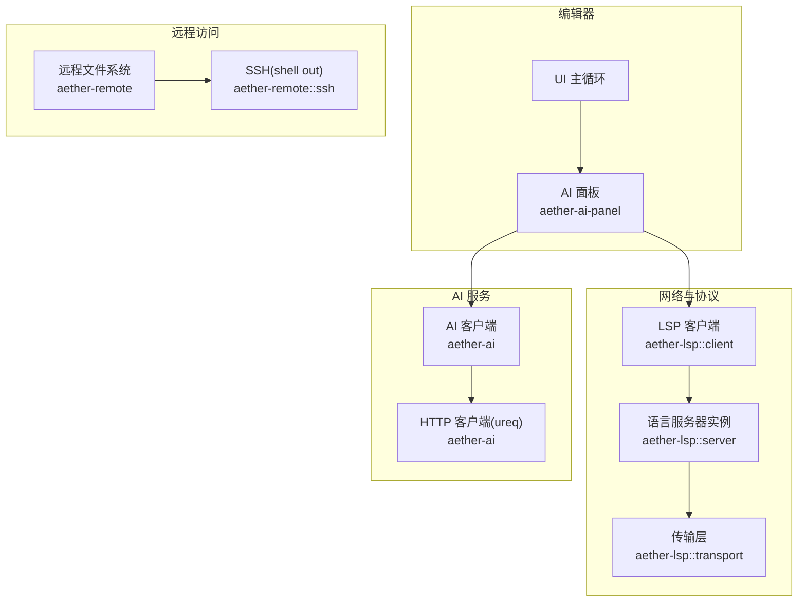
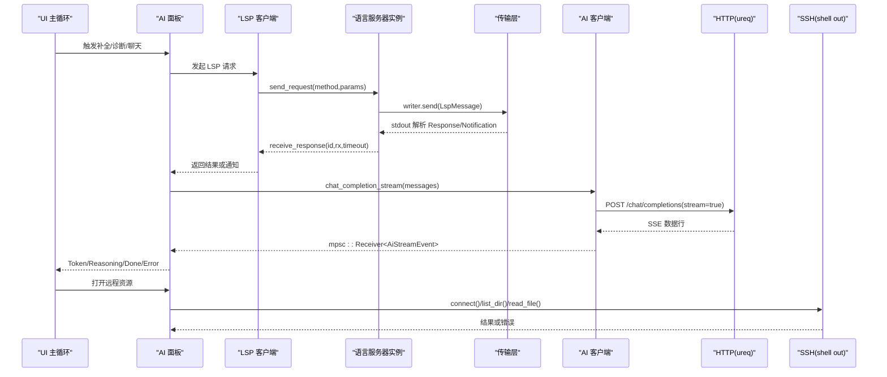
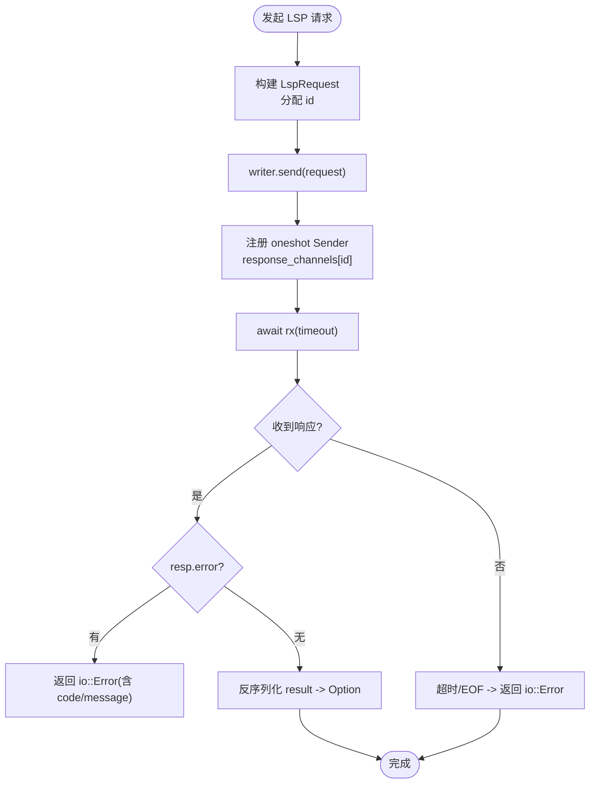
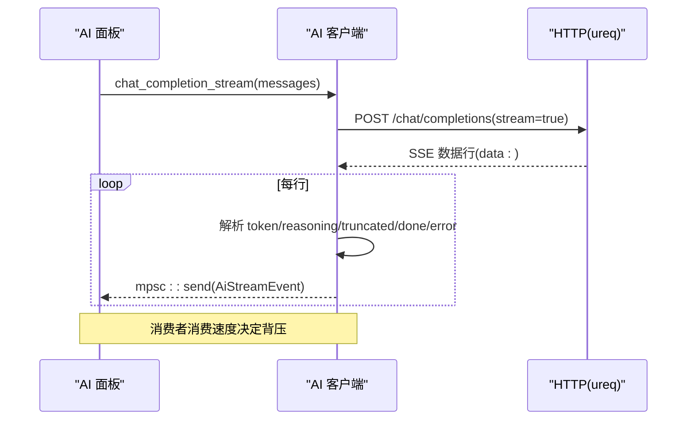
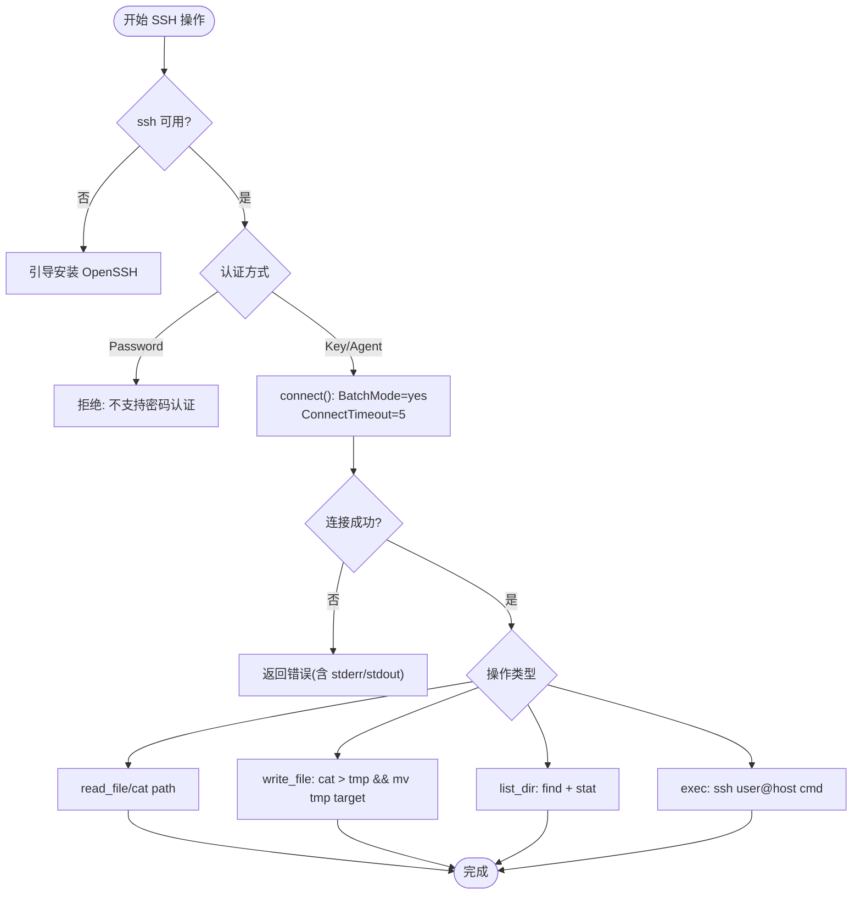
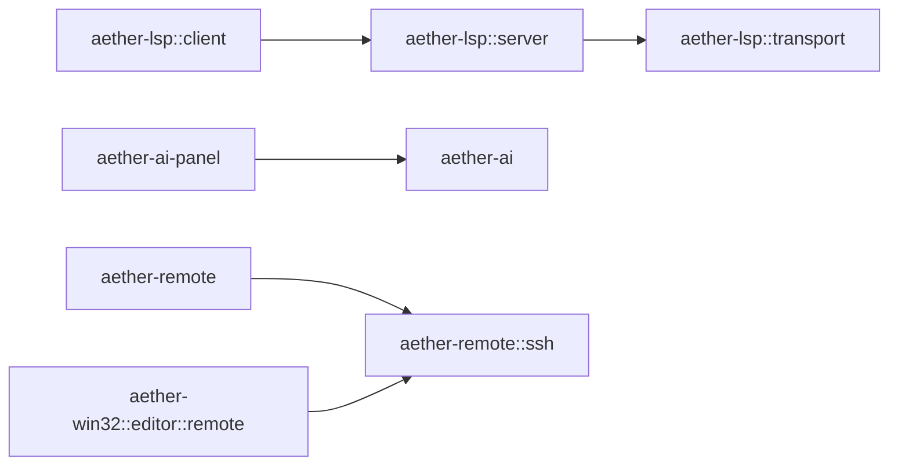

# 网络请求优化

<cite>
**本文引用的文件**
- [crates/aether-lsp/src/client.rs](file://crates/aether-lsp/src/client.rs)
- [crates/aether-lsp/src/server.rs](file://crates/aether-lsp/src/server.rs)
- [crates/aether-lsp/src/transport.rs](file://crates/aether-lsp/src/transport.rs)
- [crates/aether-ai/src/lib.rs](file://crates/aether-ai/src/lib.rs)
- [crates/aether-ai-panel/src/ai_panel.rs](file://crates/aether-ai-panel/src/ai_panel.rs)
- [crates/aether-remote/src/ssh.rs](file://crates/aether-remote/src/ssh.rs)
- [crates/aether-win32/src/editor/remote.rs](file://crates/aether-win32/src/editor/remote.rs)
</cite>

## 目录
1. [简介](#简介)
2. [项目结构](#项目结构)
3. [核心组件](#核心组件)
4. [架构总览](#架构总览)
5. [详细组件分析](#详细组件分析)
6. [依赖关系分析](#依赖关系分析)
7. [性能考量](#性能考量)
8. [故障排查指南](#故障排查指南)
9. [结论](#结论)
10. [附录](#附录)

## 简介
本技术文档聚焦于编辑器中的网络请求优化，覆盖以下关键主题：
- LSP 客户端的异步网络通信、连接管理与请求重试机制
- AI 服务调用的异步处理、流式响应与背压控制
- SSH 连接的异步管理、连接复用与超时处理
- 网络错误处理与恢复策略（异常检测、自动重连）
- 网络性能监控与分析工具使用指南
- 网络优化最佳实践（请求合并、缓存策略、带宽管理）

## 项目结构
本项目将网络相关能力按领域拆分到多个 crate：
- aether-lsp：语言服务器协议（LSP）客户端，负责进程内子进程的 stdin/stdout 异步读写、消息编解码、请求-响应匹配与超时控制。
- aether-ai：AI 服务 HTTP 客户端，封装 OpenAI 兼容接口，提供同步与流式调用，内置安全校验、限长读取与错误分类。
- aether-ai-panel：AI 面板编排层，负责流式状态管理、UI 轮询、并发限制与错误展示。
- aether-remote：远程文件系统抽象，包含 SSH shell-out 实现，通过系统 ssh 二进制执行命令，提供连接探测与原子写入等能力。
- aether-win32：Windows 平台 UI 集成，异步启动 SSH 连接并处理用户引导。

**图表来源**
- [crates/aether-lsp/src/client.rs:11-25](file://crates/aether-lsp/src/client.rs#L11-L25)
- [crates/aether-lsp/src/server.rs:23-61](file://crates/aether-lsp/src/server.rs#L23-L61)
- [crates/aether-lsp/src/transport.rs:42-72](file://crates/aether-lsp/src/transport.rs#L42-L72)
- [crates/aether-ai/src/lib.rs:259-319](file://crates/aether-ai/src/lib.rs#L259-L319)
- [crates/aether-remote/src/ssh.rs:101-164](file://crates/aether-remote/src/ssh.rs#L101-L164)

**章节来源**
- [crates/aether-lsp/src/client.rs:11-25](file://crates/aether-lsp/src/client.rs#L11-L25)
- [crates/aether-lsp/src/server.rs:23-61](file://crates/aether-lsp/src/server.rs#L23-L61)
- [crates/aether-lsp/src/transport.rs:42-72](file://crates/aether-lsp/src/transport.rs#L42-L72)
- [crates/aether-ai/src/lib.rs:259-319](file://crates/aether-ai/src/lib.rs#L259-L319)
- [crates/aether-remote/src/ssh.rs:101-164](file://crates/aether-remote/src/ssh.rs#L101-L164)

## 核心组件
- LSP 客户端管理器：维护多语言服务器实例映射、文档同步、诊断集合与事件通道；按语言路由请求。
- 语言服务器实例：生命周期管理（启动、初始化、运行、关闭），后台 reader 任务持续解析 stdout，请求-响应通过 oneshot 通道配对，支持超时。
- 传输层：基于 AsyncRead/AsyncWrite 的通用 LSP 传输，消息编码/解码、缓冲区拼装、读半流式解析。
- AI 客户端：统一 OpenAI 兼容接口，构建请求体、设置鉴权头、发送 HTTP 请求；流式响应通过 mpsc 通道推送事件；内置 SSRF/DNS 校验、响应体大小限制与安全错误展示。
- AI 面板：流式状态机、并发限制（H-17）、消息历史滑动窗口、错误分类与提示、后台结果轮询（drain_background）。
- SSH 远程文件系统：shell-out 模式调用系统 ssh，提供连接测试、原子写入、目录列举与命令执行；支持连接软状态与超时参数。

**章节来源**
- [crates/aether-lsp/src/client.rs:73-114](file://crates/aether-lsp/src/client.rs#L73-L114)
- [crates/aether-lsp/src/server.rs:63-124](file://crates/aether-lsp/src/server.rs#L63-L124)
- [crates/aether-lsp/src/transport.rs:51-72](file://crates/aether-lsp/src/transport.rs#L51-L72)
- [crates/aether-ai/src/lib.rs:259-319](file://crates/aether-ai/src/lib.rs#L259-L319)
- [crates/aether-ai-panel/src/ai_panel.rs:170-200](file://crates/aether-ai-panel/src/ai_panel.rs#L170-L200)
- [crates/aether-remote/src/ssh.rs:101-164](file://crates/aether-remote/src/ssh.rs#L101-L164)

## 架构总览
下图展示了从 UI 到后端服务的完整调用链，包括 LSP 请求、AI 流式响应与 SSH 远程操作。

**图表来源**
- [crates/aether-lsp/src/server.rs:140-200](file://crates/aether-lsp/src/server.rs#L140-L200)
- [crates/aether-lsp/src/transport.rs:66-72](file://crates/aether-lsp/src/transport.rs#L66-L72)
- [crates/aether-ai/src/lib.rs:716-722](file://crates/aether-ai/src/lib.rs#L716-L722)
- [crates/aether-remote/src/ssh.rs:130-164](file://crates/aether-remote/src/ssh.rs#L130-L164)

## 详细组件分析

### LSP 客户端异步网络通信
- 连接与生命周期
  - 通过 spawn_server 启动语言服务器进程，捕获 stdin/stdout/stderr，构造 LspWriter/LspReader。
  - 启动 stderr  draining task 避免阻塞；启动 reader_loop 常驻解析 stdout。
- 请求-响应模型
  - send_request 生成唯一 id，序列化 LspRequest，写入 writer，并将 oneshot::Sender 注册到 response_channels。
  - receive_response 等待对应 id 的响应，支持超时；若收到 error 字段则转为 io::Error；result 为 null 时返回 None。
- 传输层
  - LspTransport/LspReader/LspWriter 封装消息编码/解码，处理 Content-Length 头部与 JSON 体拼接，支持任意 AsyncRead/AsyncWrite 对。
- 重试与恢复
  - 当前实现未内置自动重试；可在上层根据 receive_response 的错误类型（如 UnexpectedEof）进行重试决策。
  - 服务器退出事件（ServerExited）由 reader_loop 发出，客户端可据此清理实例并按需重启。

**图表来源**
- [crates/aether-lsp/src/server.rs:140-200](file://crates/aether-lsp/src/server.rs#L140-L200)
- [crates/aether-lsp/src/transport.rs:66-72](file://crates/aether-lsp/src/transport.rs#L66-L72)

**章节来源**
- [crates/aether-lsp/src/server.rs:63-124](file://crates/aether-lsp/src/server.rs#L63-L124)
- [crates/aether-lsp/src/server.rs:140-200](file://crates/aether-lsp/src/server.rs#L140-L200)
- [crates/aether-lsp/src/transport.rs:51-72](file://crates/aether-lsp/src/transport.rs#L51-L72)

### AI 服务调用的异步处理与背压控制
- 流式响应
  - stream_openai_compatible 构建请求体（stream=true），发送后在后台线程逐行读取 SSE 数据，解析 token/reasoning/truncated/done/error，并通过 mpsc::Receiver 推送给调用方。
- 背压控制
  - 使用标准库 mpsc 通道，消费者（AI 面板）以合理速率 drain 事件；若消费慢，生产者会阻塞在 send，从而自然形成背压，避免内存膨胀。
- 并发限制
  - H-17：正在生成时拒绝新请求，防止无限 spawn 线程导致资源耗尽。
- 错误分类与恢复
  - AiError::is_retryable/is_permanent 区分可重试与永久错误；UI 层根据错误类型给出提示，并可触发重试流程。
- 安全与限流
  - 禁用重定向、连接/读取超时分离、响应体最大 10MB、截断错误消息至 200 字符、SSRF/DNS 校验、私有 IP 黑名单。

**图表来源**
- [crates/aether-ai/src/lib.rs:716-722](file://crates/aether-ai/src/lib.rs#L716-L722)
- [crates/aether-ai/src/lib.rs:832-920](file://crates/aether-ai/src/lib.rs#L832-L920)
- [crates/aether-ai-panel/src/ai_panel.rs:751-834](file://crates/aether-ai-panel/src/ai_panel.rs#L751-L834)

**章节来源**
- [crates/aether-ai/src/lib.rs:716-722](file://crates/aether-ai/src/lib.rs#L716-L722)
- [crates/aether-ai/src/lib.rs:832-920](file://crates/aether-ai/src/lib.rs#L832-L920)
- [crates/aether-ai-panel/src/ai_panel.rs:751-834](file://crates/aether-ai-panel/src/ai_panel.rs#L751-L834)
- [crates/aether-ai-panel/src/ai_panel.rs:1882-1915](file://crates/aether-ai-panel/src/ai_panel.rs#L1882-L1915)

### SSH 连接的异步管理与超时处理
- 连接模型
  - shell-out 模式：每次操作独立调用系统 ssh，无持久连接；connected 为软状态标志，用于跳过重复探测。
  - connect 使用 BatchMode=yes + ConnectTimeout=5 快速验证可用性，禁止密码认证（无 tty）。
- 异步与 UI
  - 编辑器侧 start_ssh_connect 异步启动连接与目录列举，不阻塞 UI；缺失 ssh.exe 时引导安装。
- 原子写入与错误处理
  - write_file 通过临时文件 + mv 实现原子替换；失败时尝试清理临时文件；所有错误携带 stdout/stderr 便于诊断。
- 安全加固
  - base_args 中 StrictHostKeyChecking=accept-new；用户名/主机名不以 '-' 开头，防止选项注入。

**图表来源**
- [crates/aether-remote/src/ssh.rs:130-164](file://crates/aether-remote/src/ssh.rs#L130-L164)
- [crates/aether-remote/src/ssh.rs:265-321](file://crates/aether-remote/src/ssh.rs#L265-L321)
- [crates/aether-win32/src/editor/remote.rs:1-27](file://crates/aether-win32/src/editor/remote.rs#L1-L27)

**章节来源**
- [crates/aether-remote/src/ssh.rs:130-164](file://crates/aether-remote/src/ssh.rs#L130-L164)
- [crates/aether-remote/src/ssh.rs:265-321](file://crates/aether-remote/src/ssh.rs#L265-L321)
- [crates/aether-win32/src/editor/remote.rs:1-27](file://crates/aether-win32/src/editor/remote.rs#L1-L27)

### 错误处理与恢复策略
- LSP
  - receive_response 将 LSP 错误码与消息包装为 io::Error；stdout EOF 表示服务器关闭，调用方可据此触发重连。
- AI
  - AiError::safe_display 提供对用户安全的错误描述；is_retryable 支持 429/500/503 的指数退避重试；is_permanent 用于配置类错误提示。
  - 流式过程中 Error 事件立即终止流，UI 层记录错误并置 done。
- SSH
  - 连接失败与命令执行失败均返回详细错误信息；write_file 失败时尝试清理临时文件，保证一致性。

**章节来源**
- [crates/aether-lsp/src/server.rs:164-200](file://crates/aether-lsp/src/server.rs#L164-L200)
- [crates/aether-ai/src/lib.rs:110-163](file://crates/aether-ai/src/lib.rs#L110-L163)
- [crates/aether-ai-panel/src/ai_panel.rs:781-834](file://crates/aether-ai-panel/src/ai_panel.rs#L781-L834)
- [crates/aether-remote/src/ssh.rs:130-164](file://crates/aether-remote/src/ssh.rs#L130-L164)

### 网络性能监控与分析工具
- LSP
  - 利用 server.rs 中的 DEFAULT_REQUEST_TIMEOUT/INITIALIZE_TIMEOUT 作为基线，结合日志统计各方法耗时分布。
  - 通过 diagnostics_for/all_diagnostics 快照诊断数量变化，评估增量同步效果。
- AI
  - 使用 test_connection_safe/list_models_safe 进行连通性与模型列表拉取测试；记录响应时间与错误率。
  - 流式场景下统计 Token 到达间隔与总量，评估吞吐与延迟。
- SSH
  - 通过 connect 的 ConnectTimeout=5 与 exec 的 stdout/stderr 输出，测量远程命令执行耗时与失败原因。

[本节为通用指导，无需具体文件引用]

## 依赖关系分析
- LSP 模块内部依赖
  - client 依赖 server（LanguageServer）与 transport（LspReader/LspWriter）。
  - server 依赖 transport 与 tokio 异步原语（mpsc、oneshot、Mutex、JoinHandle、timeout）。
- AI 模块
  - ai_panel 依赖 aether-ai 的 AiClient 与 AiStreamEvent；同时管理流式状态与 UI 轮询。
- 远程模块
  - remote 抽象出 RemoteFs trait，ssh 实现通过系统 ssh 二进制执行命令；win32 编辑器侧负责 UI 集成与异步启动。

**图表来源**
- [crates/aether-lsp/src/client.rs:11-25](file://crates/aether-lsp/src/client.rs#L11-L25)
- [crates/aether-lsp/src/server.rs:23-61](file://crates/aether-lsp/src/server.rs#L23-L61)
- [crates/aether-ai-panel/src/ai_panel.rs:1-15](file://crates/aether-ai-panel/src/ai_panel.rs#L1-L15)
- [crates/aether-remote/src/ssh.rs:101-164](file://crates/aether-remote/src/ssh.rs#L101-L164)
- [crates/aether-win32/src/editor/remote.rs:1-27](file://crates/aether-win32/src/editor/remote.rs#L1-L27)

**章节来源**
- [crates/aether-lsp/src/client.rs:11-25](file://crates/aether-lsp/src/client.rs#L11-L25)
- [crates/aether-lsp/src/server.rs:23-61](file://crates/aether-lsp/src/server.rs#L23-L61)
- [crates/aether-ai-panel/src/ai_panel.rs:1-15](file://crates/aether-ai-panel/src/ai_panel.rs#L1-L15)
- [crates/aether-remote/src/ssh.rs:101-164](file://crates/aether-remote/src/ssh.rs#L101-L164)
- [crates/aether-win32/src/editor/remote.rs:1-27](file://crates/aether-win32/src/editor/remote.rs#L1-L27)

## 性能考量
- LSP
  - 增量同步：compute_changes 仅发送差异变更，减少带宽与解析开销。
  - 请求超时：默认 30s，initialize 60s，避免长时间阻塞。
  - 诊断缓存：按 URI 聚合，避免重复计算。
- AI
  - 流式响应：SSE 逐 token 推送，降低首字延迟。
  - 响应体限制：最大 10MB，防止内存溢出。
  - 并发限制：H-17 防止过多并发请求。
- SSH
  - 原子写入：tmp+mv 避免部分写入导致的损坏。
  - 连接超时：ConnectTimeout=5 快速失败。
  - 批量命令：find + stat 一次性获取目录属性，减少往返。

[本节为通用指导，无需具体文件引用]

## 故障排查指南
- LSP 无响应
  - 检查 receive_response 是否超时；确认 reader_loop 是否存活；查看 ServerExited 事件。
- AI 流中断
  - 关注 AiStreamEvent::Error；根据 is_retryable 决定是否重试；检查网络与 API Key。
- SSH 连接失败
  - 确认 ssh.exe 存在且版本可用；检查认证方式（Key/Agent）；查看 stderr/stdout 输出定位问题。

**章节来源**
- [crates/aether-lsp/src/server.rs:164-200](file://crates/aether-lsp/src/server.rs#L164-L200)
- [crates/aether-ai/src/lib.rs:110-163](file://crates/aether-ai/src/lib.rs#L110-L163)
- [crates/aether-remote/src/ssh.rs:130-164](file://crates/aether-remote/src/ssh.rs#L130-L164)

## 结论
本项目在网络请求优化方面实现了：
- LSP 的异步请求-响应模型与超时控制，具备可扩展的重试基础。
- AI 服务的流式响应与背压控制，配合安全校验与错误分类，提升用户体验与稳定性。
- SSH 的 shell-out 模式提供轻量远程访问，具备原子写入与超时保护。
建议后续引入：
- LSP 自动重试与连接池（针对多进程场景可考虑共享 stdio 管道）。
- AI 请求合并与缓存（相同 prompt 短期缓存结果）。
- 更细粒度的带宽管理与指标上报（耗时、吞吐、错误率）。

[本节为总结性内容，无需具体文件引用]

## 附录
- 最佳实践清单
  - 请求合并：对高频短请求进行批处理（如语义令牌 delta）。
  - 缓存策略：对只读数据（模型列表、能力集）做短期缓存。
  - 带宽管理：限制响应体大小、启用压缩（若服务端支持）。
  - 监控指标：记录请求耗时、错误率、吞吐与内存占用。
  - 安全加固：HTTPS 强制、DNS 校验、私有 IP 黑名单、敏感信息脱敏。

[本节为通用指导，无需具体文件引用]