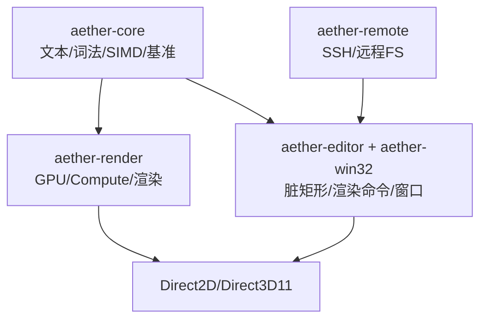
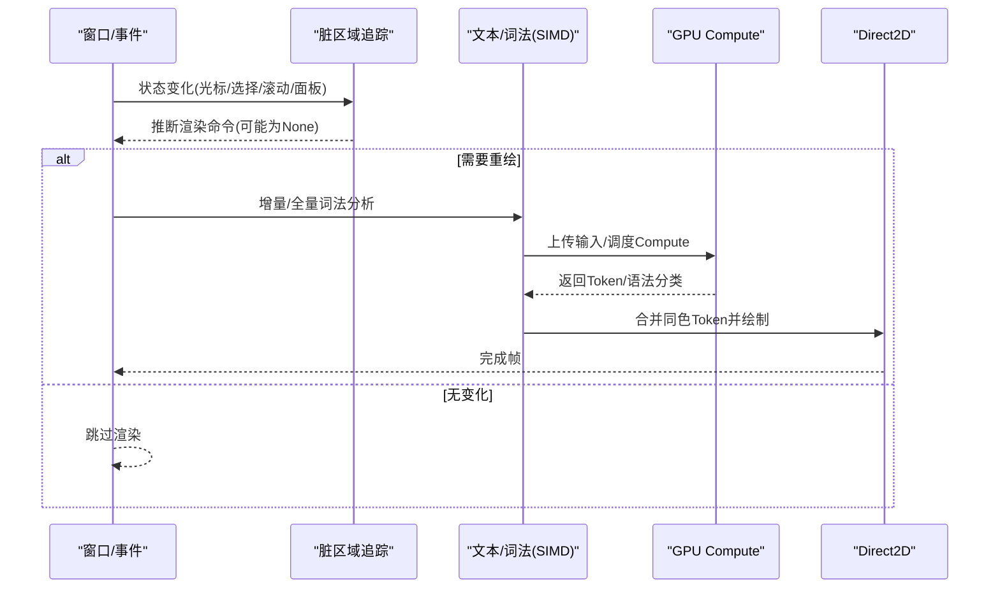
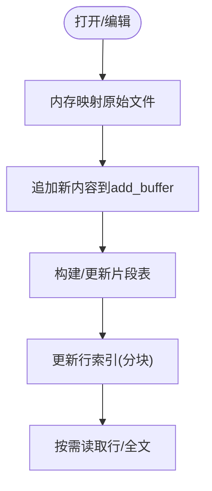
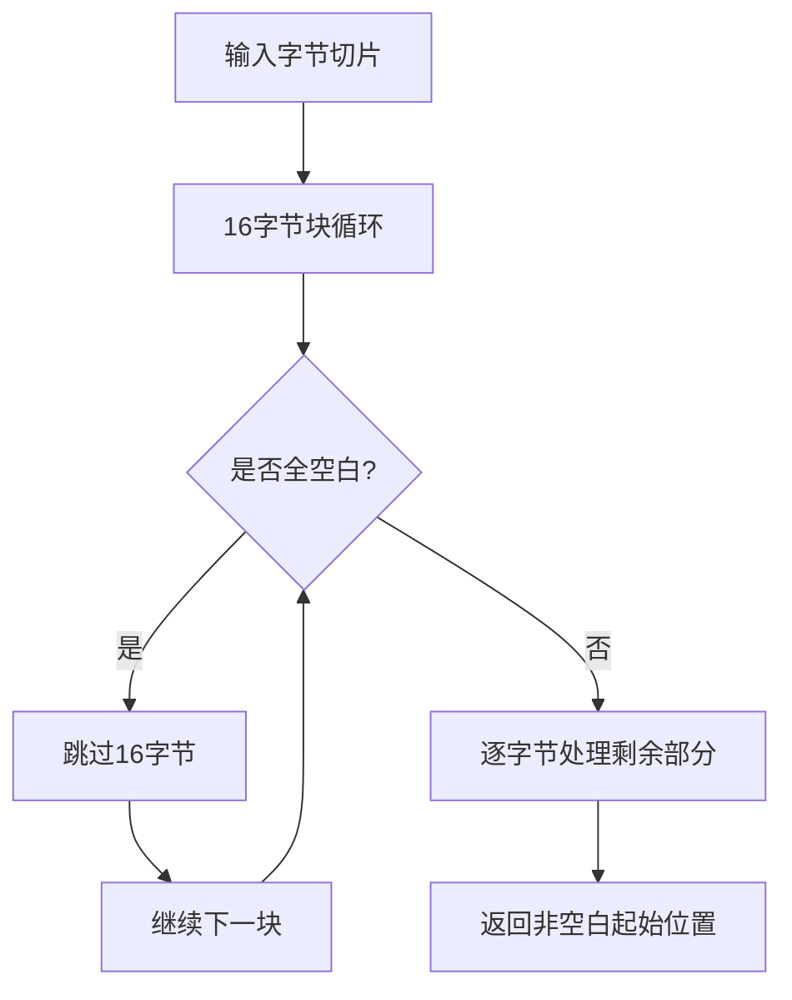
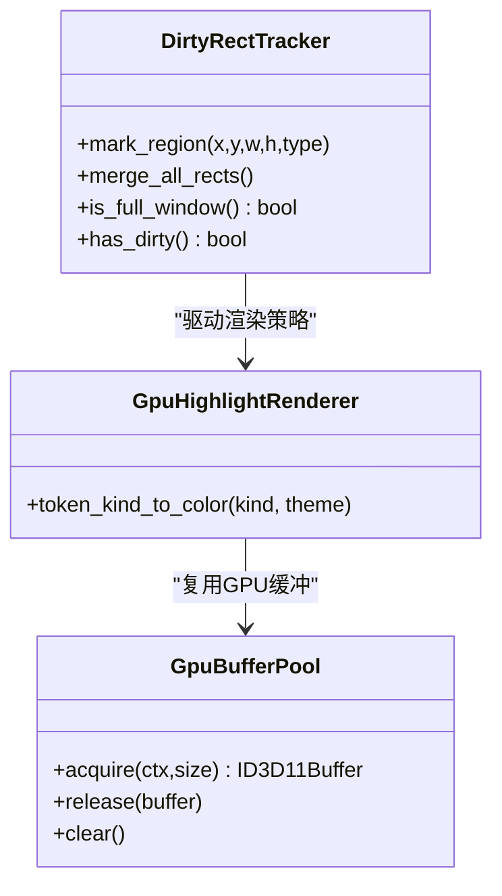
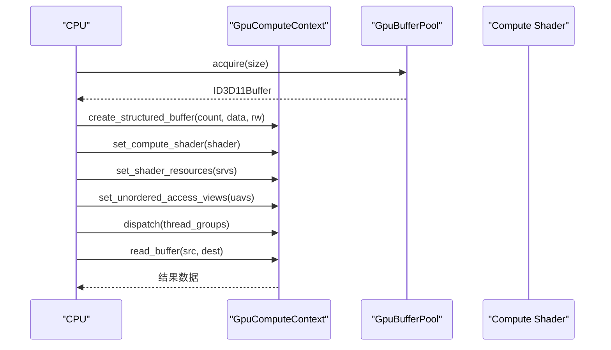
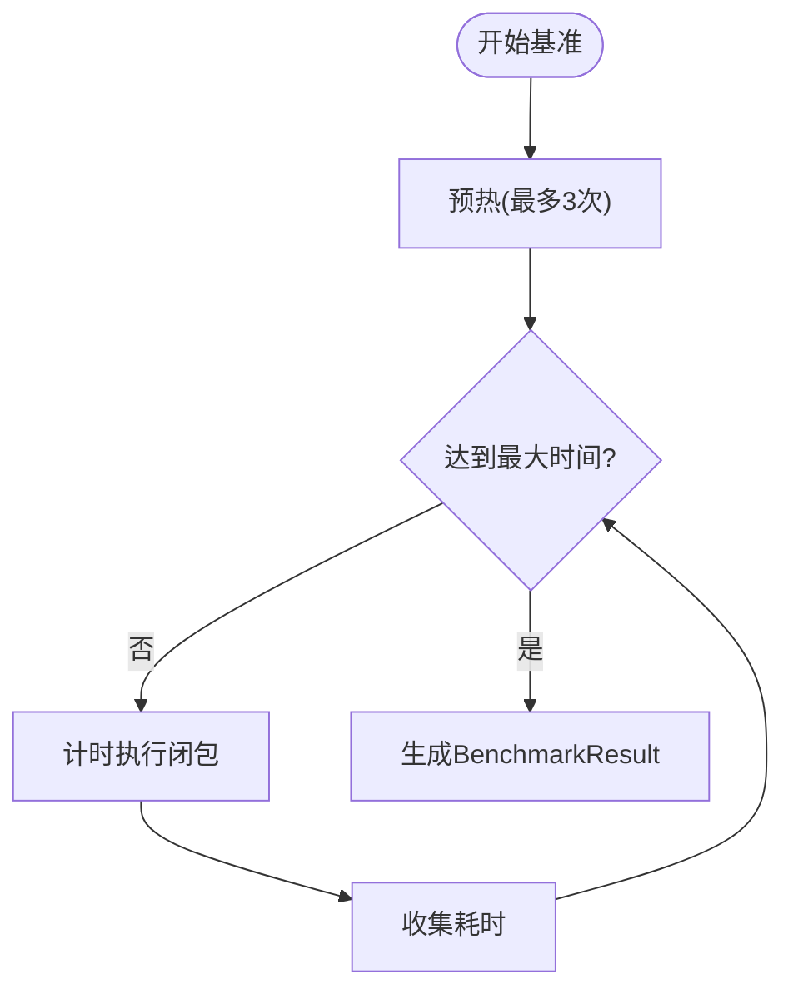
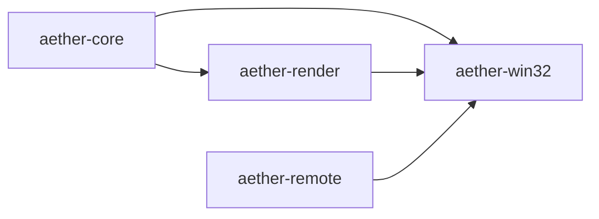

# 性能优化

<cite>
**本文引用的文件**
- [simd_utils.rs](file://crates/aether-core/src/simd_utils.rs)
- [benchmarks.rs](file://crates/aether-core/src/benchmarks.rs)
- [piece_table.rs](file://crates/aether-core/src/buffer/piece_table.rs)
- [dirty_rect.rs](file://crates/aether-editor/src/dirty_rect.rs)
- [render.rs](file://crates/aether-render/src/gpu/render.rs)
- [compute_context.rs](file://crates/aether-render/src/gpu/compute_context.rs)
- [lexer.rs](file://crates/aether-render/src/gpu/lexer.rs)
- [syntax.rs](file://crates/aether-render/src/gpu/syntax.rs)
- [mod.rs](file://crates/aether-win32/src/render/mod.rs)
- [ssh.rs](file://crates/aether-remote/src/ssh.rs)
</cite>

## 目录
1. [简介](#简介)
2. [项目结构](#项目结构)
3. [核心组件](#核心组件)
4. [架构总览](#架构总览)
5. [详细组件分析](#详细组件分析)
6. [依赖关系分析](#依赖关系分析)
7. [性能考量](#性能考量)
8. [故障排查指南](#故障排查指南)
9. [结论](#结论)
10. [附录](#附录)

## 简介
本技术文档聚焦于“牧羊人编辑器”的性能优化实践，覆盖内存管理（零拷贝、内存池、避免GC）、渲染优化（脏区域计算、批量绘制、硬件加速）、SIMD算法实现与并行处理、异步I/O模型、基准测试与监控调优方法，以及面向开发者的最佳实践与常见问题解决方案。目标是帮助读者理解并落地高性能文本编辑器的关键路径优化。

## 项目结构
本项目采用多 crate 模块化组织，围绕“核心文本处理”“渲染与GPU加速”“UI与窗口集成”“远程与网络”等职责划分：
- aether-core：文本缓冲区（PieceTable）、增量词法分析、SIMD工具、基准测试框架
- aether-render：GPU Compute Shader 管线、缓冲池、语法着色、渲染桥接
- aether-editor / aether-win32：脏矩形追踪、渲染命令推断、窗口层渲染流程
- aether-remote：远程文件系统与SSH调用（进程外）
- 其他：LSP、终端、插件、数据库等

图表来源
- [piece_table.rs:11-35](file://crates/aether-core/src/buffer/piece_table.rs#L11-L35)
- [compute_context.rs:17-36](file://crates/aether-render/src/gpu/compute_context.rs#L17-L36)
- [dirty_rect.rs:87-112](file://crates/aether-editor/src/dirty_rect.rs#L87-L112)
- [mod.rs:514-660](file://crates/aether-win32/src/render/mod.rs#L514-L660)

章节来源
- [piece_table.rs:11-35](file://crates/aether-core/src/buffer/piece_table.rs#L11-L35)
- [compute_context.rs:17-36](file://crates/aether-render/src/gpu/compute_context.rs#L17-L36)
- [dirty_rect.rs:87-112](file://crates/aether-editor/src/dirty_rect.rs#L87-L112)
- [mod.rs:514-660](file://crates/aether-win32/src/render/mod.rs#L514-L660)

## 核心组件
- 零拷贝文本缓冲区：基于 PieceTable 的内存映射与片段表，支持大文件O(1)插入/删除与快照共享
- SIMD 文本处理：换行计数、字节查找、空白跳过、字符分类等使用 AVX2/SSE2 运行时分派
- GPU 加速词法与高亮：Compute Shader + 结构化缓冲区 + 双缓冲 + GPU缓冲池
- 脏区域与批量绘制：按区域类型标记、合并重叠、多矩形裁剪、无变化时跳过渲染
- 异步 I/O：通过系统OpenSSH进程执行远程操作，结合本地缓存与容量控制
- 基准与监控：统一基准框架、GPU侧吞吐统计、结果报告

章节来源
- [piece_table.rs:11-35](file://crates/aether-core/src/buffer/piece_table.rs#L11-L35)
- [simd_utils.rs:1-7](file://crates/aether-core/src/simd_utils.rs#L1-L7)
- [render.rs:161-219](file://crates/aether-render/src/gpu/render.rs#L161-L219)
- [dirty_rect.rs:87-112](file://crates/aether-editor/src/dirty_rect.rs#L87-L112)
- [ssh.rs:1-32](file://crates/aether-remote/src/ssh.rs#L1-L32)
- [benchmarks.rs:55-87](file://crates/aether-core/src/benchmarks.rs#L55-L87)

## 架构总览
整体数据流从文本输入到渲染输出，关键路径如下：
- 文本加载与编辑：PieceTable 使用内存映射原始文件，新增内容追加至只写缓冲区；行索引分块维护，减少平移成本
- 词法分析：增量Lexer对变更行进行局部更新；SIMD工具加速基础扫描
- GPU 加速：将Token数据上传至GPU，Compute Shader并行生成token与语法分类，CPU读取UAV结果并转换为LexemeSpan
- 渲染：脏区域追踪决定最小重绘范围；合并相邻同色Token减少DrawText调用；多矩形裁剪降低绘制面积

图表来源
- [dirty_rect.rs:368-426](file://crates/aether-editor/src/dirty_rect.rs#L368-L426)
- [benchmarks.rs:269-334](file://crates/aether-core/src/benchmarks.rs#L269-L334)
- [lexer.rs:386-429](file://crates/aether-render/src/gpu/lexer.rs#L386-L429)
- [render.rs:74-106](file://crates/aether-render/src/gpu/render.rs#L74-L106)

## 详细组件分析

### 内存管理与零拷贝
- 内存映射与片段表：原始文件以内存映射形式只读共享，新增内容追加至独立缓冲区；片段表记录各段来源与偏移，避免整份复制
- 行索引分块：两级分块结构，编辑时仅调整块级基址与块内相对偏移，显著降低平移开销
- 快照与共享：Arc<Mmap>在克隆时共享映射，避免重复分配
- 复杂度要点：插入/删除近似O(1)，行定位与读取受分块大小影响，合理设置LINE_BLOCK_SIZE可平衡内存与速度

图表来源
- [piece_table.rs:11-35](file://crates/aether-core/src/buffer/piece_table.rs#L11-L35)
- [piece_table.rs:68-114](file://crates/aether-core/src/buffer/piece_table.rs#L68-L114)

章节来源
- [piece_table.rs:11-35](file://crates/aether-core/src/buffer/piece_table.rs#L11-L35)
- [piece_table.rs:68-114](file://crates/aether-core/src/buffer/piece_table.rs#L68-L114)

### SIMD 算法与并行处理
- 换行计数与字节查找：委托给bytecount/memchr，利用运行时自动选择的AVX2/SSE2指令集，比手写SWAR更快
- 空白跳过：16字节SWAR批量检测，配合chunks_exact消除边界检查，利于编译器向量化
- 字符分类：快速判断字母/数字/空白，用于词法阶段预处理
- 适用场景：大文件扫描、行长度计算、关键字前缀匹配等

图表来源
- [simd_utils.rs:20-55](file://crates/aether-core/src/simd_utils.rs#L20-L55)

章节来源
- [simd_utils.rs:1-7](file://crates/aether-core/src/simd_utils.rs#L1-L7)
- [simd_utils.rs:20-55](file://crates/aether-core/src/simd_utils.rs#L20-L55)
- [simd_utils.rs:65-79](file://crates/aether-core/src/simd_utils.rs#L65-L79)

### 渲染优化：脏区域、批量绘制与硬件加速
- 脏区域追踪：按区域类型标记，合并重叠矩形，超过阈值降级为全窗口重绘；无变化时直接跳过渲染
- 批量绘制：合并相邻同色Token，减少DrawText调用次数；使用多矩形裁剪避免单一包围盒膨胀
- 硬件加速：GPU Compute Shader 并行生成Token与语法分类；CPU/GPU双缓冲避免等待；GPU缓冲池复用ID3D11Buffer减少分配

图表来源
- [dirty_rect.rs:87-112](file://crates/aether-editor/src/dirty_rect.rs#L87-L112)
- [render.rs:74-126](file://crates/aether-render/src/gpu/render.rs#L74-L126)
- [render.rs:161-219](file://crates/aether-render/src/gpu/render.rs#L161-L219)

章节来源
- [dirty_rect.rs:87-112](file://crates/aether-editor/src/dirty_rect.rs#L87-L112)
- [dirty_rect.rs:368-426](file://crates/aether-editor/src/dirty_rect.rs#L368-L426)
- [render.rs:74-126](file://crates/aether-render/src/gpu/render.rs#L74-L126)
- [render.rs:161-219](file://crates/aether-render/src/gpu/render.rs#L161-L219)
- [mod.rs:514-660](file://crates/aether-win32/src/render/mod.rs#L514-L660)

### GPU Compute 管线与缓冲管理
- 上下文与资源：封装D3D11设备/上下文，创建Compute Shader、结构化缓冲区与UAV
- 调度与回读：Dispatch分发线程组，使用Staging Buffer异步回读结果
- 缓冲池：GpuBufferPool维护可用与在用缓冲列表，减少频繁分配/释放

图表来源
- [compute_context.rs:116-200](file://crates/aether-render/src/gpu/compute_context.rs#L116-L200)
- [compute_context.rs:232-298](file://crates/aether-render/src/gpu/compute_context.rs#L232-L298)
- [render.rs:161-219](file://crates/aether-render/src/gpu/render.rs#L161-L219)

章节来源
- [compute_context.rs:17-36](file://crates/aether-render/src/gpu/compute_context.rs#L17-L36)
- [compute_context.rs:116-200](file://crates/aether-render/src/gpu/compute_context.rs#L116-L200)
- [compute_context.rs:232-298](file://crates/aether-render/src/gpu/compute_context.rs#L232-L298)
- [render.rs:161-219](file://crates/aether-render/src/gpu/render.rs#L161-L219)

### 异步 I/O 模型
- SSH远程：通过系统OpenSSH进程执行命令，避免引入第三方SSH库；提供可用性检测与引导下载链接
- 工作区缓存：远程文件拉取到本地缓存，写入前检查缓存大小并清理旧文件；写入后TOCTOU校验确保路径安全
- 并发与阻塞：进程间通信为主，适合批处理任务；注意超时与错误传播

章节来源
- [ssh.rs:1-32](file://crates/aether-remote/src/ssh.rs#L1-L32)
- [workspace.rs:65-91](file://crates/aether-remote/src/workspace.rs#L65-L91)

### 基准测试与分析方法
- 统一基准框架：run_benchmark支持迭代次数与最大时间限制，预热与统计平均/最小/最大耗时及吞吐量
- 专项测试：PieceTable加载/插入/删除/读取/快照/编辑吞吐；SIMD换行计数/字节查找/空白跳过；增量Lexer对比全量分析
- GPU侧吞吐：benchmark模块统计文件大小、迭代次数、平均耗时、吞吐Mbps与每行延迟

图表来源
- [benchmarks.rs:55-87](file://crates/aether-core/src/benchmarks.rs#L55-L87)
- [benchmarks.rs:399-443](file://crates/aether-core/src/benchmarks.rs#L399-L443)
- [benchmark.rs:49-91](file://crates/aether-render/src/gpu/benchmark.rs#L49-L91)

章节来源
- [benchmarks.rs:55-87](file://crates/aether-core/src/benchmarks.rs#L55-L87)
- [benchmarks.rs:108-228](file://crates/aether-core/src/benchmarks.rs#L108-L228)
- [benchmarks.rs:234-334](file://crates/aether-core/src/benchmarks.rs#L234-L334)
- [benchmarks.rs:399-443](file://crates/aether-core/src/benchmarks.rs#L399-L443)
- [benchmark.rs:49-91](file://crates/aether-render/src/gpu/benchmark.rs#L49-L91)

## 依赖关系分析
- aether-core 被 aether-render 与 UI 层引用，提供文本与词法能力
- aether-render 依赖 Direct3D11 与主题/语法表，产出LexemeSpan供渲染
- aether-editor 与 aether-win32 协作实现脏区域与渲染命令推断，驱动实际绘制
- aether-remote 通过系统进程与本地缓存交互，为编辑器提供远程能力

图表来源
- [benchmarks.rs:1-10](file://crates/aether-core/src/benchmarks.rs#L1-L10)
- [render.rs:1-6](file://crates/aether-render/src/gpu/render.rs#L1-L6)
- [mod.rs:514-660](file://crates/aether-win32/src/render/mod.rs#L514-L660)

章节来源
- [benchmarks.rs:1-10](file://crates/aether-core/src/benchmarks.rs#L1-L10)
- [render.rs:1-6](file://crates/aether-render/src/gpu/render.rs#L1-L6)
- [mod.rs:514-660](file://crates/aether-win32/src/render/mod.rs#L514-L660)

## 性能考量
- 内存管理
  - 优先使用内存映射与片段表，避免大文件整份拷贝
  - 使用GPU缓冲池复用ID3D11Buffer，减少分配/释放开销
  - 双缓冲隔离CPU/GPU读写，避免同步等待
- 渲染优化
  - 精确脏区域标记与合并，必要时降级为全窗口重绘
  - 合并相邻同色Token，减少绘制调用
  - 多矩形裁剪避免包围盒膨胀导致的过度绘制
- SIMD与并行
  - 使用成熟库（bytecount/memchr）获取最优向量指令
  - 保持数据连续与对齐，便于编译器向量化
  - 将大规模数据处理卸载到GPU Compute Shader
- 异步I/O
  - 远程操作通过进程外执行，避免阻塞主线程
  - 本地缓存加容量控制与安全校验，防止无限增长与越界写入
- 基准与监控
  - 使用统一基准框架评估不同路径性能
  - 关注平均/最小/最大耗时与吞吐，识别异常波动
  - 结合GPU侧吞吐指标评估Compute Shader效率

[本节为通用指导，不直接分析具体文件]

## 故障排查指南
- 渲染卡顿或闪烁
  - 检查脏区域是否过多导致频繁合并/降级；确认无状态变化时是否返回None跳过渲染
  - 验证多矩形裁剪是否正确应用，避免单一包围盒过大
- GPU性能瓶颈
  - 检查Compute Shader调度参数与UAV绑定是否正确
  - 确认GPU缓冲池是否有效复用，避免频繁创建/销毁
- 文本编辑性能下降
  - 观察PieceTable碎片数量与行索引重建频率，适当调整合并阈值
  - 使用SIMD工具函数替换低效标量扫描
- 远程操作失败
  - 确认系统已安装OpenSSH并在PATH中；根据引导提示安装
  - 检查缓存目录权限与空间，避免写入失败

章节来源
- [dirty_rect.rs:368-426](file://crates/aether-editor/src/dirty_rect.rs#L368-L426)
- [mod.rs:514-660](file://crates/aether-win32/src/render/mod.rs#L514-L660)
- [compute_context.rs:232-298](file://crates/aether-render/src/gpu/compute_context.rs#L232-L298)
- [ssh.rs:1-32](file://crates/aether-remote/src/ssh.rs#L1-L32)

## 结论
本项目在文本处理、渲染与GPU加速方面形成了完整的性能优化体系：通过零拷贝与内存池降低内存压力，借助脏区域与批量绘制提升渲染效率，利用SIMD与Compute Shader实现大规模数据并行处理，并以完善的基准测试与监控手段持续验证优化效果。遵循本文档的实践与原则，可在大型代码库与复杂UI场景下获得稳定流畅的用户体验。

[本节为总结性内容，不直接分析具体文件]

## 附录
- 常用优化清单
  - 使用内存映射与片段表处理大文件
  - 用GPU缓冲池与双缓冲减少分配与同步
  - 精确标记脏区域并合并，必要时降级为全窗口重绘
  - 合并相邻同色Token以减少绘制调用
  - 使用SIMD库进行高频扫描与分类
  - 远程操作通过进程外执行并加入缓存控制
  - 建立基准测试套件，持续跟踪性能回归
- 参考实现路径
  - 零拷贝与片段表：[piece_table.rs:11-35](file://crates/aether-core/src/buffer/piece_table.rs#L11-L35)
  - SIMD工具：[simd_utils.rs:1-7](file://crates/aether-core/src/simd_utils.rs#L1-L7)
  - GPU缓冲池：[render.rs:161-219](file://crates/aether-render/src/gpu/render.rs#L161-L219)
  - 脏区域与渲染命令：[dirty_rect.rs:87-112](file://crates/aether-editor/src/dirty_rect.rs#L87-L112), [dirty_rect.rs:368-426](file://crates/aether-editor/src/dirty_rect.rs#L368-L426)
  - 基准框架：[benchmarks.rs:55-87](file://crates/aether-core/src/benchmarks.rs#L55-L87)

[本节为补充信息，不直接分析具体文件]