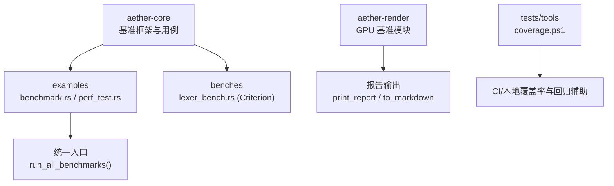
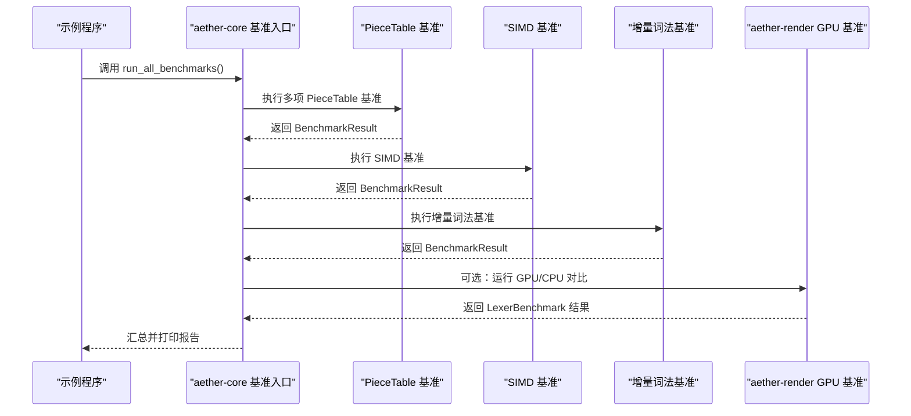
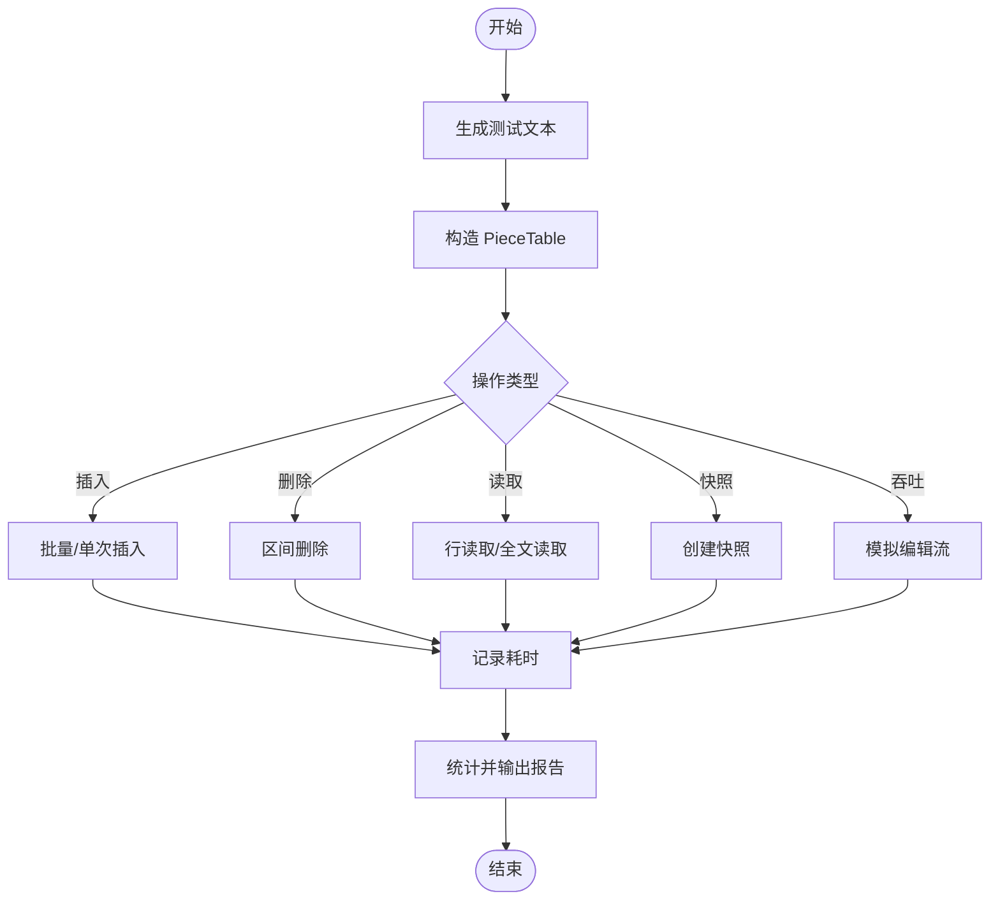
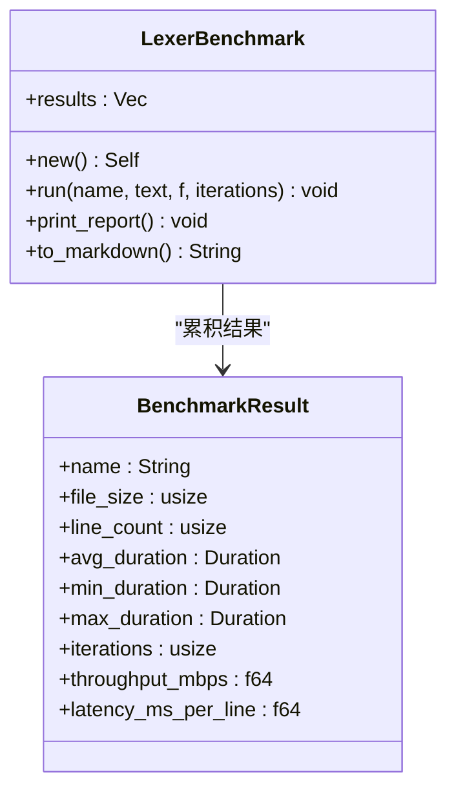
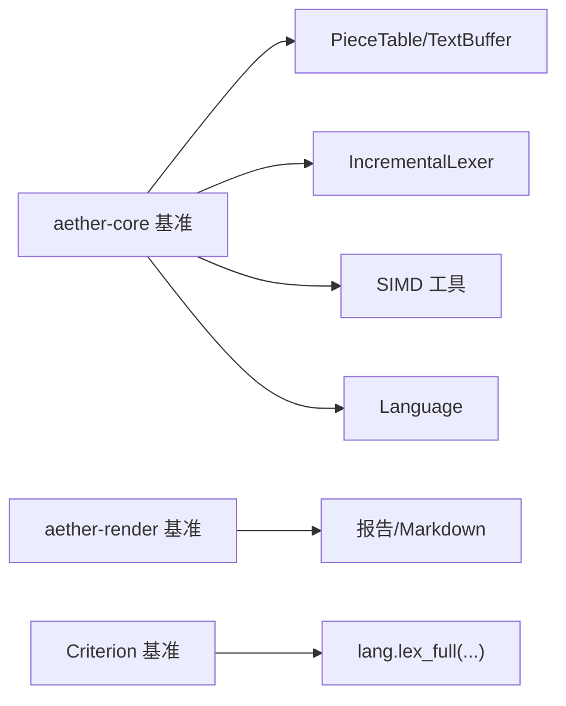

# 性能基准测试

<cite>
**本文引用的文件**
- [crates/aether-core/src/benchmarks.rs](file://crates/aether-core/src/benchmarks.rs)
- [crates/aether-core/examples/benchmark.rs](file://crates/aether-core/examples/benchmark.rs)
- [crates/aether-core/examples/perf_test.rs](file://crates/aether-core/examples/perf_test.rs)
- [crates/aether-core/benches/lexer_bench.rs](file://crates/aether-core/benches/lexer_bench.rs)
- [crates/aether-core/Cargo.toml](file://crates/aether-core/Cargo.toml)
- [crates/aether-render/src/gpu/benchmark.rs](file://crates/aether-render/src/gpu/benchmark.rs)
- [tests/tools/coverage.ps1](file://tests/tools/coverage.ps1)
- [tests/run_tests.ps1](file://tests/run_tests.ps1)
</cite>

## 目录
1. [简介](#简介)
2. [项目结构](#项目结构)
3. [核心组件](#核心组件)
4. [架构总览](#架构总览)
5. [详细组件分析](#详细组件分析)
6. [依赖关系分析](#依赖关系分析)
7. [性能考量](#性能考量)
8. [故障排查指南](#故障排查指南)
9. [结论](#结论)
10. [附录](#附录)

## 简介
本技术文档面向“牧羊人编辑器”的性能基准测试体系，系统性说明框架设计、用例编写与结果统计方法，覆盖文本编辑（PieceTable）、渲染/词法分析（GPU/CPU）、SIMD 加速等关键路径的基准场景。文档同时定义并解释吞吐量、延迟和资源利用率等指标的计算方式，给出回归检测思路与自动化流程建议，并提供 profiling 与监控工具使用指南，帮助开发者进行性能优化与问题诊断。

## 项目结构
仓库中与性能基准测试直接相关的代码主要分布在以下位置：
- aether-core：核心文本缓冲与增量词法分析的基准实现与统一入口
- aether-render：GPU/CPU 词法分析对比的基准模块
- benches：基于 Criterion 的独立基准套件（lexer）
- examples：可执行示例，用于一键运行全部基准
- tests/tools：覆盖率与部分测试辅助脚本（可用于 CI 集成）

图表来源
- [crates/aether-core/src/benchmarks.rs:399-443](file://crates/aether-core/src/benchmarks.rs#L399-L443)
- [crates/aether-core/examples/benchmark.rs:1-18](file://crates/aether-core/examples/benchmark.rs#L1-L18)
- [crates/aether-core/examples/perf_test.rs:1-18](file://crates/aether-core/examples/perf_test.rs#L1-L18)
- [crates/aether-core/benches/lexer_bench.rs:136-162](file://crates/aether-core/benches/lexer_bench.rs#L136-L162)
- [crates/aether-render/src/gpu/benchmark.rs:94-157](file://crates/aether-render/src/gpu/benchmark.rs#L94-L157)
- [tests/tools/coverage.ps1:30-55](file://tests/tools/coverage.ps1#L30-L55)

章节来源
- [crates/aether-core/src/benchmarks.rs:399-443](file://crates/aether-core/src/benchmarks.rs#L399-L443)
- [crates/aether-core/examples/benchmark.rs:1-18](file://crates/aether-core/examples/benchmark.rs#L1-L18)
- [crates/aether-core/examples/perf_test.rs:1-18](file://crates/aether-core/examples/perf_test.rs#L1-L18)
- [crates/aether-core/benches/lexer_bench.rs:136-162](file://crates/aether-core/benches/lexer_bench.rs#L136-L162)
- [crates/aether-render/src/gpu/benchmark.rs:94-157](file://crates/aether-render/src/gpu/benchmark.rs#L94-L157)
- [tests/tools/coverage.ps1:30-55](file://tests/tools/coverage.ps1#L30-L55)

## 核心组件
- 基准运行器与结果模型（aether-core）
  - 提供带最大时间限制的迭代运行器，自动预热、计时、统计平均/最小/最大耗时与吞吐量。
  - 统一的 BenchmarkResult 结构与报告格式化输出。
- 文本编辑基准（aether-core）
  - 覆盖 PieceTable 加载、文件加载、插入、删除、行读取、全文读取、快照创建、编辑吞吐等场景。
- SIMD 加速基准（aether-core）
  - 针对换行符计数、字节查找、空白跳过等热点路径进行标量 vs SIMD 对比。
- 增量词法分析基准（aether-core）
  - 全量分析与增量更新对比，评估编辑后的重算开销。
- GPU/CPU 词法分析对比（aether-render）
  - 提供 LexerBenchmark 框架，支持多方案对比、MB/s 吞吐、ms/行延迟、Markdown 报告与加速比计算。
- Criterion 基准（aether-core/benches）
  - 以语言样本驱动 lexer 全量分析，支持按输入大小设置 Throughput 与 HTML 报告。

章节来源
- [crates/aether-core/src/benchmarks.rs:11-87](file://crates/aether-core/src/benchmarks.rs#L11-L87)
- [crates/aether-core/src/benchmarks.rs:108-228](file://crates/aether-core/src/benchmarks.rs#L108-L228)
- [crates/aether-core/src/benchmarks.rs:234-334](file://crates/aether-core/src/benchmarks.rs#L234-L334)
- [crates/aether-render/src/gpu/benchmark.rs:1-157](file://crates/aether-render/src/gpu/benchmark.rs#L1-L157)
- [crates/aether-core/benches/lexer_bench.rs:136-162](file://crates/aether-core/benches/lexer_bench.rs#L136-L162)

## 架构总览
整体流程由示例程序调用统一入口 run_all_benchmarks，依次执行各子基准；每个子基准内部通过通用运行器收集多次迭代的耗时，最终汇总为结构化结果并打印报告。GPU/CPU 对比模块提供独立的基准封装，便于扩展新的词法方案。

图表来源
- [crates/aether-core/examples/benchmark.rs:1-18](file://crates/aether-core/examples/benchmark.rs#L1-L18)
- [crates/aether-core/src/benchmarks.rs:399-443](file://crates/aether-core/src/benchmarks.rs#L399-L443)
- [crates/aether-render/src/gpu/benchmark.rs:94-157](file://crates/aether-render/src/gpu/benchmark.rs#L94-L157)

## 详细组件分析

### 文本编辑（PieceTable）基准
- 目标：评估大文件加载、随机插入/删除、行读取、全文读取、快照创建与编辑吞吐等典型编辑路径。
- 数据生成：通过统一函数生成固定行数与行长度的文本，保证可重复性。
- 运行策略：每次基准均进行若干次预热，正式测试中限制总时长，避免长时间阻塞。
- 指标：平均/最小/最大耗时、吞吐量（ops/s），以及针对特定场景的行级或块级吞吐。

图表来源
- [crates/aether-core/src/benchmarks.rs:108-228](file://crates/aether-core/src/benchmarks.rs#L108-L228)
- [crates/aether-core/src/benchmarks.rs:89-102](file://crates/aether-core/src/benchmarks.rs#L89-L102)

章节来源
- [crates/aether-core/src/benchmarks.rs:108-228](file://crates/aether-core/src/benchmarks.rs#L108-L228)

### SIMD 加速基准
- 目标：验证 SIMD 在换行符计数、字节查找、空白跳过等热点路径上的加速效果。
- 方法：对相同输入分别调用 SIMD 与标量实现（或在不同基准中对比），记录耗时并比较。
- 指标：平均/最小/最大耗时、吞吐量（ops/s）。

章节来源
- [crates/aether-core/src/benchmarks.rs:234-263](file://crates/aether-core/src/benchmarks.rs#L234-L263)

### 增量词法分析基准
- 目标：对比全量分析与增量更新的性能差异，评估编辑后局部重算的收益。
- 方法：先全量分析基线文本，再模拟单行插入，调用增量更新接口，记录耗时。
- 指标：平均/最小/最大耗时、吞吐量（ops/s），并可结合行规模换算 ms/行。

章节来源
- [crates/aether-core/src/benchmarks.rs:269-334](file://crates/aether-core/src/benchmarks.rs#L269-L334)

### GPU/CPU 词法分析对比基准
- 目标：在同一份测试文本上，对比 CPU 手写 lexer、GPU 加速方案等的吞吐与延迟。
- 能力：
  - 多次迭代计时，计算平均/最小/最大耗时。
  - 计算 MB/s 吞吐与 ms/行延迟。
  - 输出表格报告与 Markdown 报告，并计算相对基线的加速比。
- 数据：内置 Rust/JS/JSON 等样例生成器，便于快速构造不同规模与结构的输入。

图表来源
- [crates/aether-render/src/gpu/benchmark.rs:1-157](file://crates/aether-render/src/gpu/benchmark.rs#L1-L157)

章节来源
- [crates/aether-render/src/gpu/benchmark.rs:1-157](file://crates/aether-render/src/gpu/benchmark.rs#L1-L157)

### Criterion 基准（lexer）
- 目标：以标准库 Criterion 框架对多种语言的 lexer 进行稳定、可复现的基准测试。
- 特点：
  - 为每种语言准备代表性代码片段。
  - 使用 Throughput::Bytes 标注输入规模，便于横向对比。
  - 启用 HTML 报告，便于可视化趋势与回归分析。

章节来源
- [crates/aether-core/benches/lexer_bench.rs:136-162](file://crates/aether-core/benches/lexer_bench.rs#L136-L162)
- [crates/aether-core/Cargo.toml:15-22](file://crates/aether-core/Cargo.toml#L15-L22)

## 依赖关系分析
- aether-core 基准模块依赖：
  - 文本缓冲（PieceTable、TextBuffer）
  - 增量词法分析器（IncrementalLexer）
  - SIMD 工具（count_newlines_simd、find_byte_simd、skip_whitespace_simd）
  - 语言枚举（Language）
- aether-render 基准模块：
  - 独立于 core，聚焦词法方案的吞吐与延迟对比，提供报告与数据生成工具。
- Criterion 基准：
  - 通过 Cargo 配置声明 bench 目标与 HTML 报告特性。

图表来源
- [crates/aether-core/src/benchmarks.rs:5-9](file://crates/aether-core/src/benchmarks.rs#L5-L9)
- [crates/aether-core/benches/lexer_bench.rs:136-162](file://crates/aether-core/benches/lexer_bench.rs#L136-L162)
- [crates/aether-render/src/gpu/benchmark.rs:94-157](file://crates/aether-render/src/gpu/benchmark.rs#L94-L157)

章节来源
- [crates/aether-core/src/benchmarks.rs:5-9](file://crates/aether-core/src/benchmarks.rs#L5-L9)
- [crates/aether-core/benches/lexer_bench.rs:136-162](file://crates/aether-core/benches/lexer_bench.rs#L136-L162)
- [crates/aether-render/src/gpu/benchmark.rs:94-157](file://crates/aether-render/src/gpu/benchmark.rs#L94-L157)

## 性能考量
- 指标定义与计算
  - 吞吐量（ops/s 或 MB/s）：单位时间内完成的操作数或数据量。core 基准以 ops/s 表示，render 基准以 MB/s 表示。
  - 延迟（ms 或 ms/行）：单次操作的平均耗时，或按行归一化的延迟。
  - 资源利用率：可通过外部工具（如 Windows Performance Toolkit、perf、采样器）采集 CPU/GPU/内存占用，结合基准运行时的系统负载进行分析。
- 稳定性与可比性
  - 预热：减少冷启动与缓存未命中影响。
  - 最大时长限制：防止个别慢用例拖垮整体基准套件。
  - 固定输入：通过确定性数据生成器保证可重复性。
- 回归检测建议
  - 将基准纳入 CI，定期运行并保存历史结果，对比阈值触发告警。
  - 使用 Criterion 的 HTML 报告进行趋势观察；对关键路径设定回归阈值。
  - 结合覆盖率脚本，确保新增/修改的代码路径被充分覆盖。

[本节为通用指导，不直接分析具体文件]

## 故障排查指南
- 常见问题
  - 基准运行过慢或超时：检查 max_total_secs 与 iterations 设置，必要时拆分用例或降低数据规模。
  - 结果波动大：增加预热次数与迭代次数，关闭无关后台任务，固定 CPU 频率与电源模式。
  - 覆盖率合并失败：确认已安装 llvm-tools 且存在 .profraw 文件，检查二进制过滤规则。
- 工具链与环境
  - 覆盖率：使用 llvm-profdata 与 llvm-cov 合并与报告，参考脚本中的参数与对象过滤。
  - Criterion：启用 html_reports 特性，便于查看详细的基准报告与回归趋势。
- 定位热点
  - 结合 profiler（如 Windows ETW/PerfView、cargo-flamegraph）与基准输出，定位热点函数与瓶颈。
  - 对 GPU/CPU 对比场景，关注数据传输与内核调度开销。

章节来源
- [tests/tools/coverage.ps1:30-55](file://tests/tools/coverage.ps1#L30-L55)
- [crates/aether-core/Cargo.toml:15-22](file://crates/aether-core/Cargo.toml#L15-L22)

## 结论
本项目提供了从文本编辑到渲染/词法分析的多层次基准体系，既包含自研的统一运行器与结果统计，也集成了 Criterion 的标准基准能力。通过统一的入口与模块化设计，开发者可以方便地扩展新场景、对比不同实现，并结合 CI 与覆盖率工具形成闭环的性能保障。建议在关键路径持续维护基准用例，配合阈值与趋势分析，尽早发现并修复性能回归。

[本节为总结性内容，不直接分析具体文件]

## 附录

### 如何运行基准
- 示例程序
  - 通过示例程序调用统一入口，运行全部基准并汇总报告。
- Criterion 基准
  - 使用 cargo bench 运行 lexer_bench，生成 HTML 报告。

章节来源
- [crates/aether-core/examples/benchmark.rs:1-18](file://crates/aether-core/examples/benchmark.rs#L1-L18)
- [crates/aether-core/examples/perf_test.rs:1-18](file://crates/aether-core/examples/perf_test.rs#L1-L18)
- [crates/aether-core/benches/lexer_bench.rs:136-162](file://crates/aether-core/benches/lexer_bench.rs#L136-L162)

### 指标速查
- 吞吐量（ops/s）：迭代次数 / 总耗时（秒）
- 吞吐量（MB/s）：文件大小 × 迭代次数 /（总耗时 × 1024 × 1024）
- 延迟（ms）：平均耗时（毫秒）
- 延迟（ms/行）：平均耗时（毫秒）/ 行数

章节来源
- [crates/aether-core/src/benchmarks.rs:23-52](file://crates/aether-core/src/benchmarks.rs#L23-L52)
- [crates/aether-render/src/gpu/benchmark.rs:52-91](file://crates/aether-render/src/gpu/benchmark.rs#L52-L91)

### 自动化与回归
- 在 CI 中：
  - 构建并运行示例基准与 Criterion 基准。
  - 收集报告与日志，设置回归阈值。
  - 运行覆盖率脚本，确保新增路径被覆盖。
- 本地调试：
  - 使用 tests/run_tests.ps1 选择 suite（unit/gui/ai/coverage/all）组织测试流程。

章节来源
- [tests/run_tests.ps1:47-79](file://tests/run_tests.ps1#L47-L79)
- [tests/tools/coverage.ps1:30-55](file://tests/tools/coverage.ps1#L30-L55)