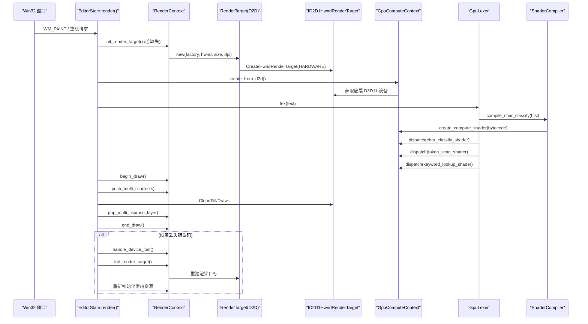
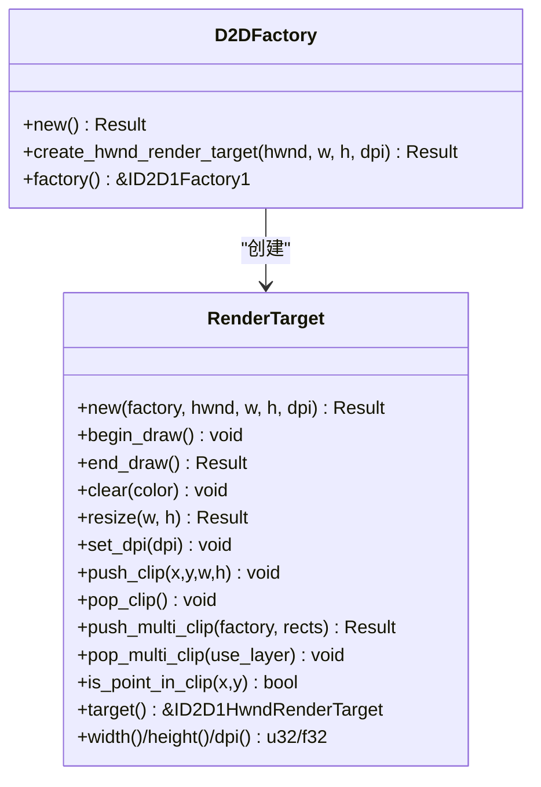
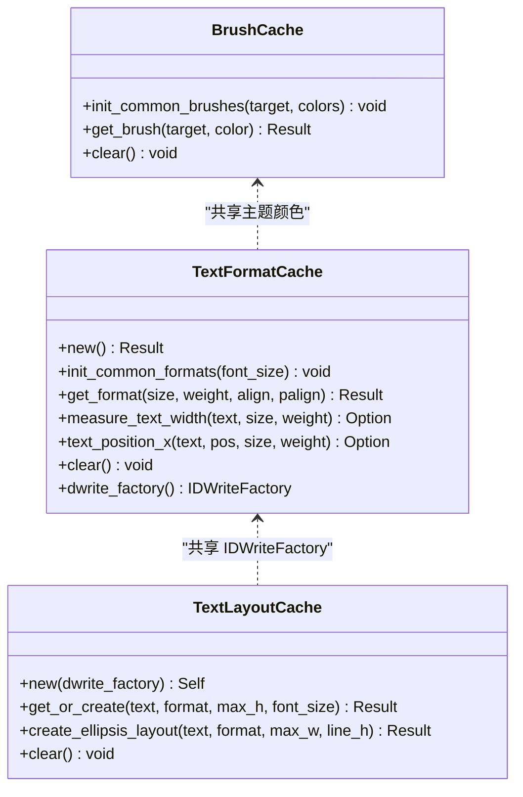
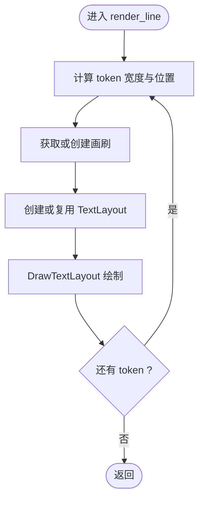
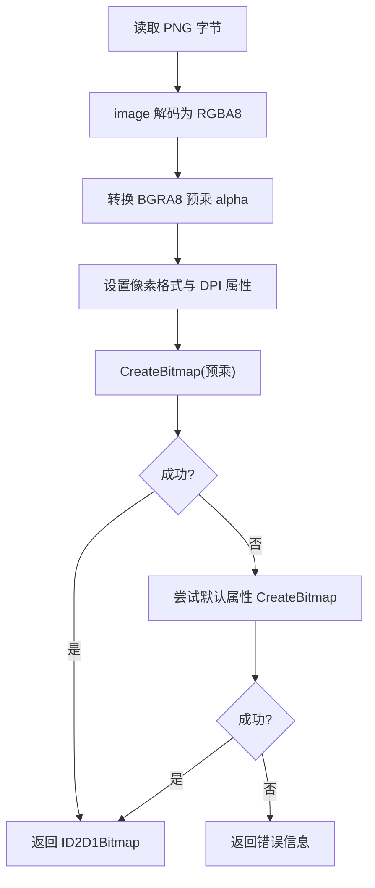
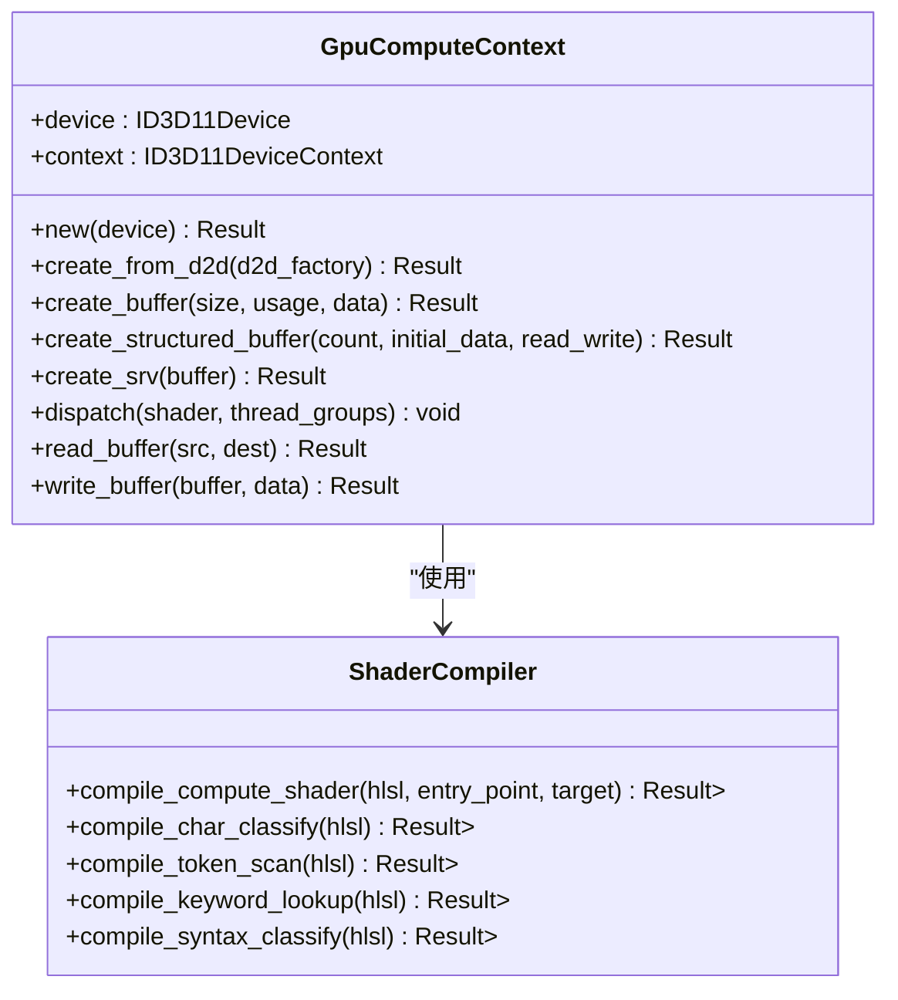
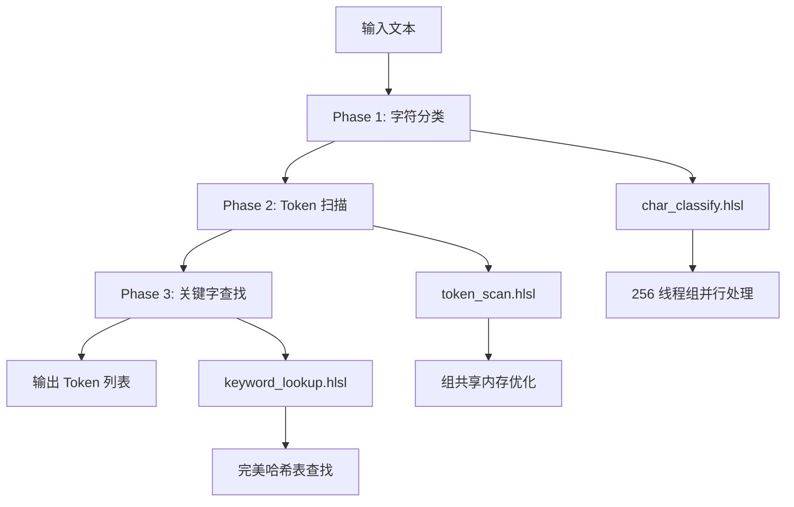
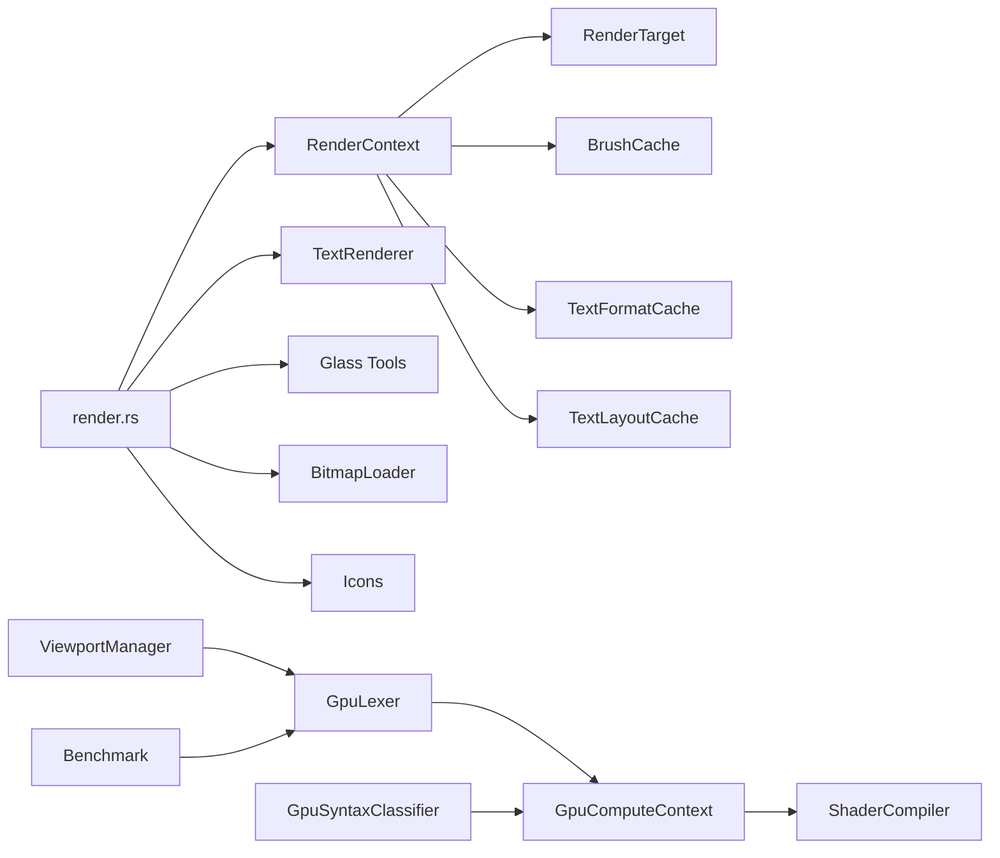

# GPU 加速

<cite>
**本文引用的文件**   
- [crates/aether-render/src/d2d/factory.rs](file://crates/aether-render/src/d2d/factory.rs)
- [crates/aether-render/src/d2d/brush_cache.rs](file://crates/aether-render/src/d2d/brush_cache.rs)
- [crates/aether-render/src/d2d/text.rs](file://crates/aether-render/src/d2d/text.rs)
- [crates/aether-render/src/d2d/glass.rs](file://crates/aether-render/src/d2d/glass.rs)
- [crates/aether-win32/src/render_context.rs](file://crates/aether-win32/src/render_context.rs)
- [crates/aether-win32/src/render.rs](file://crates/aether-win32/src/render.rs)
- [crates/aether-win32/src/bitmap_loader.rs](file://crates/aether-win32/src/bitmap_loader.rs)
- [crates/aether-win32/src/icons.rs](file://crates/aether-win32/src/icons.rs)
- [crates/aether-render/src/gpu/mod.rs](file://crates/aether-render/src/gpu/mod.rs)
- [crates/aether-render/src/gpu/lexer.rs](file://crates/aether-render/src/gpu/lexer.rs)
- [crates/aether-render/src/gpu/syntax.rs](file://crates/aether-render/src/gpu/syntax.rs)
- [crates/aether-render/src/gpu/viewport.rs](file://crates/aether-render/src/gpu/viewport.rs)
- [crates/aether-render/src/gpu/benchmark.rs](file://crates/aether-render/src/gpu/benchmark.rs)
- [crates/aether-render/src/gpu/shader.rs](file://crates/aether-render/src/gpu/shader.rs)
- [crates/aether-render/src/gpu/compute_context.rs](file://crates/aether-render/src/gpu/compute_context.rs)
- [crates/aether-render/src/gpu/language_tables.rs](file://crates/aether-render/src/gpu/language_tables.rs)
- [crates/aether-render/src/gpu/shaders/char_classify.hlsl](file://crates/aether-render/src/gpu/shaders/char_classify.hlsl)
- [crates/aether-render/src/gpu/shaders/token_scan.hlsl](file://crates/aether-render/src/gpu/shaders/token_scan.hlsl)
- [crates/aether-render/src/gpu/shaders/keyword_lookup.hlsl](file://crates/aether-render/src/gpu/shaders/keyword_lookup.hlsl)
- [crates/aether-render/src/gpu/shaders/syntax_classify.hlsl](file://crates/aether-render/src/gpu/shaders/syntax_classify.hlsl)
</cite>

## 更新摘要
**变更内容**   
- 新增基于HLSL着色器的GPU加速词法分析系统
- 实现字符分类、Token扫描、关键字查找等并行处理阶段
- 添加GPU视口管理和增量高亮缓存机制
- 集成性能基准测试框架
- 扩展语法分类器支持多种编程语言

## 目录
1. [简介](#简介)
2. [项目结构](#项目结构)
3. [核心组件](#核心组件)
4. [架构总览](#架构总览)
5. [详细组件分析](#详细组件分析)
6. [依赖关系分析](#依赖关系分析)
7. [性能考量](#性能考量)
8. [故障排查指南](#故障排查指南)
9. [结论](#结论)
10. [附录](#附录)

## 简介
本文件面向牧羊人编辑器的 GPU 加速优化，聚焦于 Direct2D 硬件渲染路径、设备丢失与降级策略、文本与位图资源缓存、脏矩形裁剪与多矩形并集裁剪、以及 PNG 位图加载流程。文档同时介绍新增的基于 HLSL 着色器的 GPU 加速词法分析系统，包括字符分类、关键字查找、令牌扫描等着色器实现，以及 GPU 视口管理和基准测试功能。文档提供可操作的 GPU 内存监控与瓶颈定位方法，并提供不同显卡驱动下的兼容性与移动端适配建议（概念性说明）。

## 项目结构
本项目采用分层组织：渲染抽象位于 aether-render，Windows 平台集成与主循环在 aether-win32。GPU 相关的关键代码集中在以下模块：
- D2D 工厂与渲染目标管理
- 画刷与文本格式/布局缓存
- 文本渲染器
- 玻璃效果绘制工具
- 渲染上下文封装
- 主渲染管线与脏矩形裁剪
- PNG 位图加载器
- SVG 图标几何构建与绘制
- **新增** GPU 计算上下文与着色器编译
- **新增** GPU 词法分析器与语法分类器
- **新增** GPU 视口管理与增量高亮
- **新增** 性能基准测试框架

```mermaid
graph TB
subgraph "渲染抽象层"
F["D2D 工厂与渲染目标<br/>factory.rs"]
BC["画刷缓存<br/>brush_cache.rs"]
TF["文本格式缓存<br/>brush_cache.rs"]
TL["TextLayout 缓存<br/>brush_cache.rs"]
TR["文本渲染器<br/>text.rs"]
GL["玻璃效果工具<br/>glass.rs"]
end
subgraph "GPU 计算层"
CC["计算上下文<br/>compute_context.rs"]
SC["着色器编译器<br/>shader.rs"]
GLX["GPU 词法分析器<br/>lexer.rs"]
GSC["语法分类器<br/>syntax.rs"]
VPC["视口管理器<br/>viewport.rs"]
BNM["基准测试<br/>benchmark.rs"]
end
subgraph "平台集成层"
RC["渲染上下文封装<br/>render_context.rs"]
RND["主渲染管线<br/>render.rs"]
BMP["PNG 位图加载器<br/>bitmap_loader.rs"]
ICN["SVG 图标几何与绘制<br/>icons.rs"]
end
F --> RC
BC --> RC
TF --> RC
TL --> RC
TR --> RND
GL --> RND
BMP --> RND
ICN --> RND
RC --> RND
CC --> GLX
SC --> CC
GLX --> GSC
GSC --> VPC
VPC --> BN M
```

**图表来源**
- [crates/aether-render/src/d2d/factory.rs:1-63](file://crates/aether-render/src/d2d/factory.rs#L1-L63)
- [crates/aether-render/src/gpu/mod.rs:1-10](file://crates/aether-render/src/gpu/mod.rs#L1-L10)
- [crates/aether-render/src/gpu/compute_context.rs:17-84](file://crates/aether-render/src/gpu/compute_context.rs#L17-L84)
- [crates/aether-render/src/gpu/lexer.rs:48-114](file://crates/aether-render/src/gpu/lexer.rs#L48-L114)
- [crates/aether-render/src/gpu/syntax.rs:39-91](file://crates/aether-render/src/gpu/syntax.rs#L39-L91)
- [crates/aether-render/src/gpu/viewport.rs:3-22](file://crates/aether-render/src/gpu/viewport.rs#L3-L22)
- [crates/aether-render/src/gpu/benchmark.rs:3-32](file://crates/aether-render/src/gpu/benchmark.rs#L3-L32)

章节来源
- [crates/aether-render/src/d2d/factory.rs:1-63](file://crates/aether-render/src/d2d/factory.rs#L1-L63)
- [crates/aether-render/src/gpu/mod.rs:1-10](file://crates/aether-render/src/gpu/mod.rs#L1-L10)
- [crates/aether-render/src/gpu/compute_context.rs:17-84](file://crates/aether-render/src/gpu/compute_context.rs#L17-L84)
- [crates/aether-render/src/gpu/lexer.rs:48-114](file://crates/aether-render/src/gpu/lexer.rs#L48-L114)
- [crates/aether-render/src/gpu/syntax.rs:39-91](file://crates/aether-render/src/gpu/syntax.rs#L39-L91)
- [crates/aether-render/src/gpu/viewport.rs:3-22](file://crates/aether-render/src/gpu/viewport.rs#L3-L22)
- [crates/aether-render/src/gpu/benchmark.rs:3-32](file://crates/aether-render/src/gpu/benchmark.rs#L3-L32)

## 核心组件
- D2D 工厂与渲染目标：创建单线程工厂与硬件渲染目标，支持 DPI 更新与尺寸调整。
- 渲染上下文：统一封装渲染目标、画刷缓存、文本格式与 TextLayout 缓存，提供 begin/end_draw、清理、多矩形裁剪等能力。
- 画刷与文本缓存：预存常用颜色画刷与文本格式，避免每帧重复创建 COM 对象；TextLayout 缓存复用相同文本的布局对象。
- 文本渲染器：基于 DirectWrite 测量字符宽度、行高，按 token 着色绘制。
- 玻璃效果工具：通过填充矩形模拟半透明面板、发光选择与阴影。
- PNG 位图加载器：将 PNG 解码为 BGRA8 预乘 alpha 像素数据，再创建 D2D 位图。
- SVG 图标几何：按需构建几何层，支持填充与描边绘制。
- **新增** GPU 计算上下文：封装 D3D11 Compute Shader 所需的所有资源，支持从 D2D 工厂获取底层设备。
- **新增** 着色器编译器：使用 d3dcompiler_47.dll 将 HLSL 源码编译为 CSO 字节码。
- **新增** GPU 词法分析器：实现三阶段并行词法分析（字符分类 → Token 扫描 → 关键字查找）。
- **新增** 语法分类器：基于 Token 流进行简单语法模式的 GPU 并行识别。
- **新增** 视口管理器：只缓存可见行范围内的高亮结果，配合编辑距离检测实现增量更新。
- **新增** 基准测试框架：对比 GPU、CPU 和 tree-sitter 三种高亮方案的性能。

章节来源
- [crates/aether-render/src/d2d/factory.rs:14-63](file://crates/aether-render/src/d2d/factory.rs#L14-L63)
- [crates/aether-win32/src/render_context.rs:10-46](file://crates/aether-win32/src/render_context.rs#L10-L46)
- [crates/aether-render/src/d2d/brush_cache.rs:25-106](file://crates/aether-render/src/d2d/brush_cache.rs#L25-L106)
- [crates/aether-render/src/d2d/text.rs:14-57](file://crates/aether-render/src/d2d/text.rs#L14-L57)
- [crates/aether-render/src/d2d/glass.rs:12-62](file://crates/aether-render/src/d2d/glass.rs#L12-L62)
- [crates/aether-win32/src/bitmap_loader.rs:12-77](file://crates/aether-win32/src/bitmap_loader.rs#L12-L77)
- [crates/aether-win32/src/icons.rs:206-303](file://crates/aether-win32/src/icons.rs#L206-L303)
- [crates/aether-render/src/gpu/compute_context.rs:17-84](file://crates/aether-render/src/gpu/compute_context.rs#L17-L84)
- [crates/aether-render/src/gpu/shader.rs:7-101](file://crates/aether-render/src/gpu/shader.rs#L7-L101)
- [crates/aether-render/src/gpu/lexer.rs:48-221](file://crates/aether-render/src/gpu/lexer.rs#L48-L221)
- [crates/aether-render/src/gpu/syntax.rs:39-142](file://crates/aether-render/src/gpu/syntax.rs#L39-L142)
- [crates/aether-render/src/gpu/viewport.rs:3-195](file://crates/aether-render/src/gpu/viewport.rs#L3-L195)
- [crates/aether-render/src/gpu/benchmark.rs:3-157](file://crates/aether-render/src/gpu/benchmark.rs#L3-L157)

## 架构总览
下图展示了从窗口消息到最终呈现的调用链，包括设备丢失处理与资源重建流程，以及新增的 GPU 词法分析管线。



**图表来源**
- [crates/aether-win32/src/render.rs:62-134](file://crates/aether-win32/src/render.rs#L62-L134)
- [crates/aether-win32/src/render.rs:704-746](file://crates/aether-win32/src/render.rs#L704-L746)
- [crates/aether-render/src/d2d/factory.rs:33-63](file://crates/aether-render/src/d2d/factory.rs#L33-L63)
- [crates/aether-win32/src/render_context.rs:33-46](file://crates/aether-win32/src/render_context.rs#L33-L46)
- [crates/aether-win32/src/render_context.rs:107-155](file://crates/aether-win32/src/render_context.rs#L107-L155)
- [crates/aether-render/src/gpu/compute_context.rs:47-84](file://crates/aether-render/src/gpu/compute_context.rs#L47-L84)
- [crates/aether-render/src/gpu/lexer.rs:187-221](file://crates/aether-render/src/gpu/lexer.rs#L187-L221)
- [crates/aether-render/src/gpu/shader.rs:22-101](file://crates/aether-render/src/gpu/shader.rs#L22-L101)

## 详细组件分析

### 组件A：Direct2D 工厂与渲染目标（硬件加速）
- 关键点
  - 使用单线程工厂与 HARDWARE 渲染目标类型，启用 GPU 加速。
  - 支持 DPI 动态更新与尺寸调整，确保高分屏正确缩放。
  - 提供轴对齐裁剪与多矩形并集裁剪（Layer + GeometryGroup），减少无效绘制。
- 复杂度与优化
  - 多矩形裁剪在单矩形时走快路径，避免额外几何构造开销。
  - 失败时回退到包围盒裁剪，保证鲁棒性。
- 兼容性
  - 若硬件渲染目标不可用，应检测并回退至软件渲染目标（概念性建议）。



**图表来源**
- [crates/aether-render/src/d2d/factory.rs:14-63](file://crates/aether-render/src/d2d/factory.rs#L14-L63)
- [crates/aether-render/src/d2d/factory.rs:66-271](file://crates/aether-render/src/d2d/factory.rs#L66-L271)

章节来源
- [crates/aether-render/src/d2d/factory.rs:14-63](file://crates/aether-render/src/d2d/factory.rs#L14-L63)
- [crates/aether-render/src/d2d/factory.rs:143-271](file://crates/aether-render/src/d2d/factory.rs#L143-L271)

### 组件B：画刷与文本缓存（COM 对象复用）
- 关键点
  - 画刷缓存：预存常用颜色画刷，未命中时回退 HashMap，超过阈值清空以控制增长。
  - 文本格式缓存：预存常用字体大小与对齐组合，避免频繁创建 IDWriteTextFormat。
  - TextLayout 缓存：对高频重复文本复用布局对象，显著降低 COM 分配。
- 复杂度与优化
  - 线性扫描小数组 + HashMap 混合查找，命中率高的场景下优于纯哈希。
  - 最大条目数限制防止无界增长。
- 兼容性
  - 设备丢失时需清空所有缓存，确保下次重建后重新创建 COM 对象。



**图表来源**
- [crates/aether-render/src/d2d/brush_cache.rs:25-106](file://crates/aether-render/src/d2d/brush_cache.rs#L25-L106)
- [crates/aether-render/src/d2d/brush_cache.rs:108-314](file://crates/aether-render/src/d2d/brush_cache.rs#L108-L314)
- [crates/aether-render/src/d2d/brush_cache.rs:376-477](file://crates/aether-render/src/d2d/brush_cache.rs#L376-L477)

章节来源
- [crates/aether-render/src/d2d/brush_cache.rs:25-106](file://crates/aether-render/src/d2d/brush_cache.rs#L25-L106)
- [crates/aether-render/src/d2d/brush_cache.rs:108-314](file://crates/aether-render/src/d2d/brush_cache.rs#L108-L314)
- [crates/aether-render/src/d2d/brush_cache.rs:376-477](file://crates/aether-render/src/d2d/brush_cache.rs#L376-L477)

### 组件C：文本渲染器（DirectWrite + D2D）
- 关键点
  - 使用 DirectWrite 实测等宽字体字符宽度与行高，避免硬编码误差。
  - 根据 token 类型映射颜色，逐段绘制文本布局。
  - 支持 DPI 缩放与基础字号调整，动态重建文本格式与度量。
- 复杂度与优化
  - 可见区域行裁剪，仅渲染可视范围。
  - 结合 TextLayout 缓存可减少布局创建次数（由上层缓存管理）。



**图表来源**
- [crates/aether-render/src/d2d/text.rs:138-187](file://crates/aether-render/src/d2d/text.rs#L138-L187)
- [crates/aether-render/src/d2d/text.rs:24-57](file://crates/aether-render/src/d2d/text.rs#L24-L57)

章节来源
- [crates/aether-render/src/d2d/text.rs:24-57](file://crates/aether-render/src/d2d/text.rs#L24-L57)
- [crates/aether-render/src/d2d/text.rs:138-187](file://crates/aether-render/src/d2d/text.rs#L138-L187)

### 组件D：玻璃效果工具（UI 视觉增强）
- 关键点
  - 通过填充矩形实现半透明背景、边框、发光选择与阴影。
  - 与画刷缓存配合，减少重复画刷创建。
- 适用场景
  - 欢迎页、对话框、侧边栏等需要柔和视觉反馈的区域。

章节来源
- [crates/aether-render/src/d2d/glass.rs:12-154](file://crates/aether-render/src/d2d/glass.rs#L12-L154)

### 组件E：PNG 位图加载器（BGRA8 预乘 alpha）
- 关键点
  - 使用 image crate 解码 PNG 为 RGBA8，转换为 BGRA8 预乘 alpha。
  - 设置 DXGI_FORMAT_B8G8R8A8_UNORM 与 PREMULTIPLIED 模式，调用 CreateBitmap。
  - 包含属性失败时的默认属性回退逻辑，提升兼容性。
- 复杂度与优化
  - 内存拷贝一次，直接提交给 D2D，适合静态图标与欢迎页图片。



**图表来源**
- [crates/aether-win32/src/bitmap_loader.rs:18-77](file://crates/aether-win32/src/bitmap_loader.rs#L18-L77)

章节来源
- [crates/aether-win32/src/bitmap_loader.rs:18-77](file://crates/aether-win32/src/bitmap_loader.rs#L18-L77)

### 组件F：SVG 图标几何与绘制
- 关键点
  - 懒加载构建几何层，首次绘制时从渲染目标获取工厂。
  - 支持填充层与描边层两遍绘制，按缩放调整笔画宽度。
  - 设备丢失时清理几何缓存，确保下次重建。
- 复杂度与优化
  - 索引偏移记录每个图标的图层范围，避免全量遍历。

章节来源
- [crates/aether-win32/src/icons.rs:206-303](file://crates/aether-win32/src/icons.rs#L206-L303)

### 组件G：GPU 计算上下文与着色器编译（新增）
- 关键点
  - 封装 D3D11 Compute Shader 所需的所有资源，支持从 D2D 工厂获取底层设备。
  - 提供缓冲区创建、着色器编译、资源视图管理等核心功能。
  - 支持常量缓冲区、结构化缓冲区、读写缓冲区和暂存缓冲区等多种用途。
- 复杂度与优化
  - 使用立即上下文执行计算着色器，避免多线程同步问题。
  - 通过暂存缓冲区实现高效的 CPU/GPU 数据传输。
- 兼容性
  - 支持 D3D_FEATURE_LEVEL_11_0 及以上版本。



**图表来源**
- [crates/aether-render/src/gpu/compute_context.rs:17-84](file://crates/aether-render/src/gpu/compute_context.rs#L17-L84)
- [crates/aether-render/src/gpu/shader.rs:7-101](file://crates/aether-render/src/gpu/shader.rs#L7-L101)

章节来源
- [crates/aether-render/src/gpu/compute_context.rs:17-84](file://crates/aether-render/src/gpu/compute_context.rs#L17-L84)
- [crates/aether-render/src/gpu/shader.rs:7-101](file://crates/aether-render/src/gpu/shader.rs#L7-L101)

### 组件H：GPU 词法分析器（新增）
- 关键点
  - 实现三阶段并行词法分析：字符分类 → Token 扫描 → 关键字查找。
  - 使用 D3D11 Compute Shader 实现大规模并行处理。
  - 支持多种编程语言的 DFA 状态表和关键字表。
- 复杂度与优化
  - 每个字符一个线程，充分利用 GPU 并行能力。
  - 使用原子操作确保 Token 计数的线程安全。
  - 共享内存优化组内通信。
- 兼容性
  - 支持 Rust、C/C++、JavaScript、Python、Go、Java 等多种语言。



**图表来源**
- [crates/aether-render/src/gpu/lexer.rs:187-221](file://crates/aether-render/src/gpu/lexer.rs#L187-L221)
- [crates/aether-render/src/gpu/shaders/char_classify.hlsl:1-89](file://crates/aether-render/src/gpu/shaders/char_classify.hlsl#L1-L89)
- [crates/aether-render/src/gpu/shaders/token_scan.hlsl:1-313](file://crates/aether-render/src/gpu/shaders/token_scan.hlsl#L1-L313)
- [crates/aether-render/src/gpu/shaders/keyword_lookup.hlsl:1-102](file://crates/aether-render/src/gpu/shaders/keyword_lookup.hlsl#L1-L102)

章节来源
- [crates/aether-render/src/gpu/lexer.rs:48-430](file://crates/aether-render/src/gpu/lexer.rs#L48-L430)
- [crates/aether-render/src/gpu/shaders/char_classify.hlsl:1-89](file://crates/aether-render/src/gpu/shaders/char_classify.hlsl#L1-L89)
- [crates/aether-render/src/gpu/shaders/token_scan.hlsl:1-313](file://crates/aether-render/src/gpu/shaders/token_scan.hlsl#L1-L313)
- [crates/aether-render/src/gpu/shaders/keyword_lookup.hlsl:1-102](file://crates/aether-render/src/gpu/shaders/keyword_lookup.hlsl#L1-L102)

### 组件I：语法分类器（新增）
- 关键点
  - 基于 Token 流进行简单语法模式的 GPU 并行识别。
  - 支持函数声明、函数调用、类型声明、变量声明等常见语法模式。
  - 使用优先级机制解决模式冲突。
- 复杂度与优化
  - 每个 Token 一个线程，并行匹配语法模式。
  - 支持最多 4 个 Token 的模式序列匹配。
- 兼容性
  - 适用于类 C 语言，可扩展支持更多语言。

章节来源
- [crates/aether-render/src/gpu/syntax.rs:39-289](file://crates/aether-render/src/gpu/syntax.rs#L39-L289)
- [crates/aether-render/src/gpu/shaders/syntax_classify.hlsl:1-142](file://crates/aether-render/src/gpu/shaders/syntax_classify.hlsl#L1-L142)

### 组件J：GPU 视口管理器（新增）
- 关键点
  - 只缓存可见行范围内的高亮结果，配合编辑距离检测实现增量更新。
  - 支持视口窗口调整和脏行标记机制。
  - 提供 GPU 高亮配置选项。
- 复杂度与优化
  - 使用编辑距离算法判断是否需要重新高亮。
  - 智能保留重叠行的缓存数据。
- 兼容性
  - 支持自定义阈值和回退策略。

章节来源
- [crates/aether-render/src/gpu/viewport.rs:3-324](file://crates/aether-render/src/gpu/viewport.rs#L3-L324)

### 组件K：性能基准测试框架（新增）
- 关键点
  - 对比 GPU、CPU（手写 lexer）、tree-sitter 三种高亮方案的性能。
  - 提供详细的性能指标：平均耗时、最小耗时、最大耗时、吞吐量、延迟等。
  - 支持生成 Markdown 格式的报告。
- 复杂度与优化
  - 使用标准库时间测量，确保精度。
  - 支持多次迭代取平均值，减少随机因素影响。
- 兼容性
  - 内置多种测试数据生成器（Rust、JavaScript、JSON）。

章节来源
- [crates/aether-render/src/gpu/benchmark.rs:3-287](file://crates/aether-render/src/gpu/benchmark.rs#L3-L287)

## 依赖关系分析
- 耦合与内聚
  - RenderContext 聚合了 D2D 渲染目标与各缓存，降低 EditorState 的借用冲突，提高内聚性。
  - 文本渲染器与缓存解耦，便于替换或扩展。
  - GPU 计算上下文与着色器编译器分离，职责清晰。
  - 词法分析器与语法分类器通过 Token 接口解耦。
- 外部依赖
  - windows-rs 绑定 Direct2D/DirectWrite/DXGI/D3D11。
  - image crate 用于 PNG 解码。
  - d3dcompiler_47.dll 用于 HLSL 编译。
- 潜在循环依赖
  - 当前模块间单向依赖，未见循环引用。



**图表来源**
- [crates/aether-win32/src/render_context.rs:10-46](file://crates/aether-win32/src/render_context.rs#L10-L46)
- [crates/aether-win32/src/render.rs:62-134](file://crates/aether-win32/src/render.rs#L62-L134)
- [crates/aether-render/src/gpu/compute_context.rs:17-84](file://crates/aether-render/src/gpu/compute_context.rs#L17-L84)
- [crates/aether-render/src/gpu/shader.rs:7-101](file://crates/aether-render/src/gpu/shader.rs#L7-L101)
- [crates/aether-render/src/gpu/lexer.rs:48-221](file://crates/aether-render/src/gpu/lexer.rs#L48-L221)
- [crates/aether-render/src/gpu/syntax.rs:39-142](file://crates/aether-render/src/gpu/syntax.rs#L39-L142)
- [crates/aether-render/src/gpu/viewport.rs:3-195](file://crates/aether-render/src/gpu/viewport.rs#L3-L195)
- [crates/aether-render/src/gpu/benchmark.rs:3-157](file://crates/aether-render/src/gpu/benchmark.rs#L3-L157)

章节来源
- [crates/aether-win32/src/render_context.rs:10-46](file://crates/aether-win32/src/render_context.rs#L10-L46)
- [crates/aether-win32/src/render.rs:62-134](file://crates/aether-win32/src/render.rs#L62-L134)
- [crates/aether-render/src/gpu/compute_context.rs:17-84](file://crates/aether-render/src/gpu/compute_context.rs#L17-L84)
- [crates/aether-render/src/gpu/shader.rs:7-101](file://crates/aether-render/src/gpu/shader.rs#L7-L101)
- [crates/aether-render/src/gpu/lexer.rs:48-221](file://crates/aether-render/src/gpu/lexer.rs#L48-L221)
- [crates/aether-render/src/gpu/syntax.rs:39-142](file://crates/aether-render/src/gpu/syntax.rs#L39-L142)
- [crates/aether-render/src/gpu/viewport.rs:3-195](file://crates/aether-render/src/gpu/viewport.rs#L3-L195)
- [crates/aether-render/src/gpu/benchmark.rs:3-157](file://crates/aether-render/src/gpu/benchmark.rs#L3-L157)

## 性能考量
- 硬件加速与降级
  - 当前使用 HARDWARE 渲染目标类型，启用 GPU 加速。建议在工厂创建后检查是否成功，若失败则回退到 SOFTWARE 类型（概念性建议）。
- 脏矩形与多矩形裁剪
  - 通过 DirtyRegion 推断最小重绘区域，并使用多矩形并集裁剪减少无效绘制面积。
- 资源缓存
  - 画刷、文本格式与 TextLayout 缓存显著降低 COM 对象分配与销毁开销。
- 文本度量
  - 使用 DirectWrite 实测字符宽度与行高，避免硬编码导致的错位与多余绘制。
- 位图加载
  - 预乘 alpha 与正确的像素格式可减少合成阶段的额外计算。
- **新增** GPU 并行处理
  - 字符分类、Token 扫描、关键字查找三个阶段完全并行化，充分利用 GPU 计算能力。
  - 每个字符一个线程，256 线程组调度，最大化并行度。
- **新增** 增量更新优化
  - 视口管理器只处理可见行，结合编辑距离检测避免不必要的重新高亮。
  - 智能缓存重叠行数据，减少重复计算。
- **新增** 语言特定优化
  - 针对不同语言生成优化的 DFA 状态表和关键字表。
  - 支持多种编程语言的快速词法分析。

[本节为通用指导，不直接分析具体文件]

## 故障排查指南
- 设备丢失（D2DERR_RECREATE_TARGET）
  - 现象：EndDraw 返回特定错误码。
  - 处理：清理渲染目标与缓存，重建渲染目标，重新初始化常用资源。
- 位图创建失败
  - 现象：CreateBitmap 报错。
  - 处理：先尝试预乘 alpha 属性，失败后回退默认属性；检查像素格式与 DPI 设置。
- 文本显示异常
  - 现象：字符宽度或行高不正确。
  - 处理：确认 DPI 缩放与字体大小设置，检查 TextLayout 缓存是否因字体变化而清空。
- **新增** 着色器编译失败
  - 现象：D3DCompile 返回错误。
  - 处理：检查 HLSL 语法错误，确认 d3dcompiler_47.dll 可用，验证着色器模型版本。
- **新增** GPU 计算错误
  - 现象：Dispatch 调用失败或结果不正确。
  - 处理：检查缓冲区大小和格式，验证线程组配置，确认资源绑定顺序。
- **新增** 词法分析结果异常
  - 现象：Token 识别错误或关键字分类失败。
  - 处理：检查 DFA 表生成，验证关键字哈希表，调试着色器执行流程。

章节来源
- [crates/aether-win32/src/render.rs:704-746](file://crates/aether-win32/src/render.rs#L704-L746)
- [crates/aether-win32/src/render_context.rs:219-225](file://crates/aether-win32/src/render_context.rs#L219-L225)
- [crates/aether-win32/src/bitmap_loader.rs:54-77](file://crates/aether-win32/src/bitmap_loader.rs#L54-L77)
- [crates/aether-render/src/gpu/shader.rs:22-80](file://crates/aether-render/src/gpu/shader.rs#L22-L80)
- [crates/aether-render/src/gpu/compute_context.rs:96-114](file://crates/aether-render/src/gpu/compute_context.rs#L96-L114)
- [crates/aether-render/src/gpu/lexer.rs:187-221](file://crates/aether-render/src/gpu/lexer.rs#L187-L221)

## 结论
本项目已实现较为完善的 Direct2D GPU 加速路径，并通过多层缓存与脏矩形裁剪显著提升渲染效率。针对设备丢失与位图加载的健壮性处理进一步增强了兼容性。**新增的基于 HLSL 着色器的 GPU 加速词法分析系统**实现了字符分类、Token 扫描、关键字查找等并行处理阶段，大幅提升了大文件的语法高亮性能。GPU 视口管理和增量高亮机制进一步优化了交互响应速度。性能基准测试框架为持续优化提供了量化依据。后续可在硬件检测与降级、纹理图集与 mipmap、GPU 内存监控等方面继续深化优化。

[本节为总结，不直接分析具体文件]

## 附录

### 顶点缓冲区优化（概念性说明）
- 批量绘制
  - 将同材质/同状态的几何合并为单次绘制调用，减少状态切换与批次开销。
- 索引缓冲
  - 使用索引缓冲复用顶点，降低顶点传输量与显存占用。
- 几何数据压缩
  - 对网格数据进行量化或压缩（如半精度浮点），在质量可接受的前提下减小带宽压力。

[本节为概念性内容，不直接分析具体文件]

### 纹理贴图管理策略（概念性说明）
- 纹理图集
  - 将多个小图打包为大图，减少纹理切换与采样器状态变更。
- Mipmap 生成
  - 为缩略图与远景渲染生成多级纹理，提升采样质量与缓存命中率。
- 内存映射
  - 使用映射纹理进行 CPU/GPU 共享更新，注意同步与刷新时机，避免阻塞。

[本节为概念性内容，不直接分析具体文件]

### GPU 内存监控与瓶颈定位（使用方法）
- 显存占用分析
  - 使用 Windows Performance Analyzer 或 GPU 厂商工具（如 NVIDIA Nsight Graphics、AMD Radeon GPU Profiler）捕获帧时间线与显存分配。
- 瓶颈定位
  - 关注绘制批次数量、状态切换频率、纹理上传带宽与几何顶点传输量。
  - 结合脏矩形裁剪与资源缓存，评估无效绘制与重复创建的影响。
- **新增** 词法分析性能监控
  - 使用基准测试框架对比不同方案的吞吐量和延迟。
  - 监控 GPU 计算着色器的执行时间和缓冲区传输开销。
  - 分析视口缓存命中率，评估增量更新的收益。

[本节为概念性内容，不直接分析具体文件]

### 不同显卡驱动下的兼容性问题与解决方案（经验性建议）
- 常见问题
  - 某些旧驱动对硬件渲染目标支持不稳定，可能出现黑屏或崩溃。
  - 精简系统缺少 WIC 解码器导致 PNG 加载失败。
  - **新增** 着色器编译失败，缺少 d3dcompiler_47.dll。
  - **新增** GPU 计算着色器在某些集成显卡上性能不佳。
- 解决方案
  - 在工厂创建后检测硬件目标可用性，必要时回退软件目标。
  - 使用内置解码器（如 image crate）并增加默认属性回退逻辑。
  - **新增** 提供预编译着色器作为备选方案，避免运行时编译失败。
  - **新增** 实现 GPU 能力检测，自动降级到 CPU 词法分析。

[本节为概念性内容，不直接分析具体文件]

### 移动端适配注意事项（概念性说明）
- 图形 API 差异
  - 移动端通常使用 Vulkan/Metal/OpenGL ES，需抽象渲染后端。
- 资源管理
  - 更严格的显存限制，建议使用纹理图集与流式加载。
- 输入与 DPI
  - 触控事件与高 DPI 缩放需特殊处理。
- **新增** 移动 GPU 优化
  - 考虑移动设备的 GPU 架构差异，优化着色器指令。
  - 限制并行线程数量，避免过热降频。
  - 实现自适应质量设置，根据设备性能调整计算粒度。

[本节为概念性内容，不直接分析具体文件]