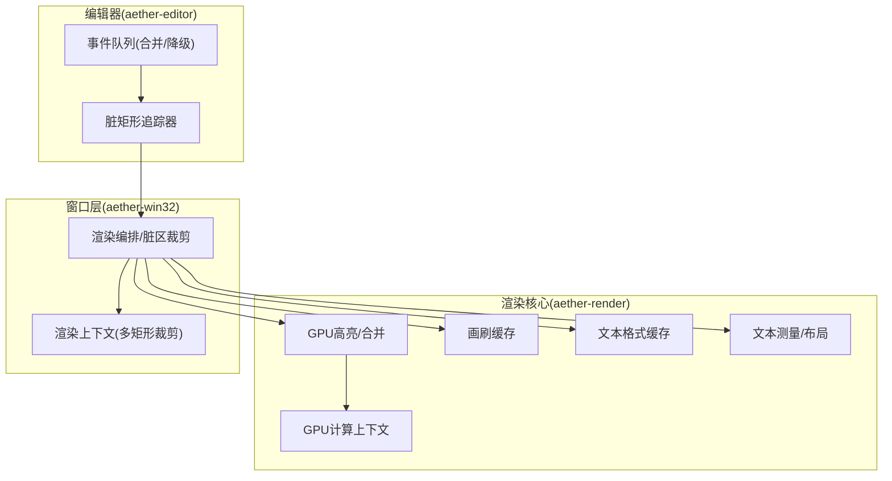
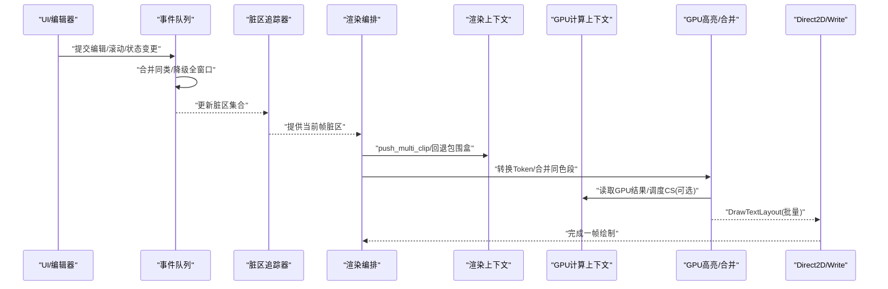
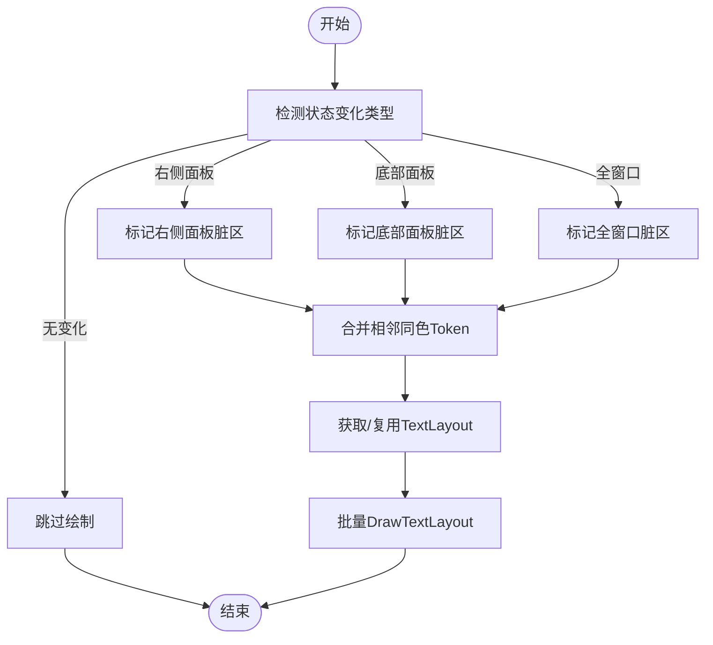
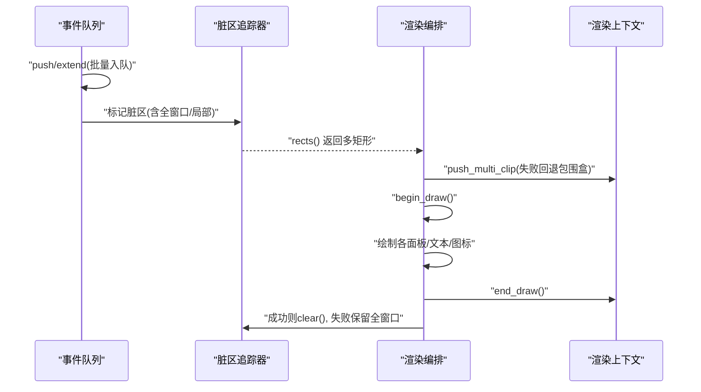
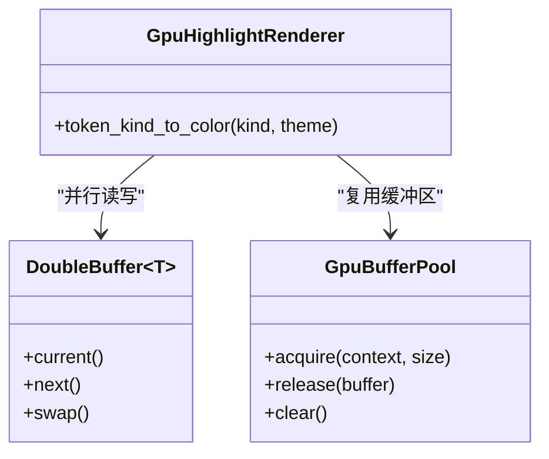
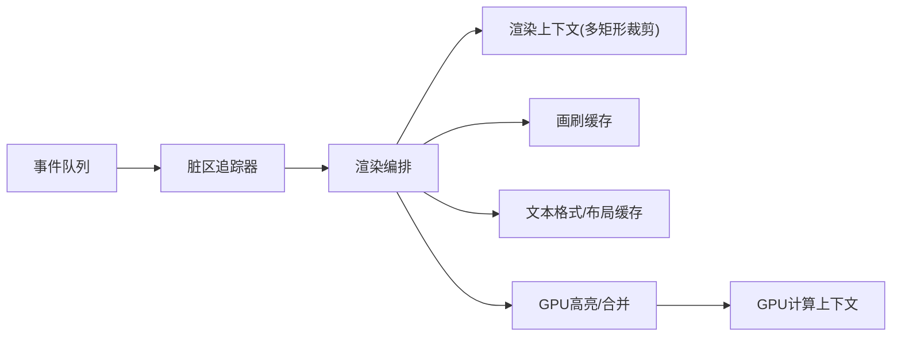

# 批量绘制

<cite>
**本文引用的文件**
- [aether-render/src/gpu/render.rs](file://crates/aether-render/src/gpu/render.rs)
- [aether-render/src/gpu/compute_context.rs](file://crates/aether-render/src/gpu/compute_context.rs)
- [aether-render/src/d2d/brush_cache.rs](file://crates/aether-render/src/d2d/brush_cache.rs)
- [aether-render/src/d2d/text.rs](file://crates/aether-render/src/d2d/text.rs)
- [aether-win32/src/render/mod.rs](file://crates/aether-win32/src/render/mod.rs)
- [aether-win32/src/render_context.rs](file://crates/aether-win32/src/render_context.rs)
- [aether-editor/src/events.rs](file://crates/aether-editor/src/events.rs)
- [aether-editor/src/dirty_rect.rs](file://crates/aether-editor/src/dirty_rect.rs)
</cite>

## 目录
1. [简介](#简介)
2. [项目结构](#项目结构)
3. [核心组件](#核心组件)
4. [架构总览](#架构总览)
5. [详细组件分析](#详细组件分析)
6. [依赖关系分析](#依赖关系分析)
7. [性能考量](#性能考量)
8. [故障排查指南](#故障排查指南)
9. [结论](#结论)
10. [附录](#附录)

## 简介
本技术文档面向“批量绘制系统”，聚焦渲染命令的生成与优化策略，尤其是 RenderCommand 的智能推断机制、绘制命令合并算法、批处理渲染管线（命令队列管理与执行优化）、不同渲染目标（文本、图形、UI）的批量策略，以及性能分析与调优实践。目标是帮助开发者理解并高效使用本项目中的 GPU/CPU 协同渲染、脏矩形裁剪、缓存复用与命令合并等关键技术，从而显著降低 GPU 调用次数、提升帧率与稳定性。

## 项目结构
本项目将渲染相关能力拆分为多个 crate：
- aether-render：提供 GPU 计算上下文、令牌/语法着色、画刷与文本格式缓存、Direct2D/DirectWrite 工具等。
- aether-win32：窗口层渲染编排，负责脏区域追踪、多矩形裁剪、渲染目标管理、UI 各面板绘制协调。
- aether-editor：编辑器事件队列与脏矩形数据结构，用于事件合并与增量重绘。

图表来源
- [aether-render/src/gpu/render.rs:77-126](file://crates/aether-render/src/gpu/render.rs#L77-L126)
- [aether-render/src/gpu/compute_context.rs:17-45](file://crates/aether-render/src/gpu/compute_context.rs#L17-L45)
- [aether-render/src/d2d/brush_cache.rs:24-105](file://crates/aether-render/src/d2d/brush_cache.rs#L24-L105)
- [aether-render/src/d2d/text.rs:36-73](file://crates/aether-render/src/d2d/text.rs#L36-L73)
- [aether-win32/src/render/mod.rs:639-660](file://crates/aether-win32/src/render/mod.rs#L639-L660)
- [aether-win32/src/render_context.rs:113-150](file://crates/aether-win32/src/render_context.rs#L113-L150)
- [aether-editor/src/events.rs:76-118](file://crates/aether-editor/src/events.rs#L76-L118)
- [aether-editor/src/dirty_rect.rs:87-138](file://crates/aether-editor/src/dirty_rect.rs#L87-L138)

章节来源
- [aether-render/src/gpu/render.rs:77-126](file://crates/aether-render/src/gpu/render.rs#L77-L126)
- [aether-render/src/gpu/compute_context.rs:17-45](file://crates/aether-render/src/gpu/compute_context.rs#L17-L45)
- [aether-render/src/d2d/brush_cache.rs:24-105](file://crates/aether-render/src/d2d/brush_cache.rs#L24-L105)
- [aether-render/src/d2d/text.rs:36-73](file://crates/aether-render/src/d2d/text.rs#L36-L73)
- [aether-win32/src/render/mod.rs:639-660](file://crates/aether-win32/src/render/mod.rs#L639-L660)
- [aether-win32/src/render_context.rs:113-150](file://crates/aether-win32/src/render_context.rs#L113-L150)
- [aether-editor/src/events.rs:76-118](file://crates/aether-editor/src/events.rs#L76-L118)
- [aether-editor/src/dirty_rect.rs:87-138](file://crates/aether-editor/src/dirty_rect.rs#L87-L138)

## 核心组件
- GPU 计算上下文：封装 D3D11 设备/上下文，提供 Compute Shader 创建、缓冲区创建/读写、UAV/SRV 绑定与调度。
- GPU 高亮与合并：将 GPU 生成的 Token 转换为 LexemeSpan，按语义类别解析最终 TokenKind，并对相邻同色 Token 进行合并以减少 DrawText 调用。
- 画刷缓存：预存常用颜色画笔，回退到 FxHashMap；避免每帧创建 COM 对象，控制最大条目数防止无界增长。
- 文本格式与布局缓存：预置常用 DirectWrite 格式；两代淘汰的 TextLayout 缓存减少重复布局开销；支持精确测量与光标位置计算。
- 渲染编排与裁剪：基于脏矩形与多矩形裁剪，避免单一包围盒导致的过度重绘；在失败时回退到合并包围盒。
- 事件队列与脏区追踪：事件入队自动合并/降级，全窗口事件覆盖局部事件；脏区追踪支持阈值合并与降级策略。

章节来源
- [aether-render/src/gpu/compute_context.rs:17-45](file://crates/aether-render/src/gpu/compute_context.rs#L17-L45)
- [aether-render/src/gpu/render.rs:77-126](file://crates/aether-render/src/gpu/render.rs#L77-L126)
- [aether-render/src/d2d/brush_cache.rs:24-105](file://crates/aether-render/src/d2d/brush_cache.rs#L24-L105)
- [aether-render/src/d2d/brush_cache.rs:107-379](file://crates/aether-render/src/d2d/brush_cache.rs#L107-L379)
- [aether-win32/src/render/mod.rs:639-660](file://crates/aether-win32/src/render/mod.rs#L639-L660)
- [aether-win32/src/render_context.rs:113-150](file://crates/aether-win32/src/render_context.rs#L113-L150)
- [aether-editor/src/events.rs:76-118](file://crates/aether-editor/src/events.rs#L76-L118)
- [aether-editor/src/dirty_rect.rs:87-138](file://crates/aether-editor/src/dirty_rect.rs#L87-L138)

## 架构总览
下图展示了从编辑器事件到最终 GPU/CPU 渲染的关键路径：事件合并→脏区标记→多矩形裁剪→缓存命中→GPU 高亮/合并→DrawText 批量绘制。

图表来源
- [aether-editor/src/events.rs:76-118](file://crates/aether-editor/src/events.rs#L76-L118)
- [aether-editor/src/dirty_rect.rs:87-138](file://crates/aether-editor/src/dirty_rect.rs#L87-L138)
- [aether-win32/src/render/mod.rs:639-660](file://crates/aether-win32/src/render/mod.rs#L639-L660)
- [aether-win32/src/render_context.rs:113-150](file://crates/aether-win32/src/render_context.rs#L113-L150)
- [aether-render/src/gpu/render.rs:77-126](file://crates/aether-render/src/gpu/render.rs#L77-L126)
- [aether-render/src/gpu/compute_context.rs:232-241](file://crates/aether-render/src/gpu/compute_context.rs#L232-L241)

## 详细组件分析

### RenderCommand 智能推断与命令合并
- 智能推断：根据 UI 状态变化类型（如右侧面板、底部面板、全窗口重绘或无变化），推断最小必要重绘范围，避免不必要的绘制。
- 命令合并：对相邻且相同类型的 Token 进行合并，减少 DrawText 调用次数；同时结合文本布局缓存，进一步降低 COM 对象分配与布局成本。

图表来源
- [aether-win32/src/render/mod.rs:514-534](file://crates/aether-win32/src/render/mod.rs#L514-L534)
- [aether-render/src/gpu/render.rs:77-126](file://crates/aether-render/src/gpu/render.rs#L77-L126)
- [aether-render/src/d2d/brush_cache.rs:381-470](file://crates/aether-render/src/d2d/brush_cache.rs#L381-L470)

章节来源
- [aether-win32/src/render/mod.rs:514-534](file://crates/aether-win32/src/render/mod.rs#L514-L534)
- [aether-render/src/gpu/render.rs:77-126](file://crates/aether-render/src/gpu/render.rs#L77-L126)
- [aether-render/src/d2d/brush_cache.rs:381-470](file://crates/aether-render/src/d2d/brush_cache.rs#L381-L470)

### 批处理渲染管线：命令队列管理与执行优化
- 事件队列：支持 push/extend 批量入队，自动合并同类事件，遇到全窗口事件则清空已有局部事件并降级为全量重绘。
- 脏区追踪：维护当前帧脏矩形列表，超过阈值时降级为全窗口重绘；首帧默认全量重绘确保初始化正确。
- 多矩形裁剪：优先尝试多矩形裁剪，失败时回退到合并包围盒，避免重绘面积膨胀。
- 执行优化：begin_draw/end_draw 包裹绘制过程，失败帧保留全窗口脏标记并立即重绘恢复。

图表来源
- [aether-editor/src/events.rs:76-118](file://crates/aether-editor/src/events.rs#L76-L118)
- [aether-editor/src/dirty_rect.rs:87-138](file://crates/aether-editor/src/dirty_rect.rs#L87-L138)
- [aether-win32/src/render/mod.rs:639-660](file://crates/aether-win32/src/render/mod.rs#L639-L660)
- [aether-win32/src/render_context.rs:113-150](file://crates/aether-win32/src/render_context.rs#L113-L150)

章节来源
- [aether-editor/src/events.rs:76-118](file://crates/aether-editor/src/events.rs#L76-L118)
- [aether-editor/src/dirty_rect.rs:87-138](file://crates/aether-editor/src/dirty_rect.rs#L87-L138)
- [aether-win32/src/render/mod.rs:639-660](file://crates/aether-win32/src/render/mod.rs#L639-L660)
- [aether-win32/src/render_context.rs:113-150](file://crates/aether-win32/src/render_context.rs#L113-L150)

### 不同渲染目标的批量策略
- 文本（代码/行号/状态栏）：
  - 使用 TextFormatCache 预置常用格式，减少格式创建。
  - 使用 TextLayoutCache 两代淘汰缓存布局，热点存活，避免周期性掉帧。
  - 通过 measure_monospace_width 精确测量等宽字符宽度，保证光标与点击定位准确。
  - 合并相邻同色 Token，批量 DrawTextLayout 减少调用。
- 图形（背景/边框/阴影/发光选择）：
  - BrushCache 预存常用颜色画笔，快速命中；超出容量时清空回退缓存，避免内存增长。
  - 多矩形裁剪减少无效像素填充。
- UI 元素（图标/菜单/对话框）：
  - 图标几何按需预构建，避免首个文件帧承担懒加载成本。
  - 状态栏等区域根据文本测量自适应分区宽度，减少多余绘制。

章节来源
- [aether-render/src/d2d/brush_cache.rs:24-105](file://crates/aether-render/src/d2d/brush_cache.rs#L24-L105)
- [aether-render/src/d2d/brush_cache.rs:107-379](file://crates/aether-render/src/d2d/brush_cache.rs#L107-L379)
- [aether-render/src/d2d/text.rs:36-73](file://crates/aether-render/src/d2d/text.rs#L36-L73)
- [aether-render/src/gpu/render.rs:77-126](file://crates/aether-render/src/gpu/render.rs#L77-L126)
- [aether-win32/src/render/mod.rs:1128-1158](file://crates/aether-win32/src/render/mod.rs#L1128-L1158)

### GPU 高亮与双缓冲/内存池
- GPU 高亮：将 GPU 生成的 Token 转换为 LexemeSpan，并结合语法分类置信度决定最终 TokenKind，提高着色准确性。
- 双缓冲：实现 CPU/GPU 并行处理，避免等待，提升吞吐。
- GPU 缓冲区内存池：复用 ID3D11Buffer，减少频繁分配/释放带来的开销。

图表来源
- [aether-render/src/gpu/render.rs:116-199](file://crates/aether-render/src/gpu/render.rs#L116-L199)

章节来源
- [aether-render/src/gpu/render.rs:116-199](file://crates/aether-render/src/gpu/render.rs#L116-L199)

### 文本布局与测量细节
- 等宽字体测量：使用 DirectWrite TextLayout 实测单字符推进宽度，替代硬编码估算，提升布局精度。
- 光标位置计算：HitTestTextPosition 获取精确 x 坐标，保证光标渲染与交互一致。
- 布局缓存：两代淘汰策略，young/old 晋升机制，避免周期性缓存雪崩。

章节来源
- [aether-render/src/d2d/text.rs:36-73](file://crates/aether-render/src/d2d/text.rs#L36-L73)
- [aether-render/src/d2d/brush_cache.rs:315-379](file://crates/aether-render/src/d2d/brush_cache.rs#L315-L379)
- [aether-render/src/d2d/brush_cache.rs:381-470](file://crates/aether-render/src/d2d/brush_cache.rs#L381-L470)

## 依赖关系分析
- 事件队列依赖脏区追踪器，后者为渲染编排提供最小重绘集合。
- 渲染编排依赖渲染上下文的多矩形裁剪能力，失败时回退到包围盒。
- GPU 高亮依赖 GPU 计算上下文进行缓冲区读写与调度；CPU 侧负责数据转换与合并。
- 文本与画刷缓存被多处复用，降低 COM 对象创建与布局开销。

图表来源
- [aether-editor/src/events.rs:76-118](file://crates/aether-editor/src/events.rs#L76-L118)
- [aether-editor/src/dirty_rect.rs:87-138](file://crates/aether-editor/src/dirty_rect.rs#L87-L138)
- [aether-win32/src/render/mod.rs:639-660](file://crates/aether-win32/src/render/mod.rs#L639-L660)
- [aether-win32/src/render_context.rs:113-150](file://crates/aether-win32/src/render_context.rs#L113-L150)
- [aether-render/src/gpu/render.rs:77-126](file://crates/aether-render/src/gpu/render.rs#L77-L126)
- [aether-render/src/gpu/compute_context.rs:17-45](file://crates/aether-render/src/gpu/compute_context.rs#L17-L45)

章节来源
- [aether-editor/src/events.rs:76-118](file://crates/aether-editor/src/events.rs#L76-L118)
- [aether-editor/src/dirty_rect.rs:87-138](file://crates/aether-editor/src/dirty_rect.rs#L87-L138)
- [aether-win32/src/render/mod.rs:639-660](file://crates/aether-win32/src/render/mod.rs#L639-L660)
- [aether-win32/src/render_context.rs:113-150](file://crates/aether-win32/src/render_context.rs#L113-L150)
- [aether-render/src/gpu/render.rs:77-126](file://crates/aether-render/src/gpu/render.rs#L77-L126)
- [aether-render/src/gpu/compute_context.rs:17-45](file://crates/aether-render/src/gpu/compute_context.rs#L17-L45)

## 性能考量
- 减少 GPU 调用：通过相邻同色 Token 合并与 TextLayout 缓存，显著降低 DrawText 调用与布局创建次数。
- 避免过度重绘：多矩形裁剪优于单一包围盒，减少无效像素填充；失败时回退保证鲁棒性。
- 缓存容量控制：画刷与文本格式缓存设置最大条目数，避免无界增长导致内存压力。
- 双缓冲与内存池：CPU/GPU 并行与缓冲区复用，降低分配/同步开销。
- 文本测量精度：等宽字体实测与 HitTest 定位，减少因误差导致的额外重绘与交互修正。

[本节为通用性能指导，不直接分析具体文件]

## 故障排查指南
- 全窗口重绘频繁：检查事件队列是否频繁收到全窗口事件；确认脏区阈值与最大矩形数量配置是否合理。
- 多矩形裁剪失败：关注渲染上下文回退逻辑，必要时调整脏区集合或增大可用裁剪槽位。
- 缓存雪崩/掉帧：观察 TextLayout 两代淘汰是否生效；若出现周期性掉帧，检查 young/old 切换时机与容量上限。
- GPU 读取阻塞：read_buffer 使用暂存缓冲区，注意 CopyResource 与 Map/Unmap 的同步点；避免在关键帧路径中频繁回读。

章节来源
- [aether-editor/src/events.rs:76-118](file://crates/aether-editor/src/events.rs#L76-L118)
- [aether-editor/src/dirty_rect.rs:87-138](file://crates/aether-editor/src/dirty_rect.rs#L87-L138)
- [aether-win32/src/render_context.rs:113-150](file://crates/aether-win32/src/render_context.rs#L113-L150)
- [aether-render/src/d2d/brush_cache.rs:381-470](file://crates/aether-render/src/d2d/brush_cache.rs#L381-L470)
- [aether-render/src/gpu/compute_context.rs:274-312](file://crates/aether-render/src/gpu/compute_context.rs#L274-L312)

## 结论
本批量绘制系统通过事件合并、脏区追踪、多矩形裁剪、缓存复用与 GPU 高亮合并等手段，有效降低了 GPU 调用次数与 CPU 开销，提升了渲染效率与稳定性。开发者可依据本文档的策略与参数，进一步优化特定场景下的性能表现。

[本节为总结性内容，不直接分析具体文件]

## 附录
- 配置与调优建议：
  - 事件队列：合理设置合并策略与全窗口降级阈值，避免过多局部事件累积。
  - 脏区追踪：调整 merge_threshold 与 max_rects，平衡增量重绘与全窗口重绘的成本。
  - 缓存容量：根据主题颜色与文本复杂度调整 BrushCache/TextFormatCache/TextLayoutCache 的最大条目数。
  - 文本测量：确保等宽字体测量与布局缓存一致性，避免光标与点击偏差。
- 实践技巧：
  - 优先使用多矩形裁剪，仅在失败时回退包围盒。
  - 批量绘制时尽量合并相邻同色 Token，减少 DrawText 调用。
  - 利用双缓冲与内存池，避免频繁分配与同步。
  - 监控缓存命中率与掉帧情况，动态调整容量与阈值。

[本节为通用指导，不直接分析具体文件]