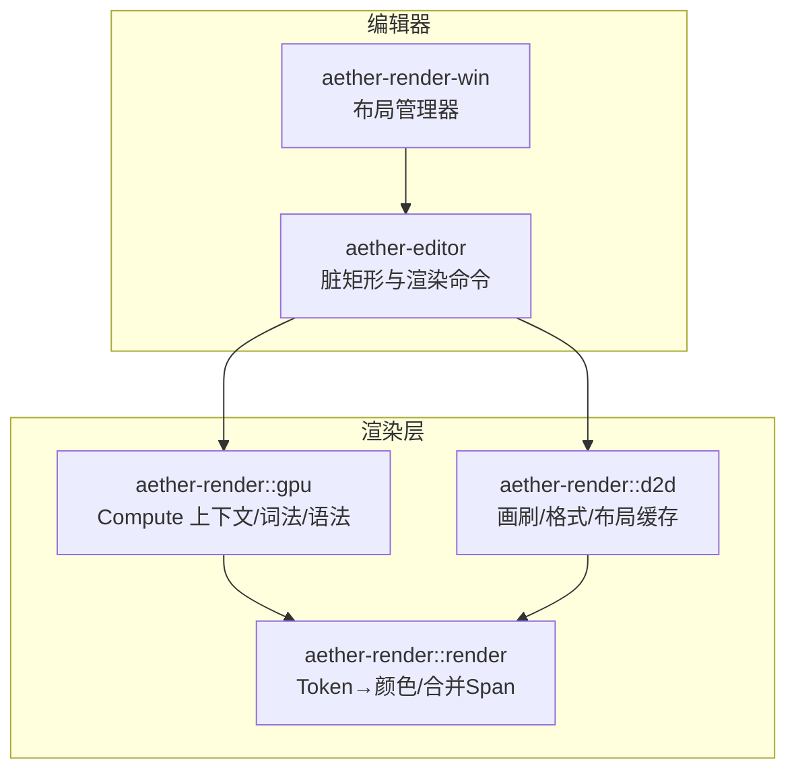
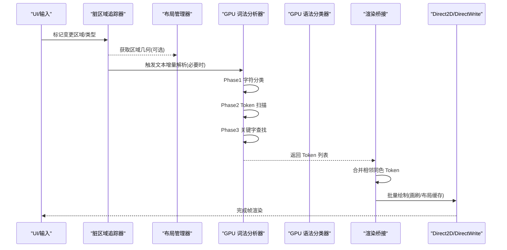
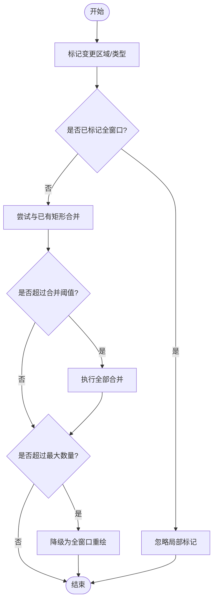
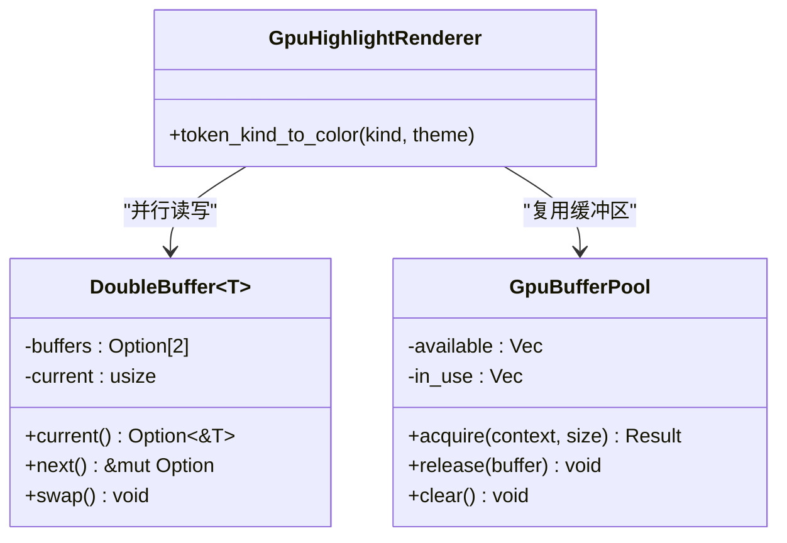
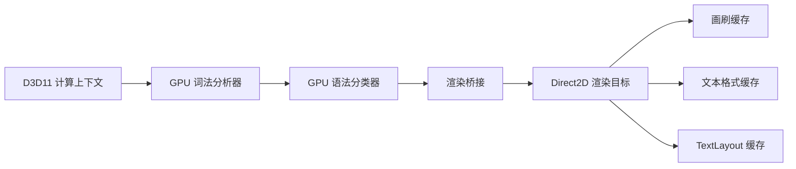
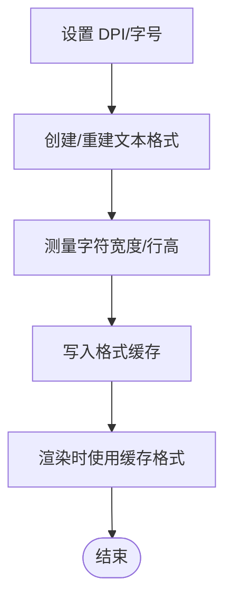
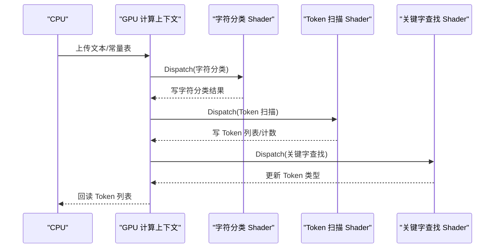
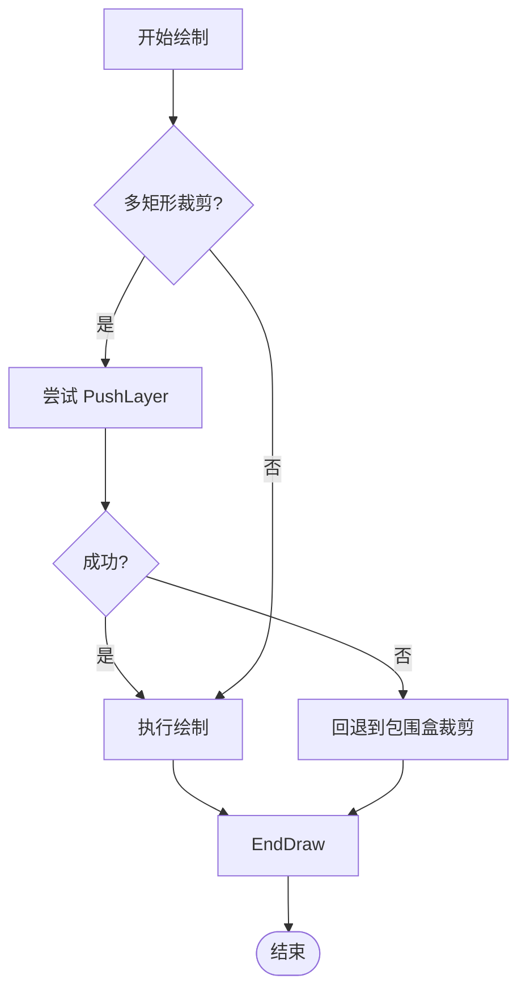
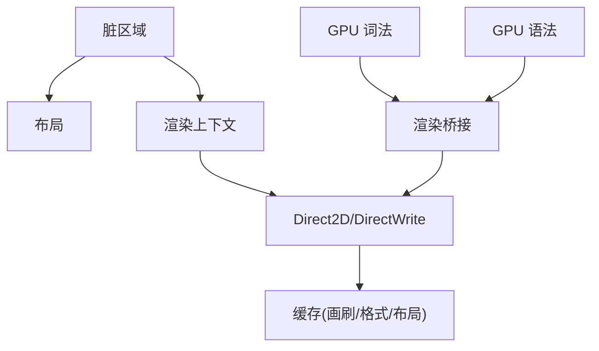

# 渲染优化

<cite>
**本文引用的文件**
- [crates/aether-editor/src/dirty_rect.rs](file://crates/aether-editor/src/dirty_rect.rs)
- [crates/aether-render/src/d2d/text.rs](file://crates/aether-render/src/d2d/text.rs)
- [crates/aether-render/src/d2d/brush_cache.rs](file://crates/aether-render/src/d2d/brush_cache.rs)
- [crates/aether-render/src/gpu/render.rs](file://crates/aether-render/src/gpu/render.rs)
- [crates/aether-render/src/gpu/buffer.rs](file://crates/aether-render/src/gpu/buffer.rs)
- [crates/aether-render/src/gpu/compute_context.rs](file://crates/aether-render/src/gpu/compute_context.rs)
- [crates/aether-render/src/gpu/lexer.rs](file://crates/aether-render/src/gpu/lexer.rs)
- [crates/aether-render/src/gpu/syntax.rs](file://crates/aether-render/src/gpu/syntax.rs)
- [crates/aether-render-win/src/render_context.rs](file://crates/aether-render-win/src/render_context.rs)
- [crates/aether-render-win/src/layout.rs](file://crates/aether-render-win/src/layout.rs)
</cite>

## 目录
1. [简介](#简介)
2. [项目结构](#项目结构)
3. [核心组件](#核心组件)
4. [架构总览](#架构总览)
5. [详细组件分析](#详细组件分析)
6. [依赖关系分析](#依赖关系分析)
7. [性能考量](#性能考量)
8. [故障排查指南](#故障排查指南)
9. [结论](#结论)
10. [附录](#附录)

## 简介
本技术文档聚焦于编辑器渲染优化，围绕以下目标展开：
- 脏区域计算与增量更新：最小重绘范围确定、重叠合并与降级策略。
- 批量绘制与 GPU 批处理：绘制命令合并、GPU 缓冲区复用与并行词法/语法分析。
- 硬件加速管线：Direct2D/DirectWrite 高效使用、D3D11 Compute Shader 管线。
- 文本渲染优化：字体缓存、字符宽度测量、布局缓存与 DPI/字号缩放。
- 性能监控与分析：指标采集与瓶颈定位方法。
- 常见问题诊断与解决方案：设备丢失、内存增长、掉帧等。
- 最佳实践与调优技巧：面向开发者的可操作建议。

## 项目结构
本项目将渲染相关能力拆分为多个 crate：
- aether-editor：脏矩形追踪与渲染命令推断（CPU 侧）。
- aether-render：Direct2D/DirectWrite 资源缓存、GPU 计算上下文、词法/语法分类、渲染桥接。
- aether-render-win：窗口级渲染上下文封装、裁剪与多矩形裁剪、常用资源预初始化。
- aether-render-win::layout：UI 区域布局与尺寸计算，为脏区域与裁剪提供几何基础。

图表来源
- [crates/aether-editor/src/dirty_rect.rs:1-426](file://crates/aether-editor/src/dirty_rect.rs#L1-L426)
- [crates/aether-render/src/d2d/brush_cache.rs:1-558](file://crates/aether-render/src/d2d/brush_cache.rs#L1-L558)
- [crates/aether-render/src/gpu/compute_context.rs:1-399](file://crates/aether-render/src/gpu/compute_context.rs#L1-L399)
- [crates/aether-render/src/gpu/lexer.rs:1-430](file://crates/aether-render/src/gpu/lexer.rs#L1-L430)
- [crates/aether-render/src/gpu/render.rs:1-220](file://crates/aether-render/src/gpu/render.rs#L1-L220)
- [crates/aether-render-win/src/layout.rs:1-800](file://crates/aether-render-win/src/layout.rs#L1-L800)

章节来源
- [crates/aether-editor/src/dirty_rect.rs:1-426](file://crates/aether-editor/src/dirty_rect.rs#L1-L426)
- [crates/aether-render/src/d2d/brush_cache.rs:1-558](file://crates/aether-render/src/d2d/brush_cache.rs#L1-L558)
- [crates/aether-render/src/gpu/compute_context.rs:1-399](file://crates/aether-render/src/gpu/compute_context.rs#L1-L399)
- [crates/aether-render/src/gpu/lexer.rs:1-430](file://crates/aether-render/src/gpu/lexer.rs#L1-L430)
- [crates/aether-render/src/gpu/render.rs:1-220](file://crates/aether-render/src/gpu/render.rs#L1-L220)
- [crates/aether-render-win/src/layout.rs:1-800](file://crates/aether-render-win/src/layout.rs#L1-L800)

## 核心组件
- 脏区域追踪器：记录并合并重叠脏矩形，支持按区域类型判断是否需要重绘；当脏矩形过多时降级为全窗口重绘。
- 渲染命令推断：根据状态变化（光标、选择、文本编辑、滚动、面板变化）推断最小重绘范围，无变化时跳过渲染。
- Direct2D/DirectWrite 缓存：画刷缓存、文本格式缓存、TextLayout 缓存，避免每帧创建 COM 对象。
- GPU 计算上下文：封装 D3D11 设备/上下文、缓冲区创建、Shader 编译与调度、数据回读。
- GPU 词法/语法分析：三阶段 Compute Shader 流水线（字符分类→Token 扫描→关键字查找），输出 Token 列表与语法分类。
- 渲染桥接：将 GPU Token 映射为主题颜色，合并相邻同色 Token 减少 DrawText 调用次数。
- 渲染上下文：封装渲染目标、裁剪、常用资源预初始化、设备丢失处理。

章节来源
- [crates/aether-editor/src/dirty_rect.rs:1-426](file://crates/aether-editor/src/dirty_rect.rs#L1-L426)
- [crates/aether-render/src/d2d/brush_cache.rs:1-558](file://crates/aether-render/src/d2d/brush_cache.rs#L1-L558)
- [crates/aether-render/src/gpu/compute_context.rs:1-399](file://crates/aether-render/src/gpu/compute_context.rs#L1-L399)
- [crates/aether-render/src/gpu/lexer.rs:1-430](file://crates/aether-render/src/gpu/lexer.rs#L1-L430)
- [crates/aether-render/src/gpu/render.rs:1-220](file://crates/aether-render/src/gpu/render.rs#L1-L220)
- [crates/aether-render-win/src/render_context.rs:1-233](file://crates/aether-render-win/src/render_context.rs#L1-L233)

## 架构总览
下图展示了从 UI 事件到最终渲染的完整路径，包括脏区域计算、GPU 并行词法/语法分析、以及 Direct2D 批量绘制。

图表来源
- [crates/aether-editor/src/dirty_rect.rs:1-426](file://crates/aether-editor/src/dirty_rect.rs#L1-L426)
- [crates/aether-render/src/gpu/lexer.rs:187-221](file://crates/aether-render/src/gpu/lexer.rs#L187-L221)
- [crates/aether-render/src/gpu/syntax.rs:93-124](file://crates/aether-render/src/gpu/syntax.rs#L93-L124)
- [crates/aether-render/src/gpu/render.rs:74-126](file://crates/aether-render/src/gpu/render.rs#L74-L126)
- [crates/aether-render/src/d2d/brush_cache.rs:24-105](file://crates/aether-render/src/d2d/brush_cache.rs#L24-L105)

## 详细组件分析

### 脏区域计算与增量更新
- 区域类型与合并：支持标题栏、菜单栏、活动栏、侧边栏、编辑器内容、标签栏、状态栏、右侧/底部面板、对话框、全窗口等类型；相同类型的重叠矩形会被合并，减少绘制调用。
- 阈值与降级：当脏矩形数量超过阈值或达到最大限制时，自动降级为全窗口重绘，保证稳定性。
- 便捷标记：提供单行区域、光标区域、状态栏等快捷标记方法。
- 渲染命令推断：基于状态变化推断最小重绘范围，无变化时直接跳过渲染。

图表来源
- [crates/aether-editor/src/dirty_rect.rs:114-162](file://crates/aether-editor/src/dirty_rect.rs#L114-L162)
- [crates/aether-editor/src/dirty_rect.rs:336-356](file://crates/aether-editor/src/dirty_rect.rs#L336-L356)

章节来源
- [crates/aether-editor/src/dirty_rect.rs:1-426](file://crates/aether-editor/src/dirty_rect.rs#L1-L426)

### 批量绘制与 GPU 批处理优化
- 绘制命令合并：将相邻且同色的 Token 合并为单个 Span，显著减少 DrawText 调用次数。
- GPU 缓冲区池：复用 ID3D11Buffer，避免频繁分配/释放，降低 CPU/GPU 同步开销。
- 双缓冲：实现 CPU/GPU 并行处理，避免等待，提升吞吐。
- 主题颜色映射：将 TokenKind 映射到主题颜色，配合画刷缓存进行批量绘制。

图表来源
- [crates/aether-render/src/gpu/render.rs:74-220](file://crates/aether-render/src/gpu/render.rs#L74-L220)

章节来源
- [crates/aether-render/src/gpu/render.rs:1-220](file://crates/aether-render/src/gpu/render.rs#L1-L220)

### 硬件加速渲染管线（Direct2D/DirectWrite + D3D11）
- Direct2D 渲染目标：封装 HWND 渲染目标、Begin/EndDraw、Clear、Clip 等。
- DirectWrite 文本：工厂、文本格式、布局、精确测量字符宽度与位置，支持 DPI/字号缩放。
- D3D11 Compute Shader：字符分类、Token 扫描、关键字查找三阶段并行处理；结构化缓冲区与 UAV 管理。
- 资源缓存：画刷缓存、文本格式缓存、TextLayout 缓存，避免每帧创建 COM 对象。

图表来源
- [crates/aether-render/src/d2d/text.rs:1-153](file://crates/aether-render/src/d2d/text.rs#L1-L153)
- [crates/aether-render/src/d2d/brush_cache.rs:107-497](file://crates/aether-render/src/d2d/brush_cache.rs#L107-L497)
- [crates/aether-render/src/gpu/compute_context.rs:17-399](file://crates/aether-render/src/gpu/compute_context.rs#L17-L399)
- [crates/aether-render/src/gpu/lexer.rs:48-221](file://crates/aether-render/src/gpu/lexer.rs#L48-L221)
- [crates/aether-render/src/gpu/syntax.rs:39-124](file://crates/aether-render/src/gpu/syntax.rs#L39-L124)

章节来源
- [crates/aether-render/src/d2d/text.rs:1-153](file://crates/aether-render/src/d2d/text.rs#L1-L153)
- [crates/aether-render/src/d2d/brush_cache.rs:1-558](file://crates/aether-render/src/d2d/brush_cache.rs#L1-L558)
- [crates/aether-render/src/gpu/compute_context.rs:1-399](file://crates/aether-render/src/gpu/compute_context.rs#L1-L399)
- [crates/aether-render/src/gpu/lexer.rs:1-430](file://crates/aether-render/src/gpu/lexer.rs#L1-L430)
- [crates/aether-render/src/gpu/syntax.rs:1-289](file://crates/aether-render/src/gpu/syntax.rs#L1-L289)

### 文本渲染的性能优化策略
- 字体缓存与 DPI/字号缩放：通过 DirectWrite 工厂创建文本格式，支持 DPI 缩放与用户字号调整，动态重建格式并重新测量字符宽度。
- 字符宽度测量：使用 TextLayout 实测等宽字体推进宽度，避免硬编码导致的偏差。
- 布局缓存：TextLayout 缓存采用两代淘汰策略（young/old），热点条目自然存活，消除周期性缓存雪崩。
- 精确命中测试：利用 HitTestTextPosition 获取光标 x 坐标，确保点击/光标定位准确。

图表来源
- [crates/aether-render/src/d2d/text.rs:69-127](file://crates/aether-render/src/d2d/text.rs#L69-L127)
- [crates/aether-render/src/d2d/brush_cache.rs:107-313](file://crates/aether-render/src/d2d/brush_cache.rs#L107-L313)
- [crates/aether-render/src/d2d/brush_cache.rs:381-497](file://crates/aether-render/src/d2d/brush_cache.rs#L381-L497)

章节来源
- [crates/aether-render/src/d2d/text.rs:1-153](file://crates/aether-render/src/d2d/text.rs#L1-L153)
- [crates/aether-render/src/d2d/brush_cache.rs:1-558](file://crates/aether-render/src/d2d/brush_cache.rs#L1-L558)

### GPU 词法/语法分析流水线
- 三阶段 Compute Shader：字符分类→Token 扫描→关键字查找，充分利用 GPU 并行能力。
- 缓冲区管理：结构化缓冲区、UAV、计数器缓冲区，支持异步回读。
- 语言模式匹配：基于 Token 序列的简单语法模式识别，置信度阈值融合 CPU 结果。

图表来源
- [crates/aether-render/src/gpu/lexer.rs:187-221](file://crates/aether-render/src/gpu/lexer.rs#L187-L221)
- [crates/aether-render/src/gpu/compute_context.rs:232-272](file://crates/aether-render/src/gpu/compute_context.rs#L232-L272)
- [crates/aether-render/src/gpu/syntax.rs:93-124](file://crates/aether-render/src/gpu/syntax.rs#L93-L124)

章节来源
- [crates/aether-render/src/gpu/lexer.rs:1-430](file://crates/aether-render/src/gpu/lexer.rs#L1-L430)
- [crates/aether-render/src/gpu/syntax.rs:1-289](file://crates/aether-render/src/gpu/syntax.rs#L1-L289)
- [crates/aether-render/src/gpu/compute_context.rs:1-399](file://crates/aether-render/src/gpu/compute_context.rs#L1-L399)

### 渲染上下文与裁剪优化
- 渲染目标封装：Begin/EndDraw、Clear、Resize、DPI 设置。
- 多矩形裁剪：单矩形走快路径，多矩形尝试 PushLayer，失败则回退到包围盒裁剪。
- 常用资源预初始化：在渲染目标就绪后预创建常用画刷与文本格式，提升首帧与热路径性能。
- 设备丢失处理：清空目标与缓存，支持恢复。

图表来源
- [crates/aether-render-win/src/render_context.rs:65-155](file://crates/aether-render-win/src/render_context.rs#L65-L155)
- [crates/aether-render-win/src/render_context.rs:189-233](file://crates/aether-render-win/src/render_context.rs#L189-L233)

章节来源
- [crates/aether-render-win/src/render_context.rs:1-233](file://crates/aether-render-win/src/render_context.rs#L1-L233)

## 依赖关系分析
- 脏区域与布局：脏区域依赖布局提供的区域几何信息，用于精确标记与裁剪。
- 渲染桥接与 GPU：渲染桥接依赖 GPU 输出的 Token 列表，将其转换为主题颜色并合并。
- 缓存与 D2D：画刷/格式/布局缓存依赖 Direct2D/DirectWrite 对象，需随设备丢失清理。
- GPU 上下文与 Shader：Compute Shader 依赖 D3D11 设备/上下文，缓冲区生命周期由上下文管理。

图表来源
- [crates/aether-editor/src/dirty_rect.rs:1-426](file://crates/aether-editor/src/dirty_rect.rs#L1-L426)
- [crates/aether-render-win/src/layout.rs:1-800](file://crates/aether-render-win/src/layout.rs#L1-L800)
- [crates/aether-render/src/gpu/render.rs:1-220](file://crates/aether-render/src/gpu/render.rs#L1-L220)
- [crates/aether-render/src/d2d/brush_cache.rs:1-558](file://crates/aether-render/src/d2d/brush_cache.rs#L1-L558)

章节来源
- [crates/aether-editor/src/dirty_rect.rs:1-426](file://crates/aether-editor/src/dirty_rect.rs#L1-L426)
- [crates/aether-render-win/src/layout.rs:1-800](file://crates/aether-render-win/src/layout.rs#L1-L800)
- [crates/aether-render/src/gpu/render.rs:1-220](file://crates/aether-render/src/gpu/render.rs#L1-L220)
- [crates/aether-render/src/d2d/brush_cache.rs:1-558](file://crates/aether-render/src/d2d/brush_cache.rs#L1-L558)

## 性能考量
- 脏区域合并与降级：合理设置合并阈值与最大数量，避免过多小矩形导致绘制膨胀；必要时降级为全窗口重绘。
- 绘制命令推断：无状态变化时跳过渲染，减少不必要的 GPU/CPU 工作。
- 缓存命中率：预热常用画刷与文本格式；TextLayout 两代淘汰避免周期性雪崩。
- GPU 并行：尽量使用 Compute Shader 进行文本分析与分类，减少 CPU 瓶颈。
- 缓冲区复用：使用 GPU 缓冲区池与双缓冲，降低分配/同步成本。
- 裁剪优化：优先使用单矩形快路径，多矩形尝试 PushLayer，失败回退包围盒。

[本节为通用指导，不直接分析具体文件]

## 故障排查指南
- 设备丢失：检查渲染上下文 handle_device_lost/release_for_suspend，确保清空目标与缓存并在恢复后重建。
- 内存增长：关注缓存条目上限（画刷/格式/布局），超出时触发清理或换代；避免无界增长。
- 掉帧/卡顿：检查脏矩形数量是否过多导致频繁合并/降级；评估 GPU 词法/语法分析耗时与回读开销。
- 文本错位：确认字符宽度测量与布局缓存一致性；检查 DPI/字号变化后缓存是否失效。
- 调试指标：统计 dirty_count、渲染命令类型分布、GPU 分派组数、缓冲区大小与复用率。

章节来源
- [crates/aether-render-win/src/render_context.rs:219-233](file://crates/aether-render-win/src/render_context.rs#L219-L233)
- [crates/aether-render/src/d2d/brush_cache.rs:18-22](file://crates/aether-render/src/d2d/brush_cache.rs#L18-L22)
- [crates/aether-editor/src/dirty_rect.rs:358-365](file://crates/aether-editor/src/dirty_rect.rs#L358-L365)

## 结论
本项目通过脏区域计算、批量绘制、GPU 并行词法/语法分析以及丰富的资源缓存机制，构建了高效的渲染优化体系。结合合理的阈值与降级策略、设备丢失处理与缓存管理，能够在复杂 UI 场景下保持流畅体验。开发者应重点关注脏区域合并效率、GPU 流水线吞吐、缓存命中率与回读开销，持续优化以提升整体性能。

[本节为总结性内容，不直接分析具体文件]

## 附录
- 最佳实践清单
  - 使用脏区域追踪器标记最小变更区域，避免全量重绘。
  - 启用渲染命令推断，在无状态变化时跳过渲染。
  - 预热常用画刷与文本格式，提升首帧与热路径性能。
  - 使用 GPU 词法/语法分析，减少 CPU 负载。
  - 复用 GPU 缓冲区与双缓冲，降低分配/同步成本。
  - 优先单矩形裁剪，多矩形尝试 PushLayer，失败回退包围盒。
  - 监控缓存条目上限，防止内存增长与周期性雪崩。
  - 处理设备丢失，确保资源正确重建。

[本节为通用指导，不直接分析具体文件]